> This is a guest blog post by **Jorge Canton** from Plain Concepts. Jorge co-founded the technology start-up Syderis and dedicated over 12 years to specializing in computer graphics, game engines, and graphics tools. Currently, he holds the position of Research Director at <a href=https://www.plainconcepts.com/>Plain Concepts</a>, where he is actively involved in the development of <a href=https://evergine.com//>Evergine</a>, a cutting-edge 3D graphics engine tailored for industry applications.

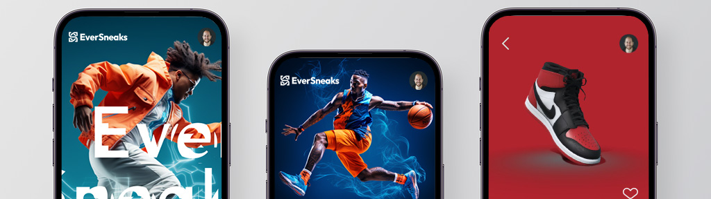

Have you ever used an e-commerce platform and wished you could visualize products from any angle using a 3D representation instead of static images? Have you ever looked at a map of a large shopping mall and thought it would be much easier to navigate if you could explore a 3D map? In this article, we will learn how to achieve all of this and more using .NET .NET MAUI.

## What is Evergine?
Evergine is a cross-platform 3D engine developed in C# back in 2012. Evergine is renowned for its seamless integration capabilities, making it a top choice for industrial projects. It can easily be incorporated into existing projects or paired with other technologies. With Evergine, you can craft applications compatible with a wide range of platforms, including Windows, Linux, Android, iOS, Hololens, Meta Quest/Quest2/Quest Pro, Pico, and Web.

Evergine also boasts seamless integration with various UI technologies, including WPF, Forms, SDL, UWP, Html/Javascript, WinUI, and now, even .NET MAUI. We are committed to staying up to date with the latest .NET versions and tooling to provide our customers with the best possible experience.

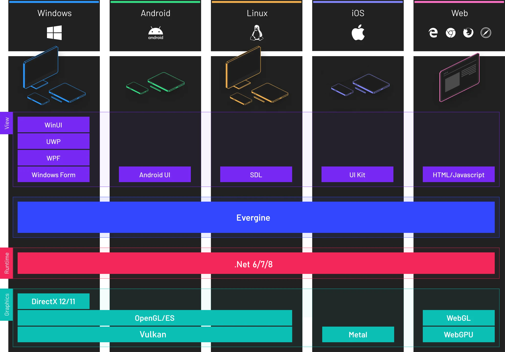

The key features of Evergine include:

<style>
td, th {
   border: none!important;
}
</style> 

|   |   |
|---|---|
|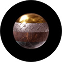| __Advanced PBR rendering__  <br/>Bring your application to a new level of realism using Physically based rendering and materials.|
| 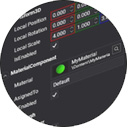 | __Component based graphics engine__ <br/>Evergine is a Component based Engine. This allows us to reduce the complexibility and overall development cost of your applications.|
| 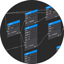 | __Customizable RenderPipeline and RenderPath__ <br/>Customize the way that Evergine render your applications to adapt to new scenarios.|
|  | __Physics Engine simulations__ <br/>Simulate a wide range of physics behaviors, collisions, and joints, both in 3D and 2D.|
| 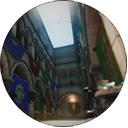 | __Advanced Post-Processing pipeline__ <br/> Increase the realism of your application using post-Proccessing effects like Tone Mapping, SSR, SSAO, TAA, and much more! |
|  | __Photometric Lighting and Cameras__ <br/> Use real lightning units and setup your virtual camera using advanced exposure parameters.|
|  | __Modern graphics API support__ <br/>Increase the performance of your applications thanks to next generation graphics APIs: DirectX12, Vulkan and Metal. Apart from this, Evergine supports DirectX11, OpenGL (ES) and WebGL. |
| 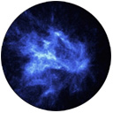 | __Modern GPU Particles__ <br/>3D and 2D particles can be used to enhance the visuals of your app, creating a wide range of effects. |
| 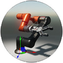 | __Advanced Animation System__ <br/>The animation system extracts the object, skeleton and morphing animations of your 3d models, easing the blending between them. Lot of options are offered, like synchronized blending and multiple tracks at the same time. |

<br/>

Evergine is entirely __free to use, with no licensing fees or royalties__, making it suitable for both commercial and non-commercial projects. Evergine's business model revolves around providing additional services such as:

* [Priority Support](https://evergine.com/priority-support/)
We provide assistance and technical support for any questions or problems you may have using Evergine on your projects with a 72h SLA.
* [Source Code Access](https://evergine.com/source-code/)
We grant you total access to the source code of Evergine.
* [Professional Services](mailto:info@evergine.com)
You will have access to training sessions, one-to-one sessions, proof of concepts and new features according to your needs.

Prices are available on the [official web site](https://evergine.com/)

## How Evergine works with .NET .NET MAUI

In the latest Evergine release, a new .NET MAUI project template has been introduced. With this template, Evergine enables you to create a standard .NET MAUI project that incorporates an EvergineView control, which can be seamlessly integrated into any view of your application. This EvergineView serves as a canvas for a 3D scene generated by Evergine, allowing you to configure it using Evergine Studio.

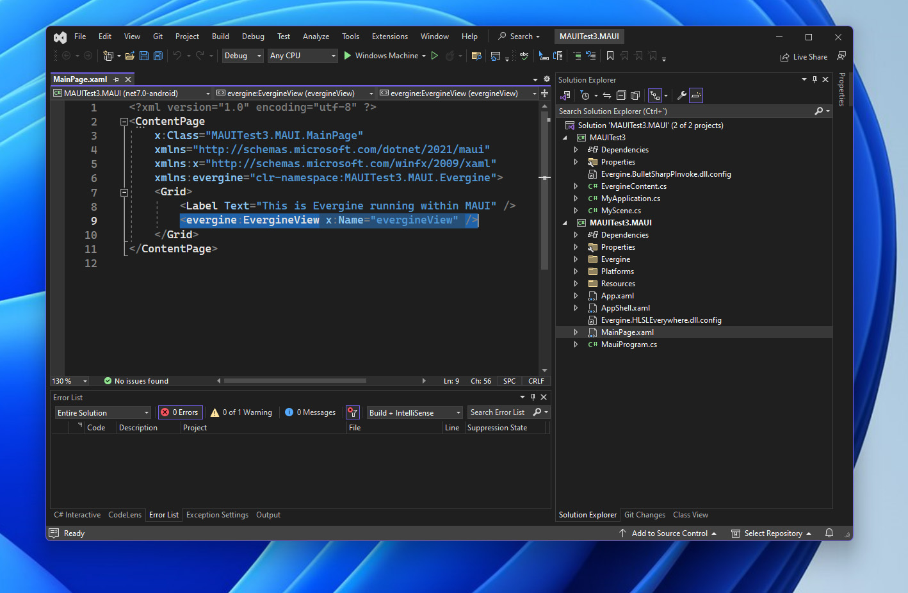

The EvergineView is an abstract custom .NET MAUI control that enables you to work seamlessly across Windows, Android, and iOS platforms.

```csharp
 public class EvergineView : View
 {
     public static readonly BindableProperty ApplicationProperty =
         BindableProperty.Create(nameof(Application), typeof(EvergineApplication), typeof(EvergineView), null);

     public static readonly BindableProperty DisplayNameProperty =
         BindableProperty.Create(nameof(DisplayName), typeof(string), typeof(EvergineView), string.Empty);

     public EvergineApplication Application
     {
         get { return (EvergineApplication)this.GetValue(ApplicationProperty); }
         set { this.SetValue(ApplicationProperty, value); }
     }

     public string DisplayName
     {
         get { return (string)this.GetValue(DisplayNameProperty); }
         set { this.SetValue(DisplayNameProperty, value); }
     }

     public event EventHandler PointerPressed;

     public event EventHandler PointerMoved;

     public event EventHandler PointerReleased;

     internal void StartInteraction() => this.PointerPressed?.Invoke(this, EventArgs.Empty);

     internal void MovedInteraction() => this.PointerMoved?.Invoke(this, EventArgs.Empty);

     internal void EndInteraction() => this.PointerReleased?.Invoke(this, EventArgs.Empty);
 }
```

On the flip side, the rendering implementation was created using a [custom handler](https://learn.microsoft.com/dotnet/maui/user-interface/handlers/) for each platform. The following code serves as an example of the Android handler.

```csharp
  public partial class EvergineViewHandler : ViewHandler<EvergineView, AndroidSurfaceView>
  {
      private AndroidSurface androidSurface;
      private AndroidWindowsSystem windowsSystem;

      public EvergineViewHandler(IPropertyMapper mapper, CommandMapper commandMapper = null)
         : base(mapper, commandMapper)
      { }

      public static void MapApplication(EvergineViewHandler handler, EvergineView evergineView)
      {
          handler.UpdateApplication(evergineView, evergineView.DisplayName);
      }

      internal void UpdateApplication(EvergineView view, string displayName)
      {
          if (view.Application is null) { return; }
              
          // Register Windows system
          view.Application.Container.RegisterInstance(this.windowsSystem);

          // Creates XAudio device
          var xaudio = new global::Evergine.OpenAL.ALAudioDevice();
          view.Application.Container.RegisterInstance(xaudio);

          System.Diagnostics.Stopwatch clockTimer = System.Diagnostics.Stopwatch.StartNew();
          this.windowsSystem.Run(
          () =>
          {
              this.ConfigureGraphicsContext(view.Application as SneakerApp.MyApplication, this.androidSurface);
              view.Application.Initialize();
          },
          () =>
          {
              var gameTime = clockTimer.Elapsed;
              clockTimer.Restart();

              view.Application.UpdateFrame(gameTime);
              view.Application.DrawFrame(gameTime);
          });
      }

      protected override AndroidSurfaceView CreatePlatformView()
      {
          this.windowsSystem = new AndroidWindowsSystem(this.Context);
          this.androidSurface = this.windowsSystem.CreateSurface(0, 0) as AndroidSurface;
          return this.androidSurface.NativeSurface;
      }

      private void ConfigureGraphicsContext(MyApplication application, Surface surface)
      {
          var graphicsContext = new VKGraphicsContext();
          graphicsContext.CreateDevice();
          SwapChainDescription swapChainDescription = new SwapChainDescription()
          {
              SurfaceInfo = surface.SurfaceInfo,
              Width = surface.Width,
              Height = surface.Height,
              ColorTargetFormat = PixelFormat.R8G8B8A8_UNorm,
              ColorTargetFlags = TextureFlags.RenderTarget | TextureFlags.ShaderResource,
              DepthStencilTargetFormat = PixelFormat.D24_UNorm_S8_UInt,
              DepthStencilTargetFlags = TextureFlags.DepthStencil,
              SampleCount = TextureSampleCount.None,
              IsWindowed = true,
              RefreshRate = 60,
          };
          var swapChain = graphicsContext.CreateSwapChain(swapChainDescription);
          swapChain.VerticalSync = true;

          var graphicsPresenter = application.Container.Resolve<GraphicsPresenter>();
          var firstDisplay = new global::Evergine.Framework.Graphics.Display(surface, swapChain);
          graphicsPresenter.AddDisplay("DefaultDisplay", firstDisplay);

          application.Container.RegisterInstance(graphicsContext);

          surface.OnScreenSizeChanged += (_, args) =>
          {
              swapChain.ResizeSwapChain(args.Height, args.Width);
          };
      }
  }
```
In addition, the registration of the Evergine custom handler is performed in the _MauiProgram.cs_ file of your project.

```csharp
    public static class .NET MAUIProgram
    {
        public static .NET MAUIApp CreateMauiApp()
        {
            var builder = .NET MAUIApp.CreateBuilder();
            builder
                .UseMauiApp<App>()
                .UseMauiEvergine()
                .ConfigureFonts(fonts =>
                {
                    fonts.AddFont("OpenSans-Regular.ttf", "OpenSansRegular");
                    fonts.AddFont("OpenSans-Semibold.ttf", "OpenSansSemibold");
                });

#if DEBUG
		builder.Logging.AddDebug();
#endif

            return builder.Build();
        }
    }
```


Finally, a 3D scene can be quite intricate and may comprise various assets, such as textures, materials, and models, etc. Evergine conveniently packages and transfers all 3D scene assets as raw assets to the device. To accomplish this, the Evergine template incorporates specific targets that label the 3D content as _MauiAsset_ and injects it into the .NET MAUI target pipeline.

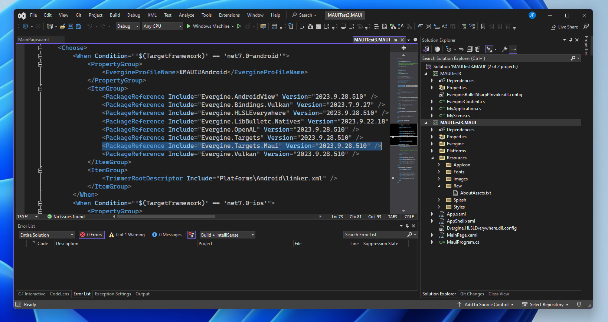

## Getting Started

After downloading and installing Evergine from the [official website](https://evergine.com),  the Evergine launcher is the first thing you'll encounter. It enables you to manage different versions, create new projects using various project templates, access sample projects, and find links to support and documentation.

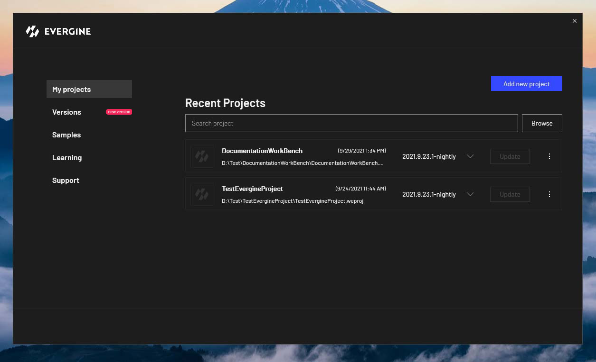

To initiate a new project from the Evergine launcher, navigate to the _My Projects_ section and click on the _Add New Project_ button

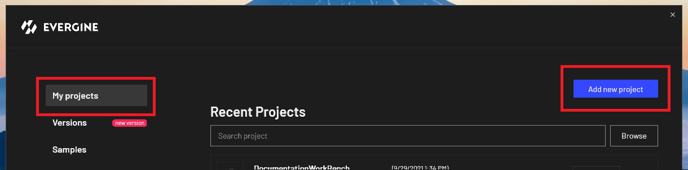

The project configuration window will open, allowing you to select the Project Name, the disk location for your project, and the desired Evergine version to use. Additionally, you have the option to choose the new .NET MAUI template.

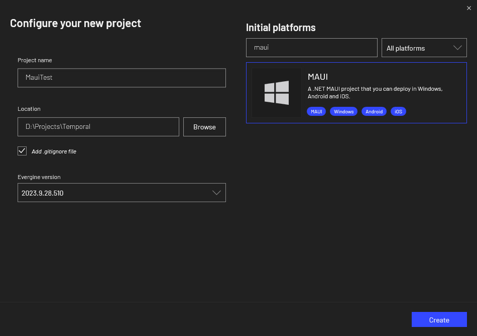

After clicking the _Create_ button, Evergine Studio will open. You can then add any primitive object to the scene and attach a Spinner component with values {x:1, y:2, z:3} to enable rotation of the primitive.

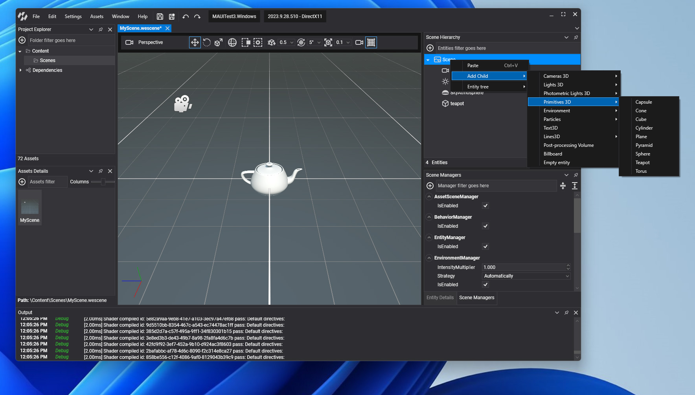

To access the .NET MAUI solution, simply open it from the _File_ menu in Evergine Studio. 

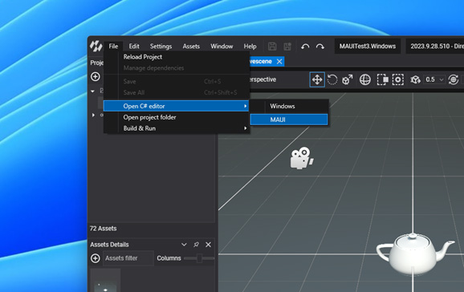

When you launch the .NET MAUI solution in Visual Studio, you'll discover two integrated projects within the solution. The first project is your Evergine project that you share between all templates, and the second is the .NET MAUI project, which references the Evergine project.

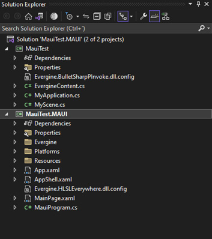

Inside the .NET MAUI project, you'll find the _Platform_ folder, which houses platform-specific resources like the Android Manifest and Info.plist files. Within the Evergine folder, you'll come across the EvergineView control. This control can be effortlessly integrated into your XAML pages, enabling you to include an Evergine canvas for rendering your 3D scenes.


To deploy your project on various platforms, utilize the _Run/Deploy_ button in Visual Studio. Please note that for iOS deployment, you'll need to establish a connection between Visual Studio and a Mac, and have an iOS device (iPad or iPhone) linked to your Mac.

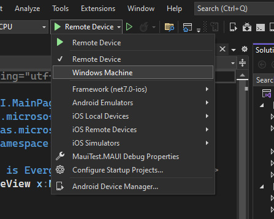

Once you've successfully deployed your project within your .NET MAUI solution, you'll attain results akin to the example depicted above. This showcases a fundamental XAML page in .NET MAUI, incorporating a Label and an EvergineView. While this serves as an example, you have the creative freedom to craft exceptional projects leveraging the latest .NET technologies and Evergine.

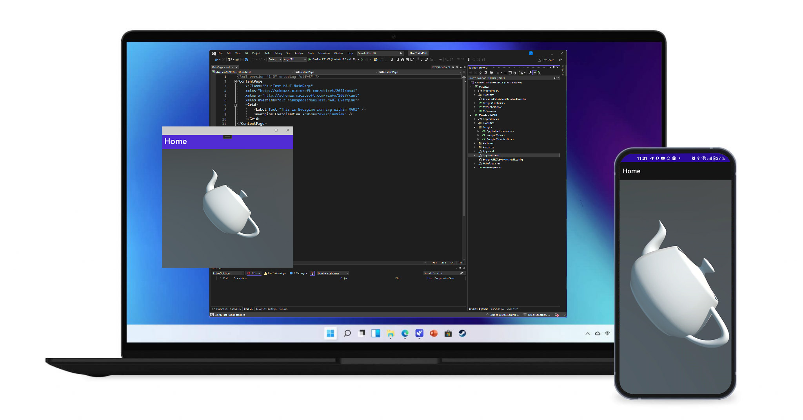

You can explore our showcase app, which demonstrates how to seamlessly blend mobile app UI with 3D content and effectively communicate between Evergine and .NET MAUI UI.

__EverSneaks showcase app__  

Repository: https://github.com/EvergineTeam/EverSneaks
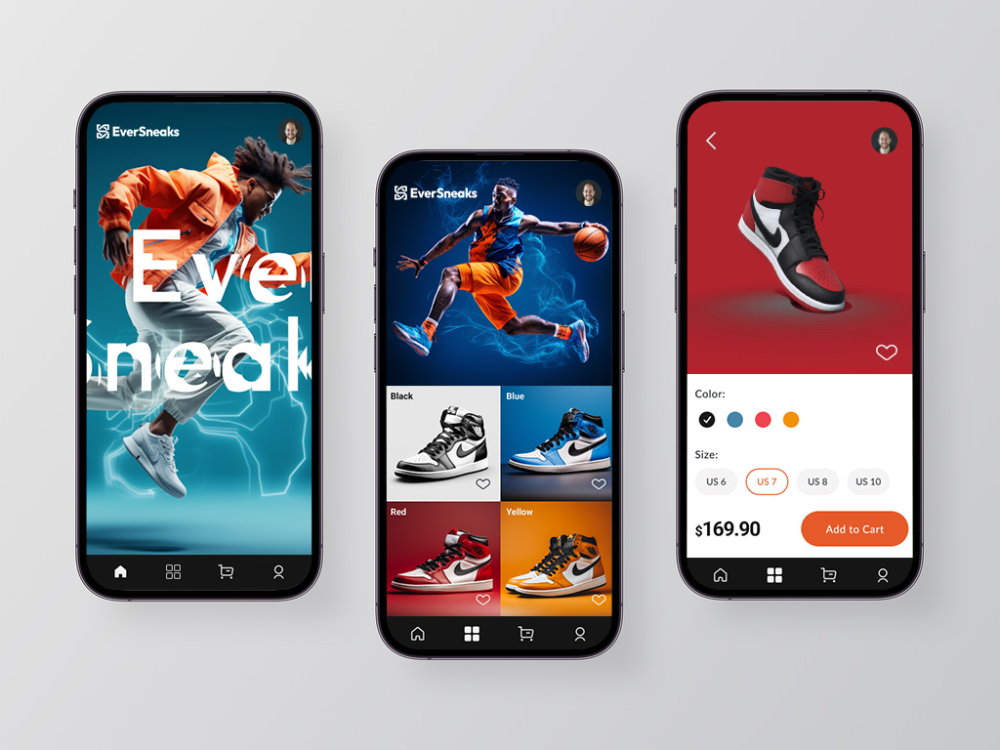

__CarRental showcase app__ (by [@Javier Suarez](https://github.com/jsuarezruiz))

Repository: https://github.com/jsuarezruiz/netmaui-carrental-app-challenge
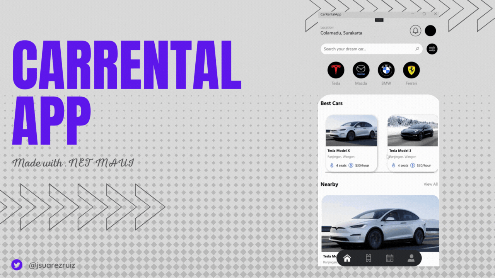

## Evergine main resources

In the official Evergine website you can find a lot of interesting resources to getting started with Evergine, the following are the most important.


* __Evergine documentation:__ https://docs.evergine.com/2023.9.28/manual/index.html
* __Samples repository:__ https://github.com/EvergineTeam/Samples
* __Video tutorials:__ https://evergine.com/es/videotutoriales/
* __Youtube channel:__ https://www.youtube.com/channel/UCpA-X92rxM0OuywdVcir9mA
* __Feedback:__ https://github.com/EvergineTeam/Feedback/issues
* __Contact:__ https://evergine.com/contact/ 

## Future

The current .NET MAUI template use .NET 7 stable version. After the .NET 8 stable version is released in November, we will update the .NET MAUI template to .NET 8 stable version to be available use the latest improvement and features.

We have full confidence that the community can craft exceptionally attractive applications by harnessing the power of these technologies. We're excited to see what you can create by combining 3D with .NET MAUI!.

We eagerly await your feedback. Happy coding with Evergine and .NET MAUI!