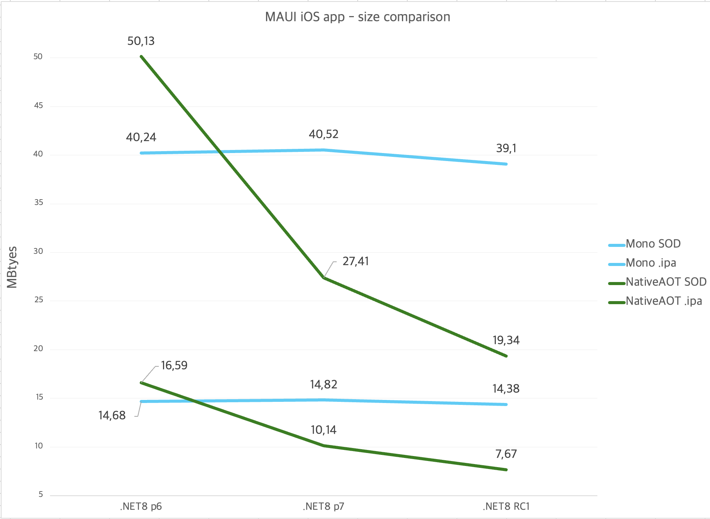
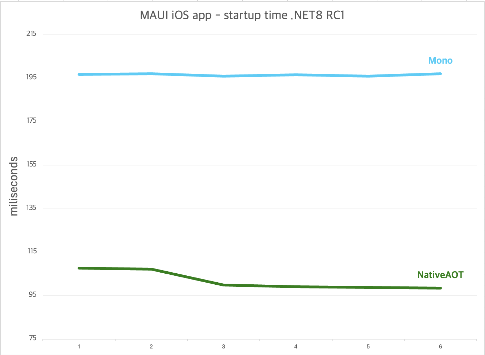
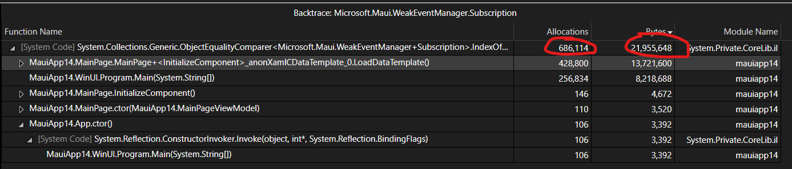
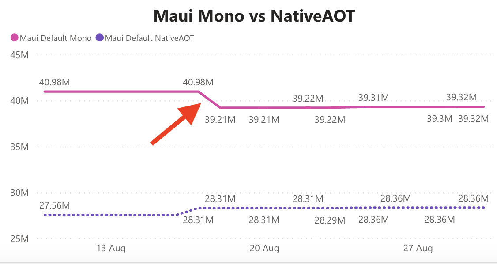
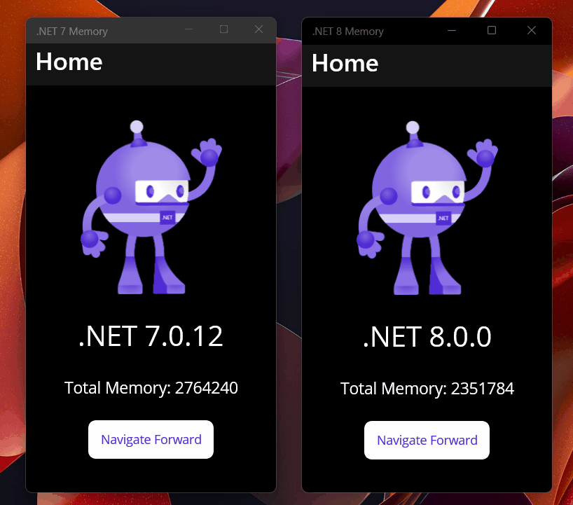
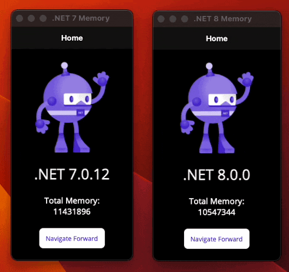

The major focus for .NET MAUI in the .NET 8 release is *quality*. As such, alot
of our focus has been fixing bugs instead of chasing lofty performance goals. In
.NET 8, we merged 1,559 pull requests that closed 596 total issues. These
include changes from the .NET MAUI team as well as the .NET MAUI community. We
are optimistic that this should result in a significant increase in quality in
.NET 8.

However! We still have plenty of performance changes to showcase. Building upon
the fundamental [performance improvements in .NET 8][net8perf] we discover
"low-hanging" fruit constantly, and there were high-voted performance issues on
GitHub we tried to tackle. Our goal is to continue to make .NET MAUI faster in
each release, read on for details!

For a review of the performance improvements in past releases, see our posts for
.NET 6 and 7. This also gives you an idea of the improvements you would see
migrating from Xamarin.Forms to .NET MAUI:

* [.NET 7 Performance Improvements in .NET MAUI][mauiperf7]
* [.NET 6 Performance Improvements in .NET MAUI][mauiperf6]

[net8perf]: https://devblogs.microsoft.com/dotnet/performance-improvements-in-net-8/
[mauiperf7]: https://devblogs.microsoft.com/dotnet/dotnet-7-performance-improvements-in-dotnet-maui/
[mauiperf6]: https://devblogs.microsoft.com/dotnet/performance-improvements-in-dotnet-maui/

## Table Of Contents

New features

* [`AndroidStripILAfterAOT`](#androidstripilafteraot)
* [`AndroidEnableMarshalMethods`](#androidenablemarshalmethods)
* [NativeAOT on iOS](#nativeaot-on-ios)

Build & Inner Loop Performance

* [Filter Android `ps -A` output with `grep`](#filter-android-ps--a-output-with-grep)
* [Port WindowsAppSDK usage of `vcmeta.dll` to C#](#port-windowsappsdk-usage-of-vcmetadll-to-c)
* [Improvements to remote iOS builds on Windows](#improvements-to-remote-ios-builds-on-windows)
* [Improvements to Android inner-loop](#improvements-to-android-inner-loop)
* [XAML Compilation no longer uses `LoadInSeparateAppDomain`](#xaml-compilation-no-longer-uses-loadinseparateappdomain)

Performance or App Size Improvements

* [Structs and `IEquatable` in .NET MAUI](#structs-and-iequatable-in-net-maui)
* [Fix performance issue in `{AppThemeBinding}`](#fix-performance-issue-in-appthemebinding)
* [Address `CA1307` and `CA1309` for performance](#address-ca1307-and-ca1309-for-performance)
* [Address `CA1311` for performance](#address-ca1311-for-performance)
* [Remove unused `ViewAttachedToWindow` event on Android](#remove-unused-viewattachedtowindow-event-on-android)
* [Remove unneeded `System.Reflection` for `{Binding}`](#remove-unneeded-systemreflection-for-binding)
* [Use `StringComparer.Ordinal` for `Dictionary` and `HashSet`](#use-stringcomparerordinal-for-dictionary-and-hashset)
* [Reduce Java interop in `MauiDrawable` on Android](#reduce-java-interop-in-mauidrawable-on-android)
* [Improve layout performance of `Label` on Android](#improve-layout-performance-of-label-on-android)
* [Reduce Java interop calls for controls in .NET MAUI](#reduce-java-interop-calls-for-controls-in-net-maui)
* [Improve performance of `Entry.MaxLength` on Android](#improve-performance-of-entrymaxlength-on-android)
* [Improve memory usage of `CollectionView` on Windows](#improve-memory-usage-of-collectionview-on-windows)
* [Use `UnmanagedCallersOnlyAttribute` on Apple platforms](#use-unmanagedcallersonlyattribute-on-apple-platforms)
* [Faster Java interop for strings on Android](#faster-java-interop-for-strings-on-android)
* [Faster Java interop for C# events on Android](#faster-java-interop-for-c-events-on-android)
* [Use Function Pointers for JNI](#use-function-pointers-for-jni)
* [Removed `Xamarin.AndroidX.Legacy.Support.V4`](#removed-xamarinandroidxlegacysupportv4)
* [Deduplication of generics on iOS and macOS](#deduplication-of-generics-on-ios-and-macos)
* [Fix `System.Linq.Expressions` implementation on iOS-like platforms](#fix-systemlinqexpressions-implementation-on-ios-like-platforms)
* [Set `DynamicCodeSupport=false` for iOS and Catalyst](#set-dynamiccodesupportfalse-for-ios-and-catalyst)

Memory Leaks

* [Memory Leaks and Quality](#memory-leaks-and-quality)
* [Diagnosing leaks in .NET MAUI](#diagnosing-leaks-in-net-maui)
* [Patterns that cause leaks: C# events](#patterns-that-cause-leaks-c-events)
* [Circular references on Apple platforms](#circular-references-on-apple-platforms)
* [Roslyn analyzer for Apple platforms](#roslyn-analyzer-for-apple-platforms)

Tooling and Documentation

* [Simplified `dotnet-trace` and `dotnet-dsrouter`](#simplified-dotnet-trace-and-dotnet-dsrouter)
* [`dotnet-gcdump` Support for Mobile](#dotnet-gcdump-support-for-mobile)

## New Features

### `AndroidStripILAfterAOT`

Once Upon A Time™ we had a brilliant thought: if AOT pre-compiles C# methods, do
we need the managed method anymore?  Removing the C# method body would allow
assemblies to be smaller. .NET iOS applications already do this, so why not
Android as well?

While the idea is straightforward, implementation was not: iOS uses ["Full"
AOT][full-aot], which AOT's *all* methods into a form that doesn't require a
runtime JIT. This allowed iOS to run [`cil-strip`][cil-strip], removing all
method bodies from all managed types.

At the time, Xamarin.Android only supported "normal" AOT, and normal AOT
requires a JIT for certain constructs such as generic types and generic methods.
This meant that attempting to run `cil-strip` would result in runtime errors if
a method body was removed that was actually required at runtime. This was
particularly bad because `cil-strip` could only remove *all* method bodies!

We are re-intoducing IL stripping for .NET 8. Add a new
`$(AndroidStripILAfterAOT)` MSBuild property. When true, the
`<MonoAOTCompiler/>` task will track which method bodies were actually AOT'd,
storing this information into `%(_MonoAOTCompiledAssemblies.MethodTokenFile)`,
and the new `<ILStrip/>` task will update the input assemblies, removing all
method bodies that can be removed.

By default enabling `$(AndroidStripILAfterAOT)` will *override* the default
`$(AndroidEnableProfiledAot)` setting, allowing all trimmable AOT'd methods to
be removed. This choice was made because `$(AndroidStripILAfterAOT)` is *most*
useful when AOT-compiling your entire application. Profiled AOT and IL stripping
can be used together by explicitly setting both within the `.csproj`, but with
the only benefit being a small `.apk` size improvement:

```xml
<PropertyGroup Condition=" '$(Configuration)' == 'Release' ">
    <AndroidStripILAfterAOT>true</AndroidStripILAfterAOT>
    <AndroidEnableProfiledAot>true</AndroidEnableProfiledAot>
</PropertyGroup>
```

`.apk` size results for a `dotnet new android` app:

| `$(AndroidStripILAfterAOT)` | `$(AndroidEnableProfiledAot)` | `.apk` size   |
| --------------------------- | ----------------------------- | ------------- |
| true                        | true                          | 7.7MB         |
| true                        | false                         | 8.1MB         |
| false                       | true                          | 7.7MB         |
| false                       | false                         | 8.4MB         |

Note that `AndroidStripILAfterAOT=false` and `AndroidEnableProfiledAot=true` is
the *default* Release configuration environment, for 7.7MB.

A project that *only* sets `AndroidStripILAfterAOT=true` implicitly sets
`AndroidEnableProfiledAot=false`, resulting in an 8.1MB app.

See [xamarin-android#8172][xamarin-android#8172] and
[dotnet/runtime#86722][dotnet/runtime#86722] for details about this feature.

[full-aot]: https://www.mono-project.com/docs/advanced/aot/#full-aot
[cil-strip]: https://github.com/mono/mono/tree/2020-02/mcs/tools/cil-strip

### `AndroidEnableMarshalMethods`

.NET 8 introduces a new experimental setting for `Release` configurations:

```xml
<PropertyGroup Condition=" '$(Configuration)' == 'Release' ">
    <AndroidEnableMarshalMethods>true</AndroidEnableMarshalMethods>
    <!-- Note that single-architecture apps will be most successful -->
    <RuntimeIdentifier>android-arm64</RuntimeIdentifier>
</PropertyGroup>
```

We hope to enable this feature by default in .NET 9, but for now we are
providing the setting as an opt-in, experimental feature. Applications that only
target one architecture, such as `RuntimeIdentifier=android-arm64`, will likely
be able to enable this feature without issue.

#### Background on Marshal Methods

A JNI marshal method is a [JNI-callable][jni-callable] function pointer provided
to [`JNIEnv::RegisterNatives()`][register-natives]. Currently, JNI marshal
methods are provided via the interaction between code we generate and
`JNINativeWrapper.CreateDelegate()`:

* Our code-generator emits the "actual" JNI-callable method.

* `JNINativeWrapper.CreateDelegate()` uses System.Reflection.Emit to *wrap* the
method for exception marshaling.

JNI marshal methods are needed for all Java-to-C# transitions.

Consider the virtual `Activity.OnCreate()` method:

```csharp
partial class Activity {
    static Delegate? cb_onCreate_Landroid_os_Bundle_;
    static Delegate GetOnCreate_Landroid_os_Bundle_Handler ()
    {
        if (cb_onCreate_Landroid_os_Bundle_ == null)
            cb_onCreate_Landroid_os_Bundle_ = JNINativeWrapper.CreateDelegate ((_JniMarshal_PPL_V) n_OnCreate_Landroid_os_Bundle_);
        return cb_onCreate_Landroid_os_Bundle_;
    }

    static void n_OnCreate_Landroid_os_Bundle_ (IntPtr jnienv, IntPtr native__this, IntPtr native_savedInstanceState)
    {
        var __this = global::Java.Lang.Object.GetObject<Android.App.Activity> (jnienv, native__this, JniHandleOwnership.DoNotTransfer)!;
        var savedInstanceState = global::Java.Lang.Object.GetObject<Android.OS.Bundle> (native_savedInstanceState, JniHandleOwnership.DoNotTransfer);
        __this.OnCreate (savedInstanceState);
    }

    // Metadata.xml XPath method reference: path="/api/package[@name='android.app']/class[@name='Activity']/method[@name='onCreate' and count(parameter)=1 and parameter[1][@type='android.os.Bundle']]"
    [Register ("onCreate", "(Landroid/os/Bundle;)V", "GetOnCreate_Landroid_os_Bundle_Handler")]
    protected virtual unsafe void OnCreate (Android.OS.Bundle? savedInstanceState) => ...
}
```

`Activity.n_OnCreate_Landroid_os_Bundle_()` is the JNI marshal method,
responsible for marshaling parameters from JNI values into C# types, forwarding
the method invocation to `Activity.OnCreate()`, and (if necessary) marshaling
the return value back to JNI.

`Activity.GetOnCreate_Landroid_os_Bundle_Handler()` is part of the type
registration infrastructure, providing a `Delegate` instance to
`RegisterNativeMembers .RegisterNativeMembers()`, which is eventually passed to
`JNIEnv::RegisterNatives()`.

While this works, it's not incredibly performant: unless using one of the
optimized delegate types added in [xamarin-android#6657][xamarin-android#6657],
System.Reflection.Emit is used to create a wrapper around the marshal method,
which is something we've wanted to avoid doing for years.

Thus, the idea: since we're *already* bundling a native toolchain and using
LLVM-IR to produce `libxamarin-app.so`, what if we emitted Java native method
names and *skipped* all the done as part of `Runtime.register()` and
`JNIEnv.RegisterJniNatives()`?

Given:

```csharp
class MyActivity : Activity {
    protected override void OnCreate(Bundle? state) => ...
}
```

During the build, `libxamarin-app.so` would contain the function:

```c
JNIEXPORT void JNICALL
Java_crc..._MyActivity_n_1onCreate (JNIEnv *env, jobject self, jobject state);
```

During App runtime, the `Runtime.register()` invocation present in [Java
Callable Wrappers][java-callable-wrappers] would either be omitted or would be a
no-op, and Android/JNI would instead resolve `MyActivity.n_onCreate()` as
`Java_crc..._MyActivity_n_1onCreate()`.

We call this effort "LLVM Marshal Methods", which is currently experimental in
.NET 8. Many of the specifics are still being investigated, and this feature
will be spread across various areas.

See [xamarin-android#7351][xamarin-android#7351] for details about this
experimental feature.

[jni-callable]: https://docs.oracle.com/javase/8/docs/technotes/guides/jni/spec/design.html#native_method_arguments
[register-natives]: https://docs.oracle.com/javase/8/docs/technotes/guides/jni/spec/functions.html#RegisterNatives
[java-callable-wrappers]: https://github.com/xamarin/xamarin-android/wiki/Blueprint#java-type-registration

### NativeAOT on iOS

In .NET 7, we started an experiment to see what it would take to support
NativeAOT on iOS. Going from prototype to an initial implementation: .NET 8
Preview 6 included NativeAOT as an experimental feature for iOS.

To opt into NativeAOT in a MAUI iOS project, use the following settings in your
project file:

```xml
<PropertyGroup Condition="$([MSBuild]::GetTargetPlatformIdentifier('$(TargetFramework)')) == 'ios' and '$(Configuration)' == 'Release'">
    <!-- PublishAot=true indicates NativeAOT, while omitting this property would use Mono's AOT -->
    <PublishAot>true</PublishAot>
</PropertyGroup>
```

Then to build the application for an iOS device:

```bash
$ dotnet publish -f net8.0-ios -r ios-arm64
MSBuild version 17.8.0+6cdef4241 for .NET
...
Build succeeded.
    0 Error(s)
```

> **Note**
> We may consider unifying and improving MSBuild property names for this feature
> in future .NET releases. To do a one-off build at the command-line you may
> also need to specify `-p:PublishAotUsingRuntimePack=true` in addition to
> `-p:PublishAot=true`.

One of the main culprits for the first release was how the iOS workload supports
Objective-C interoperability. The problem was mainly related to the type
registration system which is the key component for efficiently supporting
iOS-like platforms ([see docs for details][registrar1]). In its implementation,
the type registration system depends on type metadata tokens which are not
available with NativeAOT. Therefore, in order to leverage the benefits of highly
efficient NativeAOT runtime, we had to adapt.
[dotnet/runtime#80912][dotnet/runtime#80912] includes the discussion around how
to tackle this problem, and finally in
[xamarin-macios#18268][xamarin-macios#18268] we implemented a new managed static
registrar that works with NativeAOT. The new managed static registrar does not
just benefit us with being compatible with NativeAOT, but is also much faster
than the default one, and is available for all supported runtimes ([see docs for
details][registrar2]).

Along the way, we had a great help from our GH community and their contribution
(code reviews, PRs) was essential to helps us move forward quickly and deliver
this feature on time. A few from many PR's that helped and unblocked us on our
journey were:

* [dotnet/runtime#77956][dotnet/runtime#77956]
* [dotnet/runtime#78280][dotnet/runtime#78280]
* [dotnet/runtime#82317][dotnet/runtime#82317]
* [dotnet/runtime#85996][dotnet/runtime#85996]

and the list goes on...

As .NET 8 Preview 6 came along, we finally managed to release our first version
of the NativeAOT on iOS which also supports MAUI. See [the blog post on .NET 8
Preview 6][net8p6-blog] for details about what we were able to accomplish in the
initial release.

In subsequent .NET 8 releases, results improved quite a bit, as we were
identifying and resolving issues along the way. The graph below shows the .NET
MAUI iOS template app size comparison throughout the preview releases:



We had steady progress and estimated size savings reported, due to fixing the
following issues:

* [dotnet/runtime#87924][dotnet/runtime#87924] - fixed major NativeAOT size
  issue with AOT-incompatible code paths in `System.Linq.Expressions` and also
  made fully NativeAOT compatible when targeting iOS

* [xamarin-macios#18332][xamarin-macios#18332] - reduced the size of `__LINKEDIT
  Export Info` section in stripped binaries

Furthermore, in the latest RC 1 release the app size went even further down
reaching -50% smaller apps for the template .NET MAUI iOS applications compared
to Mono. Most impactful issues/PRs that contributed to this:

* [xamarin-macios#18734][xamarin-macios#18734] - Make `Full` the default link
  mode for NativeAOT

* [xamarin-macios#18584][xamarin-macios#18584] - Make the codebase trimming
  compatible through a series of PRs.

Even though app size was our primary metric to focus on, for the RC 1 release, we
also measured startup time performance comparisons for a .NET MAUI iOS template
app comparing NativeAOT and Mono where NativeAOT results with almost 2x faster
startup time.



[registrar1]: https://learn.microsoft.com/xamarin/ios/internals/registrar
[registrar2]: https://github.com/xamarin/xamarin-macios/blob/net8.0/docs/managed-static-registrar.md#managed-static-registrar
[net8p6-blog]: https://devblogs.microsoft.com/dotnet/announcing-dotnet-8-preview-6/#support-for-targeting-ios-platforms-with-nativeaot

#### Key Takeaways

For NativeAOT scenarios on iOS, changing the default link mode to `Full`
([xamarin-macios#18734][xamarin-macios#18734]) is probably the biggest
improvement for application size. But at the same time, this change can also
break applications which are not fully AOT and trim-compatible. In `Full` link
mode, the trimmer might trim away AOT incompatible code paths (think about
reflection usage) which are accessed dynamically at runtime. `Full` link mode is
not the default configuration when using the Mono runtime, so it is possible
that some applications are not fully AOT-compatible.

Supporting NativeAOT on iOS is an experimental feature and still a
work-in-progress, and our plan is to address the potential issues with `Full`
link mode incrementally:

* As a first step, we enabled trim, AOT, and single-file warnings by default in
[xamarin-macios#18571][xamarin-macios#18571]. The enabled warnings should make
our customers aware at build-time, whether a use of a certain framework or a
library, or some C# constructs in their code, is incompatible with NativeAOT -
and could crash at runtime. This information should guide our customers to write
AOT-compatible code, but also to help us improve our frameworks and libraries
with the same goal of fully utilising the benefits of AOT compilation.

* The second step, was clearing up all the warnings coming from `Microsoft.iOS`
and `System.Private.CoreLib` assemblies reported for a template iOS application
with: [xamarin-macios#18629][xamarin-macios#18629] and
[dotnet/runtime#91520][dotnet/runtime#91520].

* In future releases, we plan to address the warnings coming from the MAUI
framework and further improve the overall user-experience. Our goal is to have
fully AOT and trim-compatible frameworks.

.NET 8 will support targeting iOS platforms with NativeAOT as an opt-in feature
and shows great potential by generating up to 50% smaller and 50% faster startup
compared to Mono. Considering the great performance that NativeAOT promises,
please help us on this journey and try out your applications with NativeAOT and
report any potential issues. At the same time, let us know when NativeAOT "just
works" out-of-the-box.

To follow future progress, see [dotnet/runtime#80905][dotnet/runtime#80905].
Last but not least, we would like to thank our GH contributors, who are helping
us make NativeAOT on iOS possible.

## Build & Inner Loop Performance

### Filter Android `ps -A` output with `grep`

When profiling the Android inner loop for a .NET MAUI project with
[PerfView][perfview] we found around `1.2%` of CPU time was spent just trying to
get the process ID of the running Android application.

When changing `Tools > Options > Xamarin > Xamarin Diagnostics output` verbosity
to be `Diagnostics`, you could see:

```log
-- Start GetProcessId - 12/02/2022 11:05:57 (96.9929ms) --
[INPUT] ps -A
[OUTPUT]
USER           PID  PPID     VSZ    RSS WCHAN            ADDR S NAME
root             1     0 10943736  4288 0                   0 S init
root             2     0       0      0 0                   0 S [kthreadd]
... Hundreds of more lines!
u0_a993      14500  1340 14910808 250404 0                  0 R com.companyname.mauiapp42
-- End GetProcessId --
```

The Xamarin/.NET MAUI extension in Visual Studio polls every second to see if
the application has exited. This is useful for changing the play/stop button
state if you force close the app, etc.

Testing on a Pixel 5, we could see the command is actually 762 lines of output!

```powershell
> (adb shell ps -A).Count
762
```

What we could do instead is something like:

```powershell
> adb shell "ps -A | grep -w -E 'PID|com.companyname.mauiapp42'"
```

Where we pipe the output of `ps -A` to the `grep` command on the Android device.
Yes, Android has a subset of unix commands available! We filter on either a line
containing `PID` or your application's package name.

The result is now the IDE is only parsing 4 lines:

```log
[INPUT] ps -A | grep -w -E 'PID|com.companyname.mauiapp42'
[OUTPUT]
USER           PID  PPID     VSZ    RSS WCHAN            ADDR S NAME
u0_a993      12856  1340 15020476 272724 0                  0 S com.companyname.mauiapp42
```

This not only improves memory used to split and parse this information in C#,
but `adb` is also transmitting way less bytes across your USB cable or virtually
from an emulator.

This feature shipped in recent versions of Visual Studio 2022, improving this
scenario for all Xamarin and .NET MAUI customers.

### Port WindowsAppSDK usage of `vcmeta.dll` to C#

We found that every incremental build of a .NET MAUI project running on Windows
spent time in:

```log
Top 10 most expensive tasks
CompileXaml = 3.972 s
... various tasks ...
```

This is the XAML compiler for WindowsAppSDK, that compiles the WinUI3 flavor of
XAML (not .NET MAUI XAML). There is very little XAML of this type in .NET MAUI
projects, in fact, the only file is `Platforms/Windows/App.xaml` in the project
template.

Interestingly, if you installed the `Desktop development with C++` workload in
the Visual Studio installer, this time just completely went away!

```log
Top 10 most expensive tasks
... various tasks ...
CompileXaml = 9 ms
```

The WindowsAppSDK XAML compiler p/invokes into a native library from the C++
workload, `vcmeta.dll`, to calculate a hash for .NET assembly files. This is
used to make incremental builds fast -- if the hash changes, compile the XAML
again. If `vcmeta.dll` was not found on disk, the XAML compiler was effectively
"recompiling everything" on every incremental build.

For an initial fix, we simply included a small part of the C++ workload as a
dependency of .NET MAUI in Visual Studio. The slightly larger install size was a
good tradeoff for saving upwards of 4 seconds in incremental build time.

Next, we implemented `vcmeta.dll`'s hashing functionality in plain C# with
[`System.Reflection.Metadata`][srm] to compute indentical hash values as before.
Not only was this implementation better, in that we could drop a dependency on
the C++ workload, but it was also faster! The time to compute a single hash:

| Method  | Mean      | Error    | StdDev   |
| -       | -:        | -:       | -:       |
| Native  | 217.31 us | 1.704 us | 1.594 us |
| Managed |  86.43 us | 1.700 us | 2.210 us |

Some of the reasons this was faster:

* No p/invoke or COM-interfaces involved.

* [`System.Reflection.Metadata`][srm] has a fast struct-based API, perfect for
  iterating over types in a .NET assembly and computing a hash value.

The end result being that `CompileXaml` might actually be even faster than 9ms
in incremental builds.

This feature shipped in WindowsAppSDK 1.3, which is now used by .NET MAUI in
.NET 8. See [WindowsAppSDK#3128][wasdk#3128] for details about this improvement.

[srm]: https://learn.microsoft.com/dotnet/api/system.reflection.metadata

### Improvements to remote iOS builds on Windows

Comparing inner loop performance for iOS, there was a considerable gap between
doing "remote iOS" development on Windows versus doing everything locally on
macOS. Many small improvements were made, based on comparing inner-loop
[`.binlog`][binlog] files recorded on macOS versus one recorded inside Visual
Studio on Windows.

Some examples include:

* [maui#12747][maui#12747]: don't explicitly copy files to the build server
* [xamarin-macios#16752][xamarin-macios#16752]: do not copy files to build server for a `Delete` operation
* [xamarin-macios#16929][xamarin-macios#16929]: batch file deletion via `DeleteFilesAsync`
* [xamarin-macios#17033][xamarin-macios#17033]: cache AOT compiler path
* Xamarin/MAUI Visual Studio extension: when running `dotnet-install.sh` on
  remote build hosts, set the explicit processor flag for M1 Macs.

We also made some improvements for *all* iOS & MacCatalyst projects, such as:

* [xamarin-macios#16416][xamarin-macios#16416]: don't process assemblies over and over again

[binlog]: https://aka.ms/binlog

### Improvements to Android inner-loop

We also made many small improvements to the "inner-loop" on Android -- most of
which were focused in a specific area.

Previously, Xamarin.Forms projects had the luxury of being organized into
multiple projects, such as:

* `YourApp.Android.csproj`: Xamarin.Android application project
* `YourApp.iOS.csproj`: Xamarin.iOS application project
* `YourApp.csproj`: `netstandard2.0` class library

Where almost *all* of the logic for a Xamarin.Forms app was contained in the
`netstandard2.0` project. Nearly all the incremental builds would be changes to
XAML or C# in the class library. This structure enabled the Xamarin.Android
MSBuild targets to completely skip many Android-specific MSBuild steps. In .NET
MAUI, the "single project" feature means that every incremental build *has* to
run these Android-specific build steps.

In focusing specifically improving this area, we made many small changes, such
as:

* [java-interop#1061][java-interop#1061]: avoid `string.Format()`
* [java-interop#1064][java-interop#1064]: improve `ToJniNameFromAttributesForAndroid`
* [java-interop#1065][java-interop#1065]: avoid `File.Exists()` checks
* [java-interop#1069][java-interop#1069]: fix more places to use `TypeDefinitionCache`
* [java-interop#1072][java-interop#1072]: use less `System.Linq` for custom attributes
* [java-interop#1103][java-interop#1103]: use `MemoryMappedFile` when using `Mono.Cecil`
* [xamarin-android#7621][xamarin-android#7621]: avoid `File.Exists()` checks
* [xamarin-android#7626][xamarin-android#7626]: perf improvements for `LlvmIrGenerator`
* [xamarin-android#7652][xamarin-android#7652]: fast path for `<CheckClientHandlerType/>`
* [xamarin-android#7653][xamarin-android#7653]: delay `ToJniName` when generating `AndroidManifest.xml`
* [xamarin-android#7686][xamarin-android#7686]: lazily populate `Resource` lookup

These changes should improve incremental builds in all .NET 8 Android project
types.

### XAML Compilation no longer uses `LoadInSeparateAppDomain`

Looking at the JITStats report in [PerfView][perfview] (for `MSBuild.exe`):

| Name                                    | JitTime (ms) |
| ---                                     |          --: |
| Microsoft.Maui.Controls.Build.Tasks.dll |        214.0 |
| Mono.Cecil                              |        119.0 |

It appears that `Microsoft.Maui.Controls.Build.Tasks.dll` was spending a lot of
time in the JIT. What was confusing, is this was an incremental build where
everything should already be loaded. The JIT's work should be done already?

The cause appears to be usage of the
[`[LoadInSeparateAppDomain]`][loadappdomain] attribute defined by the
`<XamlCTask/>` in .NET MAUI. This is an MSBuild feature that gives MSBuild tasks
to run in an isolated `AppDomain` -- with an obvious performance drawback.
However, we couldn't *just remove it* as there would be complications...

[`[LoadInSeparateAppDomain]`][loadappdomain] also conveniently resets all static
state when `<XamlCTask/>` runs again. Meaning that future incremental builds
would potentially use old (garbage) values. There are several places that cache
Mono.Cecil objects for performance reasons. Really weird bugs would result if we
didn't address this.

So, to actually make this change, we reworked all `static` state in the XAML
compiler to be stored in instance fields & properties instead. This is a general
software design improvement, in addition to giving us the ability to safely
remove [`[LoadInSeparateAppDomain]`][loadappdomain].

The results of this change, for an incremental build on a Windows PC:

```log
Before:
XamlCTask = 743 ms
XamlCTask = 706 ms
XamlCTask = 692 ms
After:
XamlCTask = 128 ms
XamlCTask = 134 ms
XamlCTask = 117 ms
```

This saved about ~587ms on incremental builds on all platforms, an 82%
improvement. This will help even more on large solutions with multiple .NET MAUI
projects, where `<XamlCTask/>` runs multiple times.

See [maui#11982][maui#11982] for further details about this improvement.

[loadappdomain]: https://learn.microsoft.com/dotnet/api/microsoft.build.framework.loadinseparateappdomainattribute

## Performance or App Size Improvements

### Structs and `IEquatable` in .NET MAUI

Using the Visual Studio's `.NET Object Allocation Tracking` profiler on a
customer .NET MAUI sample application, we saw:

```csharp
Microsoft.Maui.WeakEventManager+Subscription
Allocations: 686,114
Bytes: 21,955,648
```



This seemed like an exorbitant amount of memory to be used in a sample
application's startup!

Drilling in to see where these `struct`'s were being created:

```csharp
System.Collections.Generic.ObjectEqualityComparer<Microsoft.Maui.WeakEventManager+Subscription>.IndexOf()
```

The underlying problem was this `struct` didn't implement `IEquatable<T>` and
was being used as the key for a dictionary. The [`CA1815`][ca1815] code analysis
rule was designed to catch this problem. This is not a rule that is enabled by
default, so projects must opt into it.

To solve this:

* `Subscription` is internal to .NET MAUI, and its usage made it possible to be
  a `readonly struct`. This was just an extra improvement.

* We made [`CA1815`][ca1815] a build error across the entire dotnet/maui
  repository.

* We implemented `IEquatable<T>` for *all* `struct` types.

After these changes, we could no longer found `Microsoft.Maui.WeakEventManager+Subscription`
in memory snapshots at all. Which saved ~21 MB of allocations in this sample
application. If your own projects have usage of `struct`, it seems quite
worthwhile to make [`CA1815`][ca1815] a build error.

A smaller, targeted version of this change was backported to MAUI in .NET 7. See
[maui#13232][maui#13232] for details about this improvement.

[ca1815]: https://learn.microsoft.com/dotnet/fundamentals/code-analysis/quality-rules/ca1815

### Fix performance issue in `{AppThemeBinding}`

Profiling a .NET MAUI sample application from a customer, we noticed a lot of
time spent in `{AppThemeBinding}` and `WeakEventManager` while scrolling:

```csharp
2.08s (17%) microsoft.maui.controls!Microsoft.Maui.Controls.AppThemeBinding.Apply(object,Microsoft.Maui.Controls.BindableObject,Micr...
2.05s (16%) microsoft.maui.controls!Microsoft.Maui.Controls.AppThemeBinding.AttachEvents()
2.04s (16%) microsoft.maui!Microsoft.Maui.WeakEventManager.RemoveEventHandler(System.EventHandler`1<TEventArgs_REF>,string)
```

The following was happening in this application:

* The standard .NET MAUI project template has lots of `{AppThemeBinding}` in the
  default `Styles.xaml`. This supports Light vs Dark theming.

* `{AppThemeBinding}` subscribes to `Application.RequestedThemeChanged`

* So, every MAUI view subscribe to this event -- potentially multiple times.

* Subscribers are a `Dictionary<string, List<Subscriber>>`, where there is a
  dictionary lookup followed by a O(N) search for unsubscribe operations.

There is potentially a usecase here to come up with a generalized "weak event"
pattern for .NET. The implementation currently in .NET MAUI came over from
Xamarin.Forms, but a generalized pattern could be useful for .NET developers
using other UI frameworks.

To make this scenario fast, for now, in .NET 8:

Before:

* For any `{AppThemeBinding}`, it calls both:
  * `RequestedThemeChanged -= OnRequestedThemeChanged` O(N) time
  * `RequestedThemeChanged += OnRequestedThemeChanged` constant time
* Where the `-=` is notably slower, due to possibly 100s of subscribers.

After:

* Create an `_attached` boolean, so we know know the "state" if it is attached
  or not.

* New bindings only call `+=`, where `-=` will now only be called by
  `{AppThemeBinding}` in *rare* cases.

* Most .NET MAUI apps do not "unapply" bindings, but `-=` would only be used in
  that case.

See the full details about this fix in [maui#14625][maui#14625]. See
[dotnet/runtime#61517][dotnet/runtime#61517] for how we could implement "weak
events" in .NET in the future.

### Address `CA1307` and `CA1309` for performance

Profiling a .NET MAUI sample application from a customer, we noticed time spent
during "culture-aware" string operations:

```csharp
77.22ms microsoft.maui!Microsoft.Maui.Graphics.MauiDrawable.SetDefaultBackgroundColor()
42.55ms System.Private.CoreLib!System.String.ToLower()
```

This case, we can improve by simply calling `ToLowerInvariant()` instead. In
some cases you might even consider using `string.Equals()` with
`StringComparer.Ordinal`. In this case, our code was further reviewed and
optimized in [Reduce Java interop in `MauiDrawable` on Android](#reduce-java-interop-in-mauidrawable-on-android).

In .NET 7, we added `CA1307` and `CA1309` code analysis rules to catch cases
like this, but it appears we missed some in `Microsoft.Maui.Graphics.dll`. These
are likely useful rules to enable in your own .NET MAUI applications, as
avoiding all culture-aware string operations can be quite impactful on mobile.

See [maui#14627][maui#14627] for details about this improvement.

### Address `CA1311` for performance

After addressing the `CA1307` and `CA1309` code analysis rules, we took things
further and addressed `CA1311`.

As mentioned in [the turkish example][turkish], doing something like:

```csharp
string text = something.ToUpper();
switch (text) { ... }
```

Can actually cause unexpected behavior in Turkish locales, because in Turkish,
the character I (Unicode 0049) is considered the upper case version of a
different character ý (Unicode 0131), and i (Unicode 0069) is considered the
lower case version of yet another character Ý (Unicode 0130).

`ToLowerInvariant()` and `ToUpperInvariant()` are also better for performance as
an invariant `ToLower` / `ToUpper` operation is slightly faster. Doing this also
avoids loading the current culture, improving startup performance.

There *are* cases where you would want the current culture, such as in a
`CaseConverter` type in .NET MAUI. To do this, you simply have to be explicit in
which culture you want to use:

```csharp
return ConvertToUpper ?
    v.ToUpper(CultureInfo.CurrentCulture) :
    v.ToLower(CultureInfo.CurrentCulture);
```

The goal of this `CaseConverter` is to display upper or lowercase text to a
user. So it makes sense to use the `CurrentCulture` for this.

See [maui#14773][maui#14773] for details about this improvement.

[turkish]: https://learn.microsoft.com/previous-versions/dotnet/articles/ms994325(v=msdn.10)#the-turkish-example

### Remove unused `ViewAttachedToWindow` event on Android

Every `Label` in .NET MAUI was subscribing to:

```csharp
public class MauiTextView : AppCompatTextView
{
    public MauiTextView(Context context) : base(context)
    {
        this.ViewAttachedToWindow += MauiTextView_ViewAttachedToWindow;
    }

    private void MauiTextView_ViewAttachedToWindow(object? sender, ViewAttachedToWindowEventArgs e)
    {
    }

    //...
```

This was leftover from refactoring, but appeared in `dotnet-trace` output as:

```csharp
278.55ms (2.4%) mono.android!Android.Views.View.add_ViewAttachedToWindow(System.EventHandler`1<Android.Views.View/ViewAttachedToWindowEv
 30.55ms (0.26%) mono.android!Android.Views.View.IOnAttachStateChangeListenerInvoker.n_OnViewAttachedToWindow_Landroid_view_View__mm_wra
```

Where the first is the subscription, and the second is the event firing from
Java to C# -- only to run an empty managed method.

Simply removing this event subscription and empty method, resulted in only a few
controls to subscribe to this event as needed:

```csharp
2.76ms (0.02%) mono.android!Android.Views.View.add_ViewAttachedToWindow(System.EventHandler`1<Android.Views.View/ViewAttachedToWindowEv
```

See [maui#14833][maui#14833] for details about this improvement.

### Remove unneeded `System.Reflection` for `{Binding}`

All bindings in .NET MAUI commonly hit the code path:

```csharp
if (property.CanWrite && property.SetMethod.IsPublic && !property.SetMethod.IsStatic)
{
    part.LastSetter = property.SetMethod;
    var lastSetterParameters = part.LastSetter.GetParameters();
    part.SetterType = lastSetterParameters[lastSetterParameters.Length - 1].ParameterType;
    //...
```

Where ~53% of the time spent applying a binding appeared in `dotnet-trace` in
the `MethodInfo.GetParameters()` method:

```csharp
core.benchmarks!Microsoft.Maui.Benchmarks.BindingBenchmarker.BindName()
...
microsoft.maui.controls!Microsoft.Maui.Controls.BindingExpression.SetupPart()
System.Private.CoreLib.il!System.Reflection.RuntimeMethodInfo.GetParameters()
```

The above C# is simply finding the property type. It is using a roundabout way
of using the property setter's first parameter, which can be simplified to:

```csharp
part.SetterType = property.PropertyType;
```

We could see the results of this change in a BenchmarkDotNet benchmark:

|             Method |     Mean |    Error |   StdDev |   Gen0 |   Gen1 | Allocated |
|------------------- |---------:|---------:|---------:|-------:|-------:|----------:|
|         --BindName | 18.82 us | 0.336 us | 0.471 us | 1.2817 | 1.2512 |  10.55 KB |
|         ++BindName | 18.80 us | 0.371 us | 0.555 us | 1.2512 | 1.2207 |  10.23 KB |
|        --BindChild | 27.47 us | 0.542 us | 0.827 us | 2.0142 | 1.9836 |  16.56 KB |
|        ++BindChild | 26.71 us | 0.516 us | 0.652 us | 1.9226 | 1.8921 |  15.94 KB |
| --BindChildIndexer | 58.39 us | 1.113 us | 1.143 us | 3.1738 | 3.1128 |  26.17 KB |
| ++BindChildIndexer | 58.00 us | 1.055 us | 1.295 us | 3.1128 | 3.0518 |  25.47 KB |

Where `++` denotes the new changes.

See [maui#14830][maui#14830] for further details about this improvement.

### Use `StringComparer.Ordinal` for `Dictionary` and `HashSet`

Profiling a .NET MAUI sample application from a customer, we noticed 4% of the
time while scrolling was spent doing dictionary lookups:

```csharp
(4.0%) System.Private.CoreLib!System.Collections.Generic.Dictionary<TKey_REF,TValue_REF>.FindValue(TKey_REF)
```

Observing the call stack, some of these were coming from culture-aware string
lookups in .NET MAUI:

* `microsoft.maui!Microsoft.Maui.PropertyMapper.GetProperty(string)`
* `microsoft.maui!Microsoft.Maui.WeakEventManager.AddEventHandler(System.EventHandler<TEventArgs_REF>,string)`
* `microsoft.maui!Microsoft.Maui.CommandMapper.GetCommand(string)`

Which show up in `dotnet-trace` as a mixture of `string` comparers:

```csharp
(0.98%) System.Private.CoreLib!System.Collections.Generic.NonRandomizedStringEqualityComparer.OrdinalComparer.GetHashCode(string)
(0.71%) System.Private.CoreLib!System.String.GetNonRandomizedHashCode()
(0.31%) System.Private.CoreLib!System.Collections.Generic.NonRandomizedStringEqualityComparer.OrdinalComparer.Equals(string,stri
(0.01%) System.Private.CoreLib!System.Collections.Generic.NonRandomizedStringEqualityComparer.GetStringComparer(object)
```

In cases of `Dictionary<string, TValue>` or `HashSet<string>`, we can use
`StringComparer.Ordinal` in many cases to get faster dictionary lookups. This
should slightly improve the performance of handlers & all .NET MAUI controls on
all platforms.

See [maui#14900][maui#14900] for details about this improvement.

### Reduce Java interop in `MauiDrawable` on Android

Profiling a .NET MAUI customer sample while scrolling on a Pixel 5, we saw some
interesting time being spent in:

```csharp
(0.76%) microsoft.maui!Microsoft.Maui.Graphics.MauiDrawable.OnDraw(Android.Graphics.Drawables.Shapes.Shape,Android.Graphics.Canv
(0.54%) microsoft.maui!Microsoft.Maui.Graphics.MauiDrawable.SetDefaultBackgroundColor()
```

This sample has a `<Border/>` inside a `<CollectionView/>` and so you can see
this work happening while scrolling.

Specifically, we reviewed code in .NET MAUI, such as:

```csharp
_borderPaint.StrokeWidth = _strokeThickness;
_borderPaint.StrokeJoin = _strokeLineJoin;
_borderPaint.StrokeCap = _strokeLineCap;
_borderPaint.StrokeMiter = _strokeMiterLimit * 2;
if (_borderPathEffect != null)
    _borderPaint.SetPathEffect(_borderPathEffect);
```

This calls from C# to Java five times. Creating a new method in
`PlatformInterop.java` allowed us to reduce it to a single time.

We also improved the following method, which would perform many calls from C# to
Java:

```csharp
// C#

void SetDefaultBackgroundColor()
{
    using (var background = new TypedValue())
    {
        if (_context == null || _context.Theme == null || _context.Resources == null)
            return;

        if (_context.Theme.ResolveAttribute(global::Android.Resource.Attribute.WindowBackground, background, true))
        {
            var resource = _context.Resources.GetResourceTypeName(background.ResourceId);
            var type = resource?.ToLowerInvariant();

            if (type == "color")
            {
                var color = new Android.Graphics.Color(ContextCompat.GetColor(_context, background.ResourceId));
                _backgroundColor = color;
            }
        }
    }
}
```

To be more succinctly implemented in Java as:

```java
// Java

/**
 * Gets the value of android.R.attr.windowBackground from the given Context
 * @param context
 * @return the color or -1 if not found
 */
public static int getWindowBackgroundColor(Context context)
{
    TypedValue value = new TypedValue();
    if (!context.getTheme().resolveAttribute(android.R.attr.windowBackground, value, true) && isColorType(value)) {
        return value.data;
    } else {
        return -1;
    }
}

/**
 * Needed because TypedValue.isColorType() is only API Q+
 * https://github.com/aosp-mirror/platform_frameworks_base/blob/1d896eeeb8744a1498128d62c09a3aa0a2a29a16/core/java/android/util/TypedValue.java#L266-L268
 * @param value
 * @return true if the TypedValue is a Color
 */
private static boolean isColorType(TypedValue value)
{
    if (Build.VERSION.SDK_INT >= Build.VERSION_CODES.Q) {
        return value.isColorType();
    } else {
        // Implementation from AOSP
        return (value.type >= TypedValue.TYPE_FIRST_COLOR_INT && value.type <= TypedValue.TYPE_LAST_COLOR_INT);
    }
}
```

Which reduces our new implementation on the C# to be a single Java call and
creation of an `Android.Graphics.Color` struct:

```csharp
void SetDefaultBackgroundColor()
{
    var color = PlatformInterop.GetWindowBackgroundColor(_context);
    if (color != -1)
    {
        _backgroundColor = new Android.Graphics.Color(color);
    }
}
```

After these changes, we instead saw `dotnet-trace` output, such as:

```csharp
(0.28%) microsoft.maui!Microsoft.Maui.Graphics.MauiDrawable.OnDraw(Android.Graphics.Drawables.Shapes.Shape,Android.Graphics.Canv
(0.04%) microsoft.maui!Microsoft.Maui.Graphics.MauiDrawable.SetDefaultBackgroundColor()
```

This improves the performance of any `<Border/>` (and other shapes) on Android,
and drops about ~1% of the CPU usage while scrolling in this example.

See [maui#14933][maui#14933] for further details about this improvement.

### Improve layout performance of `Label` on Android

Testing various .NET MAUI sample applications on Android, we noticed around 5.1%
of time spent in `PrepareForTextViewArrange()`:

```csharp
1.01s (5.1%) microsoft.maui!Microsoft.Maui.ViewHandlerExtensions.PrepareForTextViewArrange(Microsoft.Maui.IViewHandler,Microsoft.Maui
635.99ms (3.2%) mono.android!Android.Views.View.get_Context()
```

Most of the time is spent just calling `Android.Views.View.Context` to be able
to then call into the extension method:

```csharp
internal static int MakeMeasureSpecExact(this Context context, double size)
{
    // Convert to a native size to create the spec for measuring
    var deviceSize = (int)context!.ToPixels(size);
    return MeasureSpecMode.Exactly.MakeMeasureSpec(deviceSize);
}
```

Calling the `Context` property can be expensive due the interop from C# to Java.
Java returns a handle to the instance, then we have to look up any existing,
managed C# objects for the `Context`. If all this work can simply be avoided, it
can improve performance dramatically.

In .NET 7, we made overloads to `ToPixels()` that allows you to get the same
value with an `Android.Views.View`

So we can instead do:

```csharp
internal static int MakeMeasureSpecExact(this PlatformView view, double size)
{
    // Convert to a native size to create the spec for measuring
    var deviceSize = (int)view.ToPixels(size);
    return MeasureSpecMode.Exactly.MakeMeasureSpec(deviceSize);
}
```

Not only did this change show improvements in `dotnet-trace` output, but we saw
a noticeable difference in our [LOLs per second][lols] test application from
last year:


See [maui#14980][maui#14980] for details about this improvement.

### Reduce Java interop calls for controls in .NET MAUI

Reviewing the beautiful .NET MAUI ["Surfing App"][surfing] sample by
[@jsuarezruiz][jsuarezruiz]:


We noticed that a lot of time is spent doing Java interop while scrolling:

```csharp
1.76s (35%) Microsoft.Maui!Microsoft.Maui.Platform.WrapperView.DispatchDraw(Android.Graphics.Canvas)
1.76s (35%) Microsoft.Maui!Microsoft.Maui.Platform.ContentViewGroup.DispatchDraw(Android.Graphics.Canvas)
```

These methods were deeply nested doing interop from Java -> C# -> Java many
levels deep. In this case, moving some code from C# to Java could make it where
less interop would occur; and in some cases no interop at all!

So for example, previously `DispatchDraw()` was overridden in C# to implement
clipping behavior:

```csharp
// C#
// ContentViewGroup is used internally by many .NET MAUI Controls
class ContentViewGroup : Android.Views.ViewGroup
{
    protected override void DispatchDraw(Canvas? canvas)
    {
        if (Clip != null)
            ClipChild(canvas);

        base.DispatchDraw(canvas);
    }
}
```

By creating a `PlatformContentViewGroup.java`, we can do something like:

```java
// Java

/**
 * Set by C#, determining if we need to call getClipPath()
 * @param hasClip
 */
protected final void setHasClip(boolean hasClip) {
    this.hasClip = hasClip;
    postInvalidate();
}

@Override
protected void dispatchDraw(Canvas canvas) {
    // Only call into C# if there is a Clip
    if (hasClip) {
        Path path = getClipPath(canvas.getWidth(), canvas.getHeight());
        if (path != null) {
            canvas.clipPath(path);
        }
    }
    super.dispatchDraw(canvas);
}
```

`setHasClip()` is called when clipping is enabled/disabled on any .NET MAUI
control. This allowed the common path to not interop into C# *at all*, and only
views that have opted into clipping would need to. This is *very* good because
`dispatchDraw()` is called quite often during Android layout, scrolling, etc.

This same treatment was also done to a few other internal .NET MAUI types like
`WrapperView`: improving the common case, making interop only occur when views
have opted into clipping or drop shadows.

For testing the impact of these changes, we used Google's
[`FrameMetricsAggregator`][FrameMetricsAggregator] that can be setup in any .NET
MAUI application's `Platforms/Android/MainActivity.cs`:

```csharp
// How often in ms you'd like to print the statistics to the console
const int Duration = 1000;
FrameMetricsAggregator aggregator;
Handler handler;

protected override void OnCreate(Bundle savedInstanceState)
{
    base.OnCreate(savedInstanceState);

    handler = new Handler(Looper.MainLooper);

    // We were interested in the "Total" time, other metrics also available
    aggregator = new FrameMetricsAggregator(FrameMetricsAggregator.TotalDuration);
    aggregator.Add(this);

    handler.PostDelayed(OnFrame, Duration);
}

void OnFrame()
{
    // We were interested in the "Total" time, other metrics also available
    var metrics = aggregator.GetMetrics()[FrameMetricsAggregator.TotalIndex];
    int size = metrics.Size();
    double sum = 0, count = 0, slow = 0;
    for (int i = 0; i < size; i++)
    {
        int value = metrics.Get(i);
        if (value != 0)
        {
            count += value;
            sum += i * value;
            if (i > 16)
                slow += value;
            Console.WriteLine($"Frame(s) that took ~{i}ms, count: {value}");
        }
    }
    if (sum > 0)
    {
        Console.WriteLine($"Average frame time: {sum / count:0.00}ms");
        Console.WriteLine($"No. of slow frames: {slow}");
        Console.WriteLine("-----");
    }
    handler.PostDelayed(OnFrame, Duration);
}
```

[`FrameMetricsAggregator`][FrameMetricsAggregator]'s API is admittedly a bit
odd, but the data we get out is quite useful. The result is basically a lookup
table where the key is a duration in milliseconds, and the value is the number
of "frames" that took that duration. The idea is any frame that takes longer
than 16ms is considered "slow" or "janky" as the Android docs sometimes refer.

An example of the .NET MAUI ["Surfing App"][surfing] running on a Pixel 5:

```csharp
Before:
Frame(s) that took ~4ms, count: 1
Frame(s) that took ~5ms, count: 6
Frame(s) that took ~6ms, count: 10
Frame(s) that took ~7ms, count: 12
Frame(s) that took ~8ms, count: 10
Frame(s) that took ~9ms, count: 6
Frame(s) that took ~10ms, count: 1
Frame(s) that took ~11ms, count: 2
Frame(s) that took ~12ms, count: 4
Frame(s) that took ~13ms, count: 2
Frame(s) that took ~15ms, count: 1
Frame(s) that took ~16ms, count: 1
Frame(s) that took ~18ms, count: 2
Frame(s) that took ~19ms, count: 1
Frame(s) that took ~20ms, count: 5
Frame(s) that took ~21ms, count: 2
Frame(s) that took ~22ms, count: 1
Frame(s) that took ~25ms, count: 1
Frame(s) that took ~32ms, count: 1
Frame(s) that took ~34ms, count: 1
Frame(s) that took ~60ms, count: 1
Frame(s) that took ~62ms, count: 1
Frame(s) that took ~63ms, count: 1
Frame(s) that took ~64ms, count: 2
Frame(s) that took ~66ms, count: 1
Frame(s) that took ~67ms, count: 1
Frame(s) that took ~68ms, count: 1
Frame(s) that took ~69ms, count: 2
Frame(s) that took ~70ms, count: 2
Frame(s) that took ~71ms, count: 2
Frame(s) that took ~72ms, count: 1
Frame(s) that took ~73ms, count: 2
Frame(s) that took ~74ms, count: 2
Frame(s) that took ~75ms, count: 1
Frame(s) that took ~76ms, count: 1
Frame(s) that took ~77ms, count: 2
Frame(s) that took ~78ms, count: 3
Frame(s) that took ~79ms, count: 1
Frame(s) that took ~80ms, count: 1
Frame(s) that took ~81ms, count: 1
Average frame time: 28.67ms
No. of slow frames: 43
```

After the changes to `ContentViewGroup` and `WrapperView` were in place, we got
a very nice improvement! Even in an app making heavy usage of clipping and
shadows:

```csharp
After:
Frame(s) that took ~5ms, count: 3
Frame(s) that took ~6ms, count: 5
Frame(s) that took ~7ms, count: 7
Frame(s) that took ~8ms, count: 7
Frame(s) that took ~9ms, count: 4
Frame(s) that took ~10ms, count: 2
Frame(s) that took ~11ms, count: 6
Frame(s) that took ~12ms, count: 2
Frame(s) that took ~13ms, count: 3
Frame(s) that took ~14ms, count: 4
Frame(s) that took ~15ms, count: 1
Frame(s) that took ~16ms, count: 1
Frame(s) that took ~17ms, count: 1
Frame(s) that took ~18ms, count: 2
Frame(s) that took ~19ms, count: 1
Frame(s) that took ~20ms, count: 3
Frame(s) that took ~21ms, count: 2
Frame(s) that took ~22ms, count: 2
Frame(s) that took ~27ms, count: 2
Frame(s) that took ~29ms, count: 2
Frame(s) that took ~32ms, count: 1
Frame(s) that took ~34ms, count: 1
Frame(s) that took ~35ms, count: 1
Frame(s) that took ~64ms, count: 1
Frame(s) that took ~67ms, count: 1
Frame(s) that took ~68ms, count: 2
Frame(s) that took ~69ms, count: 1
Frame(s) that took ~72ms, count: 3
Frame(s) that took ~74ms, count: 3
Average frame time: 21.99ms
No. of slow frames: 29
```

See [maui#14275][maui#14275] for further detail about these changes.

[jsuarezruiz]: https://github.com/jsuarezruiz
[surfing]: https://github.com/jsuarezruiz/netmaui-surfing-app-challenge
[FrameMetricsAggregator]: https://developer.android.com/topic/performance/measuring-performance#identifying-issues

### Improve performance of `Entry.MaxLength` on Android

Investigating a .NET MAUI customer sample:

* Navigating from a `Shell` flyout.

* To a new page with several `Entry` controls.

* There was a noticeable performance delay.

When profiling on a Pixel 5, one "hot path" was `Entry.MaxLength`:

```csharp
18.52ms (0.22%) microsoft.maui!Microsoft.Maui.Platform.EditTextExtensions.UpdateMaxLength(Android.Widget.EditText,Microsoft.Maui.IEntry)
16.03ms (0.19%) microsoft.maui!Microsoft.Maui.Platform.EditTextExtensions.UpdateMaxLength(Android.Widget.EditText,int)
12.16ms (0.14%) microsoft.maui!Microsoft.Maui.Platform.EditTextExtensions.SetLengthFilter(Android.Widget.EditText,int)
```

* `EditTextExtensions.UpdateMaxLength()` calls
* `EditText.Text` getter and setter
* `EditTextExtensions.SetLengthFilter()` calls
* `EditText.Get/SetFilters()`

What happens is we end up marshaling strings and `IInputFilter[]` back and forth
between C# and Java for every `Entry` control. All `Entry` controls go through
this code path (even ones with a default value for `MaxLength`), so it made
sense to move some of this code from C# to Java instead.

Our C# code before:

```csharp
// C#

public static void UpdateMaxLength(this EditText editText, int maxLength)
{
    editText.SetLengthFilter(maxLength);

    var newText = editText.Text.TrimToMaxLength(maxLength);
    if (editText.Text != newText)
        editText.Text = newText;
}

public static void SetLengthFilter(this EditText editText, int maxLength)
{
    if (maxLength == -1)
        maxLength = int.MaxValue;

    var currentFilters = new List<IInputFilter>(editText.GetFilters() ?? new IInputFilter[0]);
    var changed = false;

    for (var i = 0; i < currentFilters.Count; i++)
    {
        if (currentFilters[i] is InputFilterLengthFilter)
        {
            currentFilters.RemoveAt(i);
            changed = true;
            break;
        }
    }

    if (maxLength >= 0)
    {
        currentFilters.Add(new InputFilterLengthFilter(maxLength));
        changed = true;
    }

    if (changed)
        editText.SetFilters(currentFilters.ToArray());
}
```

Moved to Java (with identical behavior) instead:

```java
// Java

 /**
 * Sets the maxLength of an EditText
 * @param editText
 * @param maxLength
 */
public static void updateMaxLength(@NonNull EditText editText, int maxLength)
{
    setLengthFilter(editText, maxLength);

    if (maxLength < 0)
        return;

    Editable currentText = editText.getText();
    if (currentText.length() > maxLength) {
        editText.setText(currentText.subSequence(0, maxLength));
    }
}

/**
 * Updates the InputFilter[] of an EditText. Used for Entry and SearchBar.
 * @param editText
 * @param maxLength
 */
public static void setLengthFilter(@NonNull EditText editText, int maxLength)
{
    if (maxLength == -1)
        maxLength = Integer.MAX_VALUE;

    List<InputFilter> currentFilters = new ArrayList<>(Arrays.asList(editText.getFilters()));
    boolean changed = false;
    for (int i = 0; i < currentFilters.size(); i++) {
        InputFilter filter = currentFilters.get(i);
        if (filter instanceof InputFilter.LengthFilter) {
            currentFilters.remove(i);
            changed = true;
            break;
        }
    }

    if (maxLength >= 0) {
        currentFilters.add(new InputFilter.LengthFilter(maxLength));
        changed = true;
    }
    if (changed) {
        InputFilter[] newFilter = new InputFilter[currentFilters.size()];
        editText.setFilters(currentFilters.toArray(newFilter));
    }
}
```

This avoids marshaling (copying!) string and array values back and forth from C#
to Java. With these changes in place, the calls to `EditTextExtensions.UpdateMaxLength()`
are now so fast they are missing completely from `dotnet-trace` output, saving
~19ms when navigating to the page in the customer sample.

See [maui#15614][maui#15614] for details about this improvement.

### Improve memory usage of `CollectionView` on Windows

We reviewed a .NET MAUI customer sample with a `CollectionView` of 150,000
data-bound rows. Debugging what happens at runtime, .NET MAUI was effectively
doing:

```csharp
_itemTemplateContexts = new List<ItemTemplateContext>(capacity: 150_000);
for (int n = 0; n < 150_000; n++)
{
    _itemTemplateContexts.Add(null);
}
```

And then each item is created as it is scrolled into view:

```csharp
if (_itemTemplateContexts[index] == null)
{
    _itemTemplateContexts[index] = context = new ItemTemplateContext(...);
}
return _itemTemplateContexts[index];
```

This wasn't the best approach, but to improve things:

* use a `Dictionary<int, T>` instead, just let it size dynamically.

* use `TryGetValue(..., out var context)`, so each call accesses the indexer one
  less time than before.

* use either the bound collection's size or 64 (whichever is smaller) as a rough
  estimate of how many might fit on screen at a time

Our code changes to:

```csharp
if (!_itemTemplateContexts.TryGetValue(index, out var context))
{
    _itemTemplateContexts[index] = context = new ItemTemplateContext(...);
}
return context;
```

With these changes in place, a memory snapshot of the app after startup:

```log
Before:
Heap Size: 82,899.54 KB
After:
Heap Size: 81,768.76 KB
```

Which is saving about 1MB of memory on launch. In this case, it feels better to
just let the `Dictionary` size itself with an estimate of what capacity will be.

See [maui#16838][maui#16838] for details about this improvement.

### Use `UnmanagedCallersOnlyAttribute` on Apple platforms

When unmanaged code calls into managed code, such as invoking a callback from
Objective-C, the `[MonoPInvokeCallbackAttribute]` was previously used in
Xamarin.iOS, Xamarin.Mac, and .NET 6+ for this purpose. The
[`[UnmanagedCallersOnlyAttribute]`][unmanagedcallersonly] attribute came along
as a modern replacement for this Mono feature, which is implemented in a way
with performance in mind.

Unfortunately, there are a few restrictions when using this new attribute:

* Method must be marked `static`.
* Must not be called from managed code.
* Must only have [blittable][blittable] arguments.
* Must not have generic type parameters or be contained within a generic class.

Not only did we have to refactor the "code generator" that produces many of the
bindings for Apple APIs for AppKit, UIKit, etc., but we also had many manual
bindings that would need the same treatment.

The end result is that most callbacks from Objective-C to C# should be faster in
.NET 8 than before. See [xamarin-macios#10470][xamarin-macios#10470] and
[xamarin-macios#15783][xamarin-macios#15783] for details about these
improvements.

[unmanagedcallersonly]: https://learn.microsoft.com/dotnet/api/system.runtime.interopservices.unmanagedcallersonlyattribute
[blittable]: https://learn.microsoft.com/dotnet/framework/interop/blittable-and-non-blittable-types

### Faster Java interop for strings on Android

When binding members which have parameter types or return types which
are `java.lang.CharSequence`, the member is "overloaded" to replace
`CharSequence` with `System.String`, and the "original" member has a
`Formatted` *suffix*.

For example, consider [`android.widget.TextView`][TextView], which has
[`getText()`][TextView.getText] and [`setText()`][TextView.setText] methods
which have parameter types and return types which are `java.lang.CharSequence`:

```java
// Java
class TextView extends View {
    public CharSequence getText();
    public final void setText(CharSequence text);
}
```

When bound, this results in *two* properties:

```csharp
// C#
class TextView : View {
    public Java.Lang.ICharSequence? TextFormatted { get; set; }
    public string? Text { get; set; }
}
```

The "non-`Formatted` overload" works by creating a temporary `String` object to
invoke the `Formatted` overload, so the actual implementation looks like:

```csharp
partial class TextView {
    public string? Text {
        get => TextFormatted?.ToString ();
        set {
            var jls = value == null ? null : new Java.Lang.String (value);
            TextFormatted = jls;
            jls?.Dispose ();
        }
    }
}
```

`TextView.Text` is much easer to understand & simpler to consume for .NET
developers than `TextView.TextFormatted`.

A problem with the this approach is performance: creating a new
`Java.Lang.String` instance requires:

1. Creating the managed peer (the `Java.Lang.String` instance),
2. Creating the native peer (the `java.lang.String` instance),
3. And *registering the mapping* between (1) and (2)

And then immediately use and dispose the value...

This is particularly noticeable with .NET MAUI apps. Consider a customer sample,
which uses XAML to set data-bound `Text` values in a `CollectionView`, which
eventually hit `TextView.Text`. Profiling shows:

```csharp
653.69ms (6.3%) mono.android!Android.Widget.TextView.set_Text(string)
198.05ms (1.9%) mono.android!Java.Lang.String..ctor(string)
121.57ms (1.2%) mono.android!Java.Lang.Object.Dispose()
```

*6.3%* of scrolling time is spent in the `TextView.Text` property
setter!

*Partially optimize* this case: if the `*Formatted` member is
(1) a property, and (2) *not* `virtual`, then we can directly call
the Java setter method. This avoids the need to create a managed
peer and to register a mapping between the peers:

```csharp
partial class TextView {
    public string? Text {
        get => TextFormatted?.ToString (); // unchanged
        set {
            const string __id               = "setText.(Ljava/lang/CharSequence;)V";
            JniObjectReference native_value = JniEnvironment.Strings.NewString (value);
            try {
                JniArgumentValue* __args    = stackalloc JniArgumentValue [1];
                __args [0] = new JniArgumentValue (native_value);
                _members.InstanceMethods.InvokeNonvirtualVoidMethod (__id, this, __args);
            } finally {
                JniObjectReference.Dispose (ref native_value);
            }
        }
    }
}
```

With the result being:

|              Method |     Mean |     Error |    StdDev | Allocated |
|-------------------- |---------:|----------:|----------:|----------:|
| Before SetFinalText | 6.632 us | 0.0101 us | 0.0079 us |     112 B |
| After SetFinalText  | 1.361 us | 0.0022 us | 0.0019 us |         - |

The `TextView.Text` property setter invocation time is reduced to 20%
of the previous average invocation time.

Note that the virtual case is problematic for other reasons, but luckily enough
`TextView.setText()` is non-virtual and likely one of the more commonly used
Android APIs.

See [java-interop#1101][java-interop#1101] for details about this improvement.

[TextView]: https://developer.android.com/reference/android/widget/TextView
[TextView.getText]: https://developer.android.com/reference/android/widget/TextView#getText()
[TextView.setText]: https://developer.android.com/reference/android/widget/TextView#setText(java.lang.CharSequence)

### Faster Java interop for C# events on Android

Profiling a .NET MAUI customer sample while scrolling on a Pixel 5, We saw ~2.2%
of the time spent in the `IOnFocusChangeListenerImplementor` constructor, due to
a subscription to the `View.FocusChange` event:

```csharp
(2.2%) mono.android!Android.Views.View.IOnFocusChangeListenerImplementor..ctor()
```

MAUI subscribes to `Android.Views.View.FocusChange` for every view placed on the
screen, which happens while scrolling in this sample.

Reviewing the generated code for the `IOnFocusChangeListenerImplementor`
constructor, we see it still uses outdated `JNIEnv` APIs:

```csharp
public IOnFocusChangeListenerImplementor () : base (
        Android.Runtime.JNIEnv.StartCreateInstance ("mono/android/view/View_OnFocusChangeListenerImplementor", "()V"),
        JniHandleOwnership.TransferLocalRef
    )
{
    Android.Runtime.JNIEnv.FinishCreateInstance (((Java.Lang.Object) this).Handle, "()V");
}
```

Which we can change to use the newer/faster Java.Interop APIs:

```csharp
public unsafe IOnFocusChangeListenerImplementor ()
    : base (IntPtr.Zero, JniHandleOwnership.DoNotTransfer)
{
    const string __id = "()V";
    if (((Java.Lang.Object) this).Handle != IntPtr.Zero)
        return;
    var h = JniPeerMembers.InstanceMethods.StartCreateInstance (__id, ((object) this).GetType (), null);
    SetHandle (h.Handle, JniHandleOwnership.TransferLocalRef);
    JniPeerMembers.InstanceMethods.FinishCreateInstance (__id, this, null);
}
```

These are better because the equivalent call to `JNIEnv.FindClass()` is cached,
among other things. This was just one of the cases that was accidentally missed
when we implemented the new Java.Interop APIs in the Xamarin timeframe. We
simply needed to update our code generator to emit a better C# binding for this
case.

After these changes, we saw instead results in `dotnet-trace`:

```csharp
(0.81%) mono.android!Android.Views.View.IOnFocusChangeListenerImplementor..ctor()
```

This should improve the performance of all C# events that wrap Java
[listeners][listeners], a design-pattern commonly used in Java and Android
applications. This includes the `FocusedChanged` event used by all .NET MAUI
views on Android.

See [java-interop#1105][java-interop#1105] for details about this improvement.

[listeners]: https://docs.oracle.com/javase/tutorial/uiswing/events/intro.html

### Use Function Pointers for JNI

There is various machinery and generated code that makes Java interop possible
from C#. Take, for example, the following instance method `foo()` in Java:

```java
// Java
object foo(object bar) {
    // returns some value
}
```

A C# method named `CallObjectMethod` is responsible for calling Java's Native
Interface (JNI) that calls into the JVM to actually invoke the Java method:

```csharp
public static unsafe JniObjectReference CallObjectMethod (JniObjectReference instance, JniMethodInfo method, JniArgumentValue* args)
{
    //...
    IntPtr thrown;
    var tmp = NativeMethods.java_interop_jnienv_call_object_method_a (JniEnvironment.EnvironmentPointer, out thrown, instance.Handle, method.ID, (IntPtr) args);

    Exception __e = JniEnvironment.GetExceptionForLastThrowable (thrown);
    if (__e != null)
        ExceptionDispatchInfo.Capture (__e).Throw ();

    JniEnvironment.LogCreateLocalRef (tmp);
    return new JniObjectReference (tmp, JniObjectReferenceType.Local);
}
```

In Xamarin.Android, .NET 6, and .NET 7 all calls into Java went through a
`java_interop_jnienv_call_object_method_a` p/invoke, which signature looks like:

```csharp
[DllImport (JavaInteropLib, CallingConvention = CallingConvention.Cdecl, CharSet = CharSet.Ansi)]
internal static extern unsafe jobject java_interop_jnienv_call_object_method_a (IntPtr jnienv, out IntPtr thrown, jobject instance, IntPtr method, IntPtr args);
```

Which is implemented in C as:

```c
JI_API jobject
java_interop_jnienv_call_object_method_a (JNIEnv *env, jthrowable *_thrown, jobject instance, jmethodID method, jvalue* args)
{
    *_thrown = 0;
    jobject _r_ = (*env)->CallObjectMethodA (env, instance, method, args);
    *_thrown = (*env)->ExceptionOccurred (env);
    return _r_;
}
```

C# 9 introduced [function pointers][function-pointers] that allowed us a way to
simplify things slightly -- and make them faster as a result.

So instead of using p/invoke in .NET 8, we could instead call a new `unsafe`
method named `CallObjectMethodA`:

```csharp
// Before:
var tmp = NativeMethods.java_interop_jnienv_call_object_method_a (JniEnvironment.EnvironmentPointer, out thrown, instance.Handle, method.ID, (IntPtr) args);
// After:
var tmp = JniNativeMethods.CallObjectMethodA (JniEnvironment.EnvironmentPointer, instance.Handle, method.ID, (IntPtr) args);
```

Which calls a C# function pointer directly:

```csharp
[System.Runtime.CompilerServices.MethodImpl (System.Runtime.CompilerServices.MethodImplOptions.AggressiveInlining)]
internal static unsafe jobject CallObjectMethodA (IntPtr env, jobject instance, IntPtr method, IntPtr args)
{
    return (*((JNIEnv**)env))->CallObjectMethodA (env, instance, method, args);
}
```

This function pointer declared using the new syntax introduced in C# 9:

```csharp
public delegate* unmanaged <IntPtr, jobject, IntPtr, IntPtr, jobject> CallObjectMethodA;
```

Comparing the two implementations with a manual benchmark:

```log
# JIPinvokeTiming timing: 00:00:01.6993644
#    Average Invocation: 0.00016993643999999998ms
# JIFunctionPointersTiming timing: 00:00:01.6561349
#    Average Invocation: 0.00016561349ms
```

With a `Release` build, the average invocation time for
`JIFunctionPointersTiming` takes 97% of the time as `JIPinvokeTiming`, i.e. is
3% faster. Additionally, using C# 9 function pointers means we can get rid of
all of the `java_interop_jnienv_*()` C functions, which shrinks
`libmonodroid.so` by ~55KB for each architecture.

See [xamarin-android#8234][xamarin-android#8234] and
[java-interop#938][java-interop#938] for details about this improvement.

[function-pointers]: https://learn.microsoft.com/dotnet/csharp/language-reference/unsafe-code#function-pointers

### Removed `Xamarin.AndroidX.Legacy.Support.V4`

Reviewing .NET MAUI's Android dependencies, we noticed a suspicious package:

```csharp
Xamarin.AndroidX.Legacy.Support.V4
```

If you are familiar with the [Android Support Libraries][android-support], these
are a set of packages Google provides to "polyfill" APIs to past versions of
Android. This gives them a way to bring new APIs to old OS versions, since the
Android ecosystem (OEMs, etc.) are much slower to upgrade as compared to iOS,
for example. This particular package, `Legacy.Support.V4`, is actually support
for Android as far back as Android API 4! The minimum supported Android version
in .NET is Android API 21, which was released in 2017.

It turns out this dependency was brought over from Xamarin.Forms and was not
actually needed. As expected from this change, lots of Java code was removed
from .NET MAUI apps. So much, in fact, that .NET 8 MAUI applications are [now
under the multi-dex limit][multidex] -- all [Dalvik bytecode][dalvik] can fix
into a single `classes.dex` file.

A detailed breakdown of the size changes using [`apkdiff`][apkdiff]:

```diff
> apkdiff -f com.companyname.maui_before-Signed.apk com.companyname.maui_after-Signed.apk
Size difference in bytes ([*1] apk1 only, [*2] apk2 only):
+   1,598,040 classes.dex
-           6 META-INF/androidx.asynclayoutinflater_asynclayoutinflater.version *1
-           6 META-INF/androidx.legacy_legacy-support-core-ui.version *1
-           6 META-INF/androidx.legacy_legacy-support-v4.version *1
-           6 META-INF/androidx.media_media.version *1
-         455 assemblies/assemblies.blob
-         564 res/layout/notification_media_action.xml *1
-         744 res/layout/notification_media_cancel_action.xml *1
-       1,292 res/layout/notification_template_media.xml *1
-       1,584 META-INF/BNDLTOOL.SF
-       1,584 META-INF/MANIFEST.MF
-       1,696 res/layout/notification_template_big_media.xml *1
-       1,824 res/layout/notification_template_big_media_narrow.xml *1
-       2,456 resources.arsc
-       2,756 res/layout/notification_template_media_custom.xml *1
-       2,872 res/layout/notification_template_lines_media.xml *1
-       3,044 res/layout/notification_template_big_media_custom.xml *1
-       3,216 res/layout/notification_template_big_media_narrow_custom.xml *1
-   2,030,636 classes2.dex
Summary:
-      24,111 Other entries -0.35% (of 6,880,759)
-     432,596 Dalvik executables -3.46% (of 12,515,440)
+           0 Shared libraries 0.00% (of 12,235,904)
-     169,179 Package size difference -1.12% (of 15,123,185)
```

See [dotnet/maui#12232][maui#12232] for details about this improvement.

[android-support]: https://developer.android.com/topic/libraries/support-library/
[multidex]: https://developer.android.com/build/multidex
[dalvik]: https://source.android.com/docs/core/runtime/dalvik-bytecode
[apkdiff]: https://github.com/radekdoulik/apkdiff

### Deduplication of generics on iOS and macOS

In .NET 7, iOS applications experienced app size increases due to C# generics
usage across multiple .NET assemblies. When the .NET 7 Mono AOT compiler
encounters a generic instance that is not handled by generic sharing, it will
emit code for the instance. If the same instance is encountered during AOT
compilation in multiple assemblies, the code will be emitted multiple times,
increasing code size.

In .NET 8, new `dedup-skip` and `dedup-include` command-line options are passed
to the Mono AOT compiler. A new `aot-instances.dll` assembly is created for
sharing this information in one place throughout the application.

The change was tested on `MySingleView` app and `Monotouch` tests in the
xamarin/xamarin-macios codebase:

App | Baseline size on disk .ipa (MB) | Target size on disk .ipa (MB) | Baseline size on disk .app (MB) | Target size on disk .app (MB) | Baseline build time (s) | Target build time (s) | .app diff (%)
 -- | -- | -- | -- | -- | -- | -- | --
MySingleView Release iOS                 |  5.4 |  5.4 |  29.2 |  15.2 |  29.2 |  16.8 | 47.9
MySingleView Release  iOSSimulator-arm64 |  N/A |  N/A | 469.5 | 341.8 | 468.0 | 330.0 | 27.2
Monotouch Release llvm iOS               | 49.0 | 38.8 | 209.6 | 157.4 | 115.0 | 130.0 | 24.9

See [xamarin-macios#17766][xamarin-macios#17766] for details about this
improvement.

### Fix `System.Linq.Expressions` implementation on iOS-like platforms

In .NET 7, codepaths in System.Linq.Expressions were controlled by various flags
such as:

* `CanCompileToIL`
* `CanEmitObjectArrayDelegate`
* `CanCreateArbitraryDelegates`

These flags were controlling codepaths which are "AOT friendly" and those that
are not. For desktop platforms, NativeAOT specifies the following configuration
for AOT-compatible code:

```xml
<IlcArg Include="--feature:System.Linq.Expressions.CanCompileToIL=false" /> 
<IlcArg Include="--feature:System.Linq.Expressions.CanEmitObjectArrayDelegate=false" /> 
<IlcArg Include="--feature:System.Linq.Expressions.CanCreateArbitraryDelegates=false" /> 
```

When it comes to iOS-like platforms, System.Linq.Expressions library was built
with constant propagation enabled and control variables were removed. This
further caused above-listed NativeAOT feature switches not to have any effect
(fail to trim during app build), potentially causing the AOT compilation to
follow unsupported code paths on these platforms.

In .NET8, we have unified the build of `System.Linq.Expressions.dll` shipping the same assembly for all supported platforms and runtimes, and simplified these switches to respect `IsDynamicCodeSupported` so that the .NET
trimmer can remove the appropriate IL in `System.Linq.Expressions.dll` at
application build time.

See [dotnet/runtime#87924][dotnet/runtime#87924] and
[dotnet/runtime#89308][dotnet/runtime#89308] for details about this improvement.

### Set `DynamicCodeSupport=false` for iOS and Catalyst

In .NET 8, the feature switch `$(DynamicCodeSupport)` is set to false for
platforms:

* Where it is not possible to publish without the AOT compiler.

* When interpreter is not enabled.

Which boils down to applications running on iOS, tvOS, MacCatalyst, etc.

`DynamicCodeSupport=false` enables the .NET trimmer to remove code paths
depending on `RuntimeFeature.IsDynamicCodeSupported` such as [this example in
System.Linq.Expressions][sle-example].

Estimated size savings are:

| dotnet new maui (ios) | old SLE.dll | new SLE.dll + DynamicCodeSupported=false | diff (%) |
|---------------------|-------------|------------------------------------------|----------|
| Size on disk (Mb)   | 40,53       | 38,78                                    | -4,31%   |
| .pkg (Mb)           | 14,83       | 14,20                                    | -4,21%   |

When combined with the [`System.Linq.Expressions` improvements on iOS-like
platforms](#fix-systemlinqexpressions-implementation-on-ios-like-platforms),
this showed a nice overall improvement to application size:



See [xamarin-macios#18555][xamarin-macios#18555] for details about this
improvement.

[sle-example]: https://github.com/dotnet/runtime/blob/dedaf46154a8938848fc9a7e0bd6e5ccebe7809c/src/libraries/System.Linq.Expressions/src/System/Linq/Expressions/Interpreter/CallInstruction.cs#L19

## Memory Leaks

### Memory Leaks and Quality

Given that the major theme for .NET MAUI in .NET 8 is *quality*, memory-related
issues became a focal point for this release. Some of the problems found existed
even in the Xamarin.Forms codebase, so we are happy to work towards a framework
that developers can rely on for their cross-platform .NET applications.

For full details on the work completed in .NET 8, we've various PRs and Issues
related to memory issues at:

* [Pull Requests](https://github.com/dotnet/maui/pulls?q=is%3Apr+label%3A%22memory-leak+%F0%9F%92%A6%22+)
* [Issues](https://github.com/dotnet/maui/issues?q=is%3Aissue+label%3A%22memory-leak+%F0%9F%92%A6%22+)

You can see that considerable progress was made in .NET 8 in this area.

If we compare .NET 7 MAUI versus .NET 8 MAUI in a sample application running on
Windows, displaying the results of [`GC.GetTotalMemory()`][gettotalmemory] on
screen:



Then compare the sample application running on macOS, but with many more pages
pushed onto the navigation stack:



See the [sample code for this project on GitHub][maui-memory-comparison] for further details.

[gettotalmemory]: https://learn.microsoft.com/dotnet/api/system.gc.gettotalmemory
[maui-memory-comparison]: https://github.com/jonathanpeppers/maui-memory-comparison

### Diagnosing leaks in .NET MAUI

The symptom of a memory leak in a .NET MAUI application, could be something like:

* Navigate from the landing page to a sub page.

* Go back.

* Navigate to the sub page again.

* Repeat.

* Memory grows consistently until the OS closes the application due to lack of
  memory.

In the case of Android, you may see log messages such as:

```log
07-07 18:51:39.090 17079 17079 D Mono : GC_MAJOR: (user request) time 137.21ms, stw 140.60ms los size: 10984K in use: 3434K
07-07 18:51:39.090 17079 17079 D Mono : GC_MAJOR_SWEEP: major size: 116192K in use: 108493K
07-07 18:51:39.092 17079 17079 I monodroid-gc: 46204 outstanding GREFs. Performing a full GC!
```

In this example, a 116MB heap is quite large for a mobile application, as well
as over 46,000 C# <-> Java wrapper objects!

To truly determine if the sub page is leaking, we can make a couple
modifications to a .NET MAUI application:

1. Add logging in a finalizer. For example:

```csharp
~MyPage() => Console.WriteLine("Finalizer for ~MyPage()");
```

While navigating through your app, you can find out if entire pages are living
forever if the log message is never displayed. This is a common symptom of a leak,
because any `View` holds `.Parent.Parent.Parent`, etc. all the way up to the
`Page` object.

2. Call `GC.Collect()` somewhere in the app, such as the sub page's constructor:

```csharp
public MyPage()
{
    GC.Collect(); // For debugging purposes only, remove later
    InitializeComponent();
}
```

This makes the GC more deterministic, in that we are forcing it to run more
frequently. Each time we navigate to the sub page, we are more likely causing
the old sub page's to go away. If things are working properly, we should see the
log message from the finalizer.

> **Note**
> `GC.Collect()` is for debugging purposes only. You should not need this in
> your app after investigation is complete, so be sure to remove it afterward.

3. With these changes in place, test a `Release` build of your app.

On iOS, Android, macOS, etc. you can watch console output of your app to
determine what is actually happening at runtime. [`adb logcat`][adb-logcat], for
example, is a way to view these logs on Android.

If running on Windows, you can also use `Debug > Windows > Diagnostic Tools`
inside Visual Studio to take memory snapshots inside Visual Studio. In the
future, we would like Visual Studio's diagnostic tooling to support .NET MAUI
applications running on other platforms.

See our [memory leaks wiki page][memory-leaks] for more information related to
memory leaks in .NET MAUI applications.

[adb-logcat]: https://learn.microsoft.com/xamarin/android/deploy-test/debugging/android-debug-log?tabs=windows#accessing-from-the-command-line
[memory-leaks]: https://github.com/dotnet/maui/wiki/Memory-Leaks

### Patterns that cause leaks: C# events

C# events, just like a field, property, etc. can create strong references
between objects. Let's look at a situation where things can go wrong.

Take for example, the cross-platform `Grid.ColumnDefinitions` property:

```csharp
public class Grid : Layout, IGridLayout
{
    public static readonly BindableProperty ColumnDefinitionsProperty = BindableProperty.Create("ColumnDefinitions",
        typeof(ColumnDefinitionCollection), typeof(Grid), null, validateValue: (bindable, value) => value != null,
        propertyChanged: UpdateSizeChangedHandlers, defaultValueCreator: bindable =>
        {
            var colDef = new ColumnDefinitionCollection();
            colDef.ItemSizeChanged += ((Grid)bindable).DefinitionsChanged;
            return colDef;
        });

    public ColumnDefinitionCollection ColumnDefinitions
    {
        get { return (ColumnDefinitionCollection)GetValue(ColumnDefinitionsProperty); }
        set { SetValue(ColumnDefinitionsProperty, value); }
    }
```

* `Grid` has a strong reference to its `ColumnDefinitionCollection` via the
  `BindableProperty`.

* `ColumnDefinitionCollection` has a strong reference to `Grid` via the
  `ItemSizeChanged` event.

If you put a breakpoint on the line with `ItemSizeChanged +=`, you can see the
event has an `EventHandler` object where the `Target` is a strong reference back
to the `Grid`.

In some cases, circular references like this are completely OK. The .NET
runtime(s)' garbage collectors know how to collect cycles of objects that point
each other. When there is no "root" object holding them both, they can both go
away.

The problem comes in with object lifetimes: what happens if the
`ColumnDefinitionCollection` lives for the life of the entire application?

Consider the following `Style` in `Application.Resources` or
`Resources/Styles/Styles.xaml`:

```xml
<Style TargetType="Grid" x:Key="GridStyleWithColumnDefinitions">
    <Setter Property="ColumnDefinitions" Value="18,*"/>
</Style>
```

If you applied this `Style` to a `Grid` on a random `Page`:

* `Application`'s main `ResourceDictionary` holds the `Style`.
* The `Style` holds a `ColumnDefinitionCollection`.
* The `ColumnDefinitionCollection` holds the `Grid`.
* `Grid` unfortunately holds the `Page` via `.Parent.Parent.Parent`, etc.

This situation could cause entire `Page`'s to live forever!

> **Note**
> The issue with `Grid` is fixed in [maui#16145][maui#16145], but is an
> excellent example of illustrating how C# events can go wrong.

### Circular references on Apple platforms

Even since the early days of [Xamarin.iOS][xamarin.ios], there has existed an
issue with "circular references" even in a garbage-collected runtime like .NET.
C# objects co-exist with a reference-counted world on Apple platforms, and so a
C# object that subclasses `NSObject` can run into situations where they can
accidentally live forever -- a memory leak. This is not a .NET-specific problem,
as you can just as easily create the same situation in Objective-C or Swift.
Note that this does not occur on Android or Windows platforms.

Take for example, the following circular reference:

```csharp
class MyViewSubclass : UIView
{
    public UIView? Parent { get; set; }

    public void Add(MyViewSubclass subview)
    {
        subview.Parent = this;
        AddSubview(subview);
    }
}

//...

var parent = new MyViewSubclass();
var view = new MyViewSubclass();
parent.Add(view);
```

In this case:

* `parent` -> `view` via `Subviews`
* `view` -> `parent` via the `Parent` property
* The reference count of both objects is non-zero.
* Both objects live forever.

This problem isn't limited to a field or property, you can create similar
situations with C# events:

```csharp
class MyView : UIView
{
    public MyView()
    {
        var picker = new UIDatePicker();
        AddSubview(picker);
        picker.ValueChanged += OnValueChanged;
    }

    void OnValueChanged(object? sender, EventArgs e) { }

    // Use this instead and it doesn't leak!
    //static void OnValueChanged(object? sender, EventArgs e) { }
}
```

In this case:

* `MyView` -> `UIDatePicker` via `Subviews`
* `UIDatePicker` -> `MyView` via `ValueChanged` and `EventHandler.Target`
* Both objects live forever.

A solution for this example, is to make `OnValueChanged` method `static`, which
would result in a `null` `Target` on the `EventHandler` instance.

Another solution, would be to put `OnValueChanged` in a non-`NSObject` subclass:

```csharp
class MyView : UIView
{
    readonly Proxy _proxy = new();

    public MyView()
    {
        var picker = new UIDatePicker();
        AddSubview(picker);
        picker.ValueChanged += _proxy.OnValueChanged;
    }

    class Proxy
    {
        public void OnValueChanged(object? sender, EventArgs e) { }
    }
}
```

This is the pattern we've used in most .NET MAUI handlers and other `UIView`
subclasses.

See the [MemoryLeaksOniOS][iosleaks] sample repo, if you would like to play with
some of these scenarios in isolation in an iOS application without .NET MAUI.

[xamarin.ios]: https://stackoverflow.com/questions/13058521/is-this-a-bug-in-monotouch-gc/13059140#13059140
[iosleaks]: https://github.com/jonathanpeppers/MemoryLeaksOniOS

### Roslyn analyzer for Apple platforms

We also have an experimental [Roslyn Analyzer][memory-analyzers] that can detect
these situations at build time. To add it to `net7.0-ios`, `net8.0-ios`, etc.
projects, you can simply install a NuGet package:

```xml
<PackageReference Include="MemoryAnalyzers" Version="0.1.0-beta.3" PrivateAssets="all" />
```

Some examples of a warning would be:

```csharp
public class MyView : UIView
{
    public event EventHandler MyEvent;
}
```

```text
Event 'MyEvent' could could memory leaks in an NSObject subclass.
Remove the event or add the [UnconditionalSuppressMessage("Memory", "MA0001")]
attribute with a justification as to why the event will not leak.
```

Note that the analyzer can warns if there *might* be an issue, so it can be
quite noisy to enable in a large, existing codebase. Inspecting memory at
runtime is the best way to determine if there is truly a memory leak.

[memory-analyzers]: https://github.com/jonathanpeppers/memory-analyzers

## Tooling and Documentation

### Simplified `dotnet-trace` and `dotnet-dsrouter`

In .NET 7, profiling a mobile application was a bit of a challenge. You had to
run `dotnet-dsrouter` and `dotnet-trace` together and get all the settings right
to be able to retrieve a `.nettrace` or [speedscope][speedscope] file for
performance investigations. There was also no built-in support for
`dotnet-gcdump` to connect to `dotnet-dsrouter` to get memory snapshots of a
running .NET MAUI application.

In .NET 8, we've streamlined this scenario by making new commands for
`dotnet-dsrouter` that simplifies the workflow.

To verify you have the latest diagnostic tooling, you can install them via:

```bash
$ dotnet tool install -g dotnet-dsrouter
You can invoke the tool using the following command: dotnet-dsrouter
Tool 'dotnet-dsrouter' was successfully installed.
$ dotnet tool install -g dotnet-gcdump
You can invoke the tool using the following command: dotnet-gcdump
Tool 'dotnet-gcdump' was successfully installed.
$ dotnet tool install -g dotnet-trace
You can invoke the tool using the following command: dotnet-trace
Tool 'dotnet-trace' was successfully installed.
```

Verify you have at least [8.x versions](https://github.com/dotnet/diagnostics/releases/tag/v8.0.452401)
of these tools:

```bash
$ dotnet tool list -g
Package Id                         Version                       Commands
--------------------------------------------------------------------------------------
dotnet-dsrouter                    8.0.452401                    dotnet-dsrouter
dotnet-gcdump                      8.0.452401                    dotnet-gcdump
dotnet-trace                       8.0.452401                    dotnet-trace
```

To profile an Android application on an Android emulator, first build and
install your application in `Release` mode such as:

```bash
$ dotnet build -f net8.0-android -t:Install -c Release -p:AndroidEnableProfiler=true
Build SUCCEEDED.
    0 Warning(s)
    0 Error(s)
```

Next, open a terminal to run `dotnet-dsrouter`

```bash
$ dotnet-dsrouter android-emu
Start an application on android emulator with one of the following environment variables set:
DOTNET_DiagnosticPorts=10.0.2.2:9000,nosuspend,connect
DOTNET_DiagnosticPorts=10.0.2.2:9000,suspend,connect
```

Then in a second terminal window, we can set the `debug.mono.profile` Android
system property, as the stand-in for `$DOTNET_DiagnosticPorts`:

```bash
$ adb shell setprop debug.mono.profile '10.0.2.2:9000,suspend,connect'
$ dotnet-trace ps
3248  dotnet-dsrouter
$ dotnet-trace collect -p 3248 --format speedscope
...
[00:00:00:09]   Recording trace 3.2522   (MB)
Press <Enter> or <Ctrl+C> to exit...
```

> **Note**
> Android doesn't have good support for environment variables like
> `$DOTNET_DiagnosticPorts`. You can create an
> [`AndroidEnvironment`][androidenv] text file for setting environment
> variables, but Android system properties can be simpler as they would not
> require rebuilding the application to set them.

Upon launching the Android application, it should be able to connect to
`dotnet-dsrouter` -> `dotnet-trace` and record performance profiling information
for investigation. The `--format` argument is optional and it defaults to
`.nettrace`. However, `.nettrace` files can be viewed only with Perfview on
Windows, while the speedscope JSON files can be viewed "on" macOS or Linux by
uploading them to [https://speedscope.app][speedscope].

> **Note**
> When providing a process ID to `dotnet-trace`, it knows how to tell if a
> process ID is `dotnet-dsrouter` and connect *through* it appropriately.

`dotnet-dsrouter` has the following new commands to simplify the workflow:

* `dotnet-dsrouter android`: Android devices
* `dotnet-dsrouter android-emu`: Android emulators
* `dotnet-dsrouter ios`: iOS devices
* `dotnet-dsrouter ios-sim`: iOS simulators

See the [.NET MAUI wiki][profile-maui] for more information about profiling .NET
MAUI applications on each platform.

[androidenv]: https://learn.microsoft.com/xamarin/android/deploy-test/building-apps/build-items#androidenvironment
[speedscope]: https://www.speedscope.app/
[profile-maui]: https://aka.ms/profile-maui

### `dotnet-gcdump` Support for Mobile

In .NET 7, we had a somewhat complex method ([see wiki][profile-maui]) for
getting a memory snapshot of an application on the Mono runtime (such as iOS or
Android). You had to use a Mono-specific event provider such as:

```bash
dotnet-trace collect --diagnostic-port /tmp/maui-app --providers Microsoft-DotNETRuntimeMonoProfiler:0xC900001:4
```

And then we relied on Filip Navara's [`mono-gcdump`][mono-gcdump] tool (thanks
Filip!) to convert the `.nettrace` file to `.gcdump` to be opened in Visual
Studio or PerfView.

In .NET 8, we now have [`dotnet-gcdump`][dotnet-gcdump] support for mobile
scenarios. If you want to get a memory snapshot of a running application, you
can use `dotnet-gcdump` in a similar fashion as `dotnet-trace`:

```bash
$ dotnet-gcdump ps
3248  dotnet-dsrouter
$ dotnet-gcdump collect -p 3248
Writing gcdump to '20231018_115631_29880.gcdump'...
```

> **Note**
> This requires the exact same setup as `dotnet-trace`, such as
> `-p:AndroidEnableProfiler=true`, `dotnet-dsrouter`, `adb` commands, etc.

This greatly streamlines our workflow for investigating memory leaks in .NET
MAUI applications. See our [memory leaks wiki page][memory-leaks] for more
information.

[mono-gcdump]: https://github.com/filipnavara/mono-gcdump
[dotnet-gcdump]: https://learn.microsoft.com/dotnet/core/diagnostics/dotnet-gcdump

[lols]: https://github.com/jonathanpeppers/lols
[perfview]: https://github.com/microsoft/perfview
[maui#11982]: https://github.com/dotnet/maui/pull/11982
[maui#12232]: https://github.com/dotnet/maui/pull/12232
[maui#12747]: https://github.com/dotnet/maui/pull/12747
[maui#13232]: https://github.com/dotnet/maui/pull/13232
[maui#14275]: https://github.com/dotnet/maui/pull/14275
[maui#14625]: https://github.com/dotnet/maui/pull/14625
[maui#14627]: https://github.com/dotnet/maui/pull/14627
[maui#14773]: https://github.com/dotnet/maui/pull/14773
[maui#14830]: https://github.com/dotnet/maui/pull/14830
[maui#14833]: https://github.com/dotnet/maui/pull/14833
[maui#14900]: https://github.com/dotnet/maui/pull/14900
[maui#14933]: https://github.com/dotnet/maui/pull/14933
[maui#14980]: https://github.com/dotnet/maui/pull/14980
[maui#15614]: https://github.com/dotnet/maui/pull/15614
[maui#16145]: https://github.com/dotnet/maui/pull/16145
[maui#16838]: https://github.com/dotnet/maui/pull/16838
[wasdk#3128]: https://github.com/microsoft/WindowsAppSDK/issues/3128
[java-interop#938]: https://github.com/xamarin/java.interop/pull/938
[java-interop#1101]: https://github.com/xamarin/java.interop/pull/1101
[java-interop#1103]: https://github.com/xamarin/java.interop/pull/1103
[java-interop#1105]: https://github.com/xamarin/java.interop/pull/1105
[java-interop#1061]: https://github.com/xamarin/java.interop/pull/1061
[java-interop#1064]: https://github.com/xamarin/java.interop/pull/1064
[java-interop#1065]: https://github.com/xamarin/java.interop/pull/1065
[java-interop#1069]: https://github.com/xamarin/java.interop/pull/1069
[java-interop#1072]: https://github.com/xamarin/java.interop/pull/1072
[xamarin-android#6657]: https://github.com/xamarin/xamarin-android/pull/6657
[xamarin-android#7351]: https://github.com/xamarin/xamarin-android/pull/7351
[xamarin-android#7621]: https://github.com/xamarin/xamarin-android/pull/7621
[xamarin-android#7626]: https://github.com/xamarin/xamarin-android/pull/7626
[xamarin-android#7652]: https://github.com/xamarin/xamarin-android/pull/7652
[xamarin-android#7653]: https://github.com/xamarin/xamarin-android/pull/7653
[xamarin-android#7686]: https://github.com/xamarin/xamarin-android/pull/7686
[xamarin-android#8172]: https://github.com/xamarin/xamarin-android/pull/8172
[xamarin-android#8234]: https://github.com/xamarin/xamarin-android/pull/8234
[xamarin-macios#10470]: https://github.com/xamarin/xamarin-macios/issues/10470
[xamarin-macios#15783]: https://github.com/xamarin/xamarin-macios/issues/15783
[xamarin-macios#16416]: https://github.com/xamarin/xamarin-macios/pull/16416
[xamarin-macios#16752]: https://github.com/xamarin/xamarin-macios/pull/16752
[xamarin-macios#16929]: https://github.com/xamarin/xamarin-macios/pull/16929
[xamarin-macios#17033]: https://github.com/xamarin/xamarin-macios/pull/17033
[xamarin-macios#17766]: https://github.com/xamarin/xamarin-macios/pull/17766
[xamarin-macios#18268]: https://github.com/xamarin/xamarin-macios/pull/18268
[xamarin-macios#18332]: https://github.com/xamarin/xamarin-macios/pull/18332
[xamarin-macios#18555]: https://github.com/xamarin/xamarin-macios/pull/18555
[xamarin-macios#18571]: https://github.com/xamarin/xamarin-macios/issues/18571
[xamarin-macios#18584]: https://github.com/xamarin/xamarin-macios/issues/18584
[xamarin-macios#18629]: https://github.com/xamarin/xamarin-macios/issues/18629
[xamarin-macios#18734]: https://github.com/xamarin/xamarin-macios/pull/18734
[dotnet/runtime#61517]: https://github.com/dotnet/runtime/issues/61517
[dotnet/runtime#77956]: https://github.com/dotnet/runtime/pull/77956
[dotnet/runtime#78280]: https://github.com/dotnet/runtime/pull/78280
[dotnet/runtime#80905]: https://github.com/dotnet/runtime/issues/80905
[dotnet/runtime#80912]: https://github.com/dotnet/runtime/issues/80912
[dotnet/runtime#82317]: https://github.com/dotnet/runtime/pull/82317
[dotnet/runtime#85996]: https://github.com/dotnet/runtime/pull/85996
[dotnet/runtime#86722]: https://github.com/dotnet/runtime/pull/86722
[dotnet/runtime#87924]: https://github.com/dotnet/runtime/issues/87924
[dotnet/runtime#89308]: https://github.com/dotnet/runtime/pull/89308
[dotnet/runtime#91520]: https://github.com/dotnet/runtime/pull/91520
