[JSON document processing](https://learn.microsoft.com/dotnet/standard/serialization/system-text-json/overview) is one of the most common tasks when working on a modern codebase, appearing equally in client and cloud apps. [`System.Text.Json`](https://learn.microsoft.com/dotnet/standard/serialization/system-text-json/how-to) offers multiple APIs for reading and writing JSON documents. In this post, we're going to look at the convenience of reading and writing JSON with `System.Text.Json`. We'll also look at [`Newtonsoft.Json`](https://www.newtonsoft.com/json) (AKA Json.NET), the original popular and capable JSON library for .NET.

We recently kicked off a series on the [Convenience of .NET](https://devblogs.microsoft.com/dotnet/the-convenience-of-dotnet/) that describes our approach for providing convenient solutions to common tasks. The key message behind this series is that one of the strengths of the .NET platform is that it provides APIs that appeal to a broad set of developers with a broad set of needs. This range of APIs can be thought of as beginner to advanced, however I prefer to think of the range as convenient with great default behaviors to flexible with low-level control. `System.Text.Json` is a good example of such a wide-ranging API family.

Please check out [What’s new in System.Text.Json in .NET 8](https://devblogs.microsoft.com/dotnet/system-text-json-in-dotnet-8/). Some of these new JSON features are used in the code that we'll be analyzing.

## The APIs

JSON processing has a few common flavors. **Serializer** APIs automatically serialize and deserialize JSON, converting objects-to-JSON and JSON-to-objects, respectively. **Document Object Model (DOM)** APIs provide a view of an entire JSON document, with straightforward patterns for reading and writing objects, arrays, and other JSON data types. Last are **reader and writer** APIs that enable reading and writing JSON documents, one JSON node at time, with maximum performance and flexibility.

These are the APIs we're going to analyze (covering all three of those flavors):

- [`System.Text.Json.JsonSerializer`](https://learn.microsoft.com/dotnet/api/system.text.json.jsonserializer)
- [`Newtonsoft.Json.JsonSerializer`](https://www.newtonsoft.com/json/help/html/T_Newtonsoft_Json_JsonSerializer.htm)
- [`System.Text.JsonDocument`](https://learn.microsoft.com/dotnet/api/system.text.json.jsondocument)
- [`System.Text.Utf8JsonReader`](https://learn.microsoft.com/dotnet/api/system.text.json.utf8jsonreader)
- [`System.Text.Utf8JsonWriter`](https://learn.microsoft.com/dotnet/api/system.text.json.utf8jsonwriter)

Note: `Newtonsoft.Json` also offers [DOM](https://www.newtonsoft.com/json/help/html/T_Newtonsoft_Json_Linq_JObject.htm), [reader](https://www.newtonsoft.com/json/help/html/T_Newtonsoft_Json_JsonReader.htm), and [writer](https://www.newtonsoft.com/json/help/html/T_Newtonsoft_Json_JsonWriter.htm) APIs. This post doesn't look at those.

Next, we'll look at an app that has been implemented multiple times -- for each of those APIs -- testing their approachability and efficiency. 

## The app

[The app](https://github.com/richlander/convenience/blob/main/releasejson/releasejson/) generates a sort of JSON [compliance summary](https://gist.github.com/richlander/4701a33592abd021f767644974c0ced6) from the [JSON files that we publish for .NET releases](https://github.com/dotnet/core/blob/main/release-notes/releases-index.json). One of the goals of this blog series was to write small apps we could test for performance and that others might find useful.

The report has a few requirements:

- Include the latest patch release and latest security release for each major version, including the list of CVEs.
- Include days to or from important events.
- Match the [`releases.json`](https://github.com/dotnet/core/blob/main/release-notes/6.0/releases.json) [kebab-case](https://learn.microsoft.com/dotnet/core/whats-new/dotnet-8#naming-policies ) schema as much as possible.

The app writes the JSON report to the console, but only in `Debug` mode (to avoid affecting performance measurement).

These benchmarks produce reports for a single .NET version, for simplicity. I wrote [another sample](https://github.com/dotnet/dotnet-docker/blob/main/samples/releasesapp/README.md) that generates a report for multiple releases. If you want to use the app for its stated compliance purpose, I'd recommend using that one.

## Methodology

The app has been tested with [multiple JSON files](https://github.com/richlander/convenience/tree/json/releasejson/fakejson), all using the same schema, but differing dramatically in size (1k vs 1000k) and where the target data exists within the file (start vs end). The tests were also run on two machine types.

You can run these same measurements yourself with the test app. Note that the measurements include calling the network (just like apps in the real world do) so network conditions will affect the results.

All tests were run in release mode (`dotnet run -c Release`). I used an `rtm` branch .NET 8 [nightly build](https://github.com/dotnet/installer#installers-and-binaries). That means a build that is as close to the final .NET 8 GA build as possible (at the time of writing).

I ran the majority of performance tests on an Ubuntu 22.04 x64 machine. [.NET is now built into Ubuntu](https://devblogs.microsoft.com/dotnet/dotnet-6-is-now-in-ubuntu-2204/), however that doesn't help with testing a nightly build.

Here's the pattern for using a nightly build:

```bash
rich@vancouver:~$ mkdir dotnet
rich@vancouver:~$ curl -LO https://aka.ms/dotnet/8.0.1xx/daily/dotnet-sdk-linux-x64.tar.gz
  % Total    % Received % Xferd  Average Speed   Time    Time     Time  Current
                                 Dload  Upload   Total   Spent    Left  Speed
  0     0    0     0    0     0      0      0 --:--:-- --:--:-- --:--:--     0
100  204M  100  204M    0     0  61.7M      0  0:00:03  0:00:03 --:--:-- 70.9M
rich@vancouver:~$ tar -C dotnet/ -xf dotnet-sdk-linux-x64.tar.gz 
rich@vancouver:~$ export PATH=~/dotnet:$PATH
rich@vancouver:~$ dotnet --version
8.0.100-rtm.23502.10
```

Note: A [nuget.config](https://gist.github.com/richlander/4a700d1679e42b7868805c0780ab173c) files is often needed when using a nightly build.

My test machine is an 8-core [i7-6700](https://en.wikichip.org/wiki/intel/core_i7/i7-6700), from the Skylake era. That's not new, which means that newer machines should produce faster results.

```bash
rich@vancouver:~$ cat /proc/cpuinfo | grep "model name" | head -n 1
model name	: Intel(R) Core(TM) i7-6700 CPU @ 3.40GHz
rich@vancouver:~$ cat /proc/cpuinfo | grep "model name" | wc -l
8
```

Note: This machine is a dedicated and headless test machine, with nothing else running. I access it remotely, from home, Microsoft campus or on the road, via a combination of [vscode.dev](https://vscode.dev/) ([tunnels](https://code.visualstudio.com/docs/remote/tunnels)) and [Tailscale SSH](https://tailscale.com/tailscale-ssh/). We're truly spoiled with the great remote development options available today.

The tests were run on home internet via wired ethernet.

## Results

Each implementation has been measured in terms of:

- Lines of code
- Speed of execution
- Memory use

### Lines of code

I love solutions that are easy and approchable. Lines of code is our best proxy metric for that.

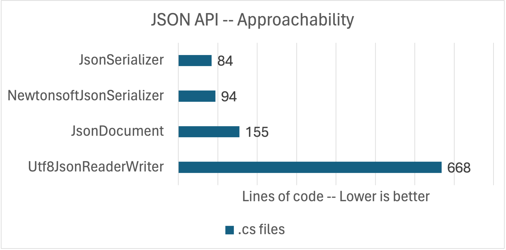

These measurement are for the whole app, including the types defined for the serializer. The code is written in an idiomatic way with healthy use of newer (terse) syntax.

The chart tells a clear story. `JsonSerializer` (both of them) and `JsonDocument` are the most convenient APIs (based on line count). `JsonSerializer` is an easy choice if you have types defined for the JSON you want to read or write. These days, it's convenient to quickly create a set of types to model your JSON domain with the introduction of [`record` types](https://devblogs.microsoft.com/dotnet/c-9-0-on-the-record/). In fact, the app uses `record` types for that reason. Otherwise, the lines of code difference between `JsonSerializer` and `JsonDocument` isn't all that meaningful. It's more of a question if you like using an automatic serializer or a DOM API. I am happy using either of them.

The `Utf8JsonReader` API is our low-level workhorse API. It's actually what `JsonSerializer` and `JsonDocument` are built on. It is a great choice if you want more control over how a JSON document is read, for example to skip parts of it. The API assumes a deep understanding of .NET and JSON type systems and how to write low-level reliable code. The higher line count is a direct result of that.

`JsonSerializer` and `JsonDocument` are clearly the default options since they don't require much code to write a JSON-driven algorithm. Let's see if there is a compelling reason to consider `Utf8JsonReader` in the performance measurements, since the cost of getting something working is much higher.

### Small document

The first performance test uses a [small test document](https://github.com/richlander/convenience/blob/main/releasejson/fakejson/fake-one-release-only.json), requested from a remote URL. It is is 905 bytes and describes a single .NET 6 release.

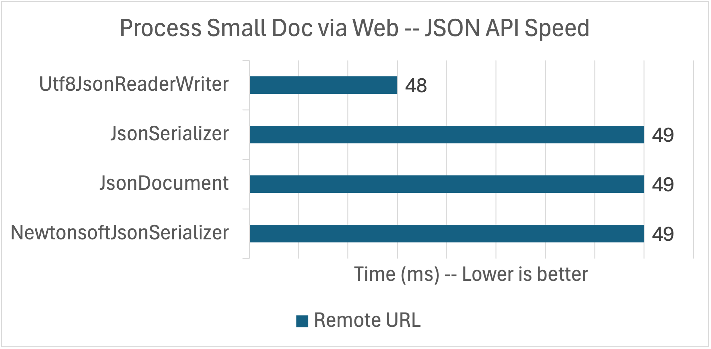

The APIs are tied in a dead heat! That's a shock, right? All of these APIs are very good, but we should expect more of a difference. My theory (which should play out in the rest of the analysis) is that they are all equally waiting on the network. Put another way, the CPU is more than able to keep up with the network and any differences between the implementations is hidden by the dominant network cost.

As an aside, I added some logging to the `Utf8JsonReader` implementation (to diagnose challenges in my own code; since removed) and discovered that the code was waiting on the network more than I would have guessed. Unsurprisingly, modern CPUs can outrun (often unreliable) networks.

50ms of compute is a lot, particularly for only 905 bytes of JSON. Let's try some local access options.

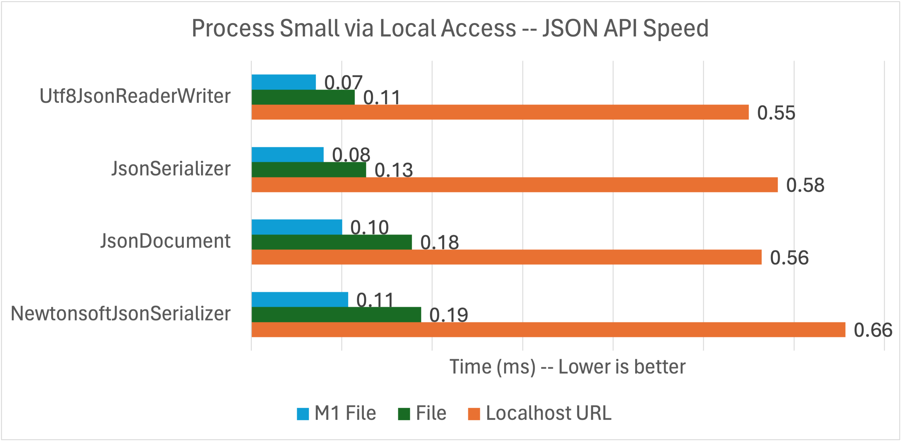

OK. These numbers look much better. We're now well into sub-millisecond results. To be clear, I only changed the source of the data. The implementations are all based on `Stream` so it is easy to switch out one `Stream` producer for another.

The numbers are still pretty close. My theory there is that's because this document is so small.

I tried three different local options for this test so that we could really focus in on the performance of the APIs.

- **Local Web**: Reads the JSON from a local ASP.NET Core app -- via `http://localhost:5255` --  on the same machine.
- **Local File**: Reads the JSON from the file system.
- **Local File M1**: Same, but run on an M1 Mac (Arm64).

The first two tests were run on my Intel i7 machine. The last was run on my MacBook Air M1 laptop (connected to power).

The key takeaway is that these APIs can run very fast when they are kept busy with data to process. That's the effective difference between the remote and local numbers. The Apple M1 performance numbers tells us that [.NET performance on Arm64](https://devblogs.microsoft.com/dotnet/this-arm64-performance-in-dotnet-8/) is very good at this point. Those numbers are shockingly good.

What's up with `Utf8JsonReader`? It's supposed to be _really_, right? Ha! Just wait, just wait.

I tried a [medium size document](https://github.com/richlander/convenience/blob/main/releasejson/fakejson/fake-releases-compact.json) -- `9.41` kB -- and found no significant difference.

Let's look at memory usage for the small document test, using `Environment.WorkingSet`.

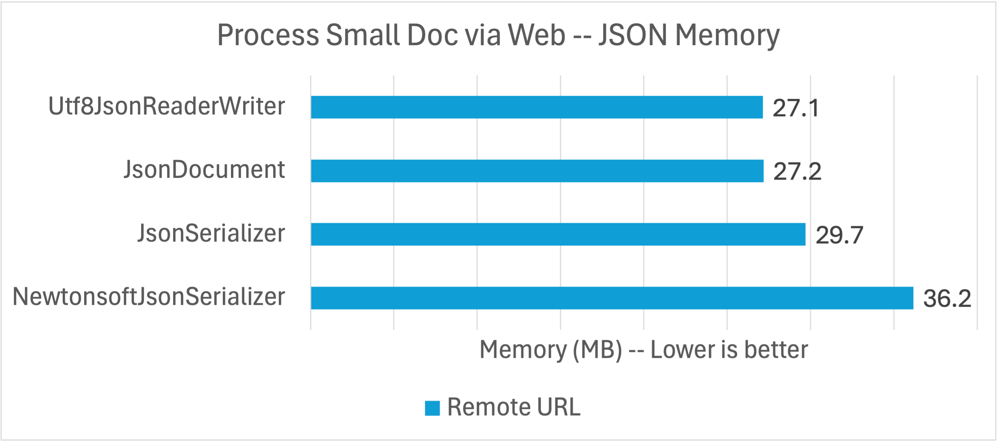

Here, we're seeing clustering among the `System.Text.Json` APIs with `Newtonsoft.Json` as the outlier. Let's be very clear at what is going on here. `System.Text.Json` was built a decade or so after `Newtonsoft.Json` and had the benefit of using a whole new set of platform APIs oriented on making high-performance code much easier to write, for both speed and memory usage.

The .NET Core era is a sort of [performance renaissance for .NET](https://devblogs.microsoft.com/dotnet/performance-improvements-in-net-8/) and it shows.

In particular, the `System.Text.Json` implementations are oriented on 8-bit Unicode characters not the 16-bit Unicode characters you get with the `string` and `char` types. That's why the reader is called **Utf8**JsonReader. That means that `System.Text.Json` is able to maintain the document data at "half price" until JSON string data needs to be materialized as a UTF16 .NET `string`, if at all.

### Large document

The next performance test uses a [larger test document](https://github.com/richlander/convenience/blob/main/releasejson/fakejson/fake-releases.json). It is `1.17 MB` and is (a copy of) the official [`release.json` file for .NET 6](https://github.com/dotnet/core/blob/main/release-notes/6.0/releases.json).

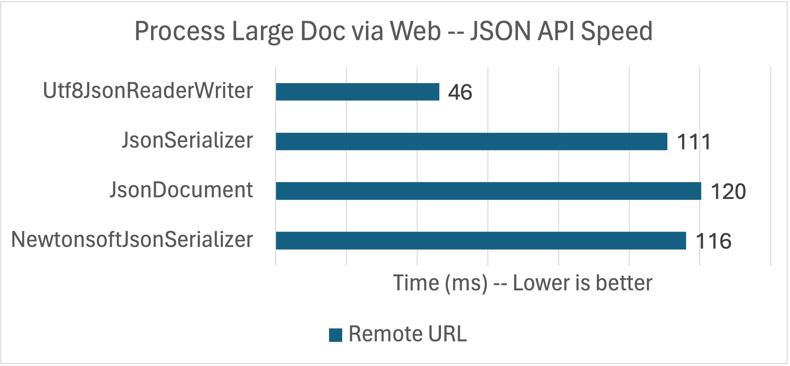

Wow! That's a big difference. Hold up. Why is `Utf8Reader` performance so much better with this large document?

In short, the app only needs data from the first 1k of the document and our `Utf8JsonReader` implementation is best able to take advantage of that. This is a case where my app (and the JSON it processes) may be different than yours.

The app is looking within the JSON document for the first `"security": true` patch release for .NET 6. If you're familiar with our patch releases, you'll know we ship a lot of security updates. That means that it is likely that the most recent patch release is a security release and that most of the 1MB+ document does not need to be read. That style of data massively favors a manual serialization approach.

If you have large JSON documents where only slices of them need to be read, then this finding may be relevant to you. Manual and automatic serialization can be [mixed and matched](https://learn.microsoft.com/dotnet/api/system.text.json.jsonserializer.deserialize), but in somewhat limited ways. I'd love to provide `JsonSerializer` a `Utf8JsonReader` and get it to return an `IAsyncEnumerable<MyObject>` at some mid-point in a large JSON document. That's not currently possible.

Let's try the same tests locally again.

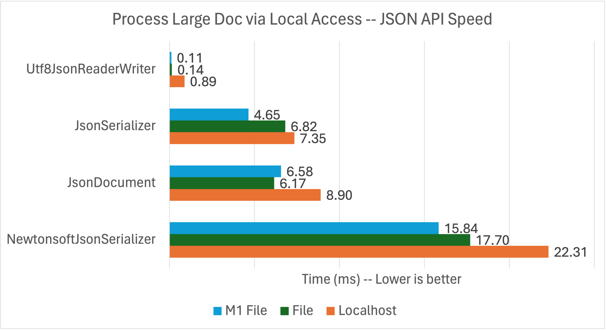

This is where we're really seeing the `System.Text.Json` family shine. Again, these APIs are able to crunch through JSON data quickly, particularly when it close by.

Let's look at memory usage.

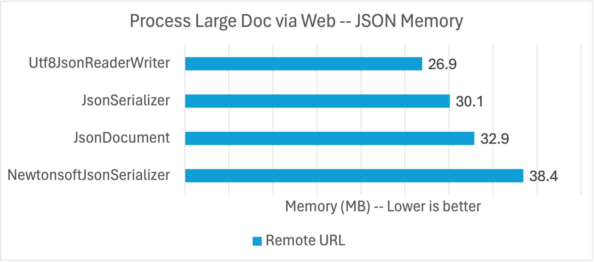

These results are roughly similar to the clustering we saw with the small document, but JsonDocument seems to be more affected by the target data being so far into the document.

### Large document -- Stress test

I [modified the document](https://github.com/richlander/convenience/blob/main/releasejson/fakejson/fake-release-near-end.json) so that the latest security patch was much further back in time. I pushed it back almost two years, all the way to the `6.0.1` release (as compared to [6.0.20+ now](https://github.com/dotnet/core/blob/main/release-notes/6.0/releases.json)), to see how that changed the results. That means that the `Utf8JsonReader` has to do a lot more work (a kind of relative stress test), possibly more similar to the other implementations. That should show up in the results.

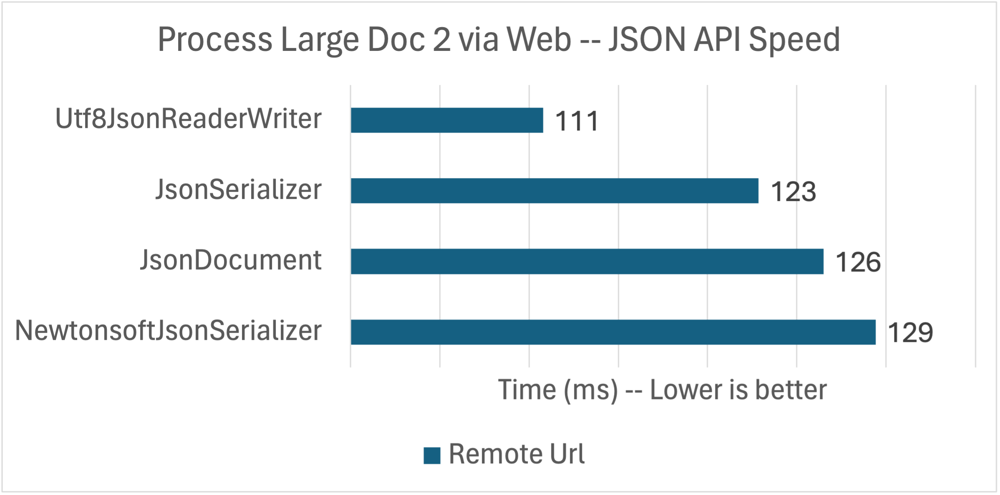

All the implementations are taking longer since most of the JSON needs to be read. The performance order is still the same, but the values are a lot tighter.

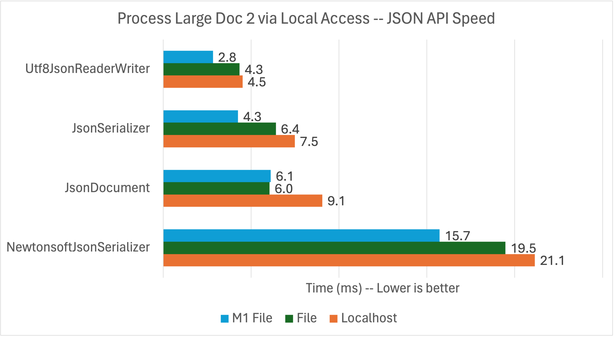

That's the local performance. The values are a lot slower than the previous two documents (for the stated reasons), however, the `System.Text.Json` implementations are able to quickly process the megabyte of JSON.

### Results Summary

There are a few findings that pop out of this data:

- The primary and consistent win from `System.Text.Json` is lower memory use.
- `JsonSerializer` and `Utf8JsonReader` are both great tools for specific jobs, however, `JsonSerializer` should be more than good enough in the vast majority of situations.
- `Newtonsoft.Json` is competitive on speed with `System.Text.Json` for internet web URLs (where both APIs are likely waiting on the network). `System.Text.Json` will consistently win when data can be served up faster.

Let's move to a more detailed analysis.

## JsonSerializer

`System.Text.Json.JsonSerializer` is the high-level automatic serialization solution that comes with .NET. In the last couple releases, we've been improving it with a [companion source generator](https://devblogs.microsoft.com/dotnet/try-the-new-system-text-json-source-generator/). `JsonSerializer` is approachable and straightforward to use, while the source generator removes reflection usage, which is critical for [trimming](https://learn.microsoft.com/dotnet/core/deploying/trimming/trim-self-contained) and [native AOT](https://learn.microsoft.com/dotnet/core/deploying/native-aot/).

Implementations:

- [`JsonSerializerBenchmark`](https://github.com/richlander/convenience/blob/main/releasejson/releasejson/JsonSerializerBenchmark.cs)
- [`JsonSerializerSourceGeneratorRecordBenchmark` with source generation using records](https://github.com/richlander/convenience/blob/main/releasejson/releasejson/JsonSerializerSourceGeneratorRecordBenchmark.cs)
- [`JsonSerializerSourceGeneratorPocoBenchmark` with source generation using regular classes](https://github.com/richlander/convenience/blob/main/releasejson/releasejson/JsonSerializerSourceGeneratorPocoBenchmark.cs)

Note: [POCO](https://en.wikipedia.org/wiki/Plain_old_CLR_object) == "plain old CLR object".

I wrote three implementations with `JsonSerializer` to evaluate if there were significant approachability or efficiency differences when using source generation and not. There weren't.

Let's see what the numbers tell us, with the small document, on my Apple M1 machine.

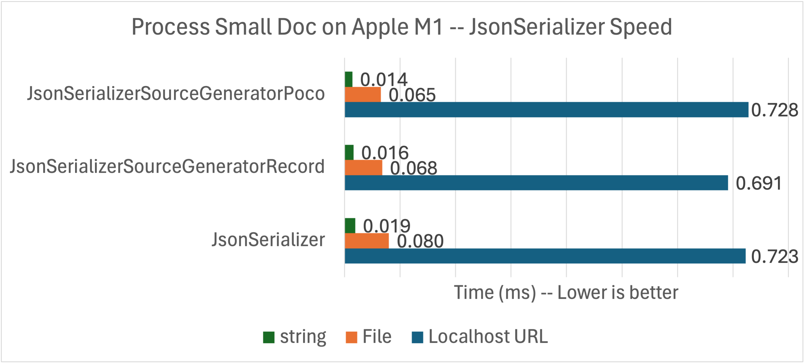

That's a pretty tight range (for each measurement type). I added `string` as a new measurement type. It brings the JSON one step closer to the API since it is loaded in memory before the benchmark runs.

Here's the same thing with the bigger 1MB+ document.

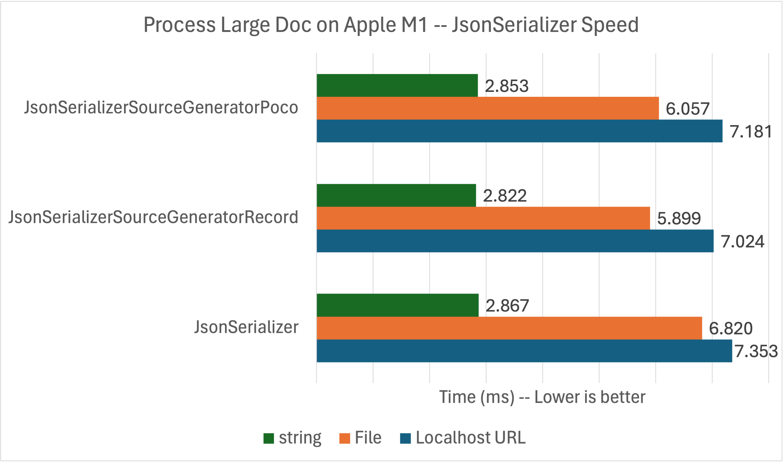

Again, we're seeing that the API performs much better as the data gets closer. We're also seeing that the source generator provides some advantage, but not much.

Let's move onto the code.

The top-level method is pretty compact.

```csharp
public static async Task<int> MakeReportWebAsync(string url)
{
    using HttpClient httpClient= new();
    MajorRelease release = await httpClient.GetFromJsonAsync<MajorRelease>(url, OPTIONS) ?? throw new Exception(Error.BADJSON);
    Report report = new(DateTime.Today.ToShortDateString(), [ GetVersion(release) ]);
    string reportJson =  JsonSerializer.Serialize(report, OPTIONS);
    WriteJsonToConsole(reportJson);
    return reportJson.Length;
}
```

There are three aspects to call out that make this implementation convenient to use.

- The `GetFromJsonAsync` extension method on `HttpClient` provides a nice one-liner for both the web request and deserialization. The `MajorRelease` type is provided, via the generic method, as the type of object to return from the JSON deserialization process.
- The `?? throw new Exception()` [null-coalescing operator](https://learn.microsoft.com/dotnet/csharp/language-reference/operators/null-coalescing-operator) is a sort of "last resort" option in case the network call returns a null response and plays nicely with [non-nullable reference types](https://learn.microsoft.com/dotnet/csharp/nullable-references).
- The `GetVersion` method produces a `Version` object that is added to an implicit `List<Version>` via a [collection expression](https://learn.microsoft.com/dotnet/csharp/whats-new/csharp-12#collection-expressions) in the `Report` (`record`) constructor.

Deeper into the implementation, you'll find an iterator method (that includes `yield return`). I think of iterator methods as "programmable `IEnumerable<T>` machines" and that is in fact exactly what they are. I love using them because they present a nice API while allowing me to offload a bunch of clutter from more focused methods.

The following iterator method is doing the heavy lifting in this implementation. It finds the first and first patch release for the compliance report.

```csharp
// Get first and first security release
public static IEnumerable<ReportJson.PatchRelease> GetReleases(MajorRelease majorRelease)
{
    bool securityOnly = false;
    
    foreach (ReleaseJson.Release release in majorRelease.Releases)
    {
        if (securityOnly && !release.Security)
        {
            continue;
        }
        
        yield return new(release.ReleaseDate, GetDaysAgo(release.ReleaseDate, true), release.ReleaseVersion, release.Security, release.CveList);

        if (release.Security)
        {
            yield break;
        }
        else if (!securityOnly)
        {
            securityOnly = true;
        }
    }

    yield break;
}
```

The `GetVersion` [expression-body method](https://learn.microsoft.com/dotnet/csharp/methods#expression-bodied-members) calls `ToList` on the `GetReleases` iterator method, to create a `List<Release>` as part of the instantiation of the `Version` record. It results in very tight syntax. I'm also using patterns, which I equally love.

```csharp
public static MajorVersion GetVersion(MajorRelease release) =>
    new(release.ChannelVersion, 
        release.SupportPhase is "active" or "maintainence", 
        release.EolDate ?? "", 
        release.EolDate is null ? 0 : GetDaysAgo(release.EolDate), 
        GetReleases(release).ToList()
        );
```

That's almost the entirety of the implementation. The `GetDaysAgo` method and the record definitions are the only other pieces you'll need to look at the implementation to see.

Source generation is straightforward to enable. The only difference is that the two calls to the serializer include static property values from `*Context*` types, coming from two partial class declarations. That's it!

```csharp
public static async Task<int> MakeReportWebAsync(string url)
{
    using HttpClient httpClient= new();
    var release = await httpClient.GetFromJsonAsync(url, ReleaseRecordContext.Default.MajorRelease) ?? throw new Exception(Error.BADJSON);
    Report report = new(DateTime.Today.ToShortDateString(), [ GetVersion(release) ]);
    string reportJson = JsonSerializer.Serialize(report, ReportRecordContext.Default.Report);
    WriteJsonToConsole(reportJson);
    return reportJson.Length;
}

[JsonSourceGenerationOptions(PropertyNamingPolicy = JsonKnownNamingPolicy.KebabCaseLower)]
[JsonSerializable(typeof(MajorRelease))]
public partial class ReleaseRecordContext : JsonSerializerContext
{
}

[JsonSourceGenerationOptions(PropertyNamingPolicy = JsonKnownNamingPolicy.KebabCaseLower)]
[JsonSerializable(typeof(Report))]
public partial class ReportRecordContext : JsonSerializerContext
{
}
```

You can see that I've opted into using `JsonKnownNamingPolicy.KebabCaseLower`, since that matches the `releases.json` schema. In my opinion, it's even more convenient to specify `JsonSerializerOptions` with source generation than without.

> Bottom line: `JsonSerializer` makes code very compact and easy to reason about. The serializer is quite efficient. It is your default option for reading and writing JSON documents.

## Json.NET Serializer

The Json.NET `JsonSerializer` is very similar in terms of approachability as `System.Text.Json`. In fact, `System.Text.Json` was modeled on `Newtonsoft.Json` so this should be no surprise.

Implementation:

- [`NewtonsoftJsonSerializerBenchmark`](https://github.com/richlander/convenience/blob/main/releasejson/releasejson/NewtonsoftJsonSerializerBenchmark.cs)

The primary part of the implementation is also quite compact. It's almost identical to the previous code except that there isn't a handy extension method for `HttpClient`.

```csharp
public static async Task<int> MakeReportWebAsync(string url)
{
    // Make network call
    using var httpClient = new HttpClient();
    using var releaseMessage = await httpClient.GetAsync(url, HttpCompletionOption.ResponseHeadersRead);
    using var stream = await releaseMessage.Content.ReadAsStreamAsync();

    // Attach stream to serializer
    JsonSerializer serializer = new();
    using StreamReader sr = new(stream);
    using JsonReader reader = new JsonTextReader(sr);

    // Process JSON
    MajorRelease release = serializer.Deserialize<MajorRelease>(reader) ?? throw new Exception(Error.BADJSON);
    Report report = new(DateTime.Today.ToShortDateString(), [ GetVersion(release) ]);
    string reportJson = JsonConvert.SerializeObject(report);
    WriteJsonToConsole(reportJson);
    return reportJson.Length;
}
```

There isn't a lot of extra analysis to provide. From a coding standpoint, at least for this app, it's the same (enough) as the `System.Text.Json` version. The rest of the code in the implementation is actually identical, so no need to look at that again.

This code has several `using` statements, which are used to ensure that resources are properly disposed after the method exits. You can sometimes get away without doing that, but it is good practice.

We should take a quick look at `httpClient.GetAsync(JsonBenchmark.Url, HttpCompletionOption.ResponseHeadersRead)`. It will show up in all the remaining examples. The `HttpCompletionOption.ResponseHeadersRead` enum value is telling `HttpClient` to only eagerly read the HTTP headers in the response and then wait for the reader (in this case `JsonSerializer`) to request more bytes from the server as it can read them. This pattern can be important to avoid memory spikes.

Json.NET doesn't provide a source generator option. It's also not compatible with trimming and native AOT as a result.

> Bottom line: The Json.NET `JsonSerializer` is an excellent JSON implementation and has served millions of .NET developers well for many years. If you are happy with it, you should continue using it.

## JsonDocument

`JsonDocument` is a typical document object model API that both provides an alternate API for the JSON types system (like `JsonObject`, `JsonArray`, and `JsonNode`) while integrating with the .NET type system as much as possible (`JsonArray` is an `IEnumerable`). Most of the API is oriented on a dictionary key-value style syntax.

Implementation:

- [`JsonDocumentBenchmark`](https://github.com/richlander/convenience/blob/main/releasejson/releasejson/JsonDocumentBenchmark.cs)

This coding pattern is quite different. It seems like 3x the code, but that's because I've chosen to include much more of the actual implementation in the primary method. Given the DOM paradigm, I think this makes sense. In actuality, this code is pretty compact given that we're starting to do the heavy lifting of serialization ourselves. It's also straightforward to read, particularly with the nested `report` code.

```csharp
public static async Task<int> MakeReportAsync(string url)
{
    // Make network call
    var httpClient = new HttpClient();
    using var responseMessage = await httpClient.GetAsync(url, HttpCompletionOption.ResponseHeadersRead);
    var stream = await responseMessage.Content.ReadAsStreamAsync();

    // Parse Json from stream
    var doc = await JsonNode.ParseAsync(stream) ?? throw new Exception(Error.BADJSON);
    var version = doc["channel-version"]?.ToString() ?? "";
    var supported = doc["support-phase"]?.ToString() is "active" or "maintenance";
    var eolDate = doc["eol-date"]?.ToString() ??  "";
    var releases = doc["releases"]?.AsArray() ?? [];
    
    // Generate report
    var report = new JsonObject()
    {
        ["report-date"] = DateTime.Now.ToShortDateString(),
        ["versions"] = new JsonArray()
        {
            new JsonObject()
            {
                ["version"] = version,
                ["supported"] = supported,
                ["eol-date"] = eolDate,
                ["support-ends-in-days"] = eolDate is null ? null : GetDaysAgo(eolDate, true),
                ["releases"] = GetReportForReleases(releases),
            }
        }
    };

    // Generate JSON
    string reportJson = report.ToJsonString(OPTIONS);
    WriteJsonToConsole(reportJson);
    return reportJson.Length;
}
```

The rest of the code has much the same pattern. `GetReportForReleases` is primarily a `foreach` over `doc["releases"]`. As mentioned earlier, a `JsonArray` exposes an `IEnumerable<JsonNode>`, making it natural to integrate with idiomatic C# syntax. You could just as easily use [LINQ](https://learn.microsoft.com/dotnet/csharp/programming-guide/concepts/linq/introduction-to-linq-queries) with `JsonArray`.

There are a few highlights to call out with this implementation. 

- `JsonDocument` isn't integrated with `HttpClient` in the same way as `JsonSerializer` but it doesn't really matter. `JsonNode.ParseAsync` is happy to accept a `Stream` from `HttpClient` and there is no one-liner that makes sense for `JsonDocument`.
- The DOM API can return `null` from a key-value request, like from `doc["not-a-propertyname-in-this-schema"]`.
- Generating JSON with `JsonDocument` is delightful since you can use types and C# expressions while visualizing a nesting pattern that almost looks like JSON (if you squint). 

> Bottom line: `JsonDocument` is a great API if you like the DOM access pattern or cannot generate types needed to use a serializer. It is your default choice if you want the absolute quickest path to programmatically read and write JSON.

## Utf8JsonReader

`Utf8JsonReader` is our "manual mode" solution. If you are up for it, there's a lot of capability and power on offer. Like I said earlier, the higher-level `System.Text.Json` APIs are built on top of this type, so its clear that you can build very useful JSON processing algorithms with it.

Implementations:

- [`Utf8JsonReaderWriterStreamBenchmark`](https://github.com/richlander/convenience/blob/main/releasejson/releasejson/Utf8JsonReaderWriterStreamBenchmark.cs)
- [`Utf8JsonReaderWriterPipelineBenchmark`](https://github.com/richlander/convenience/blob/main/releasejson/releasejson/Utf8JsonReaderWriterPipelineBenchmark.cs)
- [`Utf8JsonReaderWriterStreamRawBenchmark`](https://github.com/richlander/convenience/blob/main/releasejson/releasejson/Utf8JsonReaderWriterStreamRawBenchmark.cs)

Again, I wrote a few different implementations. The first two are identical except one uses `Stream` and the other uses `Pipelines`. They both deserialize JSON to real objects, much like a serializer would do. The objects are then handed to some JSON writer code, which serializes those objects to JSON, much like a serializer would do. I like this approach a lot and it feels pretty natural (for low-level code). When I next need more control over processing JSON, this is the approach I'll use. In retrospect, I could have used the serializer as part of this approach, with [JsonSerializer.Deserialize](https://learn.microsoft.com/dotnet/api/system.text.json.jsonserializer.deserialize) (passing a `Utf8JsonReader`) at least as a test.

Pipelines offer a higher-level API than streams, which makes the buffer management more approachable. The `Stream` code required a little more careful handling than I enjoy needing to deal with.

The third implementation copies UTF8 data directly from the reader to the writer without creating intermediate objects. That approach is more efficient and has a significantly lower line count because of that. However, the code isn't layered as much, which I suspect would hurt maintenance. I'm less likely to return to this pattern.

These implementations are different enough that we should look at results again, for these three approaches, using `JsonSerializer` as the baseline.

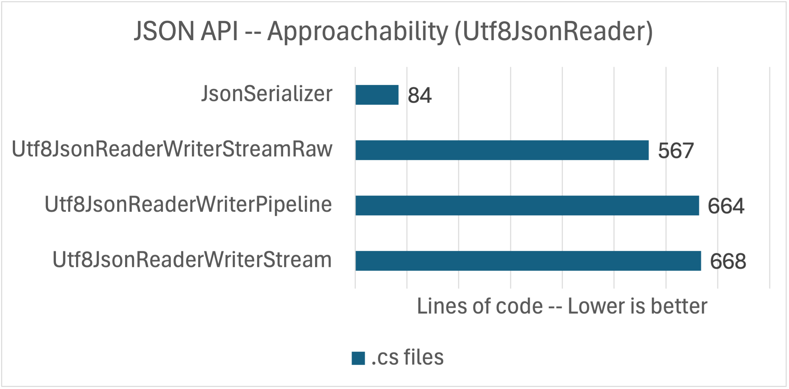

The "raw" implementation pulls ahead of the other `Utf8JsonReader` implementations. The `JsonSerializer` implementation continues to stand as a great baseline for straightforward code. 

Let's look at the performance of these three implementations.

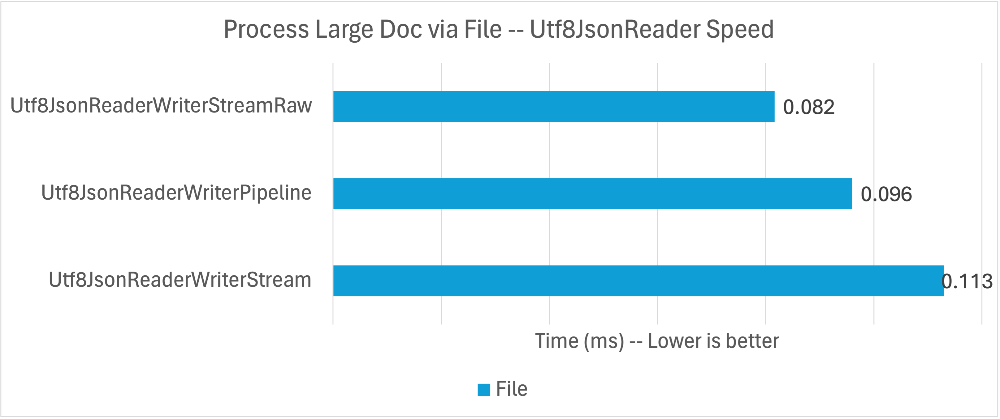

These are measured by reading the large JSON document from the local file system on my MacBook M1. The "Raw" approach was consistently faster (not just in this specific benchmark).    

The memory differences between the implementations were even tighter, so I'm not going to bother sharing those again. I materialized some of the JSON strings to UTF16 strings in my "raw' implementation. It is possible to not do that for lower memory usage, but I didn't explore that.

Let's move onto the code.

This coding pattern (from the first implementation) is different again, with more complex topics and techniques, although much of the lower-level API use is hidden in the implementation of the types in the `// Process JSON` section.

```csharp
public static async Task<int> MakeReportWebAsync(string url)
{
    // Make network call
    using var httpClient = new HttpClient();
    using var releaseMessage = await httpClient.GetAsync(url, HttpCompletionOption.ResponseHeadersRead);
    releaseMessage.EnsureSuccessStatusCode();
    using var jsonStream = await releaseMessage.Content.ReadAsStreamAsync();

    // Acquire byte[] as a buffer for the Stream 
    byte[] rentedArray = ArrayPool<byte>.Shared.Rent(JsonStreamReader.Size);
    int read = await jsonStream.ReadAsync(rentedArray);

    // Process JSON
    var releasesReader = new ReleasesJsonReader(new(jsonStream, rentedArray, read));
    var memory = new MemoryStream();
    var reportWriter = new ReportJsonWriter(releasesReader, memory);
    await reportWriter.Write();
    ArrayPool<byte>.Shared.Return(rentedArray);

    // Flush stream and prepare for reader
    memory.Flush();
    memory.Position= 0;

    WriteJsonToConsole(memory);
    return (int)memory.Length;
}
```

There are a few highlights to call out.

- `ArrayPool` is a pattern for re-using arrays, which significantly reduces the work of the garbage collector. It is a great choice if you are repeatedly reading JSON files (like in each web request or performance measurement).
- I had to build a little mini framework for `Utf8JsonReader` JSON processing. I wrote a general `JsonStreamReader` on top of `Utf8JsonReader` and then a schema-specific `ReleasesJsonReader` on top of that. I did the same thing with the pipelines implementation, with `JsonPipelineReader`. This approach and structure made the code a lot easier to write.
- The final result is JSON that is written to a `MemoryStream`. That stream needs to be flushed and its position reset in order to be read by a reader.

The `ReportJsonWriter` shows how the overall code flows.

```csharp
public async Task Write()
{
    _writer.WriteStartObject();
    _writer.WriteString("report-date"u8, DateTime.Now.ToShortDateString());
    _writer.WriteStartArray("versions"u8);
    
    var version = await _reader.GetVersionAsync();
    WriteVersionObject(version);
    _writer.WritePropertyName("releases"u8);
    // Start releases
    _writer.WriteStartArray();

    await foreach (var release in _reader.GetReleasesAsync())
    {
        WriteReleaseObject(release);
    }

    // End releases
    _writer.WriteEndArray();

    // End JSON document
    _writer.WriteEndObject();
    _writer.WriteEndArray();
    _writer.WriteEndObject();

    // Write content
    _writer.Flush();
}
```

`_writer` (`Utf8JsonWriter`) writes JSON to the `MemoryStream`, while `_reader` (`ReleasesJsonReader`) exposes APIs for reading objects from the source JSON. `ReleasesJsonReader` is a forward-only JSON reader so the APIs can only be called in a certain order (and they throw otherwise). A `ParseState` enum is used to record processing state through the document for that purpose.

The most interesting part is that the `ReleasesJsonReader` APIs are async, yet `Utf8JsonReader` doesn't support being used within async methods because it is a [ref struct](https://learn.microsoft.com/dotnet/csharp/language-reference/builtin-types/ref-struct). The following block of code does a good job of demonstrating a pattern for using `Utf8JsonReader` within async workflows and what `Utf8JsonReader` code looks like generally.

```csharp
private async IAsyncEnumerable<Cve> GetCvesAsync()
{
    while (!_json.ReadToTokenType(JsonTokenType.EndArray, false))
    {
        await _json.AdvanceAsync();
    }

    while(GetCve(out Cve? cve))
    {
        yield return cve;
    }

    yield break;
}

private bool GetCve([NotNullWhen(returnValue:true)] out Cve? cve)
{
    string? cveId = null;
    cve = null;

    var reader = _json.GetReader();

    while (true)
    {
        reader.Read();

        if (reader.TokenType is JsonTokenType.EndArray)
        {
            return false;
        }
        else if (!reader.IsProperty())
        {
            continue;
        }
        else if (reader.ValueTextEquals("cve-id"u8))
        {
            reader.Read();
            cveId = reader.GetString();
        }
        else if (reader.ValueTextEquals("cve-url"u8))
        {
            reader.Read();
            var cveUrl = reader.GetString();

            if (string.IsNullOrEmpty(cveUrl) ||
                string.IsNullOrEmpty(cveId))
            {                    
                throw new Exception(BenchmarkData.BADJSON);
            }

            cve = new Cve(cveId, cveUrl);
            reader.Read();
            _json.UpdateState(reader);
            return true;
        }

    }
}
```

Note: [CVEs](https://www.cve.org/) are part of the `releases.json` schema. CVEs can be described as "documented security vulnerability".

I'll share the highlights on what's going on across these two methods.

- `GetCvesAsync` is an async iterator-style method. As I said earlier, I use iterator methods whenever I can. You can use them for `IAsyncEnumerable<T>`, just like `IEnumerable<T>`.
- The method starts with a call to `JsonStreamReader.ReadToTokenType`. This is asking the underlying `JsonStreamReader` to read to a `JsonTokenType.EndArray` token (the end of the `cve-list` array) within the buffer. If not, then `JsonStreamReader.AdvanceAsync` is called to refresh the buffer.
- The `false` parameter indicates that the underlying reader state should not be updated after the `ReadToTokenType` operation completes. This pattern double-reads the JSON content to ensure that the end of the `cve-list` can be reached and that every `Utf8Json.Read` call in the `GetCve` method will return `true`. Double reading may sound bad, but it is better than alternative patterns. Also, this code is more network- than CPU-bound (as we observed in the performance data).
- `GetCve` is not an async method, so we're free to use `Utf8JsonReader`.
- The first thing we need to do is get a fresh `Utf8JsonReader` from state that has been previously saved.
- The remainder of the method is a state machine for processing the `cve-list` content, which is an array of JSON objects with two properies.
- [UTF8 string literals](https://learn.microsoft.com/dotnet/csharp/language-reference/proposals/csharp-11.0/utf8-string-literals) -- like `"cve-id"u8` -- are a very useful pattern used throughout the codebase. [Stack allocated](https://learn.microsoft.com/dotnet/csharp/language-reference/operators/stackalloc) UTF8 strings are exposed as `ReadOnlySpan<byte>`, which is perfect for comparing to the UTF8 values exposed from `Utf8JsonReader`.
- `JsonStreamReader.UpdateState` saves off the state of the `Utf8JsonReader` so that it can be recreated when it is next needed. Again, the reader cannot be stored in some instance field because it is a `ref struct`.
- `[NotNullWhen(returnValue:true)]` is a helpful attribute for communicating when an `out` value can be trusted to be non-null.

Why all this focus on ref structs and why did the team make this design choice? `Utf8JsonReader` uses `ReadOnlySpan<T>` pervasively throughout its implementation, which has the (large) benefit of avoiding copying JSON data. `ReadOnlySpan<T>` is a `ref struct` so therefore `Utf8JsonReader` must be as well. For example, a JSON string -- like from `Utf8JsonRead.ValueSpan` -- is a low-cost `ReadOnlySpan<byte>` pointing into the `rentedArray` buffer created at the start of the program. This design choice requires a little extra care to use, but is worth it for the performance value it delivers. Also, this extra complexity is hidden from view for `JsonSerializer` and `JsonDocument` users. It's only developers directly using `Utf8JsonReader` that need to care.

To be clear, using `ReadOnlySpan<T>` doesn't force a type to become a `ref struct`. The line where that happens is when you need to [store a ref struct as a (typically private) field](https://github.com/dotnet/runtime/blob/f08cbb88a074f5fd5c1b31751f44baa8c1d91cd6/src/libraries/System.Text.Json/src/System/Text/Json/Reader/Utf8JsonReader.cs#L24). `Utf8JsonReader` does that, hence `ref struct`.

Last, the writer code looks like the following.

```csharp
public void WriteVersionObject(Version version)
{
    _writer.WriteStartObject();
    _writer.WritePropertyName("version"u8);
    _writer.WriteStringValue(version.MajorVersion);
    _writer.WritePropertyName("supported"u8);
    _writer.WriteBooleanValue(version.Supported);
    _writer.WritePropertyName("eol-date"u8);
    _writer.WriteStringValue(version.EolDate);
    _writer.WritePropertyName("support-ends-in-days"u8);
    _writer.WriteNumberValue(version.SupportEndsInDays);
}
```

This code is writing basic JSON content and taking advantage of UTF8 string literals (for the property names) to do that efficiently.

The rest of the codebase follows these same patterns.

I've skipped how [`JsonStreamReader`](https://github.com/richlander/convenience/blob/main/releasejson/releasejson/JsonStreamReader.cs) is implemented. It includes a set of `ReadTo` methods like `ReadToTokenType` and buffer management. It is indeed interesting, but I'll leave that for folks to read themselves. This is a type that feels like it should be in available in a library for folks to simply rely on. Same thing with [`JsonPipeReader`](https://github.com/richlander/convenience/blob/main/releasejson/releasejson/JsonPipeReader.cs). If you want to use pipelines, take a look at [dotnet/runtime #87984](https://github.com/dotnet/runtime/issues/87984).

> Bottom line: `Utf8JsonReader` is a great and capable API and the rest of the `System.Text.Json` stack is built on top of it. In certain scenarios, it is the best choice since it offers maxiumum flexiblity. It requires a higher level of skill to navigate the interaction with lower-level APIs and concepts. If you have the need and the skill, this type can deliver.

## Summary

The purpose of this post was to demonstrate that `System.Text.Json` offers JSON reading and writing APIs for every developer and scenario. The APIs cover the spectrum of convenience to control, both in terms of the coding patterns and the performane you can achieve.

The punchline of the post is that the convenient option -- `JsonSerializer` -- delivers great performance and that it is competitive in all the scenarios I tested. That's a great result.

As I mentioned, `System.Text.Json` is a relatively new API family, [created as part of the .NET Core project](https://devblogs.microsoft.com/dotnet/try-the-new-system-text-json-apis/). It does a good job showing that a fully-integrated approach to platform design can produce a lot of benefits for usability and performance.

`Newtonsoft.Json` remains a great choice. As I said in the post, if it's working for you, keep on using it.

Thanks to [Eirik Tsarpalis](https://github.com/eiriktsarpalis/) for his help on this post. Thanks to [David Fowler](https://github.com/davidfowl), [Jan Kotas](https://github.com/jkotas), and [Stephen Toub](https://github.com/stephentoub) for their help contributing to this series.

Did you like this style of post? If you do, we'll write more. It is intended to show you more than the latest features in the new release, but a practical application of how .NET APIs can be used to satisfy the needs of concrete tasks.
