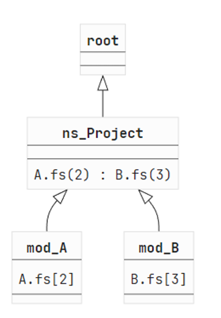
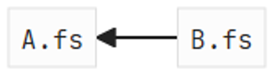
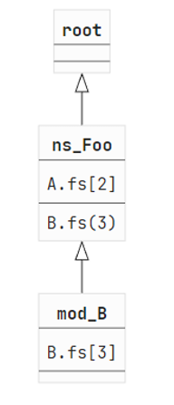
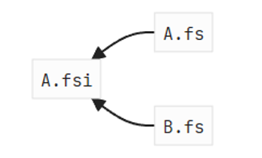

> This is a guest blog post by **Florian Verdonck**. Florian is a freelance software craftsman. He does consultancy, training and open-source development. Currently, he is very active in the F# community, working on the compiler and tooling, improving the overall state of the F# ecosystem according to the needs of his customers. Florian is a member of the open-source division at <a href=https://opensource.gresearch.com/>G-Research</a> and a maintainer of the open-source F# formatter project <a href=https://github.com/fsprojects/fantomas/>Fantomas</a>.

Currently, when you build a project using `dotnet build` (and, by extension, when you invoke the compiler `dotnet fsc.dll <arguments>` via MSBuild), the compilation of your project will type-check each file sequentially. Type-checking is typically one of the most time consuming phases of the compilation. Introducing some parallelization could significantly speed things up. Accelerating large data processing jobs is something of great interest to the G-Research OSS team.

## Background

Last year, I revived [an existing experiment](https://github.com/dotnet/fsharp/pull/11152) from [Will Smith](https://github.com/TIHan) to type-check implementation files (backed by a signature file) in parallel. This was a good learning experience on how type-check orchestration works, what types like `TcState` and `TcEnv` are, and other internal compiler details.

At the time I was happy that the `--test:ParallelCheckingWithSignatureFilesOn` landed (see [dotnet/fsharp#13737](https://github.com/dotnet/fsharp/pull/13737)), but I understood that this was only beneficial under a set of limited circumstances. The biggest drawback was that it only would work when you had [signature files](https://learn.microsoft.com/dotnet/fsharp/language-reference/signature-files). Files without a matching signature file would still be processed sequentially.

I actually like signature files, I know some people will forever reject them, but for me, well, they grew on me. And I believe they have a role to play in larger F# (enterprise) projects. Signature files allow you to hide the implementation details of a file and are in fact a summary of what the project needs to know about your implementation. On a practical level, you never have to use the `private` keyword anymore in your implementation, as functions will be private by default if they don't get listed in the signature file.

I love having a well-documented signature file that covers everything I need to know about a 3,000 line implementation file. This is particularly beneficial in an enterprise where people come and go and the living code serves as documentation. Signature files force you to think more explicitly about the boundaries between your software. If you need to edit your signature file, it will raise immediate awareness that you might be changing your public API surface.

The downside of signature files are that you need to do double bookkeeping. Adding or modifying any public details in an implementation file will require you to change code in two places. There is not much IDE tooling (regardless of what your current editor is) at the time of writing this, and that might be frustrating.

## Basic concept

The new feature flag `--test:GraphBasedChecking` will try to type-check any file in parallel on multiple threads, regardless if it is backed by a signature file. In order to know which files can be processed in parallel, we first need to discover the relationship between each file in a project. The current relationship is determined by the file order in the project. Right now, each file has the type-checked information of all the files that came before it.

In practice, however, this isn't really always a strict requirement to type-check the current file. For example, inside a unit test project, your individual test files are likely independent. Or in other projects, you might have some features that just don't depend on each other. So, based on what you do inside your project, there might be some room for parallelization.

To discover the dependency graph between files, we can process the `Untyped Abstract Syntax Tree` (AST) to detect links. Because the information inside the AST isn't as rich as the typed tree, we know that our resolution will be a super-set of the actual dependency graph. Using the typed tree, we could construct the true dependency graph, but we would only have that information after everything is type-checked. Which is the very thing we are trying to improve.

To construct our dependency graph, we will process each file twice. Once to create a [trie](https://en.wikipedia.org/wiki/Trie) structure that maps all the found namespaces and modules in the project. And the second time to detect any potential links to other files in the trie. You can read more details on the algorithm in the [documentation](https://github.com/dotnet/fsharp/blob/main/src/Compiler/Driver/GraphChecking/Docs.md).

This might sound abstract and is slightly easier to grasp by looking at an example. Imagine the following project:

A.fs:
```fsharp
module Project.A

open System

let add x y = x + y
```

B.fs:
```fsharp
module Project.B

open Project.A

let b = add 1 2
```

This will lead to the following trie:



Every trie will always have a root node. We used this node to capture files that will automatically be linked. Think of scenarios like `global namespace` or a top-level module without any prefix `[<AutoOpen>] module X`.

The first child node is the `Project` namespace node. Both files are using this namespace because the module is prefixed by it. However, we make a distinction between files that use a namespace and files that expose types into a namespace. More on that later.

The child nodes `A` and `B` are self-explanatory. A module can only contain one file as a dependency because it can technically only be specified once.

After constructing the trie, we will process files A and B again but this time we will look at the content. As `A.fs` is the first file in a project, we will skip the second processing as it cannot have any dependencies being the first file.

For the file `B.fs` we will look at nodes of interest in the AST and use them to query the trie. If we find a matching node for our query, we will consider adding files in that node as dependency for the current file. In our example, we will process `open Project.A` from the AST and query for `["Project"."A"]`. The resulting node will be the module node of 'A' which contains `A.fs`. And we conclude the following graph:



We need to take a lot of details into account when processing the contents of a file. I won't cover all of them in this blog post, but I'd like to give one more example:

A.fs:
```fsharp
namespace Foo

type A =
    {
        Age: int
        Name: string
    }
```

B.fs:
```fsharp
module Foo.B

let x y z = y.Age - z.Age
```

Our trie would look like:



And when we process `B.fs` (again, we don't need to process `A.fs`), we need to take `module Foo.B` into account. We query the trie for the prefix `["Foo"]` and will get the `Foo` namespace node back.

Because of the namespace prefix of our module, any types defined in `Foo` are accessible to `B.fs`. So we need to take a dependency on `A.fs` in order for the code to compile. That is why we treat namespaces differently than modules. We don't automatically want to link files because they share a namespace and we do want to link files when there are types in a namespace involved. This of course is a trade-off scenario, we could in theory be adding links between files, where in practice they are not required. Better safe than sorry, right?

## Getting started

To get started with this in your own code base, you will need to download the .NET `7.0.400` SDK. Make sure your `global.json` is configured correctly!

First, we need to tell the F# compiler that we wish to use this feature. We can do this by adding it to the `OtherFlags` property in MSBuild.

In your `.fsproj` (or `Directory.Build.props`) you can extend this property by adding `<OtherFlags>$(OtherFlags) --test:GraphBasedChecking</OtherFlags>`. This will append our new test flag to any existing flags that were already set.

From there on, we can trigger a build using `dotnet build` and may already notice a performance difference. This really depends from project to project and does require some tweaking to get the most out of it.

## Seeing the graph

In order to verify the resolved dependency graph, we can add another flag to export the graph as a [Mermaid diagram](https://mermaid.js.org/). Add `--test:DumpCheckingGraph` to the `OtherFlags` and rebuild. This will generate a `.graph.md` file next to the output location of the project (the `-o` flag), which is typically in `obj\Debug\netXYZ`. This file is a mermaid diagram which we can visually inspect in an IDE (using a plugin) or via the website.

## Seeing the duration

The resolved graph will be processed in parallel, to a certain degree. We can only start type-checking a file once all its dependencies are available and thus we could have some bottleneck situations. To get a sense of which file took long to type-check we can use the [open telemetry](https://opentelemetry.io/) from the compiler. Adding the `--times:report.csv` flag to the `OtherFlags` will generate a report with the duration of each activity.

When we open this [CSV](https://en.wikipedia.org/wiki/Comma-separated_values) file, we can filter on `CheckDeclarations.CheckOneImplFile` and sort by `Duration(s)`. This will show us which files took the most time to type-check.

```csv
CheckDeclarations.CheckOneImplFile,13-17-29.4512,13-17-29.5127,000.0615,00-c8782254ceb3813ae947bd7647dc0acb-3e0d008dcf461b26-00,00-c8782254ceb3813ae947bd7647dc0acb-5baad57327070a15-00,c8782254ceb3813ae947bd7647dc0acb,C:\Users\nojaf\Projects\graph-sample\A.fs,,A,,,,,,,,,,

CheckDeclarations.CheckOneImplFile,13-17-29.5131,13-17-29.5471,000.0340,00-c8782254ceb3813ae947bd7647dc0acb-101d02a6006605f7-00,00-c8782254ceb3813ae947bd7647dc0acb-5baad57327070a15-00,c8782254ceb3813ae947bd7647dc0acb,C:\Users\nojaf\Projects\graph-sample\B.fs,,Foo.B,,,,,,,,,,
```

## Restructure code to improve performance

As you can visually inspect the graph and the times, you might realize that some files contain too many links and could be good candidates for a split. As this feature is rather new, we are still trying to find some good heuristics or convenient ways to detect what change in your code structure will get you the most benefits from graph-checking.

Here are a few more pointers when a file will always be linked to the ones that came after it:

* Having a type in a namespace will link the file to each file that comes after and uses that same namespace.

A.fs:
```fsharp
namespace Foo

type X = int
```

Every file that contains `Foo` in the namespace or module will get a link to `A.fs` because of potential type inference. This isn't a bad thing, just keep in mind that using `A.fs` would require a large nested module and it could be a bottleneck while the graph is being processed.

```fsharp
namespace Foo

type X = int

module Bar =
    // Imagine a super long module...
    begin end
```

* Using a `global namespace` in your file also links it to everything that came after. If you have this, perhaps you want to move this file further down the project to avoid some links.

* A non-prefixed `[<AutoOpen>]` module will also link to everything that came after it

```fsharp
[<AutoOpen>]
module Foo
// ...
```

## Accelerating graph processing with signature files

Signature files can be very useful to speed up the processing of the graph. When an implementation file is backed by a signature file, all links will point to the signature. The signature contains the same information and will always be a lot smaller to type-check. Thus, it can unblock the processing of dependent files a lot faster. Let's look at the example.

A.fsi:
```fsharp
module A

val fn: int -> int
```

A.fs:
```fsharp
module A

let fn (a:int) : int =
    // imagine a really long and complicated function to type check
    0
```

B.fs:
```fsharp
module B

let process x y =
    A.fn x y
```

Because of the signature, our graph will look like:



And `A.fs` and `B.fs` can be type-checked in parallel.

## Generating signature files

### Using the F# compiler

If you don't have any signature files in your current project, you can create them initially using the `--allsigs` compiler flag. Once you add it to your `OtherFlags`, it will create a matching signature file for each file in the project. Then you can add them accordingly to your project. Be aware though that `--allsigs` is something you typically want to enable once and remove afterwards. It would otherwise run during each build and always override any changes you may have made to your signature files.

### Using Telplin

Alternatively, you could also create your signature files using the [`telplin` .NET tool](https://www.nuget.org/packages/telplin). Telplin has a different approach to generate the signature files and tries to be more faithful to the original source of the implementation file.

### IDE tooling

Currently, no IDE has perfect tooling for working with signature files. So, I can sympathize if this makes you somewhat reluctant to start using signature files. Both `--allsigs` and `Telplin` only provide you with a starting point and are no solution for incremental changes. However, a lot of F# tooling is open source and your contributions are very welcome!

## Amplifying F#

Graph-based type-checking was one of the recent topics during [Amplifying F#](https://amplifying-fsharp.github.io/). [Chet Husk](https://github.com/baronfel) guided us through the setup of the new compiler flag for [FSAutocomplete](https://github.com/fsharp/FsAutoComplete/) and it was a very fun session. You can find the recording over [the session page here](https://amplifying-fsharp.github.io/sessions/2023/04/28).

## Acknowledgements

[G-Research](https://www.gresearch.com/) took the lead on this feature and one can only imagine what F# could be if more companies were involved.

I would particularly like to thank [Janusz Wrobel](https://github.com/safesparrow) (from G-Research) for exploring a first prototype of the idea and for teaming up with me to work on the implementation. Janusz and I spent hours discussing and working on this and it would have never landed without his drive to explore this idea.

Next, I would like to thank the [F# team](https://github.com/orgs/dotnet/teams/fsharp-team-msft) at Microsoft for taking in our contribution into the code base. Just because you have an idea and PR for an open-source project doesn't mean that the maintainers necessarily get on board with it. So, I'm happy the team accepted our implementation and took the time to discuss its functionality in depth. This most likely was one of the hardest challenges we faced in the compiler code base, and I dearly appreciated all the help we got.

Lastly, I would like to thank everyone who tested this feature on their code base ahead of the official .NET SDK release. I am so grateful for the early feedback that gave us a sense of whether this is working for all F# code.

I very much implore you to test out this feature today! One day I hope we can turn on this feature by default, so please test this out on your code. Assert that the feature flag produces exactly the same binary! If this is not the case, open an issue on the [F# repository](https://github.com/dotnet/fsharp/issues) with a sample to reproduce what isn't working for you.

Thanks again for all those involved!