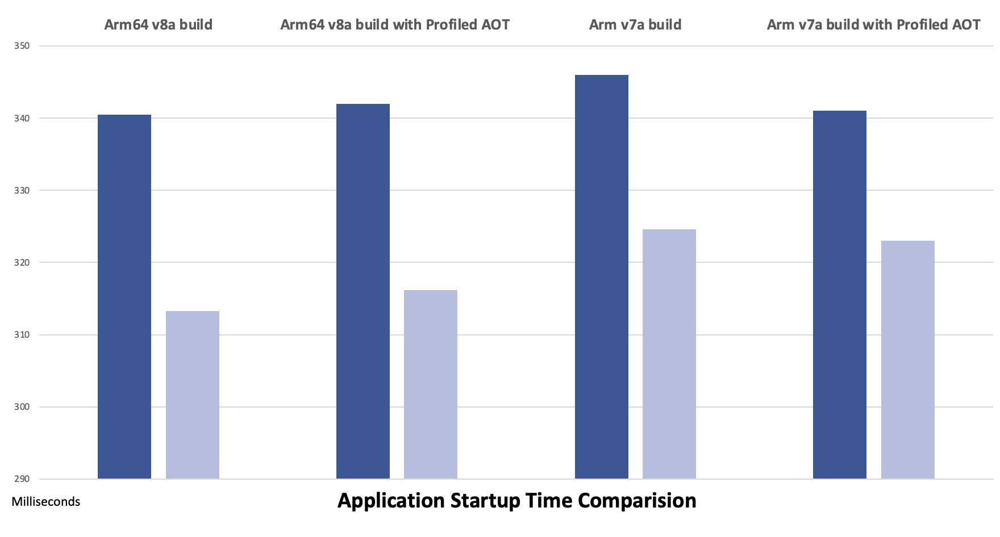

With the release of .NET 8 we are introducing a new system for generating the C# code used to access Android Resources. The system which generated a `Resource.designer.cs` file in Xamarin.Android, .NET 6 and .NET 7 has been deprecated. The new system generates a single `_Microsoft.Android.Resource.Designer` assembly.  This will contain all the final resource classes for every assembly.

### What are Android Resources?

All Android applications will have some sort of user interface resources in them. They often have the user interface `layouts` in the form of XML file, `images` and icons in the form of png or svg files and `values` which contain things like styles and theming. See the [Google's documentation](https://developer.android.com/guide/topics/resources/providing-resources) for an in-depth look at Android resources.

Part of the android build process is to compile these resources into a binary form, this is done by the android sdk tool [`aapt2`](https://developer.android.com/tools/aapt2).
To access these resources android exposed an API which allows you to pass an integer `id` to retrieve the resource.

```csharp
SetContentView (2131492864);
```

As part of the [`aapt2`](https://developer.android.com/tools/aapt2) build process the file `R.txt` is generated which contains a mapping from the "string" name of the resource to the id. For example `layout/Main.xml` might map to the id 2131492864. To access this data from C# we need a way to expose this in code. This is handled by a `Resource` class in the projects `$(RootNamespace)`. We take the values from the `R.txt` and expose them in this class.
In the system that shipped with .NET 7 and prior releases, this class was written to the `Resource.designer.cs` file. And it allowed users to write maintainable code by not hard coding ids. So the call from above would actually look like this

```csharp
SetContentView (Resource.Layout.Main);
```

The `Resource.Id.Main` would map to the Id which was produced by [`aapt2`](https://developer.android.com/tools/aapt2).

### Why make this new system?

The old system had some issues which impact both app size and startup performance. In the old system every Android assembly had its own set of Resource classes in it. So we effectively had duplicate code everywhere. So if you used AndroidX in your project every assembly which referenced AndroidX would have a Resource designer Id class like this

```csharp
public class Resource {
    public class Id {
        // aapt resource value: 0x7F0A0005
        public const int seekBar = 2131361797;
        // aapt resource value: 0x7F0A0006
        public const int menu = 2131361798;
    }
}
```

This code would be duplicated in each library. There are may other classes such as *Layout/Menu/Style*, all of which have these duplicate code in them.

Also each of these Resource classes needed to be updated at runtime to have the correct values. This is because it is only when we build the final app and generate the `R.txt` file do we know the ids for each of these resources. So the application Resource classes are the only ones with the correct ids.

The old system used a method called `UpdateIdValues` which was called on startup. This method would go through ALL the library projects and update the resource ids to match the ones in the application. Depending on the size of the application this can cause significant delays to startup. Here is an example of the code in this method

```csharp
public static void UpdateIdValues()
{
    global::Library.Resource.Id.seekBar = global::Foo.Foo.Resource.Id.seekBar;
    global::Library.Resource.Id.menu = global::Foo.Foo.Resource.Id.menu;
}
```

Even worse because of the `UpdateIdValues` code the trimmer could not remove any of these classes. So even if the application only used one or two fields , all of them are preserved. 

The new system reworks all of this to make it trimmer-friendly, almost ALL of the code shown above will no longer be produced.
There is no need to even have an `UpdateIdValues` call at all. This will improve both app size and startup time. 

### How it works

.NET 8 Android will have the MSBuild property `$(AndroidUseDesignerAssembly)` set to `true` by default. This will turn off the old system completely. Manually changing this property to `false` will re-enable the old system.

The new system relies on parsing the `R.txt` file which [`aapt2`](https://developer.android.com/tools/aapt2) generates as part of the build process. Just before the call to run the C# compiler, the `R.txt` file will be parsed and generate a new assembly. The assembly will be saved in the the `IntermediateOutputPath`. It will also be automatically added to the list of References for the app or library. 

For library projects we generate a reference assembly rather than a full assembly. This signals to the compiler that this assembly will be replaced at runtime. (A [reference assembly](https://learn.microsoft.com/dotnet/standard/assembly/reference-assemblies) is an assembly which contains an assembly-level [ReferenceAssemblyAttribute](https://learn.microsoft.com/dotnet/api/system.runtime.compilerservices.referenceassemblyattribute?view=net-7.0).)

For application projects we generate a full assembly as part of the `UpdateAndroidResources` target. This ensures that we are using the final values from the `R.txt` file. It is this final assembly which will be deployed with the final package.

In addition to the assembly a source file will be generated. This will be `__Microsoft.Android.Resource.Designer.cs`, or `__Microsoft.Android.Resource.Designer.fs` if you use F# . This contains a class which will derive from the `Resource` class. It will exist in the projects' `$(RootNamespace)`. This is the glue which allows existing code to work. Because the namespace of the `Resource` class will not change. For application projects the `Resource` class in the project RootNamespace will be derived from the `ResourceConstants` class in the designer assembly. This is to maintain backward compatibility with the way the older `Resource.designer.cs` files worked for application projects.

Tests show we can get about **8%** improvement in startup time. And about a **2%-4%** decrease in overall package size.



### Will my NuGet packages still work?

Some of you might be worried that with this change your existing package references will stop working. Do not worry, the new system has introduced a Trimmer step which will upgrade assembly references which use the old system to use the new one. This will be done automatically as part of the build. This trimmer step analyses the IL in all the assemblies looking for places where the old Resource.designer fields were used. It will then update those to use the new Designer assembly properties. It will also completely remove the old Resource.designer in that assembly. So even if you use old packages you should still see the benefit of this new system.

The Linker step should cover almost all of the code where the Resource.designer.cs fields are accessed. However if you come across a problem please open an issue at https://github.com/xamarin/xamarin-android/issues/new/choose. 

This will apply to any android assembly reference which is pre net8.0-android.

Packages built with the new system cannot be used with previous versions of .NET Android. Please consider using multi targeting if you need to support .NET 7 or Classic Xamarin.Android.

### NuGet Package Authors

Do you maintain a NuGet package which contains Android Resources? If so you will need to make some changes.
Firstly there is no need to ship the new _Microsoft.Android.Resource.Designer.dll with your NuGet. It will be generated at build time by the application consuming the NuGet. 

The new system is incompatible with the Classic Pre .NET Xamarin.Android and .NET 6/7 Android Packages. So if you want to continue to support Classic Xamarin.Android as well as .NET 8 you will need to multitarget your assemblies. If you no longer need to support Class Xamarin.Android you can upgrade your project to the 
.NET Sdk Style project and use the following

```xml
<TargetFrameworks>net7.0-android;net8.0-android</TargetFrameworks>
```

Classic Xamarin.Android is going out of Support next year so this is probably the best option. 

If you need to support both systems, you can use [`Xamarin.Legacy.Sdk`](https://www.nuget.org/packages/Xamarin.Legacy.Sdk/) to both for both Xamarin.Android and net8.0-android. [`Xamarin.Legacy.Sdk`](https://www.nuget.org/packages/Xamarin.Legacy.Sdk/) is un-supported, so it will only be useful as a stop gap measure while your users upgrade to .NET 8. See the [`Xamarin.Legacy.Sdk`](https://www.nuget.org/packages/Xamarin.Legacy.Sdk/) GitHub site [https://github.com/xamarin/Xamarin.Legacy.Sdk](https://github.com/xamarin/Xamarin.Legacy.Sdk) for details on how to use this package.

Since .NET 6 android the `AndroidResource`, `AndroidAsset`, `AndroidEnvironment`, `AndroidJavaLibrary`, `EmbeddedNativeLibrary` and `AndroidNativeLibrary` items are no longer packaged
inside the assembly. There is an .aar file generated at build time which contains this
data and will be named the same as the assembly. For things to work correctly this .aar
file will need to be shipped in the NuGet along side the assembly. If the .aar is not included it will
result in missing resource errors at runtime, such as

```csharp
System.MissingMethodException: 'Method not found: int .Style.get_MyTheme()'
```

The `.aar` will be included by default if you use `dotnet pack` on your project and specify your NuGet properties and settings in the csproj. However if you are using a `.nuspec` you will need to manually add the `.aar` file to your list of files to be included. 

The changes related to `.aar` files and embedded files are documented in [OneDotNetEmbeddedResources.md](https://github.com/xamarin/xamarin-android/blob/main/Documentation/guides/OneDotNetEmbeddedResources.md)

## Summary

So the new system should result in slightly smaller package sizes, and fast start up times. 
The impact will be greater the more resources you are using in your app.