ASP.NET Core in .NET 8 is your complete solution for modern web development. It handles all of your web development needs from the frontend to the backend. You can build beautiful, richly interactive web experiences with Blazor, and high-performance backend APIs and services that are reliable and secure. ASP.NET Core in .NET 8 is perfect for building cloud-native apps, and great tooling in Visual Studio and Visual Studio Code supercharges your productivity. With ASP.NET Core in .NET 8, every developer is a full stack developer!

.NET 8 is now [available](https://devblogs.microsoft.com/dotnet/announcing-dotnet-8) - Upgrade your ASP.NET Core projects today! 

## Get started

To get started with ASP.NET Core in .NET 8, [install the .NET 8 SDK](https://dotnet.microsoft.com/download). .NET 8 is also included with [Visual Studio 2022](https://visualstudio.com) and is supported in [Visual Studio Code](https://code.visualstudio.com) with the C# Dev Kit.

If you're new to ASP.NET Core, you can start your learning journey by going to https://asp.net and exploring what ASP.NET Core has to offer.

## What's new?

Let's take a look at some of the great new features and improvements now available with ASP.NET Core in .NET 8.

## Performance

ASP.NET Core in .NET 8 is the fastest release yet! Compared to .NET 7, ASP.NET Core in .NET 8 is 18% faster on the Techempower JSON benchmark and 24% faster on the Fortunes benchmark:

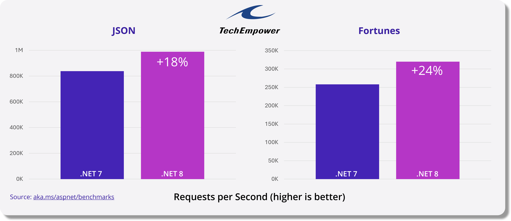

 You can read all about the ASP.NET Core performance improvements in Brennan Conroy's [Performance Improvements in ASP.NET Core 8](https://devblogs.microsoft.com/dotnet/performance-improvements-in-aspnet-core-8/) blog post.

## ASP.NET Core support for native AOT

In .NET 8, we're introducing native AOT support for ASP.NET Core, with an initial focus on cloud-native API applications. It's now possible to [publish an ASP.NET Core app with native AOT](https://learn.microsoft.com/aspnet/core/fundamentals/native-aot), producing a self-contained app that's ahead-of-time (AOT) compiled to native code.

Native AOT apps can have a smaller deployment size, start up very quickly, and use less memory. The application can be run on a machine that doesn't have the .NET runtime installed. The benefit of native AOT is most significant for workloads with many deployed instances, such as cloud infrastructure and hyper-scale services.

### Benefits of using native AOT with ASP.NET Core

Publishing and deploying a native AOT app can provide the following benefits:

- **Reduced disk footprint:** When publishing using native AOT, a single executable is produced containing the program along with the subset of code from external dependencies that the program uses. Reduced executable size can lead to:
  - Smaller container images, for example in containerized deployment scenarios.
  - Reduced deployment time due to smaller images.
- **Reduced startup time:** Native AOT applications can start-up more quickly, in part due to the removal of JIT compilation. Reduced start-up means:
  - The app is ready to service requests quicker.
  - Improved deployment with container orchestrators that manage transitions from one version of the app to another.
- **Reduced memory demand:** ASP.NET Core apps published as native AOT can have reduced memory demands depending on the work being performed, as they enable the new [DATAS GC mode](https://maoni0.medium.com/dynamically-adapting-to-application-sizes-2d72fcb6f1ea) by default. Reduced memory consumption can lead to greater deployment density and improved scalability.

As an example, we ran a [simple ASP.NET Core API app](https://github.com/aspnet/Benchmarks/tree/6683984fada4f506ff0eed92343cc24d633ac608/src/BenchmarksApps/BasicMinimalApi) in our benchmarking lab to compare the differences in app size, memory use, startup time, and CPU load, published with and without native AOT:

Publish kind | Startup time (ms) | App size (MB) | Working set (MB)
------------ | ----------------: | ------------: | ---------------:
Default | 156 | 92.6 | 96
Native AOT | 48 | 10.0 | 41

The table above shows that publishing the app as native AOT dramatically improves startup time, app size, and memory use. Startup time was reduced by **70%**, app size was reduced by **89%**, and memory use under load was reduced by **57%**!

A [more complex sample API app](https://github.com/aspnet/Benchmarks/tree/6683984fada4f506ff0eed92343cc24d633ac608/src/BenchmarksApps/TodosApi) with CRUD-style methods including model validation, OpenAPI, JWT authentication & policy-based authorization, configuration binding, and presistence to a PostgreSQL database using [Npgsql](https://www.npgsql.org/), sees the following changes to its metrics from native AOT:

Publish kind | Startup time (ms) | App size (MB) | Working set (MB)
------------ | ----------------: | ------------: | ---------------:
Default | 473 | 98.27 | 193
Native AOT | 115 | 21.55 | 121

For this more complex app, startup time was reduced by **76%**, app size was reduced by **78%**, and memory use under load was reduced by **37%**!

You can explore these metrics and more on our [public benchmarks dashboard](https://msit.powerbi.com/view?r=eyJrIjoiYTZjMTk3YjEtMzQ3Yi00NTI5LTg5ZDItNmUyMGRlOTkwMGRlIiwidCI6IjcyZjk4OGJmLTg2ZjEtNDFhZi05MWFiLTJkN2NkMDExZGI0NyIsImMiOjV9&pageName=ReportSectiond12fbb3dbabb493336cd).

### ASP.NET Core and native AOT compatibility

Not all features in ASP.NET Core are compatible with native AOT. Similarly, not all libraries commonly used in ASP.NET Core are compatible with native AOT. .NET 8 represents the start of work to enable native AOT in ASP.NET Core, with an initial focus on enabling support for apps using Minimal APIs or gRPC, and deployed in cloud environments. As a reminder, [.NET 7 introduced support for native AOT publish for console projects](https://learn.microsoft.com/dotnet/core/deploying/native-aot/?tabs=net7#limitations-in-the-net-native-aot-deployment-model). Your feedback will help guide our efforts for future releases, to ensure we focus on the places where the benefits of native AOT can have the largest impact.

Native AOT applications come with a few fundamental compatibility requirements. The key ones include:

- No dynamic loading (for example, `Assembly.LoadFile`)
- No runtime code generation via JIT (for example, `System.Reflection.Emit`)
- No C++/CLI
- No built-in COM (only applies to Windows)
- Requires trimming, which has [limitations](https://learn.microsoft.com/dotnet/core/deploying/trimming/incompatibilities)
- Implies compilation into a single file, which has [known incompatibilities](https://learn.microsoft.com/dotnet/core/deploying/single-file/overview?tabs=cli#api-incompatibility)
- Apps include required runtime libraries (just like self-contained apps, increasing their size as compared to framework-dependent apps)

Use of these features will likely make an app incompatible with native AOT. To aid the process of ensuring an app is AOT compatible, the tooling will provide [warnings](https://learn.microsoft.com/dotnet/core/deploying/native-aot/fixing-warnings) when it detects use of incompatible features. If the use is in the source code of the application itself, these warnings will appear as diagnostics in the editor and during compilation. If the use is in a dependency (such as a NuGet package), the warnings will appear during publish, when the IL of the enitre application is compiled to native code.

In cases where more information is required in order to determine if the use of a feature is done in a way that's compatible with native AOT, developers can annotate their code with instructional attributes, such as [`[DynamicallyAccessedMembers]`](https://learn.microsoft.com/dotnet/api/system.diagnostics.codeanalysis.dynamicallyaccessedmembersattribute?view=net-8.0) to indicate that members are dynamically accessed and should be left untrimmed.

In some cases, functionality in apps or libraries will need to be reimplemented in order to be compatible with native AOT. A common example of this is the use of reflection for runtime code generation. [Roslyn source generators](https://learn.microsoft.com/dotnet/csharp/roslyn-sdk/source-generators-overview) allow code to be generated at compile time with similar type discovery and inspection capabilities as runtime-based reflection, and are a useful alternative when preparing for native AOT compatibility.

The following table summarizes ASP.NET Core feature compatibility with native AOT:

| Feature | Fully Supported | Partially Supported | Not Supported |
| - | - | - | - |
| gRPC | <span aria-hidden="true">✅</span><span class="visually-hidden">Fully supported</span> | | |
| Minimal APIs | | <span aria-hidden="true">✅</span><span class="visually-hidden">Partially supported</span> | |
| MVC | | | <span aria-hidden="true">❌</span><span class="visually-hidden">Not supported</span> |
| Blazor | | |<span aria-hidden="true">❌</span><span class="visually-hidden">Not supported</span> |
| SignalR | | | <span aria-hidden="true">❌</span><span class="visually-hidden">Not supported</span> |
| JWT Authentication | <span aria-hidden="true">✅</span><span class="visually-hidden">Fully supported</span> | | |
| Other Authentication | | | <span aria-hidden="true">❌</span><span class="visually-hidden">Not supported</span> |
| CORS | <span aria-hidden="true">✅</span><span class="visually-hidden">Fully supported</span> | | |
| Health checks | <span aria-hidden="true">✅</span><span class="visually-hidden">Fully supported</span> | | |
| Http logging | <span aria-hidden="true">✅</span><span class="visually-hidden">Fully supported</span> | | |
| Localization | <span aria-hidden="true">✅</span><span class="visually-hidden">Fully supported</span>| | |
| Output caching | <span aria-hidden="true">✅</span><span class="visually-hidden">Fully supported</span> | | |
| Rate limiting | <span aria-hidden="true">✅</span><span class="visually-hidden">Fully supported</span> | | |
| Request decompression | <span aria-hidden="true">✅</span><span class="visually-hidden">Fully supported</span> | | |
| Response caching | <span aria-hidden="true">✅</span><span class="visually-hidden">Fully supported</span> | | |
| Response compression | <span aria-hidden="true">✅</span><span class="visually-hidden">Fully supported</span> | | |
| Rewrite | <span aria-hidden="true">✅</span><span class="visually-hidden">Fully supported</span> | | |
| Session | | |<span aria-hidden="true">❌</span><span class="visually-hidden">Not supported</span> |
| SPA | | |<span aria-hidden="true">❌</span><span class="visually-hidden">Not supported</span> |
| Static files | <span aria-hidden="true">✅</span><span class="visually-hidden">Fully supported</span> | | |
| WebSockets | <span aria-hidden="true">✅</span><span class="visually-hidden">Fully supported</span> | | |

You can see [current known issues regarding ASP.NET Core and native AOT compatibility in .NET 8 here](https://github.com/dotnet/core/issues/8288).

When building your application, keep an eye out for [AOT warnings](https://learn.microsoft.com/dotnet/core/deploying/native-aot/fixing-warnings). An application that produces AOT warnings during publishing is not guaranteed to work correctly. If you don't get any AOT warnings at publish time, you should be confident that your application will work consistently after publishing for AOT as it did during your F5 / `dotnet run` development workflow. That said, it is still important to test your application thoroughly when moving to a native AOT deployment model, to ensure that functionality observed during development (when the app is untrimmed and JIT-compiled) is preserved in the native executable.

### Minimal APIs and native AOT

In order to make Minimal APIs compatible with native AOT, we've introduced the [Request Delegate Generator (RDG)](https://learn.microsoft.com/aspnet/core/fundamentals/aot/request-delegate-generator/rdg?view=aspnetcore-8.0). The RDG is a [source generator](https://learn.microsoft.com/dotnet/csharp/roslyn-sdk/source-generators-overview) that performs similar work to the [`RequestDelegateFactory` (RDF)](https://learn.microsoft.com/dotnet/api/microsoft.aspnetcore.http.requestdelegatefactory), turning the various `MapGet()`, `MapPost()`, etc., calls in your application into `RequestDelegate`s associated with the specified routes, but rather than doing it in-memory in your application when it starts, it does it at compile-time and generates C# code directly into your project. This removes the runtime generation of this code, and ensures the types used in your APIs are preserved in your application code in a way that is statically analyzable by the native AOT tool-chain, ensuring that required code is not trimmed away. We've worked to ensure that most of the Minimal API features you enjoy today are supported by the RDG and thus compatible with native AOT.

The RDG is enabled automatically in your project when you enable publishing with native AOT. You can also manually enable RDG even when not using native AOT by setting `<EnableRequestDelegateGenerator>true</EnableRequestDelegateGenerator>` in your project file. This can be useful when initially evaluating your project's readiness for native AOT, or potentially to reduce the startup time of your application.

Minimal APIs are optimized for receiving and returning JSON payloads using `System.Text.Json`, and as such the compatibility requirements for JSON and native AOT apply too. This requires the use of the [`System.Text.Json` source generator](https://learn.microsoft.com/dotnet/standard/serialization/system-text-json/source-generation). All types accepted as parameters to or returned from request delegates in your Minimal APIs must be configured on a `JsonSerializerContext` that is registered via ASP.NET Core's dependency injection, e.g.:

```csharp
// Register the JSON serializer context with DI
builder.Services.ConfigureHttpJsonOptions(options =>
{
    options.SerializerOptions.TypeInfoResolverChain.Insert(0, AppJsonSerializerContext.Default);
});

...

// Add types used in your Minimal APIs to source generated JSON serializer content
[JsonSerializable(typeof(Todo[]))]
internal partial class AppJsonSerializerContext : JsonSerializerContext
{

}
```

### gRPC and native AOT

gRPC supports native AOT in .NET 8. Native AOT enables publishing gRPC client and server apps as small, fast native executables. Learn more about [gRPC and native AOT](https://learn.microsoft.com/aspnet/core/grpc/native-aot?view=aspnetcore-8.0) in the related docs.

### Libraries and native AOT

Many of the common libraries you enjoy using in your ASP.NET Core projects today will have some compatibility issues when used in a project targeting native AOT. Popular libraries often rely on the dynamic capabilities of .NET reflection to inspect and discover types, conditionally load libraries at runtime, and generate code on the fly to implement their functionality. As stated earlier, these behaviors can cause compatibility issues with native AOT, and as such, these libraries will need to be updated in order to work with native AOT by using tools like [Roslyn source generators](https://learn.microsoft.com/dotnet/csharp/roslyn-sdk/source-generators-overview).

Library authors wishing to learn more about preparing their libraries for native AOT are encouraged to start by [preparing their library for trimming](https://learn.microsoft.com/dotnet/core/deploying/trimming/prepare-libraries-for-trimming) and learning more about enabling the [AOT-compatibility analyzers](https://learn.microsoft.com/dotnet/core/deploying/native-aot/?tabs=net8plus#aot-compatibility-analyzers) in their library projects.

### Getting started with native AOT deployment in ASP.NET Core

Native AOT is a publishing option. AOT compilation happens when the app is published. A project that uses native AOT publishing will use JIT compilation when debugging or running as part of the developer inner-loop, but there are some observable differences:

- Some features that aren't compatible with native AOT are disabled and throw exceptions at runtime.
- A source analyzer is enabled to highlight project code that isn't compatible with native AOT. At publish time, the entire app, including referenced NuGet packages, is analyzed for compatibility again.

Native AOT analysis during publish includes all code from the app and the libraries the app depends on. Review [native AOT warnings](https://learn.microsoft.com/dotnet/core/deploying/native-aot/fixing-warnings) and take corrective steps. It's a good idea to test publishing apps frequently to discover issues early in the development lifecycle.

The [following prerequisites](https://learn.microsoft.com/dotnet/core/deploying/native-aot/#prerequisites) need to be installed before publishing .NET projects with native AOT.

On Windows, install [Visual Studio 2022](https://visualstudio.microsoft.com/vs/), and include the "Desktop development with C++" workload with all default components.

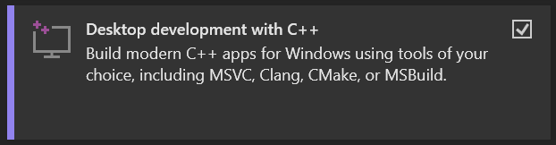

On Linux, install the compiler toolchain and developer packages for libraries that the .NET runtime depends on:

- Ubuntu (18.04+)

    ```sh
    sudo apt-get install clang zlib1g-dev
    ```

- Alpine (3.15+)

    ```sh
    sudo apk add clang build-base zlib-dev
    ```

Note that at this time, cross-platform native AOT publishing is not supported, meaning you need to perform the publish on the same platform type as the intended target, e.g. if targeting a deployment to Linux, perform the publish on Linux. Docker containers can be a convenient way to enable cross-platform publishing, an [example of which can be found in the dotnet-docker repo](https://github.com/dotnet/dotnet-docker/blob/1a88de08b1fef937c628b877d8300634f8f650fe/samples/releasesapi/README.md#cross-compilation).

Native AOT published ASP.NET Core apps can be deployed and run anywhere native executables can. Containers are a popular choice for this. Native AOT published .NET applications have the same platform requirements as .NET self-contained applications, and as such should set [`mcr.microsoft.com/dotnet/runtime-deps`](https://mcr.microsoft.com/product/dotnet/runtime-deps/about) as their base image.

### Native AOT-ready project templates

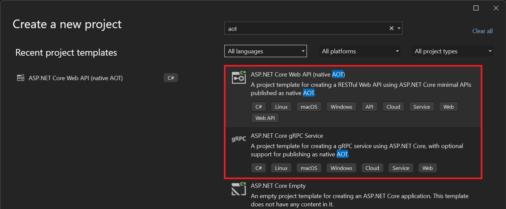

In .NET 8, there are two native AOT-enabled project templates to help get you started building ASP.NET Core apps with native AOT.

The "ASP.NET Core gRPC Service" project template has been updated to include a new "Enable native AOT publish" option that, when selected, configures the new project to publish as native AOT. This is done by setting `<PublishAot>true</PublishAot>` in the project's .csproj file.

There is also a brand new "ASP.NET Core Web API (native AOT)" project template, that produces a project more directly focused on cloud-native, API-first scenarios. This template is pre-configured for native AOT, and differs from the existing "Web API" project template in the following ways:

- Uses Minimal APIs only, as MVC is not yet native AOT compatible
- Uses the new `WebApplication.CreateSlimBuilder` API to ensure only the essential features are enabled by default, minimzing the app's deployed size
- Configured to listen on HTTP only, as HTTPS traffic is commonly handled by an ingress service in cloud-native deployments
- Does not include a launch profile for running under IIS or IIS Express
- Enables the JSON serializer source generator
- Includes a sample "Todos API" instead of the weather forecast sample

You can create a new Web API project configured to publish as native AOT using the dotnet CLI:

```sh
dotnet new webapiaot
```

Here is the content of *Program.cs* in a project created with the new "ASP.NET Core Web API (native AOT)" template:

```csharp
using System.Text.Json.Serialization;

var builder = WebApplication.CreateSlimBuilder(args);

builder.Services.ConfigureHttpJsonOptions(options =>
{
    options.SerializerOptions.TypeInfoResolverChain.Insert(0, AppJsonSerializerContext.Default);
});

var app = builder.Build();

var sampleTodos = new Todo[] {
    new(1, "Walk the dog"),
    new(2, "Do the dishes", DateOnly.FromDateTime(DateTime.Now)),
    new(3, "Do the laundry", DateOnly.FromDateTime(DateTime.Now.AddDays(1))),
    new(4, "Clean the bathroom"),
    new(5, "Clean the car", DateOnly.FromDateTime(DateTime.Now.AddDays(2)))
};

var todosApi = app.MapGroup("/todos");
todosApi.MapGet("/", () => sampleTodos);
todosApi.MapGet("/{id}", (int id) =>
    sampleTodos.FirstOrDefault(a => a.Id == id) is { } todo
        ? Results.Ok(todo)
        : Results.NotFound());

app.Run();

public record Todo(int Id, string? Title, DateOnly? DueBy = null, bool IsComplete = false);

[JsonSerializable(typeof(Todo[]))]
internal partial class AppJsonSerializerContext : JsonSerializerContext { }
```

### Native AOT call to action

Native AOT deployment is not suitable for every application, but in the scenarios where the benefits that native AOT offers are compelling, it can have a huge impact. While this is just the beginning, we'd love for you try out native AOT support for ASP.NET Core in .NET 8, and share any feedback you have by leaving a comment here, or [logging an issue on GitHub](https://github.com/dotnet/aspnetcore/issues/new). Be sure to read the [current known issues regarding ASP.NET Core and native AOT compatibility](https://github.com/dotnet/core/issues/8288).

In .NET 8, along with the features of ASP.NET Core detailed here, JWT authentication, options validation, and ADO.NET data access for SQLite and PostgreSQL, have all been updated for native AOT compatibility. We look forward to the .NET ecosystem continuing to enable more libraries and features for native AOT.

## Full stack web UI with Blazor

Blazor in .NET 8 has grown from being a compelling client web UI framework to a full-stack web UI framework that can handle all of your web UI needs. Blazor in .NET 8 combines the strengths of Blazor WebAssembly, Blazor Server, and advanced server-side rendering techniques into a single component-based framework. By leveraging both the client and server, Blazor enables you to deliver an optimized web UI experience that will delight your users.

Blazor in .NET 8 now supports the following new capabilities:

- **[Static server-side rendering](https://learn.microsoft.com/aspnet/core/blazor/components/render-modes#static-render-mode)**: Host Blazor components as ASP.NET Core endpoints that render static HTML in response to requests, so that content renders immediately without the need to download any client code. Also [handle form requests](https://learn.microsoft.com/aspnet/core/blazor/forms) using Blazor's built-in form components and convenient event-based programming model.
- **[Enhanced navigation & form handling](https://learn.microsoft.com/aspnet/core/blazor/fundamentals/routing#enhanced-navigation-and-form-handling)**: Blazor will automatically enhance how pages are loaded and form requests are handled by intercepting these requests and then programmatically patching the server rendered content into the DOM. No need to re-download previously retrieved web assets, and existing DOM state is preserved. Your app feels fast and smooth like a single-page app even though it's still doing static server-side rendering.
- **[Streaming rendering](https://learn.microsoft.com/aspnet/core/blazor/components/rendering#streaming-rendering)**: Immediately render components to get pixels on the screen fast while long running async tasks execute, and then automatically stream updates to the browser as content becomes available.
- **[Enable interactivity per component or page](https://learn.microsoft.com/aspnet/core/blazor/components/render-modes)**: Enable interactive rendering based on Blazor Server or Blazor WebAssembly for individual components or pages using the new `@rendermode` Razor directive. You only incur the cost for interactivity, like setting up a WebSocket connection or downloading the .NET WebAssembly runtime, where it's used.
- **[Auto select the render mode at runtime](https://learn.microsoft.com/aspnet/core/blazor/components/render-modes#auto-render-mode)**: Automatically shift users from the server to the client at runtime to improve app load time and scalability​. The component initially renders interactively using Blazor Server while the .NET WebAssembly runtime is downloaded in the background. For future visits, the component switches to use Blazor WebAssembly automatically so you get a fast initial load time and less load on your servers.

## More built-in Blazor components and capabilities

Blazor also includes many new built-in components and capabilities that make you more productive and help get the job done fast.

Blazor now ships with [QuickGrid](https://learn.microsoft.com/aspnet/core/blazor/components/quickgrid), a fast and functional data grid component for handling your most common data needs. `QuickGrid` can load strongly-typed data from a variety of data sources, included Entity Framework Core, and you can quickly wire up `QuickGrid` to an existing data model using the new Blazor CRUD scaffolder. It supports sorting, filtering, paging, and virtualization. Check out the [QuickGrid demo site](https://aka.ms/blazor/quickgrid) to see the component in action.

Blazor also now supports [sections](https://learn.microsoft.com/aspnet/core/blazor/components/sections), which are outlets for content that can be filled in by other components using the new `SectionOutlet` and `SectionContent` components. Sections are a great way to define outlets in your app layout that can then be customized by individual pages.

Routing in Blazor also got a big upgrade in .NET 8. The Blazor router can now route to named elements using standard URL fragments, and you can now use most ASP.NET Core routing features when defining Blazor page routes, like specifying route constraints.

## .NET WebAssembly improvements

Running your .NET code on WebAssembly from the browser is significantly improved in .NET 8. Your .NET code runs much faster thanks to the new Jiterpreter based runtime, which enables partial just-in-time (JIT) compilation support for WebAssembly. With the new runtime, components render 20% faster and JSON deserialization is twice as fast!

The .NET WebAssembly runtime also supports many new edit types with Hot Reload, including full parity with the Hot Reload capabilities of CoreCLR and editing of generic types.

A new web-friendly packaging format for Blazor WebAssembly apps, called [WebCIL](https://learn.microsoft.com/aspnet/core/release-notes/aspnetcore-8.0#web-friendly-webcil-packaging), streamlines deployment by removing all Windows-specific bits from your .NET assemblies and repackaging them as WebAssembly files. With WebCIL, you can deploy your Blazor WebAssembly apps with confidence.

## New Blazor Web App template

Getting started with all the new Blazor features in .NET 8 is easy with the new Blazor Web App project template. It's your one-stop-shop for all your web development needs.

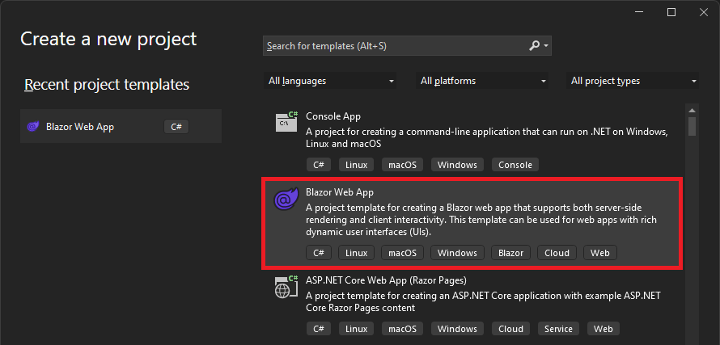

The Blazor Web App template includes convenient options for:

- **Authentication type**: Quickly get set up with authentication using ASP.NET Core Identity with a UI completely implemented using Blazor components.
- **Interactive render mode**: Decide which interactive render modes you want to enable: Server, WebAssembly, or both with Auto.
- **Interactive location**: Decide if you want your entire app to be interactive, or just individual components and pages.
- **Include sample pages**: Choose to include some sample pages to get you going, or just start with an empty project.

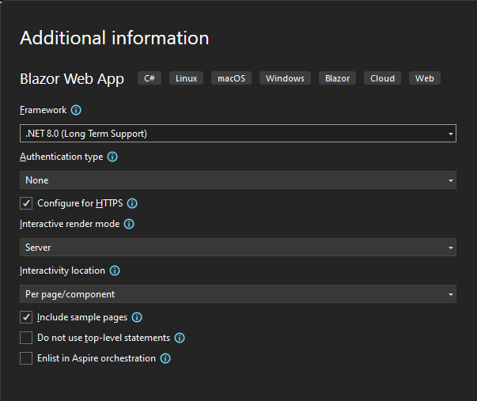

To try out building your first Blazor Web App with .NET 8, just head over to https://blazor.net and click on [Get started](https://dotnet.microsoft.com/learn/aspnet/blazor-tutorial) to begin your Blazor learning journey.

## New Blazor scaffolder (Preview)

You can quickly get started using Blazor static server rendering and `QuickGrid` to display data from a database using the new Blazor scaffolder now available with the latest [Visual Studio Preview](https://visualstudio.com/preview). You can use the Blazor scaffolder by right clicking on the project in the Solution Explorer and selecting Add >  New Scaffolded Item, and then selecting **Razor Components using Entity Framework (CRUD)**.

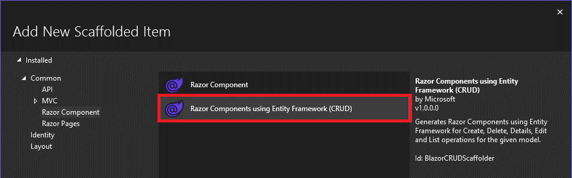

The Blazor scaffolder generates basic Create, Read, Update, and Delete (CRUD) pages based on an Entity Framework Core data model. You can scaffold individual pages or all the CRUD pages in one go. You select the model class and the `DbContext` that should be used, optionally creating a new `DbContext` if needed.

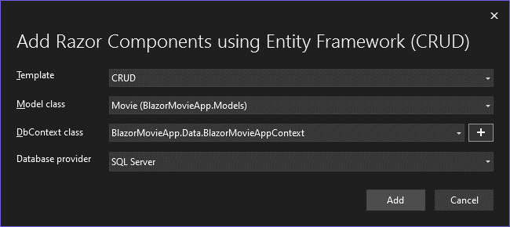

The scaffolded Blazor components will then be added to your project to enable the CRUD operations on the model class selected.

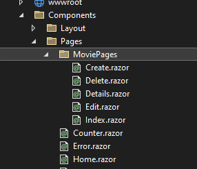

Note that these pages are based on server-side rendering, so they aren't support when running on WebAssembly.

The generated *Index.razor* component uses `QuickGrid` to display the data, so you can easily customize how your data is displayed and enable interactivity to take advantage of its many features.

Here's an example of what the scaffolded components look like when the app is running:

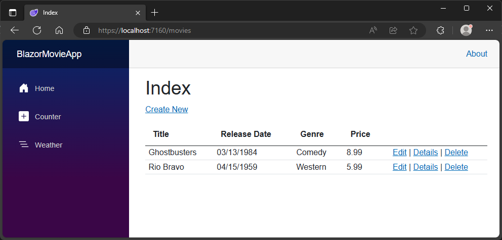

## Generic attributes for MVC

MVC attributes that previously required a `Type` parameter are now available as generic attributes, for a much cleaner syntax.

For example, you can now specify the response type for an API controller action like this:

```csharp
[ApiController]
[Route("api/[controller]")]
public class TodosController : Controller
{
  [HttpGet("/")]
  [ProducesResponseType<Todo>(StatusCodes.Status200OK)]
  public Todo Get() => new Todo(1, "Write a sample", DateTime.Now, false);
}
```

You can find a full list of the new [generic attributes for MVC](https://learn.microsoft.com/aspnet/core/release-notes/aspnetcore-8.0#support-for-generic-attributes) in the release notes.

## Identity API endpoints

ASP.NET Core now provides API endpoints for interacting with ASP.NET Core Identity. These endpoints enable programmatic access to functionality for registering and logging in users, which simplifies setting up authentication for browser and mobile client apps. The endpoints can be used for both cookie and token-based authentication. Check out Jeremy Likness's blog post on [What's new with identity in .NET 8](https://devblogs.microsoft.com/dotnet/whats-new-with-identity-in-dotnet-8/) to learn all about how to set up and use these new endpoints.

## Enhanced form binding for Minimal APIs and anti-forgery middleware

ASP.NET Core adds support for an anti-forgery middleware that supports validating anti-forgery tokens in requests across all framework implementations (Blazor, Minimal APIs, MVC). Alongside this, form binding in Minimal APIs is also enhanced with support for binding complex types from form inputs, using the same binding logic shared by Blazor.

## SignalR stateful reconnect

SignalR can now reduce the perceived downtime for clients when there is a temporary disconnect in the network connection, like when switching networks or a brief loss in connectivity. You can configure SignalR to do a [stateful reconnect](https://learn.microsoft.com/aspnet/core/signalr/configuration#configure-stateful-reconnect), which will set up the client and server to replay messages that might have been sent while the connection was down. SignalR will automatically take care of buffering messages and keeping track of which messages were already received.

## Keyed Services Support in Dependency Injection

ASP.NET Core now supports using keyed services in dependency injection (sometimes called "Keyed DI"). Keyed DI allows you to have multiple implementations of some service which are distinguished using a developer-friendly name. For example, you can have a database connection for user profiles called "UserProfiles" and another for shopping cart contents called "ShoppingCarts".

Keyed DI is particularly valuable in scenarios where different implementations of a service are needed under different conditions. For instance, in multi-tenant applications, it allows for tenant-specific services, enabling customization and scalability without complicating the codebase. It's also instrumental in feature management, allowing for dynamic toggling of features or testing different implementations seamlessly. This level of control and modularity is a significant step forward for developers aiming for clean, maintainable, and adaptable code.

Registering and using keyed services is both intuitive and flexible. Here's a glimpse of how it works:
 
### Registration of Keyed Services:
 
Keyed services are registered in the service collection with unique keys:
 
```csharp
services.AddKeyedSingleton<IMyService, MyService>("key1");
services.AddKeyedTransient<IMyService, MyService>("key2");
```
 
This approach allows the same interface to be associated with different implementations, each identifiable by a unique key.

### Using Keyed Services:

Keyed services are supported in controllers, minimal API, and SignalR Hubs.

To leverage the new keyed services support, annotate the target parameter with the [FromKeyedServices("keyName")] attribute. 

For instance, here are examples of how to use keyed services in controllers and minimal APIs:

**In MVC Controllers:**
 
```csharp
public class SomeApiController : Controller
{
    // Keyed service binding on constructor
    public SomeApiController([FromKeyedServices("key1")] IMyService service)
    { [...] }
    // Keyed service binding on method
    [HttpGet("SomeAction")]
    public ActionResult<string> SomeAction([FromKeyedServices("key2")] IMyService service)
    { [...] }
}
```
 
**In Minimal APIs:**
 
Similarly, in minimal API setups, injecting multiple keyed services into endpoints is streamlined:
 
```csharp
app.MapGet("/", 
    ([FromKeyedServices("key1")] IMyService s1, [FromKeyedServices("key2")] IMyService s2) => [...]);
```

You can learn more about keyed services from the [dependency injection docs](https://learn.microsoft.com/aspnet/core/fundamentals/dependency-injection?view=aspnetcore-8.0#keyed-services).

## Metrics

Metrics are numerical measurements reported over time, like requests received per second, or the number of error responses sent. Metrics are used to monitor the health of apps and raise alerts.

ASP.NET Core now provides rich runtime metrics using [System.Diagnostics.Metrics](https://learn.microsoft.com/dotnet/core/diagnostics/compare-metric-apis#systemdiagnosticsmetrics), a new cross-platform API designed in close collaboration with the [OpenTelemetry](https://opentelemetry.io/) community.

These new metrics offers many improvements compared to existing event counters:

- New kinds of measurements with counters, gauges and histograms.
- Powerful reporting with multi-dimensional values.
- Integration into the wider cloud native ecosystem by aligning with OpenTelemetry standards.

You can read all about the new metrics available in ASP.NET Core and how to integrate them into your monitoring systems in the [ASP.NET Core metrics](https://learn.microsoft.com/aspnet/core/log-mon/metrics/metrics) doc.

A popular way to use metrics is with Grafana, an OSS cloud-native data visualization tool. The .NET team has published Grafana dashboards built on top of the new metrics. The dashboards allow you to see the real-time status of your ASP.NET Core apps. 


Download the dashboards directly from [.NET team @ grafana.com](https://aka.ms/dotnet/grafana-dashboards) and find out more at [.NET Grafana dashboards](https://aka.ms/dotnet/grafana-source#readme).

## Named pipes transport

ASP.NET Core now provides a named pipes transport for inter-process communication (IPC) on Windows. Named pipes integrate well with Windows security to control client access to the pipe. See the ASP.NET Core docs on [Inter-process communication with gRPC](https://learn.microsoft.com/aspnet/core/grpc/interprocess) to learn all about setting up IPC with named pipes or Unix domain sockets.

## Redis-based output caching

ASP.NET Core in .NET 8 adds support for [using Redis as a distributed cache for output caching](https://learn.microsoft.com/aspnet/core/performance/caching/output#redis-cache). Output caching provides a flexible way to cache HTTP responses from the server. Using Redis for cache storage provides consistency between server nodes via a shared cache that outlives individual server processes.

## Route tooling

Routing requests is a key part of any web app. New route tooling features in Visual Studio make working with ASP.NET Core routes easier than ever before. These features include:

- Route syntax highlighting
- Editor completions for matching parameter and route names
- Editor completions for route constraints
- Route analyzers and fixers for common syntax mistakes

For example, here's what routes look like with .NET 7:

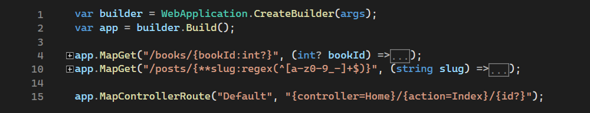

And here's what they look like with .NET 8:

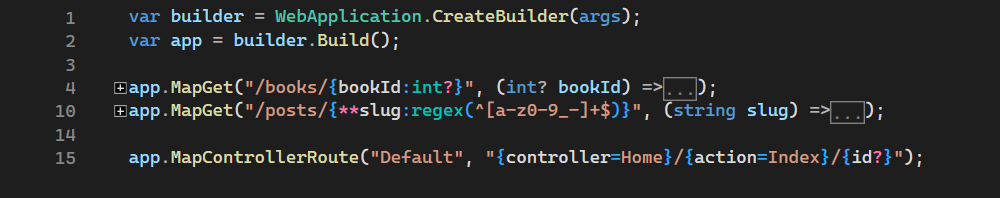

You can read all about the new route tooling features in James Newton-King's [ASP.NET Core Route Tooling Enhancements in .NET 8](https://devblogs.microsoft.com/dotnet/aspnet-core-route-tooling-dotnet-8/) blog post.

## Debugging improvements

.NET's powerful debugger plays a critical role in the development of any .NET app, and ASP.NET is no exception. In .NET 8 we've improved the debugging visualization experience for commonly used types in ASP.NET Core apps so that the debugger surfaces the most important information right away. 

For example, here's what examining the `HttpContext` looks like with .NET 7:


Here's what it looks like with .NET 8, where the most important values are visible right away:


Check out all the new ASP.NET debugging improvements in James Newton-King's post on [Debugging Enhancements in .NET 8](https://devblogs.microsoft.com/dotnet/debugging-enhancements-in-dotnet-8/) blog post.

## JavaScript SDK and project system

Often when working with ASP.NET Core you also need to work with some JavaScript and the JavaScript ecosystem. Bridging the .NET and JavaScript world can be challenging. The new JavaScript SDK and project system in Visual Studio make it easy to use .NET with frontend JavaScript frameworks. The JavaScript SDK provides MSBuild integration for building, running, debugging, testing, and publishing your JavaScript or TypeScript code alongside your .NET code. You can easily integrate with popular JavaScript build tools, like WebPack, Rollup, Parcel, esbuild, and others.

You can quickly get started using ASP.NET Core with Angular, React, and Vue using the provide Visual Studio templates:

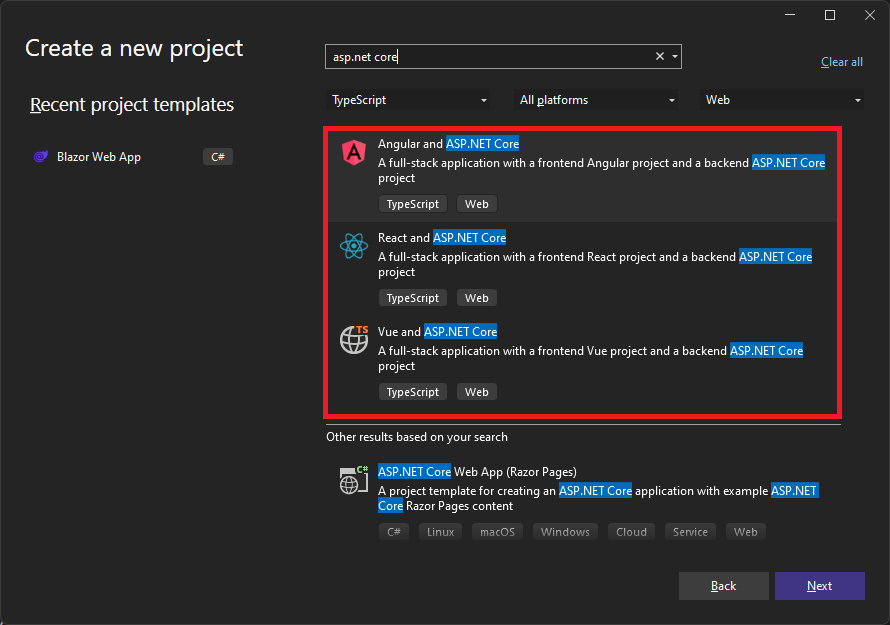

These templates are available for both JavaScript and TypeScript and use the latest frontend JavaScript CLI tooling to generate the client app, so you're always up to date with the latest version.

You can use the **Install New npm Packages** dialog to easily search for and install npm dependencies:

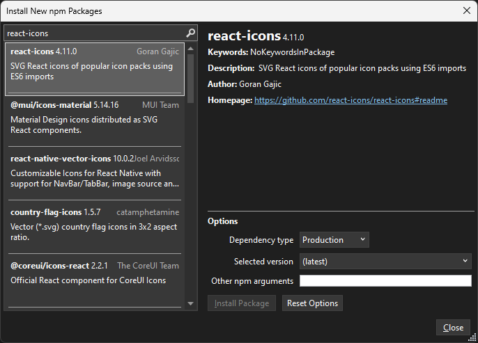

When you build your JavaScript project, the JavaScript SDK will install any npm package dependencies. You can then run your app from Visual Studio or on the command-line using `dotnet run`. In Visual Studio, you get rich debugging support for both your .NET and JavaScript code.

You can also use the Visual Studio Test Explorer to discover and run your tests:

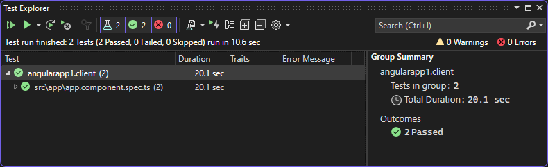

You can learn more about working with .NET and JavaScript together in Visual Studio in the [Visual Studio for JavaScript docs](https://aka.ms/dotnet/js).

## And there's much more!

This was just a sampling of what's new in ASP.NET Core for .NET 8. For the full list, check out the [ASP.NET Core in .NET 8 release notes](https://learn.microsoft.com/aspnet/core/release-notes/aspnetcore-8.0).

## Upgrade an existing project

To upgrade an existing ASP.NET Core app from .NET 7 to .NET 8, follow the steps in [Migrate from ASP.NET Core 7.0 to 8.0](https://learn.microsoft.com/aspnet/core/migration/70-80)

To upgrade an existing ASP.NET Core app from .NET 8 RC2 to .NET 8, update all ASP.NET Core package references to `8.0.0`. In Blazor Web Apps, you should also replace the earlier render mode attributes with the new `@rendermode` directive:

- Add `@using static Microsoft.AspNetCore.Components.Web.RenderMode` to your *_Imports.razor* file
- Replace `@attribute [RenderModeInteractiveServer]` with `@rendermode InteractiveServer`
- Replace `@attribute [RenderModeInteractiveWebAssembly]` with `@rendermode InteractiveWebAssembly`
- Replace `@attribute [RenderModeInteractiveAuto]` with `@rendermode InteractiveAuto`

That's it! You should be all set to enjoy the benefits of .NET 8.

See also the full list of [breaking changes](https://learn.microsoft.com/dotnet/core/compatibility/8.0) in ASP.NET Core for .NET 8.

## .NET 8 on Azure

.NET 8 is already deployed and ready to be used with all your favorite Azure services, including [Azure App Service](https://aka.ms/appservice-dotnet8), [Azure Functions](https://aka.ms/af-dotnet-isolated-net8), and [Azure Static Web Apps](https://aka.ms/swa-dotnet8). Get started building with .NET 8 on Azure today!

## Build cloud-native apps seamlessly with .NET Aspire and ASP.NET Core

.NET 8 introduces an integrated approach to cloud-native applications through .NET Aspire, crafted using the robust capabilities of ASP.NET Core. This collaboration offers ASP.NET developers a familiar environment to leverage their existing skills while benefiting from an opinionated stack designed for resilience, observability, and configurability in the cloud. .NET Aspire seamlessly enhances ASP.NET Core, incorporating essential cloud-native components like telemetry, resilience strategies, configuration management, and health checks out-of-the-box. For a smooth transition to cloud-native development with tools you know and trust, explore the [.NET Aspire announcement](https://aka.ms/dotnet/aspire) and discover how it can streamline your cloud-native application development.

## Join us for the .NET 8 release at .NET Conf 2023

Come celebrate with us and learn all about the .NET 8 release at [.NET Conf 2023](https://dotnetconf.net), a FREE, three day virtual developer event featuring speakers from the .NET team and the broader .NET community. The conference starts TODAY and goes from November 14-16. We hope you can join us!

## Thank you!

Thank you to everyone in the community who helped make this release of .NET 8 possible! This release represents the culmination of many GitHub issues, pull requests, design feedback comments and documentation updates contributed by many members of the .NET community. We couldn't have made it to this point without you!

We hope you enjoy this release of ASP.NET Core in .NET 8. We're eager to hear about your experiences building with it. Let us know about any feedback you have on this release on [GitHub](https://github.com/dotnet/aspnetcore/issues).

Thanks again, and happy coding!
