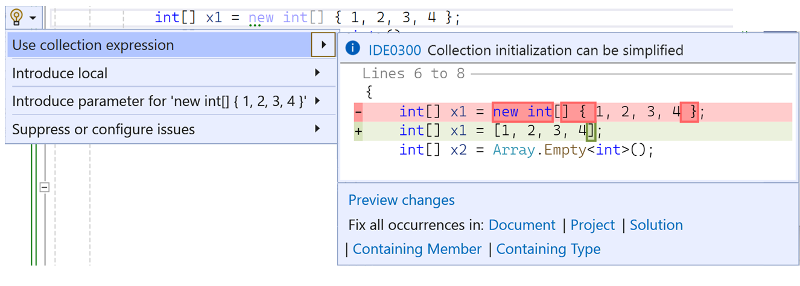

C# 12 is available today! You can get it by downloading [.NET 8](https://dotnet.microsoft.com/download/dotnet/8.0), the latest [Visual Studio](https://visualstudio.microsoft.com/downloads), or [Visual Studio Code's C# Dev Kit](https://marketplace.visualstudio.com/items?itemName=ms-dotnettools.csdevkit).

For your existing projects, you'll also need to indicate that you want to change your language version. You can change your language version by changing your `TargetFramework` to .NET 8:

```xml
<Project Sdk="Microsoft.NET.Sdk">
	<PropertyGroup>
		<TargetFramework>net8.0</TargetFramework>
...
	</PropertyGroup>
</Project>
```

C# 12 brings better developer productivity with simplified syntax, and faster execution. You can check out details on each feature in the [What's new in C# 12](https://learn.microsoft.com/dotnet/csharp/whats-new/csharp-12) article on MS Learn. The *What's new* article includes links to updates across the C# documentation on MS Learn that reflect the new features.

## Simplifying your code

Every version of C# helps you write better code - simpler code that better expresses your intent. Compared with the code you previously wrote, the new approach is as fast or faster and has the same or fewer allocations. You can adopt these new features with confidence. One design goal for new features is to ensure that adopting the new feature doesn't degrade performance.

C# 12 introduces collection expressions, primary constructors for all classes and structs, syntax to alias any type, and default parameters for lambda expressions that simplify your code.

### Collection expressions

Prior to C# 12, creating collections required different syntax for different scenarios. Initializing a `List<int>` required different syntax than an `int[]` or `Span<int>`. Here are just a few of the ways collections might be created:

```csharp
int[] x1 = new int[] { 1, 2, 3, 4 };
int[] x2 = Array.Empty<int>();
WriteByteArray(new[] { (byte)1, (byte)2, (byte)3 });
List<int> x4 = new() { 1, 2, 3, 4 };
Span<DateTime> dates = stackalloc DateTime[] { GetDate(0), GetDate(1) };
WriteByteSpan(stackalloc[] { (byte)1, (byte)2, (byte)3 });
```

Collection expressions are a unified syntax:

```csharp
int[] x1 = [1, 2, 3, 4];
int[] x2 = [];
WriteByteArray([1, 2, 3]);
List<int> x4 = [1, 2, 3, 4];
Span<DateTime> dates = [GetDate(0), GetDate(1)];
WriteByteSpan([1, 2, 3]);
```

Not only can you use a single syntax, but the compiler creates fast code for you. In many cases, the compiler sets the collection capacity and avoids copying data.

And if this wasn't enough - you can use the new spread operator to include the elements of one or more collections or enumerable expressions within a collection expression:

```csharp
int[] numbers1 = [1, 2, 3];
int[] numbers2 = [4, 5, 6];
int[] moreNumbers = [.. numbers1, .. numbers2, 7, 8, 9];
// moreNumbers contains [1, 2, 3, 4, 5, 6, 7, 8, ,9];
```

The implementation of any spread expression is optimized, and will often be better than the code you might write to combine collections.

We are very interested in [feedback on possible future work on collection expressions](https://github.com/dotnet/csharplang/discussions/7666). We are considering expanding collection expressions to include dictionaries and support for `var` (natural types) in a future version of C#. 

Like many new C# features, analyzers can help you check out the new feature and update your code:



Find out more about [collection expressions in this article on MS Learn](https://learn.microsoft.com/dotnet/csharp/whats-new/csharp-12#collection-expressions).

### Primary constructors on any class or struct

C# 12 extends primary constructors to work on all classes and structs, not just records. Primary constructors let you define constructor parameters when you declare the class:

```csharp
public class BankAccount(string accountID, string owner)
{
    public string AccountID { get; } = accountID;
    public string Owner { get; } = owner;

    public override string ToString() => $"Account ID: {AccountID}, Owner: {Owner}";
}
```

The most common uses for a primary constructor parameter are:

* As an argument to a base() constructor invocation.
* To initialize a member field or property.
* Referencing the constructor parameter in an instance member.
* To remove boilerplate in dependency injection.

You can think of a primary constructor parameter as a parameter that is in scope for the entire class declaration. 

You can add primary constructors to any type: `class`, `struct`, `record class` and `record struct`. When used on `class` and `struct` types, primary constructor parameters are in scope in the entire `class` or `struct` definition. You can use the parameters to initialize fields or properties, or in the body of other members. When used on `record` types, the compiler generates a public property for each primary constructor parameter. Those properties are simply one of the many members automatically generated for `record` types.

We are very interested in [feedback on possible future work on primary constructors](https://github.com/dotnet/csharplang/discussions/7667). We are considering allowing you to mark primary constructor parameters as `readonly` and to indicate that you want a public property created.

Find out [more about primary constructors in this article](https://learn.microsoft.com/dotnet/csharp/whats-new/csharp-12#primary-constructors). To dive deeper into using primary constructors for records and non-records, check out [Tutorial: Explore primary constructors](https://learn.microsoft.com/dotnet/csharp/whats-new/tutorials/primary-constructors).

### Alias any type

Aliasing types is a convenient way to remove complex type signatures from your code. Starting with C# 12, additional types are valid in `using` alias directives. For example, these aliases are not valid in earlier versions of C#:

```csharp
using intArray = int[]; // Array types.
using Point = (int x, int y);  // Tuple type
using unsafe ArrayPtr = int*;  // Pointer type (requires "unsafe")
```

You can check out the feature spec [Allow using alias directive to reference any kind of Type](https://learn.microsoft.com/dotnet/csharp/language-reference/proposals/csharp-12.0/using-alias-types) for `using` alias with pointer and unsafe types.

Like other `using` aliases, these types can be used at the top of a file and in `global using` statements.

Find out [more about alias any type in this article](https://learn.microsoft.com/dotnet/csharp/whats-new/csharp-12#alias-any-type).

### Default lambda parameters

Starting in C# 12, you can declare default parameters in lambda expressions:

```csharp
var IncrementBy = (int source, int increment = 1) => source + increment;

Console.WriteLine(IncrementBy(5)); // 6
Console.WriteLine(IncrementBy(5, 2)); // 7
```

Default lambda parameters let calling code skip passing values and lets you add parameters to existing lambda expressions without breaking calling code. This simplifies accessing lambda expressions in the same way default parameters in methods simplify calling methods.

Find out [more about default lambda parameters in this article](https://learn.microsoft.com/dotnet/csharp/whats-new/csharp-12#default-lambda-parameters).

## Making your code faster

We continue to improve your ability to work with raw memory to improve application performance.

The performance improvements we have made in C# over the years are important, whether you directly use them or not. Most applications get faster because the .NET runtime and other libraries leverage these enhancements. Of course, if your application uses buffers of memory in hot paths, you can also take advantage of these features. They'll make your app that much faster.

In C# 12, we add `ref readonly` parameters and inline arrays.

### ref readonly parameters

The addition of `ref readonly` parameters provides the final combination of passing parameters by reference or by value. An argument to a `ref readonly` parameter must be a variable. Similar to`ref` and `out` arguments, the argument shouldn't be a literal value or a constant.  A literal argument generates a warning and the compiler creates a temporary variable. Like `in` parameters, a `ref readonly` parameter can't be modified. A method should declare `ref readonly` parameters when that method won't modify the argument, but needs its memory location.

Find out [more about `ref readonly` parameters in this article](https://learn.microsoft.com/dotnet/csharp/whats-new/csharp-12#ref-readonly-parameters).

### inline arrays

Inline arrays provide a safe way to work with memory buffers. An inline array is a struct-based, fixed length array type. You have been able to manipulate a block of memory using `stackalloc` storage or pointers. But those techniques required that your assembly enable unsafe code. When your application needs to work with a block of memory to store an array of structures, you can now declare an inline array type. That type represents a fixed size array. You can use them in safe code, and improve your app's performance when manipulating buffers.

Find out [more about inline arrays in this article](https://learn.microsoft.com/dotnet/csharp/whats-new/csharp-12#inline-arrays).

## Helping us go faster

Occasionally we add features to C# as experiments or to make developing C# or .NET more efficient. C# 12 brings two of these features: the experimental attribute and interceptors.

### Experimental attribute

We occasionally place features into released versions of .NET or C# because we want feedback or the feature cannot be completed in a single cycle. In these cases, we want to make it clear that we are not yet committed to the feature or the implementation. We added the `System.Diagnostics.CodeAnalysis.ExperimentalAttribute` to better clarify when this occurs.

When code uses types or members that are experimental, an error will occur unless the calling code is also marked as experimental. Each use of `ExperimentalAttribute` includes a diagnostic ID, which lets you suppress the error for individual experimental features by an explicit compiler option or #pragma so you can explore an experimental feature.

Types, members, and assemblies can be marked with the `ExperimentalAttribute`. If a type is marked as experimental, all of its members are considered experimental. If an assembly or module is marked as experimental, all of the types in it are marked as experimental.

We highly recommend that library authors with dependencies on anything with an `Experimental` attribute also mark all code using it with the `ExperimentalAttribute`. We also encourage library authors to use `ExperimentalAttribute` if they have experimental features in their libraries.

Find out [more about the experimental attribute in this article](https://learn.microsoft.com/dotnet/csharp/whats-new/csharp-12#experimental-attribute).

### Interceptors

Interceptors are an experimental feature, available in preview mode with C# 12. The feature may be subject to breaking changes or removal in a future release. Therefore, it is not recommended for production or released applications. If you use interceptors, mark your library with the `ExperimentalAttribute`.

Interceptors allow redirection of method calls. For example, this would allow an optimized version of a method generated for the specific parameters to replace a less efficient generalized method.

If you're interested, you can learn more about interceptors by reading the [Interceptors feature specification](https://github.com/dotnet/roslyn/blob/main/docs/features/interceptors.md).

## Next steps

C# 12 is just one part of the exciting .NET 8 release. You can learn about other features in [the .NET 8 blog post](https://devblogs.microsoft.com/dotnet/announcing-dotnet-8). 

Download [.NET 8](https://dotnet.microsoft.com/download/dotnet/8.0), [Visual Studio 2022 17.8](https://visualstudio.microsoft.com/downloads) and check out C# 12!
