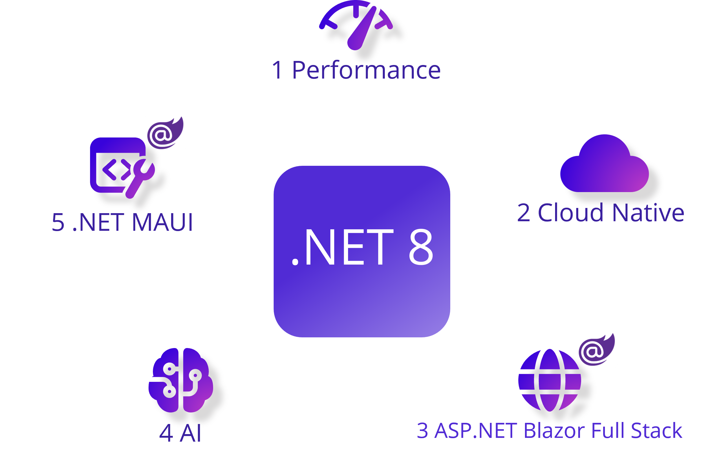
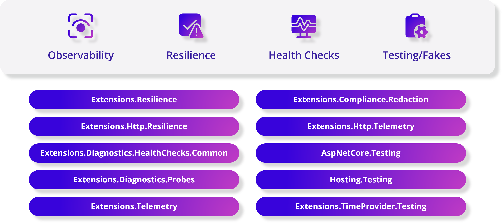
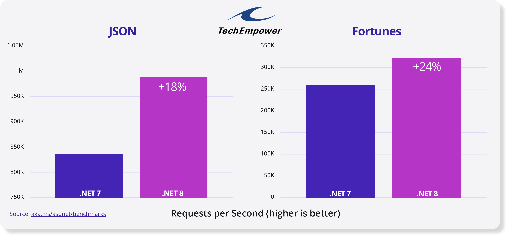
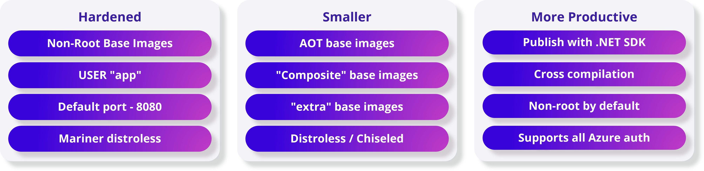
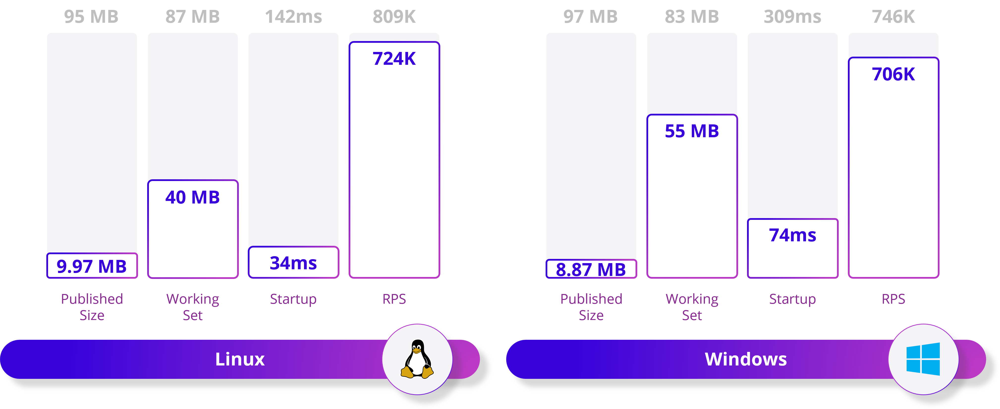
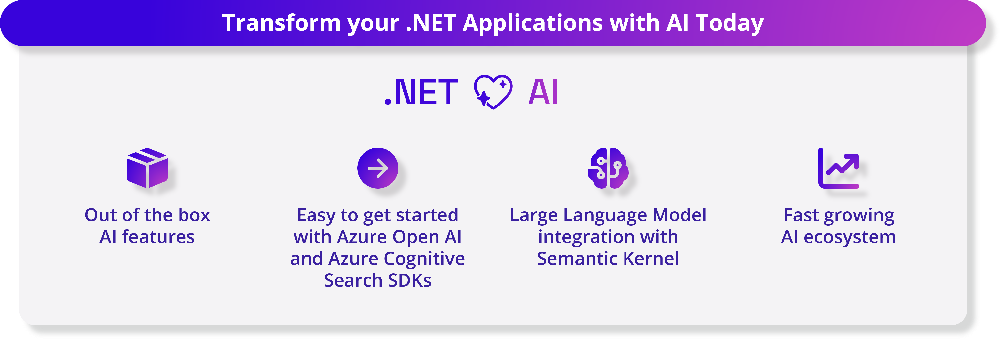
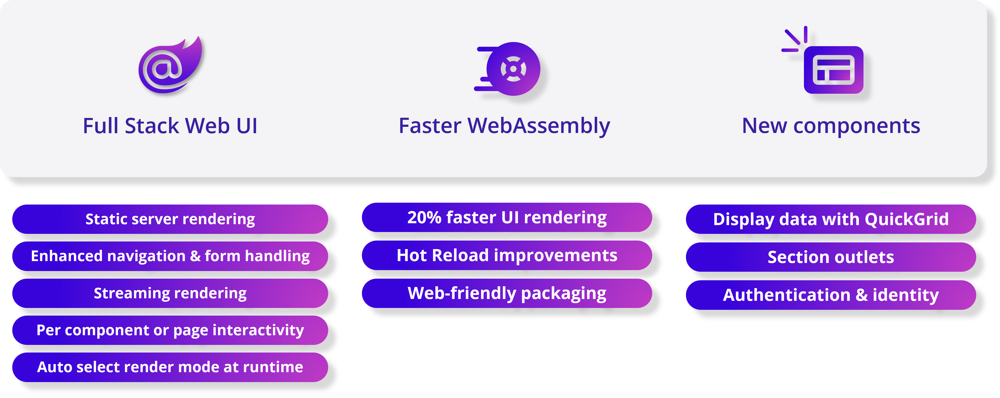
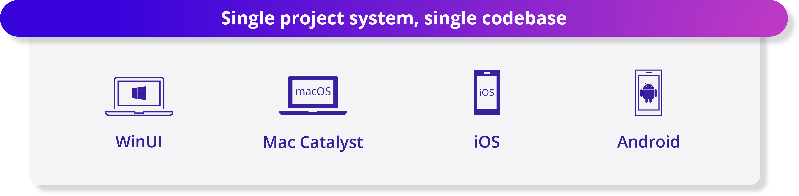

[](https://dotnet.microsoft.com/download/dotnet/8.0)

[Download .NET 8 today!](https://aka.ms/get-dotnet-8)

We are happy to announce the availability of [.NET 8](https://aka.ms/get-dotnet-8), the latest [LTS](https://dotnet.microsoft.com/platform/support/policy) version of one of the world’s leading development platforms, starting today. .NET 8 delivers thousands of performance, stability, and security improvements, as well as platform and tooling enhancements that help increase developer productivity and speed of innovation. The .NET team, our partners, and the .NET community will be talking about what’s new in .NET 8 as well as what people are building with .NET today to meet their needs of tomorrow at  [.NET Conf 2023, a three day virtual event (November 14-16)](https://www.dotnetconf.net/). Come, join us!

With this release, .NET reshapes the way we build intelligent, cloud-native, applications and high-traffic services that scale on demand. Whether you’re deploying to Linux or Windows, using containers or a cloud app model of your choice, .NET 8 makes building these apps easier. It includes a set of proven libraries that are used today by the many high-scale services at Microsoft to help you with fundamental challenges around observability, resiliency, scalability, manageability, and more.

[](https://aka.ms/aspireannouncement)

Integrate large language models (LLMs) like OpenAI’s GPT directly into your .NET app. Use a single powerful component model to handle all your web UI needs with Blazor. Deploy your mobile applications to the latest version of iOS and Android with .NET MAUI. Discover new language enhancements that make your code more concise and expressive with C# 12.  

Let’s look at what’s new in .NET 8. 

## [Unparalleled Performance - Experience the fastest .NET to date](https://devblogs.microsoft.com/dotnet/performance-improvements-in-net-8/)

.NET 8 comes with thousands of performance [improvements](https://devblogs.microsoft.com/dotnet/performance-improvements-in-net-8/) [across](https://devblogs.microsoft.com/dotnet/performance-improvements-in-aspnet-core-8/) [the](https://devblogs.microsoft.com/dotnet/dotnet-8-performance-improvements-in-dotnet-maui/) [stack](https://devblogs.microsoft.com/dotnet/this-arm64-performance-in-dotnet-8/). A new code generator called Dynamic Profile-Guided Optimization (PGO) that optimizes your code based on real-world usage is enabled by default and can improve the performance of your apps up to 20%. The AVX-512 instruction set is supported and used in .NET 8. It enables you to perform parallel operations on 512-bit vectors of data, meaning you can process much more data in less time. The primitive types (numerical and beyond) now implement a new formattable and parsable interface, which enable them to directly format and parse as UTF-8 without any transcoding overhead.

[](https://devblogs.microsoft.com/dotnet/performance-improvements-in-net-8/)

## [.NET Aspire - An opinionated stack to build observable, production-ready cloud native applications](https://aka.ms/aspireannouncement)

.NET Aspire is a stack for building resilient, observable, and configurable cloud-native applications with .NET. It includes a curated set of components enhanced for cloud-native by including telemetry, resilience, configuration, and health checks by default. Combined with a sophisticated but simple local developer experience, Aspire makes it easy to discover, acquire, and configure essential dependencies for cloud native applications on day 1 as well as day 100. The first preview of .NET Aspire is available today.

[](https://aka.ms/aspireannouncement)

## [.NET 8 Container Enhancements - More secure, compact, and productive](https://devblogs.microsoft.com/dotnet/securing-containers-with-rootless/) 

Package your applications with containers more easily and more securely than ever with .NET. Every .NET image includes a non-root user, enabling more secure containers with one-line configuration. The .NET SDK tooling publishes container images without a Dockerfile and are non-root by default. Deploy your containerized apps faster due to smaller .NET base images – including new experimental variants of our images that deliver truly minimal application sizes for native AOT. Opt-in to even more security hardening with the new Chiseled Ubuntu image variants to reduce your attack surface even further. Using Dockerfiles or SDK tooling, build apps and container images for any architecture.

[](https://devblogs.microsoft.com/dotnet/securing-containers-with-rootless/)

## [Native AoT - Journey towards higher density sustainable compute](https://learn.microsoft.com/dotnet/core/deploying/native-aot)

Compile your .NET apps into native code that uses less memory and starts instantly. No need to wait for the JIT (just-in-time) compiler to compile the code at runtime. No need to deploy the JIT compiler and IL code. AOT apps deploy just the code that’s needed for your app. Your app is now empowered to run in restricted environments where a JIT compiler is not allowed.

### AOT — Optimizations
[](https://learn.microsoft.com/dotnet/core/deploying/native-aot)

## [Artificial Intelligence - Infuse AI into your .NET applications](https://aka.ms/dotnet-genai)

Generative AI and large language models are transforming the field of AI, providing developers the ability to create unique AI-powered experiences in their applications. .NET 8 makes it simple for you to leverage AI via first class out of the box AI features in the .NET SDK and seamless integration with several tools. 

.NET 8 brings several enhancements to the `System.Numerics` library to improve its compatibility with Generative AI workloads, such as integrating Tensor Primitives. With the rise of AI-enabled apps, new tools and SDKs emerged. We collaborated with numerous internal and external partners such as Azure OpenAI, Azure Cognitive Search, [Milvus](https://milvus.io/docs/v2.2.x/install-csharp.md), [Qdrant](https://github.com/qdrant/qdrant-dotnet), and Microsoft Teams, to ensure .NET developers have easy access to various AI models, services, and platforms through their respective SDKs.  Additionally, the open-source [Semantic Kernel](https://learn.microsoft.com/semantic-kernel/overview/) SDK simplifies the integration of these AI components into new and existing applications, to help you deliver innovative user experiences.

Various samples and reference templates, showcasing patterns and practices, are now available to make it easy for developers to get started - [Customer Chatbot](https://github.com/dotnet-architecture/eShop), [Retrieval Augmented Generation](https://github.com/Azure-Samples/azure-search-openai-demo-csharp), [Developing Apps using Azure AI services](https://devblogs.microsoft.com/dotnet/demystifying-retrieval-augmented-generation-with-dotnet/) 

[](https://github.com/Azure-Samples/azure-search-openai-demo-csharp/assets/2546640/b79090b8-6a8b-45f4-b42b-e21e22b1661a)

## [Blazor - Build full stack web applications with .NET](https://dotnet.microsoft.com/apps/aspnet/web-apps/blazor)

Blazor in .NET 8 can use both the server and client together to handle all your web UI needs. It’s full stack web UI! With several new enhancements focused towards optimizing page load time, scalability, and elevating the user experience, developers can now use Blazor Server and Blazor WebAssembly in the same app, automatically shifting users from the server to the client at runtime. Your .NET code runs significantly faster on WebAssembly thanks to the new “Jiterpreter” based runtime and new built in components. As a part enhancing the overall [authentication, authorization, and identity management in .NET 8](https://devblogs.microsoft.com/dotnet/whats-new-with-identity-in-dotnet-8/), Blazor now supports generating a full Blazor-based Identity UI.



## [.NET MAUI - Elevated performance, reliability, and developer experience](https://devblogs.microsoft.com/dotnet/announcing-dotnet-maui-in-dotnet-8)

.NET MAUI provides you a single project system and single codebase to build WinUI, Mac Catalyst, iOS, and Android applications. Native AOT (experimental) now supports targeting iOS-like platforms. [A new Visual Studio Code extension for .NET MAUI](https://aka.ms/maui-devkit-blog) gives you the tools you need to develop cross-platform .NET mobile and desktop apps. Xcode 15 and Android API 34 are now supported allowing you to target the latest version of iOS and Android. A plethora of quality improvements were made to the [areas of performance](https://devblogs.microsoft.com/dotnet/dotnet-8-performance-improvements-in-dotnet-maui), controls and UI elements, and platform-specific behavior, such as desktop interaction adding better click handling, keyboard listeners, and more.

[](https://devblogs.microsoft.com/dotnet/announcing-dotnet-maui-in-dotnet-8)

## [C# 12 Features - Simplified syntax for better developer productivity](https://devblogs.microsoft.com/dotnet/announcing-csharp-12)

[C# 12 makes your coding experience more productive and enjoyable.](https://devblogs.microsoft.com/dotnet/announcing-csharp-12) You can now create primary constructors in any class and struct with a simple and elegant syntax. No more boilerplate code to initialize your fields and properties. Be delighted when creating arrays, spans, and other collection types with a concise and expressive syntax. Use new default values for parameters in lambda expressions. No more overloading or null checks to handle optional arguments. You can even use the `using` alias directive to alias any type, not just named types!

**Collection expressions**

```csharp
// Create an array:
int[] a = [1, 2, 3, 4, 5, 6, 7, 8];

// Create a span
Span<int> b  = ['a', 'b', 'c', 'd', 'e', 'f', 'h', 'i'];

// Create a jagged 2D array:
int[][] twoD = [[1, 2, 3], [4, 5, 6], [7, 8, 9]];

// create a jagged 2D array from variables:
int[] row0 = [1, 2, 3];
int[] row1 = [4, 5, 6];
int[] row2 = [7, 8, 9];
int[][] twoDFromVariables = [row0, row1, row2];
```

See more about the latest version of C# in [Announcing C# 12](https://learn.microsoft.com/dotnet/csharp/whats-new/csharp-12).

## [NET 8 support across Visual Studio family of tools](https://aka.ms/VS/v178GA)

We have a set of great tools that help you be the most productive in your development workflow and take advantage of .NET 8 today. Released alongside .NET 8, the [Visual Studio 2022 17.8 release](https://aka.ms/vs/v178GA) brings support for .NET 8, C# 12 language enhancements, and various new productivity features. [VS Code and C# Dev Kit](https://marketplace.visualstudio.com/items?itemName=ms-dotnettools.csdevkit) is a great way to get started with .NET 8 if you are learning and/or want to quickly kick the tires of the runtime and is available on Linux, macOS, or in a GitHub Codespace. The new [GitHub Codespaces template for .NET](https://github.com/codespaces), which comes is the SDK and a set of configured extensions, is one of the fastest ways to get started with .NET 8. 

### Additional features in .NET 8:

- **ASP.NET Core.** [Streamlines identity for single-page applications (SPA) and Blazor providing cookie-based authentication, pre-built APIs, token support, and a new identity UI.](https://devblogs.microsoft.com/dotnet/whats-new-with-identity-in-dotnet-8/) and [enhances minimal APIs with form-binding, antiforgery support to protect against cross-site request forgery (XSRF/CSRF), and `asParameters` support for parameter-binding with Open API definitions](https://learn.microsoft.com/aspnet/core/release-notes/aspnetcore-8.0#minimal-apis)
- **ASP.NET Core tooling.** [Route syntax highlighting, auto-completion, and analyzers to help you create Web APIs.](https://devblogs.microsoft.com/dotnet/aspnet-core-route-tooling-dotnet-8/)
- **Entity Framework Core.** [Provides new "complex types" as value objects, primitive collections, and SQL Server support for hierarchical data.](https://devblogs.microsoft.com/dotnet/announcing-ef8-rc2/)
- **NuGet.** [Helps you audit your NuGet packages in projects and solutions for any known security vulnerabilities.](https://learn.microsoft.com/nuget/concepts/auditing-packages)
- **.NET Runtime.** [Brings a new AOT compilation mode for WebAssembly (WASM) and Android.](https://devblogs.microsoft.com/dotnet/announcing-dotnet-8-rc1/#androidstripilafteraot-mode-on-android)
- **.NET SDK.** [Revitalizes terminal build output and production-ready defaults.](https://learn.microsoft.com/dotnet/core/whats-new/dotnet-8#net-sdk)
- **WPF.** [Supports OpenFolderDialog](https://devblogs.microsoft.com/dotnet/wpf-file-dialog-improvements-in-dotnet-8/) and [Enabled HW Acceleration in RDP](https://devblogs.microsoft.com/dotnet/announcing-dotnet-8-rc1/#wpf-hardware-acceleration-in-rdp)
- **ARM64.** [Significant feature enhancements and improved code quality for ARM64 platforms through collaboration with ARM engineers.](https://devblogs.microsoft.com/dotnet/this-arm64-performance-in-dotnet-8/)
- **Debugging.** [Displays debug summaries and provides simplified debug proxies for commonly used .NET types.](https://devblogs.microsoft.com/dotnet/debugging-enhancements-in-dotnet-8/)
- **System.Text.Json.** [Helps populate read-only members, customizes unmapped member handling, and improves Native AOT support.](https://devblogs.microsoft.com/dotnet/system-text-json-in-dotnet-8/)
- **.NET Community Toolkit.** [Accelerates building .NET libraries and applications while ensuring they are trim and AOT compatible (including the MVVM source generators!)](https://devblogs.microsoft.com/dotnet/announcing-the-dotnet-community-toolkit-821/)
- **Azure** [Supports .NET 8 with Azure's PaaS services like App Service for Windows and Linux, Static Web Apps, Azure Functions, and Azure Container Apps.](https://azure.github.io/AppService/2023/09/22/net-8-preview-7-available-on-app-service.html)
- **What's new in .NET 8.** [Check out our documentation for everything else!](https://learn.microsoft.com/dotnet/core/whats-new/dotnet-8)

### Get started with .NET 8

For the best development experience with .NET 8, we recommend that you use the latest release of [Visual Studio](https://visualstudio.microsoft.com/downloads/) and [Visual Studio Code's C# Dev Kit](https://marketplace.visualstudio.com/items?itemName=ms-dotnettools.csdevkit). Once you're set up, here are some of the things you should do:

- **Try the new features and APIs.** [Download .NET 8](https://dotnet.microsoft.com/download/dotnet/8.0) and [report issues in our issue tracker](https://github.com/dotnet/core/issues/new/choose).
- **Test your current app for compatibility.** Learn whether your app is [affected by default behavior changes in .NET 8](https://learn.microsoft.com/dotnet/core/compatibility/8.0).
- **Test your app with opt-in changes.** .NET 8 has [opt-in behavior changes](https://learn.microsoft.com/dotnet/core/compatibility/8.0) that only affect your app when enabled. It is important to understand and assess these changes early as they may become default in the next release.
- **Update your app with the Upgrade Assistant.** [Upgrade your app with just a few clicks using the Upgrade Assistant](https://dotnet.microsoft.com/platform/upgrade-assistant).
- **Know you're supported.** .NET 8 is officially supported by Microsoft as a [long term support (LTS) release that will be supported for three years](https://dotnet.microsoft.com/platform/support/policy).
- **Bonus: eShop Sample for .NET 8.** Follow all the best coding and architecture practices with our [new eShop sample, now updated for .NET 8](https://github.com/dotnet/eshop)!

### Celebrate .NET 8

- **.NET Conf 2023**. [Join us November 14-16, 2023 to celebrate the .NET 8 release!](https://www.dotnetconf.net/)
- **What's next in .NET?**. [Get involved and learn the latest news on .NET 8 and the next version of .NET.](https://dotnet.microsoft.com/next)
- **Get C# Certified**. [Earn a badge of honor with a freeCodeCamp C# certification.](https://devblogs.microsoft.com/dotnet/announcing-foundational-csharp-certification/)
- **Learn .NET 8**. [Free tutorials, videos, courses, and more for beginner through advanced .NET developers. All updated for .NET 8!](https://aka.ms/learn-dotnet-8)
- **See Developer Stories**. [Take a look at success stories of developers migrating to modern .NET.](https://devblogs.microsoft.com/dotnet/category/developer-stories/)
- **Read about why .NET?**. [Read through our recent blog series about the convenience of .NET](https://devblogs.microsoft.com/dotnet/why-dotnet/)

### .NET ❤️ Our Community

We would just like to end by saying one big...


