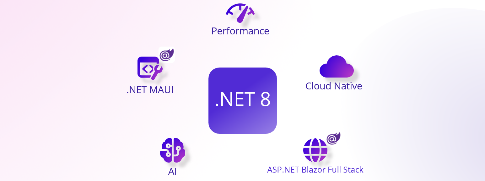
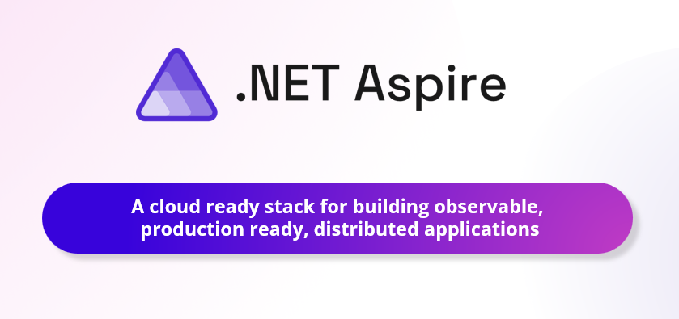
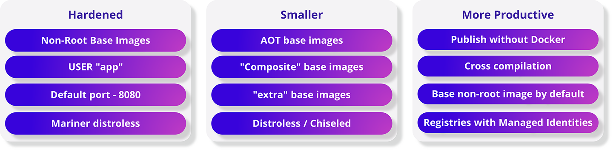
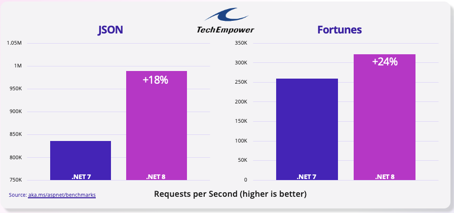
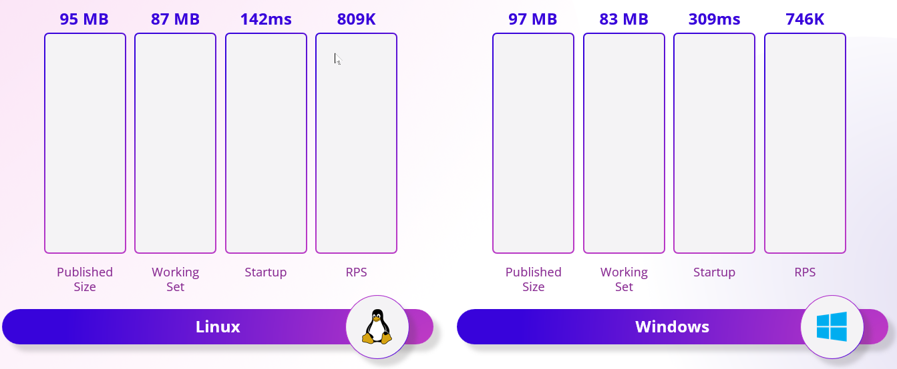
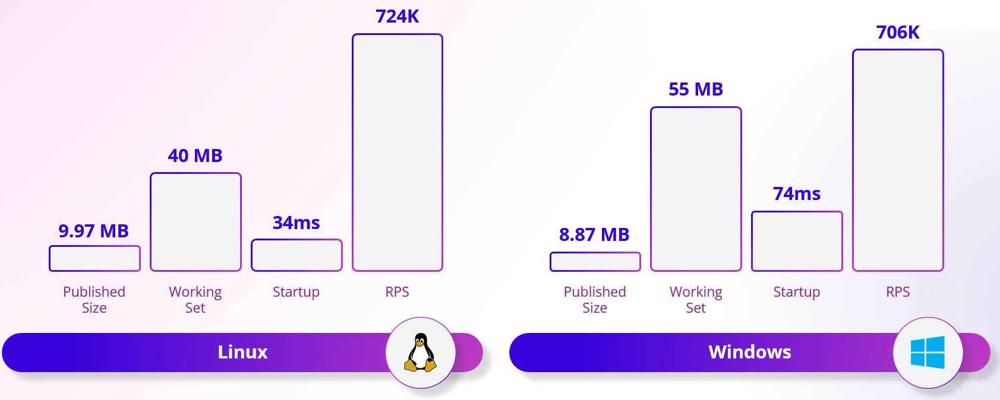
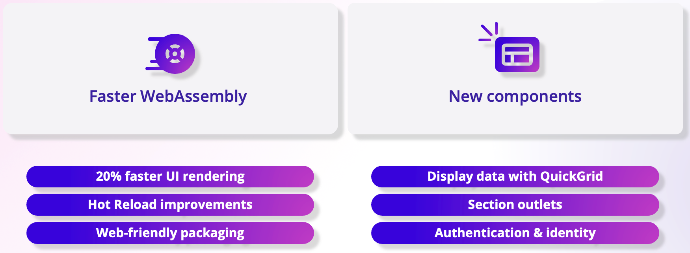
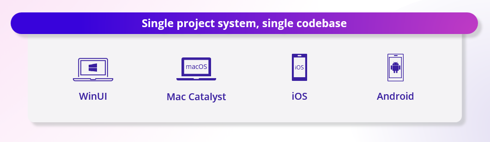
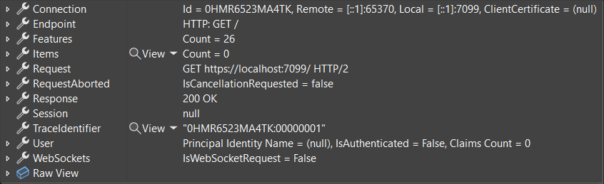

[](https://dotnet.microsoft.com/download/dotnet/8.0)

Today we are happy to announce the availability of .NET 8, the latest version of one of the world’s leading programming languages and development platforms. .NET 8 delivers thousands of performance, stability, and security improvements, including platform and tooling enhancements that will help developers increase productivity and drive innovation and growth across their organizations. .NET is showcasing the latest capabilities in .NET 8 at [dotnetConf, which takes place online today, November 14, through November 16](https://www.dotnetconf.net/).

.NET 8 reshapes the way we build intelligent cloud-native applications and high-traffic services that scale on demand. Whether you're deploying to Linux or Windows using containers or a cloud app model of your choice, .NET 8 makes building apps easier. It includes new cloud-native components and libraries that are used today by the many services at Microsoft you know and love to help you with fundamental challenges including observability, resiliency, scalability, manageability, and much more.

Integrate large language models like OpenAI's GPT directly into your .NET app. Use a single powerful component model to handle all your web UI needs with Blazor. Deploy your mobile applications to the latest version of iOS and Android with .NET MAUI. Discover new language enhancements that make your code more concise and expressive with C# 12. And you can even build your .NET applications with Visual Studio Code using C# Dev Kit.

Microsoft will offer [long term support for .NET 8 for at least three years](https://dotnet.microsoft.com/platform/support/policy).

Let’s look at what’s new.

## [.NET Aspire — An opinionated stack to build observable, production-ready cloud native applications](https://aka.ms/aspireannouncement)

.NET Aspire is a stack for building resilient, observable, and configurable cloud-native applications with .NET. It includes a curated set of components enhanced for cloud-native by including telemetry, resilience, configuration, and health checks by default. Combined with a sophisticated but simple local developer experience, Aspire makes it easy to discover, acquire, and configure essential dependencies for cloud native applications on day 1 as well as day 100.

[](https://aka.ms/aspireannouncement)

## [.NET 8 Container Enhancements — More secure, compact, and developer-friendly](https://devblogs.microsoft.com/dotnet/securing-containers-with-rootless/) 

Package your applications into containers more easily and more securely than ever with .NET. New non-root options in our base images seamlessly work together with the built-in SDK tooling, making your containers even more secure. Deploy your containerized apps faster due to smaller .NET base images - including new variants of our images that work with Trimming and Native AOT to deliver truly minimal application sizes. Opt in to even more security hardening with the new Chiseled Ubuntu image variants to reduce your attack surface even further. Use the enhanced SDK tooling to build multi-platform container images to pick the best architecture for your use case.

[](https://devblogs.microsoft.com/dotnet/securing-containers-with-rootless/)

## [Unparalleled Performance — Experience the fastest .NET to date](https://devblogs.microsoft.com/dotnet/performance-improvements-in-net-8/)

A new code generator called Dynamic Profile-Guided Optimization (PGO) that optimizes your code based on real-world usage is enabled by default and can improve the performance of your apps up to 20%. The AVX-512 instruction set is now supported. This support enables you to perform parallel operations on 512-bit vectors of data, meaning you can process much more data in less time. The primitive types (numerical and beyond) now implement a new formattable and parsable interface, which enable them to directly format and parse as UTF-8 without any transcoding overhead.

[](https://devblogs.microsoft.com/dotnet/performance-improvements-in-net-8/)

## [Native AoT — Journey towards higher density sustainable compute](https://learn.microsoft.com/dotnet/core/deploying/native-aot)

Compile your .NET apps into native code that runs faster, uses less memory, and starts instantly. No need to wait for the JIT (just-in-time) compiler to compile the code at runtime. No need to deploy the JIT compiler and IL code. AOT apps deploy just the code that's needed for your app. Your app is now empowered to run in restricted environments where a JIT compiler is not allowed.

### Before AOT
[](https://learn.microsoft.com/dotnet/core/deploying/native-aot)

### After AOT
[](https://learn.microsoft.com/dotnet/core/deploying/native-aot)

## [Artificial Intelligence — Build your next copilot with .NET](https://aka.ms/dotnet-genai)

OpenAI's large language models have transformed the field of AI and provided developers with the ability to create unique AI-powered experiences in their applications. In .NET 8, we made significant investments in several areas, such as `System.Numerics`, samples, and tools to facilitate our developers in utilizing these models and seamlessly integrating them into their applications.

In .NET 8, we have made several enhancements to the `System.Numerics` library to improve its compatibility with Generative AI workloads. One of our significant investments has been integrating Tensor Primitives in `System.Numerics`. These primitives enable hardware-accelerated numerical computations on multi-dimensional arrays like vectors, which is particularly helpful in enhancing search and retrieval applications that utilize Generative AI.

With the rise of AI-enabled apps, a new set of tools and SDKs has emerged. To keep up with this growing set of tools, the .NET team has collaborated with numerous internal and external partners to provide top-notch AI tools and SDKs to developers. By working with Azure OpenAI, Azure Cognitive Search, [Milvus](https://milvus.io/docs/v2.2.x/install-csharp.md), Qdrant, and Microsoft Teams, .NET developers now have easy access to various AI models, services, and platforms through their respective SDKs.  Additionally, the open-source Semantic Kernel SDK simplifies the integration of these AI components into new and existing applications, encouraging creative combinations for innovative user experiences.

Having access to samples and reference templates is crucial for a smooth developer experience during onboarding. We have provided a range of extensive code samples that showcase patterns and practices, which makes it easy for developers to comprehend and implement these applications. This empowers them to build their own intelligent solutions effortlessly.

- Customer Chatbot: [Intergrate AI into your existing applications with eShop](https://github.com/dotnet-architecture/eShop).
- Retrieval Augmented Generation: [Chat with your own enterprise data](https://github.com/Azure-Samples/azure-search-openai-demo-csharp).
- [Understanding RAG](https://devblogs.microsoft.com/dotnet/demystifying-retrieval-augmented-generation-with-dotnet/) 


## [Blazor — Build full stack web applications with .NET](https://dotnet.microsoft.com/apps/aspnet/web-apps/blazor)

Blazor in .NET 8 can use both the server and client together to handle all your web UI needs. It's full stack web UI! Blazor now has expanded support for server-side rendering with components, including static server rendering, enhanced navigation & form handling, and streaming rendering, so you can optimize page load time and elevate the user experience. You can then enable rich interactivity for components wherever needed by specifying an interactive render mode based on Blazor Server or Blazor WebAssembly. You can even use both in the same app and automatically shift users from the server to the client at runtime to improve app load time and scalability. Your .NET code runs significantly faster on WebAssembly thanks to the new "Jiterpreter" based runtime, and new built in components for displaying data, defining section outlets, and handling authentication help you stay productive.



## [.NET MAUI — Elevated performance, reliability, and developer experience](https://devblogs.microsoft.com/dotnet/announcing-dotnet-maui-in-dotnet-8)

.NET MAUI provides you a single project system and single codebase to build WinUI, Mac Catalyst, iOS, and Android applications. Native AOT (experimental) now supports targeting iOS-like platforms. [A new Visual Studio Code extension for .NET MAUI](https://aka.ms/maui-devkit-blog) gives you the tools you need to develop cross-platform .NET mobile and desktop apps. Xcode 15 and Android API 34 are now supported allowing you to target the latest version of iOS and Android. A plethora of quality improvements were made to the [areas of performance](https://devblogs.microsoft.com/dotnet/dotnet-8-performance-improvements-in-dotnet-maui), controls and UI elements, and platform-specific behavior, such as desktop interaction adding better click handling, keyboard listeners, and more.

[](https://devblogs.microsoft.com/dotnet/announcing-dotnet-maui-in-dotnet-8)

## [C# 12 Features — Simplified syntax for better developer productivity](https://devblogs.microsoft.com/dotnet/announcing-csharp-12)

[C# 12 makes your coding experience more productive and enjoyable.](https://devblogs.microsoft.com/dotnet/announcing-csharp-12) You can now create primary constructors in any class and struct with a simple and elegant syntax. No more boilerplate code to initialize your fields and properties. Be delighted when creating arrays, spans, and other collection types with a concise and expressive syntax. Use new default values for parameters in lambda expressions. No more overloading or null checks to handle optional arguments. You can even use the `using` alias directive to alias any type, not just named types!

**Collection expressions**

```csharp
// Create an array:
int[] a = [1, 2, 3, 4, 5, 6, 7, 8];

// Create a span
Span<int> b  = ['a', 'b', 'c', 'd', 'e', 'f', 'h', 'i'];

// Create a jagged 2D array:
int[][] twoD = [[1, 2, 3], [4, 5, 6], [7, 8, 9]];

// create a jagged 2D array from variables:
int[] row0 = [1, 2, 3];
int[] row1 = [4, 5, 6];
int[] row2 = [7, 8, 9];
int[][] twoDFromVariables = [row0, row1, row2];
```

See [What's new in C# 12](https://learn.microsoft.com/dotnet/csharp/whats-new/csharp-12) for more feature examples.

## [Best productivity in Visual Studio family of tools](https://aka.ms/VS/v178GA)

Alongside this great .NET 8 release, we have a set of great tools that help you be the most productive in your development workflow and take advantage of .NET 8 today. Released alongside .NET 8 is the [Visual Studio 2022 17.8 release for general availability](https://aka.ms/vs/v178GA). This is the best tool for .NET developers to take advantage of all the features in the runtime and C# 12 language enhancements. VS 17.8 ships with the enhanced capabilities that we've previously enabled via .NET 8 such as [improved ASP.NET route tooling like highlighting and completions](https://devblogs.microsoft.com/dotnet/aspnet-core-route-tooling-dotnet-8/):


and updated [enhancements to debugging views](https://devblogs.microsoft.com/dotnet/debugging-enhancements-in-dotnet-8/) when using .NET 8:



Visual Studio helps your inner loop also with the updated auth improvements in .NET 8 and combined with debugger delighters like JWT visualizer just make writing web apps a joy in Visual Studio 2022.

[Read the Visual Studio 2022 17.8 release blog](https://aka.ms/vs/v178GA) to learn more about all the other improvements to your development workflow and download the update today.

We also continue to make improvements to the [C# experience in VS Code](https://marketplace.visualstudio.com/items?itemName=ms-dotnettools.csdevkit), which is a great way to get started with .NET 8 if you are learning and/or want to quickly kick the tires of the runtime a bit. VS Code and C# Dev Kit give you a great set of experiences for writing .NET 8 apps on Linux, macOS, or in a GitHub Codespace. We recently released a new [GitHub Codespace template for .NET](https://github.com/codespaces) that is one of the fastest ways to get started with .NET 8 as the image comes with the SDK and a set of extensions configured to quickly get started. Along with this comes a new series of getting started learning C# and .NET content that you can follow here in the [new Getting Started video series](https://dotnet.microsoft.com/learn/videos) and will help you along the path to [become C# Certified as well with our partnership with freeCodeCamp](https://www.freecodecamp.org/learn/foundational-c-sharp-with-microsoft/)!

With .NET 8 you have a great set of tools with the latest SDK and Visual Studio family of products to make you the most productive in your development!

### Additional features in .NET 8:

- **ASP.NET Core.** [Streamlines identity for single-page applications (SPA) and Blazor providing cookie-based authentication, pre-built APIs, token support, and a new identity UI.](https://devblogs.microsoft.com/dotnet/whats-new-with-identity-in-dotnet-8/) and [enhances minimal APIs with form-binding, antiforgery support to protect against cross-site request forgery (XSRF/CSRF), and `asParameters` support for parameter-binding with Open API definitions](https://learn.microsoft.com/aspnet/core/release-notes/aspnetcore-8.0#minimal-apis)
- **ASP.NET Core tooling.** [Route syntax highlighting, auto-completion, and analyzers to help you create Web APIs.](https://devblogs.microsoft.com/dotnet/aspnet-core-route-tooling-dotnet-8/)
- **Entity Framework Core.** [Provides new "complex types" as value objects, primitive collections, and SQL Server support for hierarchical data.](https://devblogs.microsoft.com/dotnet/announcing-ef8-rc2/)
- **NuGet.** [Helps you audit your NuGet packages in projects and solutions for any known security vulnerabilities.](https://learn.microsoft.com/nuget/concepts/auditing-packages)
- **.NET Runtime.** [Brings a new AOT compilation mode for WebAssembly (WASM) and Android.](https://devblogs.microsoft.com/dotnet/announcing-dotnet-8-rc1/#androidstripilafteraot-mode-on-android)
- **.NET SDK.** [Revitalizes terminal build output and production-ready defaults.](https://learn.microsoft.com/dotnet/core/whats-new/dotnet-8#net-sdk)
- **WPF.** [Supports OpenFolderDialog](https://devblogs.microsoft.com/dotnet/wpf-file-dialog-improvements-in-dotnet-8/) and [Enabled HW Acceleration in RDP](https://devblogs.microsoft.com/dotnet/announcing-dotnet-8-rc1/#wpf-hardware-acceleration-in-rdp)
- **ARM64.** [Significant feature enhancements and improved code quality for ARM64 platforms through collaboration with ARM engineers.](https://devblogs.microsoft.com/dotnet/this-arm64-performance-in-dotnet-8/)
- **Debugging.** [Displays debug summaries and provides simplified debug proxies for commonly used .NET types.](https://devblogs.microsoft.com/dotnet/debugging-enhancements-in-dotnet-8/)
- **System.Text.Json.** [Helps populate read-only members, customizes unmapped member handling, and improves Native AOT support.](https://devblogs.microsoft.com/dotnet/system-text-json-in-dotnet-8/)
- **.NET Community Toolkit.** [Accelerates building .NET libraries and applications while ensuring they are trim and AOT compatible (including the MVVM source generators!)](https://devblogs.microsoft.com/dotnet/announcing-the-dotnet-community-toolkit-821/)
- **Azure** [Supports .NET 8 with Azure's PaaS services like App Service for Windows and Linux, Static Web Apps, Azure Functions, and Azure Container Apps.](https://azure.github.io/AppService/2023/09/22/net-8-preview-7-available-on-app-service.html)
- **What's new in .NET 8.** [Check out our documentation for everything else!](https://learn.microsoft.com/dotnet/core/whats-new/dotnet-8)

### Get started with .NET 8

For the best development experience with .NET 8, we recommend that you use the latest release of [Visual Studio](https://visualstudio.microsoft.com/downloads/) and [Visual Studio Code's C# Dev Kit](https://marketplace.visualstudio.com/items?itemName=ms-dotnettools.csdevkit). Once you're set up, here are some of the things you should do:

- **Try the new features and APIs.** [Download .NET 8](https://dotnet.microsoft.com/download/dotnet/8.0) and [report issues in our issue tracker](https://github.com/dotnet/core/issues/new/choose).
- **Test your current app for compatibility.** Learn whether your app is [affected by default behavior changes in .NET 8](https://learn.microsoft.com/dotnet/core/compatibility/8.0).
- **Test your app with opt-in changes.** .NET 8 has [opt-in behavior changes](https://learn.microsoft.com/dotnet/core/compatibility/8.0) that only affect your app when enabled. It is important to understand and assess these changes early as they may become default in the next release.
- **Update your app with the Upgrade Assistant.** [Upgrade your app with just a few clicks using the Upgrade Assistant](https://dotnet.microsoft.com/platform/upgrade-assistant).
- **Know you're supported.** .NET 8 is officially supported by Microsoft as a [long term support (LTS) release that will be supported for three years](https://dotnet.microsoft.com/platform/support/policy).
- **Bonus: eShop Sample for .NET 8.** Follow all the best coding and architecture practices with our [new eShop sample, now updated for .NET 8](https://github.com/dotnet/eshop)!

### Celebrate .NET 8

//YouTube Placeholder - https://www.youtube.com/watch?v=VRBF3xvY80w

- **.NET Conf 2023**. [Join us November 14-16, 2023 to celebrate the .NET 8 release!](https://www.dotnetconf.net/)
- **What's next in .NET?**. [Get involved and learn the latest news on .NET 8 and the next version of .NET.](https://dotnet.microsoft.com/next)
- **Get C# Certified**. [Earn a badge of honor with a freeCodeCamp C# certification.](https://devblogs.microsoft.com/dotnet/announcing-foundational-csharp-certification/)
- **Learn .NET 8**. [Free tutorials, videos, courses, and more for beginner through advanced .NET developers. All updated for .NET 8!](https://aka.ms/learn-dotnet-8)
- **See Developer Stories**. [Take a look at success stories of developers migrating to modern .NET.](https://devblogs.microsoft.com/dotnet/category/developer-stories/)
- **Read about why .NET?**. [Read through our recent blog series about the convenience of .NET](https://devblogs.microsoft.com/dotnet/why-dotnet/)

### .NET ❤️ Our Community

We would just like to end by saying one big...


