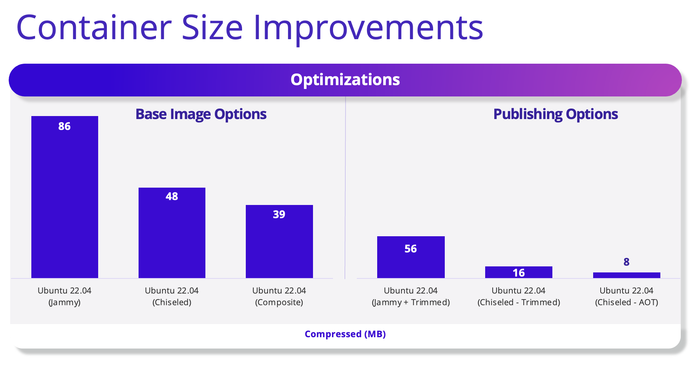

.NET chiseled Ubuntu container images are now GA and can be used in production, for .NET 6, 7, and 8. Chiseled images are the result of a long-term partnership and design collaboration between Canonical and Microsoft. We [announced chiseled containers](https://devblogs.microsoft.com/dotnet/dotnet-6-is-now-in-ubuntu-2204/) just over a year ago, as a new direction. They are now ready for you to use in your production environment and to take advantage of the value they offer.

We made a few videos on this topic over the last year, which provide a great overview:

- [.NET Containers advancements in .NET 8 | .NET Conf 2023](https://www.youtube.com/watch?v=scIAwLrruMY)
- [Using .NET with Chiseled Ubuntu Containers | .NET Conf 2022](https://www.youtube.com/watch?v=FLGFzlWF4Gs)
- [.NET in Ubuntu and Chiseled Containers](https://www.youtube.com/watch?v=pnsYc8GskCw)
- [How We Built Ubuntu Distroless Containers](https://www.youtube.com/watch?v=RMqjQ_i9eP0)

We also published a [container workshop](https://github.com/richlander/container-workshop) for .NET Conf that uses chiseled containers for many of its examples. The workshop also uses OCI publish, which pairs well with chiseled containers.

## Chiseled images

> General-purpose container images are not the future of cloud apps

The premise of chiseled containers is that container images are the best deployment vehicle for cloud apps, but that typical images contain far too many components. Instead, we need to slice away all but the essential components. Chiseled container images do that. That helps -- a lot -- with size and security.

The number one complaint category we hear about container images is around CVE management. It's hard to do well. We've built automation that rebuilds .NET images within hours of Alpine, Debian, and Ubuntu base image updates on Docker Hub. That means the images we ship are always fresh. However, most users don't have that automation, and end up with stale images in their registries that fail CVE scans, often asking why our images are stale (when they are not). We know because they send us their image scan reports. There has to be a better way.

It's really easy to demo the difference, using [anchore/syft](https://github.com/anchore/syft) (using Docker).

Those commands show us the number of "Linux components" in three images we publish, for Debian, Ubuntu, and Alpine, respectively.

```bash
$ docker run --rm anchore/syft mcr.microsoft.com/dotnet/runtime:8.0 | grep deb | wc -l
92
$ docker run --rm anchore/syft mcr.microsoft.com/dotnet/runtime:8.0-jammy | grep deb | wc -l
105
$ docker run --rm anchore/syft mcr.microsoft.com/dotnet/runtime:8.0-alpine | grep apk | wc -l
17
```

One can guess that it's pretty easy for a CVE to apply to one of these images, given the number of components. In fact, .NET doesn't use most of those components! Alpine shines here.

Here's the result for the same image, but chiseled.

```bash
$ docker run --rm anchore/syft mcr.microsoft.com/dotnet/runtime:8.0-jammy-chiseled | grep deb | wc -l
7
```

That gets us down to 7 components. In fact, the list is so short, we can just look at all of them.

```bash
$ docker run --rm anchore/syft mcr.microsoft.com/dotnet/runtime:8.0-jammy-chiseled | grep deb
base-files                                         12ubuntu4.4               deb     
ca-certificates                                    20230311ubuntu0.22.04.1   deb     
libc6                                              2.35-0ubuntu3.4           deb     
libgcc-s1                                          12.3.0-1ubuntu1~22.04     deb     
libssl3                                            3.0.2-0ubuntu1.12         deb     
libstdc++6                                         12.3.0-1ubuntu1~22.04     deb     
zlib1g                                             1:1.2.11.dfsg-2ubuntu9.2  deb
```

That's a very limited set of quite common dependencies. For example, .NET uses OpenSSL, for everything crypto, including TLS connections. Some customers need [FIPS compliance](https://ubuntu.com/security/fips) and are able to enable that since .NET relies on OpenSSL.

[Native AOT apps](https://learn.microsoft.com/dotnet/core/deploying/native-aot/) are similar, but need one less component. We care so much about limiting size and component count that we created an image just for it, removing `libstdc++6`. This image is new and still in preview.

```bash
$ docker run --rm anchore/syft mcr.microsoft.com/dotnet/nightly/runtime-deps:8.0-jammy-chiseled-aot | grep deb | wc -l
6
```

As expected, that image only contains 6 components.

Chiseled images are also much smaller. We can see that, this time with (uncompressed) `aspnet` images.

```bash
$ docker images --format "table {{.Repository}}\t{{.Tag}}\t{{.Size}}" | grep mcr.microsoft.com/dotnet/aspnet
mcr.microsoft.com/dotnet/aspnet               8.0-jammy-chiseled                      110MB
mcr.microsoft.com/dotnet/aspnet               8.0-alpine                              112MB
mcr.microsoft.com/dotnet/aspnet               8.0-jammy                               216MB
mcr.microsoft.com/dotnet/aspnet               8.0                                     217MB
```

In summary, Chiseled images:

- Slice a little over 100MB (uncompressed) relative to existing Ubuntu images.
- Match the size of Alpine, the existing fan favorite for size.
- Are the smallest images we publish with glibc compatibility
- Contain the fewest components, reducing CVE exposure.
- Are a great choice for matching dev and prod, given the popularity of Ubuntu for dev machines.
- Have the [strongest support offering](https://ubuntu.com/containers) of any image variant we publish.

## Distroless form factor

We've been publishing container images for nearly a decade. Throughout that time, we've heard regular requests to make images smaller, to remove components, and to improve security. Even as we've improved .NET container images, we've continued to hear those requests. The fundamental problem is that we cannot change the base images we pull from Docker Hub (beyond adding to them). We needed something revolutionary to change this dynamic.

Many users have pointed us to [Google Distroless](https://github.com/GoogleContainerTools/distroless) over the years.

> "Distroless" images contain only your application and its runtime dependencies. They do not contain package managers, shells or any other programs you would expect to find in a standard Linux distribution.

That's a great description, taken from the distroless repo. Google deconstructs various Linux distros, and builds them back as atoms, but only using the most necessary atoms to run apps. That's brilliant.

We have a strong philosophy of only taking artifacts from and aligning with the policies of upstream distros, specifically Alpine, Debian, and Ubuntu. That way, we have the same relationship with the upstream provider (like Ubuntu) as the user. If there is an issue (outside of .NET), we're looking for resolution from the same singular party. That's why we never adopted Google Distroless and have been waiting for something like Ubuntu chiseled, from the upstream provider.

Ubuntu chiseled is a great expression of the distroless form factor. It delivers on the same goals as the original Google project, but comes from the distro itself.

You might worry that this is all new and untested and that something is going to break. In fact, we've been delivering distroless images within Microsoft for a few years. At Microsoft, we use [Mariner Linux](https://github.com/microsoft/CBL-Mariner). A few years ago, we asked the Mariner team to create a distroless solution for our shared users. Microsoft teams have been hosting apps in production using .NET + Mariner distroless images since then. That has worked out quite well.

## Security posture

The two most critical components missing from these images are a shell and a package manager. Their absence really limits what an attacker can do. `curl` and `wget` are also missing from these images. One of the first things an attacker typically does is download a shell script (from a server they control) and then runs it. Yes, that really happens. That's effectively impossible with these images. The required components to enable that are just not there and not acquirable.

We also ship these [images as non-root](https://devblogs.microsoft.com/dotnet/securing-containers-with-rootless/).

```bash
$ docker inspect mcr.microsoft.com/dotnet/aspnet:8.0-jammy-chiseled | grep User
            "User": "",
            "User": "1654",
```

> All new files and directories are created with a UID and GID of 0 -- [Dockerfile reference](https://docs.docker.com/engine/reference/builder/#copy)

This change further constrains the type of operations that are allowed in these images. On one hand, a non-root user isn't able to run `apt install` commands, but since `apt` isn't even present, that doesn't matter. More practically, the non-root user isn't able to update app files. The app files will be copied into the container as `root`, making it impossible for the non-root user to alter them or to add files to the same directory. The non-root user only has `read` and `execute` permissions for the app.

You might wonder why it took us so long to support these images after announcing them over a year ago. That's a related and ironic story. Many image scanners rely on scanning the package manager database, but since the package manager was removed, the required database was removed too. Ooops! Instead, our friends at Canonical had to synthesize a package manager database file through other means, as opposed to bringing part of the package manager back just to enable scanning. In the end, we have an excellent solution that optimizes for security and for scanning, without needing to compromise either. All of the `anchore/syft` commands shown earlier in the post are evidence that the scanning solution works.

## App size

There are multiple ways to control the size of container images. The following slide from our [.NET Conf presentation](https://www.youtube.com/watch?v=scIAwLrruMY) demonstrates that with a [sample app](https://github.com/dotnet/dotnet-docker/tree/main/samples/releasesapi).



There are two primary axis:

- Base image, for framework-dependent apps.
- Publish option, for self-contained apps.

On the left, the chiseled variants of [aspnet](https://mcr.microsoft.com/product/dotnet/aspnet/tags) result in significant size wins. The smaller chiseled image -- "composite" -- derives its additional reductions by building parts of the .NET runtime libraries in a more optimized way. That will be covered in more detail in a follow-up post.

On the right, self-contained + trimming drops the image size a lot more, since all the unused .NET libraries are removed.

Native AOT drops the image size to below 10MB. That's a welcome and shocking surprise. Note that native AOT only works for console apps and services, not for web sites. That may change in a later release.

You might be wondering how to select between these choices. 

- Framework dependent deployment has the benefit of maximum layer sharing. That means sharing copies of .NET in your registry and within a single machine (if you host multiple .NET apps together). Build times are also shorter.
- Self-contained apps win on size and registry pull, but have more limited sharing (only [`runtime-deps`](https://mcr.microsoft.com/product/dotnet/runtime-deps/tags) is shared).

## Adoption

Chiseled images are the biggest change to our container image portfolio since we added support for Alpine, several years ago. We recommend that users take a deeper look at this change.

Note: The chiseled images we publish don't include ICU or tzdata, just like Alpine (except for ["extra" images](https://github.com/dotnet/dotnet-docker/discussions/4821)). Please comment on [dotnet-docker #5014](https://github.com/dotnet/dotnet-docker/issues/5014) if you need these libraries.

Users adopting .NET 8 are the most obvious candidates for chiseled containers. You will already be making changes, so why not make one more change? In many cases, you'll just be using a different image tag, with significant new benefits.

Ubuntu and Debian users can achieve very significant size savings over the general-purpose images you've had available until now. We recommend that you give chiseled images serious considerations.

Alpine users have always been very well served and that isn't changing. We've also included a non-root user in .NET 8 Alpine images. We'd recommend that Alpine users first switch to non-root hosting and then consider the additional benefits of chiseled images. We expect that many Alpine users will remain happy with Alpine and others will prefer Ubuntu Chiseled now that it also has a small variant. It's great to have options!

We've often been asked if we'd ever switch our convenient version tags -- like `8.0` -- to Alpine or (now) Chiseled. Such a change would break many apps, so we commit to publishing Debian images for those tags, effectively forever. It's straightforward for users to opt-in to one of our other image types. We believe equally in compatibility and choice, and we're offering both.

## Summary

We've been strong advocates of Ubuntu chiseled containers from the moment we saw the first demo. That demo has now graduated all the way to a GA release, with Canonical and Microsoft announcing availability together. This level of collaboration will continue as we support these new images and work together on what's next. We're looking forward to feedback, since there are likely interesting scenarios we haven't yet considered.

We've had the benefit of working closing with Canonical on this project and making these images available to .NET users first. However, we're so enthusiastic about this project, we want all developers to have the opportunity to use chiseled images. We encourage other developer ecosystems to stongly consider offering chiseled images, like Java, Python, and Node.js. 

We've had recent requests for information on chiseled images, after the .NET Conf presentations. Perhaps a year from now, chiseled images will have become a common choice for many developers. Over time, we've seen the increasing customer challenge of operationally managing containers, largely related to CVE burden. We believe that chiseled images are a great solution for helping teams reduce cost and deploy apps with greater confidence.
