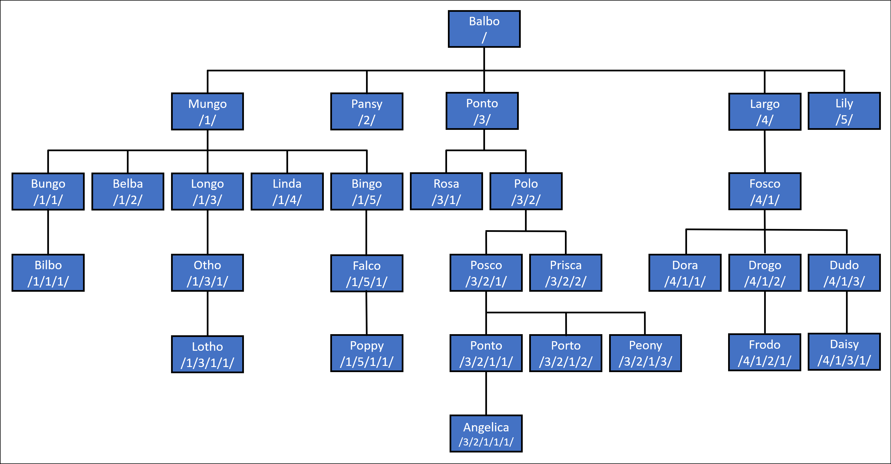

Entity Framework Core (EF Core) 8 is [available on NuGet today](https://www.nuget.org/packages/Microsoft.EntityFrameworkCore/8.0.0)!

## Basic information

EF Core 8, or just EF8, is the successor to EF Core 7. EF8 requires .NET 8. It will not work with .NET 6 or 7, or with any version of .NET Framework.

EF8 aligns with .NET 8 as a long-term support (LTS) release. See the [.NET support policy](https://dotnet.microsoft.com/platform/support/policy/dotnet-core) for more information.

The following sections give an overview of the major enhancements in EF8. In total, EF8 ships with [117 enhancements and new features, both large and small](https://github.com/dotnet/efcore/issues?q=is%3Aissue+milestone%3A8.0.0+is%3Aclosed+label%3Aclosed-fixed+label%3Atype-enhancement), as well as [128 bug fixes](https://github.com/dotnet/efcore/issues?q=is%3Aissue+milestone%3A8.0.0+is%3Aclosed+label%3Aclosed-fixed+label%3Atype-bug).

> **TIP**
> Full details of all new EF8 features can be found in the [_What's New in EF8_](https://learn.microsoft.com/ef/core/what-is-new/ef-core-8.0/whatsnew) documentation. All the code is available in [runnable samples on GitHub](https://github.com/dotnet/EntityFramework.Docs).

## Value objects using Complex Types

Prior to EF8, there was no good way to map objects that are structured to hold multiple values, but do not have a key defining identity. For example, `Address`, `Coordinate`. [Owned types](https://learn.microsoft.com/ef/core/modeling/owned-entities) can be used, but since owned types are actually entity types, they have semantics based on a key value, even when that key value is hidden.

EF8 now supports "Complex Types" to cover this type of "value object". Complex type objects:

- Are not identified or tracked by key value.
- Must be defined as part of an entity type.  (In other words, you cannot have a `DbSet` of a complex type.)
- Can be either .NET [value types](https://learn.microsoft.com/dotnet/csharp/language-reference/builtin-types/value-types) or [reference types](https://learn.microsoft.com/dotnet/csharp/language-reference/keywords/reference-types) (Owned types must reference types.)
- Instances can be shared by multiple properties. (Owned type instances cannot be shared.)

### Simple example

For example, consider an `Address` type:

```csharp
public class Address
{
    public required string Line1 { get; set; }
    public string? Line2 { get; set; }
    public required string City { get; set; }
    public required string Country { get; set; }
    public required string PostCode { get; set; }
}
```

`Address` is then used in three places in a simple customer/orders model:

```csharp
public class Customer
{
    public int Id { get; set; }
    public required string Name { get; set; }
    public required Address Address { get; set; }
    public List<Order> Orders { get; } = new();
}

public class Order
{
    public int Id { get; set; }
    public required string Contents { get; set; }
    public required Address ShippingAddress { get; set; }
    public required Address BillingAddress { get; set; }
    public Customer Customer { get; set; } = null!;
}
```

Let's create and save a customer with their address:

```csharp
var customer = new Customer
{
    Name = "Willow",
    Address = new() { Line1 = "Barking Gate", City = "Walpole St Peter", Country = "UK", PostCode = "PE14 7AV" }
};

context.Add(customer);
await context.SaveChangesAsync();
```

This results in the following row being inserted into the database:

```sql
INSERT INTO [Customers] ([Name], [Address_City], [Address_Country], [Address_Line1], [Address_Line2], [Address_PostCode])
OUTPUT INSERTED.[Id]
VALUES (@p0, @p1, @p2, @p3, @p4, @p5);
```

Notice that the complex types do not get their own tables. Instead, they are saved inline to columns of the `Customers` table. This matches the table sharing behavior of owned types.

> **NOTE**
> We don't plan to allow complex types to be mapped to their own table. However, in a future release, we do plan to allow the complex type to be saved as a JSON document in a single column. Vote for [Issue #31252](https://github.com/dotnet/efcore/issues/31252) if this is important to you.

Now let's say we want to ship an order to a customer and use the customer's address as both the default billing an shipping address. The natural way to do this is to copy the `Address` object from the `Customer` into the `Order`. For example:

```csharp
customer.Orders.Add(
    new Order { Contents = "Tesco Tasty Treats", BillingAddress = customer.Address, ShippingAddress = customer.Address, });

await context.SaveChangesAsync();
```

With complex types, this works as expected, and the address is inserted into the `Orders` table:

```sql
INSERT INTO [Orders] ([Contents], [CustomerId],
    [BillingAddress_City], [BillingAddress_Country], [BillingAddress_Line1], [BillingAddress_Line2], [BillingAddress_PostCode],
    [ShippingAddress_City], [ShippingAddress_Country], [ShippingAddress_Line1], [ShippingAddress_Line2], [ShippingAddress_PostCode])
OUTPUT INSERTED.[Id]
VALUES (@p0, @p1, @p2, @p3, @p4, @p5, @p6, @p7, @p8, @p9, @p10, @p11);
```

If we try the same thing with owned types, EF warns and then throws:

```text
warn: 8/20/2023 12:48:01.678 CoreEventId.DuplicateDependentEntityTypeInstanceWarning[10001] (Microsoft.EntityFrameworkCore.Update) 
      The same entity is being tracked as different entity types 'Order.BillingAddress#Address' and 'Customer.Address#Address' with defining navigations. If a property value changes, it will result in two store changes, which might not be the desired outcome.
fail: 8/20/2023 12:48:01.709 CoreEventId.SaveChangesFailed[10000] (Microsoft.EntityFrameworkCore.Update) 
      An exception occurred in the database while saving changes for context type 'NewInEfCore8.ComplexTypesSample+CustomerContext'.
      System.InvalidOperationException: Cannot save instance of 'Order.ShippingAddress#Address' because it is an owned entity without any reference to its owner. Owned entities can only be saved as part of an aggregate also including the owner entity.
         at Microsoft.EntityFrameworkCore.ChangeTracking.Internal.InternalEntityEntry.PrepareToSave()
```

This is because a single instance of the `Address` entity type (with the same hidden key value) is being used for three _different_ entity instances. On the other hand, sharing the same instance between complex properties is allowed, and so the code works as expected when using complex types.

### Immutable records as complex types

The .NET type used for a complex type in the EF model can be:

- .NET [value types](https://learn.microsoft.com/dotnet/csharp/language-reference/builtin-types/value-types) or [reference types](https://learn.microsoft.com/dotnet/csharp/language-reference/keywords/reference-types)
- Mutable or Immutable
- A C# [record type](https://learn.microsoft.com/dotnet/csharp/language-reference/builtin-types/record) 

The [_What's new in EF8_](https://aka.ms/ef8-new) documentation covers all of these possibilities, but [immutable record value types](https://learn.microsoft.com/dotnet/csharp/language-reference/builtin-types/struct#record-struct) are usually the best fit for representing complex types.  

For example, let's use the following immutable struct record to represent the address: 

```csharp
public readonly record struct Address(string Line1, string? Line2, string City, string Country, string PostCode);
```

We can now use the `with` syntax to update the `customer.Address` property with a new object that has one or more properties changes. For example: 

The code for changing the address now looks the same as when using immutable class record:

```csharp
customer.Address = customer.Address with { Line1 = "Peacock Lodge" };

await context.SaveChangesAsync();
```

### Current limitations

Complex types represent a significant investment across the EF stack. We were not able to make everything work in this release, but we plan to close some of the gaps in a future release. Make sure to vote (👍) on the appropriate GitHub issues if fixing any of these limitations is important to you.

Complex type limitations in EF8 include:

- Support collections of complex types. ([Issue #31237](https://github.com/dotnet/efcore/issues/31237))
- Allow complex type properties to be null. ([Issue #31376](https://github.com/dotnet/efcore/issues/31376))
- Map complex type properties to JSON columns. ([Issue #31252](https://github.com/dotnet/efcore/issues/31252))
- Constructor injection for complex types. ([Issue #31621](https://github.com/dotnet/efcore/issues/31621))
- Add seed data support for complex types. ([Issue #31254](https://github.com/dotnet/efcore/issues/31254))
- Map complex type properties for the Cosmos provider. ([Issue #31253](https://github.com/dotnet/efcore/issues/31253))
- Implement complex types for the in-memory database. ([Issue #31464](https://github.com/dotnet/efcore/issues/31464))

### More information on complex types

For more information on complex types, see:

- [What's new in EF8: Complex types](https://learn.microsoft.com/ef/core/what-is-new/ef-core-8.0/whatsnew#value-objects-using-complex-types) in the EF documentation.
- [.NET Data Community Standup recording](https://www.youtube.com/live/H-soJYqWSds?si=lbq9OsdsPn6BnwXf) on YouTube.
- [Complex types as value objects](https://devblogs.microsoft.com/dotnet/announcing-ef8-rc1/) on the .NET blog.

## Primitive collections

A persistent question when using relational databases is what to do with collections of primitive types; that is, lists or arrays of integers, date/times, strings, and so on. If you're using PostgreSQL, then its easy to store these things using PostgreSQL's [built-in array type](https://www.postgresql.org/docs/current/arrays.html). For other databases, a common approach is to serialize the primitive collection into a type that is handled by the database--for example, serialize to and from a string with comma delimiters.

EF8 now includes built-in support for this kind of mapping, using JSON as the serialization format. JSON works well for this since modern relational databases include built-in mechanisms for querying and manipulating JSON, such that the JSON column can, effectively, be treated as a table when needed, without the overhead of actually creating that table.

### Primitive collection properties

EF Core can map ordered collections of primitive types to a JSON column in the database. The collection property must be typed as `IEnumerable<T>`, where `T` is a primitive type, and at runtime the collection object must implement `IList<T>`, indicating that it is ordered and supports random access. 

For example, all properties in the following entity type are mapped to JSON columns by convention:

```csharp
public class PrimitiveCollections
{
    public IList<DateOnly> Dates { get; set; }
    public uint[] UnsignedInts { get; set; }
    public List<bool> Booleans { get; set; }
    public List<Uri> Urls { get; set; }
    public IEnumerable<int> Ints { get; set; } // Must be an IList<int>() at runtime.
    public ICollection<string> Strings { get; set; } // Must be an IList<int>() at runtime.
}
```
Let's look at a query that makes use of a column containing a list of dates. For example, using this entity type to represent a British Public House:

```csharp
public class Pub
{
    public int Id { get; set; }
    public required string Name { get; set; }
    public required string[] Beers { get; set; }
    public List<DateOnly> DaysVisited { get; private set; } = new();
}
```

We can write a query to find pubs visited this year:

```csharp
var thisYear = DateTime.Now.Year;
var pubsVisitedThisYear = await context.Pubs
    .Where(e => e.DaysVisited.Any(v => v.Year == thisYear))
    .Select(e => e.Name)
    .ToListAsync();
```

This translates to the following on SQL Server:

```sql
SELECT [p].[Name]
FROM [Pubs] AS [p]
WHERE EXISTS (
    SELECT 1
    FROM OPENJSON([p].[DaysVisited]) AS [d]
    WHERE DATEPART(year, CAST([d].[value] AS date)) = @__thisYear_0)
```

EF is using the [SQL Server OPENJSON function](https://learn.microsoft.com/sql/t-sql/functions/OPENJSON-transact-sql?view=sql-server-ver16) to parse the JSON saved into the `DaysVisited` column and treat it like a table. Notice that the query makes use of the date-specific function `DATEPART` here because EF _knows that the primitive collection contains dates_. It might not seem like it, but this is actually really important. Because EF knows what's in the collection, it can generate appropriate SQL to use the typed values with parameters, functions, other columns etc.

### Primitive collections in JSON documents

Primitive collections embedded in [an owned entity type to a column containing a JSON document](https://learn.microsoft.com/ef/core/what-is-new/ef-core-7.0/whatsnew#json-columns), which was introduced in EF7, can be persisted and queried in the same way.

For example, the following query extracts data from the JSON document, including use of sub-queries into the primitive collections contained in the document:

```csharp
var walksWithADrink = await context.Walks.Select(
    w => new
    {
        WalkName = w.Name,
        PubName = w.ClosestPub.Name,
        WalkLocationTag = w.Visits.LocationTag,
        PubLocationTag = w.ClosestPub.Visits.LocationTag,
        Count = w.Visits.DaysVisited.Count(v => w.ClosestPub.Visits.DaysVisited.Contains(v)),
        TotalCount = w.Visits.DaysVisited.Count
    }).ToListAsync();
```

This translates to the following on SQL Server:

```sql
SELECT [w].[Name] AS [WalkName], [p].[Name] AS [PubName], JSON_VALUE([w].[Visits], '$.LocationTag') AS [WalkLocationTag], JSON_VALUE([p].[Visits], '$.LocationTag') AS [PubLocationTag], (
    SELECT COUNT(*)
    FROM OPENJSON(JSON_VALUE([w].[Visits], '$.DaysVisited')) AS [d]
    WHERE EXISTS (
        SELECT 1
        FROM OPENJSON(JSON_VALUE([p].[Visits], '$.DaysVisited')) AS [d0]
        WHERE CAST([d0].[value] AS date) = CAST([d].[value] AS date) OR ([d0].[value] IS NULL AND [d].[value] IS NULL))) AS [Count], (
    SELECT COUNT(*)
    FROM OPENJSON(JSON_VALUE([w].[Visits], '$.DaysVisited')) AS [d1]) AS [TotalCount]
FROM [Walks] AS [w]
INNER JOIN [Pubs] AS [p] ON [w].[ClosestPubId] = [p].[Id]
```

### Better Contains queries 

The use of JSON to represent primitive collections has opened several new query translations that make use of the JSON capabilities of relational databases to create what are effectively inline, temporary tables of values. This is very powerful. For example, consider the following entity type:

```csharp
public class DogWalk
{
    public int Id { get; set; }
    public required string Name { get; set; }
    public Terrain Terrain { get; set; }
    public List<DateOnly> DaysVisited { get; private set; } = new();
    public Pub? ClosestPub { get; set; }
}

public enum Terrain
{
    Forest,
    River,
    Hills,
    Village,
    Park,
    Beach,
}
```

Using this model, we can write simple `Contains` query to find all walks with one of several different terrains:

```csharp
var terrains = new[] { Terrain.River, Terrain.Beach, Terrain.Park };
var walksWithTerrain = await context.Walks
    .Where(e => terrains.Contains(e.Terrain))
    .Select(e => e.Name)
    .ToListAsync();
```

This is already translated by current versions of EF Core by inlining the values to look for. For example, when using SQL Server:

```sql
SELECT [w].[Name]
FROM [Walks] AS [w]
WHERE [w].[Terrain] IN (1, 5, 4)
```

However, this strategy does not work well with database query caching; see [Announcing EF8 Preview 4](https://devblogs.microsoft.com/dotnet/announcing-ef8-preview-4/) on the .NET Blog for a discussion of the issue.

For EF8, the default is now to pass the list of terrains as a single parameter containing a JSON collection. For example:

```none
@__terrains_0='[1,5,4]'
```

The query then uses `OPENJSON` on SQL Server:

```sql
SELECT [w].[Name]
FROM [Walks] AS [w]
WHERE EXISTS (
    SELECT 1
    FROM OPENJSON(@__terrains_0) AS [t]
    WHERE CAST([t].[value] AS int) = [w].[Terrain])
```

Or `json_each` on SQLite:

```sql
SELECT "w"."Name"
FROM "Walks" AS "w"
WHERE EXISTS (
    SELECT 1
    FROM json_each(@__terrains_0) AS "t"
    WHERE "t"."value" = "w"."Terrain")
```

### More information on primitive collections

For more information on complex types, see:

- [What's new in EF8: Primitive collections](https://learn.microsoft.com/ef/core/what-is-new/ef-core-8.0/whatsnew#primitive-collections) in the EF documentation.
- [.NET Data Community Standup recording](https://www.youtube.com/live/AUS2OZjsA2I?si=tpcPyw9FxmGn6kwq) on YouTube.
- [Primitive collections and improved Contains](https://devblogs.microsoft.com/dotnet/announcing-ef8-preview-4/) on the .NET blog.

## Enhancements to JSON column mapping

EF8 includes improvements to the [JSON column mapping support introduced in EF7](https://learn.microsoft.com/ef/core/what-is-new/ef-core-7.0/whatsnew#json-columns).

### Translate element access into JSON arrays

EF8 supports indexing in JSON arrays when executing queries. For example, the following query checks whether the first two updates were made before a given date.

```csharp
var cutoff = DateOnly.FromDateTime(DateTime.UtcNow - TimeSpan.FromDays(365));
var updatedPosts = await context.Posts
    .Where(
        p => p.Metadata!.Updates[0].UpdatedOn < cutoff
             && p.Metadata!.Updates[1].UpdatedOn < cutoff)
    .ToListAsync();
```

This translates into the following SQL when using SQL Server:

```sql
SELECT [p].[Id], [p].[Archived], [p].[AuthorId], [p].[BlogId], [p].[Content], [p].[Discriminator], [p].[PublishedOn], [p].[Title], [p].[PromoText], [p].[Metadata]
FROM [Posts] AS [p]
WHERE CAST(JSON_VALUE([p].[Metadata],'$.Updates[0].UpdatedOn') AS date) < @__cutoff_0
  AND CAST(JSON_VALUE([p].[Metadata],'$.Updates[1].UpdatedOn') AS date) < @__cutoff_0
```

### JSON Columns for SQLite and PostgreSQL

EF7 introduced support for mapping to JSON columns when using Azure SQL/SQL Server. EF8 extends this support to SQLite databases, and the [Npgsql.EntityFrameworkCore.PostgreSQL](https://www.nuget.org/packages/Npgsql.EntityFrameworkCore.PostgreSQL/) EF Core provider brings this same support to PostgreSQL databases. As for the SQL Server support, this includes:

- Mapping of aggregates built from .NET types to JSON documents stored in columns
- Queries into JSON columns, such as filtering and sorting by the elements of the documents
- Queries that project elements out of the JSON document into results
- Updating and saving changes to JSON documents

The existing [documentation from What's New in EF7](https://learn.microsoft.com/ef/core/what-is-new/ef-core-7.0/whatsnew#json-columns) provides detailed information on JSON mapping, queries, and updates. This documentation now also applies to SQLite and PostgreSQL.

## HierarchyId in .NET and EF Core

Azure SQL and SQL Server have a special data type called [`hierarchyid`](https://learn.microsoft.com/sql/t-sql/data-types/hierarchyid-data-type-method-reference?view=sql-server-ver16) that is used to store [hierarchical data](https://learn.microsoft.com/sql/relational-databases/hierarchical-data-sql-server?view=sql-server-ver16). In this case, "hierarchical data" essentially means data that forms a tree structure, where each item can have a parent and/or children. Examples of such data are:

- An organizational structure
- A file system
- A set of tasks in a project
- A taxonomy of language terms
- A graph of links between Web pages

The database is then able to run queries against this data using its hierarchical structure. For example, a query can find ancestors and dependents of given items, or find all items at a certain depth in the hierarchy.

### Modeling hierarchies

The `HierarchyId` type can be used for properties of an entity type. For example, assume we want to model the paternal family tree of some fictional [halflings](https://en.wikipedia.org/wiki/Halfling). In the entity type for `Halfling`, a `HierarchyId` property can be used to locate each halfling in the family tree.

```csharp
public class Halfling
{
    public Halfling(HierarchyId pathFromPatriarch, string name, int? yearOfBirth = null)
    {
        PathFromPatriarch = pathFromPatriarch;
        Name = name;
        YearOfBirth = yearOfBirth;
    }

    public int Id { get; private set; }
    public HierarchyId PathFromPatriarch { get; set; }
    public string Name { get; set; }
    public int? YearOfBirth { get; set; }
}
```

In this case, the family tree is rooted with the patriarch of the family. Each halfling can be traced from the patriarch down the tree using its `PathFromPatriarch` property. SQL Server uses a compact binary format for these paths, but it is common to parse to and from a human-readable string representation when when working with code. In this representation, the position at each level is separated by a `/` character. For example, consider the family tree in the diagram below:



### Querying hierarchies

The following query uses `GetAncestor` to find the direct ancestor of a halfling, given that halfling's name:

```csharp
async Task<Halfling?> FindDirectAncestor(string name)
    => await context.Halflings
        .SingleOrDefaultAsync(
            ancestor => ancestor.PathFromPatriarch == context.Halflings
                .Single(descendent => descendent.Name == name).PathFromPatriarch
                .GetAncestor(1));
```

This translates to the following SQL:

```sql
SELECT TOP(2) [h].[Id], [h].[Name], [h].[PathFromPatriarch], [h].[YearOfBirth]
FROM [Halflings] AS [h]
WHERE [h].[PathFromPatriarch] = (
    SELECT TOP(1) [h0].[PathFromPatriarch]
    FROM [Halflings] AS [h0]
    WHERE [h0].[Name] = @__name_0).GetAncestor(1)
```

Running this query for the halfling "Bilbo" returns "Bungo".

### Updating hierarchies

The normal [change tracking](https://learn.microsoft.com/ef/core/change-tracking/) and [SaveChanges](https://learn.microsoft.com/ef/core/saving/basic) mechanisms can be used to update `hierarchyid` columns.

For example, I'm sure we all remember the scandal of SR 1752 (a.k.a. "LongoGate") when DNA testing revealed that Longo was not in fact the son of Mungo, but actually the son of Ponto! One fallout from this scandal was that the family tree needed to be re-written. In particular, Longo and all his descendents needed to be re-parented from Mungo to Ponto. `GetReparentedValue` can be used to do this. For example, first "Longo" and all his descendents are queried:

```csharp
var longoAndDescendents = await context.Halflings.Where(
        descendent => descendent.PathFromPatriarch.IsDescendantOf(
            context.Halflings.Single(ancestor => ancestor.Name == "Longo").PathFromPatriarch))
    .ToListAsync();
```

Then `GetReparentedValue` is used to update the `HierarchyId` for Longo and each descendent, followed by a call to `SaveChangesAsync`:

```csharp
foreach (var descendent in longoAndDescendents)
{
    descendent.PathFromPatriarch
        = descendent.PathFromPatriarch.GetReparentedValue(
            mungo.PathFromPatriarch, ponto.PathFromPatriarch)!;
}

await context.SaveChangesAsync();
```

```sql
SET NOCOUNT ON;
UPDATE [Halflings] SET [PathFromPatriarch] = @p0
OUTPUT 1
WHERE [Id] = @p1;
UPDATE [Halflings] SET [PathFromPatriarch] = @p2
OUTPUT 1
WHERE [Id] = @p3;
UPDATE [Halflings] SET [PathFromPatriarch] = @p4
OUTPUT 1
WHERE [Id] = @p5;
```

Using these parameters:

```text
 @p1='9',
 @p0='0x7BC0' (Nullable = false) (Size = 2) (DbType = Object),
 @p3='16',
 @p2='0x7BD6' (Nullable = false) (Size = 2) (DbType = Object),
 @p5='23',
 @p4='0x7BD6B0' (Nullable = false) (Size = 3) (DbType = Object)
 ```

> **NOTE**
> The parameters values for `HierarchyId` properties are sent to the database in their compact, binary format.

Following the update, querying for the descendents of "Mungo" returns "Bungo", "Belba", "Linda", "Bingo", "Bilbo", "Falco", and "Poppy", while querying for the descendents of "Ponto" returns "Longo", "Rosa", "Polo", "Otho", "Posco", "Prisca", "Lotho", "Ponto", "Porto", "Peony", and "Angelica".

### More information hierarchies and EF Core 

For more information on mapping hierarchies with EF Core, see:

- [What's new in EF8: HierarchyId](https://learn.microsoft.com/ef/core/what-is-new/ef-core-8.0/whatsnew#hierarchyid-in-net-and-ef-core) in the EF documentation.
- [.NET Data Community Standup recording](https://www.youtube.com/live/pmnHGWYpCfg?si=NOrlBo1TVKmT7biO) on YouTube.
- [Lite and familiar](https://devblogs.microsoft.com/dotnet/announcing-ef8-preview-2/) on the .NET blog.

## Raw SQL queries for unmapped types

EF7 introduced [raw SQL queries returning scalar types](https://learn.microsoft.com/ef/core/querying/sql-queries#querying-scalar-(non-entity)-types). This is enhanced in EF8 to include raw SQL queries returning any mappable CLR type, without including that type in the EF model.

Queries using unmapped types are executed using [SqlQuery](https://learn.microsoft.com/dotnet/api/microsoft.entityframeworkcore.relationaldatabasefacadeextensions.sqlquery) or [SqlQueryRaw](https://learn.microsoft.com/dotnet/api/microsoft.entityframeworkcore.relationaldatabasefacadeextensions.sqlqueryraw) The former uses string interpolation to parameterize the query, which helps ensure that all non-constant values are parameterized. 

The types used for SQL queries must have a property for every value in the result set, but do not need to match any specific table in the database. For example, the following type represents only a subset of information for each post, and includes the blog name, which comes from the `Blogs` table:

```csharp
public class PostSummary
{
    public string BlogName { get; set; }
    public string PostTitle { get; set; }
    public DateOnly PublishedOn { get; set; }
}
```

Instances of this type can be returned using `SqlQuery`:

```csharp
var summaries =
    await context.Database.SqlQuery<PostSummary>(
            @$"SELECT b.Name AS BlogName, p.Title AS PostTitle, p.PublishedOn
            FROM Posts AS p
            INNER JOIN Blogs AS b ON p.BlogId = b.Id")
        .ToListAsync();
```

## More features in EF8

The _What's new in EF8_ documentation covers some additional interesting enhancements in EF8, including:

- [Lazy-loading for no-tracking queries](https://learn.microsoft.com/ef/core/what-is-new/ef-core-8.0/whatsnew#lazy-loading-for-no-tracking-queries)
- [Opt-out of lazy-loading for specific navigations](https://learn.microsoft.com/ef/core/what-is-new/ef-core-8.0/whatsnew#opt-out-of-lazy-loading-for-specific-navigations)
- [Lookup tracked entities by primary, alternate, or foreign key](https://learn.microsoft.com/ef/core/what-is-new/ef-core-8.0/whatsnew#lookup-tracked-entities-by-primary-alternate-or-foreign-key)
- [Discriminator columns have max length](https://learn.microsoft.com/ef/core/what-is-new/ef-core-8.0/whatsnew#discriminator-columns-have-max-length)
- [DateOnly/TimeOnly supported on SQL Server](https://learn.microsoft.com/ef/core/what-is-new/ef-core-8.0/whatsnew#dateonlytimeonly-supported-on-sql-server)
- [Enhancements to Math translations](https://learn.microsoft.com/ef/core/what-is-new/ef-core-8.0/whatsnew#enhancements-to-math-translations)
- [Checking for pending model changes](https://learn.microsoft.com/ef/core/what-is-new/ef-core-8.0/whatsnew#checking-for-pending-model-changes)
- [Enhancements to SQLite scaffolding](https://learn.microsoft.com/ef/core/what-is-new/ef-core-8.0/whatsnew#enhancements-to-sqlite-scaffolding)

## How to get EF8

EF8 is distributed exclusively as a set of NuGet packages. For example, to add the SQL Server provider to your project, you can use the following command using the dotnet tool:

```bash
dotnet add package Microsoft.EntityFrameworkCore.SqlServer
```

## Installing the EF8 Command Line Interface (CLI)

The `dotnet-ef` tool must be installed before executing EF8 Core migration or scaffolding commands.

To install the tool globally, use:

```bash
dotnet tool install --global dotnet-ef
```

If you already have the tool installed, you can upgrade it with the following command:

```bash
dotnet tool update --global dotnet-ef
```

## The .NET Data Community Standup

The .NET data access team is now live streaming every other Wednesday at 10am Pacific Time, 1pm Eastern Time, or 18:00 UTC. Join the stream learn and ask questions about many .NET Data related topics.

- [Watch our YouTube playlist](https://aka.ms/efstandups) of previous shows
- [Visit the .NET Community Standup](https://live.dot.net) page to preview upcoming shows
- [Submit your ideas](https://github.com/dotnet/efcore/issues/22700) for a guest, product, demo, or other content to cover

## Documentation and Feedback

The starting point for all EF Core documentation is [docs.microsoft.com/ef/](https://docs.microsoft.com/ef/). Please file issues found and any other feedback on the [dotnet/efcore GitHub repo](https://github.com/dotnet/efcore).

## Helpful Links

The following links are provided for easy reference and access.

- EF Core Community Standup Playlist: [aka.ms/efstandups](https://aka.ms/efstandups)
- Main documentation: [aka.ms/efdocs](https://aka.ms/efdocs)
- What's New in EF Core 8: [aka.ms/ef8-new](https://aka.ms/ef8-new)
- What's New in EF Core 7: [aka.ms/ef7-new](https://aka.ms/ef7-new)
- Issues and feature requests for EF Core: [github.com/dotnet/efcore/issues](https://github.com/dotnet/efcore/issues)
- Entity Framework Roadmap: [aka.ms/efroadmap](https://aka.ms/efroadmap)
