Native AOT is an exciting new way to publish your .NET applications. Over the years we heard feedback from .NET developers who wanted their apps to start faster, use less memory, and have smaller on disk size than traditional self-contained apps built with .NET. Starting with .NET 7, we added support for [publishing console applications to native AOT](https://devblogs.microsoft.com/dotnet/announcing-dotnet-7/#native-aot), and continuing in .NET 8, we brought this capability to [ASP.NET Core API applications](https://devblogs.microsoft.com/dotnet/announcing-asp-net-core-in-dotnet-8/#asp-net-core-support-for-native-aot).

But this journey isn't complete. The next step is to enable more of the incredible .NET ecosystem to be used in native AOT applications. Not all .NET code can be used in native AOT applications. There are limitations to what .NET APIs can be used. To get a complete list of these limitations, see the [Native AOT deployment](https://learn.microsoft.com/dotnet/core/deploying/native-aot) documentation, but here's a short list of the common ones:

* The code must be [trim compatible](https://learn.microsoft.com/dotnet/core/deploying/trimming/incompatibilities).
    * No dynamic loading of assemblies.
    * Reflection can be used, but walking Type graphs (like what reflection-based serializers do) is not supported.
* No generating code at run-time, for example `System.Reflection.Emit`.

It isn't always obvious what an API is going to do under the covers, so it is hard to tell which APIs are safe to use, and which ones can break in native AOT applications. To address this, .NET includes analysis tools that will alert you when an API may not work correctly once the application has been published for AOT. These tools are essential for making applications and libraries that work well with native AOT.

In this post, I'm going to discuss some tips and strategies for making .NET libraries compatible with native AOT. Many libraries don't use offending patterns and will just work. Other libraries have been updated to be compatible and are ready to be used in AOT applications. Using these as case studies, I'm going to highlight some common situations we've seen when updating a library for AOT.

## Warnings

The most important thing to know is that .NET has a set of static analysis tools that will emit warnings when it sees code that might be problematic in a trimmed or native AOT'd application. These warnings are your guidelines for telling you what is and isn't guaranteed to work. The main principle for trimming and AOT in .NET is:

> If an application has no warnings when being published for AOT, it will behave the same after AOT as it does without AOT.

This is a bold statement to make, but one we believe is the way to have an acceptable development experience. We've tried to take approaches in the past that mostly work, but you won't know until you publish your app and execute it. Too many times developers have been disappointed with those approaches. You need to execute every code path in your application after publishing, which many times isn't feasible. Discovering your app doesn't work after deploying it to production is an experience I don't wish on any developer.

Notice that the principle doesn't say anything about what happens when the application does have warnings during publish. It may work, it may not. There isn't a statically verifiable way to determine what will happen. This is important to remember when working with these warnings. The analysis tool sees some code that it can't **guarantee** will work the same after publishing. When this happens it emits a warning to tell you it can't be guaranteed.

By now, it’s pretty clear that these warnings matter. And we need to pay attention to them.

There are some cases where the static analysis tools can't guarantee some specific code will work, but after analyzing yourself you decide that it will work. For these situations warnings *can* be suppressed. However, this shouldn't be done without **substantial evidence**. Suppressing a warning on code that works 99% of the time breaks the main principle above. If an application uses your library in a way that hits this 1% case and it breaks after publishing, it degrades the promise that no warnings means the app works.

### Analyzing .NET libraries

I'm sure you're thinking "OK, you've convinced me. Warnings are important, but how do I get them?". There are two ways of getting the warnings for your library.

#### Roslyn Analyzers

These analyzers work just like any other Roslyn analyzer. Once enabled they produce warnings during build and you get squiggles in your favorite editor. These are great for alerting you quickly to problems, and some even come with code fixers.

When using a .NET 8+ SDK, you can set the following in your library's _.csproj_ (or in a _Directory.Build.props_ file for all projects in a repository):

```xml
<PropertyGroup>
  <IsAotCompatible Condition="$([MSBuild]::IsTargetFrameworkCompatible('$(TargetFramework)', 'net7.0'))">true</IsAotCompatible>
</PropertyGroup>
```

This one property will enable the three underlying Roslyn analyzers:

* EnableTrimAnalyzer
* EnableSingleFileAnalyzer
* EnableAotAnalyzer

You probably notice that `Condition` in the above MSBuild setting. This is necessary because the Roslyn analyzers work off of attributes on the APIs your library is calling. Before .NET 7, the System.* APIs weren't annotated with the necessary attributes. So when you are building for `netstandard2.0` or even `net6.0`, the Roslyn analyzers aren't able to give you the correct warnings. The tooling will warn you if you try to enable the Roslyn analyzers for a TargetFramework that doesn't have the necessary attributes. Note that if your library only targets `net7.0` and above, you can remove this `Condition`.

The drawback to these analyzers is that they don't get the whole program to analyze like the actual AOT compiler does. While they catch the majority of the warnings, they are limited to what warnings they can produce and aren't guaranteed to be the complete set. For example, if your library depends on another library that wasn't annotated for trimming, the Roslyn analyzers aren't able to look into the implementation of the other library. In order to guarantee you get all warnings, a second approach is necessary.

#### Publishing a test application for AOT

You can use .NET's AOT compiler to analyze your library and produce warnings. This approach is more work than using the Roslyn analyzers, and it doesn't offer you the immediate feedback in your IDE that the Roslyn analyzers do, but it does guarantee all the warnings are found. In my experience, enabling both gives you the best of both worlds.

Note that this approach can also be used if there happens to be a reason why you can't target `net7.0` or above in your library.

The step-by-step guide for taking this approach can be found in [Prepare .NET libraries for trimming](https://learn.microsoft.com/dotnet/core/deploying/trimming/prepare-libraries-for-trimming#show-all-warnings-with-test-app) docs. The only difference is that instead of setting `<PublishTrimmed>true</PublishTrimmed>` in the test project, you set `<PublishAot>true</PublishAot>`.

The high-level idea here is to AOT publish a dummy application that references your library. But then also tell the AOT compiler to keep the entire library (i.e. act like all the code is called by the application and can't be trimmed away). This results in the AOT compiler analyzing every method and type in your library, giving you the complete set of warnings.

To ensure your library stays warning free, it is best to hook this up to automatically run when you make changes to your library, for example fixing a bug or adding a new API. There are numerous ways this can be done, but an approach that seems to work well is:

* Add a `AotCompatibility.TestApp.csproj` to your repo following the above steps.
* Create a script that publishes the test app and ensures the expected number of warnings are emitted (ideally zero).
* Create a GitHub workflow which runs the script during PRs.

This approach has been taken in many of the libraries we have made AOT-compatible. Here is an example in the OpenTelemetry repo using this approach:

* [AotCompatibility.TestApp.csproj](https://github.com/open-telemetry/opentelemetry-dotnet/blob/f2c225519db42e97c978bbb87b765da3204de860/test/OpenTelemetry.AotCompatibility.TestApp/OpenTelemetry.AotCompatibility.TestApp.csproj#L6-L35)
* [Publish Script](https://github.com/open-telemetry/opentelemetry-dotnet/blob/f2c225519db42e97c978bbb87b765da3204de860/build/test-aot-compatibility.ps1#L4-L39)
* [GitHub workflow](https://github.com/open-telemetry/opentelemetry-dotnet/blob/f2c225519db42e97c978bbb87b765da3204de860/.github/workflows/ci-aot.yml#L32)

As you can see from that code, the OpenTelemetry team decided to add a step that executes the published application and ensures it returns an expected result code. The test application exercises a few library APIs when it runs and returns a failure exit code if the APIs didn't work correctly. This has the advantage of testing out the library's code in an actual AOT published app. The reason this was done in OpenTelemetry is because an AOT warning needed to be suppressed in the library. These tests are ensuring that it was valid to suppress the warning and the code doesn't get broken in the future. When suppressing warnings, having tests like this is critical because the static analysis tools can no longer do their job.

## Addressing Warnings

### Attributes

Now that we can see the warnings in our library, it is time to start fixing them. A common way of fixing warnings is to attribute your code to give more information to the tools. You can find the complete guidance for using these attributes in the [Prepare libraries from trimming](https://learn.microsoft.com/dotnet/core/deploying/trimming/prepare-libraries-for-trimming#resolve-trim-warnings) and [Intro to AOT warnings](https://learn.microsoft.com/dotnet/core/deploying/native-aot/fixing-warnings#react-to-aot-warnings) docs. At a high-level, the main ones to know are:

1. `[RequiresUnreferencedCode]`
    - This attribute tells the tooling that the current method/Type is not compatible with trimming. This makes the tooling not warn about calls inside this method, but instead moves the warnings to any code that calls this method.
2. `[RequiresDynamicCode]`
    - Similar to RequiresUnreferencedCode above, but instead of not being compatible with trimmed apps, this API isn't compatible with AOT'd applications. For example, if the method explicitly calls into `System.Reflection.Emit`.
3. `[DynamicallyAccessedMembers]`
    - This attribute can be applied to Type parameters to instruct the tooling about the kinds of reflection that is going to be performed on the Type. The tooling can use this information to ensure it preserves members so the reflection code doesn't fail after publishing.

The first two attributes are useful for marking APIs that aren't designed to work with trimming or AOT. Users of your library will get warnings in their code when they are calling into these incompatible APIs, instead of seeing warnings from inside your library. This informs the caller that the API won't work, and the caller will need to address the warning themselves - usually by finding a different API that is compatible.

Given some of your APIs may never be able to be compatible with trimming and AOT, it may be necessary to design new APIs that are compatible. This is exactly what System.Text.Json's `JsonSerializer` did when it was updated to support trimming and AOT. The existing reflection-based APIs are all marked as both `[RequiresUnreferencedCode]` and `[RequiresDynamicCode]`. Then new APIs were added that take a `JsonTypeInfo` parameter, which removes the need for `JsonSerializer` to do the reflection. These new APIs work in AOT'd applications and callers don't get any warnings from calling them.

The `[DynamicallyAccessedMembers]` attribute is a little more complicated to understand. It is easiest to explain with an example. Say we have a method like the following:
    
```csharp
public static object CreateNewObject(Type t)
{
    return Activator.CreateInstance(t);
}
```

This method is going to produce a warning:

```shell
warning IL2067: 'type' argument does not satisfy 'DynamicallyAccessedMemberTypes.PublicParameterlessConstructor' in call to 'System.Activator.CreateInstance(Type)'.
The parameter 't' of method 'CreateNewObject(Type)' does not have matching annotations. The source value must declare at least the same requirements as those declared on the target location it is assigned to.
```

This warning occurs because in order to create a new object, `Activator.CreateInstance` needs to invoke the parameterless constructor on the `Type t`. However, the tooling doesn't know statically which Types will be passed into `CreateNewObject`, so it is unable to guarantee it won't trim a constructor that is necessary for the app to work.

To address this warning, we can use the `[DynamicallyAccessedMembers]` attribute. We can see from both the above warning and if we look at [Activator.CreateInstance](https://github.com/dotnet/runtime/blob/479df4792daa147e9b51757b0fabc248df21264f/src/libraries/System.Private.CoreLib/src/System/Activator.cs#L40)'s code, that it has a `[DynamicallyAccessedMembers(DynamicallyAccessedMemberTypes.PublicParameterlessConstructor)]` attribute on the `Type` parameter. We just need to apply the same attribute on our `CreateNewObject` method, and the warning will go away.

```csharp
public static object CreateNewObject([DynamicallyAccessedMembers(DynamicallyAccessedMemberTypes.PublicParameterlessConstructor)] Type t)
{
    return Activator.CreateInstance(t);
}
```

Doing this can now introduce new warnings higher in your library that call into `CreateNewObject` passing in a `Type` parameter. Those call sites will need to be attributed as well, recursively all the way up until either:

1. A statically known type (ex. `typeof(Customer)`) is passed in.
2. The Type comes from a public API in your library that consumers pass in.

Once the tooling sees a static type is going to be used, it will know that it shouldn't trim the constructor from that type. This makes the reflection usage work even after the app is published.

This illustrates that it is important to start annotating at the lowest layers of your library (or the lowest library in your set of libraries). And also to ensure all your dependencies are already AOT compatible before making your library compatible. When adding these attributes at a lower layer, it will cause warnings to start to pop up at the higher layers. This can be frustrating if you thought you were already done with the higher layer.

### TargetFrameworks

Now that we have a handle on how we can use the new attributes to address the warnings in our library, you'll very likely to run into an issue. These attributes didn't exist until pretty recently (.NET 5 for most, and .NET 7 for `RequiresDynamicCode`). Chances are, since you are developing a library, you are going to be targeting frameworks that existed before these attributes were created. When you do, you'll see:

```shell
error CS0246: The type or namespace name 'DynamicallyAccessedMembersAttribute' could not be found (are you missing a using directive or an assembly reference?)
```

This is a common problem with these attributes. How can we target them if they don't exist in all the TFMs we need to build our library for?

I'm sure your first thought is "why doesn't the .NET team ship these attributes in a NuGet package that targets `netstandard2.0`? That way I can use the attributes on all TFMs my library supports?" The answer is because these attributes are specific to the trimming and AOT capabilities that are only supported on .NET 5+ (for trimming) and .NET 7+ (for AOT). It would be an inconsistent message to say these attributes are supported on `netstandard2.0` when they don't work on .NET Framework. This is the same situation and message as the nullable attributes that were introduced in .NET Core 3.0.

So what can we do? There are two approaches that work, and depending on your preference you can choose either one. I've seen teams be successful using each and there are minor drawbacks to each approach.

#### Approach 1: #if

The first approach is to ensure all your libraries target `net7.0`+ (preferably `net8.0` because it has the most up-to-date annotations on the System.* APIs). Then you can use `#if` directives around your attribute usages. When your library builds for earlier TFMs (like `netstandard2.0`) the attributes aren't referenced. And when it builds for the more recent .NET targets, they are. So using our example above, we can say:

```csharp
    public static object CreateNewObject(
#if NET5_0_OR_GREATER
        [DynamicallyAccessedMembers(DynamicallyAccessedMemberTypes.PublicParameterlessConstructor)]
#endif
        Type t)
    {
        return Activator.CreateInstance(t);
    }
```

This allows our library to build successfully for both `netstandard2.0` and `net8.0`. Just remember that the `netstandard2.0` build of your library won't contain the attributes. So if a consumer is using your library in an application targeting an earlier framework (for example `net7.0`) and wants to AOT their application, the attributes won't be there and they will get warnings from inside your library during publish.

Another consideration with this approach is when you share a source file between more than one project. If our `CreateNewObject` method was defined in a file that was compiled into two projects, one that has `<TargetFrameworks>netstandard2.0;net8.0</TargetFrameworks>` and another that has `<TargetFrameworks>netstandard2.0;netstandard2.1</TargetFrameworks>`, the second library won't get the attributes in any of its builds. This is very easy to miss, especially when only using the Roslyn analyzers to find warnings.

You can probably see another drawback of this approach. Depending on how often you need to apply these attributes, using `#if` makes your code less readable. You can also miss TFMs if you aren't careful or building for all the TFMs your customers might use. Given these drawbacks, another approach can be employed.

#### Approach 2: Define the attributes internally

The trim and AOT tools respect these attributes by name and namespace, but don't care which assembly the attribute is defined in. This means your library can define the attribute itself, and the tooling will respect it. This approach is a little more work initially, but once it is in-place there is no more maintenance. 

To take this approach, you can copy the [definition of these attributes](https://github.com/eerhardt/blog-resources/blob/0fd3235ebccb8ce11c39a73a1698310d45d12c2e/creating-aot-compatible-libraries/TrimmingAttributes.cs) into your repo in a shared folder, and then include them in every project that you need to make compatible with AOT. This will allow your library to build for any TargetFramework, and the attributes will always be applied. If the attribute doesn't exist in the current TargetFramework, the shared file will define it, and a copy of the attribute will be emitted into your library. Alternatively, you can use the [PolySharp](https://www.nuget.org/packages/PolySharp/) NuGet package, which generates the attribute definitions as needed at build-time.

When you use this approach, you can use a library that doesn’t have a target for `net7.0`+ in an AOT’d application. The library will still be annotated with the necessary attributes. And you can verify your library is compatible following the [Publishing a test application for AOT](#publishing-a-test-application-for-aot) section above. I would still recommend using the Roslyn analyzers, which means targeting `net8.0`, because of the convenience and developer productivity they provide.

## Case studies

Now that you are set up for finding and addressing warnings in your library, the fun can begin: actually making the necessary changes. Unfortunately, this is where it becomes hard to give guidance because the changes you need to make to your code depend on exactly what your code is doing. If your library doesn't use any incompatible APIs, you won't get any warnings and you can declare your library AOT compatible. If you do get warnings, modifications will be needed to ensure you library can be used in AOT'd applications.

There are a set of [Recommendations](https://learn.microsoft.com/dotnet/core/deploying/trimming/prepare-libraries-for-trimming#recommendations) in the official docs, which is a great place to start. These general guidelines give a brief, high-level summary of the kinds of changes that will need to be made.

We've compiled a list of changes that have been made to real-world libraries to make them AOT compatible. This isn't an exhaustive list of all possible solutions, but they are some of the common ones we've encountered. Hopefully they can help you get started. Feel free to reach out and ask for help on new situations that you are unable to solve.

### Microsoft.IdentityModel.JsonWebTokens

The Microsoft.IdentityModel.* set of libraries are used to parse and validation JSON Web Tokens (JWTs) in ASP.NET Core applications. Upon [initial investigation of the warnings](https://github.com/AzureAD/azure-activedirectory-identitymodel-extensions-for-dotnet/issues/2035), there were two categories of problems: one trivial and one extremely hard.

First, the easy one [AzureAD/azure-activedirectory-identitymodel-extensions-for-dotnet#2042](https://github.com/AzureAD/azure-activedirectory-identitymodel-extensions-for-dotnet/pull/2042) was the same situation previously discussed with `Activator.CreateInstance`. A type parameter, in this case a generic type parameter, was being flown into a method that called `Activator.CreateInstance`. The parameter needed to be annotated with `[DynamicallyAccessedMembers]` and flown up until the static type was passed in.

The second problem took a lot more changes and a lot more time to implement. The IdentityModel libraries were using `Newtonsoft.Json` (well, a private fork of `Newtonsoft.Json` - but that's a story for another day) in order to parse and create JSON payloads. `Newtonsoft.Json` was created long before trimming and AOT were considerations in .NET, and as such it wasn't designed to be compatible. With the introduction of `System.Text.Json` in recent years, which can be used in AOT'd applications, and the amount of work required, it [isn't likely](https://github.com/JamesNK/Newtonsoft.Json/issues/2732#issuecomment-1243059140) that `Newtonsoft.Json` will be compatible with native AOT.

This meant there was only one path forward to solving the rest of the warnings: [AzureAD/azure-activedirectory-identitymodel-extensions-for-dotnet#2042](https://github.com/AzureAD/azure-activedirectory-identitymodel-extensions-for-dotnet/pull/2042) migrated the libraries from `Newtonsoft.Json` to `System.Text.Json`. Along the way, performance improvements were made as well - for example using Utf8JsonReader/Writer instead of using object serialization. In the end, the library is now faster and is AOT compatible. Since this library is used in so many applications, these results were well worth the investment.

### StackExchange.Redis

The `StackExchange.Redis` library is a popular .NET library for interacting with [Redis](https://redis.io/) data stores. Upon [initial investigation of the warnings](https://github.com/StackExchange/StackExchange.Redis/issues/2449), there were a few warnings in the library itself, and a couple issues in one of its dependencies.

Let's start with the dependency, because it is best to address warnings at the lowest layer first. [mgravell/Pipelines.Sockets.Unofficial#73](https://github.com/mgravell/Pipelines.Sockets.Unofficial/pull/73) skips some optimizations that are using incompatible APIs.

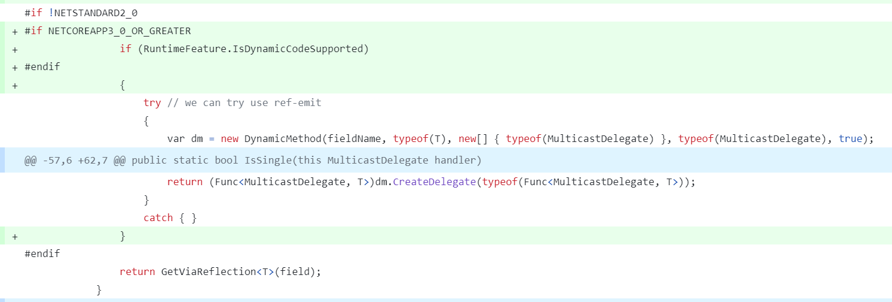

This code is using `System.Reflection.Emit` to generate IL to read the value of a field from an object. This is done for performance reasons because using normal reflection is slower than just reading a field. However, in a native AOT application this code will fail because there is no JIT compiler to compile the IL to machine code. To solve this, a check is added for `RuntimeFeature.IsDynamicCodeSupported`, which returns `true` when the current runtime allows for generating dynamic code and `false` when it doesn't. In the case of native AOT, this is always `false` and the `DynamicMethod` code is skipped. The fallback to normal reflection is always used.

Taking a step back and looking at what the code is trying to accomplish, we can see that it is using private reflection against `MulticastDelegate` - a core type defined in the `System` namespace. It is trying to access private fields in order to enumerate the list of invocations, but without allocating an array. Looking deeper, the fields this code is accessing don't even exist on the native AOT's version of `MulticastDelegate`. When the fields don't exist, a fallback is taken that ends up allocating an array. The proper long-term solution here is to introduce a new runtime API for [allocation-free enumeration of the invocations](https://github.com/dotnet/runtime/issues/41849).

Another incompatible optimization was the following:

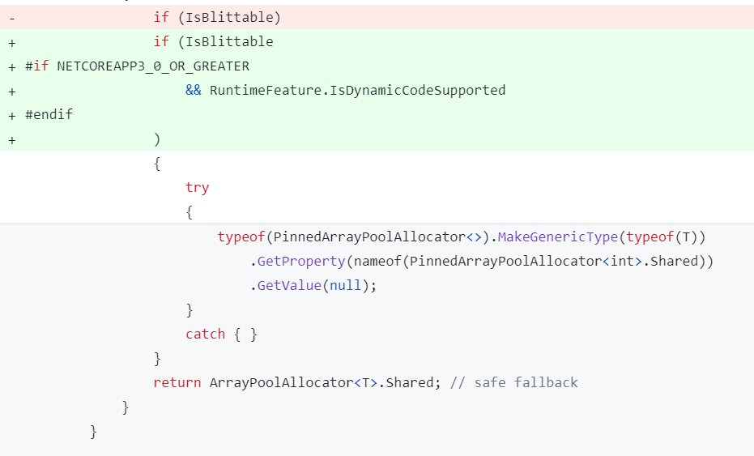

This code is using reflection to fill in a generic type at runtime, and then get a static property off of the resulting type. Calling `MakeGenericType` on a statically unknown type is not AOT compatible because of the way generics and value types (i.e. structs) work. The .NET runtime generates specialized code for each instantiation of a generic type with a value type. If the specialized code hasn't been generated ahead of time for the specific value type, like `int` or `float`, the .NET AOT runtime will fail because it can't generate it dynamically. The fix was the same as above, to skip this optimization when running in an AOT'd application, which removes the warning.

You may have spotted a problem with the existing code: that the result of the reflection call wasn't being returned. [mgravell/Pipelines.Sockets.Unofficial#74](https://github.com/mgravell/Pipelines.Sockets.Unofficial/pull/74) followed up to address issues found when investigating these AOT warnings. The reason reflection was used here was because `PinnedArrayPoolAllocator<T>` had a generic constraint that `T` needs to be an `unmanaged` type. This code needed to take an unconstrained `T` and bridge the constraint when `T : unmanaged`. Using reflection is currently [the only way to bridge a generic constraint](https://github.com/dotnet/csharplang/discussions/6308) like this. The follow up removed the need for the generic constraint and [mgravell/Pipelines.Sockets.Unofficial#78](https://github.com/mgravell/Pipelines.Sockets.Unofficial/pull/78) was able to remove the special casing for native AOT. This is a great outcome because now the same code is used in both AOT'd and non-AOT'd applications.

Back on the StackExchange.Redis library, [StackExchange/StackExchange.Redis#2451](https://github.com/StackExchange/StackExchange.Redis/pull/2451) addressed the main two issues with its code.

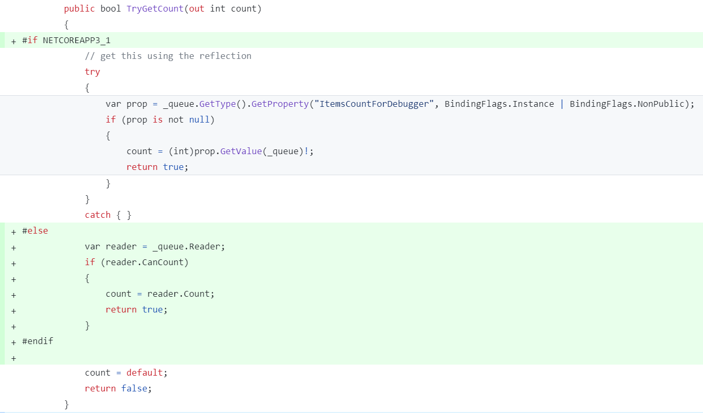

This code is using a `System.Threading.Channels.Channel<T>` and trying to get the count of items in the `Channel`. When the original code was written, `ChannelReader<T>` didn't contain a `Count` property. It was added in a later version. So this code opted to use private reflection to get the value. Since the `_queue.GetType()` is not a statically known type (it will be one of the derived types of `Channel<T>`) this reflection is not compatible with trimming. The fix here is to take advantage of the new `CanCount` and `Count` APIs when available - which they are in the versions of .NET that support trimming and AOT - and keep using reflection when they aren't.

Second, some warnings showed up in a method using reflection.

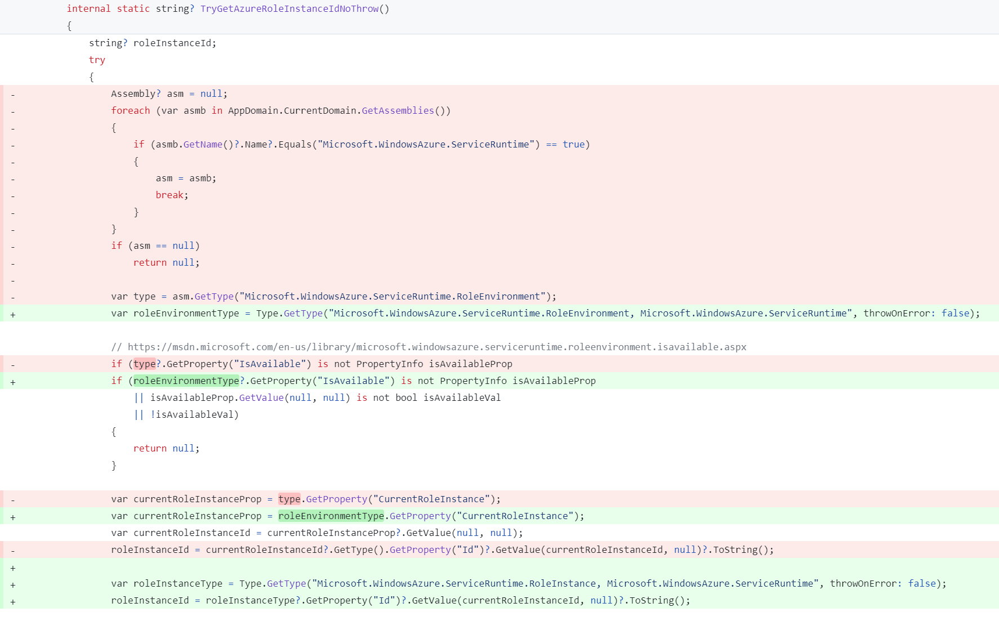

This change shows that some reflection usages can be statically verifiable, while others aren't. Previously, the code was looping through all the assemblies in the application, checking for an assembly with a specific name, and then finding a type by name and retrieving property values off of the type. This code raised a few trimming warnings because trimming, by design, will remove assemblies and types it doesn't see being used statically in the application. With a little bit of rewriting, specifically using `Type.GetType` with a constant, fully-qualified type name, the tooling is able to statically know which types are being acted upon. The tooling will preserve the necessary members on these types, if they are found. Thus the tooling no longer emits warnings, and the code is now compatible.

The last set of warnings in the `StackExchange.Redis` library haven't been addressed at the time of writing this post. The library has the capability for [evaluating a LuaScript](https://stackexchange.github.io/StackExchange.Redis/Scripting.html), which by itself isn't an issue. The problem is the way the parameters to the script are passed. Taking the example from the docs:

```csharp
const string Script = "redis.call('set', @key, @value)";

using (ConnectionMultiplexer conn = /* init code */)
{
	var db = conn.GetDatabase();

	var prepared = LuaScript.Prepare(Script);
	db.ScriptEvaluate(prepared, new { key = (RedisKey)"mykey", value = 123 });
}
```

You can see the `db.ScriptEvaluate` method takes the script to be evaluated and an `object` (in this case an anonymous type) where the properties of the object map to the parameters in the script. `StackExchange.Redis` uses reflection to get the values of the properties and passes the values to the server. This is a case where the API isn't designed to be compatible with trimming. The reason it is not safe is because the API takes an `object parameters` parameter, and then calls `parameters.GetType()` to get the properties of the object. The type is not statically known, because it could be any object of any type. The tooling doesn't know statically all the types that could be passed into this method.

The solution here is to mark the existing `db.ScriptEvaluate` method with `[RequiresUnreferencedCode]`, which will warn any callers that the method is not compatible. And then optionally add a new API which is designed to be compatible with trimming. One option for a compatible API could be:

```csharp
// existing
RedisResult ScriptEvaluate(LuaScript script, object? parameters = null, CommandFlags flags = CommandFlags.None);

// potential new method
RedisResult ScriptEvaluate<[DynamicallyAccessedMembers(DynamicallyAccessedMemberTypes.PublicProperties)] TParameters>(LuaScript script, TParameters? parameters = null, CommandFlags flags = CommandFlags.None);
```

Instead of calling `parameters.GetType()`, the new method will use `typeof(TParameters)` to get the properties of the object. This will allow the trimming tool to see exactly which types are passed into this method. And the tooling will preserve the necessary members to make the reflection work after trimming. In the case where the real type of `parameters` is derived from `TParameters`, the method will only use the properties defined on `TParameters`. The derived type's properties won't be seen. This makes the behavior consistent before and after trimming.

### OpenTelemetry

OpenTelemetry is an observability framework that allows developers to understand their system from the outside. It is popular in cloud applications and is part of the [Cloud Native Computing Foundation](https://www.cncf.io/). The .NET OpenTelemetry libraries had to fix a few places in order to be compatible with AOT. [open-telemetry/opentelemetry-dotnet#3429](https://github.com/open-telemetry/opentelemetry-dotnet/issues/3429) was the main GitHub issue tracking the necessary fixes.

The first fix which blocked this library from being used in a native AOT application was [open-telemetry/opentelemetry-dotnet#4542](https://github.com/open-telemetry/opentelemetry-dotnet/pull/4542). The problem was `MakeGenericType` being called with a value type that the tooling couldn't statically analyze.

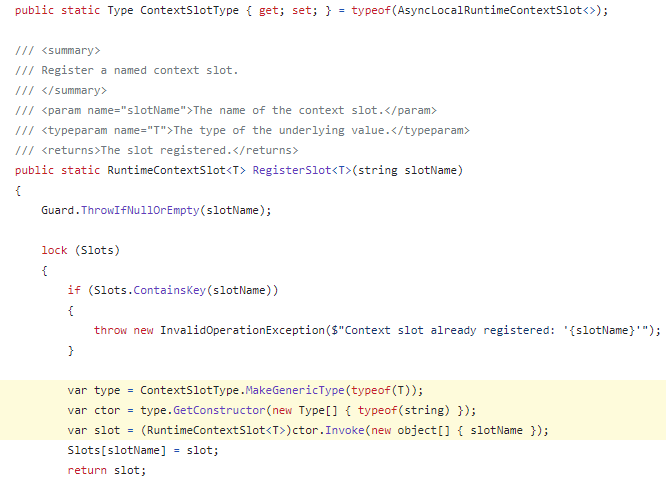

When `RegisterSlot<int>()` or `RegisterSlot<double>()` is called, this code is using reflection to dynamically fill in a generic type, and then invoking the constructor on the `ContextSlotType`. Since this API is public, any open generic type could be set on `ContextSlotType`. And then any value type could be filled into the `RegisterSlot<T>` method.

The fix was to make a small breaking change and only accept 2 or 3 specific types to be set on `ContextSlotType`, which in practice are the only types customers used.

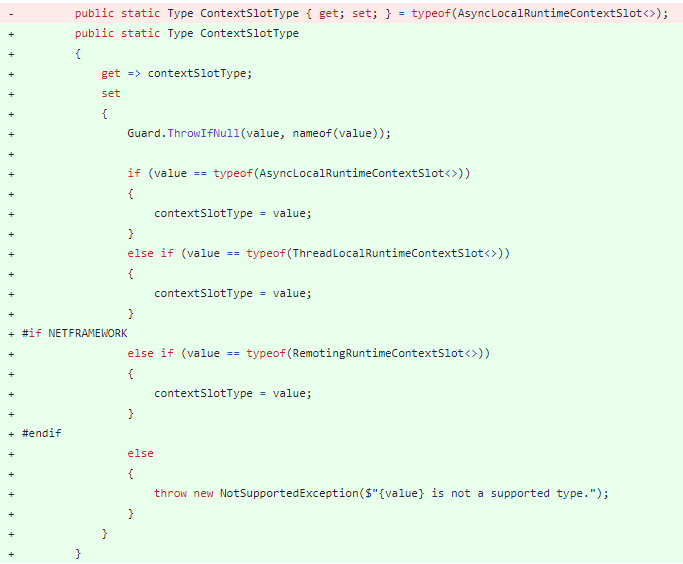

These types are hard-coded so they are not trimmed away. Now the AOT tooling can see all the code needed to make this work.

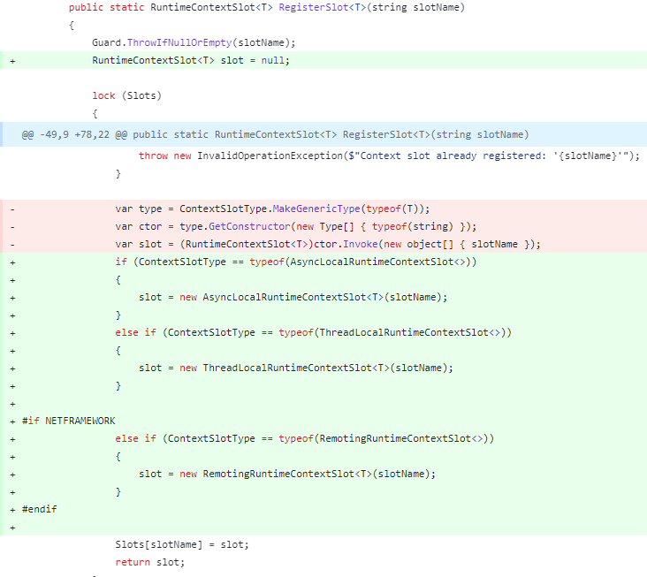

Another issue was how `System.Linq.Expressions` was being used in an `ActivityInstrumentationHelper` class. This was another case of using private reflection to workaround not having public API. [open-telemetry/opentelemetry-dotnet#4513](https://github.com/open-telemetry/opentelemetry-dotnet/pull/4513) changed the Expressions code to ensure the necessary properties were being preserved.

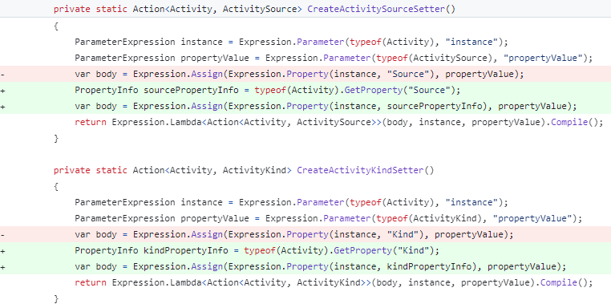

The trimming tools can't statically determine which property is being referenced with `Expression.Property(Expression, string propertyName)`, and the API is annotated to produce warnings when you call it. Instead, if you use the overload `Expression.Property(Expression, PropertyInfo)` and get the PropertyInfo in a way the tooling can understand, the code can be made trim compatible.

[open-telemetry/opentelemetry-dotnet#4695](https://github.com/open-telemetry/opentelemetry-dotnet/pull/4695) was then made to completely remove `System.Linq.Expressions` usage in the library.

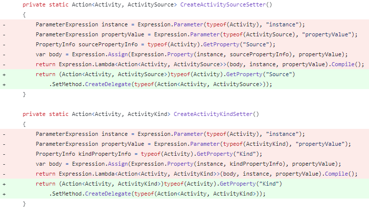
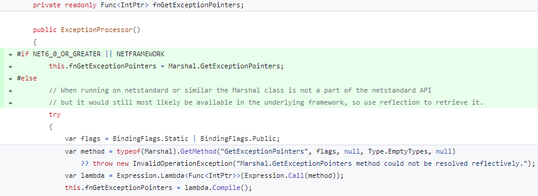

While Expressions can be used in native AOT applications, when you `Lambda.Compile()` an Expression, it uses an interpreter to evaluate the Expression. This is not ideal and can cause performance degradation. If possible, removing `Expression.Compile()` usage when in native AOT applications is recommended.

Next up is a common false-positive case for trimming warnings. When using `EventSource`, it is common to pass more than 3 primitive values, or values of different types, to the `WriteEvent` method. But when you don't match the primitive overloads, you fall into the overload that uses an `object[] args` for the parameters. Because these values get serialized using reflection, this API is annotated with `[RequiresUnreferencedCode]` and gives warnings wherever it is called. [open-telemetry/opentelemetry-dotnet#4428](https://github.com/open-telemetry/opentelemetry-dotnet/pull/4428) was opened to add these suppressions.

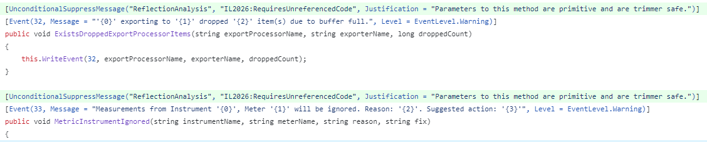

This false-positive occurred so often that a [new API in EventSource](https://github.com/dotnet/runtime/pull/83751) was made in .NET 8 to make this false-positive almost entirely go away.

Another simple fix was made in [open-telemetry/opentelemetry-dotnet#4688](https://github.com/open-telemetry/opentelemetry-dotnet/pull/4688) to flow `[DynamicallyAccessedMembers]` attributes through the library. For example:

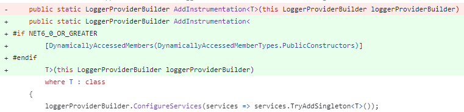

Next, several exporters in OpenTelemetry use JSON serialization to turn Arrays of objects into a string. As discussed previously, using `JsonSerializer.Serialize` without a `JsonTypeInfo` is not compatible with trimming or AOT. [open-telemetry/opentelemetry-dotnet#4679](https://github.com/open-telemetry/opentelemetry-dotnet/pull/4679) converted these places to use the `System.Text.Json` source generator in OpenTelemetry.

```csharp
internal static string JsonSerializeArrayTag(Array array)
{
    return JsonSerializer.Serialize(array, typeof(Array), ArrayTagJsonContext.Default);
}

[JsonSerializable(typeof(Array))]
[JsonSerializable(typeof(char))]
[JsonSerializable(typeof(string))]
[JsonSerializable(typeof(bool))]
[JsonSerializable(typeof(byte))]
[JsonSerializable(typeof(sbyte))]
[JsonSerializable(typeof(short))]
[JsonSerializable(typeof(ushort))]
[JsonSerializable(typeof(int))]
[JsonSerializable(typeof(uint))]
[JsonSerializable(typeof(long))]
[JsonSerializable(typeof(ulong))]
[JsonSerializable(typeof(float))]
[JsonSerializable(typeof(double))]
private sealed partial class ArrayTagJsonContext : JsonSerializerContext
{
}
```

This `JsonSerializeArrayTag` method can now be used safely in AOT'd applications. Note that it doesn't support serializing any object - just `Array` and the listed primitive types are supported. If an unsupported object is passed into this method, it will fail consistently both with and without AOT'ing the application.

One of the more complex changes was [open-telemetry/opentelemetry-dotnet#4675](https://github.com/open-telemetry/opentelemetry-dotnet/pull/4675), which made the `PropertyFetcher` class compatible with native AOT. As its name implies, `PropertyFetcher` was specifically designed to retrieve property values off of objects. It makes heavy use of reflection and `MakeGenericType`. Because of this, in the end it is still annotated with `[RequiresUnreferencedCode]`. The responsibility is on the caller to ensure the necessary properties are preserved manually. Luckily this API is internal, so the OpenTelemetry team controls all the callers.

The remaining issue with `PropertyFetcher` was to ensure the `MakeGenericType` call would always work in native AOT'd applications.


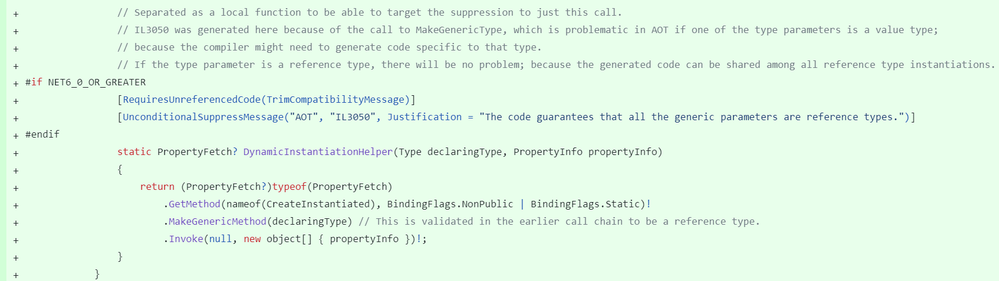

The mitigation here is taking advantage of the fact that if `MakeGenericType` is only called with reference types (i.e. classes and not structs), the .NET runtime will reuse the same machine code for all reference types.

Now that `PropertyFetcher` was changed to work with native AOT, the places that call it can now be addressed. One of the approaches OpenTelemetry takes is to listen to DiagnosticSources, register a callback for when an Event fires, and then inspect the "payload" of the Event in order to log the corresponding telemetry events. There are 3 instrumentation libraries that do this and use `PropertyFetcher`.

* HttpClient - [open-telemetry/opentelemetry-dotnet#4770](https://github.com/open-telemetry/opentelemetry-dotnet/pull/4770)
* ASP.NET Core - [open-telemetry/opentelemetry-dotnet#4795](https://github.com/open-telemetry/opentelemetry-dotnet/pull/4795)
* SQL Client - [open-telemetry/opentelemetry-dotnet#4751](https://github.com/open-telemetry/opentelemetry-dotnet/pull/4751)

The first 2 PRs were able to suppress the trim warnings because the underlying DiagnosticSource code ([HttpClient](https://github.com/dotnet/runtime/blob/f9246538e3d49b90b0e9128d7b1defef57cd6911/src/libraries/System.Net.Http/src/System/Net/Http/DiagnosticsHandler.cs#L325) and [ASP.NET Core](https://github.com/dotnet/aspnetcore/blob/690d78279e940d267669f825aa6627b0d731f64c/src/Hosting/Hosting/src/Internal/HostingApplicationDiagnostics.cs#L252)) ensures the important properties on the payload are always preserved in trimmed and AOT'd applications.

With SQL Client, this isn't the case. And because the underlying SqlClient library isn't AOT compatible, the decision was made to mark the `OpenTelemetry.Instrumentation.SqlClient` library as `[RequiresUnreferencedCode]`.

Finally, [open-telemetry/opentelemetry-dotnet#4859](https://github.com/open-telemetry/opentelemetry-dotnet/pull/4859) fixed the last warnings in the `OpenTelemetry.Exporter.OpenTelemetryProtocol` library.

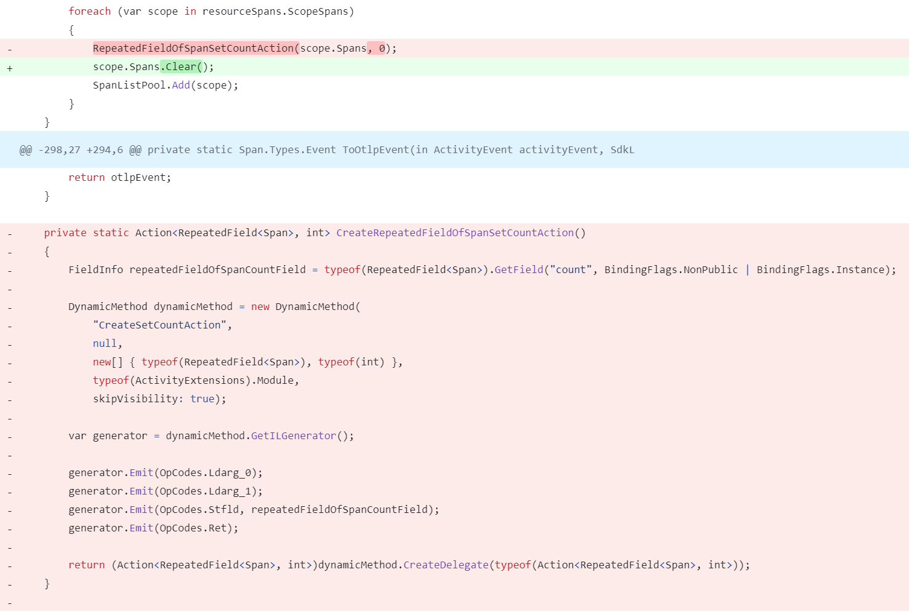

The issue here was the same as above in the `StackExchange.Redis` library. This code was using private reflection against an object in the `Google.Protobuf` library, and generating a `DynamicMethod` for faster performance. A newer version of `Google.Protobuf` added a `.Clear()` API which makes this private reflection no longer necessary. So the fix was simply to update to the new version, and use the new API.

### dotnet/extensions

The new `Microsoft.Extensions.*` libraries in https://github.com/dotnet/extensions fill in some missing scenarios needed in building real-world, high-scale, and high-available applications. There are libraries for adding resilience, deeper diagnostics, and compliance to your applications.

These libraries take advantage of other `Microsoft.Extensions.*` features, namely binding Option objects to an `IConfiguration` and validating the Option objects using `System.ComponentModel.DataAnnotations` attributes. Traditionally, both of these features used unbounded reflection to get and set properties on the Option objects, which isn't compatible with trimming. To allow these features to be used in trimmed applications, .NET 8 added two new Roslyn source generators.

* [Options validation](https://learn.microsoft.com/dotnet/core/whats-new/dotnet-8#options-validation)
* [Configuration binding](https://learn.microsoft.com/dotnet/core/whats-new/dotnet-8#configuration-binding-source-generator)

The initial commit of the `dotnet/extensions` libraries already used the Options validation source generator. To use this source generator, you create a partial class that implements `IValidateOptions<TOptions>` and has the `[OptionsValidator]` attribute applied.

```csharp
[OptionsValidator]
internal sealed partial class HttpStandardResilienceOptionsValidator : IValidateOptions<HttpStandardResilienceOptions>
{
}
```

The source generator will inspect all the properties on the `HttpStandardResilienceOptions` type at build time, looking for `System.ComponentModel.DataAnnotations` attributes. For every attribute it finds, it generates code to validate the property's value is acceptable.

The validator can then be registered with dependency injection (DI), to add it to the services in the application.

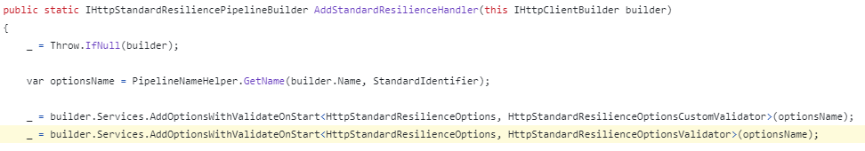

In this case the validator is registered to be executed immediately when the application starts instead of the first time the `HttpStandardResilienceOptions` is used. This helps catch configuration issues before the website accepts traffic. It also ensures the first request doesn't need to incur the cost of this validation.

[dotnet/extensions#4625](https://github.com/dotnet/extensions/pull/4625) enabled the configuration binder source generator for the `dotnet/extensions` libraries and fixed one other small AOT issue.

To enable the configuration binder source generator, a simple MSBuild property can be set in the project:

```xml
<PropertyGroup>
  <EnableConfigurationBindingGenerator>true</EnableConfigurationBindingGenerator>
</PropertyGroup>
```

Once enabled, this source generator finds all calls to the `Microsoft.Extensions.Configuration.ConfigurationBinder` and generates code for setting the properties based on the `IConfiguration` values so reflection is no longer necessary. The calls are re-routed to the generated code, and your existing code doesn't need to be modified. This allows the binding to work in trimmed applications because each property is explicitly set by code, thus they won't be trimmed.

Lastly, some code was inspecting all the values of an `enum`. In earlier versions of .NET, the way to do this was to call `Enum.GetValues(typeof(MyEnum))`. However, this API isn't compatible with AOT because an array of `MyEnum` needs to be created at runtime, and the AOT code might not contain the specific code for `MyEnum[]`.

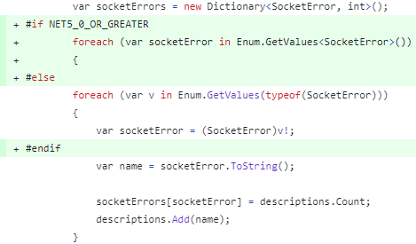

The fix is to take advantage of a relatively new API: `Enum.GetValues<TEnum>()` when running on a target framework that supports it. This API guarantees the `TEnum[]` code is generated. When not on a new .NET target framework, the code continues to use the older API.

### Dapper

[Dapper](https://www.nuget.org/packages/Dapper/) is a simple micro-ORM used to simplify working with ADO.NET. It works by generating dynamic IL at runtime based on the ADO.NET library being used (for example, `Microsoft.Data.SqlClient` or `Npgsql`) and based on the strong types used in the application - `Customer`, `Order`, etc. This reduces the boiler-plate code needed in an application to read/write objects to a database.

Sometimes only a handful of APIs in your library are incompatible with native AOT. You can attribute them as such, and add new APIs that are designed for AOT compatibility. But in the case of Dapper, its core design is intrinsically incompatible with native AOT. Generating IL at runtime is completely opposed to the reasons to use native AOT. Because of this, Dapper isn't able to be modified to support native AOT.

But the scenarios it enables are still important and the developer experience of using Dapper is much better than using the pure ADO.NET APIs. To enable this experience, a new design is needed.

Enter [Dapper.AOT](https://www.nuget.org/packages/Dapper.AOT), a rewrite of Dapper that generates the ADO.NET code at build-time instead of dynamically generating IL at runtime. While also being compatible with native AOT, this also reduces startup times in non-AOT'd applications because the code is already generated and compiled, no need to generate it at the start of the application.

Going into a deep-dive on how this was accomplished deserves a blog post all by itself, and you can find a [short explanation in the docs](https://aot.dapperlib.dev/generatedcode). If you find yourself in a situation where you need to completely rewrite your library to use a Roslyn source generator, check out the [Get started with source generators](https://learn.microsoft.com/dotnet/csharp/roslyn-sdk/source-generators-overview#get-started-with-source-generators) documentation. Although they can be expensive to develop, source generators can eliminate the necessity of using unbounded reflection or generating IL at runtime.

## Never supporting native AOT

Some .NET code just won't ever support native AOT. There may be an intrinsically fundamental design about a library that makes it impossible to ever make it compatible. An example of this is an extensibility framework, like the [Managed Extensibility Framework](https://learn.microsoft.com/dotnet/framework/mef/). The whole point of this library is to load extensions at runtime that the original executable didn't know about. This is how Visual Studio's extensibility is built. You can build plug-ins to Visual Studio to extend its functionality. This scenario won't work with native AOT because the extension may need a method (for example `string.Replace`) that was trimmed from the original application.

Another case where a library may decide to not support native AOT is the one that `Newtonsoft.Json` fell into. Libraries need to consider their existing customers. To make the existing APIs compatible may not be feasible without breaking changes. It would also be a considerable amount of work. And in this case, there is an alternative that is already compatible. So the benefits here are probably not worth the cost.

It's helpful to customers to be open and honest about your goals and plans. That way customers can understand and make plans for their applications and libraries. If you don't plan on ever supporting native AOT in a library, telling customers will let them know to make alternative plans. If it is a lot of work, but may eventually happen, that information is helpful to know as well. In my opinion, effective communication is one of the most valuable traits in software development.

## Summary

Native AOT is expanding the scenarios where .NET can be successfully used. Applications can get faster startup, use less memory, and have smaller on disk size than traditional self-contained .NET apps. But in order for applications to use this new deployment model, the libraries they use need to be compatible with native AOT.

I hope you find this guidance useful in making your libraries compatible with native AOT.