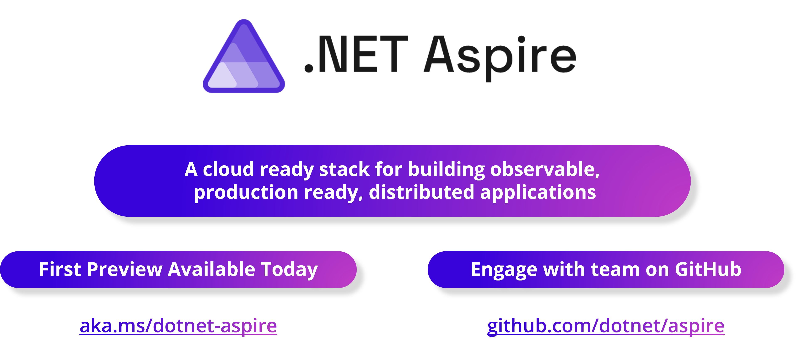
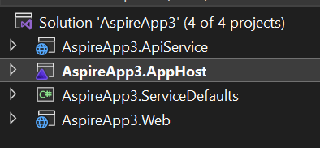
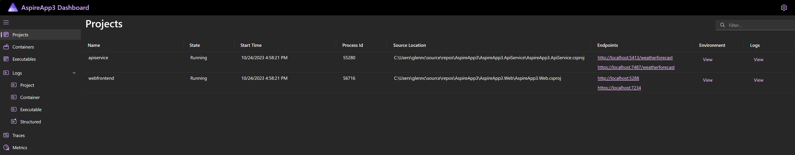
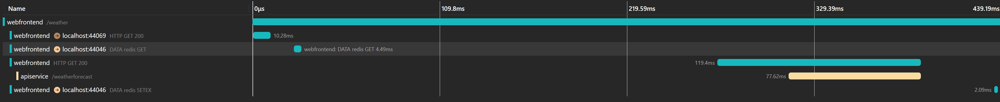
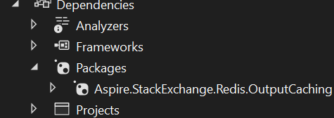
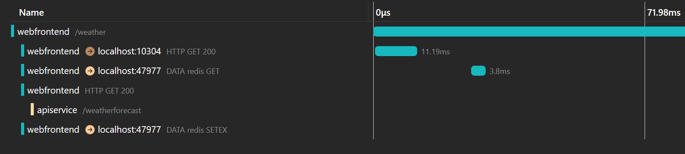
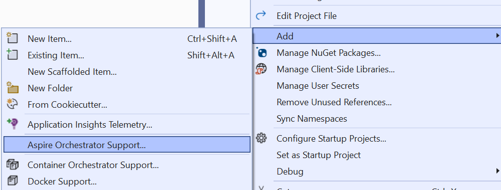
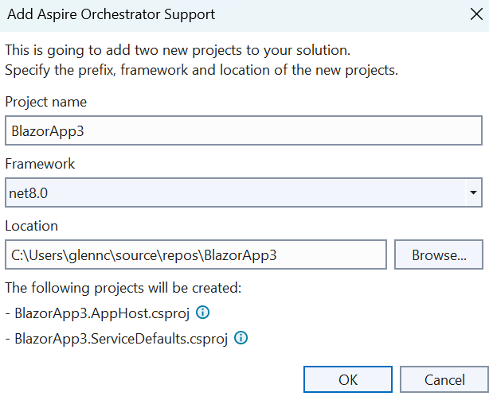

For several releases now we have been making progress on one of our ongoing aspirational goals. Making .NET one of the most productive platforms on the planet for building cloud native applications.

We worked alongside some of the most demanding services at Microsoft with scaling needs unheard of for most apps, services supporting hundreds of millions of monthly active users. Working with these services to make sure we satisfied their needs ensured we had foundational capabilities that could meet the demands of high scale cloud services.

We invested in important technologies and libraries such as Health Checks, YARP, HttpClientFactory, and gRPC. With Native AOT, we are working towards a sweet spot of perf and size, and SDK Container Builds make it trivial to get any .NET app into a container and ready for the modern cloud with no thought or work from the developer.

But what we heard from developers is that we needed to do more. Building apps for the cloud was still too hard. Developers are increasingly pulled away from their business logic and what matters most to deal with the complexity of the cloud.

To help you simplify cloud app complexity, we're introducing...

[](https://aka.ms/dotnet-aspire)

.NET Aspire is an *opinionated* stack for building resilient, observable, and configurable cloud-native applications with .NET. It includes a curated set of components enhanced for cloud-native by including service discovery, telemetry, resilience, and health checks by default. Combined with a sophisticated but simple local developer experience, .NET Aspire makes it easy to discover, acquire, and configure essential dependencies for cloud native applications on day 1 as well as day 100, for new and existing .NET apps using .NET 8+.

We are shipping the first preview of .NET Aspire with .NET 8 and will GA as part of .NET 8 in spring next year. It is part of .NET 8 and will version with .NET going forward (**[Docs](https://aka.ms/dotnet/aspire/docs/overview), [GitHub](https://github.com/dotnet/aspire)).**

## A Tour of .NET Aspire

To start with, let's take a tour of the new `.NET Aspire Starter` template and touch on all the features before we dive deeper later in the post. This section is designed as a conversational overview that you can follow along with. You will need the latest .NET 8 and Visual Studio 2022 Preview (17.9 Preview 1). If you are on Linux or Mac you can still follow along with everything but some of the tooling examples given will not be available yet.

### Visual Studio Solution Tour

The starter application is designed to get you up and running with a working .NET Aspire solution that you can try out. The application is made up of 2 projects and a Redis cache. The front-end project is a Blazor web application that calls a back-end API for weather information.




You will notice two new projects that you haven't seen before `<appname>.AppHost` and `<appname>.ServiceDefaults`.

The `AppHost` project will run any .NET projects, containers, or executables needed as part of getting your distributed application. When in Visual Studio, debugging will attach to all the running projects allowing you to step into and across each service in your application. We will dig deeper into this project and what the code in it is like [later in the post](#application-model).

The `ServiceDefaults` project contains common logic that applies to each of the projects in the application. This is where cross cutting concerns like service discovery, telemetry, and health check endpoints are configured. We wanted this to be consistent across all the projects but also understand that teams and organizations will likely want to tweak some of the settings. Shared code in the project was the most discoverable and developer friendly mechanism we could find to achieve those goals.

### Developer Dashboard

If you run this starter application using F5 in VS or `dotnet run` on the command-line, then you are taken to the developer dashboard.



The developer dashboard is your first line debugger for a distributed application. It lists all your services, collects and displays logs, metrics, and traces for all the parts of your solution in a centralized view.

We can also see logs across all projects, and even a distributed trace showing a request to the weather page. Traces are an indispensable tool in diagnosing problems in distributed systems.



The developer dashboard is your home for getting all your development time diagnostics data together and narrowing down slowdowns and bugs on your development machine. It uses all the same open standards as you would use in production when you configure your production telemetry systems like Grafana+Prometheus, Application Insights etc. We will go deeper into the dashboard [later in this post](#developer-dashboard).

A few years ago we worked on an experiment called Project Tye, many of the learnings from that experiment are now available in .NET Aspire, including this dashboard that we first tried out in that experiment. If you enjoyed Project Tye and wanted it to continue then we think you will love .NET Aspire.

### Components

Now let's start looking at what is different about the projects. Firstly, the web project has a NuGet package with `Aspire` in the name `Aspire.StackExchange.Redis.OutputCaching`.



If you are following along and don't see this package you likely didn't check the box to "use Redis caching" when you created the project.

This nuget package is what we call a `.NET Aspire Component`. Components are glue libraries that configure an SDK to operate in a cloud environment. Each component must:

- Provide JSON Schema to config to provide statement completion in `appsettings.json`.
- Leverage configurable resilience patterns such as retries, timeouts, and circuit breakers to maximize availability.
- Expose health checks enabling applications to track and respond to the remote service's health.
- Offer integrated logging, metrics, and tracing using modern .NET abstractions (ILogger, Meter, Activity).
- Offer extension methods that 'glue' the services from the SDK to the DI container with the right lifetime for the types being registered.

We will go into more detail on components later in the post. The key takeaway is that .NET Aspire Components configure dependencies to honor a set of requirements that we believe sets up consumers for success in the cloud. They do not wrap/hide the actual SDK/library but are glue to make sure the library is configured with a good set of defaults and registered with DI correctly. An exercise that is generally left to the developer today.

### Code

Now let's look at the code in the Blazor app that is calling the weather API, and then at some of the code from the AppHost we talked about earlier. Firstly, in our web project's `Program.cs` you can see code like this:

```csharp
builder.Services.AddHttpClient<WeatherApiClient>(client => client.BaseAddress = new("http://apiservice"));
```

This is configuring our web frontend to be able to call the weather API. But there are a few things that are unusual about it, namely where does this `apiservice` name come from? To answer that we are going to look in our `AppHost` project for the first time, here is the `Program.cs` file from that project.

```csharp
var builder = DistributedApplication.CreateBuilder(args);

var cache = builder.AddRedisContainer("cache");

var apiservice = builder.AddProject<Projects.AspireApp_ApiService>("apiservice");

builder.AddProject<Projects.AspireApp_Web>("webfrontend")
    .WithReference(cache)
    .WithReference(apiservice);

builder.Build().Run();
```

This code executes because the `AppHost` is your startup project. It runs your projects, their dependencies and configures them appropriately allowing them to communicate. One of our goals is to remove ports and connection strings from your developer flow as much as possible. We do this via a [service discovery](#service-discovery) mechanism that allows developers use logical names instead of addresses and ports when making HTTP calls. You can see here that I name my API `apiservice` then pass that as a reference to the frontend and can then use `apiservice` as a name when making HTTP calls via `HttpClientFactory`. The calls made using this method will also automatically retry and handle transient failures thanks to an integration with the [Polly project](https://github.com/App-vNext/Polly).

The AppHost sets up your application dependencies and requirements, and .NET Aspire tooling fulfills those in your dev loop.

## Deeper Dive

### Components

We are going to start our deep dive with components. .NET Aspire Components are designed to solve the pain that we heard from customers getting started with Cloud Native development, that there was a lot of techniques/configuration you had to get right and that it wasn't obvious what path to start with. We help this by being opinionated about what a component needs to provide, mandating that all components at a minimum provide resiliency defaults, health checks, setup telemetry, and integrate with DI. To highlight that, let's look at what an app ready for production might do to configure Redis in their app:

1. Add the Redis package with the Redis client library.
1. Discover and add a health checks library so your app can respond to the Redis being unavailable. This is frequently missed but useful in practice.
1. Add Redis to DI and configure connection strings. This is tricky because you need to know what lifetime the Redis client library types should have. Which requires research.
1. Configure Redis client library to send log output to your telemetry system.
1. Logs and Metrics are different and require different plumbing.
1. Decide what resiliency policy & logic is needed and configure Redis or wrap calls with a library like Poly that can implement resiliency policies. This again requires research into the capabilities of Redis and knowledge of what resiliency policy you should have, which is frequently not something you know starting out and results in people shipping without it until something breaks in production that could've been avoided with a retry policy with exponential backoff.

If we contrast that with using .NET Aspire:

1. Add the .NET Aspire Redis package.
2. Call AddRedis on the builder.
3. Optionally override default config in appSettings.json (which is now schematized so you have completion to discover what can be set).

.NET Aspire Components are designed to get you started with the best production ready configuration we can, without abstracting or hiding the SDK that you would use. In both examples above your code to use Redis will be using the same Redis client library and types.

A Component must do the following to be considered ready for use:

- Provide detailed, schematized, configuration.
- Setup Health Checks to track and respond to the remote services health.
- Provide a default, configurable, resiliency pattern (retries, timeouts, etc) to maximize availability.
- Offer integrated logging, metrics, and tracing to make the component observable.

Our initial set of components are are below, and more documentation can be found at <https://learn.microsoft.com/dotnet/aspire/components-overview?branch=aspire>

### Cloud-agnostic components

| **Component** | **Description** |
| --- | --- |
| [PostgreSQL Entity Framework Core](https://learn.microsoft.com/dotnet/aspire/database/postgresql-entity-framework-component) | Provides a client library for accessing PostgreSQL databases using Entity Framework Core. |
| [PostgreSQL](https://learn.microsoft.com/dotnet/aspire/database/postgresql-component) | Provides a client library for accessing PostgreSQL databases. |
| [RabbitMQ](https://learn.microsoft.com/dotnet/aspire/messaging/rabbitmq-client-component) | Provides a client library for accessing RabbitMQ. |
| [Redis Distributed Caching](https://learn.microsoft.com/dotnet/aspire/caching/stackexchange-redis-distributed-caching-component) | Provides a client library for accessing Redis caches for distributed caching. |
| [Redis Output Caching](https://learn.microsoft.com/dotnet/aspire/caching/stackexchange-redis-output-caching-component) | Provides a client library for accessing Redis caches for output caching. |
| [Redis](https://learn.microsoft.com/dotnet/aspire/caching/stackexchange-redis-component) | Provides a client library for accessing Redis caches. |
| [SQL Server Entity Framework Core](https://learn.microsoft.com/dotnet/aspire/database/sql-server-entity-framework-component) | Provides a client library for accessing SQL Server databases using Entity Framework Core. |
| [SQL Server](https://learn.microsoft.com/dotnet/aspire/database/sql-server-component) | Provides a client library for accessing SQL Server databases. |

### Azure specific components

| **Component** | **Description** |
| --- | --- |
| [Azure Blob Storage](https://learn.microsoft.com/dotnet/aspire/storage/azure-storage-blobs-component) | Provides a client library for accessing Azure Blob Storage. |
| [Azure Cosmos DB Entity Framework Core](https://learn.microsoft.com/dotnet/aspire/database/azure-cosmos-db-entity-framework-component) | Provides a client library for accessing Azure Cosmos DB databases with Entity Framework Core. |
| [Azure Cosmos DB](https://learn.microsoft.com/dotnet/aspire/database/azure-cosmos-db-component) | Provides a client library for accessing Azure Cosmos DB databases. |
| [Azure Key Vault](https://learn.microsoft.com/dotnet/aspire/security/azure-security-key-vault-component) | Provides a client library for accessing Azure Key Vault. |
| [Azure Service Bus](https://learn.microsoft.com/dotnet/aspire/messaging/azure-service-bus-component) | Provides a client library for accessing Azure Service Bus. |
| [Azure Storage Queues](https://learn.microsoft.com/dotnet/aspire/storage/azure-storage-queues-component) | Provides a client library for accessing Azure Storage Queues. |

Today, this set of components are available and shipped by Microsoft. Our goal is that the process for becoming an Aspire component and the requirements/best practices for them becomes more community driven as the cloud changes and more libraries want to have components.

### Application Model

The `AppHost` project in a .NET Aspire app lets you express the needs of your application in your favorite .NET language (C# support initially). It is responsible for orchestrating the running of your application on your dev machine.

Orchestration is a core capability of .NET Aspire designed to streamline the connections and configurations between different parts of your cloud-native app. .NET Aspire provides useful abstractions that allow you to orchestrate concerns like service discovery, environment variables, and container configurations without having to manage low level implementation details. These abstractions also provide consistent setup patterns across applications with many components and services.

.NET Aspire orchestration assists with the following concerns:

- **App composition** : Define resources that make up the application, including .NET projects, containers, executables or cloud resources.
- **Service discovery** : Determining how the different resources communicate with each other.

For example, using .NET Aspire, the following code creates a local Redis container resource, a project resource for an API, and configures the appropriate connection string and URL in the "webfrontend" project.

```csharp
var builder = DistributedApplication.CreateBuilder(args);

var cache = builder.AddRedisContainer("cache");

var apiservice = builder.AddProject<Projects.AspireApp_ApiService>("apiservice");

builder.AddProject<Projects.AspireApp_Web>("webfrontend")
    .WithReference(cache)
    .WithReference(apiservice);

builder.Build().Run();
```

The "webfrontend" project can now make HTTP requests to `http://apiservice` without ever worrying about port mapping. The Redis connection string is even more transparent as the Aspire component configures the Redis Client to use the connection string provided automatically. This removes a large source of error prone setup in your development flow and streamlines both getting started and onboarding. If you are using Service Discovery in production, even if only the default Kubernetes features, then this will also mirror production more closely than manual configuration.

Our initial set of resources are are below, Method is the method you would call to add that resource in your `AppHost` project:

### Built-in Resources

| Method | Resource type | Description |
|--|--|--|
| `AddProject` | `ProjectResource` | A .NET project, for example ASP.NET Core web apps. |
| `AddContainer` | `ContainerResource` | A container image, such as a Docker image. |
| `AddExecutable` | `ExecutableResource` | An executable file. |

### Cloud Agnostic Extensions
Each of these methods become available when you add the NuGet package (component) for the corresponding resource.

| Method | Resource type | Description |
|--|--|--|
| `AddPostgresConnection` | `PostgresConnectionResource` | Adds a Postgres connection resource. |
| `AddPostgresContainer` | `PostgresContainerResource` | Adds a Postgres container resource. |
| `AddPostgresContainer(...).AddDatabase` | `PostgresDatabaseResource` | Adds a Postgres database resource. |
| `AddRabbitMQConnection` | `RabbitMQConnectionResource` | Adds a RabbitMQ connection resource. |
| `AddRabbitMQContainer` | `RabbitMQContainerResource` | Adds a RabbitMQ container resource. |
| `AddRedisContainer` | `RedisContainerResource` | Adds a Redis container resource. |
| `AddSqlServerConnection` | `SqlServerConnectionResource` | Adds a SQL Server connection resource. |
| `AddSqlServerContainer` | `SqlServerContainerResource` | Adds a SQL Server container resource. |
| `AddSqlServerContainer(...).AddDatabase` | `SqlServerDatabaseResource` | Adds a SQL Server database resource. |

### Azure Specific Extensions
Each of these methods become available when you add the NuGet package (component) for the corresponding resource.

| Method | Resource type | Description |
|--|--|--|
| `AddAzureStorage` | `AzureStorageResource` | Adds an Azure Storage resource. |
| `AddAzureStorage(...).AddBlobs` | `AzureBlobStorageResource` | Adds an Azure Blob Storage resource. |
| `AddAzureStorage(...).AddQueues` | `AzureQueueStorageResource` | Adds an Azure Queue Storage resource. |
| `AddAzureStorage(...).AddTables` | `AzureTableStorageResource` | Adds an Azure Table Storage resource. |
| `AddAzureCosmosDB` | `AzureCosmosDBResource` | Adds an Azure Cosmos DB resource. |
| `AddAzureKeyVault` | `AzureKeyVaultResource` | Adds an Azure Key Vault resource. |
| `AddAzureRedisResource` | `AzureRedisResource` | Adds an Azure Redis resource. |
| `AddAzureServiceBus` | `AzureServiceBusResource` | Adds an Azure Service Bus resource. |

You can find more about how orchestration works in the .NET Aspire docs: [.NET Aspire orchestration overview - .NET | Microsoft Learn](https://learn.microsoft.com/dotnet/aspire/app-host-overview)

### Developer Dashboard
The .NET Aspire dashboard is only visible while the AppHost app is running and will launch automatically when you start the project. The left navigation provides links to the different parts of the dashboard we will describe here. Additionally, the cog icon in the upper right of the dashboard provides access to the settings page, which allows you to configure your dashboard experience.

- *Projects*: The projects page is the home page of the dashboard, it lists all the project resources in your application. It's main function is to show you the state of each project and to give you the URLs to parts of the app. It will also show a badge when an error has been logged for a project allowing you to easily zero in on problems.
- *Containers*: This page is the same as the projects page, but for the container resources of your application. In our tour above the Redis cache container would be displayed here.
- *Executables*: This page is the same as the projects page, but for the executable resources of your application.
- *Logs*: The logs section of the dashbaord provides access the logs of all the parts of your application in a cental location.
    - *Project Logs*: The output from the logging provider in your .NET projects can be viewed here, you can switch between each project and each log severity is represented with a different color.
    - *Container Logs*: This page is the same as the Project Logs but for containers.
    - *Executable Logs*: This page is the same as the Project Logs but for executables.
    - *Structured Logs*: The structured logs page provides filterable view of all your logs. The structured logs maintain the properties of your log messages so that they can be individually filtered/searched on, whereas the other logs pages have all properties merged into a single string log message.
  - *Traces*: The Traces page shows the path of a single action through all the parts of your application, a distributed trace. This view can be highly valuable in finding bottlenecks, slowdowns, and other diagnosing other behaviors that only appear when the full system is being used and not in isolation. We showed a screenshot of the traces view in the tour section above, highlighting how you can see a single action using the Redis Cache, API, and frontend all in one view.
  - *Metrics*: The Metrics page shows all the [metrics](https://learn.microsoft.com/dotnet/core/diagnostics/built-in-metrics) for your application.

Learn more about the dashboard here: [.NET Aspire Dashboard](https://learn.microsoft.com/dotnet/aspire/dashboard)

### Observability

.NET Aspire applications are observable by default. Great observability means that you can determine what is going on in your solution, especially during an outage, from all the data being collected from the running app. Specifically from logs, metrics, and traces. Just having logs and metrics doesn't make your whole system observable if you can't determine what is happening, you need the right data in the right view at the right time.

This means that for an app to be observable then:

1. All the parts of the distributed application need to provide data in a way you can consume, including .NET itself, libraries you use, and your own application code.
2. That data needs to be sent somewhere that you can access.
3. Tools to view/query/make sense of the data need to exist.

In .NET we have been investing more and more into Open Telemetry both as the format of the data, adopting Open Telemetry naming and structure for data, as well as the Open Telemetry Protocol (OLTP) for getting data out of your application and into an ecosystem of tools.

In .NET Aspire we provide the code to wire-up Open Telemetry by default in the `ServiceDefaults` project. We used shared code because there are conventions like the name of your health endpoints that we expect some people will want to customize for their project or company. When experimenting we found that shared code gave a better experience for defining these types of defaults that people could tweak rather than putting them in a library with configuration settings.

.NET Aspire also provides the Developer Dashboard we mentioned above which gives you all the logs, metrics, and traces from your app. One of the highlight features of the dashboard is the Traces view which provides a distributed trace of requests that went through your app. In the example below we made a request to the weather page of the `Aspire Starter App` template. You can see how the request goes from the frontend to a Redis cache to see if the data is cached (the DATA redis GET line), then because there is no data in the cache it makes a call to the backend API, and finally caches that data.



This type of view makes finding things like user actions that cause inefficient paths through the system. You will be able to see immediately things like multiple database calls being made or individual services that are slowing down other parts of the system. These types of issues can be difficult to discover without this type of data and view of the data.

### Service Discovery

One of the key pieces of building any distributed application is the ability to call remote services. As part of .NET Aspire, we've built a new service discovery library, **Microsoft.Extensions.ServiceDiscovery**. This library provides the core abstraction and various implementations of client side service discovery and load balancing that enable seamless integration with HttpClientFactory, and YARP, and also in deployed environments Kuberentes and Azure Container Apps.

Learn more about service discovery here: [Service discovery in .NET Aspire](https://learn.microsoft.com/dotnet/aspire/service-discovery/overview)

### Deploying an Aspire Application

The final artifacts of a .NET Aspire application are .NET apps and configuration that can be deployed to your cloud environments. With the strong container-first mindset of Aspire, the .NET SDK native container builds serve as a valuable tool to publish these apps to containers with ease.

While .NET Aspire itself doesn't natively provide a direct mechanism to deploy your applications to their final destinations, the Application Model as described above knows all about the application, it's dependencies, configurations, and connections to each services. The application model can produce a manifest definition that describes all of these relationships and dependencies that tools can consume, augment, and build upon for deployment.

With this manifest, we've enabled getting your Aspire application into Azure using Azure Container Apps in the simplest and fastest way possible. Working with new capabilities in the Azure Developer CLI and .NET Aspire, these combined experiences enable you to quickly detect an Aspire environment, understand the application, and immediately provision and deploy the Azure resources in one step.

[video src="https://devblogs.microsoft.com/dotnet/wp-content/uploads/sites/10/2023/11/azdinit-fast-aspire.mp4"]

_(Note: portions of this video are sped up. The aspire-starter app typically takes ~5 minutes to provision and deploy)_

As you can see in the above video, it's one of the fastest ways to get from code to cloud with .NET Aspire. We will continue to evolve this capability of deploying .NET Aspire apps extending ease of deployment from tools like Visual Studio's publish mechanism, leveraging the same underlying manifest and integration with Azure Developer CLI, right from your favorite IDE!

The Azure Developer CLI can also create bicep from the manifest to allow developers and platform engineers to audit or augment the deployment processes.

We expect this to be a key component that many IaC systems integrate with. For more information about the manifest and deployment of .NET Aspire apps, see: [.NET Aspire manifest format - .NET | Microsoft Learn](https://learn.microsoft.com/dotnet/aspire/deployment/manifest-format)

### Existing Apps

We have shown a lot of new applications in this blog post so far, but .NET Aspire can also be used with existing applications as it's possible to incrementally adopt various parts of the stack.

Firstly, .NET Aspire is part of .NET 8. So, you will need to upgrade before trying to use any of the parts of the stack. We have tooling and guidance to help you with that here: [Upgrade Assistant | .NET (microsoft.com)](https://dotnet.microsoft.com/platform/upgrade-assistant). You will also need the latest preview version of Visual Studio if you want to use the Visual Studio tooling, 17.9 at the time of writing.

Once you have that you can right-\>click a Project in Visual Studio and chose `Add` -\> `Aspire Orchestrator Support`.



You will then be prompted with the following to confirm the project and action.



This will create an `AppHost` and `ServiceDefaults` project, the project you selected will already be added to the `AppHost`. You can now launch the AppHost project and will see the developer dashboard. From here you can add a reference to the `ServiceDefaults` project and call the `AddServiceDefaults()` method on your application builder. This will setup Open Telemetry, health check endpoints, service discovery, and the default resiliency patterns for this project.

// TBD: Command line instructions?

You can now switch over to Aspire components if you are using any of the services that have components. This may mean you can remove some explicit configuration if your already setup what the component does yourself. You are also free to use components in any .NET 8 app without orchestration. This will get you resiliency and other configuration applied to the component, but you will not get the rest of Aspire like the dashboard, service discovery, and automatic ports, urls, or connection strings.

## Conclusion

We're really excited to deliver this first preview of Aspire to you today. Building on rock solid foundation of fundamentals and an incredibly productive API surface in .NET 8, we're confident you're going to love the productivity in building your cloud native apps using Aspire.

Get started today with these resources:

- Get the tools \<download VS version X\>
- Get the packages \<any additional\>
- Build your first Aspire solution \<link to learn\>
- Explore an existing Aspire solution \<link to repo with devcontainer enabled for remote/and Codespaces\>

Most importantly, we want to hear what's working for you and what we can improve. Aspire is a part of the .NET platform and foundation and is an open source project alongside the platform. Engage with us here at https://github.com/dotnet/aspire.
