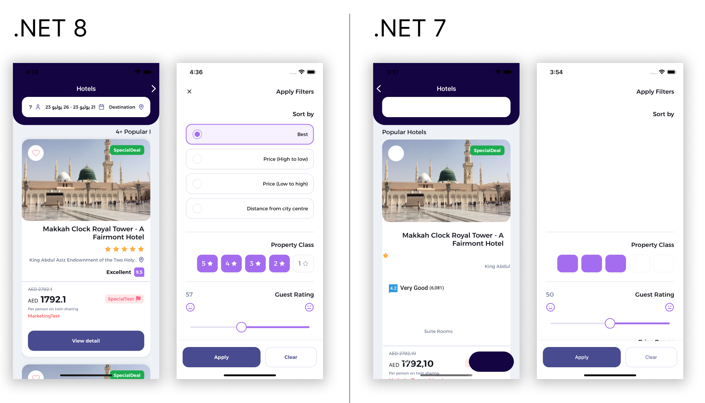

Today our team is thrilled to introduce you to the latest major stable release of .NET MAUI in .NET 8! We build .NET MAUI to enable .NET developers to create cross-platform applications for Android, iOS, macOS, and Windows with deep native integrations, platform-native user interfaces, and hybrid experiences that extend the reach of Blazor and other web UI technologies. Today marks the third major release of .NET MAUI in the past 18 months which turns the corner from our unifying of the Xamarin platform with .NET into pushing forward .NET as one.  

In addition to all the [amazing work in the .NET SDK and runtime](https://devblogs.microsoft.com/dotnet/announcing-dotnet-8), we have labored with extreme focus on .NET 8 to fix high impact bugs, isolate and resolve memory leaks, improve the accuracy and reliability of hot reload, ease the path for customers upgrading from Xamarin, retain and improve performance at startup and runtime, and so much more. We are very proud of this release and cannot wait for everyone to start using it.

> "Creating Right to Left layouts in .NET MAUI is now a reality thanks to .NET 8. Visual elements are perfectly arranged and Carousels work great now. We've been working with the latests preview bits for a while and the improvements the MAUI team did have proven key to successfully deliver RTL apps to our clients." - Leo, UX Divers for Umrahme



Early feedback like this has been encouraging, and we are eager to hear from you next. Let's take a look at some of the biggest improvements you'll get in .NET MAUI.

## Overall Quality

Firstly looking at the release by the numbers, in .NET 8 we have:

- 1618 pull requests merged (up from 577)
- 689 bug issues resolved (up from 180)

Compared to the .NET 7 GA release that's a 180% increase in pull requests merged and 283% more bug issues resolved. Since .NET 7 was a shorter release for .NET MAUI, I thought it would be interesting to include all the .NET 7 service releases as well. Taking that into account, .NET 8 still has 18% more pull requests merged and 13% more bug issues resolved.

This would not have been possible without the 94 wonderful contributions of so many developers across teams at Microsoft and especially from the community. On behalf of all .NET MAUI users we thank you so much for your continued contributions and support!


 
Early in .NET 7 servicing we heard loud and clear from developers that we needed to raise the quality of releases, and so we did just that raising the bar on what we would backport from our .NET 8 work to release in .NET 7 until we had more automated testing in place and other processes to better guard against this. During subsequent releases we enabled a dormant suite of Xamarin.Forms tests to run on .NET and against .NET MAUI, and added more than 3500 device tests on Windows spread across the Controls, Core, and Essentials areas.

Going forward in .NET 8 servicing, the bar is back down and we will ship more bug fixes to .NET 8 than you saw in .NET 7. We know that this was not a popular decision, and we did the work to be more confident in the quality of our quick servicing releases to meet your need. One way we are adding to this confidence is by previewing releases via NuGet (more on this later).

The top areas of quality improvements are:
* Keyboard behavior, especially on mobile
* FlowDirection support for right-to-left languages
* Layout fidelity and performance
* Scroll performance

## What's new

The .NET MAUI pedigree is rooted in touch interfaces on mobile and tablet devices, so we have some work to do to enable more desktop specific experiences where user input is more often from keyboard and mouse. This release enables keyboard accelerators, enhances pointer gestures, and more.

### Keyboard accelerators

A keyboard accelerator is the shortcut you can associate with any menu item in a desktop application, like copy (Ctrl+C), paste (Ctrl+V), and Cut (Ctrl+X).

```xaml
<ContentPage.MenuBarItems>
    <MenuFlyoutItem Text="Cut"
                    Clicked="OnCutMenuFlyoutItemClicked">
        <MenuFlyoutItem.KeyboardAccelerators>
            <KeyboardAccelerator Modifiers="Ctrl"
                                Key="X" />
        </MenuFlyoutItem.KeyboardAccelerators>
    </MenuFlyoutItem>
</ContentPage.MenuBarItems>
```


For more details and advanced examples, see the [Keyboard Accelerators documentation](https://learn.microsoft.com/dotnet/maui/user-interface/keyboard-accelerators?view=net-maui-8.0).

### Pointer gesture enhancements

.NET MAUI has included a `PointerGesture` for a while so you knew when the cursor was over an element, and now in .NET 8 you gain `PointerPressed` and `PointerReleased` events along with event arguments containing more information about the position of the pointer. This works across Android, iPadOS, Mac Catalyst, and Windows. 

[video src="https://devblogs.microsoft.com/dotnet/wp-content/uploads/sites/10/2023/11/pointer-gestures.mp4"]

See the updated [Recognize a pointer gesture documentation](https://learn.microsoft.com/dotnet/maui/fundamentals/gestures/pointer?view=net-maui-8.0tabs=windows).

### Drag and drop gesture enhancements

To improve the drag and drop user experience we have exposed more APIs on Windows such as including custom glyphs when you initiate a drag, custom captions when you drag, and on iOS and Mac Catalyst for the size of hte item you're dragging, adding custom shapes or images, and customizing the drop actions to indicate if it's a copy, a move, or a forbidden action.

[video src="https://devblogs.microsoft.com/dotnet/wp-content/uploads/sites/10/2023/11/windowsDragNDropSample.mp4"]
[video src="https://devblogs.microsoft.com/dotnet/wp-content/uploads/sites/10/2023/11/iosDragNDropSample.mp4"]

See the updated [Recognize a drag and drop gesture documentation](https://learn.microsoft.com/dotnet/maui/fundamentals/gestures/drag-and-drop?view=net-maui-8.0&tabs=windows).

## Performance and memory improvements

Jonathan Peppers has [written in-depth](https://devblogs.microsoft.com/dotnet/dotnet-8-performance-improvements-in-dotnet-maui/) about the work in .NET 8 to improve performance, app size, and address memory leaks. [New features](https://devblogs.microsoft.com/dotnet/dotnet-8-performance-improvements-in-dotnet-maui/) include AndroidStripILAfterAOT, AndroidEnableMarshalMethods, and NativeAOT for iOS. These and many other improvements are available so you can choose the best path for reducing your app size and improve performance. 

By staying on the leading edge of .NET, you get most of these improvements without having to make any changes to your code.

## Miscellaneous highlights

With the enormous amount of work that has gone into this release, it should be no surprise that there's even more to highlight. For the complete list of changes, enjoy a lengthy read of the [.NET MAUI 8.0.3 release notes](https://github.com/dotnet/maui/releases), and for an abbreviated summary enjoy reading the [What's new in .NET MAUI for .NET 8](https://learn.microsoft.com/dotnet/maui/whats-new/dotnet-8?view=net-maui-8.0). 

* [Publish an unpackaged .NET MAUI app for Windows with the CLI](https://learn.microsoft.com/dotnet/maui/windows/deployment/publish-unpackaged-cli?view=net-maui-8.0).
* Use `ContentPage.HideSoftInpuOnTapped` to [dismiss the keyboard](https://learn.microsoft.com/dotnet/maui/user-interface/pages/contentpage?view=net-maui-8.0) when tapping anywhere on the page
* Controls that support text input gain extension methods that support hiding and showing the soft input keyboard. For more information, see [Hide and show the soft input keyboard](https://learn.microsoft.com/dotnet/maui/user-interface/controls/entry?view=net-maui-8.0#hide-and-show-the-soft-input-keyboard).
* WebView gains a UserAgent property. For more information, see [WebView](https://learn.microsoft.com/dotnet/maui/user-interface/controls/webview?view=net-maui-8.0).
* Inline media playback of HTML5 video, including autoplay and picture in picture, has been enabled by default for the WebView on iOS. For more information, see [Set media playback preferences on iOS and Mac Catalyst](https://learn.microsoft.com/dotnet/maui/user-interface/controls/webview?view=net-maui-8.0#set-media-playback-preferences-on-ios-and-mac-catalyst).
* BlazorWebView gains a StartPath property, a TryDispatchAsync method, and enhanced logging capabilities. For more information, see [Host a Blazor web app in a .NET MAUI app using BlazorWebView](https://learn.microsoft.com/dotnet/maui/user-interface/controls/blazorwebview?view=net-maui-8.0).
* The TapGestureRecognizer class gains the ability to handle secondary taps on Android. For more information, see [Recognize a tap gesture](https://learn.microsoft.com/dotnet/maui/fundamentals/gestures/tap?view=net-maui-8.0).

## Get started today

.NET MAUI and .NET 8 are included in today's stable release of [Visual Studio 2022 17.8](https://visualstudio.microsoft.com/vs/). 

On all platforms, you can develop with .NET MAUI using Visual Studio Code. Install the [.NET MAUI extension](https://marketplace.visualstudio.com/items?itemName=ms-dotnettools.dotnet-maui) and [let us know](https://www.surveymonkey.com/r/W789CW2) how we can improve this preview experience for you in the future. 

Download the [.NET 8 RC2 installer](https://dotnet.microsoft.com/download/dotnet/8.0), and then install .NET MAUI from the command line:

```bash
dotnet workload install maui
```

Through the [retirement of Visual Studio for Mac next year](https://devblogs.microsoft.com/visualstudio/visual-studio-for-mac-retirement-announcement/) you can continue developing using Visual Studio for Mac after enabling the preview feature for .NET 8 in Preferences.

## Thank You

On behalf of the .NET MAUI team, thank you for all of your engagement, contributions, and support! We look forward to hearing about [your successes](mailto:david.ortinau@microsoft.com), and [your feedback](https://github.com/dotnet/maui/issues/new/choose) on how we can improve the product through .NET 8 service releases and into .NET 9.