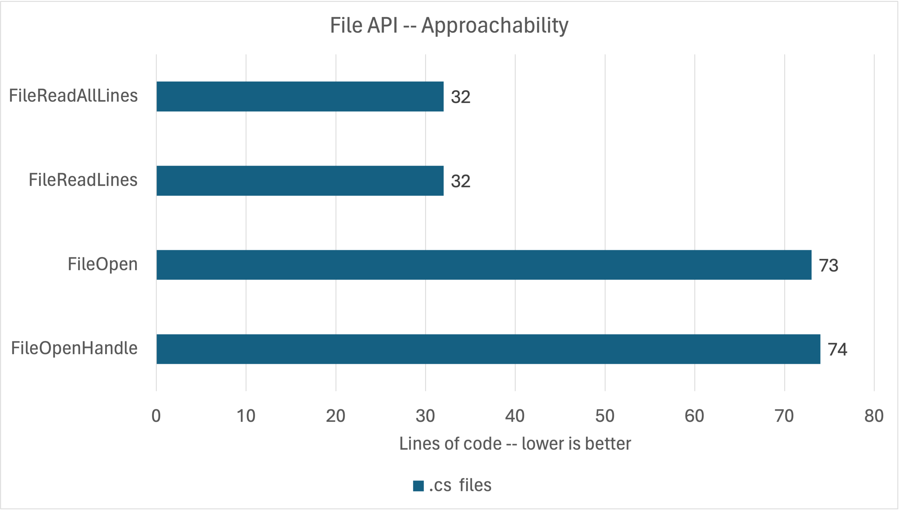
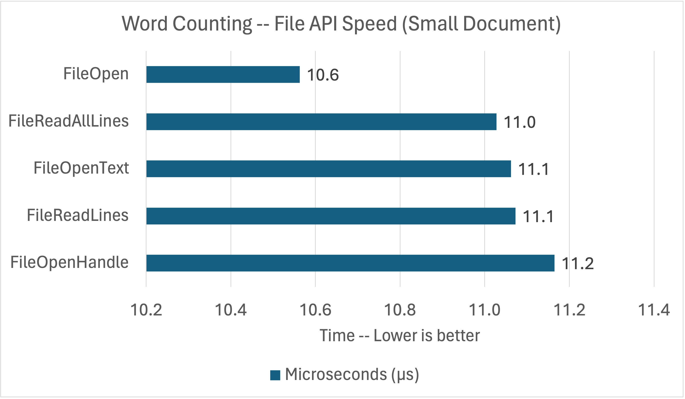
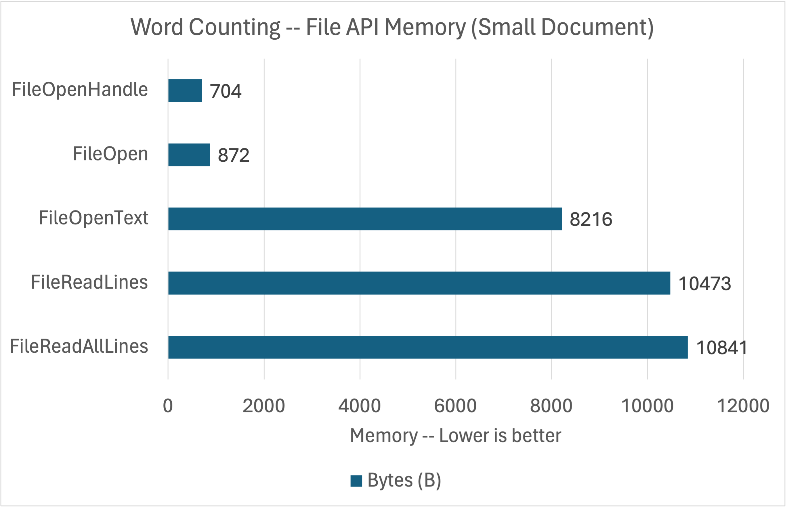
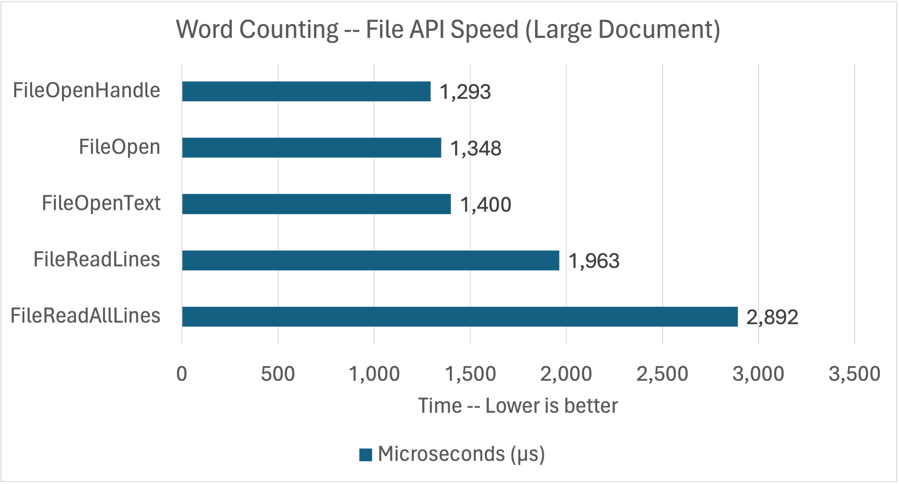
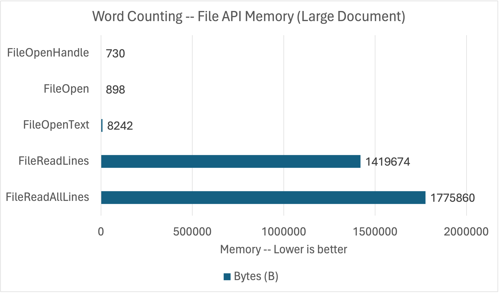
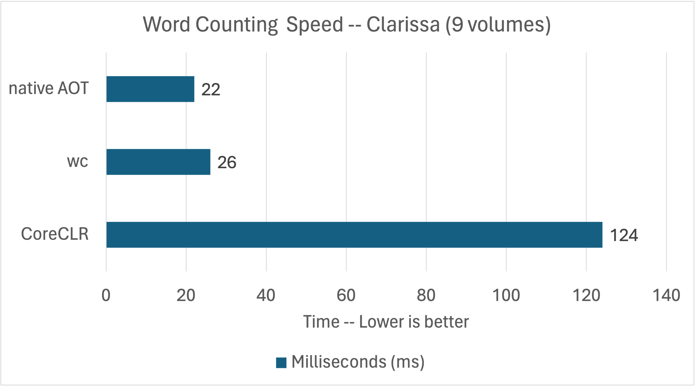
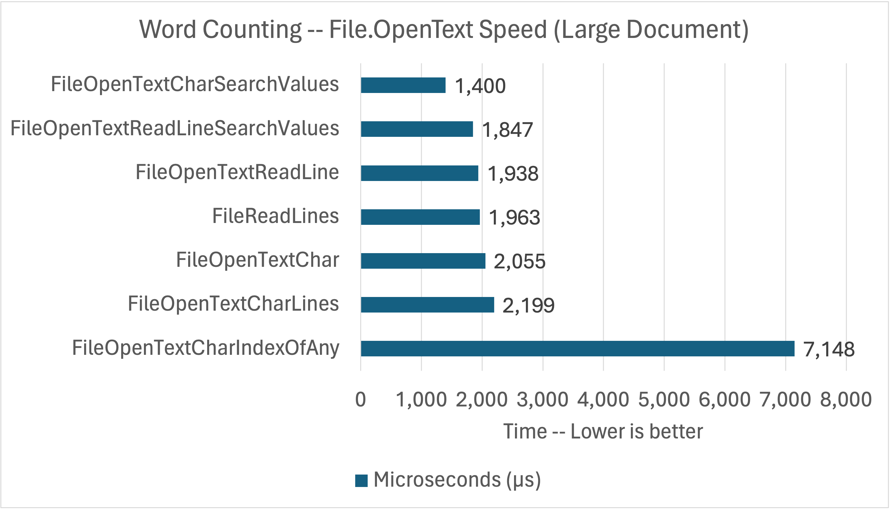
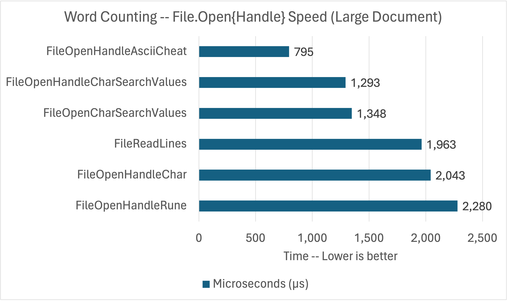

Reading and writing files is very common, just like other forms of I/O. File APIs are needed for reading application configuration, caching content, and loading data (from disk) into memory to do some computation like (today's topic) word counting. `File`, `FileInfo`, `FileStream`, and related types do a lot of the heavy lifting for .NET developers needing to access files. In this post, we’re going to look at the convenience and performance of reading text files with [System.IO](https://learn.microsoft.com/dotnet/api/system.io), with some help from [System.Text](https://learn.microsoft.com/dotnet/api/system.text) APIs.

We recently kicked off a series on the [Convenience of .NET](https://devblogs.microsoft.com/dotnet/the-convenience-of-dotnet/) that describes our approach for providing convenient solutions to common tasks. [The convenience of System.Text.Json](https://devblogs.microsoft.com/dotnet/the-convenience-of-system-text-json/) is another post in the series, about reading and writing JSON documents. [Why .NET?](https://devblogs.microsoft.com/dotnet/why-dotnet/) describes the architectural choices that enable the solutions covered in these posts.

This post analyzes the convenience and performance of file I/O and text APIs being put to the task of counting lines, words, and bytes in a large novel. The results show that the high-level APIs are straightforward to use and deliver great performance, while the lower-level APIs require a little more effort and deliver excellent results. You'll also see how [native AOT](https://learn.microsoft.com/dotnet/core/deploying/native-aot) shifts .NET into a new class of performance for application startup.

## The APIs

The following `File` APIs (with their companions) are used in the benchmarks.

1. [`File.OpenHandle`](https://learn.microsoft.com/dotnet/api/system.io.file.openhandle) with [`RandomAccess.Read`](https://learn.microsoft.com/dotnet/api/system.io.randomaccess.read#system-io-randomaccess-read(microsoft-win32-safehandles-safefilehandle-system-span((system-byte))-system-int64))
1. [`File.Open`](https://learn.microsoft.com/dotnet/api/system.io.file.open) with [`FileStream.Read`](https://learn.microsoft.com/dotnet/api/system.io.filestream.read#system-io-filestream-read(system-span((system-byte))))
1. [`File.OpenText`](https://learn.microsoft.com/dotnet/api/system.io.file.opentext) with [`StreamReader.Read`](https://learn.microsoft.com/dotnet/api/system.io.streamreader.read) and [`StreamReader.ReadLine`](https://learn.microsoft.com/dotnet/api/system.io.streamreader.readline)
1. [`File.ReadLines`](https://learn.microsoft.com/dotnet/api/system.io.file.readlines) with [`IEnumerable<string>`](https://learn.microsoft.com/dotnet/api/system.collections.generic.ienumerable-1)
1. [`File.ReadAllLines`](https://learn.microsoft.com/dotnet/api/system.io.file.readalllines) with [`string[]`](https://learn.microsoft.com/dotnet/api/system.array)

The APIs are listed from highest-control to most convenient. It's OK if they are new to you. It should still be an interesting read.

The lower-level benchmarks rely on the following `System.Text` types:

- [Encoding](https://learn.microsoft.com/dotnet/api/system.text.encoding)
- [Rune](https://learn.microsoft.com/dotnet/api/system.text.rune)

I also used the new [`SearchValues`](https://learn.microsoft.com/dotnet/api/system.buffers.searchvalues) class to see if it provided a significant benefit over passing a `Span<char>` to `Span<char>.IndexOfAny`. It pre-computes the search strategy to avoid the upfront costs of [`IndexOfAny`](https://learn.microsoft.com/dotnet/api/system.memoryextensions.indexofany). Spoiler: the impact is dramatic.

Next, we’ll look at an app that has been implemented multiple times — for each of those APIs — testing approachability and efficiency.

## The App

The [app](https://github.com/richlander/convenience/tree/wordcount/wordcount/wordcount) counts lines, words, and bytes in a text file. It is modeled on the behavior of [`wc`](https://en.wikipedia.org/wiki/Wc_(Unix)), a popular tool available on Unix-like systems. I assume "wc" stands for "word count".

Word counting is an algorithm that requires looking at every character in a file. The counting is done by counting spaces and line breaks.

>  A word is a non-zero-length sequence of printable characters delimited by white space.

That's from `wc --help`. The app code need to follows that recipe. Seems straightforward.

The benchmarks count words in [Clarissa Harlowe; or the history of a young lady](https://en.wikipedia.org/wiki/Clarissa) by Samuel Richardson. This text was chosen because it is apparently one of the longest books in the English language and is [freely available on Project Gutenberg](https://www.gutenberg.org/ebooks/author/1959). There's even a [BBC TV adaption](https://www.imdb.com/title/tt0101066/) of it from 1991.

I also did some testing with [Les Miserables](https://dev.gutenberg.org/ebooks/author/85), another long text. Sadly, [`24601`](https://en.wikipedia.org/wiki/Jean_Valjean) didn't come up as a word count.

## Results

Each implementation is measured in terms of:

- Lines of code
- Speed of execution
- Memory use

I'm using a build of .NET 8 very close to the final GA build. While writing this post, I saw that there was another .NET 8 build still coming, however, the build I used is probably within the last two or three builds of final for the release.

I used [BenchmarkDotNet](https://benchmarkdotnet.org/index.html) for performance testing. It's a great tool if you've never used it. Writing a benchmark is similar to writing a unit test.

The following use of `wc` lists the cores on my Linux machine. Each core gets its own line in the `/proc/cpuinfo` file with "model name" appearing in each of those lines and `-l` counts lines.

```bash
$ cat /proc/cpuinfo | grep "model name" | wc -l
8
$ cat /proc/cpuinfo | grep "model name" | head -n 1
model name	: Intel(R) Core(TM) i7-7700K CPU @ 4.20GHz
$ cat /etc/os-release | head -n 1
NAME="Manjaro Linux"
```

I used that machine for the performance testing in this post. You can see I'm using Manjaro Linux, which is part of the Arch Linux family. .NET 8 is already available in the [Arch User Repository](https://aur.archlinux.org/packages/dotnet-sdk-preview-bin) (which is also available to Manjaro users).

### Lines of code

I love solutions that are easy and approachable. Lines of code is our best proxy metric for that.



There are two clusters in this chart, at ~35 and ~75 lines. You'll see that these benchmarks boil down to two algorithms with some small differences to accomodate the different APIs. In contrast, the [`wc` implementation](https://github.com/coreutils/coreutils/blob/master/src/wc.c) is quite a bit longer, nearing 1000 lines. It does more, however.

I used `wc` to calculate the Benchmark line counts, again with `-l`.

```bash
$ wc -l *Benchmark.cs
      73 FileOpenCharSearchValuesBenchmark.cs
      71 FileOpenHandleAsciiCheatBenchmark.cs
      74 FileOpenHandleCharSearchValuesBenchmark.cs
      60 FileOpenHandleRuneBenchmark.cs
      45 FileOpenTextCharBenchmark.cs
      65 FileOpenTextCharIndexOfAnyBenchmark.cs
      84 FileOpenTextCharLinesBenchmark.cs
      65 FileOpenTextCharSearchValuesBenchmark.cs
      34 FileOpenTextReadLineBenchmark.cs
      36 FileOpenTextReadLineSearchValuesBenchmark.cs
      32 FileReadAllLinesBenchmark.cs
      32 FileReadLinesBenchmark.cs
     671 total
```

I wrote several benchmarks. I summarized those in the image above, using the best performing benchmark for each file API (and then shortened the name for simplicity). The full set of benchmarks will get covered later.

### Functional parity with `wc`

Let's validate that my C# implementation matches `wc`.   

`wc`:

```bash
$  wc ../Clarissa_Harlowe/*
  11716  110023  610515 ../Clarissa_Harlowe/clarissa_volume1.txt
  12124  110407  610557 ../Clarissa_Harlowe/clarissa_volume2.txt
  11961  109622  606948 ../Clarissa_Harlowe/clarissa_volume3.txt
  12168  111908  625888 ../Clarissa_Harlowe/clarissa_volume4.txt
  12626  108592  614062 ../Clarissa_Harlowe/clarissa_volume5.txt
  12434  107576  607619 ../Clarissa_Harlowe/clarissa_volume6.txt
  12818  112713  628322 ../Clarissa_Harlowe/clarissa_volume7.txt
  12331  109785  611792 ../Clarissa_Harlowe/clarissa_volume8.txt
  11771  104934  598265 ../Clarissa_Harlowe/clarissa_volume9.txt
      9     153    1044 ../Clarissa_Harlowe/summary.md
 109958  985713 5515012 total
```

And with [`count`](https://github.com/richlander/convenience/tree/wordcount/wordcount/count), a standalone copy of [`FileOpenHandleCharSearchValuesBenchmark`](https://github.com/richlander/convenience/blob/wordcount/wordcount/wordcount/FileOpenHandleCharSearchValuesBenchmark.cs):

```bash
$ dotnet run ../Clarissa_Harlowe/
    11716  110023  610515 ../Clarissa_Harlowe/clarissa_volume1.txt
    12124  110407  610557 ../Clarissa_Harlowe/clarissa_volume2.txt
    11961  109622  606948 ../Clarissa_Harlowe/clarissa_volume3.txt
    12168  111908  625888 ../Clarissa_Harlowe/clarissa_volume4.txt
    12626  108593  614062 ../Clarissa_Harlowe/clarissa_volume5.txt
    12434  107576  607619 ../Clarissa_Harlowe/clarissa_volume6.txt
    12818  112713  628322 ../Clarissa_Harlowe/clarissa_volume7.txt
    12331  109785  611792 ../Clarissa_Harlowe/clarissa_volume8.txt
    11771  104934  598265 ../Clarissa_Harlowe/clarissa_volume9.txt
        9     153    1044 ../Clarissa_Harlowe/summary.md
   109958  985714  5515012 total
```

The results are effectively identical, with a one word difference in total wordcount. Here, you are seeing a Linux version of `wc`. The macOS version reported `985716` words, three words different than the Linux implementation. I noticed that there were some special characters in two of the files that were causing these differences. I didn't spend more time investigating them since its outside of the scope of the post.

### Scan the summary (in 10 microseconds)

I started by testing a [short summary](https://github.com/richlander/convenience/blob/wordcount/wordcount/Clarissa_Harlowe/summary.md) of the novel. It's just 1 kilobyte (with 9 lines and 153 words).

```bash
$ dotnet run ../Clarissa_Harlowe/summary.md 
        9     153    1044 ../Clarissa_Harlowe/summary.md
```

Let's count some words.



I'm going to call this result a tie. There are not a lot of apps where a 1 [microsecond](https://en.wikipedia.org/wiki/Unit_of_time#List) gap in performance matters. I wouldn't write tens of additional lines of code for (only) that win.

### Team `byte` wins the memory race with Team `string`

Let's look at memory usage for the same small document.



Note: `1_048_576` bytes is 1 [megabyte (mebibyte)](https://en.wikipedia.org/wiki/Megabyte). `10_000` bytes is 1% of that. Note: I'm using the [integer literal](https://learn.microsoft.com/dotnet/csharp/language-reference/builtin-types/integral-numeric-types#integer-literals) format.

You are seeing one cluster of APIs that return bytes and another that returns heap-allocated strings. In the middle, `File.OpenText` returns `char` values. 

`File.OpenText` relies on the `StreamReader` and `FileStream` classes to do the required processing. The `string` returning APIs rely on the same types. The `StreamReader` object used by these APIs allocate several buffers, including a 1k buffer. It also creates a `FileStream` object, which by default allocates a 4k buffer. For `File.OpenText` (when using `StreamReader.Read`), those buffers are a fixed cost while `File.ReadLines` and `File.ReadAllLines` also allocate strings (one per line; a variable cost).

## Speed reading the book (in 1 millisecond)

Let's see how long it takes to count lines, words, and bytes in [Clarissa_Harlowe volume one](https://github.com/richlander/convenience/blob/wordcount/wordcount/Clarissa_Harlowe/clarissa_volume1.txt).

```bash
$ dotnet run ../Clarissa_Harlowe/clarissa_volume1.txt
    11716  110023  610515 ../Clarissa_Harlowe/clarissa_volume1.txt
```

Perhaps we'll see a larger separation in performance, grinding through `610_515` bytes of text.



And we do. The `byte` and `char` returning APIs cluster together, just above 1ms. We're also now seeing a difference between `File.ReadLine` and `File.ReadAllLines`. However, we should put in perspective that the gap is only 2ms for 600k of text. The high-level APIs are doing a great job of delivering competitive performance with much simpler algorithms (in the code I wrote).

The difference in `File.ReadLine` and `File.ReadAllLines` is worth a bit more explanation.

- All the APIs start with bytes. [`File.ReadLines`](https://github.com/dotnet/runtime/blob/b6b00ec9f606eca0c47e01b30e74ee0d37d561ab/src/libraries/System.Private.CoreLib/src/System/IO/File.cs#L770-L775) reads [bytes into `char` values](https://github.com/dotnet/runtime/blob/b6b00ec9f606eca0c47e01b30e74ee0d37d561ab/src/libraries/System.Private.CoreLib/src/System/IO/StreamReader.cs#L644), [looks for the next line break](https://github.com/dotnet/runtime/blob/b6b00ec9f606eca0c47e01b30e74ee0d37d561ab/src/libraries/System.Private.CoreLib/src/System/IO/StreamReader.cs#L815), then [converts that block of text to a `string`](https://github.com/dotnet/runtime/blob/b6b00ec9f606eca0c47e01b30e74ee0d37d561ab/src/libraries/System.Private.CoreLib/src/System/IO/StreamReader.cs#L819-L827), [returning one at a time](https://github.com/dotnet/runtime/blob/b6b00ec9f606eca0c47e01b30e74ee0d37d561ab/src/libraries/System.Private.CoreLib/src/System/IO/ReadLinesIterator.cs#L50-L52).
- [`File.ReadAllLines`](https://github.com/dotnet/runtime/blob/b6b00ec9f606eca0c47e01b30e74ee0d37d561ab/src/libraries/System.Private.CoreLib/src/System/IO/File.cs#L751-L765) does the same and additionally creates all `string` lines at once and packages them all up into a `string[]`. That's a LOT of upfront work that requires a lot of additional memory that frequently offers no additional value.

`File.OpenText` returns a `StreamReader`, which exposes `ReadLine` and `Read` APIs. The former returns a `string` and the latter one or one `char` values. The `ReadLine` option is very similar to using `File.ReadLines`, which is built on the same API. In the chart, I've shown `File.OpenText` using `StreamReader.Read`. It's a lot more efficient.

## Memory: It's best to read a page at a time

Based on the speed differences, we're likely to see big memory differences, too.



Let's be char-itable. That's a dramatic difference. The low-level APIs have a fixed cost, while the memory requirements of the `string` APIs scale with the size of the document.

The `FileOpenHandle` and `FileOpen` benchmarks I wrote use `ArrayPool` arrays, whose cost doesn't show up in the benchmark.

```csharp
Encoding encoding = Encoding.UTF8;
Decoder decoder = encoding.GetDecoder();
// BenchmarkValues.Size = 4 * 1024
// charBufferSize = 4097
int charBufferSize = encoding.GetMaxCharCount(BenchmarkValues.Size);

char[] charBuffer = ArrayPool<char>.Shared.Rent(charBufferSize);
byte[] buffer = ArrayPool<byte>.Shared.Rent(BenchmarkValues.Size);
```

This code shows the two `ArrayPool` arrays that are used (and their sizes). Based on observation, there is a significant performance benefit with a 4k buffer and limited (or none) past that. A 4k buffer seems entirely reasonable to process a 600k file.

I consider the code I wrote to be "app code", where `ArrayPool` use is more appropriate. If the code was library code (like `System.IO`), then I would have used private arrays (or accepted a buffer from the caller). My use of `ArrayPool` arrays also better demonstrates the memory use difference in the underlying APIs. As you can see, the cost of `File.Open` and `File.OpenHandle` is effectively zero (at least, relatively).

All that said, the memory use of my `FileOpen` and `FileOpenHandle` benchmarks would show up as very similar to `FileOpenText` if I wasn't using `ArrayPool`. That should give you the idea that `FileOpenText` is pretty good (when not using `StreamReader.ReadLine`). Certainly, my implementations could be updated to use much smaller buffers, but they would run slower.

## Performance parity with `wc`

I've demonstrated that `System.IO` can be used to produce the same results as `wc`. I should similarly compare performance, using my best-performing benchmark. Here, I'll use the `time` command to record the entire invocation (process start to termination), processing both a single volume (of the novel) and all volumes. You'll see that the entirety of the novel (all 9 volumes) comprises >5MB of text and just shy of 1M words. 

Let's start with `wc`.

```bash
$ time wc ../Clarissa_Harlowe/clarissa_volume1.txt 
 11716 110023 610515 ../Clarissa_Harlowe/clarissa_volume1.txt

real	0m0.009s
user	0m0.006s
sys	0m0.003s
$ time wc ../Clarissa_Harlowe/*
  11716  110023  610515 ../Clarissa_Harlowe/clarissa_volume1.txt
  12124  110407  610557 ../Clarissa_Harlowe/clarissa_volume2.txt
  11961  109622  606948 ../Clarissa_Harlowe/clarissa_volume3.txt
  12168  111908  625888 ../Clarissa_Harlowe/clarissa_volume4.txt
  12626  108592  614062 ../Clarissa_Harlowe/clarissa_volume5.txt
  12434  107576  607619 ../Clarissa_Harlowe/clarissa_volume6.txt
  12818  112713  628322 ../Clarissa_Harlowe/clarissa_volume7.txt
  12331  109785  611792 ../Clarissa_Harlowe/clarissa_volume8.txt
  11771  104934  598265 ../Clarissa_Harlowe/clarissa_volume9.txt
      9     153    1044 ../Clarissa_Harlowe/summary.md
 109958  985713 5515012 total

real	0m0.026s
user	0m0.026s
sys	0m0.000s
```

That's pretty fast. That's 9 and 26 milliseconds.

Let's try with .NET, using my `FileOpenHandleCharSearchValuesBenchmark` implementation.

```bash
$ time ./app/count ../Clarissa_Harlowe/clarissa_volume1.txt 
    11716  110023  610515 ../Clarissa_Harlowe/clarissa_volume1.txt

real	0m0.070s
user	0m0.033s
sys	0m0.016s
$ time ./app/count ../Clarissa_Harlowe/
    11716  110023  610515 ../Clarissa_Harlowe/clarissa_volume1.txt
    12124  110407  610557 ../Clarissa_Harlowe/clarissa_volume2.txt
    11961  109622  606948 ../Clarissa_Harlowe/clarissa_volume3.txt
    12168  111908  625888 ../Clarissa_Harlowe/clarissa_volume4.txt
    12626  108593  614062 ../Clarissa_Harlowe/clarissa_volume5.txt
    12434  107576  607619 ../Clarissa_Harlowe/clarissa_volume6.txt
    12818  112713  628322 ../Clarissa_Harlowe/clarissa_volume7.txt
    12331  109785  611792 ../Clarissa_Harlowe/clarissa_volume8.txt
    11771  104934  598265 ../Clarissa_Harlowe/clarissa_volume9.txt
        9     153    1044 ../Clarissa_Harlowe/summary.md
   109958  985714  5515012 total

real	0m0.124s
user	0m0.095s
sys	0m0.010s
```

That's no good! Wasn't even close.

That's 70 and 124 milliseconds with .NET compared to 9 and 26 milliseconds with `wc`. It's really interesting that the duration doesn't scale with the size of the content, particularly with the .NET implementation. The runtime startup cost is clearly dominant.

Everyone knows that a managed language runtime cannot keep up with native code on startup. The numbers validate that. If only we had a _native_ managed runtime.

Oh! We do. We have [native AOT](https://learn.microsoft.com/dotnet/core/deploying/native-aot/). Let's try it.

Since I enjoy using containers, I used one of our SDK container images (with volume mounting) to do the compilation so that I don't have [install a native toolchain](https://learn.microsoft.com/dotnet/core/deploying/native-aot/?tabs=net7%2Clinux-ubuntu#prerequisites) on my machine.

```bash
$ docker run --rm mcr.microsoft.com/dotnet/nightly/sdk:8.0-jammy-aot dotnet --version
8.0.100-rtm.23523.2
$ docker run --rm -v $(pwd):/source -w /source mcr.microsoft.com/dotnet/nightly/sdk:8.0-jammy-aot dotnet publish -o /source/napp
$ ls -l napp/
total 4936
-rwxr-xr-x 1 root root 1944896 Oct 30 11:57 count
-rwxr-xr-x 1 root root 3107720 Oct 30 11:57 count.dbg
```

If you are looking closely, you'll see the benchmark app compiles down to < 2MB (1_944_896) with native AOT. That's the runtime, libraries, and app code. Everything. In fact the symbols (`count.dbg`) file is larger. I can take that executable to an Ubuntu 22.04 x64 machine, for example, and just run it.

Let's test native AOT.

```bash
$ time ./napp/count ../Clarissa_Harlowe/clarissa_volume1.txt
    11716  110023  610515 ../Clarissa_Harlowe/clarissa_volume1.txt

real	0m0.004s
user	0m0.005s
sys	0m0.000s
$ time ./napp/count ../Clarissa_Harlowe/
    11716  110023  610515 ../Clarissa_Harlowe/clarissa_volume1.txt
    12124  110407  610557 ../Clarissa_Harlowe/clarissa_volume2.txt
    11961  109622  606948 ../Clarissa_Harlowe/clarissa_volume3.txt
    12168  111908  625888 ../Clarissa_Harlowe/clarissa_volume4.txt
    12626  108593  614062 ../Clarissa_Harlowe/clarissa_volume5.txt
    12434  107576  607619 ../Clarissa_Harlowe/clarissa_volume6.txt
    12818  112713  628322 ../Clarissa_Harlowe/clarissa_volume7.txt
    12331  109785  611792 ../Clarissa_Harlowe/clarissa_volume8.txt
    11771  104934  598265 ../Clarissa_Harlowe/clarissa_volume9.txt
        9     153    1044 ../Clarissa_Harlowe/summary.md
   109958  985714  5515012 total

real	0m0.022s
user	0m0.025s
sys	0m0.007s
```

That's 4 and 22 milliseconds with native AOT compared to 9 and 25 with `wc`. Those are excellent results and quite competitive! The numbers are so good that I'd almost have to double check, but the numbers validate the computation.



Note: I [configured the app](https://learn.microsoft.com/dotnet/core/deploying/native-aot/optimizing#optimize-for-size-or-speed) with `<OptimizationPreference>Speed</OptimizationPreference>`. It provided a small benefit.

## Text, Runes, and Unicode

Text is everywhere. In fact, you are reading it right now. .NET includes multiple types for processing and storing text, including [`Char`](https://learn.microsoft.com/dotnet/api/system.char), [`Encoding`](https://learn.microsoft.com/dotnet/api/system.text.encoding), [`Rune`](https://learn.microsoft.com/dotnet/api/system.text.rune), and [`String`](https://learn.microsoft.com/dotnet/api/system.string).

[Unicode](https://en.wikipedia.org/wiki/Unicode) encodes over a million characters, including [emoji](https://home.unicode.org/emoji/about-emoji/). The first 128 characters of [ASCII](https://en.wikipedia.org/wiki/ASCII) and Unicode match. There are three [Unicode encodings](https://en.wikipedia.org/wiki/Comparison_of_Unicode_encodings): UTF8, UTF16, and UTF32, with varying numbers of bytes used to encode each character.

Here's some (semi-relevant) text from The Hobbit.

> “Moon-letters are rune-letters, but you cannot see them,” said Elrond

I cannot help but think that moon-letters are fantastic [whitespace characters](https://en.wikipedia.org/wiki/Whitespace_character).

Here are the results of a [small utility](https://github.com/richlander/convenience/tree/wordcount/wordcount/codepoints) that prints out information about each Unicode character, using that text.

```bash
$ dotnet run elrond.txt | head -n 16
char, codepoint, byte-length, bytes, notes
“,   8220, 3, 11100010_10000000_10011100,
M,     77, 1, 01001101,
o,    111, 1, 01101111,
o,    111, 1, 01101111,
n,    110, 1, 01101110,
-,     45, 1, 00101101,
l,    108, 1, 01101100,
e,    101, 1, 01100101,
t,    116, 1, 01110100,
t,    116, 1, 01110100,
e,    101, 1, 01100101,
r,    114, 1, 01110010,
s,    115, 1, 01110011,
 ,     32, 1, 00100000,whitespace
a,     97, 1, 01100001,
```

This information tells us a few things. The opening [quotation mark](https://util.unicode.org/UnicodeJsps/character.jsp?a=201c&B1=Show) character requires three bytes to encode. The remaining characters all require one byte, since they are within the ASCII character range (and the text is UTF8). We also see one whitespace character, the space character. 

The binary representation of the characters that use the one-byte encoding exactly match their codepoint integer values. For example, the binary representation of codepoint "M" (77) is `0b01001101`, the same as integer 77. In contrast, the binary representation of integer `8220` is `0b_100000_00011100`, not the three-byte binary value we see above for `“`. That's because Unicode encodings [describe more than just the codepoint value](https://stackoverflow.com/questions/5290182/how-many-bytes-does-one-unicode-character-take). However, if you write `(char)8220`, you'll still get the intended quotation mark `char`. More generally, `char` and `int` are fully interoperable, while `char` and `byte` (in general) are not.

In .NET, `char` is the higher-level representation of characters and hides the underlying complexity of Unicode. [Rune](https://learn.microsoft.com/dotnet/api/system.text.rune#rune-in-net-vs-other-languages) is a lower-level concept that describes all Unicode codepoints, including those that join together ([surrogate pairs](https://en.wikipedia.org/wiki/Universal_Character_Set_characters#Surrogates)). `Encoding` is a very useful family of types for converting between various text representations. All of these types are used in the benchmarks. Also, all of the benchmarks (except one that cheats) properly use these types so that Unicode text is correctly processed.

Let's look at some code.

## `File.ReadLines` and `File.ReadAllLines`

The following benchmarks implement a high-level algorithm based on `string` lines:

- [`FileReadLines`](https://github.com/richlander/convenience/blob/wordcount/wordcount/wordcount/FileReadLinesBenchmark.cs)
- [`FileReadAllLinesBenchmark`](https://github.com/richlander/convenience/blob/wordcount/wordcount/wordcount/FileReadAllLinesBenchmark.cs)

The performance charts in the results section include both of these benchmarks so there is no need to show these results again.

The `FileReadLines` benchmark sets the baseline for our analysis. It uses `foreach` over an `IEnumerable<string>`.

```csharp
public static Count Count(string path)
{
   long wordCount = 0, lineCount = 0, charCount = 0;

   foreach (var line in File.ReadLines(path))
   {
      lineCount++;
      charCount += line.Length;
      bool wasSpace = true;

      foreach (var c in line)
      {
            bool isSpace = char.IsWhiteSpace(c);

            if (!isSpace && wasSpace)
            {
               wordCount++;
            }

            wasSpace = isSpace;
      }
   }

   return new(lineCount, wordCount, charCount, path);
}
```

The code counts lines and character counts via the outer `foreach`. The inner `foreach` counts words after spaces, looking at every character in the line. It uses `char.IsWhiteSpace` to determine if a character is whitespace. This algorithm is about as simple as it gets for word counting.

```bash
$ wc ../Clarissa_Harlowe/clarissa_volume1.txt
   11716  110023  610515 ../Clarissa_Harlowe/clarissa_volume1.txt
$ dotnet run -c Release 1 11
FileReadLinesBenchmark
11716 110023 587080 /Users/rich/git/convenience/wordcount/wordcount/bin/Release/net8.0/Clarissa_Harlowe/clarissa_volume1.txt
```

Note: The app launches in the benchmarks in several different ways, for my own testing. That's the reason for the strange commandline arguments.

The results largely match the `wc` tool. The byte counts don't match since this code works on characters not bytes. That means that [byte order marks](https://en.wikipedia.org/wiki/Byte_order_mark), multi-byte encodings, and line termination characters have been hidden from view. I could have added +1 to the `charCount` per line, but that didn't seem useful to me, particularly since there are multiple [newline schemes](https://en.wikipedia.org/wiki/Newline). I decided to accurately count characters or bytes and not attempt to approximate the differences between them.

> Bottom line: These APIs are great for small documents or when memory use isn't a strong constraint. I'd only use `File.ReadAllLines` if my algorithm relied on knowing the number of lines in a document up front and only for small documents. For larger documents, I'd adopt a better algorithm to count line break characters to avoid using that API. 

## `File.OpenText`

The following benchmarks implement a variety of approaches, all based on `StreamReader`, which `File.OpenText` is [simply a wrapper around](https://github.com/dotnet/runtime/blob/b6b00ec9f606eca0c47e01b30e74ee0d37d561ab/src/libraries/System.Private.CoreLib/src/System/IO/File.cs#L30-L31). Some of the `StreamReader` APIs expose `string` lines and others expose `char` values. This is where we're going to see a larger separation in performance.

- [`FileOpenTextReadLineBenchmark`](https://github.com/richlander/convenience/blob/wordcount/wordcount/wordcount/FileOpenTextReadLineBenchmark.cs)
- [`FileOpenTextReadLineSearchValuesBenchmark`](https://github.com/richlander/convenience/blob/wordcount/wordcount/wordcount/FileOpenTextReadLineSearchValuesBenchmark.cs)
- [`FileOpenTextCharBenchmark`](https://github.com/richlander/convenience/blob/wordcount/wordcount/wordcount/FileOpenTextCharBenchmark.cs)
- [`FileOpenTextCharLinesBenchmark`](https://github.com/richlander/convenience/blob/wordcount/wordcount/wordcount/FileOpenTextCharLinesBenchmark.cs)
- [`FileOpenTextCharIndexOfAnyBenchmark`](https://github.com/richlander/convenience/blob/wordcount/wordcount/wordcount/FileOpenTextCharIndexOfAnyBenchmark.cs)
- [`FileOpenTextCharSearchValuesBenchmark`](https://github.com/richlander/convenience/blob/wordcount/wordcount/wordcount/FileOpenTextCharSearchValuesBenchmark.cs)

The goal of these benchmarks is to determine the benefit of `SearchValues` and of `char` vs `string`. I also included the `FileReadLinesBenchmark` benchmark as a baseline from the previous set of benchmarks.



You might wonder about memory. The memory use with `StreamReader` is a function of `char` vs `string`, which you can see in the initial memory charts earlier in the post. The differences in these algorithms affect speed, but not the memory. 

The `FileOpenTextReadLineBenchmark` benchmark is effectively identical to `FileReadLines`, only without the `IEnumerable<string>` abstraction

The `FileOpenTextReadLineSearchValuesBenchmark` benchmark starts to get a bit more fancy.

```csharp
public static Count Count(string path)
{
   long wordCount = 0, lineCount = 0, charCount = 0;
   using StreamReader stream = File.OpenText(path);

   string? line = null;
   while ((line = stream.ReadLine()) is not null)
   {
      lineCount++;
      charCount += line.Length;
      ReadOnlySpan<char> text = line.AsSpan().TrimStart();
      int index = 0;

      if (text.Length is 0)
      {
            continue;
      }

      while ((index = text.IndexOfAny(BenchmarkValues.WhitespaceSearchValuesNoLineBreak)) > 0)
      {
            wordCount++;
            text = text.Slice(index).TrimStart();
      }

      wordCount++;
   }

   return new(lineCount, wordCount, charCount, path);
}
```

This benchmark is simply counting spaces. It is taking advantage of the new `SearchValues` type, which can speed up `IndexOfAny` when searching for more than just a few values. The `SearchValues` object is constructed with [whitespace characters](https://util.unicode.org/UnicodeJsps/list-unicodeset.jsp?a=%5B:White_Space=Yes:%5D) except (most) line break characters. We can assume that line break characters are no longer present, since the code is relying on `StreamReader.ReadLine` for that.

I could have used this same algorithm for the previous benchmark implementations, however, I wanted to match the most approachable APIs with the most approachable benchmark implementations.

A big part of the reason that `IndexOfAny` performs so well is vectorization.

```bash
$ dotnet run -c Release 2
Vector64.IsHardwareAccelerated: False
Vector128.IsHardwareAccelerated: True
Vector256.IsHardwareAccelerated: True
Vector512.IsHardwareAccelerated: False
```

.NET 8 includes vector APIs all the way up to 512 bits. You can use them in your own algorithms or rely on built-in APIs like `IndexOfAny` to take adantage of the improved processing power. The handy `IsHardwareAccelerated` API tells you how large the vector registers are on a given CPU. This is the result on my Intel machine. I experimented with some newer Intel hardware available in Azure, which reported  `Vector512.IsHardwareAccelerated` as `True`. My MacBook M1 machine reports as `Vector128.IsHardwareAccelerated` as the highest available.

We can now leave the land of `string` and switch to `char` values. There are two expected big benefits. The first is that the underlying API doesn't need to read ahead to find a line break character and there won't be any more strings to heap allocate and garbage collect. We should see a marked improvement in speed and we already know from previous charts that there is a significant reduction in memory.

I constructed the following benchmarks to tease apart the value of various strategies.

- `FileOpenTextCharBenchmark` -- Same basic algorithm as `FileReadLines` with the addition of a check for line breaks.
- `FileOpenTextCharLinesBenchmark` -- An attempt to simplify the core algorithm by synthesizing lines of chars.
- `FileOpenTextCharSearchValuesBenchmark` -- Similar use of `SearchValues` as `FileOpenTextReadLineSearchValuesBenchmark` to speed up the space searching, but without pre-computed lines.
- `FileOpenTextCharIndexOfAnyBenchmark` -- Exact same algorithm but uses `IndexOfAny` with a `Span<char>` instead of the new `SearchValues` types.

These benchmarks (as demonstrated in the chart above) tell us that `IndexOfAny` with `SearchValues<char>` is very beneficial. It's interesting to see how poorly `IndexOfAny` does when given so many values (25) to check. It's a lot slower than simply interating over every character with a `char.IsWhiteSpace` check. These results should give you pause if you are using a large set of search terms with `IndexOfAny`.

I did some testing on some other machines. I noticed that `FileOpenTextCharLinesBenchmark` performed quite well on an AVX512 machine (with a lower clock speed). That's possibly because it is relying more heavily on `IndexOfAny` (with only two search terms) and is otherwise a pretty lean algorithm.

Here's the `FileOpenTextCharSearchValuesBenchmark` implementation.

```csharp
public static Count Count(string path)
{
   long wordCount = 0, lineCount = 0, charCount = 0;
   bool wasSpace = true;

   char[] buffer = ArrayPool<char>.Shared.Rent(BenchmarkValues.Size);
   using var stream = File.OpenText(path);

   int count = 0;
   while ((count = stream.Read(buffer)) > 0)
   {
      charCount += count;
      Span<char> chars = buffer.AsSpan(0, count);

      while (chars.Length > 0)
      {
            if (char.IsWhiteSpace(chars[0]))
            {
               if (chars[0] is '\n')
               {
                  lineCount++;                      
               }

               wasSpace = true;
               chars = chars.Slice(1);
               continue;
            }
            else if (wasSpace)
            {
               wordCount++;
               wasSpace = false;
               chars = chars.Slice(1);
            }

            int index = chars.IndexOfAny(BenchmarkValues.WhitespaceSearchValues);

            if (index > -1)
            {
               if (chars[index] is '\n')
               {
                  lineCount++;       
               }

               wasSpace = true;
               chars = chars.Slice(index + 1);
            }
            else
            {
               wasSpace = false;
               chars = [];
            }
      }
   }

   ArrayPool<char>.Shared.Return(buffer);
   return new(lineCount, wordCount, charCount, path);
}
```

It isn't that different to the original implementation. The first block needs to account for line breaks within the `char.IsWhiteSpace` check. After that, `IndexOfAny` is used with a `SearchValue<char>` to find the next whitespace character so that the next check can be done. If `IndexOfAny` returns `-1`, we know that there are no more whitespace characters so there is no need to read any further into the buffer.

`Span<T>` is used pervasively in this implementation. Spans provide a cheap way of creating window on an underlying array. They are so cheap that its fine for the implementation to continue slicing all the way to when `chars.Length > 0` is no longer true. I only used that approach with algorithms that required slices >1 characters at once. Otherwise, I used a for loop to iterate over a `Span`, which was faster.

Note: Visual Studio will suggest that `chars.Slice(1)` can be simplified to `chars[1]`. I discovered that the [simplication isn't equivalent](https://github.com/dotnet/roslyn/issues/47629) and shows up as a performance regression in benchmarks. It's much less likely to be a problem in apps.

```bash
$ wc ../Clarissa_Harlowe/clarissa_volume1.txt
   11716  110023  610515 ../Clarissa_Harlowe/clarissa_volume1.txt
$ dotnet run -c Release 1 4
FileOpenTextCharBenchmark
11716 110023 610512 /Users/rich/git/convenience/wordcount/wordcount/bin/Release/net8.0/Clarissa_Harlowe/clarissa_volume1.txt
```
The `FileOpenTextChar*` benchmarks are a lot closer to matching `wc` for the byte results (for ASCII text). The Byte Order Mark (BOM) is consumed before these APIs start returning values. As a result, the byte counts for the the `char` returning APIs are consistently off by three bytes (the size of the BOM). Unlike the `string` returning APIs, all of the line break characters are counted.

> Bottom line: `StreamReader` (which is the basis of `File.OpenText`) offers a flexible set of APIs covering a broad range of approachability and performance. For most use cases (if `File.ReadLines` isn't appropriate), `StreamReader` is a great default choice.

## `File.Open` and `File.OpenHandle`

The following benchmarks implement the lowest-level algorithms, based on bytes. `File.Open` is wrapper on `FileStream`. `File.OpenHandle` returns an operating system handle, which requires `RandomAccess.Read` to access.

- [`FileOpenCharSearchValuesBenchmark`](https://github.com/richlander/convenience/blob/wordcount/wordcount/wordcount/FileOpenCharSearchValuesBenchmark.cs)
- [`FileOpenHandleCharSearchValuesBenchmark`](https://github.com/richlander/convenience/blob/wordcount/wordcount/wordcount/FileOpenHandleCharSearchValuesBenchmark.cs)
- [`FileOpenHandleRuneBenchmark`](https://github.com/richlander/convenience/blob/wordcount/wordcount/wordcount/FileOpenHandleRuneBenchmark.cs)
- [`FileOpenHandleAsciiCheatBenchmark`](https://github.com/richlander/convenience/blob/wordcount/wordcount/wordcount/FileOpenHandleAsciiCheatBenchmark.cs)

These APIs offer a lot more control. Lines and chars are now gone and we're left with bytes. The goal of these benchmarks is to get the best performance possible and to explore the facilities for correctly reading Unicode text given that the APIs return bytes.



One last attempt to match the results of `wc`.

```bash
$ wc ../Clarissa_Harlowe/clarissa_volume1.txt
   11716  110023  610515 ../Clarissa_Harlowe/clarissa_volume1.txt
$ dotnet run -c Release 1 0
FileOpenHandleCharSearchValuesBenchmark
11716 110023 610515 /Users/rich/git/convenience/wordcount/wordcount/bin/Release/net8.0/Clarissa_Harlowe/clarissa_volume1.txt
```

The byte counts now match. We're now looking at every byte in a given file.

The `FileOpenHandleCharSearchValuesBenchmark` adds some new concepts. `FileOpenCharSearchValuesBenchmark` is effectively identical.

```csharp
public static Count Count(string path)
{
   long wordCount = 0, lineCount = 0, byteCount = 0;
   bool wasSpace = true;

   Encoding encoding = Encoding.UTF8;
   Decoder decoder = encoding.GetDecoder();
   int charBufferSize = encoding.GetMaxCharCount(BenchmarkValues.Size);

   char[] charBuffer = ArrayPool<char>.Shared.Rent(charBufferSize);
   byte[] buffer = ArrayPool<byte>.Shared.Rent(BenchmarkValues.Size);
   using var handle = File.OpenHandle(path, FileMode.Open, FileAccess.Read, FileShare.Read, FileOptions.SequentialScan);

   // Read content in chunks, in buffer, at count lenght, starting at byteCount
   int count = 0;
   while ((count = RandomAccess.Read(handle, buffer, byteCount)) > 0)
   {
      byteCount += count;
      int charCount = decoder.GetChars(buffer.AsSpan(0, count), charBuffer, false);
      ReadOnlySpan<char> chars = charBuffer.AsSpan(0, charCount);

      while (chars.Length > 0)
      {
            if (char.IsWhiteSpace(chars[0]))
            {
               if (chars[0] is '\n')
               {
                  lineCount++;                      
               }

               wasSpace = true;
               chars = chars.Slice(1);
               continue;
            }
            else if (wasSpace)
            {
               wordCount++;
               wasSpace = false;
               chars = chars.Slice(1);
            }

            int index = chars.IndexOfAny(BenchmarkValues.WhitespaceSearchValues);

            if (index > -1)
            {
               if (chars[index] is '\n')
               {
                  lineCount++;       
               }

               wasSpace = true;
               chars = chars.Slice(index + 1);
            }
            else
            {
               wasSpace = false;
               chars = [];
            }
      }
   }

   ArrayPool<char>.Shared.Return(charBuffer);
   ArrayPool<byte>.Shared.Return(buffer);
   return new(lineCount, wordCount, byteCount, path);
}
```

The body of this algorithm is effectively identical to `FileOpenTextCharSearchValuesBenchmark` implementation we just saw. What's different is the initial setup.

The following two blocks of code are new.

```csharp
Encoding encoding = Encoding.UTF8;
Decoder decoder = encoding.GetDecoder();
int charBufferSize = encoding.GetMaxCharCount(BenchmarkValues.Size);
```

This code gets a UTF8 decoder for converting bytes to chars. It also gets the maximum number of characters that the decoder might produce given the size of byte buffer that will be used. This implementation is hard-coded to use UTF8. It could be made dynamic (by reading the byte order mark) to use another Unicode encodings.

```csharp
int charCount = decoder.GetChars(buffer.AsSpan(0, count), charBuffer, false);
ReadOnlySpan<char> chars = charBuffer.AsSpan(0, charCount);
```

This block decodes the buffer of bytes into the character buffer. Both buffers are correctly sized (with `AsSpan`) per the reported `byte` and `char` count values. After that, the code adopts a more familiar `char`-based algorithm. There is no obvious way to use `SearchValues<byte>` that plays nicely with the multi-byte Unicode encodings. This approach works fine, so that doesn't matter much.

This post is about convenience. I found `Decoder.GetChars` to be incredibly convenient. it's a perfect example of a low-level API that does exactly what is needed and sort of saves the day down in the trenches. I found this pattern by reading how `File.ReadLines` (indirectly) solves this same problem. [All that code](https://github.com/dotnet/runtime/tree/main/src/libraries/System.Private.CoreLib/src/System/IO) is there to be read. It's open source!

`FileOpenHandleRuneBenchmark` uses the `Rune` class instead of `Encoding`. It turns out to be slower, in part because I returned to a more basic algorithm. It wasn't obvious how to use `IndexOfAny` or `SearchValues` with `Rune`, in part because there is no analog to `decoder.GetChars` for `Rune`.

```csharp
public static Count Count(string path)
{
   long wordCount = 0, lineCount = 0, byteCount = 0;
   bool wasSpace = true;

   byte[] buffer = ArrayPool<byte>.Shared.Rent(BenchmarkValues.Size);
   using var handle = File.OpenHandle(path, FileMode.Open, FileAccess.Read, FileShare.Read, FileOptions.SequentialScan);
   int index = 0;

   // Read content in chunks, in buffer, at count lenght, starting at byteCount
   int count = 0;
   while ((count = RandomAccess.Read(handle, buffer.AsSpan(index), byteCount)) > 0 || index > 0)
   {
      byteCount += count;
      Span<byte> bytes = buffer.AsSpan(0, count + index);
      index = 0;

      while (bytes.Length > 0)
      {
            var status = Rune.DecodeFromUtf8(bytes, out Rune rune, out int bytesConsumed);

            // bad read due to low buffer length
            if (status == OperationStatus.NeedMoreData && count > 0)
            {
               bytes[..bytesConsumed].CopyTo(buffer); // move the partial Rune to the start of the buffer before next read
               index = bytesConsumed;
               break;
            }
            
            if (Rune.IsWhiteSpace(rune))
            {
               if (rune.Value is '\n')
               {
                  lineCount++;
               }

               wasSpace = true;
            }
            else if (wasSpace)
            {
               wordCount++;
               wasSpace = false;
            }

            bytes = bytes.Slice(bytesConsumed);
      }
   }

   ArrayPool<byte>.Shared.Return(buffer);
   return new(lineCount, wordCount, byteCount, path);
}
```

There isn't a lot different here and that's a good thing. `Rune` is largely a drop-in replacement for `char`.

This line is the key difference.

```csharp
var status = Rune.DecodeFromUtf8(bytes, out Rune rune, out int bytesConsumed);
```

I wanted an API that returns a Unicode character from a `Span<byte>` and reports how many bytes were read. It could be 1 to 4 bytes. `Rune.DecodeFromUtf8` does precisely that. For my purposes, I don't care if I get a `Rune` or a `char` back. They are both structs.

I left `FileOpenHandleAsciiCheatBenchmark` for last. I wanted to see how much faster the code could be made to run if it could apply the maxiumum number of assumptions. In short, what would an ASCII-only algorithm look like?


```csharp
public static Count Count(string path)
{
   const byte NEWLINE = (byte)'\n';
   const byte SPACE = (byte)' ';
   ReadOnlySpan<byte> searchValues = [SPACE, NEWLINE];

   long wordCount = 0, lineCount = 0, byteCount = 0;
   bool wasSpace = true;

   byte[] buffer = ArrayPool<byte>.Shared.Rent(BenchmarkValues.Size);
   using var handle = File.OpenHandle(path, FileMode.Open, FileAccess.Read, FileShare.Read, FileOptions.SequentialScan);

   // Read content in chunks, in buffer, at count lenght, starting at byteCount
   int count = 0;
   while ((count = RandomAccess.Read(handle, buffer, byteCount)) > 0)
   {
      byteCount += count;
      Span<byte> bytes = buffer.AsSpan(0, count);
      
      while (bytes.Length > 0)
      {
            // what's this character?
            if (bytes[0] <= SPACE)
            {
               if (bytes[0] is NEWLINE)
               {
                  lineCount++;
               }

               wasSpace = true;
               bytes = bytes.Slice(1);
               continue;
            }
            else if (wasSpace)
            {
               wordCount++;
            }

            // Look ahead for next space or newline
            // this logic assumes that preceding char was non-whitespace
            int index = bytes.IndexOfAny(searchValues);

            if (index > -1)
            {
               if (bytes[index] is NEWLINE)
               {
                  lineCount++;
               }

               wasSpace = true;
               bytes = bytes.Slice(index + 1);
            }
            else
            {
               wasSpace = false;
               bytes = [];
            }
      }
   }

   ArrayPool<byte>.Shared.Return(buffer);
   return new(lineCount, wordCount, byteCount, path);
}
```

This code is nearly identical to what you've seen before except it searches for far fewer characters, which -- SURPRISE -- speeds up the algorithm. You can see that in the chart earlier in this section. `SearchValues` isn't used here since it's not optimized for only two values.

```bash
$ dotnet run -c Release 1 3
FileOpenHandleAsciiCheatBenchmark
11716 110023 610515 /Users/rich/git/convenience/wordcount/wordcount/bin/Release/net8.0/Clarissa_Harlowe/clarissa_volume1.txt
```

This algorithm is still able to produce the expected results. That's only because the text file satisfies the assumption of the code.

> Bottom line: `File.Open` and `File.OpenHandle` offer the highest control and performance. In the case of text data, it's not obvious that it is worth the extra effort over `File.OpenText` (with `char`) even though they can deliver higher performance. In this case, these APIs were required to match the byte count baseline. For non-text data, these APIs are a more obvious choice. 

## Summary

`System.IO` provides effective APIs that cover many use cases. I like how easy it is to create straightforward algorithms with `File.ReadLines`. It works very well for content that is line-based. `File.OpenText` enables writing faster algorithms without a big step in complexity. Last, `File.Open` and `File.OpenHandle` are great for getting access to the binary content of files and to enable writing the most high-performance and accurate algorithms.

I didn't set out to explore .NET globalization APIs or Unicode in quite so much depth. I'd used the encoding APIs before, but never tried `Rune`. I was impressed to see how well those APIs suited my project and how well they were able to perform. These APIs were a surprise case-in-point example of the convenience premise of the post. Convenience doesn't mean "high-level", but "right and approachable tool for the job".

Another insight was that for this problem, the high-level APIs were approachable and effective, however, only the low-level APIs were up to the task of exactly matching the results of `wc`. I didn't understand that dynamic when I started the project, however, I was happy that the required APIs were well within reach.

Thanks to [Levi Broderick](https://github.com/GrabYourPitchforks) for reviewing the benchmarks and helping me understand the finer points of Unicode a little better. Thanks to [David Fowler](https://github.com/davidfowl), [Jan Kotas](https://github.com/jkotas), and [Stephen Toub](https://github.com/stephentoub) for their help contributing to this series.
