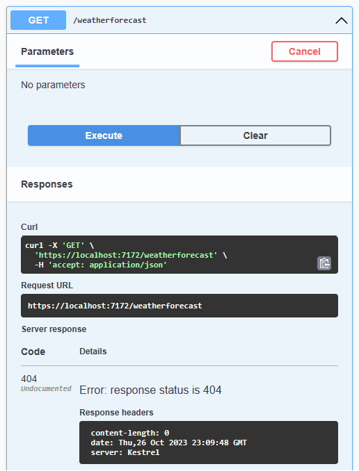
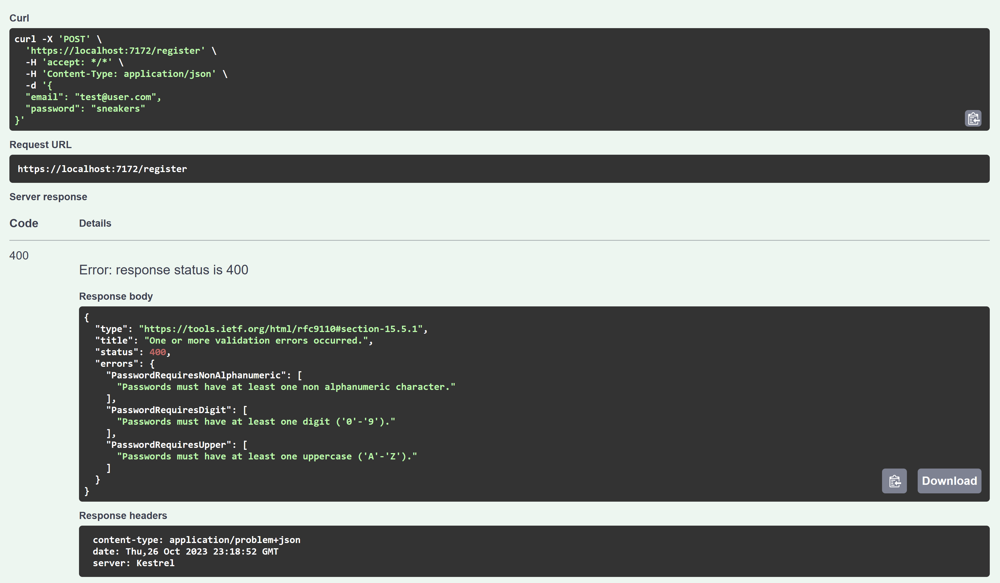
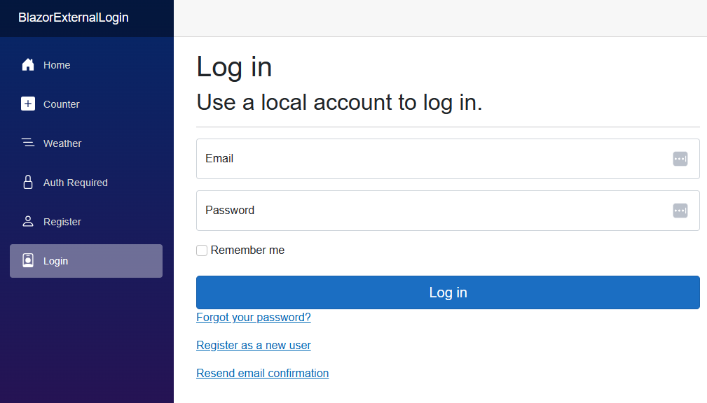
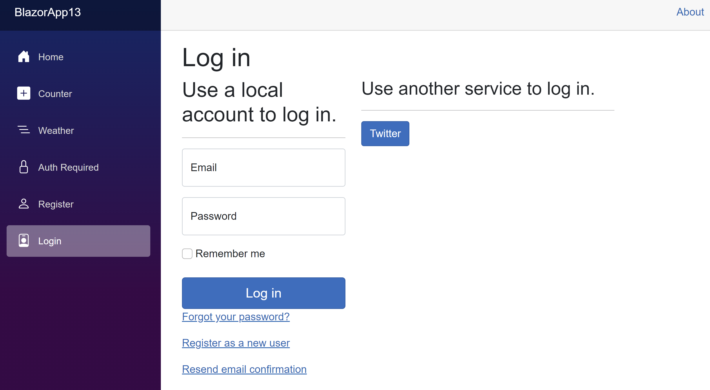

In April 2023, I wrote about the commitment by the ASP.NET Core team to [improve authentication, authorization, and identity management in .NET 8](https://devblogs.microsoft.com/dotnet/improvements-auth-identity-aspnetcore-8/). The plan we presented included three key deliverables:

- New APIs to simplify login and identity management for client apps like Single Page Apps (SPA) and Blazor WebAssembly.
- Enablement of token-based authentication and authorization in ASP.NET Core Identity for clients that can't use cookies.
- Improvements to documentation.

All three deliverables will ship with .NET 8. In addition, we were able to add a new identity UI for Blazor web apps that works with both of the new rendering modes, server and WebAssembly.

Let's look at a few scenarios that are enabled by the new changes in .NET 8. In this blog post we'll cover:

- Securing a [simple web API backend](#basic-web-api-backend)
- Using the new [Blazor identity UI](#the-blazor-identity-ui)
- Adding an [external login](#add-an-external-login) like Google or Facebook
- Securing [Blazor WebAssembly apps](#securing-blazor-webassembly-apps) using built-in features and components
- Using [tokens](#tokens) for clients that can't use cookies

Let's look at the simplest scenario for using the new identity features.

## Basic Web API backend

An easy way to use the new authorization is to enable it in a basic Web API app. The same app may also be used as the backend for Blazor WebAssembly, Angular, React, and other Single Page Web apps (SPA). Assuming you're starting with an ASP.NET Core Web API project in .NET 8 that includes OpenAPI, you can add authentication with a few steps.

Identity is "opt-in," so there are a few packages to add:

- `Microsoft.AspNetCore.Identity.EntityFrameworkCore` - the package that enables EF Core integration
- A package for the database you wish to use, such as `Microsoft.EntityFrameworkCore.SqlServer` (we'll use the in-memory database for this example)

You can add these packages using the NuGet package manager or the command line. For example, to add the packages using the command line, navigate to the project folder and run the following dotnet commands:

```bash
dotnet add package Microsoft.AspNetCore.Identity.EntityFrameworkCore
dotnet add package Microsoft.EntityFrameworkCore.InMemory
```

Identity allows you to customize both the user information and the user database in case you have requirements beyond what is provided in the .NET Core framework. For our basic example, we'll just use the default user information and database. To do that, we'll add a new class to the project called `MyUser` that inherits from `IdentityUser`:

```csharp
class MyUser : IdentityUser {}
```

Add a new class called `AppDbContext` that inherits from `IdentityDbContext<MyUser>`:

```csharp
class AppDbContext(DbContextOptions<AppDbContext> options) : 
        IdentityDbContext<MyUser>(options)
{
}
```

Providing the special constructor makes it possible to configure the database for different environments.

To set up identity for an app, open the `Program.cs` file. Configure identity to use cookie-based authentication and to enable authorization checks by adding the following code after the call to `WebApplication.CreateBuilder(args)`:

```csharp
builder.Services.AddAuthentication(IdentityConstants.ApplicationScheme)
    .AddIdentityCookies();
builder.Services.AddAuthorizationBuilder();
```

Configure the EF Core database. Here we'll use the in-memory database and name it "AppDb." It's usedhere for the demo so it is easy to restart the application and test the flow to register and login (each run will start with a fresh database). Changing to SQLite will save users between sessions but requires the database to be properly created through [migrations](https://learn.microsoft.com/ef/core/managing-schemas/migrations/) as shown in this [EF Core getting started tutorial](https://learn.microsoft.com/ef/core/get-started/overview/first-app). You can use other relational providers such as SQL Server for your production code.

```csharp
builder.Services.AddDbContext<AppDbContext>(
    options => options.UseInMemoryDatabase("AppDb"));
```

Configure identity to use the EF Core database and expose the identity endpoints:

```csharp
builder.Services.AddIdentityCore<MyUser>()
    .AddEntityFrameworkStores<AppDbContext>()
    .AddApiEndpoints();
```

Map the routes for the identity endpoints. This code should be placed after the call to `builder.Build()`:

```csharp
app.MapIdentityApi<MyUser>();
```

The app is now ready for authentication and authorization! To secure an endpoint, use the `.RequireAuthorization()` extension method where you define the auth route. If you are using a controller-based solution, you can add the `[Authorize]` attribute to the controller or action.

To test the app, run it and navigate to the Swagger UI. Expand the secured endpoint, select  **try it out**, and select **execute**. The endpoint is reported as `404 - not found`, which is arguably more secure than reporting a `401 - not authorized` because it doesn't reveal that the endpoint exists.



Now expand `/register` and fill in your credentials. If you enter an invalid email address or a bad password, the result includes the validation errors.



The errors in this example are returned in the [ProblemDetails](https://learn.microsoft.com/aspnet/core/web-api/handle-errors?view=aspnetcore-8.0#validation-failure-error-response) format so your client can easily parse them and display validation errors as needed. I'll show an example of that in the [standalone Blazor WebAssembly app](#securing-blazor-webassembly-apps).

A successful registration results in a `200 - OK` response. You can now expand `/login` and enter the same credentials. Note, there are additional parameters that aren't needed for this example and can be deleted. Be sure to set `useCookies` to `true`. A successful login results in a `200 - OK` response with a cookie in the response header.

Now you can rerun the secured endpoint and it should return a valid result. This is because cookie-based authentication is securely built-in to your browser and "just works." You've just secured your first endpoint with identity!

Some web clients may not include cookies in the header by default. If you are using a tool for testing APIs, you may need to enable cookies in the settings. The JavaScript `fetch` API does not include cookies by default. You can enable them by setting `credentials` to the value `include` in the options. Similarly, an `HttpClient` running in a Blazor WebAssembly app needs the `HttpRequestMessage` to include credentials, like the following:

```csharp
request.SetBrowserRequestCredential(BrowserRequestCredentials.Include);
```

Next, let's jump into a Blazor web app.

## The Blazor identity UI

A stretch goal of our team that we were able to achieve was to implement the identity UI, which includes options to register, log in, and configure multi-factor authentication, in Blazor. The UI is built into the template when you select the "Individual accounts" option for authentication. Unlike the previous version of the identity UI, which was hidden unless you wanted to customize it, the template generates all of the source code so you can modify it as needed. The new version is built with Razor components and works with both server-side and WebAssembly Blazor apps.



The new Blazor web model allows you to configure whether the UI is rendered server-side or from a client running in WebAssembly. When you choose the WebAssembly mode, the server will still handle all authentication and authorization requests. It will also generate the code for a custom implementation of `AuthenticationStateProvider` that tracks the authentication state. The provider uses the [`PersistentComponentState`](https://learn.microsoft.com/aspnet/core/blazor/components/prerender?view=aspnetcore-8.0#persist-prerendered-state) class to pre-render the authentication state and persist it to the page. The `PersistentAuthenticationStateProvider` in the client WebAssembly app uses the component to synchronize the authentication state between the server and browser. The state provider might also be named `PersistingRevalidatingAuthenticationStateProvider` when running with auto interactivity or `IdentityRevalidatingAuthenticationStateProvider` for server interactivity.

Although the examples in this blog post are focused on a simple username and password login scenario, ASP.NET Identity has support for email-based interactions like [account confirmation and password recovery](https://learn.microsoft.com/aspnet/core/security/authentication/accconfirm?view=aspnetcore-8.0). It is also possible to configure [multifactor authentication](https://learn.microsoft.com/aspnet/core/security/authentication/mfa?view=aspnetcore-8.0). The components for all of these features are included in the UI.

## Add an external login

A common question we are asked is how to integrate external logins through social websites with ASP.NET Core Identity. Starting from the Blazor web app default project, you can add an external login with a few steps.

First, you'll need to register your app with the social website. For example, to add a Twitter login, go to the [Twitter developer portal](https://developer.twitter.com/portal/dashboard) and create a new app. You'll need to provide some basic information to obtain your client credentials. After creating your app, navigate to the app settings and click "edit" on authentication. Specify "native app" for the application type for the flow to work correctly and turn on "request email from users." You'll need to provide a callback URL. For this example, we'll use `https://localhost:5001/signin-twitter` which is the default callback URL for the Blazor web app template. You can change this to match your app's URL (i.e. replace `5001` with your own port). Also note the API key and secret.

Next, add the appropriate authentication package to your app. There is a community-maintained list of [OAuth 2.0 social authentication providers for ASP.NET Core](https://github.com/aspnet-contrib/AspNet.Security.OAuth.Providers) with many options to choose from. You can mix multiple external logins as needed. For Twitter, I'll add the `AspNet.Security.OAuth.Twitter` package.

From a command prompt in the root directory of the server project, run this command to store your API Key (client ID) and secret.

```bash
dotnet user-secrets set "Twitter:ApiKey" "<your-api-key>"
dotnet user-secrets set "TWitter:ApiSecret" "<your-api-secret>"
```

Finally, configure the login in `Program.cs` by replacing this code:

```csharp
builder.Services.AddAuthentication(IdentityConstants.ApplicationScheme)
    .AddIdentityCookies();
```

with this code:

```csharp
builder.Services.AddAuthentication(IdentityConstants.ApplicationScheme)
    .AddTwitter(opt =>
        {
            opt.ClientId = builder.Configuration["Twitter:ApiKey"]!;
            opt.ClientSecret = builder.Configuration["Twitter:ApiSecret"]!;
        })
    .AddIdentityCookies();
```

> Cookies are the preferred and most secure approach for implementing ASP.NET Core Identity. Tokens are supported if needed and require the  `IdentityConstants.BearerScheme` to be configured. The tokens are proprietary and the token-based flow is intended for simple scenarios so it does not implement the OAuth 2.0 or OIDC standards.

What's next? Believe it or not, you're done. This time when you run the app, the login page will automatically detect the external login and provide a button to use it.



When you log in and authorize the app, you will be redirected back and authenticated.

## Securing Blazor WebAssembly apps

A major motivation for adding the new identity APIs was to make it easier for developers to secure their browser-based apps including Single Page Apps (SPA) and Blazor WebAssembly. It doesn't matter if you use the built-in identity provider, a custom login or a cloud-based service like [Microsoft Entra](https://www.microsoft.com/security/business/microsoft-entra), the end result is an identity that is either authenticated with claims and roles, or not authenticated. In Blazor, you can secure a razor component by adding the `[Authorize]` attribute to the component or to the page that hosts the component. You can also secure a route by adding the `.RequireAuthorization()` extension method to the route definition.

The full source code for this example is available in the [Blazor samples repo](https://github.com/dotnet/blazor-samples/tree/main/8.0/BlazorWebAssemblyStandaloneWithIdentity).

The `AuthorizeView` tag provides a simple way to handle content the user has access to. The authentication state can be accessed via the `context` property. Consider the following:

```razor
<p>Welcome to my page!</p>
<AuthorizeView>
    <Authorizing>
        <div class="alert alert-info">We're checking your credentials...</div>
    </Authorizing>
    <Authorized>
        <div class="alert alert-success">You are authenticated @context.User.Identity?.Name</div>
    </Authorized>
    <NotAuthorized>
        <div class="alert alert-warning">You are not authenticated!</div>
    </NotAuthorized>
</AuthorizeView>
```

The greeting will be shown to everyone. In the case of Blazor WebAssembly, when the client might need to authenticate asynchronously over API calls, the `Authorizing` content will be shown while the authentication state is queried and resolved. Then, based on whether or not you've authenticated, you'll either see your name or a message that you're not authenticated. How exactly does the client know if you're authenticated? That's where the [`AuthenticationStateProvider`](https://learn.microsoft.com/aspnet/core/blazor/security/?view=aspnetcore-8.0#authenticationstateprovider-service) comes in.

The `App.razor` page is wrapped in a `CascadingAuthenticationState` provider. This provider is responsible for tracking the authentication state and making it available to the rest of the app. The `AuthenticationStateProvider` is injected into the provider and used to track the state. The `AuthenticationStateProvider` is also injected into the `AuthorizeView` component. When the authentication state changes, the provider notifies the `AuthorizeView` component and the content is updated accordingly.

First, we want to make sure that API calls are persisting credentials accordingly. To do that, I created a handler named `CookieHandler`.

```csharp
public class CookieHandler : DelegatingHandler
{
    protected override Task<HttpResponseMessage> SendAsync(
        HttpRequestMessage request, CancellationToken cancellationToken)
    {
        request.SetBrowserRequestCredentials(BrowserRequestCredentials.Include);
        return base.SendAsync(request, cancellationToken);
    }
}
```

In `Program.cs` I added the handler to the `HttpClient` and used the client factory to configure a special client for authentication purposes.

```csharp
builder.Services.AddTransient<CookieHandler>();
builder.Services.AddHttpClient(
    "Auth",
    opt => opt.BaseAddress = new Uri(builder.Configuration["AuthUrl"]!))
    .AddHttpMessageHandler<CookieHandler>();
```

> **Note:** the authentication components are opt-in and available via the `Microsoft.AspNetCore.Components.WebAssembly.Authentication` package. The client factory and extension methods come from `Microsoft.Extensions.Http`.

The `AuthUrl` is the URL of the ASP.NET Core server that exposes the identity APIs. Next, I created a `CookieAuthenticationStateProvider` that inherits from `AuthenticationStateProvider` and overrides the `GetAuthenticationStateAsync` method. The main logic looks like this:

```csharp
var unauthenticated = new ClaimsPrincipal(new ClaimsIdentity());
var userResponse = await _httpClient.GetAsync("manage/info");
if (userResponse.IsSuccessStatusCode) 
{
    var userJson = await userResponse.Content.ReadAsStringAsync();
    var userInfo = JsonSerializer.Deserialize<UserInfo>(userJson, jsonSerializerOptions);
    if (userInfo != null)
    {
        var claims = new List<Claim>
        {
            new(ClaimTypes.Name, userInfo.Email),
            new(ClaimTypes.Email, userInfo.Email)
        };
        var id = new ClaimsIdentity(claims, nameof(CookieAuthenticationStateProvider));
        user = new ClaimsPrincipal(id);
    }
}

return new AuthenticationState(user);
```

The user info endpoint is secure, so if the user is not authenticated the request will fail and the method will return an unauthenticated state. Otherwise, it builds the appropriate identity and claims and returns the authenticated state.

How does the app know when the state has changed? Here is what a login looks like from Blazor WebAssembly using the identity API:

```csharp
async Task<AuthenticationState> LoginAndGetAuthenticationState()
{
    var result = await _httpClient.PostAsJsonAsync(
        "login?useCookies=true", new
        {
            email,
            password
        });

        return await GetAuthenticationStateAsync();
}

NotifyAuthenticationStateChanged(LoginAndGetAuthenticationState());
```

When the login is successful, the `NotifyAuthenticationStateChanged` method on the base `AuthenticationStateProvider` class is called to notify the provider that the state has changed. It is passed the result of the request for a new authentication state so that it can verify the cookie is present. The provider will then update the `AuthorizeView` component and the user will see the authenticated content.

## Tokens

In the rare event your client doesn't support cookies, the login API provides a parameter to request tokens. An custom token (one that is proprietary to the ASP.NET Core identity platform) is issued that can be used to authenticate subsequent requests. The token is passed in the `Authorization` header as a bearer token. A refresh token is also provided. This allows your application to request a new token when the old one expires without forcing the user to log in again. The tokens are not standard JSON Web Tokens (JWT). The decision behind this was intentional, as the built-in identity is meant primarily for simple scenarios. The token option is not intended to be a fully-featured identity service provider or token server, but instead an alternative to the cookie option for clients that can't use cookies.

Not sure whether you need a token server or not? Read a document to help you [choose the right ASP.NET Core identity solution](https://learn.microsoft.com/aspnet/core/security/how-to-choose-identity-solution). Looking for a more advanced identity solution? Read our [list of identity management solutions for ASP.NET Core](https://learn.microsoft.com/aspnet/core/security/identity-management-solutions).

## Docs and samples

The third deliverable is documentation and samples. We have already introduced new documentation and will be adding new articles and samples as we approach the release of .NET 8. Follow [Issue #29452 - documentation and samples for identity in .NET 8](https://github.com/dotnet/AspNetCore.Docs/issues/29452) to track the progress. Please use the issue to communicate additional documentation or samples you are looking for. You can also link to the specific issues for various documents and provide your feedback there.

## Conclusion

The new identity features in .NET 8 make it easier than ever to secure your applications. If your requirements are simple, you can now add authentication and authorization to your app with a few lines of code. The new APIs make it possible to secure your Web API endpoints with cookie-based authentication and authorization. There is also a token-based option for clients that can't use cookies.

Learn more about the new identity features in the [ASP.NET Core documentation](https://learn.microsoft.com/aspnet/core/release-notes/aspnetcore-8.0#authentication-and-authorization).
