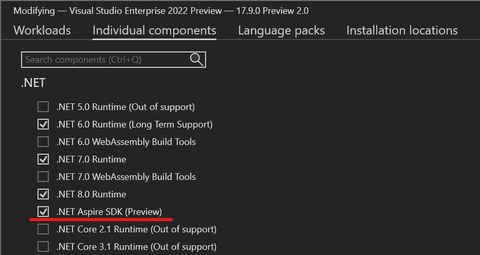
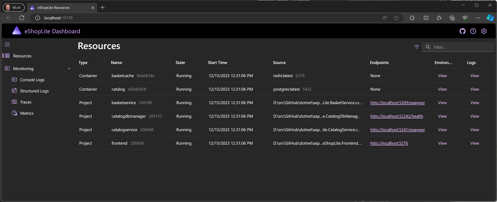
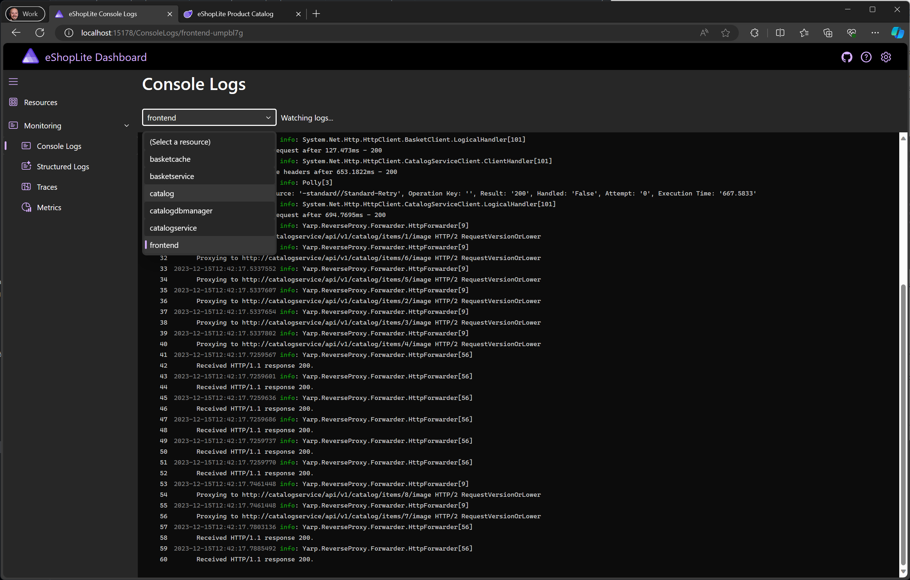
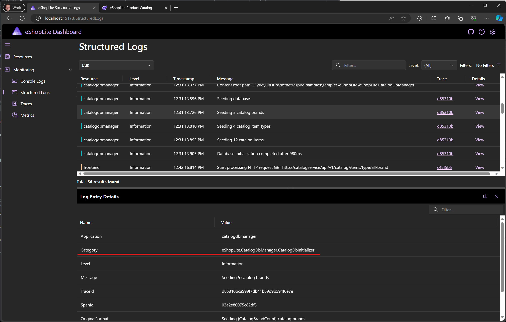
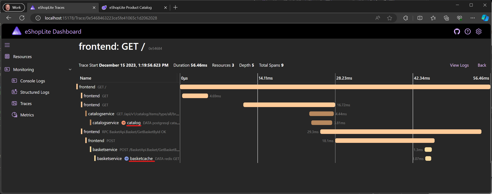
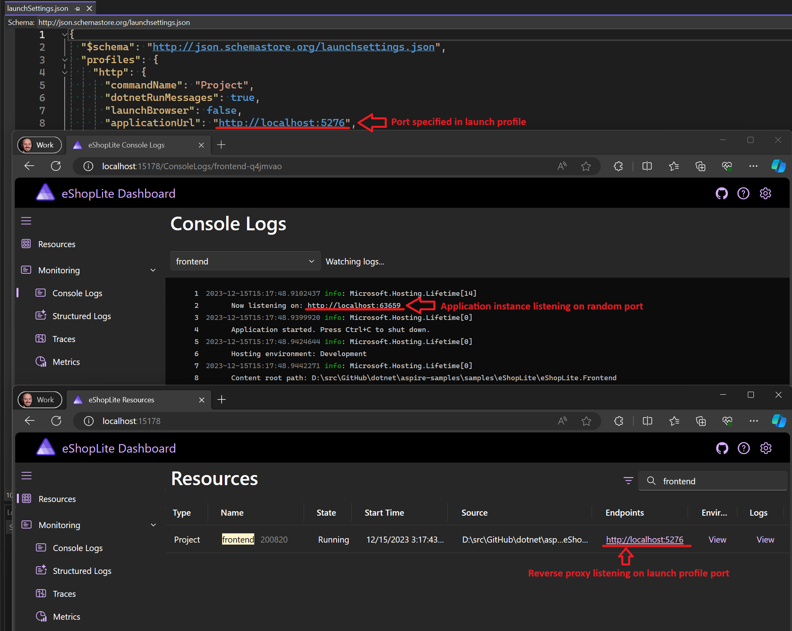
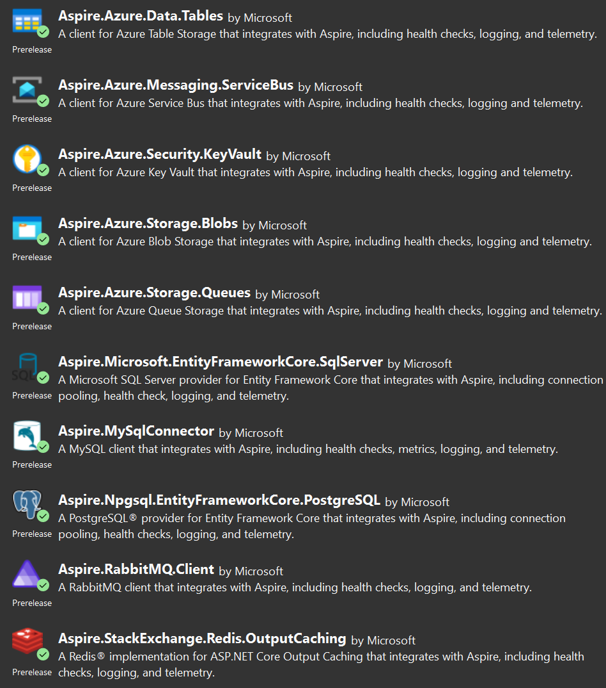
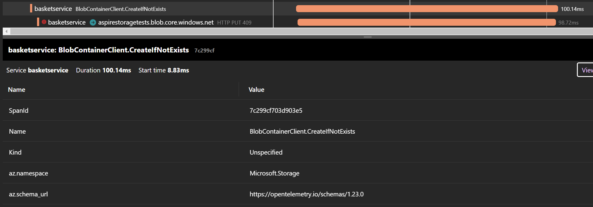

The feedback we've received since our [announcement and launch of .NET Aspire last month](https://devblogs.microsoft.com/dotnet/introducing-dotnet-aspire-simplifying-cloud-native-development-with-dotnet-8/) has been amazing! The engagement on the repo via issues and pull-requests has been inspiring to the team. We are learning a lot about how developers are using -- and want to use -- .NET Aspire or other components in your development of distributed cloud applications. Some awesome contributions from the community have already been made and many are in-progress as well. On behalf of the team, thank you for your excitement and feedback!

.NET Aspire **Preview 2** is now available! Here's a summary of what's new in this preview release:

- [Dashboard](#dashboard-updates)
  - All resource types are now combined into a single "Resources" view
  - New details pane design
  - Console logs for all resource types are now combined into a single "Console Logs" view
  - Log category name added to the Structured Logs view
  - Outgoing requests to other resources and development services are displayed with the resource/service name instead of URL
- [Hosting & orchestration](#hosting--orchestration-updates)
  - Containers now support configuring arguments to be passed to them on start
  - Containers & executables can now reference other resources with endpoints for service discovery configuration
  - Add projects without a `<ProjectReference />`
  - Resources can now reference existing URI endpoints for service discovery configuration
  - Support for adding Node.js apps as resources
  - Projects now use the port from their launch profile when hosted with or without replicas
- [Components](#components-updates)
  - Component packages now have individual icons
  - **NEW**: MySqlConnector component added
  - **NEW**: MongoDB component added
  - Azure SDK components now enable distributed tracing by default (except for Service Bus)
- [Deployment](#deployment-updates)
  - Azure Developer CLI improvements
  - Aspir8: A community-developed tool for deploying .NET Aspire apps to Kubernetes
- [Dapr](#updates-for-dapr-support)
  - IDs for Dapr sidecars no longer needs to be specified
  - First-class support for describing all Dapr components in the app model
  - Azure Developer CLI (AZD) support for deploying .NET Aspire apps that use Dapr to Azure Container Apps (ACA)

## Getting .NET Aspire Preview 2

To install or upgrade to .NET Aspire Preview 2, perform the following steps:

1. If on Windows and using Visual Studio to work with .NET Aspire, install/update to the latest [Visual Studio 2022 Preview](https://aka.ms/vspreview) release (17.9.0 Preview 2.0 at the time of writing)
    - Ensure that the ".NET Aspire SDK (Preview)" component is selected under the "Individual components" tab of the Visual Studio installer:

        **Note you must follow the remaining steps in these instructions to update to Preview 2**
        
1. If on Windows and you have Visual Studio 2022 17.8.x installed but intend to only use .NET Aspire via the .NET CLI (`dotnet`), download and install the [.NET 8.0.100 SDK using the standalone installer](https://dotnet.microsoft.com/download/dotnet/thank-you/sdk-8.0.100-windows-x64-installer)
1. If on macOS or Linux, download and install the [.NET 8.0.100 SDK](https://dotnet.microsoft.com/download/dotnet/8.0)
1. From a terminal, run the following commands to update the .NET Aspire workload:

    ```dotnetcli
    dotnet workload update
    dotnet workload install aspire
    ```

    *Note that if you had the Preview 1 version of the .NET Aspire workload already installed, you may see messages informing you that the workload is already installed. These can be safely ignored.*

1. Refer to the docs for [detailed instructions on installing .NET Aspire](https://learn.microsoft.com/dotnet/aspire/fundamentals/setup-tooling)

After updating you can run `dotnet workload list` to see the updated version (note: your version of Visual Sudio may differ):

```text
Installed Workload Id      Manifest Version                     Installation Source
----------------------------------------------------------------------------------------------

aspire                     8.0.0-preview.2.23619.3/8.0.100      SDK 8.0.100, VS 17.9.34310.174
```

### Updating existing apps

For existing .NET Aspire apps, after performing the above steps to get the latest workload, you'll want to change your package references for any Aspire components. Update **all Aspire package references (hosting and components)** to `8.0.0-preview.2.23619.3`, for example the hosting would change to:

```xml
<PackageReference Include="Aspire.Hosting" Version="8.0.0-preview.2.23619.3" />
```

All other packages being referenced should be updated to the Preview 2 version as well. If using Visual Studio, you can also use NuGet Package Manager and update all packages being used via the IDE (be sure to check the pre-release checkbox in the UI).

### API changes

Additionally we made some hosting API changes in Preview 2. In existing code, API calls such as `builder.AddPostgresContainer(...)` should now be changed to `builder.AddPostgres(...)` to retain the same behavior (there are similar changes for other resource types as well). We wanted to add distinction between the notion of an "abstract" resource type such as a Redis server (e.g. `AddRedis(...)`), and a container which is running Redis (e.g. `AddRedisContainer(...)`). Builders for types such as `RedisContainer` support extension methods such as `WithEnvironment(...)` and `WithVolumeMount(...)` whereas builders for types such as `RedisServer` do not because the expectation is that the deployment tool for the .NET Aspire application will likely use a managed resource type in the target cloud environment which does not support customizations in this way.

Further we have removed the `builder.AddXYZConnection(...)` methods where `XYZ` is the name of a type of resource. These extensions were very thin wrappers over adding an environment variable such as `ConnectionString_myresource`.

## Dashboard updates

We got an incredible response to the dashboard in the initial preview release of .NET Aspire! Folks are really enthusiastic about being able to easily see how .NET Aspire helps to make apps observable by default, along with the status of all the separate resources that make up the distributed system. Based on your feedback, we've made the following changes to the dashboard in Preview 2.

### New combined views for resources and console logs

In preview 1, there were separate pages on the dashboard for viewing the details of the projects, executables, and containers configured as part of a .NET Aspire application. These have been combined into a single "Resources" page in Preview 2, making it much easier to see the status and key details of all your resources in one place. The "Name" column now includes the process ID for projects and executables, and the container ID for containers. The "Source" column details the path for projects and executables, and for containers the image name and tag is displayed, along with the container port if one is exposed.



Console logs got the same treatment, making it easier to select any resource to view the console logs for from a single page:



### Dockable details pane

An new details pane is now used to show more information for relevant items, such as the environment variables for a resource, or the details of a structured log or tracing span. This pane can be docked to the bottom or the side of the current view, making it simpler to switch between the details of the different items shown in the current view.

<video autoplay="" loop="" class="responsive-video" poster="./dashboard-details-pane-thumb.png">
   <source src="./dashboard-details-pane.mp4" type="video/mp4">
</video>

### Log category name added to the Structured Logs view

The category name for a log message is now displayed in the details pane of the Structured Logs view, making it simple to see the source of the message:



### Outgoing requests to known destinations are displayed with the name instead of URL

Outgoing requests to known destinations like other resources and endpoints hosted by Visual Studio to support the development experience (e.g. Browser Link), are now automatically resolved and named appropriately in the Traces view:



## Hosting & orchestration updates

### Configuring container launch arguments

You can now configure arguments to pass to containers configured in your AppHost projects using the `IResourceBuilder<ContainerResource>.WithArgs` method. These arguments will be passed to the container at startup. The following is an example of using this capability taken from the newly added [Database Containers sample](https://github.com/dotnet/aspire-samples/tree/main/samples/DatabaseContainers).

```csharp
var builder = DistributedApplication.CreateBuilder(args);

var addressBookDb = builder.AddSqlServerContainer("sqlserver")
    // Mount the init scripts directory into the container.
    .WithVolumeMount("./sqlserverconfig", "/usr/config", VolumeMountType.Bind)
    // Mount the SQL scripts directory into the container so that the init scripts run.
    .WithVolumeMount("../DatabaseContainers.ApiService/data/sqlserver", "/docker-entrypoint-initdb.d", VolumeMountType.Bind)
    // Run the custom entrypoint script on startup.
    .WithArgs("/usr/config/entrypoint.sh")
    .AddDatabase("AddressBook");
```

### Service discovery between all resource types

It's now possible to configure containers and executables to expose service endpoints using the `WithServiceBinding` method, and then pass them as references to other resources using `WithReference` and have their service endpoints injected as [configuration for service discovery](https://learn.microsoft.com/dotnet/aspire/service-discovery/overview#implicit-service-discovery-by-reference).

```csharp
var builder = DistributedApplication.CreateBuilder(args);

// Add customer API container built by partner team
var customerApi = builder.AddContainer("customerapi", image: "contoso.com/eshop/customers")
    .WithServiceBinding(containerPort: 8080, scheme: "http");

// Configure our storefront web project to reference the customer service API so that it can
// reference the service by name instead of by IP address, e.g. http://customerapi
var storeFront = builder.AddProject<Projects.Contoso_eShop_Storefront>("storefront")
    .WithReference(customerApi);
```

### Add projects based on project file path

There are cases where adding project references from the AppHost project to service projects as [project references](https://learn.microsoft.com/visualstudio/msbuild/common-msbuild-project-items#projectreference) might be undesirable. It's now possible to add projects as resources without a project reference by simply passing the project file path to the `AddProject` method. This can make it easier to integrate projects from outside of the current solution in more complex source layout situations, e.g. when using git submodules to bring in the contents of partner team repos.

```csharp
var builder = DistributedApplication.CreateBuilder(args);

var pathBasedProject = builder.AddProject(
    name: "customerapi",
    // The project will be resolved relative to the AppHost project directory
    projectPath: "../../submodules/customerapi/src/CustomerApi/CustomerApi.csproj");
```

### Reference existing URI endpoints for service discovery configuration

Another pattern for referencing services from outside of the current solution, and even managed by a different team, can be to use an existing instance of the service specially hosted for development purposes. You can now directly reference HTTP-based services and have the consuming resource configured with the required values for service discovery:

```csharp
var builder = DistributedApplication.CreateBuilder(args);

var cache = builder.AddRedis("cache");

builder.AddProject<Projects.AspireApp30_Web>("webfrontend")
    .WithReference(cache)
    // The app can reference this service simply via http://apiservice
    .WithReference("apiservice", new Uri("http://apiservice.v2.dev.contoso.com"));
```

### Support for adding Node.js apps as resources

Support for configuring Node.js-based apps into a .NET Aspire AppHost project is now included. The `AddNodeApp` and `AddNpmApp` methods can be used to easily include Node.js applications in an Aspire AppHost project, e.g. a React-based frontend. Included Node.js apps can participate in service discovery and connection string configuration and will have the dashboard OTLP endpoint URL injected to enable OpenTelemetry. To configure the app to be deployed as a container, call the `AsDockerFileInManifest` method on the returned resource.

The [Aspire with Node.js sample](https://github.com/dotnet/aspire-samples/tree/main/samples/AspireWithNode) has been updated to use this built-in support and demonstrates configuring the Node.js app to egress OpenTelemetry traces to the Aspire dashboard.

```csharp
var builder = DistributedApplication.CreateBuilder(args);

var cache = builder.AddRedisContainer("cache");

var apiservice = builder.AddProject<Projects.ApiService>("apiservice");

builder.AddNodeApp("webapp", "../webapp/app.js")
    .WithReference(apiservice)
    .WithReference(cache)
    // Dynamically assign an http port for the the Node.js app.
    // The port will be set in the 'PORT' environment variable.
    .WithServiceBinding(scheme: "http", env: "PORT")
    .AsDockerfileInManifest();
```

### Projects now consistently use the port specified in their launch profile

When launching an AppHost project, `Aspire.Hosting` launches reverse-proxies in front of all configured services, so that tasks like load-balancing to [configured replicas](https://learn.microsoft.com/dotnet/api/aspire.hosting.projectresourcebuilderextensions.withreplicas) can be performed. The instances of the project applications themselves will be assigned random ports to listen on and the proxies will forward client requests to that port. The proxies will now use the port specified in the project launch profile (i.e. the `"applicationUrl"` property in the *Properties/launchSettings.json* file) as the incoming port when running locally during development. This means the localhost URL you use to access a project should now be consistent during development as it's controlled by the project's launch profile, whether launching the project directly, or launching it via an AppHost project, with or without replicas.



## Components updates

### Component packages now have individual icons

Most of the NuGet packages for Aspire components now have representative icons to make it easier to identify them in the NuGet Package Manager dialog and bring a bit of visual variance to the experience:



### Component and hosting support for MySqlConnector

Thanks to community member [Bradley Grainger](https://github.com/bgrainger), author of the popular [MySqlConnector client library](https://www.nuget.org/packages/MySqlConnector) for MySQL, there is now an Aspire component for MySQL, with support for configuration, DI, tracing, logging, and health checks, enabling observable and resilient access to MySQL databases from your service applications.

```csharp
var builder = WebApplication.CreateBuilder(args);

// Add service defaults & Aspire components.
builder.AddServiceDefaults();
builder.AddMySqlDataSource("catalog");

ar app = builder.Build();

app.MapGet("/catalog", async (MySqlConnection db) =>
{
    const string sql = """
        SELECT Id, Name, Description, Price
        FROM catalog
        """;

    return await db.QueryAsync<CatalogItem>(sql);
});

app.MapDefaultEndpoints();

app.Run();
```

In addition, `Aspire.Hosting` support for MySQL resources has been added, making it easier than ever to spin up a MySQL container for local development, or connect to an existing MySQL instance.

```csharp
var builder = DistributedApplication.CreateBuilder(args);

var catalogDb = builder.AddMySqlContainer("mysql")
    // Mount the SQL scripts directory into the container so that the init scripts run.
    .WithVolumeMount("../DatabaseContainers.ApiService/data/mysql", "/docker-entrypoint-initdb.d", VolumeMountType.Bind)
    .AddDatabase("catalog");
```

### Component and hosting support for MongoDB

Another community contribution, this time by [Ailton Pinto](https://github.com/ailtonguitar), has brought support for MongoDB to Aspire via the new `Aspire.MongoDB.Driver` package. The component uses the [`MongoDB.Driver`](https://www.nuget.org/packages/MongoDB.Driver) client library and, like the MySQL component, supports configuration, DI, tracing, logging, and health checks.

```csharp
var builder = WebApplication.CreateBuilder(args);

// Add service defaults & Aspire components.
builder.AddServiceDefaults();
builder.AddMongoDBClient("mydatabase");

ar app = builder.Build();

app.MapGet("/", async (IMongoClient client) =>
{
    // Use the client here
    ...
});

app.MapDefaultEndpoints();

app.Run();
```

On the hosting side, you can configure a MongoDB container using `AddMongoDBContainer`, or point at an existing instance using `AddMongoDBConnection`.

```csharp
var builder = DistributedApplication.CreateBuilder(args);

var mongodb = builder.AddMongoDBContainer("mongodb")
    .AddDatabase("mydatabase");

var myService = builder.AddProject<Projects.MyService>()
    .WithReference(mongodb);
```

### Azure SDK components now enable distributed tracing by default

The Aspire components for the Azure SDK now have distributed tracing enabled by default (except for the Azure Service Bus component). Using these components to connect to the currently supported Azure services will automatically contribute to your app's distributed tracing output, helping to make it more observable.



## Deployment updates

One of the great features of .NET Aspire is the ability for deployment tools to add support for the distributed application you describe and compose together in an Aspire AppHost project. It's still very early days in this space but we're seeing some exciting work already.

### Aspir8: A community-developed tool for deploying .NET Aspire apps to Kubernetes

We saw lots of feedback from folks interested in support for deploying Aspire apps to Kubernetes. In another fantastic showing of community-driven development, [Aspirate (Aspir8)](https://github.com/prom3theu5/aspirational-manifests) was created by GitHub user [prom3theu5](https://github.com/prom3theu5). This .NET global tool leverages the [Aspire manifest](https://learn.microsoft.com/dotnet/aspire/deployment/manifest-format) to automate deploying Aspire apps to Kubernetes clusters. Be sure to check out the [project README](https://github.com/prom3theu5/aspirational-manifests) for more details, and follow along with the [GitHub issue in the Aspire repo](https://github.com/dotnet/aspire/issues/830).

### Azure Developer CLI (azd) Aspire improvements

The [Azure Developer CLI (azd)](https://learn.microsoft.com/azure/developer/azure-developer-cli/) is an open-source tool that makes it easier to get your applications running in the cloud on Azure. We are working to ensure that `azd` enables the fastest and simplest way to get an Aspire app provisioned and deployed to Azure in minutes. In this release we are still primarily targeting Azure Container Apps.

In this release, we added a few new features to better support Aspire deployments:

- Deploying Dockerfile projects configured with `AsDockerFileInManifest`.
- Deploying Dapr-related components. This is explained more in-detail in the [next section below](#updates-for-dapr-support).
- Preliminary support for `pipeline config` to configure CI/CD deployment variables for Aspire apps.

And a few other notable improvements made:

- Enabled admin user authentication by default for the provisioned Azure Container Registry. This avoids authorization related failures for users that are Classic Administrators in subscriptions not fully migrated to RBAC.
- `docker` tooling is no longer required to be installed when only building and publishing .NET projects using `dotnet publish`.

Get the latest azd release (1.5.1) by [installing or updating your Azure Developer CLI](https://learn.microsoft.com/azure/developer/azure-developer-cli/install-azd).

## Updates for Dapr support

For those wanting to use Aspire together with [Dapr](https://dapr.io/), a number of improvements have been made in Preview 2.

### Dapr application IDs no longer need to be specified

Dapr application IDs will now default to the resource names given to their respective projects. In addition, the resource name given to the Dapr sidecar is now derived from that of its respective project whereas, in Preview 1, the resource name was the application ID itself. This enables the project resource name and application ID to be the same value. You can still explicitly set the application ID to an explicit value, if desired.

```csharp
var builder = DistributedApplication.CreateBuilder(args);

// The Dapr application ID will default to "servicea".
builder.AddProject<Projects.DaprServiceA>("servicea")
       .WithDaprSidecar();

// The Dapr application ID is explicitly set to "serviceb-dapr".
builder.AddProject<Projects.DaprServiceB>("serviceb")
       .WithDaprSidecar("serviceb-dapr");
```

### Dapr components as first-class Aspire resources

.NET Aspire Preview 2 introduces [Dapr components](https://docs.dapr.io/concepts/components-concept/) as first-class resources which allows Aspire to make smarter decisions when running Dapr applications as well as enabling the same of other tools, such as those used for deployment.

In Preview 1, you might configure Dapr resources for sidecars altogether with `DaprSidecarOptions`, where the sidecar will load all components found in the resources directory.

```csharp
var builder = DistributedApplication.CreateBuilder(args);

// Configure service A's sidecar to load components from the resources path.
builder.AddProject<Projects.DaprServiceA>("servicea")
       .WithDaprSidecar(
            new DaprSidecarOptions
            {
                AppId = "service-a",
                ResourcesPaths = ImmutableHashSet<string>.Create("<path to resources directory>")
            });

// Configure service B's sidecar to load components from the resources path.
builder.AddProject<Projects.DaprServiceB>("serviceb")
       .WithDaprSidecar(
            new DaprSidecarOptions
            {
                AppId = "service-b",
                ResourcesPaths = ImmutableHashSet<string>.Create("<path to resources directory>")
            });
```

In Preview 2, you can create individual Dapr component resources and reference them from the projects which actually use them (via `WithReference()`). Aspire will ensure that the sidecars are configured to load their referenced components.

```csharp
var builder = DistributedApplication.CreateBuilder(args);

var stateStore = builder.AddDaprComponent(
    "statestore",
    "state.redis",
    new DaprComponentOptions { LocalPath = "<path to state store YAML file>" });

var pubSub = builder.AddDaprComponent(
    "pubsub",
    "pubsub.redis",
    new DaprComponentOptions { LocalPath = "<path to pub-sub YAML file>" });

builder.AddProject<Projects.DaprServiceA>("servicea")
       .WithDaprSidecar()
       .WithReference(stateStore)
       .WithReference(pubSub);

builder.AddProject<Projects.DaprServiceB>("serviceb")
       .WithDaprSidecar()
       .WithReference(pubSub);
```

For basic components, such as state stores and pub-sub, you need not create or specify a local component YAML path. Instead, the `AddDaprStateStore()` and `AddDaprPubSub()` methods create Dapr component resources of "generic" types, which indicate that Aspire should configure an appropriate component on the Dapr sidecar's behalf when the application is run.

```csharp
var builder = DistributedApplication.CreateBuilder(args);

var stateStore = builder.AddDaprStateStore("statestore");
var pubSub = builder.AddDaprPubSub("pubsub");

builder.AddProject<Projects.DaprServiceA>("servicea")
       .WithDaprSidecar()
       .WithReference(stateStore)
       .WithReference(pubSub);

builder.AddProject<Projects.DaprServiceB>("serviceb")
       .WithDaprSidecar()
       .WithReference(pubSub);
```

In the previous example, if Dapr is fully initialized on the machine, Aspire will configure the sidecars to use Redis components backed by the Dapr default Redis container. If, instead, Dapr was initialized "slim", Aspire will configure the sidecars to use in-memory components. The real benefit to declaring individual Dapr component resources is it enables the tools, both for local development and deployment, to make better decisions about how Dapr is configured.

### Support for deploying Dapr applications to Azure Container Apps (ACA) using Azure Developer CLI (azd)

Preview 2 writes Dapr-specific resources to the application manifest, which enables tools like Azure Developer CLI (azd) to make Dapr-specific decisions during deployment. AZD can now be used to deploy and configure .NET Aspire applications that use Dapr to Azure Container Apps (ACA). Each project with a Dapr sidecar will have Dapr enabled in its corresponding ACA application and its Dapr settings will reflect the following `DaprSidecarOptions` properties (if set):

- `AppId`
- `AppPort`
- `AppProtocol`
- `EnableApiLogging`
- `HttpMaxRequestSize`
- `HttpReadBufferSize`
- `LogLevel`

If your applications declare generic state store and pub-sub Dapr component references, azd will also configure the ACA environment with the Redis add-on and generate and deploy the Dapr component configuration in order to use it from your application. This means that basic Dapr applications can be deployed without any explicit configuration or provisioning of backing stores.

> [!IMPORTANT] If your application declares Dapr component types beyond the generic state store and pub-sub types, those must still be manually configured in the ACA environment.

## Community contributions

Despite only a short amount of time passing since we announced .NET Aspire and published [the repo](https://github.com/dotnet/aspire), we've [seen an incredible level of participation and contribution](https://github.com/dotnet/aspire/pulse/monthly) from the .NET community. From the aforementioned new components and Aspir8 deployment tool in Preview 2, to the [numerous community contributed components still being worked on](https://github.com/dotnet/aspire/pulls?q=is%3Aopen+is%3Apr+label%3Aarea-components+label%3Acommunity-contribution) (look out for Preview 3...), detailed issues, and folks helping each other out in [discussions](https://github.com/dotnet/aspire/discussions), people are taking part in shaping what Aspire will become. We'd like to send a huge "THANK YOU" to everybody who tried out Aspire and took the extra time to contribute.

## What's next?

We plan to release a new Aspire preview every month as we work towards a stable 8.0 release during the second quarter of 2024. Check back on the .NET blog for details of future releases or get involved over on the [Aspire project on GitHub](https://github.com/dotnet/aspire). Official samples are available in the [dotnet/aspire-samples repo](https://github.com/dotnet/aspire-samples).

## Summary

Thanks again for your response to .NET Aspire. We're having a lot of fun working hard to make building distributed applications with .NET a great experience and would love for you to [try out Preview 2](#getting-net-aspire-preview-2) and let us know what you think.
