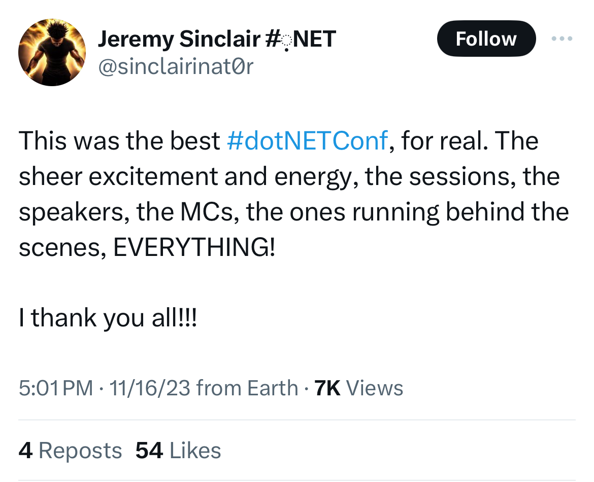
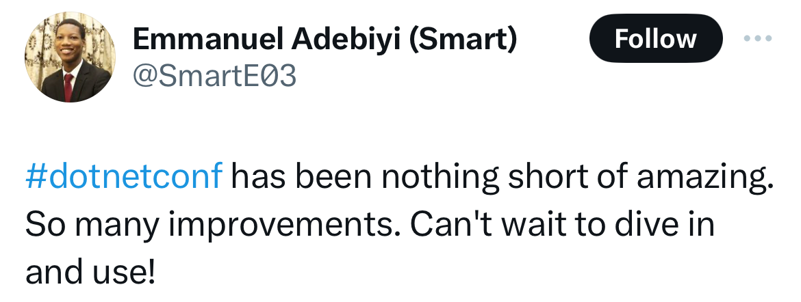
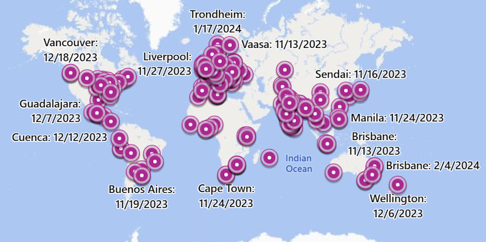

[.NET Conf 2023](https://www.dotnetconf.net) was the largest .NET Conf ever with over 80 sessions from speakers around the globe! We want to give a huge THANK YOU to all who joined us live, asked questions on social media, and participated in our fun and games. This post recaps the exhilarating moments and key takeaways from the event.

## On-Demand Recordings

The conference featured over 80 sessions from various teams and community experts, each brimming with insights on building cross-platform applications with .NET. Explore these sessions at your own pace on the [.NET YouTube](https://aka.ms/dotnetconf-playlist).

<iframe width="752" height="423" src="https://www.youtube.com/embed/videoseries?list=PLdo4fOcmZ0oULyHSPBx-tQzePOYlhvrAU" title=".NET Conf 2023" frameborder="0" allow="accelerometer; autoplay; clipboard-write; encrypted-media; gyroscope; picture-in-picture; web-share" allowfullscreen></iframe>

Here are our top 5 viewed sessions for .NET Conf 2023:

### Top 5 Sessions You Can't Miss

- **Keynote - Welcome to .NET 8:** We had a lot of fun with this one! We changed things up this year and filmed most of this in Microsoft Building 16. If you watch close, you might spot a few cameo appearances in the background...
<iframe width="752" height="423" src="https://www.youtube.com/embed/mna5fg7QGz8?si=HlBZ3n85zZM7uO7N" title="YouTube video player" frameborder="0" allow="accelerometer; autoplay; clipboard-write; encrypted-media; gyroscope; picture-in-picture; web-share" allowfullscreen></iframe>

- **Clean Architecture with ASP.NET Core 8:** Steve Smith gives a great overview of how Clean Architecture organizes your ASP.NET Core app code in a way that limits dependencies on infrastructure concerns, showing how it results in more maintainable, testable code. 
<iframe width="752" height="423" src="https://www.youtube.com/embed/yF9SwL0p0Y0?si=YKYqj9kK6bd27PaT" title="YouTube video player" frameborder="0" allow="accelerometer; autoplay; clipboard-write; encrypted-media; gyroscope; picture-in-picture; web-share" allowfullscreen></iframe>

- **What's New in C# 12:** Dustin Campbell and Mads Torgersen shows off the new features in C# 12, including collection expressions and primary constructors.
<iframe width="752" height="423" src="https://www.youtube.com/embed/by-GL-SjHdc?si=DoEbSxqqGlJHkoVT" title="YouTube video player" frameborder="0" allow="accelerometer; autoplay; clipboard-write; encrypted-media; gyroscope; picture-in-picture; web-share" allowfullscreen></iframe>

- **What's new with WinForms:** Merrie McGaw demonstrates the improvement to both the WinForms runtime and Visual Studio WinForms designer in the past few releases.
<iframe width="752" height="423" src="https://www.youtube.com/embed/N1weyWS_pL0?si=_hH2CWA78Z9Cgmmm" title="YouTube video player" frameborder="0" allow="accelerometer; autoplay; clipboard-write; encrypted-media; gyroscope; picture-in-picture; web-share" allowfullscreen></iframe>

- **Full stack web UI with Blazor in .NET 8:** Dan Roth and Steve Sanderson show off the exciting new updates to Blazor in .NET 8, including server-side rendering, streaming rendering, enhanced navigation, and form handling.
<iframe width="752" height="423" src="https://www.youtube.com/embed/YwZdtLEtROA?si=j_BaWpeZlm3Jy7Kp" title="YouTube video player" frameborder="0" allow="accelerometer; autoplay; clipboard-write; encrypted-media; gyroscope; picture-in-picture; web-share" allowfullscreen></iframe>

What were your favorite sessions? Leave them in the comments below!

## Explore Slides & Demo Code

Access the PowerPoint slide decks, source code, and more from our amazing speakers on the official [.NET Conf 2023 GitHub page](https://aka.ms/dotnetconf-slides). Plus, grab your [digital swag](https://github.com/dotnet-presentations/dotNETConf/tree/main/2023/DigitalSWAG)!

## eShop App

We are thrilled to unveil the new eShop app, a reference application showcasing the latest in [.NET 8](https://aka.ms/get-dotnet-8), [.NET Aspire](https://aka.ms/aspireannouncement), [ASP.NET Core](https://dotnet.microsoft.com/apps/aspnet), [Blazor](https://dotnet.microsoft.com/apps/aspnet/web-apps/blazor), [.NET MAUI](https://docs.microsoft.com/dotnet/maui/what-is-maui), [Azure Container Apps](https://azure.microsoft.com/services/container-apps/#overview), and more from the .NET Conf 2023 keynote!

Grab the [source code on GitHub](https://github.com/dotnet/eshop) and start exploring locally on your machine, or fork the repo and deploy to Azure with GitHub actions in a few easy steps.

## Customer Stories

.NET Conf 2023 also highlighted how businesses and organizations leverage .NET for innovative solutions:

- **[Vestas Wind Systems](https://aka.ms/dotnet-vestas-video):** Using .NET to run high-performance, cloud-native architectures for their sustainable energy solutions.
- **[NBC Sports Next](https://aka.ms/dotnet-nbcsports-video):** Their journey with .NET MAUI for mobile development, enhancing team management applications for coaches, parents, and players.

These stories showcase .NET's versatility and power in real-world scenarios, driving forward business innovation and efficiency.

## Local .NET Conf Events

The learning journey continues with community-run events. Join us in celebrating .NET around the globe! [Find an event near you](https://dotnetconf.net/local-events).

### Feedback

If you participated in .NET Conf 2023, please [give us your feedback](https://forms.office.com/r/unR5tUbpfp) about the event so we can improve in 2024.

Thanks again to everyone that made .NET Conf 2023 possible and we can't wait for even more .NET Conf events in 2024!

### Join the Conversation

Share your thoughts and favorite moments from .NET Conf 2023 in the comments below or on social media using #dotNETConf2023. Let's keep the conversation going!

