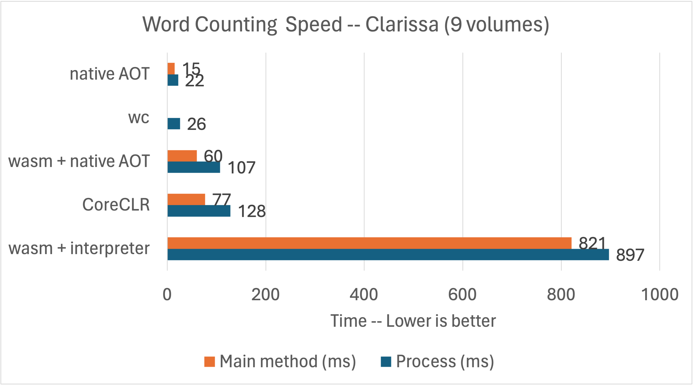
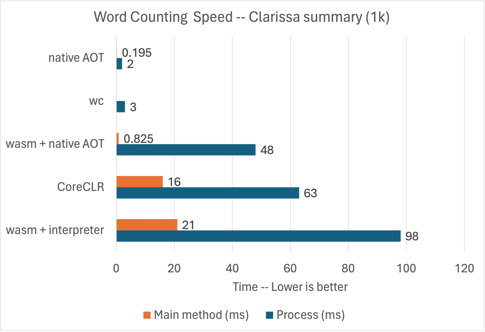

[WebAssembly (Wasm)](https://webassembly.org/) is an exciting new(ish) virtual machine and (assembly) instruction format. Wasm was born in the browser and is an important part of the [Blazor](https://learn.microsoft.com/aspnet/core/blazor/hosting-models#blazor-webassembly) project. The second act for Wasm is cloud computing, for apps and functions. WebAssembly System Interface (WASI) is the new enabler, providing a way for WebAssembly code to call and implement arbitrary APIs, safely and across languages. It is now possible to create WASI apps with .NET using the `wasi-experimental` workload in .NET 8. We're exploring these new technologies and running .NET apps in this environment .... really, anywhere.

This post will help you understand the broadening use of Wasm and describe what's already possible with .NET. They say that history doesn't repeat itself, but that it rhymes. We're back for another round of "write once, run anywhere". WASI apps are portable binaries that run on any hardware or operating system and are not specific to any programming language. This time, it feels different. It's not just vendor neural; it's everything neutral.

## Wasm and WASI

Wasm may be offering us a reboot of compute in the cloud, with the promise of a single cloud-native binary, higher density, and cheaper multi-tenancy. It also opens up the possibility of edge compute for the same reasons. In fact, [CloudFlare](https://developers.cloudflare.com/workers/runtime-apis/webassembly/) and [Fastly](https://docs.fastly.com/products/compute) already host public compute at the edge with Wasm.

Wasm is different than running an app in a Linux container, which is a (good and clever) re-packaging of existing standards and code. Wasm is more like running an app in an environment with no operating system, with just assembly code, memory, and standardized (and gated) access to the outside world (via WASI).

The [Hyperlight presentation at Build 2023](https://www.youtube.com/watch?v=Tz2SOjKZwVA) (4m video) provides insight into what a Wasm-enabled cloud might look like. It demonstrates a Blazor app running in a new lighweight and secure hypervisor. Hyperlight sparks the imagination on new hosting paradigms.

[WebAssembly System Interface (WASI)](https://github.com/WebAssembly/wasi), [WebAssembly Interface Types (WIT)](https://github.com/WebAssembly/component-model/blob/main/design/mvp/WIT.md), and [WebAssembly Component Model](https://github.com/WebAssembly/component-model) are the key specs in this latest round of Wasm innovation. They are very much still in the design phase and [undergoing significant change](https://github.com/WebAssembly/WASI/blob/33de9e568c35424765e7b10952b181f01a724fca/README.md#important-note-wasi-is-in-transition). This post (and the .NET 8 implementation) is oriented around WASI Preview 1. We expect the .NET 9 implementation to use WASI Preview 2.

WIT and [wit-bindgen](https://github.com/bytecodealliance/wit-bindgen) enable components written in any source language to communicate and with the host system. [Implementation of WIT support for C#](https://github.com/bytecodealliance/wit-bindgen/issues/713) is lead by [@silesmo](https://github.com/silesmo). Wasm and WIT together define the [Application Binary Interface (ABI)](https://en.wikipedia.org/wiki/Application_binary_interface).

We expect WASI to become a standard set of WIT types that provide access to [low-level functionality](https://github.com/WebAssembly/WASI/blob/main/Proposals.md) (like [getting the time](https://github.com/WebAssembly/wasi-clocks/blob/97fa4efa19c9549b9ada91435cf27eee808d8ab6/wit/wall-clock.wit#L35) and [reading a file](https://github.com/WebAssembly/wasi-filesystem/blob/3a05fcf9a6e10019c4f1fce42184926d8e541c2d/wit/types.wit#L315-L325)). These low-level types effectively form a "Wasm standard library" across programming languages and operating systems. We're never had standard and shared functionality that Rust devs and .NET devs, for example, could both use. There isn't any widely-deployed historical precedent of native code that exposed APIs with [OO](https://en.wikipedia.org/wiki/Object-oriented_programming)-ish shape (like interfaces) that could be used across programming languages and operating systems.

The standard WIT types start with `wasi-` and define the "platform". You can think of them in a similar way to the `System` namespace in .NET (matching the 'S' in WASI). Continuing the analogy, you can create your own .NET namespaces beyond the `System` ones, and the same is true with WIT.

These posts do a great job of framing WASI in more detail.

- [Standardizing WASI: A system interface to run WebAssembly outside the web](https://hacks.mozilla.org/2019/03/standardizing-wasi-a-webassembly-system-interface/)
- [Announcing the Bytecode Alliance: Building a secure by default, composable future for WebAssembly](https://bytecodealliance.org/articles/announcing-the-bytecode-alliance)
- [WebAssembly: An Updated Roadmap for Developers](https://bytecodealliance.org/articles/webassembly-the-updated-roadmap-for-developers)

The promise on the horizon is being able to take an existing .NET app or library and compile it to a Wasm target. Our design instinct is to implement WIT interfaces relatively high into the .NET stack (like create an ADO.NET Data Provider for [`wasi-sql`](https://github.com/WebAssembly/wasi-sql)), which would enable existing code (including many existing NuGet packages) to just work, particularly for code without native dependencies.

Wasm apps are run in a Wasm runtime, like [`wasmtime`](https://github.com/bytecodealliance/wasmtime). Much like Docker, you can configure that runtime with specific capabilities. For example, if you want Wasm code to have access to a key/value store, you can [expose a key/value interface to it](https://github.com/SteveSandersonMS/spiderlightning-dotnet/blob/main/sample/ConsoleApp/slightfile.toml), which could be backed by a local database or a cloud service.

Wasm runtimes are intended to be embeddable within apps. In fact, there is a `wasmtime` package for [hosting Wasm in .NET apps](https://github.com/bytecodealliance/wasmtime-dotnet). .NET code can run as Wasm, but .NET apps can host `wasmtime`?!? Yes, this space can start to seem circular. While these scenarios seem circular, they [might end up being pretty useful](https://www.youtube.com/watch?v=5u1UaqkPZbg), vaguely similar to how [AppDomains](https://learn.microsoft.com/dotnet/framework/app-domains/application-domains) have been used. It's also reminiscent of all the "docker in docker" scenarios.

We expect a lot more innovation, more Wasm runtimes, and more industry participants. In fact, Wasm has gradulated to a [W3C spec](https://www.w3.org/TR/wasm-core-1/). The W3C is a perfect home for Wasm, to let it grow as a broad industry spec, just like HTML and XML before it.

## `wasi-experimental` workload

.NET 8 includes a new workload called `wasi-experimental`. It builds on top of the Wasm functionality used by Blazor, extending it to run in `wasmtime` and invoke WASI interfaces. It is far from done, but already enables useful functionality.

Let's move on from theory to demonstrating the new capabilities.

After installing the [.NET 8 SDK](https://dotnet.microsoft.com/download/dotnet/8.0), you can install the `wasi-experimental` workload.

```bash
dotnet workload install wasi-experimental
```

Note: This command may require admin permisions, for example with  `sudo` on Linux and macOS.

You also need to install [`wasmtime`](https://github.com/bytecodealliance/wasmtime/tree/main#installation) to run the Wasm code you are soon going to produce.

Try a simple example with the `wasi-console` template.

```bash
$ dotnet new wasiconsole -o wasiconsole
$ cd wasiconsole
$ cat Program.cs 
using System;

Console.WriteLine("Hello, WASI Console!");
$ dotnet run
WasmAppHost --runtime-config /Users/rich/wasiconsole/bin/Debug/net8.0/wasi-wasm/AppBundle/wasiconsole.runtimeconfig.json
Running: wasmtime run --dir . -- dotnet.wasm wasiconsole
Using working directory: /Users/rich/wasiconsole/bin/Debug/net8.0/wasi-wasm/AppBundle
Hello, WASI Console!
```

The app was run using `wasmtime`. There is no x64 or Arm64 here, just Wasm. 

`dotnet run` is providing extra information (in the console output) to help explain what is going on. That will likely change in future. All of the interaction with the host system is managed by `wasmtime`.

We can look a bit deeper at the `AppBundle` directory.

```bash
$ ls -l bin/Release/net8.0/wasi-wasm/AppBundle
total 24872
-rwxr--r--  1 rich  staff  11191074 Oct 31 07:53 dotnet.wasm
-rwxr--r--  1 rich  staff   1526128 Oct 11 14:00 icudt.dat
drwxr-xr-x  6 rich  staff       192 Nov 19 19:35 managed
-rwxr-xr-x  1 rich  staff        48 Nov 19 19:35 run-wasmtime.sh
-rw-r--r--  1 rich  staff       915 Nov 19 19:35 runtimeconfig.bin
drwxr-xr-x  2 rich  staff        64 Nov 19 19:35 tmp
-rw-r--r--  1 rich  staff      1457 Nov 19 19:35 wasiconsole.runtimeconfig.json
$ ls -l bin/Release/net8.0/wasi-wasm/AppBundle/managed 
total 3432
-rw-r--r--  1 rich  staff    27136 Nov 19 19:35 System.Console.dll
-rw-r--r--  1 rich  staff  1711616 Nov 19 19:35 System.Private.CoreLib.dll
-rw-r--r--  1 rich  staff     5632 Nov 19 19:35 System.Runtime.dll
-rw-r--r--  1 rich  staff     5120 Nov 19 19:35 wasiconsole.dll
```

The SDK published the app into a self-contained deployment.  The .NET runtime -- `dotnet.wasm` -- has already been compiled to Wasm (on our build machines). The app and `dotnet.wasm` are loaded together in `wasmtime`, which runs all the code. The actual managed code of the app -- in the `managed` directory -- is interpreted at runtime, just like with Blazor WebAssembly. [@yowl](https://github.com/yowl) and [@SingleAccretion](https://github.com/SingleAccretion) community members have been experimenting with [Wasm and native AOT](https://github.com/dotnet/runtimelab/tree/feature/NativeAOT-LLVM).

You might be wondering why we need all these files to be separate, when the obviously better option is to have one `wasiconsole.wasm` file. We can do that, too, but it is covered a little later in the post, since we need to install a bit more software on the machine (that doesn't currently come with the `wasi-experimental` workload).

## What does `RuntimeInformation` tell us?

`RuntimeInformation` is one of my favorite types. It gives us a better sense of the target environment.

We can change the sample a tiny bit to show some more useful information.

```csharp
using System;
using System.Runtime.InteropServices;

Console.WriteLine($"Hello {RuntimeInformation.OSDescription}:{RuntimeInformation.OSArchitecture}");
Console.WriteLine($"With love from {RuntimeInformation.FrameworkDescription}");
```

It produces this output.

```bash
Hello WASI:Wasm
With love from .NET 8.0.0
```

The first line is interesting. The operating system is `WASI` and the architecture is `Wasm`. That makes sense, with a little more context. There is a mention earlier in the post that Wasm can be thought as "no operating system", however, we cannot simply call it `Wasm` since the existing browser and WASI environments are quite different. As a result, the only coherent name for this environment is `WASI`, while `Wasm` is unambigiously the "chip architecture".

`Wasm` is a 32-bit compute environment, which means that 2^32 bytes are addressable. However, a Wasm runtime can be configured to use [`memory64`](https://github.com/WebAssembly/memory64), enabling access to >4GB of memory. We don't have support for that yet.

## Accessing the host file system

Wasmtime (and other Wasm runtimes) provide the option to map a host directory to a guest directory. This is similar to volume mounting with Docker from a user standpoint, however, the implementation details are different.

Let's look at a simple app that depends of directory mounting. It [converts markdown to HTML](https://github.com/richlander/wasm-samples/blob/main/tomarkup/README.md) using the [Markdig](https://www.nuget.org/packages/Markdig) package. It's fair to say that Markdig wasn't written to run as Wasm. Markdig is happy as long as a cozy managed environment can be created for it and that's what we've done.

Let's try on a Mac M1 (Arm64) machine.

```bash
$ pwd
/Users/rich/git/wasm-samples/tomarkup
$ dotnet publish
$ cd bin/Release/net8.0/wasi-wasm/AppBundle 
$ cat run-wasmtime.sh
wasmtime run --dir . dotnet.wasm tomarkup $*
$ ./run-wasmtime.sh 
A valid inputfile must be provided.
$  wasmtime run --dir . --mapdir /markdown::/Users/rich/markdown --mapdir /tmp::/Users/rich dotnet.wasm tomarkup $* /markdown/README.md /tmp/README.html
$ ls ~/*.html
/Users/rich/README.html
$ cat ~/markdown/README.md | head -n 3  
# .NET Runtime

[](https://dev.azure.com/dnceng-public/public/_build/latest?definitionId=129&branchName=main)
$ cat ~/README.html | head -n 3       
<h1>.NET Runtime</h1>
<p><a href="https://dev.azure.com/dnceng-public/public/_build/latest?definitionId=129&amp;branchName=main"></a>
<a href="https://github.com/dotnet/runtime/labels/help%20wanted"></a>
```

`--mapdir` is mounting the directories, from host to guest.

As you can see, a [markdown file](https://github.com/dotnet/runtime/blob/main/README.md) has been converted to HTML. The first three lines of each file have been shown for brevity.

The CLI gestures required for directory mounting are currently a bit inconvenient. That's something we'll need to look at in a future release. It's a really a question of how `dotnet run` and `wasmtime run` should relate.

## But can it word count?

I recently published [The Convenience of System.IO](https://devblogs.microsoft.com/dotnet/the-convenience-of-system-io/), which focused on word counting. Can we get the same code to run as Wasm and see how fast it runs?

The word counting benchmarks in that post were run on Linux x64. Let's keep that the same, but run as Wasm this time.

```bash
$ pwd
/Users/rich/git/convenience/wordcount/count
$ grep asm count.csproj 
    <RuntimeIdentifier>wasi-wasm</RuntimeIdentifier>
    <WasmSingleFileBundle>true</WasmSingleFileBundle>
$ dotnet publish
$ cd bin/Release/net8.0/wasi-wasm/AppBundle/
$ WASMTIME_NEW_CLI=0 wasmtime run --mapdir /text::/home/rich/git/convenience/wordcount count.wasm $* /text/Clarissa_Harlowe
    11716  110023  610515 /text/Clarissa_Harlowe/clarissa_volume1.txt
    12124  110407  610557 /text/Clarissa_Harlowe/clarissa_volume2.txt
    11961  109622  606948 /text/Clarissa_Harlowe/clarissa_volume3.txt
    12168  111908  625888 /text/Clarissa_Harlowe/clarissa_volume4.txt
    12626  108593  614062 /text/Clarissa_Harlowe/clarissa_volume5.txt
    12434  107576  607619 /text/Clarissa_Harlowe/clarissa_volume6.txt
    12818  112713  628322 /text/Clarissa_Harlowe/clarissa_volume7.txt
    12331  109785  611792 /text/Clarissa_Harlowe/clarissa_volume8.txt
    11771  104934  598265 /text/Clarissa_Harlowe/clarissa_volume9.txt
        9     153    1044 /text/Clarissa_Harlowe/summary.md
   109958  985714  5515012 total
```

I updated the [project file](https://github.com/richlander/convenience/blob/main/wordcount/count/count.csproj) to include `<RuntimeIdentifier>wasi-wasm</RuntimeIdentifier>` and `<WasmSingleFileBundle>true</WasmSingleFileBundle>` and commented out the `PublishAot` related properties. I also added a [`runtimeconfig.template.json`](https://github.com/dotnet/runtime/issues/95345) file.     No changes were made to the app code.

We now have the whole app in a single file bundle.

```bash
$ ls -l bin/Release/net8.0/wasi-wasm/AppBundle/
total 6684
-rw-r--r-- 1 rich rich    1397 Nov 19 19:59 count.runtimeconfig.json
-rwxr-xr-x 1 rich rich 6827282 Nov 19 19:59 count.wasm
-rw-r--r-- 1 rich rich     915 Nov 19 19:59 runtimeconfig.bin
-rwxr-xr-x 1 rich rich      27 Nov 19 19:59 run-wasmtime.sh
drwxr-xr-x 2 rich rich    4096 Nov 19 19:59 tmp
```

That looks better. The app is just shy of 7MB. I had to install the [WASI-SDK](https://github.com/WebAssembly/wasi-sdk/releases/tag/wasi-sdk-20) to use the `WasmSingleFileBundle` property and set an environment variable to enable `dotnet publish` to find the required tools.

```bash
$ echo $WASI_SDK_PATH
/home/rich/wasi-sdk/wasi-sdk-20.0/
```

There was a recent breaking change in wasmtime. I chose to use [WASMTIME_NEW_CLI=0](https://github.com/bytecodealliance/wasmtime/issues/7384) to get back to the old behavior for running the sample.

Let's get back to performance. First, run as wasm (executing managed code via an interpreter):

```bash
$ time WASMTIME_NEW_CLI=0 wasmtime run --mapdir /text::/home/rich/git/convenience/wordcount count.wasm $* /text/Clarissa_Harlowe
    11716  110023  610515 /text/Clarissa_Harlowe/clarissa_volume1.txt
    12124  110407  610557 /text/Clarissa_Harlowe/clarissa_volume2.txt
    11961  109622  606948 /text/Clarissa_Harlowe/clarissa_volume3.txt
    12168  111908  625888 /text/Clarissa_Harlowe/clarissa_volume4.txt
    12626  108593  614062 /text/Clarissa_Harlowe/clarissa_volume5.txt
    12434  107576  607619 /text/Clarissa_Harlowe/clarissa_volume6.txt
    12818  112713  628322 /text/Clarissa_Harlowe/clarissa_volume7.txt
    12331  109785  611792 /text/Clarissa_Harlowe/clarissa_volume8.txt
    11771  104934  598265 /text/Clarissa_Harlowe/clarissa_volume9.txt
        9     153    1044 /text/Clarissa_Harlowe/summary.md
   109958  985714  5515012 total
Elapsed time (ms): 821
Elapsed time (us): 821223.8

real	0m0.897s
user	0m0.846s
sys	0m0.030s
```

Now with our (even more) [experimental native AOT support](https://github.com/dotnet/runtimelab/tree/feature/NativeAOT-LLVM) for Wasm.

```bash
$ time WASMTIME_NEW_CLI=0 wasmtime run --mapdir /text::/home/rich/git/convenience/wordcount count.wasm $* /text/Clarissa_Harlowe
    11716  110023  610515 /text/Clarissa_Harlowe/clarissa_volume1.txt
    12124  110407  610557 /text/Clarissa_Harlowe/clarissa_volume2.txt
    11961  109622  606948 /text/Clarissa_Harlowe/clarissa_volume3.txt
    12168  111908  625888 /text/Clarissa_Harlowe/clarissa_volume4.txt
    12626  108593  614062 /text/Clarissa_Harlowe/clarissa_volume5.txt
    12434  107576  607619 /text/Clarissa_Harlowe/clarissa_volume6.txt
    12818  112713  628322 /text/Clarissa_Harlowe/clarissa_volume7.txt
    12331  109785  611792 /text/Clarissa_Harlowe/clarissa_volume8.txt
    11771  104934  598265 /text/Clarissa_Harlowe/clarissa_volume9.txt
        9     153    1044 /text/Clarissa_Harlowe/summary.md
   109958  985714  5515012 total
Elapsed time (ms): 60
Elapsed time (us): 60322.2

real	0m0.107s
user	0m0.064s
sys	0m0.045s
```

Now, run with CoreCLR on Linux x64:

```bash
$ time ./app/count ../Clarissa_Harlowe/
    11716  110023  610515 ../Clarissa_Harlowe/clarissa_volume1.txt
    12124  110407  610557 ../Clarissa_Harlowe/clarissa_volume2.txt
    11961  109622  606948 ../Clarissa_Harlowe/clarissa_volume3.txt
    12168  111908  625888 ../Clarissa_Harlowe/clarissa_volume4.txt
    12626  108593  614062 ../Clarissa_Harlowe/clarissa_volume5.txt
    12434  107576  607619 ../Clarissa_Harlowe/clarissa_volume6.txt
    12818  112713  628322 ../Clarissa_Harlowe/clarissa_volume7.txt
    12331  109785  611792 ../Clarissa_Harlowe/clarissa_volume8.txt
    11771  104934  598265 ../Clarissa_Harlowe/clarissa_volume9.txt
        9     153    1044 ../Clarissa_Harlowe/summary.md
   109958  985714  5515012 total
Elapsed time (ms): 77
Elapsed time (us): 77252.9

real	0m0.128s
user	0m0.096s
sys	0m0.014s
```

Those are interesting results. We've got interpretation, AOT, and JIT code generation approaches to compare. The Wasm intepreter is able to count (just shy of) one million words in just under one second while AOT-compiled Wasm and the JIT runtime can do the same around 100 milliseconds.



Note: `Main method` is the time to run `main`, as measured by `StopWatch`. `Process` is the complete process duration, as measured by `time`.

This chart shows all of the results in context, including those in the [The convenience of System.IO](https://devblogs.microsoft.com/dotnet/the-convenience-of-system-io/#performance-parity-with-wc) post.

`wasmtime` JIT compiles the Wasm code to the target environment (in this case to Linux+x64). It's possible to AOT the Wasm code, using [`wamr`](https://bytecodealliance.github.io/wamr.dev/blog/introduction-to-wamr-running-modes/), for example. I'll leave that for another post.

## Light-weight functions

Hmmm ... But if we were using the Wasm more like a typical function than an app, we might not be counting a million words, but doing something more light-weight. Let's re-run the comparison, but with the smallest file instead.

With Wasm, using our interpreter:

```bash
$ time WASMTIME_NEW_CLI=0 wasmtime run --mapdir /text::/home/rich/git/convenience/wordcount count.wasm $* /text/Clarissa_Harlowe/summary.md
        9     153    1044 /text/Clarissa_Harlowe/summary.md
Elapsed time (ms): 21
Elapsed time (us): 21020.8

real	0m0.098s
user	0m0.083s
sys	0m0.014s
```

With Wasm and native AOT:

```bash
$ time WASMTIME_NEW_CLI=0 wasmtime run --mapdir /text::/home/rich/git/convenience/wordcount count.wasm $* /text/Clarissa_Harlowe/summary.md
        9     153    1044 /text/Clarissa_Harlowe/summary.md
Elapsed time (ms): 0
Elapsed time (us): 825.3

real	0m0.048s
user	0m0.035s
sys	0m0.014s
```

Again, with CoreCLR:

```bash
$ time ./app/count ../Clarissa_Harlowe/summary.md 
        9     153    1044 ../Clarissa_Harlowe/summary.md
Elapsed time (ms): 16
Elapsed time (us): 16100

real	0m0.063s
user	0m0.027s
sys	0m0.019s
```



This chart shows all of the results in context, this time for the smaller document.

Interesting. For a smaller workload, the performance differences between some of these options starts to close. We can also see the differences in runtime startup costs. It's too early to say, but these dynamics may be a key consideration for this technology. An important caveat is that word counting is just one scenario and other scenarios may have quite different results. For now, this sample is providing a sufficient taste of what to expect.

This is all still early days. As we get farther, we'll want to test more interesting scenarios to developer a more representative understanding. I'm also sure that some of these performance numbers will improve.

## A `slight` improvement in functionality

The promise of WASI is being able to rely on a set of interfaces (and matching implementations) with rich functionality. [SpiderLighting](https://github.com/deislabs/spiderlightning) delivers on this promise.

> SpiderLightning: A set of WIT interfaces that abstract distributed application capabilities and a runtime CLI for running Wasm applications that use these capabilities.

As stated earlier, WASI is intended to define the same kind of platform functionality we have with the `System` namespace (but a small subset of that). You can see the interface definitions for (at least one vision of) that in the SpiderLighting [wit](https://github.com/deislabs/spiderlightning/tree/main/wit) directory.

> If you've got wits about you, then use your wits

You should be able to walk up to any `WIT` interface, reference it, see its full type shape, and start coding with it. We're still a couple steps away from the final experience, but that's the vision.

SpiderLighting ships a handy CLI tool called `slight` that wires up `wasmtime`, your app, the [WASI SDK](https://github.com/WebAssembly/wasi-sdk) and any of the WIT implementations required by your app (as declared in a [`slightfile.toml`](https://github.com/SteveSandersonMS/spiderlightning-dotnet/blob/main/sample/WebServer/slightfile.toml)).

The SpiderLighting team told us they built `slight` (and related components) as a tool to help them develop the [wasi-cloud-core](https://github.com/WebAssembly/wasi-cloud-core) specification, to enable serverless capabilities. In the near future, we expect other app hosts, like [Fermyon Spin](https://www.fermyon.com/spin), to use wasi-cloud-core interfaces and then we'd use one of those hosts instead of `slight`.

We have a set of [Spiderlight samples](https://github.com/SteveSandersonMS/spiderlightning-dotnet/tree/main/sample). The following sample creates a WASI key-value store and then prints to the console. Note that `dotnet run` is using `slight` as an implementation detail.

```csharp
using SpiderLightning;

using var keyValue = new KeyValue("placeholder-name");
keyValue.Set("somekey", "Hello from .NET. This value is from a SpiderLightning key-value store.");

Console.WriteLine(keyValue.GetString("somekey"));
```

Remember that `KeyValue` isn't a C# type but a WASI interface projected into C#.

Here's what the code looks like when run.

```bash
$ pwd
/home/rich/git/spiderlightning-dotnet
$ docker run --rm -it -v $(pwd):/source -w /source/sample/ConsoleApp wasi-sdk dotnet run -c Release
Hello from .NET. This value is from a SpiderLightning key-value store.
```

I'm running the app in a [container](https://github.com/SteveSandersonMS/spiderlightning-dotnet/tree/main/docker) that has all the required dependencies installed. Can containers and WASI be used together? For sure.

You can build apps that rely on the WASI SDK in a [limited set of environments](https://github.com/WebAssembly/wasi-sdk/releases/tag/wasi-sdk-20) and run them with `slight` in a [larger set of environments](https://github.com/deislabs/spiderlightning/releases/tag/v0.5.1). Windows and macOS Arm64 seem to be worst off for support. That will certainly change over time.

## Web scenarios

A lot of the interest in WASI is to enable hosting small and portable Wasm functions and apps. A key aspect of that is using some form of web programming model. At the moment, we don't have ASP.NET Core enabled with WASI. For now, we've exposed the [`http-server`](https://github.com/deislabs/spiderlightning/blob/main/wit/http-server.wit) WASI type.

It enables the [following pattern](https://github.com/SteveSandersonMS/spiderlightning-dotnet/blob/main/sample/WebServer/Program.cs).

```csharp
HttpServer.OnIncomingRequest(request =>
{
    return new HttpResponse(200)
        .WithBody($"<h1>Hello!</h1> You did a {request.Method} request to {request.Uri} with {request.Headers.Count} headers")
        .WithHeaders(new[] { KeyValuePair.Create("content-type", "text/html") });
});
```

That's a bit low-level. The [delegate](https://github.com/SteveSandersonMS/spiderlightning-dotnet/blob/9db2a9b1e4c6b31c0de8518803c79b4eb0dcd1cf/src/SpiderLightning/Http/HttpServer.cs#L22-L25) also isn't async friendly. Here's [some hints](https://github.com/bytecodealliance/preview2-prototyping/blob/ecfc05ae3b4bd0dd15eaa3aadd70ebdaabc6ea8c/wit/deps/sockets/tcp.wit#L149-L158) into how async might eventually work.

I tried writing a [bigger sample with this API](https://github.com/SteveSandersonMS/spiderlightning-dotnet/pull/6). It's currently blocked because we don't have a way to call `https` endpoints. I could have worked around that by copying all the required JSON files locally, but wouldn't be nearly as compelling.

This area is the most interesting, but is also the least defined. We expect that we're at least a year away from being able to run what we all consider real web apps and functions. We're aiming for a model where you don't have to change much of your code to use Wasm as a deployment target.

## Experiment

The WASI workload is currently an experiment, hence the workload name. It will remain an experiment at least until WASI itelf has a stable 1.0 release. We cannot predict with any certainty when that will be.

There are several backlog items to investigate and resolve:

- Integrated debugging
- AOT support
- `dotnet run` with `wasmtime` CLI arguments
- Support for more WASI interfaces, likely via better `witbindgen` support

## Closing

The higher-level story is that we've been able to adapt our Blazor Wasm implementation -- and really .NET as a whole -- to this new frontier of portable computing. A lot already works, as demonstrated by these few demos.

You can try out everything (and more) you've read in this post with .NET 8. Start with the following command, to install the required software.

```bash
dotnet workload install wasi-experimental
```

Over the next year, we'll be focused on improving the capability and UX of our current implementation and following along with the general evolution of WASI. We're also looking forward to watching how cloud teams adopt WASI within their services. To date, we've been building enabling technology. As we get farther, we'll consider focusing on more targeting experiences that pair with a cloud service. For now, that's all future looking, like the rest of WASI.

> Brevity is the soul of wit. -- William Shakespeare

If you got this far, you can appreciate that you wouldn't be nearly so well informed if I'd been brief. But with the length and detail of this post, I'm at my wit's end.
