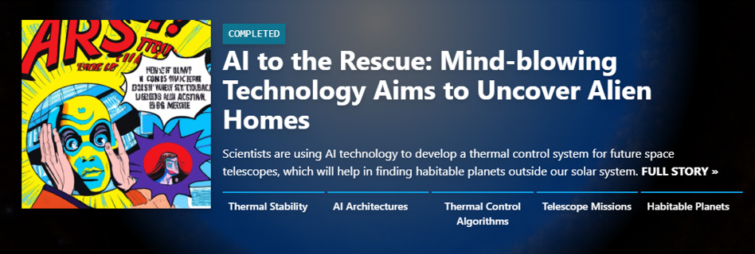
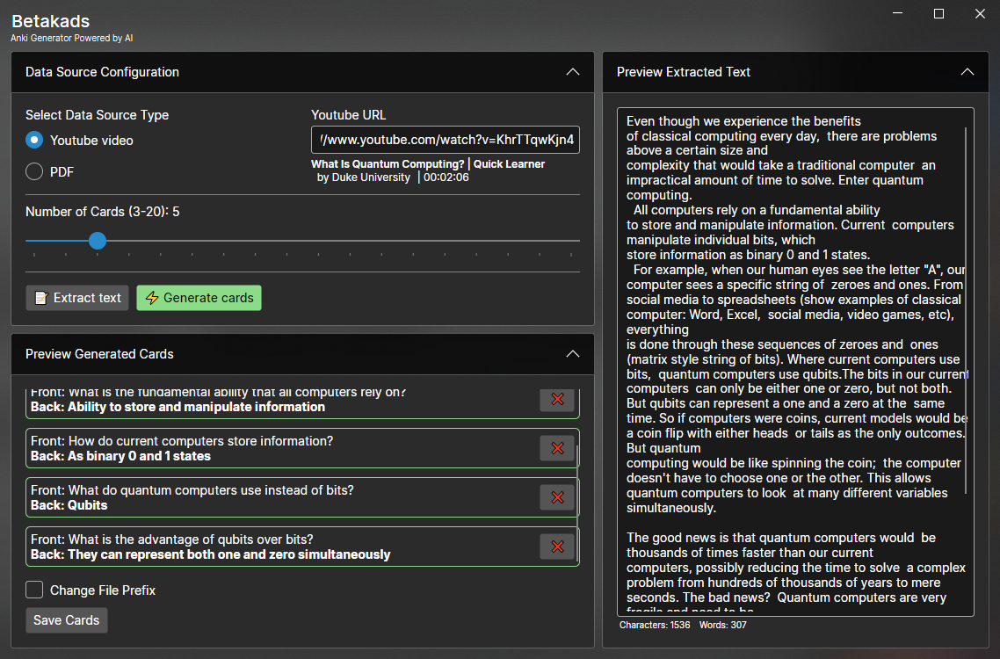
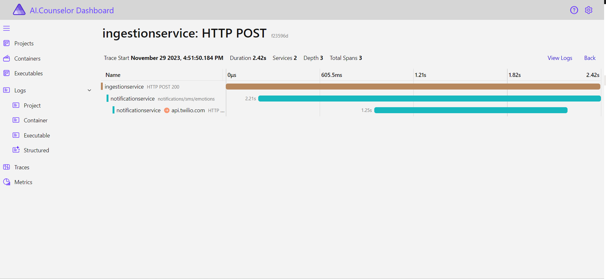

Whether you submitted a project or watched a livestream - thank you to everybody who participated in the Hack Together: The Great .NET 8 Hack! We're excited to announce the winners of [Hack Together: The Great .NET 8 Hack](https://aka.ms/hacktogether/dotnet)!

## What is Hack Together: The Great .NET 8 Hack?

From November 20 - December 4, 2023 we ran Hack Together: The Great .NET 8 Hack - a virtual hackathon for developers to get hands-on with .NET 8 and build apps using AI or cloud native technologies.

In this hackathon participants learned how to build apps with the latest and greatest features of .NET 8, including the cloud native stack Aspire. Participants also learned how to build AI-powered apps with .NET 8 and Azure OpenAI. We had live streaming sessions that covered AI, cloud native, and a fireside chat with Gaurav Seth, the Partner Director of Program Management for .NET.

Check out [all of the streams](https://www.youtube.com/playlist?list=PLdo4fOcmZ0oXkgDwc0DWFerS3C5cQ5-GG) on the .NET YouTube channel.

## The winners

It was inspiring to see the variety of submissions and the creativity of the developers who participated. We had submissions from all over the world, and we're excited to announce the winners! When judging submissions, we looked at innovation, creativity, how well the submissions used .NET 8 and how well they used AI or cloud native technologies.

We judged the submissions in two categories: AI and cloud native. We also had a category for the best overall submission.

### 🥇 Best overall: NASA TechPort Headlines

This submission took [NASA's TechPort API](https://techport.nasa.gov/help/articles/api) and turned it into a sensationalized news feed! TechPort hosts NASA's portfolio of active and completed technology projects. The aim is to encourage user engagement with these projects by making them more enjoyable. This has been achieved by summarizing project descriptions into easily understandable news-style headlines, enhancing the content with entertaining illustrations, and incorporating a search feature for easy navigation. The technologies used to accomplish this include Azure OpenAI and .NET Aspire.

[Find out more about this project.](https://github.com/tagr/greatnet8hack-techport)

### 🤖 Best AI: Betakads

Betakads is an Anki cards generator powered by AI, designed to streamline the creation of flashcards. Users of the app can select either a PDF or a YouTube link as a data source. The app then uses AI to extract the text from the PDF or the transcript from the YouTube video. The app takes that information and creates the flashcards appropriately.

[Find out more about this project.](https://github.com/ZadokJoshua/betakads-avalonia-app)

### ☁️ Best cloud native: AI Counselor

AI Counselor uses Azure OpenAI to track your emotions and provide a summary along with action points at the end of the day. But where it resonated with us was how it was built from the ground up in a cloud native way and its implementation of Aspire. AI Counselor demonstrates how Aspire can be used to seamlessly integrate several projects together to create a cohesive, scalable, and robust cloud backend.

[Find out more about this project.](https://github.com/Cloud-Jas/AI-Counselor)

## Continue your journey with the community

While the Hack Together is finished, your journey doesn't have to end. The [].NET YouTube channel](https://youtube.com/@dotnet) has a ton of great content to help you continue your .NET 8 learning journey. The [Azure Developers YouTube channel](https://youtube.com/@azuredevelopers) will keep you up to date with the latest cloud native content. And we're constantly adding new Learn Modules to [Microsoft Learn](https://learn.microsoft.com/training?products=dotnet) all the time, so keep that page bookmarked!

And join us the [].NET LinkedIn group](https://www.linkedin.com/groups/40949/) to stay up to date with the latest .NET news and connect with other developers.