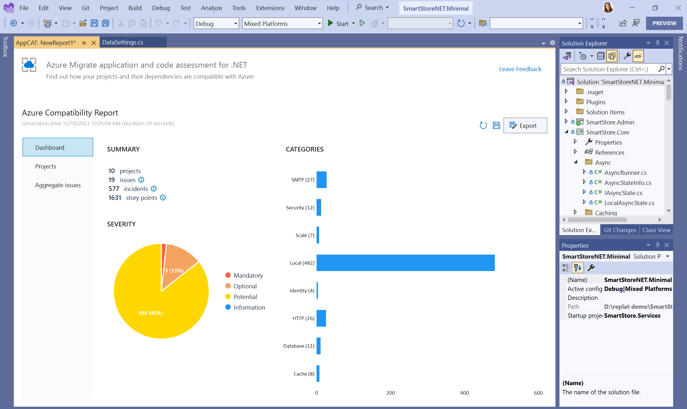
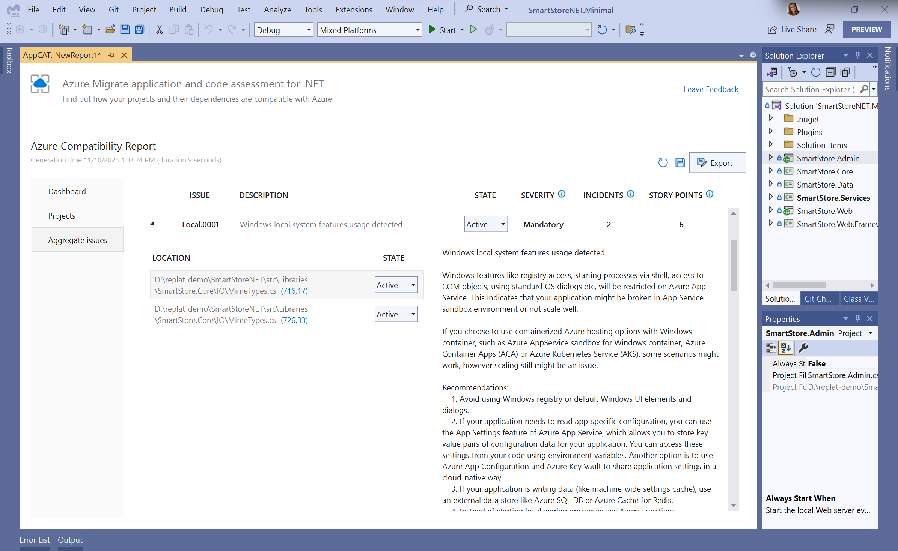
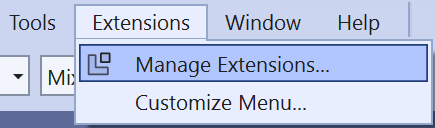
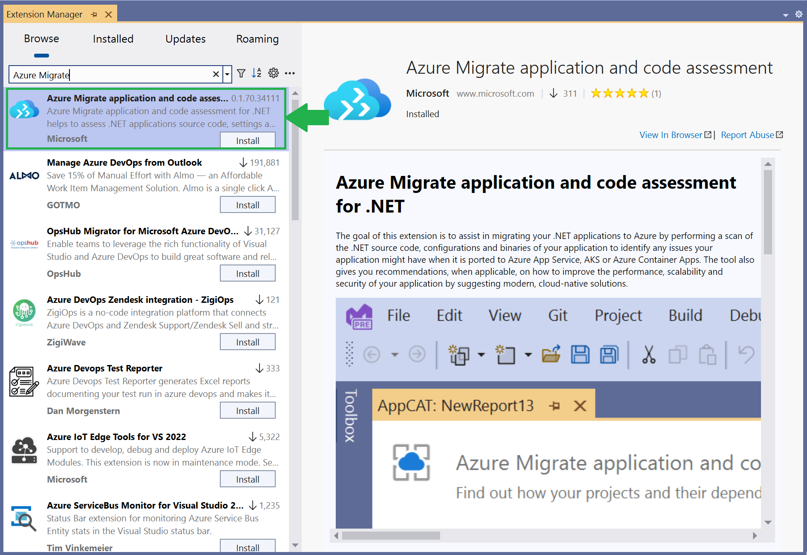
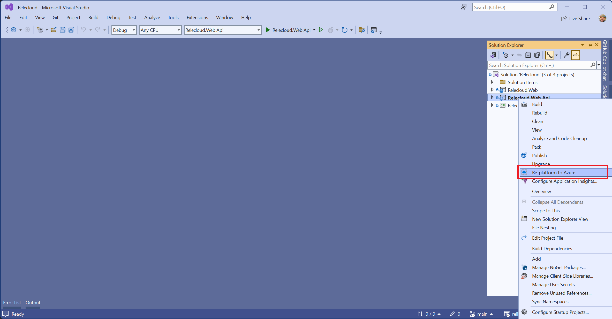
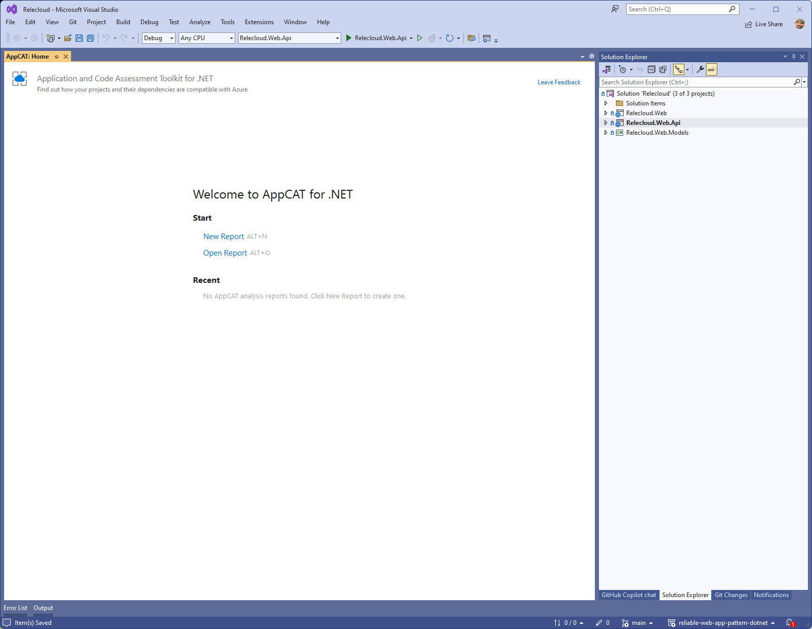
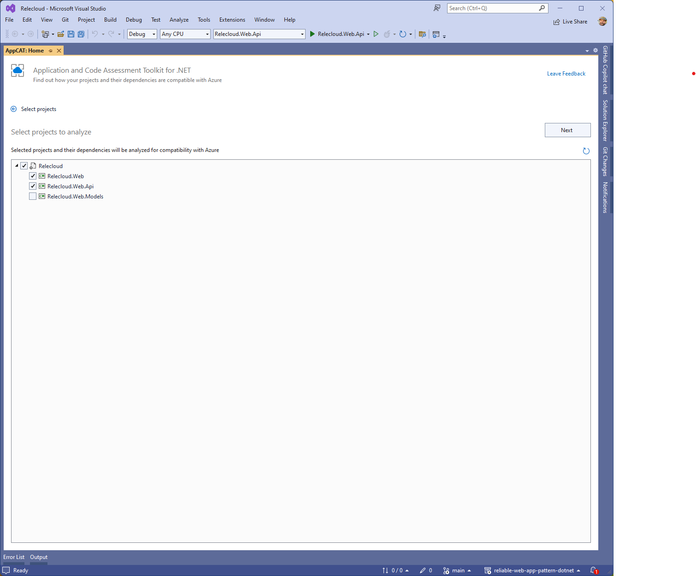
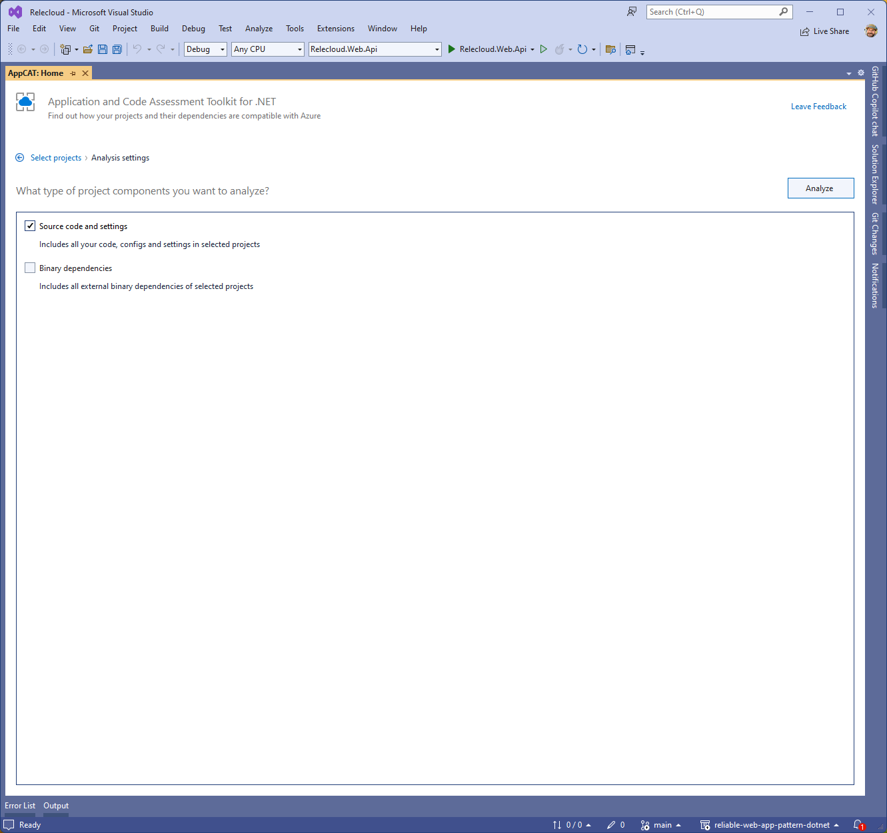
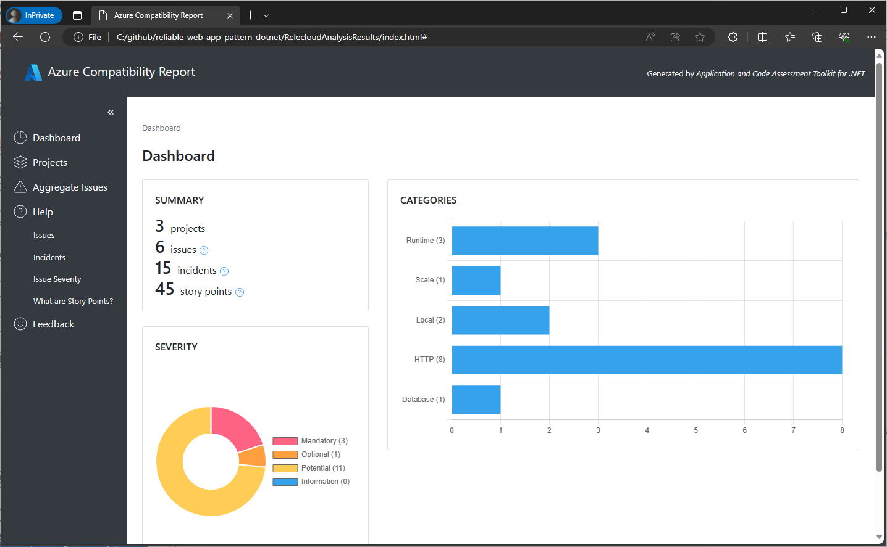
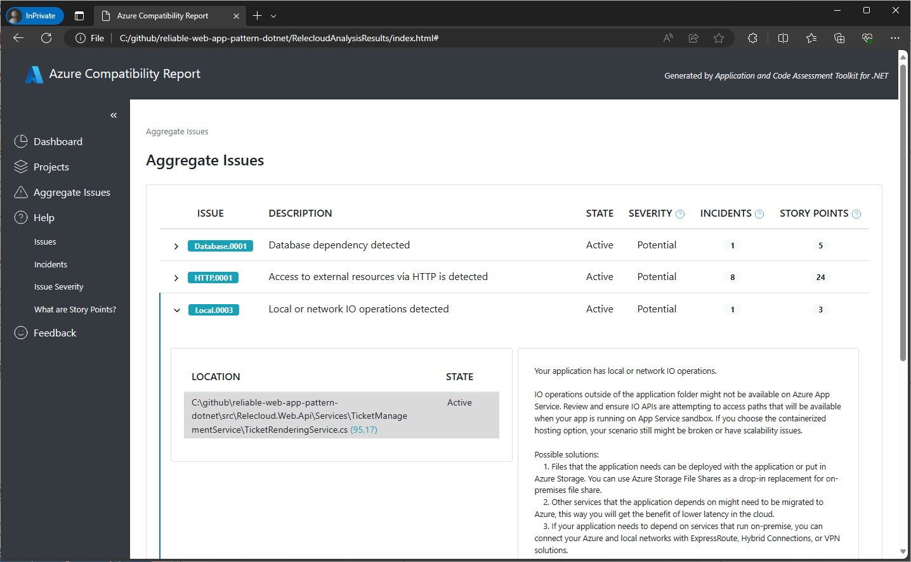

We are happy to announce the release of a new tool that can assist you in migrating your on-premises .NET applications to Azure.

Azure Migrate application and code assessment for .NET (or AppCAT for short) allows you to assess .NET source code, configurations, and binaries of your application to identify potential issues and opportunities when migrating an app to Azure. It helps to discover any issues your application might have when it is ported to Azure and improve the performance, scalability, and security by suggesting modern, cloud-native solutions.



Once you run the analysis, AppCAT will show you a report of all possible things that you need to check or change to ensure your application works properly once it is moved from on-premises to Azure.

AppCAT discovers application technology usage through static code analysis of your code and its dependencies. It will also allow you to jump to a line that requires your attention, address issues and mark them as fixed, save the current state of the issues and the report so you or your coworkers can start exactly where you left off and effectively collaborate. The tool will give you an estimate of how much effort each issue will take to fix as well as giving estimates for the components of your apps and whole projects. And it will provide detailed guidance on how to fix the issues and connect you to the Microsoft documentation.



AppCAT is available in two "flavors" - as a Visual Studio extension and as a .NET CLI tool.

## Install Visual Studio extension

### Prerequisites

- Windows operating system
- Visual Studio 2022 version 17.1 or later

### Installation steps

Use the following steps to install it from inside Visual Studio. Alternatively, you can download and install the extension from the [Visual Studio Marketplace](https://marketplace.visualstudio.com/items?itemName=ms-dotnettools.appcat).

  1. With Visual Studio open, press the **Extensions > Manage Extensions** menu item, which opens the **Manage Extensions** window.
  
  1. In the **Manage Extensions** window, enter **"Azure Migrate"** into the search input box.
   
  1. Select the **Azure Migrate application and code assessment** item, and then select **Download**.
  1. Once the extension has been downloaded, close Visual Studio. This starts the installation of the extension.
  1. In the VSIX Installer dialog select **Modify** and follow the directions to install the extension.

## Install the CLI tool

### Prerequisites

- .NET SDK

### Installation steps

To install the tool, run the following command in a CLI:

```dotnetcli
dotnet tool install -g dotnet-appcat
```

To update the tool, run the following command in a CLI:

```dotnetcli
dotnet tool update -g dotnet-appcat
```

> [!IMPORTANT]
> Installing this tool may fail if you've configured additional NuGet feed sources. Use the `--ignore-failed-sources` parameter to treat those failures as warnings instead of errors.
>
> ```dotnetcli
> dotnet tool install -g --ignore-failed-sources dotnet-appcat
> ```

## Analyze applications with Visual Studio

Once you have installed the Visual Studio extension, you are ready to analyze your application in Visual Studio. You can do so by right clicking on any of the projects or a solution in the Solution Explorer window and selecting **Re-platform to Azure**.



The tool's window will open offering you to either create a new report or open an existing reort.



If you are selecting to create a new report, on the next screen you can choose which projects in your solution you would like to analyze. Web projects will be pre-selected for you and you can change the selection by checking or unchecking the boxes next to the projects. When the tool runs, it also analyzes the dependencies your selected projects have.



On the next screen you can choose if youu want to analyze just your source code and settings or all binary dependencies that your code has as well.



Once you click **Analyze** button and the tool completes the analysis, you will see the results in a dashboard that can be saved in different formats (HTML, CSV and JSON).

Read this [step by step guide](https://aka.ms/appcat/dotnet/vs) for detailed instructions on the Visual Studio experience.

## Analyze applications with .NET CLI

Once you installed the CLI tool, you are ready to analyze your application in CLI. In CLI run the command:

```dotnetcli
appcat analyze <APPLICATION_PATH>
```

you can specify a path and a format (.html, .json, or .csv) for the report file that the tool will produce:

```dotnetcli
appcat analyze <APPLICATION_PATH> --report MyAppReport --serializer html
```

Read this [step by step guide](https://aka.ms/appcat/dotnet/cli) for detailed instructions on the CLI experience.

## Interpret reports

Both CLI tool and Visual Studio allow you to save the results of the analysis in HTML, CSV and JSON formats. HTML report looks very similar to the dashboard you'll see in the Visual Studio after the analysis is completed.



The report will show you information about the number of projects analyzed, issues and incidents and an evaluation of how much effort each incident, issue and project take to be fixed. Incidents are grouped by categories and severity. There are different views that allow you to see the incidents, get help on how to fix them, jump to your code where those incidents occur and so on.



Read this [Interpret the results guide](https://aka.ms/appcat/dotnet/report) for detailed description of the different parts of the reports and how to understand and interpret the data.

## Supported languages

Application and code assessment for .NET can analyze projects written in the following languages:

- C#
- Visual Basic

## Supported project types

It analyzes your code in the following project types:

- ASP.NET and ASP.NET Core
- Class libraries

## Supported .NET frameworks

All .NET frameworks (.NET Framework, .NET Core, .NET 5+).

## Supported Azure targets

Currently application identifies potential issues for migration to Azure App Service, AKS, and Azure Container Apps. In the future the tool might have an ability to set the target explicitly and filter the exact issues and recommendations for each target separately.

## What’s next

Next, we are going to focus on infusing the tool with AI capabilities and adding integration with Copilot, so you can get help on overall migration as well as fixing particular issues.

Another big feature that we are currently working on is to get you a more curated assessment based on the Azure target you choose. We plan to add the ability to set the target before the report and build the report based on that target.

## Useful materials

We have lots of materials to help you with your upgrade process:

- [AppCAT documentation](https://aka.ms/appcat/dotnet)
- [AppCAT installation for Visual Studio](https://marketplace.visualstudio.com/items?itemName=ms-dotnettools.appcat)
- [AppCAT CLI installation](https://learn.microsoft.com/dotnet/azure/migration/appcat/install#install-the-net-global-tool)

## Give us feedback!

Please give us your feedback or report any issues via [Visual Studio feedback channel](https://learn.microsoft.com/visualstudio/ide/suggest-a-feature) by choosing **Help** | **Send Feedback** in Visual Studio. Please mention "AppCAT" in the title so it will get routed to my team faster. We appreciate your input and want to build the right tools for you!
