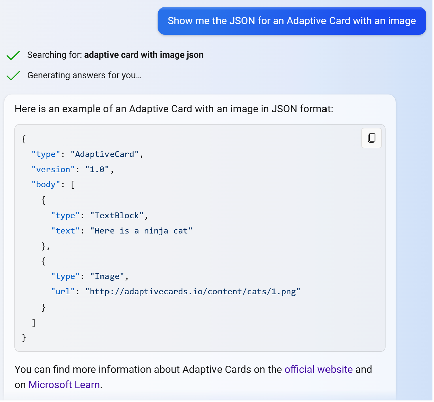
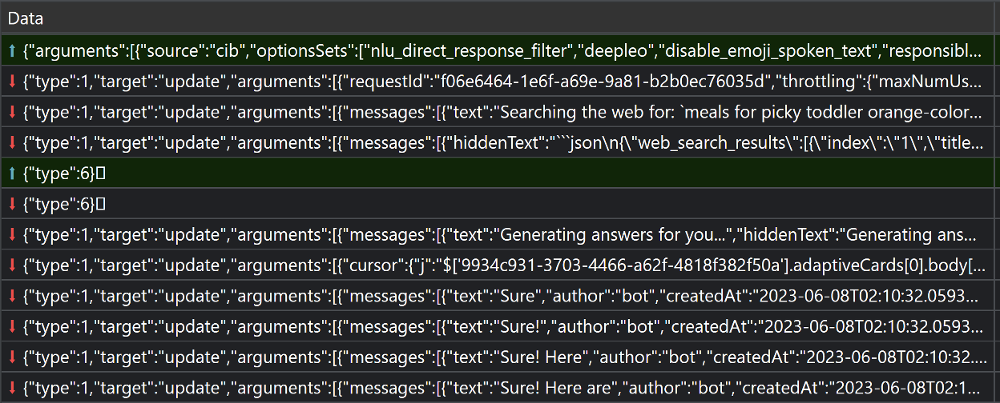
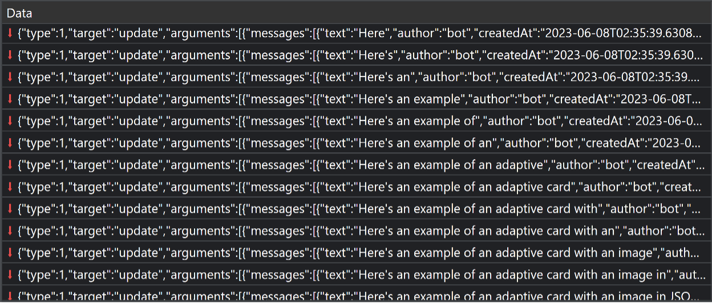

Microsoft Copilot is powered by several open-source tools such as: SignalR, Adaptive Cards, Markdown, and object-basin to solve the unique challenges in building AI-enabled applications at scale. In this article, we share the design considerations and how we integrated various tools. More specifically, this article focuses on aspects of how we stream messages and responses to the front-end UI while giving some overview of what happens on the server-side. As more teams and enterprises consider leveraging Large Language Models (LLMs), we hope this article helps expand the AI ecosystem.  

## Overview

[Microsoft Copilot](https://copilot.microsoft.com) is available on many surfaces such as mobile apps, Bing, and it is built into the Microsoft Edge sidebar, providing easy access for Edge users. It provides a fluid conversational experience which augments the traditional web searching and browsing experience. Because Microsoft Copilot is AI-powered and resides inside the Edge browser, users can ask complex questions formed in natural human languages and even get help when they need to get their creative juice flowing while they browse the web. Behind the scenes, state-of-the-art AI models generate a response by considering a user’s current browsing context and synthesizing the web. In addition to textual input and output, users can communicate with Microsoft Copilot using voice and images for an even richer interaction.

## Outline

- Establish low-latency communication channel using SignalR
- Describe and render UI using Adaptive Cards + Markdown
- Application flow
- Deep dive: how we use SignalR?
- What’s next?

## Establish low-latency communication channel using SignalR

It is impractical to wait for AI models to generate a full response before sending it back to the client. What we needed was a way for the server to stream responses in chunks so that users can see parts of the result as soon as possible. While we couldn’t change the time it takes to generate a full response, we wanted to provide a perceived response time that’s near real-time.
We first investigated Server-Sent Events as it is the protocol of choice by OpenAI, and some of our team members had experience with it in Python. However, we eventually decided against it for two reasons:

- We learned from colleagues working on Azure services that they’ve seen reports of SSE being blocked by proxies.
- We wanted to add a feature to allow users to interrupt AI models from responding further. This comes in handy when extremely long responses are generated from the AI models. SSE, being a one-directional protocol, can’t help much here.

The initial investigation led us to a refined understanding of what we needed to achieve – a communication channel between the clients and server that exhibited four key characteristics:

- Low latency
- Network tolerant
- Easy to scale
- Bi-directional *(both the server and client can send messages back and forth whenever they need to)*

SignalR seemed to fit the description almost perfectly. It automatically detects and chooses the best transport method among the various web standard protocols and techniques. WebSocket is used as the transport method by default, and it gracefully falls back to Server-Sent Events and long polling technique to meet the capability of clients.

With the SignalR library, we don’t need to worry about which transport protocol is used, we can rise above network-level concerns and focus on implementing the core business logic, which is generating useful responses in various data formats. Our team can operate with the safe assumption that the real-time communication channel is established and taken care of.
Another convenient benefit for us is that SignalR is part of ASP.NET Core and we didn’t need a new back-end dependency.

## Describe and render UI using Adaptive Cards + Markdown

Most messages use [Adaptive Cards](https://adaptivecards.io/) because there can be [Markdown](https://en.wikipedia.org/wiki/Markdown). This helps us support and control how to display many things in a standard way, such as code blocks, links, images, and styled text. “Adaptive Cards are platform-agnostic snippets of UI, authored in JSON, that apps and services can openly exchange. When delivered to a specific app, the JSON is transformed into native UI that automatically adapts to its surroundings. It helps design and integrate light-weight UI for all major platforms and frameworks.” (from https://adaptivecards.io).

*An example of a response with an Adaptive Card with a code block showing the JSON for an Adaptive Card.*

We use the standard Adaptive Cards schema objects in our back-end so that various components have control over what is shared with the front-end. For example, after the model generates a response, a component in our back-end can easily add an image above the generated text.

## Application flow

### Textual input  -> textual output

Users can type their input message using a keyword. The page communicates via WebSocket using SignalR with an endpoint called `/ChatHub`. The `/ChatHub` endpoint takes a request that includes metadata about the user and their message. `/ChatHub` sends back events with responses for the client to process or display.

*Events streamed over a WebSocket connection when you say, “What are some meals I can make for my picky toddler who only eats orange-colored food?”. The first row is the request from the client (front-end). The following ones with content are responses from the service. They include message objects for each item to display in the chat window. We’ll explain more about them later in this article.*

The page uses [FAST](https://www.fast.design/) to efficiently update the page as messages are generated and received from `/ChatHub`.

### Speech input -> speech output

Users can also use their voice to provide input and Microsoft Copilot will read out the response.

To handle voice input, we use the same speech recognition service that powers Bing and has been refined over the years. In the beginning, between the clients and our backend, we simply placed the speech recognition service, which acted as a reverse proxy. The service converted speech to text and sent it as a prompt to our backend. Once the response is returned from our backend, the speech recognition service performed text-to-speech and sent the text and audio to the frontend.

With this simple approach, we quickly realized that there was a delay in showing text to end users because the proxy was waiting for the response text to be converted to audio. So, we switched to having the conversation management service asynchronously call the speech service to tell it to start computing the audio for the response and return a deterministically generated URL for each segment of the audio to play. The UI uses those URLs to get the audio to play from the speech service. The UI might have to wait a little bit before the audio is ready, but at least end users see some results and don’t have to wait for an audio segment to be ready.

This optimization also helps reduce the load on the speech service because the requests to it are much shorter as they don’t need to last for the entire duration of the request to the conversation management layer.

You might have noticed that the output plays in segments. We’re still experimenting with different ways to split text into segments to minimize the delay between segments. We’ll probably settle on splitting by sentence and maybe have the first few words in their own segment so that we can start playing audio as fast as possible and not wait for the first full sentence to be generated.

## Deep dive: how do we use SignalR?

### We use one connection per each user’s message

For developers who have experience using SignalR or WebSockets, this might strike them as an odd decision. For a game, you would keep the WebSocket connection open because you want to minimize latency for user input. In our case, however, it could be many seconds or minutes before a user sends a new message, if they do at all. So, it’s not worth keeping the connection open. The model takes a while to fully generate the response anyway, which makes savings from re-using the same connection insignificant.

Beyond this consideration, there are other reasons that make this decision appropriate for us. It is easier for clients to manage because they don't need to hold a reference to the connection and check its state to see if it's already handling a connection before sending a new message. Using a separate connection for each message in the chat makes it much easier to debug our code when testing because you can open the browser’s Network tab in DevTools and clearly see each of your test requests in its own row 😉. It is much simpler to manage the back-end load when each WebSocket connection is very short-lived. With a simple load-balancing scheme, each SignalR connection can use a different node in the back-end. This prevents an imbalance of some nodes serving too many long-running connections while others have short-running connections.  

### Leverage existing features to display messages in Bing-native way

When you query weather or news in Bing, Bing has special cards to display this type of information with rich interactivity. Our team leverages those great existing features. The Microsoft Copilot front-end interprets or processes some messages in a custom way to display information in ways that are familiar to Bing users.

In those cases, the back-end generates a query for the client to use. Some messages show processing information such as a model’s decision to search the web, the queries for searches, search results, and generated suggestions for responses you can say to the model.

### Two types of operations for response streaming

#### Overwriting messages

If you’ve looked at the network traffic, you’ll notice that we sometimes send an entire response in each update.

*An example of sending an entire response in a message in an "update" event.*

You may ask why can’t we just send some text to append in each update? We do A LOT of internal processing on the output from models before it gets to users, and users don't get to see all the output either. We look for special signals to determine the type of response to return, format responses nicely, add citation links, reorder citation links, buffer so that we don’t show links before they’re done being created, check for offensiveness, check for harmful content, compute text to be spoken out loud, etc. What users see is a modified version of the streamed output from models, therefore, we can’t always do updates in an append-only way like you might have seen in some products.  

At the time being, we usually rely on overwriting messages when streaming responses mainly to leverage the simple implementation this approach offers us. Our models generate Markdown and we do not yet stream the Markdown to a render. Instead, we send the entire Markdown response and turn it into HTML when we re-render the Adaptive Card for each modification to message. If we did stream text instead of entire objects, then we would ideally do something special, like stream new Markdown to a component that can process Markdown in a stream and add it to already built HTML.

Another advantage is fault tolerance: If an update isn’t received, or isn’t processed for some reason, we’ll recover if we process a later update or the final version of the message.

#### Efficiently update message objects sent to clients

Each message has a unique `messageId`. Every update includes the `messageId` of the message to modify. We use the `"w"` event to efficiently update data in message objects such as content in Adaptive Cards.

While the familiar JSON Patches format offers some capabilities to update objects or list in a JSON object, it only supports overwriting strings and does not support succinct modifications of strings such as appending or inserting text inside a string. Our team created a new library for JavaScript/TypeScript and .NET called [object-basin](https://github.com/microsoft/object-basin) to provide the precise updates to JSON objects we need for Microsoft Copilot. object-basin facilitates applying various kinds of updates to streamed message objects and allows us to efficiently modify text that has already been sent to the front-end. Most updates are just text to append, but we can control so much more from the back-end service. For example, we can insert text in any string, delete text, create new objects or lists, modify lists, etc. This works by declaring a cursor as a JSONPath (for example, `$['a7dea828-4be2-4528-bd92-118e9c12dbc6'].adaptiveCards[0].body[0].text`) and sending text, objects, or lists to write to the value at that cursor.
We still re-process the entire Markdown and Adaptive Card when streaming these more concise updates.

## What's next

We’re all very excited and passionately working on building a great experience with cool new features. In future blog posts, we hope to share more about how we use SignalR such as the ways that we use groups and the recently introduced stateful reconnect feature to help recover from disconnections. Our team hosts SignalR app ourselves for now, but we are also exploring [Azure SignalR service](https://dotnet.microsoft.com/apps/aspnet/signalr/service) to better manage scalability and availability.

As you’ve hopefully seen over the last few months, there have been many announcements with new integrations such as image generation and copilots for other Microsoft products like Windows, Office Microsoft 365, and Skype. This is just the beginning.

A special thanks to [David Fowler](https://devblogs.microsoft.com/dotnet/author/davifowl) and the SignalR team for helping us with this blog post and along our journey to build Microsoft Copilot.
