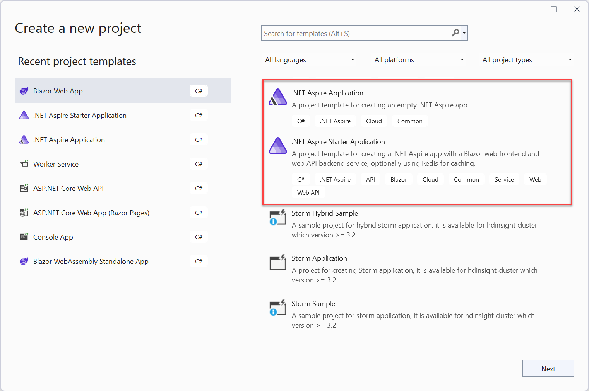
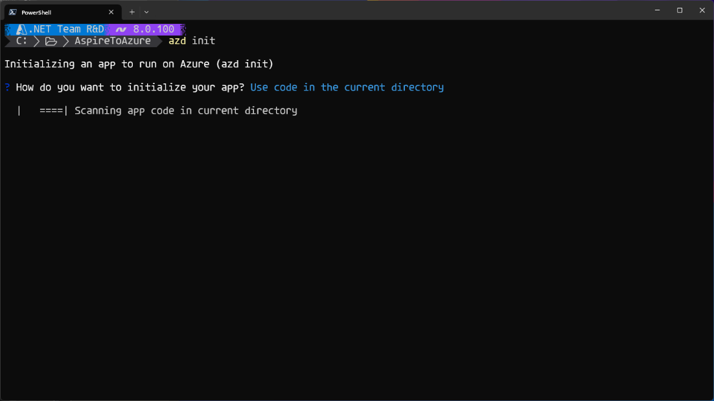
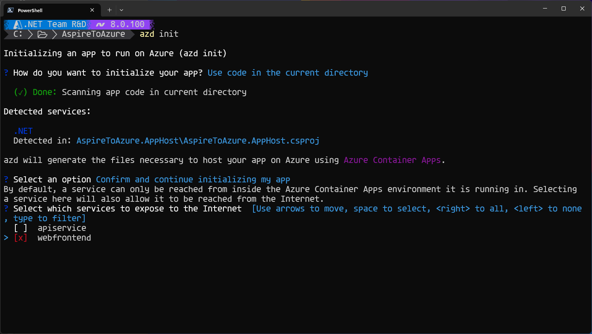
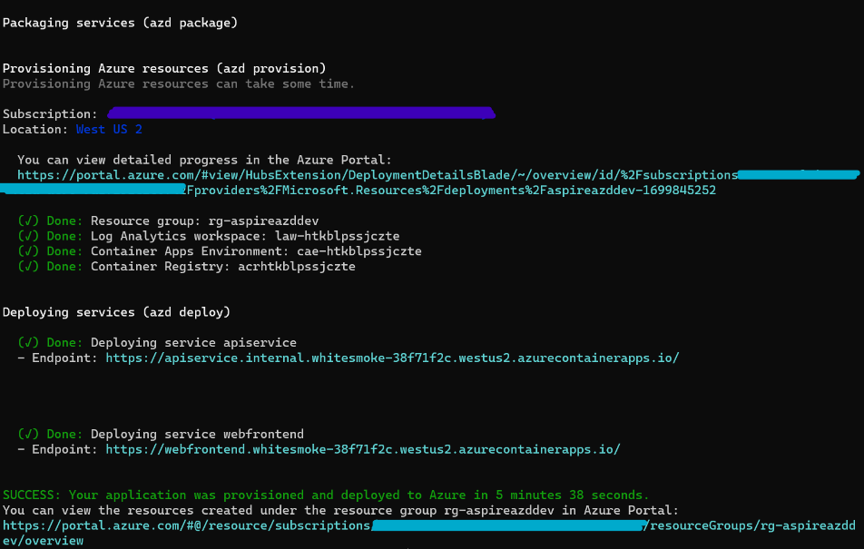
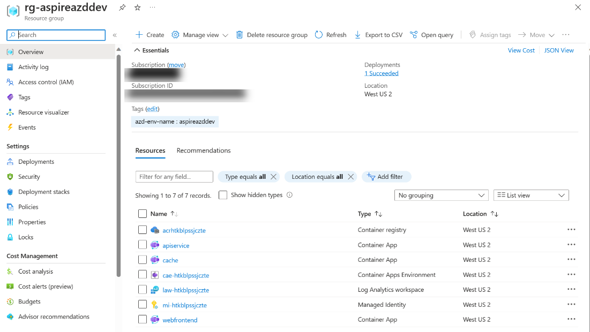

The recently announced [.NET Aspire](https://devblogs.microsoft.com/dotnet/introducing-dotnet-aspire-simplifying-cloud-native-development-with-dotnet-8/) for building cloud-native apps is a great match for [Azure Container Apps](https://learn.microsoft.com/azure/container-apps/) (ACA). .NET Aspire was designed to easily manage applications comprised of a series of interdependent microservices. Azure Container Apps is also tailored for microservices and built on cloud native tech which means .NET Aspire integrates into it seamlessly – right out of the box!

On top of that, the .NET Aspire stack offers a tailored deployment experience for ACA through the [Azure Developer CLI](https://learn.microsoft.com/azure/developer/azure-developer-cli/) (AZD), which lets you create, provision, and deploy the Azure resources for your Aspire solution with a single command.

In this blog post, we discuss the benefits of hosting your apps in ACA versus an unmanaged cluster. We will also show you just how easy it is to get started by walking through sample code.

## Why Azure Container Apps?
 
Azure Container Apps (ACA) is a platform for running container-first applications and microservices. It is powered by Kubernetes but is far simpler to use and manage for the average developer. Teams using ACA can focus on building their applications and getting to production instead of having to learn the intricacies of cluster management just to get started.

It is also a great option if you want flexibility and minimize costs. As a serverless environment, ACA offers both pay-per-use consumption hosting that scales to zero and dedicated specialized compute hosting with fixed pricing and reliability. With full support for open sources technologies like Dapr and KEDA, ACA allows developers to draw from best practices and tools of the broader microservices ecosystem - all from a single platform!

These features make ACA a great choice for developers who want to build applications for the cloud with minimal overhead and complexity. If you’re curious, read on - we will go through some sample code so you can see for yourself just how fast and easy it is to deploy a .NET Aspire solution to ACA.

## Get started with .NET 8, .NET Aspire, and AZD

If you haven't yet started with .NET Aspire with .NET 8 head over to the [.NET Aspire documenation](https://learn.microsoft.com/dotnet/aspire/) to walkthrough everything that you need to start development. This will including installing Visual Studio (or Visual Studio Code), .NET 8, .NET Aspire workload, and Docker Desktop. You can also use the .NET CLI the entire way if you prefer. 

## Create your .NET Aspire project

If you don't have a .NET Aspire project create yet, don't worry as the starter project is a great place to get started. In Visual Studio create a new **.NET Aspire Starter Application** and ensure that you select **Use Redis for caching**, and you are all set.



You can also create this directly from the .NET CLI with the following command:

```bash
dotnet new aspire-starter --use-redis-cache --output AspireSample
```

## Set up the Azure Developer CLI

The Azure Developer CLI (AZD) is a new open-source tool that accelerates deployment to Azure. Not only does AZD let you create, provision, and deploy the Azure resources for your Aspire solution with a single command, it integrates broadly with .NET tools and can be accessed from both Visual Studio Code and Visual Studio.

> Visual Studio's publishing team is investing heavily in some of AZD's features. We already support AZD-based publishing, so, if you haven't tried AZD yet, now's a great time to benefit from the repetable, composable, deployment capabilities in AZD. And as you'll see later in the article, Aspire and AZD are built for one another, and together create an automatic way to deploy your .NET Cloud Native apps to ACA without writing any infrastructure code. 

AZD builds upon the foundation of the Azure CLI and Bicep. In the same way that ACA simplifies Kubernetes, AZD simplifies deployment by providing smart defaults for Aspire solutions. You can further customize the bicep templates pulled in by AZD if required.

You can install AZD using this [documentation](https://learn.microsoft.com/azure/developer/azure-developer-cli/install-azd).

### Initialize your project for ACA

Now, let’s create an AZD environment for our .NET Aspire app. Having multiple apps in the same environment allows them to communicate with each other.

Run the following command in /AspireSample/AspireSample.AppHost:

```bash
azd init
```



Within a few seconds, AZD will detect that this is a .NET Aspire app and suggest a deployment to ACA. Confirm and continue.



AZD now shows each of the components of our .NET Aspire solution. You can now choose which ones you want deployed publicly, meaning they will have HTTP ingress open to all internet traffic. In this starter application, there is a frontend and an API. We want the web frontend to be public while the API should be private only to the ACA environment.

To get that set-up, select **webfrontend**.

Finally, we will set up the environment name – for example, dev and prod and test. Provide the environment name and continue.

AZD then completes the initialization of the app and generates a markdown file that provides details about what the CLI did under the hood.

## Deploy your project to ACA

AZD lets you provision and deploy your solution in a single step. First, however, we need to authenticate with Azure AD so we can call the Azure resource management APIs.

To do so, run the following command to launch a browser to authenticate the command-line session:

```bash
azd auth login
```

Now, we will provision and deploy our application:

```bash
azd up
```

You will then be asked for the subscription and location you would like to deploy to.

> Note: If you get the error failing to invoke the `deploy` action after running azd up, make sure you have an Admin user on the registry.  Open the Azure Portal and navigate to the subscription you deployed to. Enter the Container registry / Settings / Access keys, and then select the Admin user checkbox. This will generate a username and two passwords for you to access the ACR resource. You will be prompted for your username and password. Enter the values shown in Azure Portal. For more information, see [Enable admin user](https://learn.microsoft.com/azure/container-registry/container-registry-authentication).

AZD will generate links to the web frontend and API service applications. The final line of the terminal output contains a link to the Azure Portal page that shows all the deployed resources.



The Azure Portal offers a large variety of resources to help you scale and understand your application. Not only are there tools to manage costs, performance, and security, you can set your application to scale depending on incoming demand.



That’s it! To learn more about what AZD is doing under the hood to provision and deploy your app, you can read through this [documentation](https://learn.microsoft.com/dotnet/aspire/deployment/azure/aca-deployment).

## Next Steps

Congratulations, you can now deploy Aspire apps to ACA. You should now have a better understanding of the benefits of deploying your Aspire app to ACA. Thank you for reading!

Want to learn more? You can...

* Review the [Azure Container Apps docs](https://learn.microsoft.com/azure/container-apps/).
* Learn more about pricing details from the [Azure Container Apps pricing page](https://aka.ms/containerapps/pricing).
* Reach us directly at any time via our GitHub [microsoft/azure-container-apps](https://github.com/microsoft/azure-container-apps) repo.
* Connect with the Azure Container Apps team on [X](https://twitter.com/AzContainerApp) and [Discord](https://aka.ms/containerapps-discord).

> **NOTE:** This blog was originally posted to the [Apps on Azure blog](https://techcommunity.microsoft.com/t5/apps-on-azure-blog/deploy-apps-to-azure-container-apps-easily-with-net-aspire/ba-p/4032711) with a full walkthrough.
