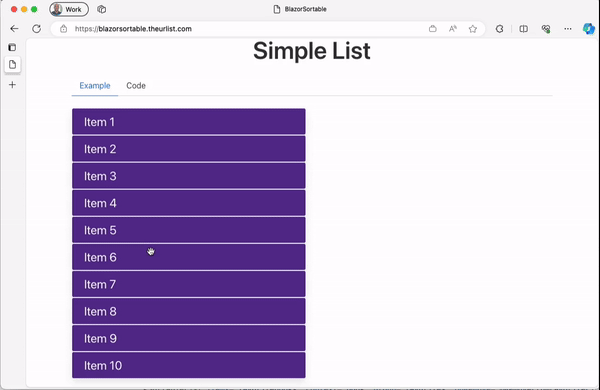
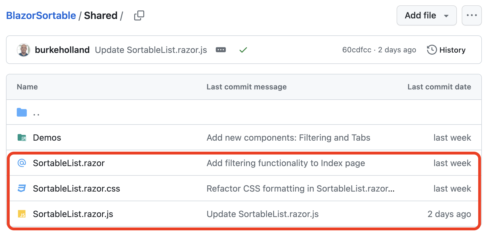
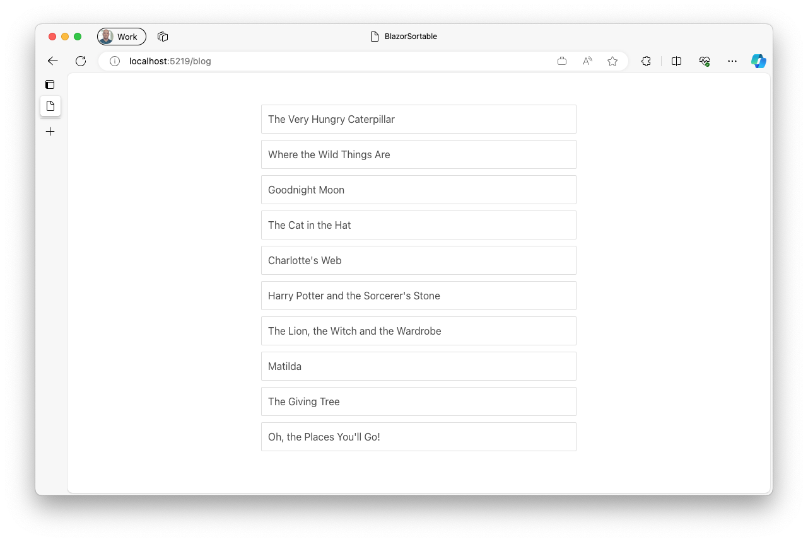
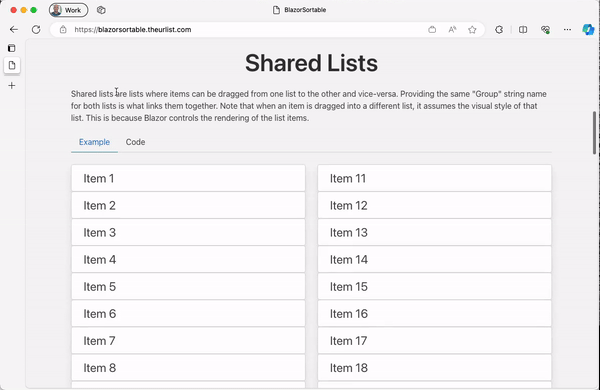

Today I'd like to share with you a new open source project called "[Bazor Sortable](https://blazorsortable.theurlist.com)" for creating sortable lists of items using Blazor and SortableJS.

Check the demo out here: [https://blazorsortable.theurlist.com](https://blazorsortable.theurlist.com)



Every Friday, [Jon Galloway](https://twitter.com/jongalloway) (you've never heard of him but he's cool trust) and I work on rebuilding a real app called [theurlist.com](https://theurlist.com) in Blazor. The stream is called "Burke Learns Blazor" on Twitch and DotNet YouTube ([Like and Subscribe!](https://www.youtube.com/@dotnet/)). And we'd love for you to join us. Mostly because we need all the help we can get with this thing because I have no idea what I'm doing.

We ended up needing a sortable list component for this rebuild, and while there are a few "Blazor Sortable" examples out there, I kinda had my heart set on [SortableJS](https://github.com/SortableJS/Sortable). SortableJS is a brilliant library for building sortable lists of items with virtually every feature you could need - sorting, sorting between lists, cloning items, filtering, custom animation easing, lumbar support. OK - not that last one, but that's, like, that's the only thing it doesn't have.

So with a little help from Steve Sanderson, we built a simple abstraction on SortableJS that you can drop in and use in your own apps. Let's take a look at how to use and customize Blazor Sortable for your own Blazor apps.

### Using Blazor Sortable

The GitHub repo for Blazor Sortable contains the source code for the sortable list as well as demos. For your own project, all you need is the `Shared/SortableList.razor`, `Shared/SortableList.razor.css` and `Shared/SortableList.razor.js` files.



The `SortableList` component is a generic component that takes a list of items and `SortableItemTemplate` that defines how to render each item in the sortable list. For instance, let's say that you have a list of books that looks like this...

```csharp
public class Book
{
    public string Title { get; set; } = "";
    public string Author { get; set; }  = "";
    public int Year { get; set; }
}

public List<Book> books = new List<Book>
{
    new Book { Title = "The Very Hungry Caterpillar", Author = "Eric Carle", Year = 1969 },
    new Book { Title = "Where the Wild Things Are", Author = "Maurice Sendak", Year = 1963 },
    new Book { Title = "Goodnight Moon", Author = "Margaret Wise Brown", Year = 1947 },
    new Book { Title = "The Cat in the Hat", Author = "Dr. Seuss", Year = 1957 },
    new Book { Title = "Charlotte's Web", Author = "E.B. White", Year = 1952 },
    new Book { Title = "Harry Potter and the Sorcerer's Stone", Author = "J.K. Rowling", Year = 1997 },
    new Book { Title = "The Lion, the Witch and the Wardrobe", Author = "C.S. Lewis", Year = 1950 },
    new Book { Title = "Matilda", Author = "Roald Dahl", Year = 1988 },
    new Book { Title = "The Giving Tree", Author = "Shel Silverstein", Year = 1964 },
    new Book { Title = "Oh, the Places You'll Go!", Author = "Dr. Seuss", Year = 1990 }
};
```

You can render this list in a `SortableList` like this...

```html
<div>
    <SortableList Items="books" Context="book">
        <SortableItemTemplate>
            <div class="book">
                <p>@book.Title</p>
            </div>
        </SortableItemTemplate>
    </SortableList>
</div>
```



The `SortableList` component will render the list of items using the `SortableItemTemplate` and then make the list sortable using SortableJS. The `Context` parameter is used to define the name of the variable that will be used to represent each item in the list. In this case, the `Context` is `book` and so each item in the list will be represented by a variable called `book`.

However, if you were to try and drag and drop items around at this point, you would notice that whenever you drop one, it just goes back to where it was before. That's because we haven't told the `SortableList` what to do when the list is sorted. We do that by handling the `OnUpdate` event and doing the sorting ourselves.

```html
<div>
    <SortableList Items="books" Context="book" OnUpdate="@SortList">
        <SortableItemTemplate>
            <div class="book">
                <p>@book.Title</p>
            </div>
        </SortableItemTemplate>
    </SortableList>
</div>
```

```csharp
...
public void SortList((int oldIndex, int newIndex) indices)
{
    // deconstruct the tuple
    var (oldIndex, newIndex) = indices;

    var items = this.books;
    var itemToMove = items[oldIndex];
    items.RemoveAt(oldIndex);

    if (newIndex < items.Count)
    {{
        items.Insert(newIndex, itemToMove);
    }}
    else
    {{
        items.Add(itemToMove);
    }}
}
```

The `OnUpdate` event handler will be called whenever the list is sorted. It will pass a tuple containing the old index and the new index of the item that was moved. In the `SortList` method, we deconstruct the tuple into two variables and then use those to move the item in the list. 

It's SUPER important that you never ever mutate DOM that Blazor controls. Blazor keeps an internal copy of the DOM and if you change it with something like JavaScript, you will get bizarre results since the page state will be out of sync with Blazor's internal state. So what we do behind the scenes here is cancel the JavaScript move so that the item doesn't actually move on the page. Then we move the item in the list and Blazor will re-render the list with the new order.

### A More Complex Example

SortableJS is a very powerful library and it can do a lot more than just sort lists. It can also sort between lists, clone items, filter items, and more. The `SortableList` component supports many of these features. Let's take a look at a more complex example - sorting between two lists...

```html
<div>
    <div class="container">
        <div class="columns">
            <div class="column">
                <h3>Books</h3>
                <SortableList Items="books" Context="book" OnRemove="@AddToFavoriteList" Group="favorites">
                    <SortableItemTemplate>
                        <div class="book">
                            <p>@book.Title</p>
                        </div>
                    </SortableItemTemplate>
                </SortableList>
            </div>
            <div class="column">
                <h3>Favorite Books</h3>
                <SortableList Items="favoriteBooks" Context="book" OnRemove="@RemoveFromFavoriteList" Group="favorites">
                    <SortableItemTemplate>
                        <div class="book">
                            <p>@book.Title</p>
                        </div>
                    </SortableItemTemplate>
                </SortableList>
            </div>
        </div>
    </div>
</div>
```

In this example, we have two lists - a list of all books and a list of favorite books. They are linked together via the `Group` property. 

We want to be able to drag and drop books from the list of all books to the list of favorite books. To do that, we need to handle the `OnRemove` event for both lists. 

```csharp
public void AddToFavoriteList((int oldIndex, int newIndex) indices)
{
    var (oldIndex, newIndex) = indices;

    var book = books[oldIndex];
    favoriteBooks.Insert(newIndex, book);
    books.RemoveAt(oldIndex);
}

public void RemoveFromFavoriteList((int oldIndex, int newIndex) indices)
{
    var (oldIndex, newIndex) = indices;

    var book = favoriteBooks[oldIndex];
    books.Insert(newIndex, book);
    favoriteBooks.RemoveAt(oldIndex);
}
```



### Styling the SortableList

By default, the `SortableList` contains some default styling that hides the "ghost" element while dragging. This will give you a gap between items as you are dragging. Without this style change, the item itself is shown as the drop target. This is a little weird because it means that the item you are dragging is also the item you are dropping on. But if that's your jam, you can just override the styles in the `SortableList.razor.css` file or just don't include it at all.

Since all of the content rendered inside of a `SortableList` is rendered inside of a `SortableItemTemplate` child, you always have to use the "::deep" modifier for any changes to take effect. 

If you style the `SortableList` from a parent page/component (i.e. Index.razor.css) you MUST wrap the `SortableList` in a container element and use the "::deep" modifier as well. If you don't do this, your styles won't take effect and you'll be sad and confused and mad at me for making this component. This is a Blazor thing, not a SortableJS thing. You can read more about scope styles in the [ASP.NET Core docs](https://learn.microsoft.com/aspnet/core/blazor/components/css-isolation?view=aspnetcore-7.0#child-component-support).

I feel like nobody is going to read that last paragraph and there will be much wailing and gnashing of teeth. But I tried. I'm sorry in advance.

## Bro, why not HTML5 Drag and Drop?

Fair question and one that I certainly looked into before going to a JavaScript solution. The long and short of it is that the native HTML5 support for drag and drop simply isn't robust enough for a decent sortable. For instance, there is no way to style much of the behaviour of the drag and drop. It looks...goofy...and there isn't anything you can really do about it. It also has [pretty flaky support](https://caniuse.com/?search=drag) across browsers. There are some essential properties that only work in Chrome.

All of that said, SortableJS actually will try and use HTML5 drag and drop and fallback to a JavaScript solution on platforms like iOS. However, you still lose control over the styling and you get the goofy looking drag and drop. So I've got HTML5 **turned off** on the `SortableList`. If you want it back on, go into the `SortableList.razor.razor.js` file and remove the `forceFallback: true` attribute. I should probably make this a setting at some point.

## Get Blazor Sortable

Check out [Blazor Sortable](https://blazorsortable.theurlist.com) and let us know what you think! You can do a lot with it, including cloning items, disabling sorting on certain items, specifying drag handles and more. We haven't implemented every single feature of SortableJS. Yet. Pull requests are welcome! 😉