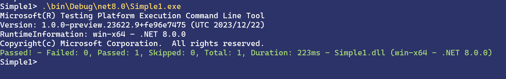

It is our pleasure to introduce MSTest runner, a new lightweight runner for MSTest tests. This new runner makes tests more portable and reliable, makes tests run faster and is extensible to provide you with an a la carte testing experience to add the tools you need to be successful.

## What is it?

MSTest runner is a way to build and run MSTest tests as an independent portable executable. A simple console application is used to host and run your tests, so you don’t need  any external tools such as `vstest.console`, `dotnet test`, or `Visual Studio`, to run your tests. Making this the perfect tool for authoring tests for devices with limited power or storage.

## Installing MSTest runner

Developers of all experience levels and projects of any size can take advantage of the speed and portability of the new MSTest runner. We welcome you to try it out!

MSTest runner comes bundled with `MSTest.TestAdapter` NuGet package since version `3.2.0`.

Enabling it for your project is as simple as installing the updated package and setting two MSBuild properties, `<EnableMSTestRunner>` and `<OutputType>`:

```xml
<Project Sdk="Microsoft.NET.Sdk">

  <PropertyGroup>
    <!-- Enable the MSTest runner, this is an opt-in feature -->
    <EnableMSTestRunner>true</EnableMSTestRunner>
    <!-- We need to produce an executable and not a DLL -->
    <OutputType>Exe</OutputType>

    <TargetFramework>net8.0</TargetFramework>
    <ImplicitUsings>enable</ImplicitUsings>
    <Nullable>enable</Nullable>

    <IsPackable>false</IsPackable>
  </PropertyGroup>

  <ItemGroup>
    <!-- 
      MSTest meta package is the recommended way to reference MSTest.
      It's equivalent to referencing:
          Microsoft.NET.Test.Sdk
          MSTest.TestAdapter
          MSTest.TestFramework
          MSTest.Analyzers
    -->    
    <PackageReference Include="MSTest" Version="3.2.0" />

  </ItemGroup>

</Project>
```

After making these changes, re-build your test project and your tests will create an executable that directly runs your tests:



[Full example - Simple1](https://github.com/microsoft/testfx/tree/main/samples/public/mstest-runner/Simple1)

In the screenshot above you see that we did not need to run `dotnet test`, use `vstest.console` or run in `Visual Studio` to run our tests. Our tests are just a normal console application that discovers and runs tests.

That said the runner does integrate with `dotnet test`, `vstest.console`, `Visual Studio Test Explorer` and `Visual Studio Code Test Explorer` to provide you with the same experience you are used to. See our [documentation to learn more](https://learn.microsoft.com/dotnet/core/testing/unit-testing-mstest-runner-intro).

## Benefits of using the runner vs. VSTest

### Portability

Running tests directly from an executable removes a lot of the complexity and infrastructure that is normally needed to run tests. Because test projects are no longer special, you can use the existing `dotnet` tooling to do interesting things with your test projects, such as building them as self-contained:

```text
dotnet publish --runtime win-x64 --self-contained
```

The example above will publish the test project together with the runtime it needs to run. This allows you to move the project to a computer that does not have this runtime and run your tests on multiple computers without additional setup.

Or you can use this capability to create a zip file after every failed test run, to reproduce the failure locally the same way it failed on your CI server and get an easy way to debug your failed runs interactively.

Here is another example of running tests against a dotnet application hosted in a docker container that has no dotnet SDK available. A scenario that is a frequent stumbling point for our advanced users:

```docker
RunInDocker> docker build . -t my-server-tests

RunInDocker> docker run my-server-tests
Microsoft(R) Testing Platform Execution Command Line Tool
Version: 1.0.0-preview.23622.9+fe96e7475 (UTC 2023/12/22)
RuntimeInformation: linux-x64 - .NET 8.0.0
Copyright(c) Microsoft Corporation.  All rights reserved.
info: Microsoft.Hosting.Lifetime[14]
      Now listening on: http://[::]:8080
info: Microsoft.Hosting.Lifetime[0]
      Application started. Press Ctrl+C to shut down.
info: Microsoft.Hosting.Lifetime[0]
      Hosting environment: Production
info: Microsoft.Hosting.Lifetime[0]
      Content root path: /test/test
info: Microsoft.AspNetCore.Hosting.Diagnostics[1]
      Request starting HTTP/1.1 GET http://localhost:8080/hello - - -
info: Microsoft.AspNetCore.Routing.EndpointMiddleware[0]
      Executing endpoint 'HTTP: GET /hello'
info: Microsoft.AspNetCore.Routing.EndpointMiddleware[1]
      Executed endpoint 'HTTP: GET /hello'
info: Microsoft.AspNetCore.Hosting.Diagnostics[2]
      Request finished HTTP/1.1 GET http://localhost:8080/hello - 200 - text/plain;+charset=utf-8 73.5556ms
Passed! - Failed: 0, Passed: 1, Skipped: 0, Total: 1, Duration: 1.7s - MyServer.Tests.dll (linux-x64 - .NET 8.0.0)
```

[Full example - RunInDocker](https://github.com/microsoft/testfx/tree/main/samples/public/mstest-runner/RunInDocker)

Another advantage of MSTest runner portability is that you can now easily debug your tests as you would do for any regular executable. For example, in `Visual Studio` you can now simply:

1. Navigate the test project you want to run in Solution Explorer, right select it and select **Set as Startup Project**.
1. Navigate to the test you want to debug and add a breakpoint
1. Select **Debug** > **Start Debugging** (or use <kbd>F5</kbd>) to run the selected test project.

You can also use `--filter` to filter down to the method or methods you want to debug to speed-up debugging experience. For example, `--filter MSTestNamespace.UnitTest1.TestMethod2` to allow running (debugging) only the test method `TestMethod2` from the class `UnitTest1` in namespace `MSTestNamespace`. You can find more information about available filters at [text](https://learn.microsoft.com/dotnet/core/testing/selective-unit-tests).
Here is an example of a `launchSettings.json`:

```json
{
  "profiles": {
    "MSTestProject": {
      "commandName": "Project",
      "commandLineArgs": "--filter MSTestNamespace.UnitTest1.TestMethod2"
    }
  }
}
```

Finally, we are looking into making MSTest NativeAOT compatible, to let you test your applications in NativeAOT mode. To be able to do this we need to significantly change the internals of MSTest, please [add a comment or thumbs up on our GitHub issue](https://github.com/microsoft/testfx/issues/1837), if you find this useful.

### Performance

MSTest runner uses one less process, and one less process-hop to run tests (when compared to `dotnet test`), to save resources on your build server.

It also avoids the need for inter-process serialized communication and relies on modern .NET APIs to increase parallelism and reduce footprint.

In the internal Microsoft projects that switched to use the new MSTest runner, we saw massive savings in both CPU and memory. Some projects seen were able to complete their tests 3 times as fast, while using 4 times less memory when running with `dotnet test`.

Even though those numbers might be impressive, there are much bigger gains to get when you enable parallel test runs in your test project. To help with this, we added a new set of analyzers for [MSTest code analysis](https://learn.microsoft.com/dotnet/core/testing/mstest-analyzers/overview) that promote good practice and correct setup of your tests.

### Reliability

MSTest runner is setting new defaults, that are safer and make it much harder for you to accidentally miss running any of your tests. When making decisions we always err on the side of being stricter, and let you choose when you don’t need this strictness.

For example, MSTest runner will fail by default when there are zero tests run from a project, this can be controlled by `--minimum-expected-tests`, which defaults to `1`, but you can easily set it to a higher number to prevent regressions:

```text
C:\p\testfx\samples\mstest-runner\Simple1> C:\p\testfx\artifacts\bin\Simple1\Debug\net8.0\Simple1.exe --minimum-expected-tests 10
Microsoft(R) Testing Platform Execution Command Line Tool
Version: 1.0.0-preview.23622.9+fe96e7475 (UTC 2023/12/22)
RuntimeInformation: win-x64 - .NET 8.0.0
Copyright(c) Microsoft Corporation.  All rights reserved.
Minimum expected tests policy violation, tests ran 1, minimum expected 10 - Failed: 0, Passed: 1, Skipped: 0, Total: 1, Duration: 153ms - Simple1.dll (win-x64 - .NET 8.0.0)
```

To not fail on you when there are no tests, you can use `--ignore-exit-code 8`, [learn more about how to ignore some special exit codes.](https://learn.microsoft.com/dotnet/core/testing/unit-testing-platform-exit-codes)

But this is not the only reliability improvement. We wrote MSTest runner from ground up to make it more reliable.

MSTest runner, thanks to its new architecture, doesn’t rely on folder scanning, dynamic loading, or reflection to detect and load extensions. This makes it easier to have the same behavior on local and in CI, and it reduces the time between starting the test application and running the first test significantly.

The runner is designed to be async and parallelizable all the way, preventing some of the hangs or deadlocks that can be noticed when using VSTest.

The runner does not detect the target framework or the platform, or any other .NET configuration. It fully relies on the .NET platform to do that. This avoids duplication of logic, and avoids many edge cases that would break your tests when the rules suddenly change.

### Extensibility

MSTest runner is based on a new barebone testing platform and an extensibility model that makes it easy to extend or override many aspects of the test execution.

It is now easy to provide your own report generator, test orchestration, loggers or even to increase the available command line options.

Microsoft is providing a [list of optional extensions](https://learn.microsoft.com/dotnet/core/testing/unit-testing-mstest-runner-extensions) for you to be equipped with all you need to run and troubleshoot your tests.

We will continue to work on providing more extensions and features to enrich your testing experience. If you have specific needs or would like to help with growing the library extensions, please reach out to us.

## Summary

MSTest runner is a performant, hostable, extensible, reliable, and integrated solution for running your MSTest tests.
Whether you are a tech enthusiast, you are facing some issues with VSTest or simply curious, we welcome you to try it out and share your feedback below this article.

## Special thanks

We would like to thank the team, whose relentless efforts and unwavering commitment brought this feature to fruition.

Additionally, we would like to express our heartfelt gratitude to the internal teams who helped dogfood and support this initiative.
