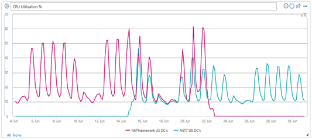
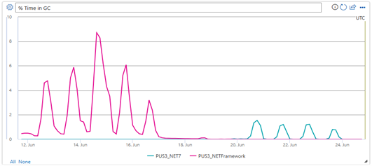
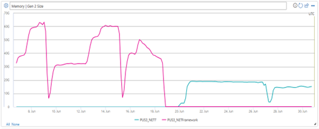
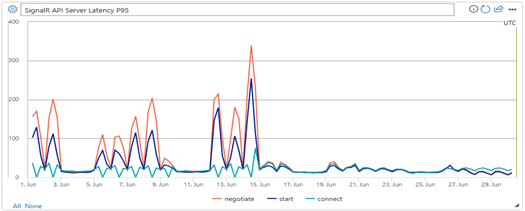

Real-Time Channel (RTC) is Microsoft Office Online's websocket service that powers the real-time collaboration experiences for Office applications. It serves hundreds of millions of document sessions per day from dozens of datacenters and thousands of server VMs around the world. 

The service was written in .NET Framework (4.7.2) with IIS and ASP.NET. It is mainly built around a SignalR service providing real-time communication and has additional functionality like routing, session management, and notifications. 

In April 2021, the service team made the decision to start the migration from from .NET Framework to  modern .NET  (at this time, it was .NET 5). The main motivation for the migration was **improving performance**, **reliability**, **cost (or COGS)**, and **modernizing the platform and code base** to reduce technical debt and increase engineering satisfaction. Two approaches were considered for the migration – a complete rewrite, or a lift-and-shift.

RTC's code is integrated into the entire Office Online code base, which uses a lot of common shared libraries across Office Online apps including Word, Excel, PowerPoint. Since there are so many other common libraries shared between apps, a complete rewrite did not make a lot of sense as the other libraries would need to be rewritten as well. It would not have been feasible for a single service team to undertake such a large platform rewrite. This left us with the "lift-and-shift" approach – meaning modifying the .NET Framework code base to compile against modern .NET.  While all at the same time using conditional compiler directives to write custom code in places where the .NET Framework code was not compatible with modern .NET.

Through the migration, we had some major highlights including:

* 30% reduction in CPU
* A corresponding 30% reduction in Virtual Machine COGS.
* 60% reduction in memory and GC time.
* Over 50% average decrease in latency for main APIs.

Now, let's get into some deeper details on the migration itself.

## Pre-migration Challenges

The first two migration challenges became apparent even before the work had started:

1. RTC (and all Office Online services) use ASP.NET’s Http Modules and Handlers. These concepts don’t exist in modern .NET and are replaced by middleware. As our approach is lift-and-shift of existing code, how can we use the existing Http Modules and Handlers without having to rewrite them as middleware?
2. ASP.NET Core SignalR server component is not backward compatible with ASP.NET Framework SignalR clients. Even if we do the migration to modern .NET, how can we support existing in-market legacy SignalR clients (especially on Windows applications, where older version need to be supported for many years)? This was our biggest challenge that put the migration at a major risk.

**Solutions:**

1. To continue using ASP.NET HTTP Modules and Handlers, we wrote an ASP.NET Core middleware that can dynamically load HTTP Modules and Handlers from DLLs and invoke their lifetime methods (such as `BeginRequest`, `EndRequest`, etc.) in order.
2. To solve this challenge, two design solution were evaluated:
    1. having the modern .NET and the .NET Framework servers running side by side for some number of years, with some bridging layer between them to allow SignalR clients of different versions to communicate with each other.
    2. write a custom in-process translation layer that would run in the modern .NET service, intercept legacy SignalR client requests and connections, and translate them to SignalR Core requests and message formats.

    The 2nd option (translation middleware) was preferable because it allowed us to completely move to modern .NET without having to keep the .NET Framework service supported and maintained for years.

    Since we only use a subset of the SignalR features, we wrote a middleware that intercepts ASP.NET SignalR connections and rewrites them to be compatible with ASP.NET Core SignalR. This would allow us to use ASP.NET Core SignalR while still allowing our legacy clients to connect, and will provide a seamless transition for new clients that will be using ASP.NET Core SignalR.

## Post-migration Challenges

The next set of challenges were only discovered after the modern .NET service was ready and deployed in Production and started taking some small percentage of the traffic. These were mostly scale and performance issues that could only be discovered when running in high scale:

1. **High CPU from IIS** - After converting our first few datacenters to modern .NET, we quickly noticed that modern .NET servers were running with up to 30% worse CPU utilization than our .NET Framework servers. This required some thorough investigation. The problem was traced to the use of expensive `CancelIoEx()` calls made by the IIS ASP.NET Core module whenever a websocket connection is closed.
The solution involved a workaround of manually closing the connection by calling `IISHttpContext.Abort()` ourselves, which cancels the pending async IO tasks without calling `CancelIOEx()`.
After this fix, we saw a 45% reduction in the process CPU (which makes it 30% better compared with the .NET Framework version of the service). It seems that this problem would be a performance issue for any high throughput ASP.NET Core websocket application on IIS. The ultimate solution to this issue that was recommended by the .NET team is to switch from IIS to Kestrel, which was in our future plan.
2. **High CPU from SignalR Core** – Another investigation into high CPU pointed to an issue in ASP.NET SignalR Core’s `OnDisconnectedAsync()` event. Whenever a connection is disconnected, SignalR iterates over the entire concurrent dictionary of groups that this connection needs to be removed from rather than removing just that group directly from the dictionary.
To address this issue, the solution was to remove the connection from the group manually upon disconnect, instead of having SignalR do it. This was possible thanks to the highly extensible SignalR Core and the use of a custom `HubLifetimeManager`. A GitHub issue was also opened to track the more permanent fix of this issue in the SignalR Core source code.

## Using Event Counters

One of the most useful tools that we found during the migration work was the use of Event Counters to track interesting metrics.

In modern .NET the traditional performance counters that were available in ASP.NET were replaced by Event Counters. These event counters provide a richer set of behavior and performance data points that allowed us to get a better understanding of our service.

We used the EventSource model to capture built-in .NET counters and emit them per-minute into our telemetry pipeline. Then we aggregated these data points and built visualizations that can be presented at the individual VM level, datacenter level, etc.

For example, we used the "active-timer-count" counter to track the number of System.Timer instances created by our process. We found that our websocket proxy module was unnecessarily creating a new timer per connection, even in our legacy .NET Framework version of the service that had been running for many years but never had this kind of counter available. By reducing the number of timers from linear to constant, we saved some significant CPU and lock time, both in the new modern .NET and in the old .NET Framework service.

Other interesting counters are in the HTTP stack (HTTP requests, HTTP queue size, DNS lookups, and many more), in the memory and GC usage, lock contention, and others. This granular view of the service behavior made it easier to investigate bugs and performance issues.

## Production Rollout

With the above solutions and customizations we reached a point where all metrics were satisfying and even exceeded our expectations, and the modern .NET version of RTC was ready to be rolled out fully in production.

Our original rollout launched with .NET 6 and we soon wanted to make the migration to .NET 7 to continue our investment in modern .NET and gain more performance to reduce our costs. During the migration from .NET 6 to ..NET 7,  we suddenly noticed a significant increase of 3x-4x in memory (Gen2) heap size.

The GC implementation in .NET 7 underwent a major refactoring and redesign compared to .NET 6 and prior versions. Our usage pattern of websockets, which heavily uses async pinned handles, was not optimal for the new GC implementation, and we had to use the extensibility option in .NET 7 to run with .NET 6’s GC module. This allowed us to keep the memory usage optimal, while still benefiting from the latest features of .NET 7 and above.

The rest of the production rollout was smooth, and here are some key metrics where we saw the greatest improvements. These improvements translate into both COGS savings, and better user experience:

CPU utilization – 30% decrease:

CPU time in GC – 60% decrease:

Memory usage – 60% decrease:

API latency – over 50% decrease:

## Next Stop: .NET 8!

The outcome of the migration to modern .NET exceeded our expectations, and we believe that it was a worthwhile investment that will benefit our service, our engineers, and our customers for years to come. We are not done with our journey in .NET, and are continuously looking for ways to improve our service and take advantage of the new features and capabilities that .NET offers. Now that .NET 8 is released, we are starting our migration to .NET 8. In addition, some of the areas that we are exploring and working on include:

* Moving Office client applications (web clients and desktop apps) from ASP.NET Framework SignalR to ASP.NET Core SignalR, letting us deprecate the custom translation middleware and benefit from the latest protocol improvements.
* Moving from IIS to Kestrel.

We hope that you enjoyed reading this post and found some useful information that will help you achieve more with modern .NET!
