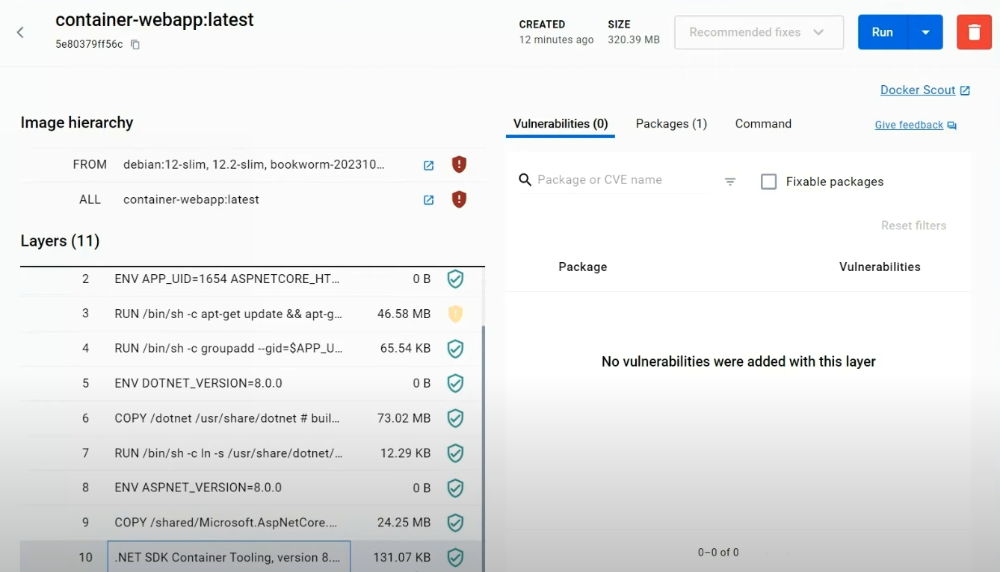
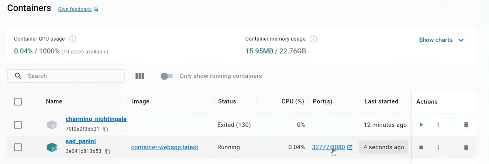

Containers are a popular way of packaging and distributing applications in today’s Cloud Native landscape – but what are they, and how can .NET developers integrate them into their workflows? Today, let's talk about what containers are, how they relate to Docker, and how the .NET tooling makes it easy for developers to easily streamline the process of creating containers with .NET.

## Containers with .NET For Beginners

Follow along with this blog and our new [Beginner's series](https://dotnet.microsoft.com/learn/videos) on containers and Docker for .NET.

<iframe width="800" height="450" src="https://www.youtube.com/embed/HA8rpDWMRq0?si=cWtkR5oKTaliO_ZC" title="YouTube video player" frameborder="0" allow="accelerometer; autoplay; clipboard-write; encrypted-media; gyroscope; picture-in-picture; web-share" allowfullscreen></iframe>

## What are Containers?

Containers are essentially the native language of the cloud. You'll find containers supported by all major cloud providers like Azure, AWS, Google, and more. These providers offer various ways to run your containers, ranging from simple options like AWS Lambda or Azure Functions to fully managed Kubernetes services.

Containers provide a flexible choice for application packaging, making it a valuable skill to master. That's why .NET invests in making containers easy to use for developers.

## The Benefits of Containers

So why should you use containers instead of a traditional virtual machine or an installable package? The answer lies in a uniform deployment and observability layer. By packaging your applications in containers, you gain access to a whole world of automated DevOps, tooling, alerting, and monitoring that would be hard to achieve otherwise. Containers make the job of maintaining and operating your services much easier in the long term.

## Developer Setup

You can use .NET SDK and CLI to create containers on any operating system, however I personally enjoy using the [Windows Subsystem for Linux](https://learn.microsoft.com/windows/wsl/install) on a new Ubuntu box with .NET 8 installed. The choice is yours however you enjoy developing. Additionally, having [Docker Desktop](https://docs.docker.com/desktop/) installed will enable you to run your containers after you create them with the .NET SDK.

## Making Containers with .NET

Now, let's take a look at just how easy it can be to create containers with .NET. To start, let's first create a new web app with the following .NET CLI command:

```bash
dotnet new web -o container-webapp
```

Then we can navigate to the new directory that it was created in:

```bash
cd container-webapp
```

You can now run the application locally with `dotnet run`, but let's go ahead and create a container by publishing the app with the following command:

```bash
dotnet publish -t:PublishContainer
```

By running a single command, you can create a container of your web app. This is the same `publish` command you're already familiar with for publishing your web application, but now it's being used for containerization. The .NET SDK will provide you with information about the container it just created, such as the container name, the tag, and the base image it chose.

Speaking of the base image, it's like the operating system and software configuration that your application will be deployed onto. In this example, as a web app targeting .NET 8, the SDK chose an ASP.NET image from Microsoft with the 8.0 tag. You will see output from the command similar to the following that highlights this:

```bash
Building image 'conainer-webapp' with tage 'latest' on top of hte base image 'mcr.microsoft.com/dotnet/aspnet:8.0'.
Pushed image 'conainer-webapp:latest' to local registry via 'docker'.
```

To get a closer look at the image we just built, we can use Docker Desktop. It's fascinating to see how the image is composed of different layers, each representing a portion of the file system or a change to the operating environment. These layers come together to create a runnable container.



And there you have it! We now have a running container running our web app when we access it.



## Next Steps: Deep Dive into Tooling & Publishing to the cloud

That wraps up our quick taste of containers and how .NET makes it easy to get started with them. This is only the first step, and I have a full beginner's series that dives deeper into the [tooling experiences available on the command line as well as in Visual Studio and Visual Studio Code](https://www.youtube.com/watch?v=qCxSYymD0ug&list=PLdo4fOcmZ0oXss45l49Q8h-Omuwo2FD-U&index=2&pp=gAQBiAQB). Then I go into how you can take your containers and [publish them to container registries](https://www.youtube.com/watch?v=21zduERRS3M&list=PLdo4fOcmZ0oXss45l49Q8h-Omuwo2FD-U&index=3&pp=gAQBiAQB). In addition, we have [full training on Microsoft Learn](https://aka.ms/learn-microservices) for containers, microservices, and cloud-native development with .NET that I highly recommend you checkout.

Thanks for joining me on this introduction to containers with .NET.
