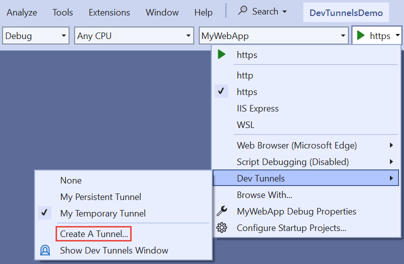
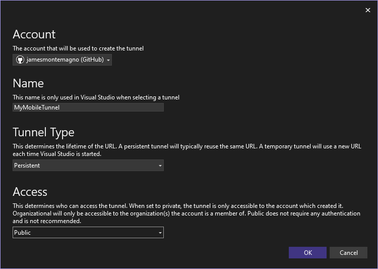
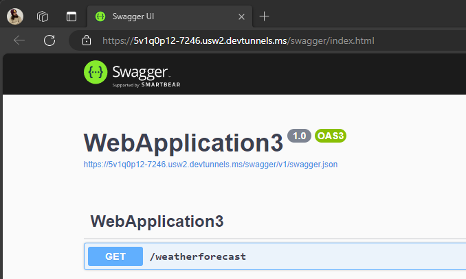

Are you a mobile application developer who faces challenges when building a back end for your apps? If you're using .NET, particularly ASP.NET Core, then you've probably encountered the issue of debugging locally on your machine versus using emulators or physical devices. But fear not, because Visual Studio 2022 has introduced a great feature called Dev Tunnels that change your development process forever!

<iframe width="800" height="450" src="https://www.youtube.com/embed/NPJhrftkqeg?si=d8u89WjC856Z3WWY" title="YouTube video player" frameborder="0" allow="accelerometer; autoplay; clipboard-write; encrypted-media; gyroscope; picture-in-picture; web-share" allowfullscreen></iframe>

## The Problem: Localhost vs Emulators/Devices

When you're developing mobile applications, having a smooth debugging experience is crucial. However, things can get a little tricky when you need to test your app on emulators or physical devices. These devices have their own network stack and often can't directly communicate with your local machine. This becomes a roadblock when trying to access the local back end of your app running on localhost. While it is possible, it is quiet a bit of work to [get setup](https://learn.microsoft.com/dotnet/maui/data-cloud/local-web-services) and maintain as you work with several services. 

## Enter Dev Tunnels

[Dev Tunnels](https://learn.microsoft.com/aspnet/core/test/dev-tunnels) is a game changer for mobile developers and even web developers. It provides a solution to the problem mentioned above by creating a unique URL that acts as a loopback to your local machine. This URL is accessible from the internet, allowing you to expose localhost to emulators, devices, or even share it with others. It has several authentication and access options based on what your requirements are.

## Setting Up Dev Tunnels in Visual Studio 2022

Dev Tunnels was officially released with Visual Studio 2022 v17.6, so simply update to the latest version and you are ready to go. You can setup a new Dev Tunnel from the debug dropdown menu inside of Visual Studio to configure it for the active project, or from **View > Other Windows > Dev Tunnels**.

Upon opening the Dev Tunnels window, you'll see options to create tunnels. You can choose a name for the tunnel, specify its lifespan (persistent or temporary), and decide whether it should be private, organizational, or public. The public option allows the tunnel to be accessed by anyone on the internet with the URL. 

After creating a tunnel, run the backend and you'll be provided with a unique URL for your local back end. You can also open the Dev Tunnels window, to see all of your tunnels and change configurations. 

Now test out your API, call it from your mobile app, or debug it with a colleague. Set a breakpoint in your API and when the API is called it will get hit because the tunnel is talking to your local machine.

## How I Use Dev Tunnels with .NET MAUI

Suppose you have an ASP.NET Core web API back end running on your local machine and a .NET MAUI application that needs to communicate with this back end. With Dev Tunnels, you can easily expose localhost to the internet and interact with your back end from emulators or devices.

By running the ASP.NET Core back end and creating a Dev Tunnel, you'll be assigned a unique URL. You can then use this URL in your .NET MAUI application to connect to the back end. Whether you're using an Android emulator, an iOS device, or any other platform, Dev Tunnels will allow you to seamlessly debug and access your back end.

## Other Use Cases for Dev Tunnels

Dev Tunnels isn't limited to just mobile application development. It can also be utilized for debugging Azure functions, sharing local web projects with colleagues, build Teams apps, and much more. The flexibility and convenience it offers make it a valuable tool for developers working with various technologies.

## Beyond Visual Studio with the Dev Tunnels CLI

No Visual Studio? No Problem? [Dev Tunnels](https://learn.microsoft.com/azure/developer/dev-tunnels/) have a full CLI that can run everywhere enabling unique scenarios from your favorite code editors and more.

<iframe width="800" height="450" src="https://www.youtube.com/embed/doUDcQNoy38?si=7-CjbS1oJN-wotBG" title="YouTube video player" frameborder="0" allow="accelerometer; autoplay; clipboard-write; encrypted-media; gyroscope; picture-in-picture; web-share" allowfullscreen></iframe>

## Conclusion

Dev Tunnels in Visual Studio 2022 have revolutionized how I debug my applications and I think it will for you as well. By providing a unique URL that acts as a tunnel to your local machine, you can easily expose localhost and access your back end from emulators or devices. This feature brings convenience and efficiency to the development process, allowing for seamless testing and debugging.

So, why not give Dev Tunnels a try? Get the latest version of Visual Studio 2022, create your own tunnels, and experience the benefits firsthand. Share your thoughts in the comments below and let us know how Dev Tunnels have enhanced your development workflow. Happy coding!

🚀✨📱👩‍💻👨‍💻
