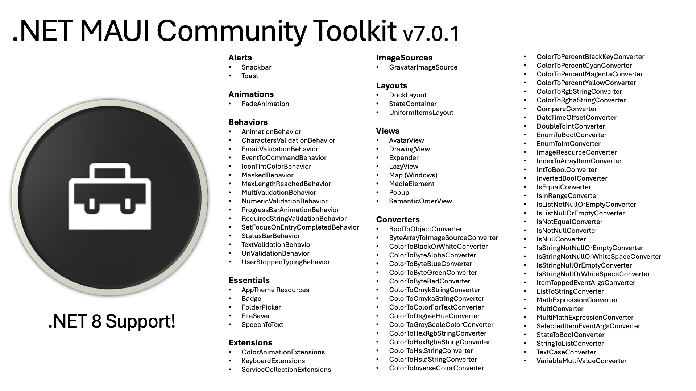
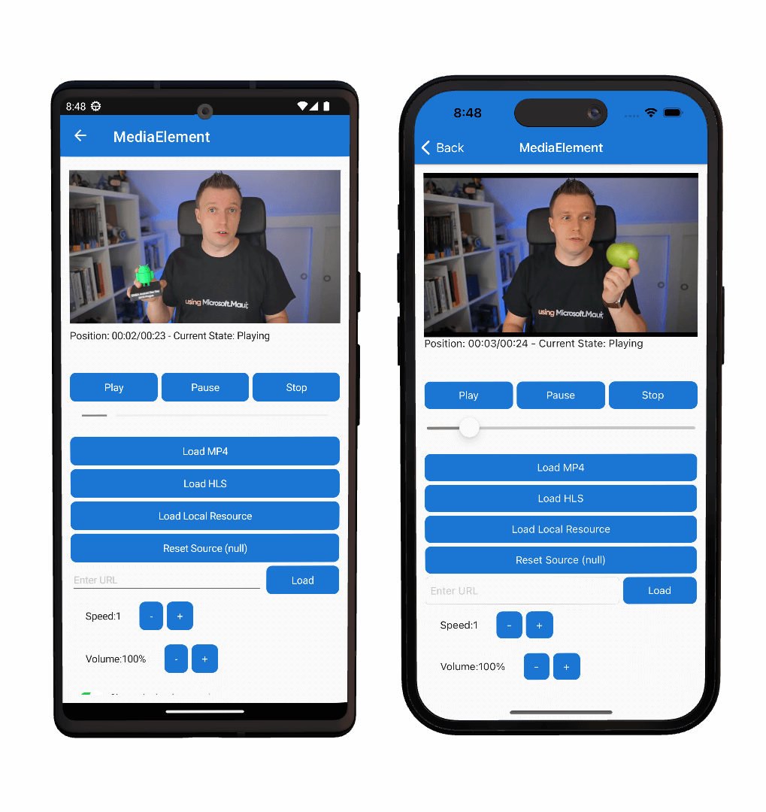
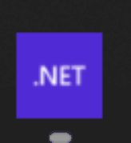
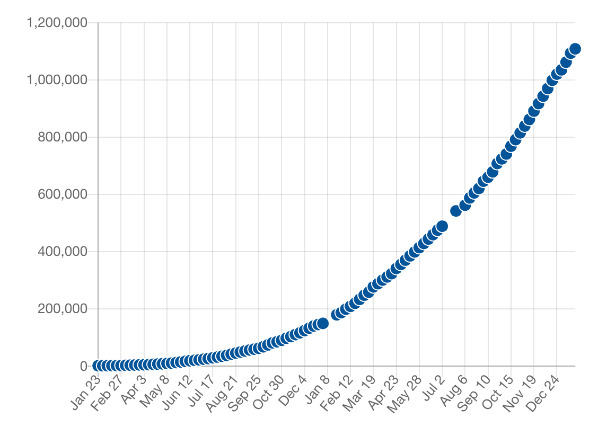

With 2023 behind, let's take a moment to reflect on the journey of the [.NET MAUI Community Toolkit](https://learn.microsoft.com/dotnet/communitytoolkit/maui/) project and what is next. This open-source library serves as a companion to [.NET MAUI](https://dotnet.microsoft.com/apps/maui), offering developers a rich set of controls, converters, and helpers designed to accelerate app development on the .NET MAUI platform. With a focus on community-driven innovation, it has become an indispensable tool for developers looking to enhance their .NET MAUI applications.

## The year that was

Our [GitHub repository](https://github.com/CommunityToolkit/Maui) has evolved into a dynamic hub of activity, engaging over 40 contributors who have collectively pushed the project forward. Your feedback, suggestions, and code contributions have been instrumental in shaping the toolkit into a more powerful and efficient resource for .NET MAUI developers.

### By the numbers

- **9 Releases**: Marking consistent progress, we launched 9 significant releases, each adding more value and capabilities to the toolkit.
- **260 Commits**: With every commit, we've enhanced and expanded the toolkit's functionalities.
- **521 Files Changed**: Reflecting our progress, we've updated, improved, and optimized 521 files to ensure the highest quality standards.
- **41 Contributors**: A big shout out to our active community members! Your diverse perspectives and expertise have been vital to our collective success.
- **Top 5 Committers**: Special recognition goes to brminnick, VladislavAntonyuk, jfversluis, pictos, and cat0363. Your dedication and contributions have been exemplary.
- **4,190 Repositories Depend on Us**: A testament to our growing influence, over 4,190 repositories now rely on the CommunityToolkit.Maui.
- **679,767 Downloads from NuGet**: An impressive number number of downloads this year signify the widespread adoption and trust in our toolkit.

### Notable Additions

Apart from the huge number of bug fixes, we have also added substantial capabilities during 2023, here’s a glimpse at the key new features we've integrated:

- **[Media Element](https://learn.microsoft.com/dotnet/communitytoolkit/maui/views/mediaelement)**: Dive into a multimedia experience with our new Media Element control. Whether you're streaming from the web, tapping into embedded resources, or accessing local files, this control seamlessly plays video and audio content within your .NET MAUI applications.

- **[Windows Maps Integration](https://learn.microsoft.com/dotnet/communitytoolkit/maui/views/map)**: Our mapping integration brings the power of .NET MAUI maps directly to the Windows platform, enhancing location-based services in your apps.
- **[SpeechToText & Speech Recognition](https://learn.microsoft.com/dotnet/communitytoolkit/maui/essentials/speech-to-text)**: Unleash the potential of voice with our SpeechToText and Speech Recognition capabilities. Interact and command your applications through spoken language, opening a new dimension of accessibility and convenience. Learn more about it in this [blog post](https://devblogs.microsoft.com/dotnet/speech-recognition-in-dotnet-maui-with-community-toolkit/).

[video width="1920" height="1080" mp4="https://devblogs.microsoft.com/dotnet/wp-content/uploads/sites/10/2023/05/SpeechToTextWindows.mp4"][/video]

- **[FolderPicker](https://learn.microsoft.com/dotnet/communitytoolkit/maui/essentials/folder-picker) and [FileSaver](https://learn.microsoft.com/dotnet/communitytoolkit/maui/essentials/file-saver)**: Take file management to the next level. The FolderPicker allows users to effortlessly navigate and select directories, while the FileSaver grants the freedom to choose a destination folder and save files with ease.

[embed]https://devblogs.microsoft.com/dotnet/wp-content/uploads/sites/10/2023/02/FileSaverMacCatalyst.mp4[/embed]

- **[Keyboard Extensions](https://learn.microsoft.com/dotnet/communitytoolkit/maui/extensions/keyboard-extensions)**: Gain control over the on-screen keyboard. Check its visibility, dismiss it, or summon it at will, ensuring a smoother, more intuitive keyboard experience in your .NET MAUI apps.
- **[Badge API](https://learn.microsoft.com/dotnet/communitytoolkit/maui/essentials/badge)**: Introducing the Badge API – your simplest solution to display notification counts on your app icons. Keep your users engaged and informed with just a glance.

- **[App Theming APIs](https://learn.microsoft.com/dotnet/communitytoolkit/maui/essentials/apptheme-resources)**: We've enriched the default .NET MAUI theming capabilities, making it easier for you to customize and theme your applications, creating a more immersive and brand-aligned user interface.
- **.NET 8 Support**: Embracing the future, we proudly support .NET 8, ensuring that your applications benefit from the latest improvements, security, and performance enhancements that the framework has to offer.

## But there’s more

The .NET MAUI Community Toolkit, extends beyond the primary NuGet package, we are also proud of the [our documentation](https://learn.microsoft.com/dotnet/communitytoolkit/maui/) housed in our Docs repository and the versatile .NET [MAUI Markup](https://github.com/CommunityToolkit/Maui.Markup) package for developers inclined towards a non-XAML approach. Both these pillars of the toolkit have been receiving consistent updates, highlighted by:

**Docs Repository**:

- Commits: 192
- Contributors: 25
- Top 5 Committers: bijington, jfversluis, brminnick, Sergio0694, VladislavAntonyuk

**MAUI Markup Repository**:

- Commits: 104
- Contributors: 9
- Top 5 Committers: brminnick, Youssef1313, bijington, VladislavAntonyuk, JoonghyunCho

Adding to this vibrancy, the .NET MAUI Community Toolkit proudly celebrates a remarkable milestone of over 1 million total downloads, a testament to its reliability, robustness, and the trust it has garnered within the developer community. 

This feat accentuates the toolkit's role as an essential asset in the .NET MAUI ecosystem, continuously evolving to empower developers to build incredible cross-platform applications.

## Heartfelt Gratitude

We would like to extend our deepest gratitude and thanks to every contributor, user, and supporter who has journeyed with us this past year. Your enthusiasm and commitment have fueled our progress.

## Looking Forward and a Call to Action

As we look forward to another year of innovation in 2024, we invite you to join us in shaping the future of the .NET MAUI Community Toolkit. If your New Year's resolution is to contribute to open-source projects, there's no better place to start than right here. Whether you're fixing bugs, proposing new features, improving documentation, or sharing your expertise in discussions, your contribution will make a meaningful impact. Join our vibrant community and turn your resolution into action!

Thank you for making 2023 a landmark year for the .NET MAUI Community Toolkit. Let's continue breaking new ground and driving community-driven development together!

Happy Coding!
