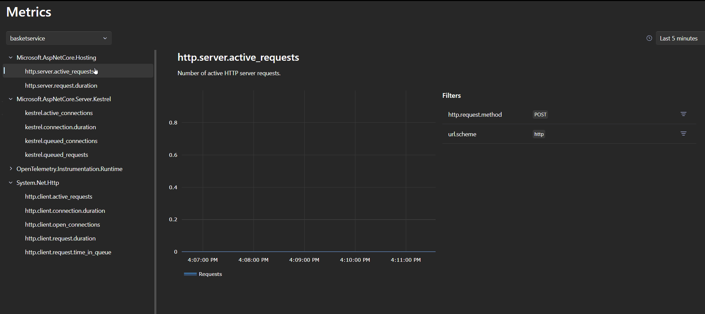

Metrics report diagnostics about your app. .NET 8 adds over a dozen useful metrics to ASP.NET Core:

* HTTP request counts and duration
* Number of active HTTP requests
* Route matching results
* Rate limiting lease and queue durations
* SignalR transport usage
* Low-level connection and TLS usage from Kestrel
* Error handling diagnostics
* And more

Metrics are numerical measurements reported over time. For example, each HTTP request handled by ASP.NET Core has its duration recorded to the `http.server.request.duration` metric. Tooling such as the [.NET OpenTelemetry SDK](https://github.com/open-telemetry/opentelemetry-dotnet#opentelemetry-net) can then be configured by an app to export metric data to a telemetry store such as [Prometheus](https://prometheus.io/) or [Azure Monitor](https://learn.microsoft.com/azure/azure-monitor/overview). Metrics are part of the OpenTelemetry standard and all modern tools support them.

Metrics data are useful when combined with tooling to monitor the health and activity of apps:

* Display graphs on a dashboard to observe your app over time. For example, view activity from people using the app.
* Trigger alerts in real-time if the app exceeds a threshold. For example, send an email if request duration or error count exceeds a limit.

## Using metrics

[ASP.NET Core's built-in metrics](https://learn.microsoft.com/dotnet/core/diagnostics/built-in-metrics-aspnetcore) are automatically recorded. How you use these metrics is up to you. Let's explore some of the options available.

### .NET Aspire dashboard

[.NET Aspire](https://learn.microsoft.com/dotnet/aspire/get-started/aspire-overview) is an opinionated stack for building observable, distributed applications. The Aspire dashboard includes a simple, user-friendly UI for viewing structured logs, traces and metrics. Aspire apps are automatically configured to send telemetry data to the dashboard during development.

Here you can see a collection of available metrics, along with name, description, and a graph of values. The Aspire UI includes metrics filters. Filtering is possible using a powerful feature of metrics: attributes.

Each time a value is recorded, it is tagged with metadata called attributes. For example, `http.server.request.duration` records a HTTP request duration along with attributes about that request: server address, HTTP request method, matched route, response status code and more. Attributes can then be queried to get the exact data you want:

* HTTP request duration to a specific endpoint in your app, e.g. `/product/{name}`.
* Count the number of requests with `4xx` HTTP response codes.
* View request count that threw a server exception over time.
* HTTP vs HTTPS request duration.
* Number of visitors using HTTP/1.1 vs HTTP/2.

### ASP.NET Core Grafana dashboards

[Grafana](https://grafana.com/grafana/) is powerful open-source tool for building advanced dashboards and alerts. It allows you to create interactive, customizable dashboards with a variety of panels, graphs, and charts. Once complete, a dashboard displays data from your telemetry store. Grafana is a good choice to monitor apps deployed to production and a dashboard gives a real-time view of an app health and usage.

Grafana gives you the power to build exactly what you want, but it takes time to build high-quality dashboards. As part of adding metrics in .NET 8, the .NET team created pre-built dashboards designed for ASP.NET Core's built-in metrics.

The ASP.NET Core Grafana dashboards are [open source on GitHub](https://aka.ms/dotnet/grafana-source) and available for [download on grafana.com](https://aka.ms/dotnet/grafana-dashboards). You can use the dashboard as they are or customize them further to build a solution tailored to your needs.

Quickly try out Grafana + ASP.NET Core using the [.NET Aspire metrics sample app](https://learn.microsoft.com/samples/dotnet/aspire-samples/aspire-metrics/).

### And more

* Metrics aren't limited to what is built into .NET. You can [create custom metrics](https://learn.microsoft.com/dotnet/core/diagnostics/metrics-instrumentation#create-a-custom-metric) for your apps.
* [dotnet-counters](https://learn.microsoft.com/dotnet/core/diagnostics/dotnet-counters) is a command-line tool that can view live metrics for .NET Core apps on demand. It doesn't require setup, making it useful for ad-hoc investigations or verifying that metric instrumentation is working.
* Use metrics in [unit tests](https://learn.microsoft.com/aspnet/core/log-mon/metrics/metrics#test-metrics-in-aspnet-core-apps). ASP.NET Core integration testing, `MetricCollector` and `IMeterFactory` can be combined to assert values recorded by a test.

## Try it now

.NET 8, ASP.NET Core Grafana dashboards and .NET Aspire (preview) are available now. Try using metrics today and let us know what you think:

* [Download the latest .NET 8 release](https://dotnet.microsoft.com/download/dotnet/8.0).
* Use metrics in your tool of choice:
  * Learn more about the [.NET Aspire dashboard](https://learn.microsoft.com/dotnet/aspire/fundamentals/dashboard) and [get started](https://learn.microsoft.com/dotnet/aspire/get-started/build-your-first-aspire-app).
  * Download [ASP.NET Core Grafana dashboards](https://aka.ms/dotnet/grafana-dashboards).
  * Install [`dotnet-counters`](https://learn.microsoft.com/dotnet/core/diagnostics/dotnet-counters) command-line tool.

Thanks for trying out .NET 8 and metrics!
