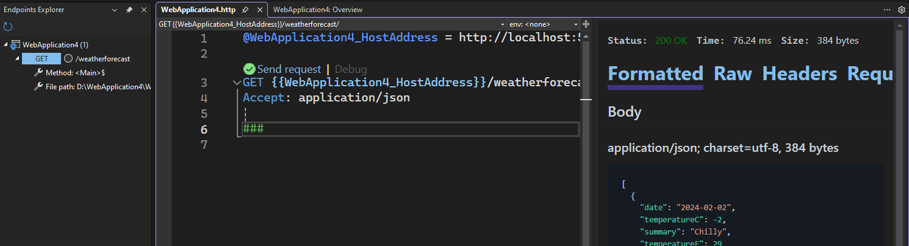
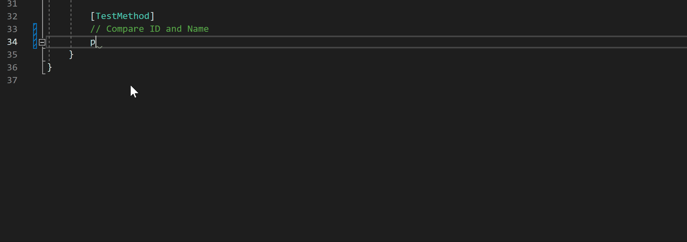
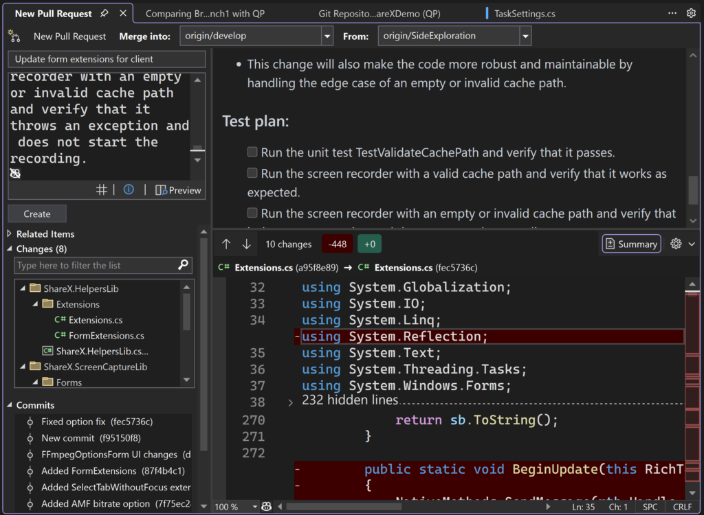
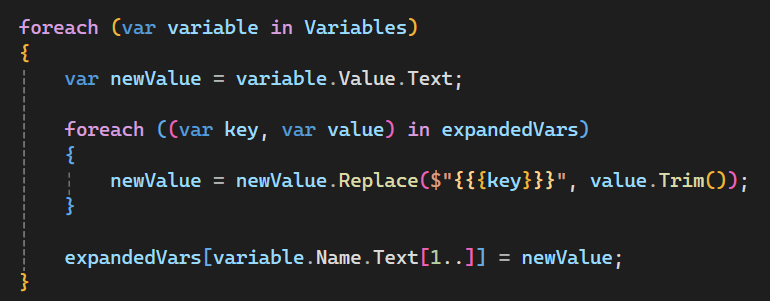
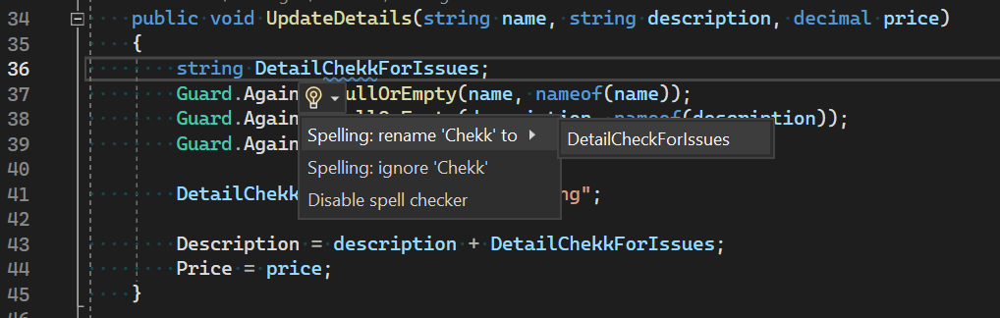
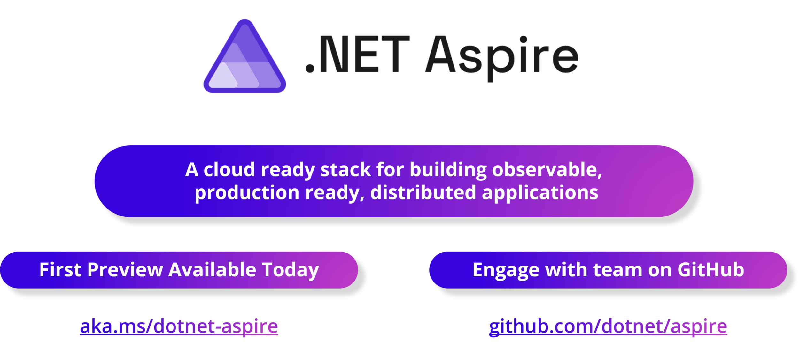
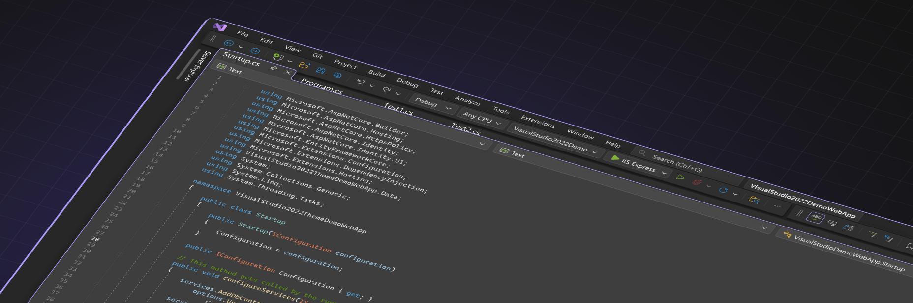

[Visual Studio 2022](https://visualstudio.com) saw an abundance of incredible features released in 2023, which gave .NET developers a host of new tools to enhance their productivity. With so many to choose from, I've hand-picked a selection that includes editor improvements, productivity updates, and AI assistance. Let's explore some of the most impactful features that have become integral to my daily development routine.

## 1. Dev Tunnels

[Dev Tunnels](https://learn.microsoft.com/azure/developer/dev-tunnels/) are a game-changer for developers who need to expose their local development server to the internet. It provides a unique URL that directly tunnels to your local machine. This feature is invaluable for scenarios like mobile development where you need to test your backend on various devices and have them all communicate with your local server seamlessly.

- Expose your Local Host development server with a unique URL.
- Useful for mobile development, allowing devices to connect to your local machine.
  
<iframe width="800" height="450" src="https://www.youtube.com/embed/yBiOGgUFD68?si=V3QxLmCS9yNzrKNv" title="YouTube video player" frameborder="0" allow="accelerometer; autoplay; clipboard-write; encrypted-media; gyroscope; picture-in-picture; web-share" allowfullscreen></iframe>

## 2. HTTP Files & Endpoint Explorer

[HTTP files and Endpoint Explorer](https://learn.microsoft.com/aspnet/core/test/http-files) are a dynamic duo that supercharge API development and testing within Visual Studio. Whenever you create a web API, it adds an HTTP file where you can make requests and see real-time responses. This is complemented by the Endpoint Explorer, which offers a visual representation of all active endpoints in your app, allowing you to generate requests and streamline your workflow.

- HTTP files let you interact with your web API using real-time requests and responses.
- Endpoint Explorer provides a visual tool to see and interact with all API endpoints.
  

## 3. GitHub Copilot & GitHub Copilot Chat

[GitHub Copilot and Copilot Chat](https://visualstudio.microsoft.com/github-copilot/) have been amazing for developers seeking AI-powered assistance. Copilot suggests code snippets while you type, using the context of your application to offer relevant recommendations. Copilot Chat allows you to communicate with the AI to get more detailed assistance on coding challenges.

- GitHub Copilot provides code suggestions in real-time.
- Copilot Chat enables conversation with AI for coding help.
  

Released as a separate extension with subscripion you can easily install and start your free trial to test it out today.

## 4. Git & PR Enhancements

Visual Studio 2022 has made significant strides with integrated [Git features](https://devblogs.microsoft.com/visualstudio/a-year-of-making-you-more-productive-using-git-in-visual-studio/) simplifying the code commit and collaboration process. Developers can now perform Git tasks such as branch creation, commits, and pull requests right from the IDE, streamlining the process of code repository management.

- Create and manage Git repositories with integrated UI.
- Link commits to GitHub issues for better collaboration.
- Built-in pull request creation and review within Visual Studio.
  

## 5. Brace Colorization

This feature adds a [splash of color](https://devblogs.microsoft.com/visualstudio/adding-color-to-bracket-pairs/) to your code by differentiating brace pairs with unique colors. This small but powerful feature can significantly improve code readability by making it easier to visually match opening and closing braces, especially in nested structures.

- Colors differentiate brace pairs at various nesting levels.
- Improves readability and aids in quickly identifying matching pairs.
  

## 6. Spell Check

One of my most awaited editor improvements that came in Visual Studio 2023 is the built-in [spell checker](https://devblogs.microsoft.com/visualstudio/visual-studio-spell-checker-preview-now-available/). It is a handy tool that would have saved me from an infamous typo I made early in my career, where I misspelled "shield" throughout the entire source code for two years before it was caught. This spell checker works similarly to those found in word processors like Word or Google Docs and can be toggled on and off easily. Just look for the "ABC" icon with a check in the toolbar.

### How It Works
- The spell checker detects misspelled words and underlines them with blue squiggles.
- You can choose to ignore the suggestion, disable spell checking, or replace the misspelled word with the correct one from the context menu.
- The spell checker is highly beneficial for maintaining accuracy in code comments and string literals.
- Customizable by creating a custom dictionary of words to exclude in your `.editorconfig` file.

## 7. Accessibility Checker

Creating accessible applications is imperative, and Visual Studio's new [Accessibility Checker](https://devblogs.microsoft.com/visualstudio/developing-accessible-apps-with-visual-studio/) makes this task much easier. This tool helps developers identify and fix common accessibility issues within their apps, ensuring they're usable by everyone.

### How It Works
- Start debugging your WPF application and click on "Scan for accessibility issues" to run the checker.
- The tool will highlight any accessibility errors, like null property names, allowing you to fix them directly from the results.

<iframe width="800" height="450" src="https://www.youtube.com/embed/fQShLpg5bec?si=zrpIu4Rk97dT3ksR" title="YouTube video player" frameborder="0" allow="accelerometer; autoplay; clipboard-write; encrypted-media; gyroscope; picture-in-picture; web-share" allowfullscreen></iframe>

## .NET Aspire Support

Visual Studio 2023 introduces [.NET Aspire orchestration](https://learn.microsoft.com/dotnet/aspire/fundamentals/setup-tooling?tabs=visual-studio), a preview feature that simplifies cloud-native development. With the integration of .NET Aspire tools inside Visual Studio, developers can quickly scaffold solutions that are cloud-ready, integrating health checks, service discovery, and resiliency.

### Getting Started
- You can create a new .NET Aspire project from the templates provided
- Add Aspire components to existing projects.
- The template setups provide support for service defaults, tracing metrics, and more.

## 9. UI Refresh

The [UI Refresh](https://devblogs.microsoft.com/visualstudio/the-visual-studio-ui-refresh-preview-is-here/) is an absolute delight to see, bringing subtle updates that elevate the overall user experience. The refresh includes more modern UI elements like floating tabs and rounded corner radii, along with new themes.

## 10. C# Dev Kit for Visual Studio Code

C# Dev Kit borrows some familiar concepts from Visual Studio to bring a more productive and reliable C# experience to VS Code. This approach ensures a great experience whether you're quickly editing a C# file, learning C#, or debugging a backend API. The C# Dev Kit consists of a set of VS Code extensions that work together to provide a rich C# editing experience, AI-powered development, solution management, and integrated testing. As shown in the following graphic, C# Dev Kit consists of:

* The [C# extension](https://marketplace.visualstudio.com/items?itemName=ms-dotnettools.csharp), which provides base language services support and continues to be maintained independent of this effort.
* [C# Dev Kit](https://marketplace.visualstudio.com/items?itemName=ms-dotnettools.csdevkit) extension, which builds from the foundations of Visual Studio to provide solution management, templates, and test discovery/debugging.
* The [IntelliCode for C# Dev Kit extension](https://marketplace.visualstudio.com/items?itemName=ms-dotnettools.vscodeintellicode-csharp) (optional), which brings AI-powered development to the editor.

<iframe width="800" height="450" src="https://www.youtube.com/embed/F_xe0TvXGu0?si=PCTvxkge1NEjq0Vk" title="YouTube video player" frameborder="0" allow="accelerometer; autoplay; clipboard-write; encrypted-media; gyroscope; picture-in-picture; web-share" allowfullscreen></iframe>

## Summary

There is so much to love in Visual Studio 2022, what are your favorite features? Let us know in the comments! For a deeper dive into any of these, you can check out the [Visual Studio Blog](https://devblogs.microsoft.com/visualstudio/) which is an excellent resource to stay up to date with the latest features. Want to see some of these features in action? Check out my [Top 10 video](https://www.youtube.com/watch?v=jBUTT7s6zC0):

<iframe width="800" height="450" src="https://www.youtube.com/embed/jBUTT7s6zC0?si=EKYDBGU4DGtktOi8" title="YouTube video player" frameborder="0" allow="accelerometer; autoplay; clipboard-write; encrypted-media; gyroscope; picture-in-picture; web-share" allowfullscreen></iframe>

Stay tuned for more updates and happy coding!
