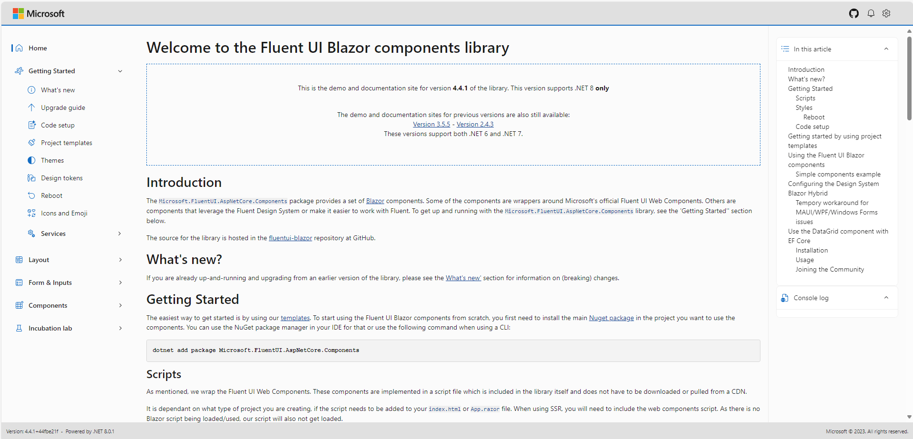
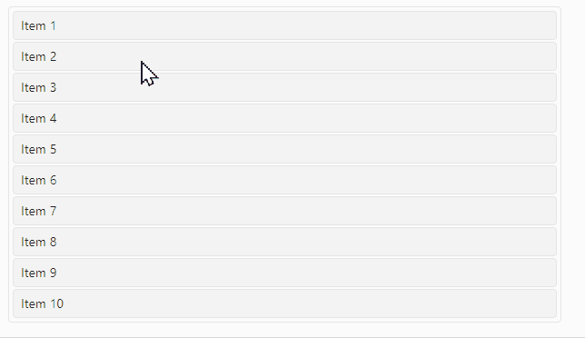
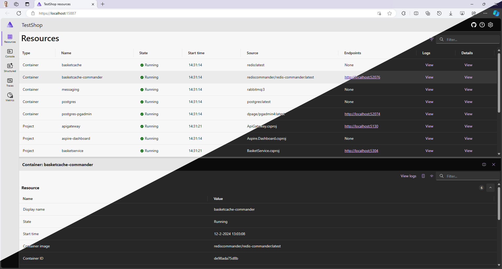

It almost seems like a title from the popular movie series, but we are not movie creation material (yet). In this post I will talk about the Fluent UI Blazor library. Where did it come from, what are the building blocks and how do they work together? Lets give the main characters of the library a proper introduction. As they do in movies, in order of appearance...

## FAST

Simply put, FAST is a collection of technologies built on Web Components and modern Web Standards. Within Microsoft, FAST is built by a team of UX engineers and designers who want to solve UX challenges by using standard web technologies.  

FAST is not one of the many typical front-end frameworks such as React, Angular or Vue. Instead of focusing on an “all-in-one SPA framework”, FAST aims to make the creation of web components possible and easier. As a result, web components built with FAST can be used together with virtually any front-end framework.
  
### Web Components

Web Components is an umbrella term that refers to a collection of web standards aimed at creating custom HTML elements. Some of the standards that are under this umbrella are:

- the ability to define new HTML tags,
- plugging into a standard component lifecycle,
- encapsulate HTML rendering,
- CSS encapsulation and parameterization
  
Each of these functionalities is defined and standardized by the W3C and is supported by every modern browser. FAST has not built its own component model, but uses the aforementioned W3C Web Component standards. This makes it possible for components built with FAST to function in the same way as built-in, normal HTML elements.

It is not necessary to use a framework to work with FAST components, but you can (and should). Combining them with the desired framework or library will almost always be easier. Since the beginning of 2020, there has been a broad adoption of web components. Not only Microsoft is investing heavily in the technology, but Google, Adobe, Salesforce, SAP, MIT, SpaceX, and many others are doing the same. For more information, see <https://www.fast.design/>.
  
## Fluent

Fluent is the design system that Microsoft uses for all its modern applications, both for the web and for Windows (OS and applications). The origin of Fluent can be found in “Metro”, the design system used for the Zune music player and Windows Phone devices (yeah, I still miss them too!). The system contains guidelines for the designs and interactions used within software. It has a foundation which is formed by five key components: light, depth, motion, material, and scale. Recently, the latest version, Fluent 2, was released. For more information, see <https://fluent2.microsoft.design/>.
  
## The Fluent UI Web Components

The FAST team has built an implementation of the Fluent design system with the building blocks developed by them. These are the Fluent UI Web Components. As described above, these components are framework agnostic and can be used in any modern browser. To make everyone’s life a little easier, a front-end framework is almost always used. And one of those frameworks they can be used with is Blazor.
  
## Blazor

Blazor is Microsoft’s framework for building interactive web applications with .NET. Developers build interactive UIs using C# instead of JavaScript. Code can be executed both client-side and server-side and, via MAUI, even run (natively) on iOS, Android, and Tizen devices.
  
The client-side execution uses a WebAssembly implementation of the .NET runtime to run the code in the browser. WebAssembly, or WASM, is a widely embraced standard and is supported by all modern browsers. As an optimization, the runtime can just-in-time (JIT) compile your app code to WebAssembly. For even better performance an ahead-of-time compilation (AOT) of your code to WebAssembly could be used instead.
  
When Blazor is executed server-side, a Signal-R connection is established over which the required interface updates are sent. Because only the differences between the old and new situation are sent, the messages are quite small. A modern server can easily support between 5-10 thousand simultaneous connections.
  
Blazor is a component-based framework. Each component can function independently, but by placing them in a hierarchy, it is also possible to make components communicate with each other. What is ultimately rendered on the screen is again just standard HTML and CSS (and sometimes a little JavaScript). Combining Blazor and web components is therefore certainly a possibility.
  
## The script: how can we make them act together?

So now that the stage has been set and the main characters, being the Fluent UI Web Components (built on FAST) and Blazor, are known, what role does the library play in making them act together? For the initial version of the library the goal was set to simply offer a Blazor 'wrapper' for each Fluent UI Web Component. A wrapper meaning here to 'just' create a Blazor component that renders a web component, using the same names, parameters and enumerations as the web component but in Razor syntax and with the C# language.

That goal was achieved around the end of 2021. Version 1 of the library was released by the FAST team around the same time as .NET 6.0, containing about 40 different components and accompanied by a demo and documentation site. The current version of that site, featuring a lot more examples and documentation and a lot more components than those first 40, can be found at <https://www.fluentui-blazor.net>.

  
In the meantime, the library can be described as quite successful. At the time of writing this article, the combined NuGet packages downloads counter has almost reached the 1.1 million mark.

A frequently asked question we received after the v1 release was whether the library could deliver more components. Especially components that make it easier to build an application that follows the Fluent design system. The original goal of the library to only offer wrappers for the Web Components, made expansion difficult. It was therefore decided (in consultation with the Microsoft FAST and ASP.NET Core Blazor teams) to move the development and ownership of the library away from the FAST team. Of course, we continue to work closely together with the FAST team and work has already begun to test and wrap the next version of the Fluent UI Web Components (which are based on Fluent 2).

> A note on ownership and support: The Fluent UI Blazor library is at the moment a pure open source project. It is **not** an official part of ASP.NET Core, which means it’s **not** officially supported and isn’t committed to ship updates as part of any official .NET updates. It is built and maintained by Microsoft employees (and other contributors) and offers support, like most other open source projects, on a best effort base through the GitHub repository only (so not through support.microsoft.com).
  
After becoming a pure open source project, we released a big additional set of new components with the version 3 release. The number of components keeps growing with each (minor) version and we are now delivering almost 70 of them in the library's package. These are not only just wrappers of the Fluent UI Web Components anymore. Some are pure Blazor components that leverage the Fluent Design System for their user interface, others make it easier to work with Fluent design in your application. We even created a couple of our own web components! Simultaneously with the release of .NET 8 last November, version 4 of the library was released. To clearly signify we are now independent from the FAST team (and a bit closer to the Blazor team), the (base)name for the packages has been changed from `Microsoft.Fast.Components.FluentUI` to `Microsoft.FluentUI.AspNetCore.Components`.

  
If the library and project being pure open source worries you because of maturity, longevity or support, know that Microsoft itself believes in its future and is using the library in a couple of projects already. If you started exploring the new .NET Aspire workload and you visited its [Dashboard](https://github.com/dotnet/aspire/tree/main/src/Aspire.Dashboard), you can see the components in action. The dashboard is built with Blazor and is using the library for building its user interface. Besides Aspire, the library is also leveraged by the [Visual Studio Teams Toolkit](https://learn.microsoft.com/microsoftteams/platform/toolkit/toolkit-v4/teams-toolkit-fundamentals-vs) which makes it simple to get started with app development for Microsoft Teams using Visual Studio.

  
## The beginning of a new series?

Just like the movie industry, we love sequels. We already have a number of changes in mind for the next versions. Of course, we also want to hear from our users what they would like to see added and/or changed. Join the discussion in our [GitHub repository](https://github.com/microsoft/fluentui-blazor).

Again, as they say in the movies: To be continued...
