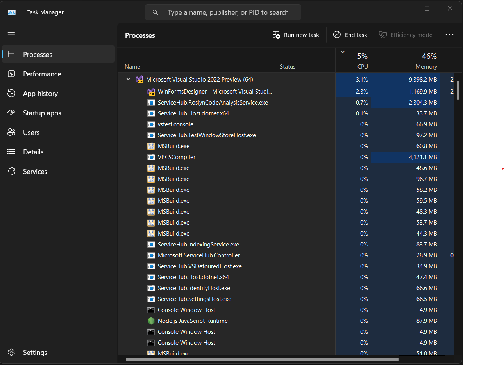
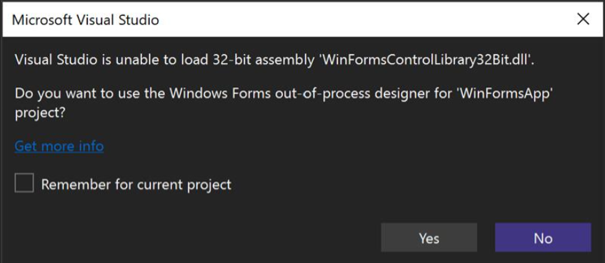

As a part of a community that thrives on innovation and growth, WinForms
developers are often pushing boundaries to create new possibilities. Our
developers are also responsible for the maintenance of mission critical line of
business software, often well over a decade in the making. We value your trust
and your passion for creating excellent software solutions with our tools. As
you may be aware, the transition from 32-bit to 64-bit in Visual Studio 2022 has
resulted in some complexities. We are aware that these changes are causing some
speed bumps along your development journey, and we want to clarify these issues
by pointing out workarounds already available and our additional plans to
address them.

## Embracing 64-bit: A Change for the Better

The decision to switch to a 64-bit platform is far more than a simple upgrade.
It's a major improvement that helps Visual Studio work better in several ways.
One of the biggest benefits is the ability to use more memory. In the 32-bit
version, there were limits to how much memory Visual Studio could use, which
often led to slower performance or even errors when working on large projects.
The 64-bit version removes these limitations, allowing Visual Studio to handle
larger projects with greater efficiency.

But it's not just about having access to more memory. The switch to 64-bit also
enables Visual Studio to make better use of your computer's processor,
particularly of its multiple cores. Because a 64-bit application can process
more data at once, it can use more cores simultaneously and effectively, which
leads to faster operations. This is particularly noticeable when building your
project. If your project is large, with many files and lots of code, the build
operation can be considerably faster on 64-bit. This means less waiting around
for builds to complete, which helps you get your work done quicker. But those
are not the only advantages. Others are:

* **Compatibility with 64-bit libraries:** There are numerous 64-bit libraries
and components that simply couldn't be used effectively with a 32-bit version of
Visual Studio. The 64-bit version enables better utilization and integration of
these resources.

* **Enhanced Security:** 64-bit systems have some built-in security advantages
over 32-bit ones, including a feature called Address Space Layout Randomization
(ASLR) that makes it more difficult for malicious code to exploit the system.

* **Future-proofing:** As technology continues to evolve, more and more
applications and operating systems are transitioning towards 64-bit
architectures. By moving to 64-bit now, Visual Studio is following the wave,
ensuring compatibility with future technological advancements.

* **Larger Datasets:** With 64-bit computing, you can work with significantly
larger datasets that previously might have been impossible to handle due to
memory restrictions. This is particularly advantageous at design-time in
data-intensive fields like machine learning, big data analytics but also for
tasks which involve the processing of schemas of large and complex databases for
example for code generation.

## Where does WinForms fit in?

These advantages are also true for the WinForms Designer. It is very common
for WinForms application to reflect complex business cases. As a result, those
applications often contain of hundreds of Forms and UserControls which
themselves can grow really big and complex. All of this leads to a lot of code
which needs to be generated as soon as a Form gets edited. One of the biggest
beneficiaries of the 64-bit transition is therefore undoubtedly the WinForms
Designer. The Designer leverages the ability to access more memory in the 64-bit
architecture, greatly enhancing its performance and capacity to handle complex
design tasks.

### 32-Bit legacy component challenges

All this said, we are fully aware that this advancement comes with certain
challenges concerning components which are bound to a 32-Bit architecture and
which are used in the context of the Windows Forms designer for projects
targeting .NET Framework Versions up to 4.8.1.

The shift from 32-bit to 64-bit systems is not just about increasing power, but
it involves fundamental architectural changes. These changes directly affect how
we manage .NET Framework versions and .NET Core applications. For instance, it
is not possible to host 32-bit exclusive components in a 64-bit process or .NET
Core types in a .NET Framework process. However, this should not be seen as an
approach that could have been avoided. Instead, it's a necessary part of the
natural progression and evolution in technology.

### What are my options?

You have several avenues to consider, each with its own advantages:

* **Move to .NET 8+**: The most forward-thinking option, though, would be to
upgrade to .NET 8 or higher. The .NET 8+ environment is the future of (not only)
WinForms Application development and provides the most robust support,
especially when it comes to third-party control vendors. With .NET 8+, you're
not just keeping up with the times – you're staying ahead, ensuring that your
applications are ready for whatever the future brings.

* **Use AnyCPU:** Firstly, for the design time, switch everything to build with
'AnyCPU'. The 'AnyCPU' compile option in Visual Studio offers a versatile
solution for addressing the 32-bit component issue in your WinForms project.
When your project is set to 'AnyCPU', Visual Studio will compile your
application in such a way that it can run on both 32-bit and 64-bit platforms.
In the context of design time, this flexibility means your process can run as
64-bit on a 64-bit system, allowing you to take full advantage of the benefits
of 64-bit Visual Studio, such as improved memory utilization and faster
operations. In many cases, this work quite well for projects, which require
32-Bit-runtime components. When it comes to runtime after a design session has
finished, the 'Prefer 32-bit' project setting becomes key for compatibility with
older 32-bit components or libraries. By enabling this setting, you're
instructing the Common Language Runtime (CLR) to run your 'AnyCPU' compiled
application in a 32-bit process, even on a 64-bit system. This provides an
environment where your 32-bit components function as expected, thereby
maintaining the smooth operation of your application. While this approach does
impose some of the 32-bit limitations, such as a smaller memory space, it offers
an effective solution for balancing between the need for 64-bit design time
capabilities and the requirements of 32-bit components at runtime.

* **Modernizing the 32-Bit components:** If the first option is not feasible due
to the architecture of the 32-bit component, you might consider migrating away
from the 32-bit components. While this may require an initial investment of time
and resources, the benefits you stand to gain in the long run are significant.
Transitioning to a 64-bit environment offers not only better performance but
also enhanced security. Moreover, it prepares your applications for future
updates and advancements, thus ensuring their longevity.

If all those options are not working for your special case, then there is the
out-of-process WinForms Designer as a final option:

## Adapting to the New Landscape: The Out-of-Process Designers

To support .NET Core 3.1 and above, we've created an out-of-process version of
the WinForms Designer; a separate process that can handle tasks that Visual
Studio cannot execute as a .NET Framework process. This essentially required us
to create an entirely new architecture and extensibility model [to handle the
two types of processes simultaneously](https://devblogs.microsoft.com/dotnet/state-of-the-windows-forms-designer-for-net-applications/).
Upgrading to .NET does have its challenges with changes in both the runtime and
in the new out-of-process designer. While we do have parity with the most
important design time functions, there are cases where legacy approaches don’t
really make sense to pursue any longer in the new technical landscape.

The out-of-process designer allows us to circumvent the restrictions that
problematic with the in-process design, namely the issues of hosting components
which are incompatible with the Target Framework of the hosting Designer, e.g.,
Visual Studio. This is accomplished by launching a new designer process, which
then operates in the exact Target Framework Version, the WinForms project was
set up to target, allowing for greater flexibility in managing components of
different architectures.

In addition, the out-of-process designer permits us to provide support for
higher versions of .NET, such as .NET 8, 9, and beyond. It does this by
allowing components to utilize features from these newer versions of .NET that
may not be compatible with the .NET Framework.

However, this also means that all the individual components and their control
designers must be adjusted to work across different process boundaries. When you
are using your own WinForms control libraries with highly customized design-time
support through dedicated Control Designers which provide custom CodeDOM
serialization, specialized type editors, customized adorner rendering or
individualized Designer action items, [you need to migrate your Designer code to
use the WinForms Designer
SDK](https://devblogs.microsoft.com/dotnet/custom-controls-for-winforms-out-of-process-designer/).
We've made strides towards this with our stock controls for .NET (Core, 5+). And
what’s also important: Most of our bigger third-party Control Library partners
also provide their product to be used for .NET Versions 5, 6 and 7 – and
modernized versions for .NET 8 are in the making.

It's important to note that as we're addressing these issues, we're prioritizing
components based on usage. Some of the lesser-used components in .NET Core have
had their designer support deprecated in favor of more commonly used components.

## The Out-Of-Process Designer for .NET Framework Application with 32-bit Components

We saw that more people needed support with designing WinForms applications for
the 32-Bit .NET Framework, since these applications used parts that only worked in a
32-bit process. That was the reason, we adapted the approach of the WinForms
out-of-process-designer for .NET and are introducing the 32-Bit out-of-process
_.NET Framework_ designer based of this.

The out-of-process designer is engineered to spawn a separate 32-bit process
that can host the components required for such applications. By doing so, it
sidesteps the incompatibility between the 64-bit environment of Visual Studio
and the 32-bit components. This design allows for smoother integration and
compatibility, despite the disparity in system architectures.

If you try top open a WinForms .NET Framework project, which has a reference to
a 32-Bit-Component, Visual Studio will automatically bring up a dialog and ask,
if you want to open your project with the 32-Bit .NET Framework out-of-process designer.

Just like its counterpart for .NET, the out-of-process designer for 32-Bit .NET
_Framework_ WinForms applications aims to provide the same design time experience,
preserving the ability to use existing, even legacy, 32-bit components. Despite
the challenging task of bridging the architectural gap, we are committed to
ensuring a smooth transition and maintaining the functionality you've come to
rely upon, while also providing a pathway towards future upgrades and
enhancements.

We understand that important legacy projects can rely on 32-bit ActiveX controls
and other legacy components that are currently incompatible with Visual Studio
2022, specifically for projects which are not targeting .NET (Core, 5+) but .NET Framework up
to Version 4.8.1. In these cases, the out-of-process designers can be the
solution for many use cases. But note, that also the .NET (6+) WinForms out-of-process designer should be considered the preferred and best-practice way forward - you
would get the best of both worlds: 32-Bit compatibility at design time and
runtime _and_ the latest, most modern and most performant .NET version.

**It _is_ important to note** that the updated out-of-process 32-Bit .NET Framework
designer will _not_ achieve full parity with the old in-process .NET Framework Designer due to the same architectural differences mentioned for the out-of-process designer for
.NET Core. That also means that highly customized Control Designers will not be
compatible to the .NET Framework in-process designer out of the box. If you use
custom control libraries from 3rd parties you need to check if they offer
versions which support the out-of-process _.NET Framework_ Designer.

## Supporting Legacy Components: Our Commitment and Plans

The out-of-process designers are where we are putting in most of our efforts
going forward. And here is the planning of our road map _for this current year_:

* **Improving the 32-Bit Framework out-of-process designer:** This designer will
  be the choice for maintaining projects, which cannot be migrated to .NET
  (Core, 5+), but depend on legacy 32-Bit components. This designer will not
  have feature parity with the in-process designer, but we will be adding more
  features as we see the customer demand for it. Note that the 32-Bit-Framework
  Designer is in Preview already and can be activated through the *Tools/Option*
  page.

For the Visual Studio 2022 version 17.9 we released a feature
which assists you to easily choose whether a .NET Framework project should be opened
for the classic Visual Studio-in-process designer or the out-of-process designers.
The differences compared to the classic WinForms in-process-designer will be:

* You will be able to open and design Forms and UserControls which are targeting
  .NET Framework (up to version 4.8.1) and rely on 32-bit-based ActiveX
  components or most other reasons, which would force the resulting assembly to
  be 32-Bit in the Designer.

* If you are depending on special 3rd party control libraries for projects which
  rely on legacy 32-bit components, you cannot use the same versions of those
  libraries which the 3rd party vendors provide for the classic in-process
  designer. Check with your control library vendor, if they provide an updated
  version for the .NET Framework out-of-process designer.

* The typed DataSet designer and SQL Server query editor in the context of
  designed DataSets will only remain available for the classic in-process
  designer. We will, however, introduce updated features later this year, which
  make it easier and possible to **consume** Data Sources based on existing
  Typed DataSets, so that maintaining Data Binding scenarios based on existing
  data sources will continue to be supported. We have no plans, however, at this
  time to support the classic Data Source tool windows in the .NET Framework
  out-of-process designer.

* Data Sources based on classic SOAP Web services will not be supported by the
  out-of-process designer for either .NET or .NET Framework applications.

* Providing the infrastructure for Root Designers: Third party vendors and
  control library authors rely on Root Designers – for example when they want to
  migrate their report designers from .NET Framework to .NET Core. By adding
  root designer support to the out-of-process designer, we’ll enable control
  authors to modernize their powerful reporting designers and other document
  designer types and bring them to .NET 6, 7 and 8+. We have, however, no plans
  at this time, to support custom Root Designers for the .NET Framework
  out-of-process Designer.

## Moving Forward: A Collaborative Effort

The transition to a 64-bit system is a significant milestone that requires a new
approach, innovative solutions, and patience. As mentioned before, this is not a
quick bug fix; rather, it's a transition that we need to manage together as a
community.

We are committed to making this journey as smooth as possible for you. Your
feedback is invaluable, and it helps us identify the areas where we need to
focus our efforts. We have a road map and we're making progress, but the
timeline for completion depends on the unique challenges that you bring to our
attention.

In conclusion, we understand the complexities you're facing, and we want to
reassure you that we're making strides in addressing these challenges. Remember,
change often comes with a bit of discomfort, but it paves the way for growth and
better outcomes. We want to underscore the importance of your active engagement
in this ongoing transition. As we continually strive to improve and fine-tune
the 64-bit designer and our out-of-process designer support, your feedback and
error reports are invaluable. If you encounter any specific issues while using
WinForms, we strongly encourage you to report them directly in the WinForms
repository on GitHub or via the feedback feature of Visual Studio. Detailed,
concrete issue reports, especially those that include information about the
environment, steps to reproduce, and the specific error messages, help us
immensely in identifying and addressing problems more effectively and rapidly.
Your participation in this process is crucial for the successful development of
a more robust and efficient Visual Studio, since the technology, legacy
32-Bit-components are based all, is in many cases 20 years old and older.

## Final Thoughts

The journey from 32-bit to 64-bit has been a complex one and not without its
challenges. We're committed to making this transition as smooth as possible for
all our users, but we understand that there will be bumps along the way.

Thank you for your support and commitment as we push forward to a more capable
and versatile WinForms ecosystem, and as always...

...happy coding!
