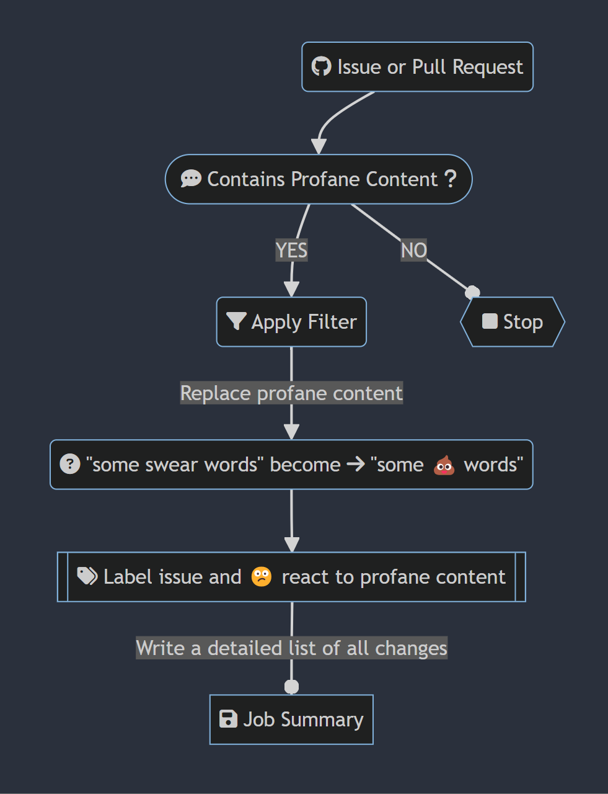
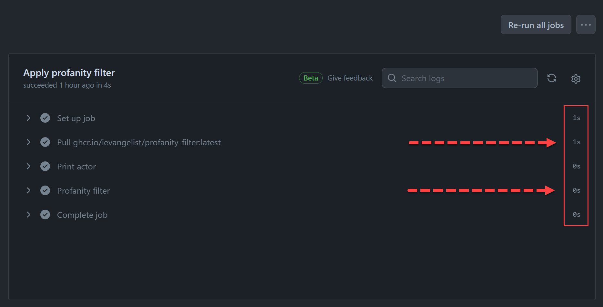
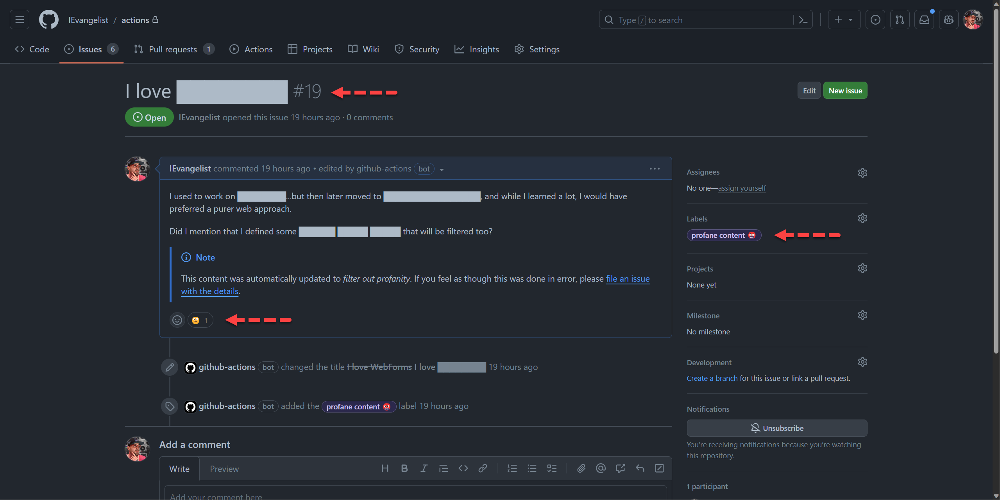
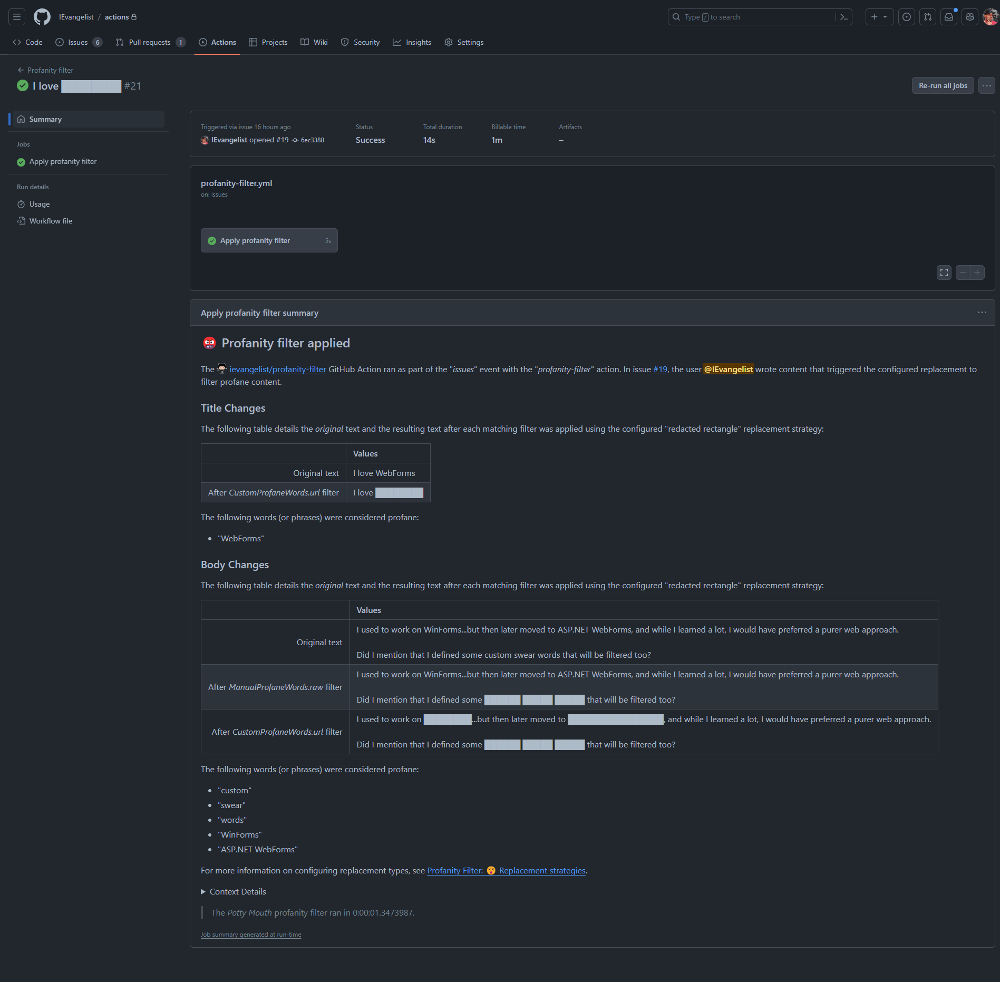

Developing for GitHub Actions has never been easier with .NET. In this post, I'll share compelling reasons to author your next GitHub Action with .NET. You'll learn how to optimize your .NET container app by using Native AOT. I'll also show you how to build and publish your container image to the GitHub Container Registry. I'm thrilled to share a library that you can use to simplify interacting with GitHub Actions from .NET.

If you're more interested in the results without the story of how we got here, you can skip to the [Scrutinizing the results](#scrutinizing-the-results) section.

## Introduction: A fun use case

The example application for this article is a profanity filter. Over half a decade ago, I developed a [GitHub profanity filter][original-blog] as an Azure function to handle GitHub webhooks. The original implementation was written in C# using .NET Core 2.2, which was later upgraded to .NET Core 3.1. At that time, GitHub Actions were just being introduced, so the project didn't utilize them. However, it has been known for some time that you can author .NET apps as GitHub Actions, and official documentation is available to help you get started:

- [Tutorial: Create a GitHub Action with .NET][github-actions-and-dotnet]

In this article, I will demonstrate how the original project has evolved into a containerized GitHub Action using .NET 8 and Native AOT.

## The evolution of the profanity filter

The new [profanity filter (named _Potty Mouth_)][profanity-filter] is a .NET app that runs as a GitHub Action. This means that this filter can be used in any repository. The app is a great way to demonstrate the power of .NET and GitHub Actions. The app itself is a .NET console app that's published as a container image.

The app maintains several lists of profane content in various languages. It uses these lists to search for matching profane content in GitHub issues and pull requests as they're updated. The app is configurable exposing a [set of inputs][action-inputs], so you can choose how to handle profane content. For example, you can replace profane content with a series of asterisks or emoji or some other desired strategy.

To help visualize the flow of the profanity filter, consider the following diagram:



<!--

Mermaid live editor source:

https://mermaid.live/edit#pako:eNpdUttu00AQ_ZXRPqAgxVGaWzdGQkqbFoG4VA0SgiQPE3ucrLB33N11Q4iTj0BC4o1n_o5PYGMnass-rHZmzpkzOjtbEXFMIhRJyutohcbBx_FMgz-jRoKLMMFgqdyqWMBrawsCNnBTpCnc0l1B1j2vsQBB8BIuGtME7YEScZaRdkHMzsIla4dKW7gxnKCmKuGrkOABW_VRrOfHXheHXuXnq0kJl40akqjUkYFRnqcbuK6CJ8LlLeUpRgT5USGqFUq4ahwnOqkEkTJRSvDsrmD3wnJGYNeEBtZsYltnYUHRoXCkojG8Doxartxj2t_fP_48Zj2Z6Hp6ssLh0sJbXFAKqnIQdey5v36CIYwcOP5_6vn8oRND-cko51kQk3cxpRhSZR1wAui_wX-ZXpIt4dW0tsriPcEbXsCkyDI0m_mDqVy-_1DCeLs9Ih3nMPHXbgcnwf1-PxJNkZHJUMV-LbaHyky4FWU0E6F_xmi-zsRM7zwOC8eTjY5E6ExBTVHkMToaK1wazIQXSa3PUqwcm3f1nlXr1hQ56i_M2YnoQxFuxTcRdoay1Wt3ZE-2B7Iz6PabYiPCfr_VlYP-oHs-lFJ25HDXFN8rfrs17PTaUvbOPKV73u2d7f4Bo5juDA

-->

The preceding flow chart diagram depicts the following steps:

- A GitHub issue or pull request is created, updated or commented on.
- If there isn't profane content, the action ends.
- When it contains profanity, the filter is applied.
  - All profane content is replaced with a configured replacement strategy. For this example, imagine that `emoji` is configured.
  - Also imagine that the word `swear` is considered _profane_, "some swear words" becomes "some 💩 words".
  - A detailed job summary is produced and the profanity filter logs the offending content to the Action logs.

Job summaries are useful for auditing purposes as they provide a detailed account of the profane content that was replaced. This is especially useful for repositories that have strict content guidelines. Later in this post, I'll share an example job summary.

## Authoring .NET GitHub Actions

GitHub Actions are deployed as containerized apps, and they need to run quickly and efficiently. This is especially true for Actions that are run on every pull request, such as build validation.

To publish your .NET app as a container image, use the .NET CLI `publish` command. The .NET CLI has built-in support for building and publishing container images without the use of a _Dockerfile_, and it's as simple as running the following command:

```bash
dotnet publish /t:PublishContainer
```

For more information, see the [Containerize a .NET app with `dotnet publish`][dotnet-publish] documentation.

Writing .NET apps that are used as GitHub Actions isn't something that's new, I covered this is previous posts:

- [.NET 💜 GitHub Actions: Intro to GitHub Actions for .NET][first-post]
- [Automate code metrics and class diagrams with GitHub Actions][second-post]

While it's not new, we've come a long way since then and I have some applied learnings that I'm excited to share!

### Optimize consuming GitHub Action workflows

To make your Action run more quickly, it's best to build and publish your container image separately from the consuming workflow. One common pitfall is to define your _action.yml_ to run using the _Dockerfile_ as the `image`, rather than the container image. In other words, if you see something like the following in your _action.yml_ file—there's likely an opportunity for improvement:

```yaml
runs: #  🙈
  using: "docker"
  image: "Dockerfile"
```

This causes your Action to build the container image on every run, which is slow and inefficient. For example, each workflow run needs to pull down the _Dockerfile_ to build the image before running it. Instead, you should build your container image once (or as needed) and publish it to a container registry such as Docker Hub or the GitHub Container Registry. This avoids the cost of building the container image on every run.

Ideally, your _action.yml_ file should point to a container image that's already built and published. For example, if you're using GitHub Container Registry, you can use the following syntax:

```yaml
runs: #  🤓
  using: "docker"
  image: "docker://ghcr.io/username/your-dotnet-action:latest"
```

For more information on the _action.yml_ syntax, see the [Metadata syntax for GitHub Actions][action-yml] documentation.

I've consistently observed .NET container image build times taking on average 1-2 minutes, and this is a significant amount of time for a GitHub Action to run. By building and publishing your container image separately from the consuming workflow, you can avoid this cost.

### Publishing to the GitHub Container Registry

The GitHub Container Registry is a great place to publish your container images. It's integrated with GitHub, so you can use your GitHub username and the GitHub Action's `${{ secret.GITHUB_TOKEN }}` to authenticate. This is especially useful for GitHub Actions, as it's very convenient to not have to worry about managing any additional repository secrets or variables, such as credentials for Docker Hub.

Potty Mouth eats its own dog food. In other words, the GitHub repo that contains the source code for the Action also has a workflow that consumes the published version itself. You can see the [Potty Mouth container image][profanity-filter] in the GitHub Container Registry, and view the GitHub Action in the [public marketplace][marketplace]. Consider the following release workflow that publishes the app to the GitHub Container Registry:

```yml
name: Release

on:
  release:
    types: [published]

env:
  IMAGE_NAME: ievangelist/profanity-filter
  BASE_IMAGE: mcr.microsoft.com/dotnet/nightly/runtime-deps:8.0-jammy-chiseled-aot

jobs:
  deploy:
    runs-on: ubuntu-latest
    permissions:
      contents: read
      packages: write

    steps:
      - name: Check out the repo
        uses: actions/checkout@main

      - name: Get the version
        run: echo "RELEASE_VERSION=${GITHUB_REF/refs\/tags\//}" >> $GITHUB_ENV

      - uses: actions/setup-dotnet@main

      - name: Login to GitHub Container Registry
        uses: docker/login-action@v3
        with:
          registry: ghcr.io
          username: ${{ github.actor }}
          password: ${{ secrets.GITHUB_TOKEN }}

      - name: Publish app
        working-directory: ./src/ProfanityFilter.Action
        run: |
          dotnet publish \
            /t:PublishContainer \
            -p DebugType=none \
            -p ContainerBaseImage=${{ env.BASE_IMAGE }} \
            -p ContainerRegistry=ghcr.io \
            -p ContainerImageTags='"latest;${{ env.RELEASE_VERSION }}"' \
            -p ContainerRepository=${{ env.IMAGE_NAME }} \
            -bl

      - uses: actions/upload-artifact@main
        if: always()
        with:
          name: msbuild.binlog
          path: src/ProfanityFilter.Action/msbuild.binlog
```

The preceding workflow is used to publish the Potty Mouth container image to the GitHub Container Registry. The workflow is triggered when a new release is published. The workflow uses the `dotnet publish` command to build and publish the container image. The `dotnet publish` command is configured to use the `ghcr.io` registry, and specifies `latest` and dynamic version tags. The `latest` tag is used to represent the latest release, and the dynamic version tag is used for the specific release version. The `dotnet publish` command also generates a `msbuild.binlog` file, which is uploaded as an artifact. This is useful for debugging purposes, as it contains detailed build information.

The `BASE_IMAGE` is what the resulting container image is based on. In this case, it's the .NET 8 nightly runtime-deps image. This specific base image is the `mcr.microsoft.com/dotnet/nightly/runtime-deps:8.0-jammy-chiseled-aot` variant and it's optimized for Native AOT.

Why am I using Native AOT? Previously, when I was basing my image on `mcr.microsoft.com/dotnet/nightly/runtime:8.0`, the resulting image was over 200 MB. Using the Native AOT base image results in a container image that's only 38 MB. This is a significant reduction in size, as the container image is a meager 19% of the size of the original! The image also starts up much faster, which is especially useful for GitHub Actions.

For more information on the available .NET images, see the [.NET container images][dotnet-container-images] documentation.

### Improving the GitHub Action developer experience for .NET

Our friends at GitHub maintain the official `@actions/toolkit`, which enables GitHub Action authors who target JavaScript and TypeScript to have a great developer experience. Their toolkit provides a set of APIs that make interfacing with GitHub Actions feel seamless. I set out to enable .NET app developers to have a similar experience, while providing dependency injection and other common patterns and idioms found in modern .NET app development. I've been using my [GitHub Actions Workflow .NET SDK][github-actions-dotnet-sdk] with much success despite not having full feature parity. Some of the features that I've implemented correspond to the existing toolkit packages, such as:

| Original toolkit package | .NET 📦 package | Description |
|--|--|--|
| `@actions/core` | [`GitHub.Actions.Core`](https://www.nuget.org/packages/GitHub.Actions.Core#readme-body-tab) | Provides a way to get and set environment variables, inputs, and outputs. Author job summaries, set secrets, signal failures, style outputs, and execute commands. |
| `@actions/github` | [`GitHub.Actions.Octokit`](https://www.nuget.org/packages/GitHub.Actions.Octokit#readme-body-tab) | Provides a way to interact with the GitHub REST API, via `GitHub.Octokit.SDK` package. |
| `@actions/glob` | [`GitHub.Actions.Glob`](https://www.nuget.org/packages/GitHub.Actions.Glob#readme-body-tab) | Provides a way to match file paths using glob patterns, specifically using [`Pathological.Globbing`][pathological-globbing]. |

The project is open-source and I encourage you to check it out:

- [GitHub Actions Workflow .NET SDK repository](https://github.com/IEvangelist/dotnet-github-actions-sdk)

### Develop .NET apps with Native AOT compilation

When I initially started rewriting the original app, I knew that I wanted to target GitHub Actions and I wanted my app to use Native AOT compilation. My friend Eric Erhardt recently blogged about [making libraries compatible with Native AOT][make-lib-native-aot]. Support for Native AOT was introduced in .NET 7, and it's a terrific way to optimize your .NET app. Native AOT compiles your .NET app to a native binary, which results in faster startup times and reduced memory usage. As mentioned previously, this is very useful when writing GitHub Actions as they need to run quickly and efficiently.

I realized at the time of development that I couldn't use the traditional [Octokit .NET SDK][original-octokit-dotnet-sdk], as it wasn't compatible with Native AOT. This was a blocker for me, so I set out to create an issue on the Octokit repository. Like a good open source developer, I first looked for related issues and found one that was already open. I added my use case to the existing issue, and I was pleased to see that the maintainers were already working on a solution. I was able to contribute to the conversation and provide feedback on the proposed solution. This is a great example of how open source projects can benefit from community involvement. The issue details with all of my findings are detailed here:

- [Octokit .NET SDK issue #2737](https://github.com/octokit/octokit.net/issues/2737)

The **TL;DR** is that the Octokit .NET SDK will likely not add support for Native AOT, but don't fret! The GitHub SDK team has [officially annouced][generated-approach] that their SDKs are moving towards a generated client approach. This approach comes with many benefits, including (but not limited to):

- ✅ Native AOT support.
- 💯 100% REST API coverage.
- 🎉 The ability to generate clients for .NET, CLI, Go, Java, PHP, Python, Ruby, and TypeScript.
- ⚡ Capability to update client SDKs as frequently as the underlying API changes.

The GitHub SDK team has been active in collaborating with the Microsoft Kiota team. Microsoft Kiota is a project that provides a single codebase for generating client SDKs for various languages. It generates clients based on a provided OpenAPI specification. The new [GitHub Octokit .NET SDK][new-octokit-sdk] is generated using Kiota, and it will be compatible with Native AOT. This is a win-win for everyone, and I'm excited to see the new Octokit SDK in action. Consider the following example code demonstrating how the new .NET Octokit SDK can be used to interact with the GitHub REST API:

```csharp
using GitHub;
using GitHub.Octokit.Client;
using GitHub.Octokit.Authentication;

var token = Environment.GetEnvironmentVariable("GITHUB_TOKEN") ?? "";
var request = RequestAdapter.Create(new TokenAuthenticationProvider("Octokit.Gen", token));
var gitHubClient = new GitHubClient(request);

// Calls the GitHub REST HTTP:   GET /repos/{owner}/{repo}/pulls
var pullRequests = await gitHubClient.Repos["octokit"]["octokit.net"].Pulls.GetAsync();

foreach (var pullRequest in pullRequests)
{
    Console.WriteLine($"#{pullRequest.Number} {pullRequest.Title}");
}
```

A few things to take note of: First, Kiota generates clients with a nested builder-approach where each collection in the corresponding REST API is a nested property. This is a great way to ensure that you're using the API correctly. Second, my `GitHub.Actions.Octokit` NuGet 📦 package provides DI support. It also exposes the `GitHubClient` hydrated from the contextual `GITHUB_TOKEN`, which is especially useful in a GitHub Action.

For more information, see the official [Kiota docs][kiota-docs] and [Kiota GitHub repository][kiota-github-repo].

## Consuming the profanity filter

In any of your GitHub repositories, you can use the profanity filter by adding a workflow file to the `.github/workflows` directory. The following example demonstrates how to use the profanity filter in a workflow:

```yml
name: Profanity filter

on:
  issue_comment:
    types: [created, edited]
  issues:
    types: [opened, edited, reopened]
  pull_request:
    types: [opened, edited, reopened]

jobs:
  filter:
    name: Apply profanity filter
    runs-on: ubuntu-latest
    permissions:
      issues: write
      pull-requests: write

    steps:
    - name: Filter
      if: ${{ github.actor != 'dependabot[bot]' && github.actor != 'github-actions[bot]'  }}
      uses: IEvangelist/profanity-filter@main
      id: profanity-filter
      with:
        token: ${{ secrets.GITHUB_TOKEN }}
        replacement-strategy: bold-grawlix
```

The preceding GitHub Action workflow file demonstrates how to use the profanity filter. The workflow is triggered when an issue comment is created or edited, when an issue is opened, edited, or reopened, or when a pull request is opened, edited, or reopened. The workflow runs on `ubuntu-latest` and has the necessary permissions to write to issues and pull requests. The workflow uses the `IEvangelist/profanity-filter` Action, and specifies the `bold-grawlix` replacement strategy. The `GITHUB_TOKEN` secret is used to authenticate with the GitHub REST API.

With this example workflow in place, you can easily test the profanity filter by creating an issue or pull request with profane content. The profanity filter will detect the profane content and replace it with the specified replacement strategy. The profanity filter will also produce a detailed job summary, which is useful for auditing purposes.

For more information, see the [profanity filter Dogfood.yml][example-workflow].

## Scrutinizing the results

In the early stages, the profanity filter workflow would build the container image with every run, which was slow, inefficient, and unnecessary. However, after separating the building of the container image, execution time was reduced by 1-2 minutes. Furthermore, compiling with Native AOT resulted in a significantly smaller container image—approximately one fifth the size—and faster startup.

Here's an example run of the profanity filter:



In the image above, the `docker pull ghcr.io/ievangelist/profanity-filter:latest` completed in **1 second**, and the `docker run` of the app took 0 seconds (although it actually took 0.47 seconds). The total runtime was **4 seconds**, a significant improvement compared to previous iterations that took minutes to run. I've been consistently experiencing total run times of roughly 8-20 seconds from the trigger causing the workflow to be queued. While results may vary, these are huge improvements overall.

### Explore an example issue

Let's quickly explore what happens when an issue is created and it triggers the profanity filter. I created a private GitHub repo named _actions_ where I could test out the profanity filter. I configured the workflow to include a few additional profane words (even though they're not actually profanity this is helpful to test things, without actually writing an issue with profanity in it), the following words are manually added to the profane list:

- `"custom"`
- `"swear"`
- `"words"`

Additionally, I configured a [custom profane word list given a URL][custom-profane-words-url] that returns a newline-separated list of additional profane words, again not actual profanity. I also specified that I wanted to use the `redacted-rectangle` replacement strategy.

I then created an issue titled `I love WebForms` and added the following content:

> I used to work on WinForms...but then later moved to ASP.NET WebForms, and while I learned a lot, I would have preferred a purer web approach.
>
> Did I mention that I defined some custom swear words that will be filtered too?

The profanity filter successfully detected the configured words and replaced them with the desired replacement strategy. Consider the following screen capture depicting the updated issue:



The job summary provided a detailed account of the profane content that was replaced, as shown in the following screen capture:



## Conclusion

The pursuit of .NET libraries compatible with Native AOT has just begun, promising a challenging yet rewarding journey for library authors. As the new Octokit .NET SDK takes center stage, I eagerly anticipate witnessing its capabilities in action and utilizing it extensively within GitHub Actions. Additionally, I am keen on tracking the progress of the innovative Kiota SDK, recognizing its immense potential.

Initially, the Potty Mouth profanity filter workflow suffered from inefficiency due to building the container image with every run. However, by separating the image building process, we successfully eliminated 1-2 minutes of unnecessary execution time. Furthermore, leveraging Native AOT compilation resulted in a significantly smaller container image, reducing its size to nearly one fifth and enhancing startup speed. All of this collectively yielded a substantial improvement in the overall execution time of the profanity filter workflow.

<!-- Named links -->
[action-inputs]: <https://github.com/IEvangelist/profanity-filter?tab=readme-ov-file#-inputs>
[action-yml]: <https://docs.github.com/actions/creating-actions/metadata-syntax-for-github-actions>
[custom-profane-words-url]: <https://gist.githubusercontent.com/IEvangelist/355ad7852bafedb4365a896d1c545a6c/raw/cbd4cea1592ab5acb518d139240dd5a11f42612c/Example.ProfaneWord.List.txt>
[dotnet-container-images]: <https://learn.microsoft.com/dotnet/core/docker/container-images>
[dotnet-publish]: <https://learn.microsoft.com/dotnet/core/docker/publish-as-container>
[example-workflow]: <https://github.com/IEvangelist/profanity-filter/blob/main/.github/workflows/dogfood.yml>
[first-post]: <https://devblogs.microsoft.com/dotnet/dotnet-loves-github-actions>
[generated-approach]: <https://github.com/orgs/octokit/discussions/71>
[github-actions-and-dotnet]: <https://learn.microsoft.com/dotnet/devops/create-dotnet-github-action>
[github-actions-dotnet-sdk]: <https://davidpine.net/blog/github-actions-sdk>
[kiota-docs]: <https://learn.microsoft.com/openapi/kiota>
[kiota-github-repo]: <https://github.com/microsoft/kiota>
[make-lib-native-aot]: <https://devblogs.microsoft.com/dotnet/creating-aot-compatible-libraries>
[marketplace]: <https://github.com/marketplace/actions/potty-mouth>
[new-octokit-sdk]: <https://github.com/octokit/dotnet-sdk>
[original-blog]: <https://davidpine.net/blog/github-profanity-filter>
[original-octokit-dotnet-sdk]: <https://github.com/octokit/octokit.net>
[pathological-globbing]: <https://github.com/IEvangelist/pathological.globbing>
[profanity-filter]: <https://github.com/IEvangelist/profanity-filter>
[second-post]: <https://devblogs.microsoft.com/dotnet/automate-code-metrics-and-class-diagrams-with-github-actions>
