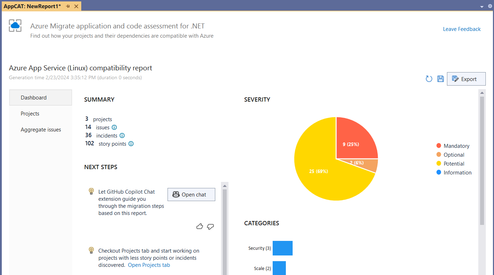
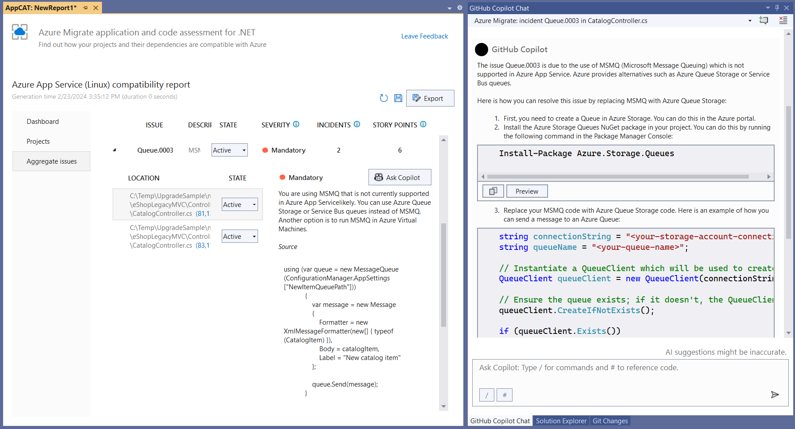
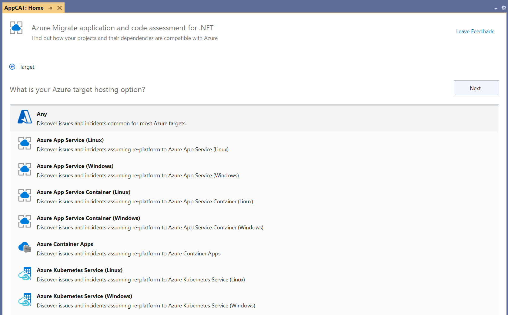
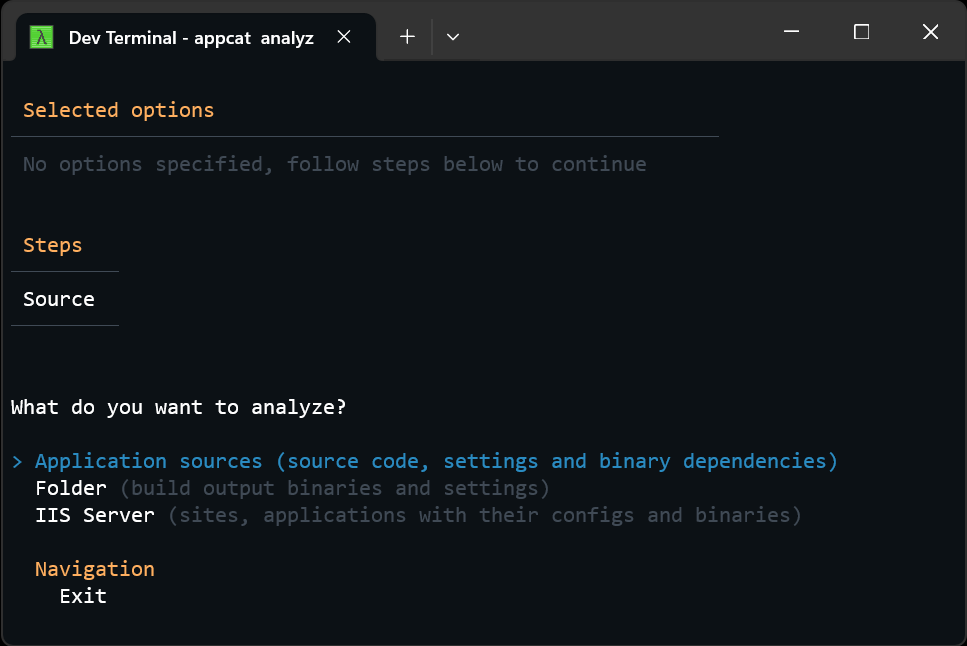
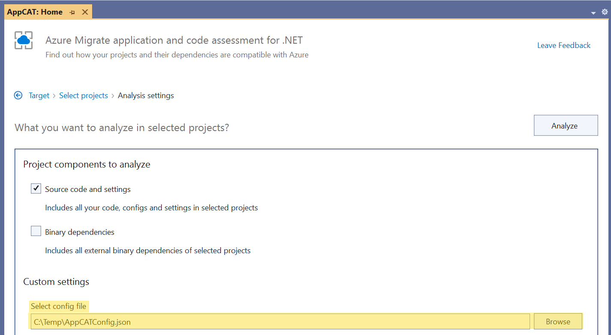
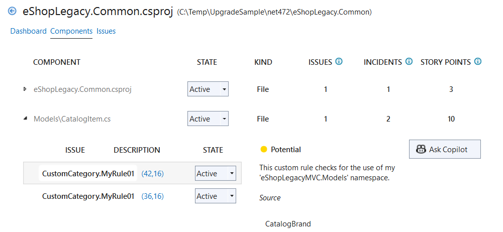

In January of this year, we [announced](https://devblogs.microsoft.com/dotnet/azure-migrate-app-and-code-assessment-tool-release/) the release of Azure Migrate application and code assessment for .NET. Available as a Visual Studio extension or as a .NET SDK command line tool, it is a static analysis tool that helps assess the source code, configurations, and binaries of .NET applications to identify potential issues and opportunities when migrating to Azure environments such as Azure App Service, Azure Kubernetes Service, or Azure Container Apps.

This week, we released updates to Azure Migrate application and code assessment for .NET (both the VS extension and the CLI) making it even better at highlighting the issues that matter most when re-platforming to Azure and providing guidance on how to address those issues.

## What's new?

### GitHub Copilot Chat integration

Azure Migrate application and code assessment is great at identifying items in your code that need reviewed prior to migrating to Azure. But what if you need more help understanding how to address the issues it finds in your solution? With the latest update, the tool now integrates with GitHub Copilot Chat to provide customized guidance and an opportunity to have a conversation about issues identified.

GitHub Copilot Chat integrates with Azure Migrate application and code assessment for .NET in two ways. First, when you look at the report dashboard, you will notice that there's now a list of recommended next steps. If you have VS's GitHub Copilot Chat extension installed, there will be a button to open Copilot Chat. When you click the button, Copilot Chat will review your report, summarize the most important issues, and begin a conversation about how to address them. If you don't have the GitHub Copilot Chat extension installed, there will be a message in this location explaining that additional functionality will be available if you install it.



In addition to the "Open chat" button on the dashboard, all issues in reports now include an "Ask Copilot" button. Clicking this button will begin a new Copilot Chat thread that explains the issue and suggests how to address it. You can ask Copilot follow-up questions and get guidance tailored to your scenario for remediating the issue. As with the overall "Open chat" feature, the "Ask Copilot" feature for specific issues is only available if you have the GitHub Copilot Chat extension installed.

Be aware that clicking "Ask Copilot" will share the description of the issue as well as the code snippet that triggered the issue with GitHub Copilot Chat. This is helpful because it allows Copilot Chat to provide more accurate guidance, but it also means that you should only use the feature with code snippets you are comfortable sharing with Copilot Chat.



Because this feature depends on the GitHub Copilot Chat extension, it is only available in the Visual Studio extension.

### Selecting an Azure target

Azure Migrate application and code assessment for .NET helps to identify code patterns that may need changed in order for apps to work well in Azure. Until now, the issues identified were for a general Azure environment without accounting for important differences between Azure hosting options. With the latest update, it is now possible to select one of the following specific Azure target environments that you intend to migrate to:

- Azure App Service (Windows)
- Azure App Service (Linux)
- Azure App Service (Windows containerized)
- Azure App Service (Linux containerized)
- Azure Kubernetes Service (Windows)
- Azure Kubernetes Service (Linux)
- Azure Container Apps

Regardless of the target environment you select, Azure Migrate application and code assessment will run the same rules to analyze the application. But depending on the target environment, issue severity and descriptions may be changed to reflect the specific requirements of the selected environment.

And if you haven't yet decided which Azure environment is right for you application, you can select the "Any" option which will perform the same general Azure readiness assessment as before.

This new feature is available in both the Visual Studio extension and the CLI tool.



### Scanning binaries and deployed applications

In addition to the ability to scan .NET solutions and projects for potential migration issues, the latest release of Azure Migrate application and code assessment for .NET also supports scanning compiled .NET binaries directly. This enables scanning build output or directly assessing .NET applications deployed in IIS.

Scanning source will always provide the best results because it can differentiate issues in your own code from those in referenced binaries. But scanning binaries can be a useful alternative when source code is not available or when scanning the deployed application is more convenient.

Because the Visual Studio extension works with the source code of loaded projects, the ability to scan binaries and IIS-deployed applications is only available in the CLI tool.



### Customizing rules with a configuration file

Another new capability in the latest version of Azure Migrate application and code assessment is the ability to customize rule behavior using a configuration file. Using JSON configuration files, you can now enable or disable specific rules, change the severity of rules, exclude parts of your solution from analysis, or even create custom rules that are specific to your organization's requirements.

Here is an example config file you might use that demonstrates many of these features:

```json
{
  "analysis": {
    "settings": {
      "binaries": {
        "useDefaultExclusions": true,
        "include": [
          "**/*webmvc.dll",
          "**/*Transit.dll"
        ],
        "exclude": [
        ]
      }
    },
    "rules": [
      {
        "id": "Local.0006",
        "enabled": false
      },
      {
        "id": "Local.0009",
        "severity": "mandatory"
      },
      {
        "id": "CustomCategory.MyRule01",
        "label": "eShopLegacyMVC.Models namespace detected",
        "description": "This custom rule checks for the use of my 'eShopLegacyMVC.Models' namespace.",
        "severity": "potential",
        "effort": 5
      }
    ],
    "analyzers": [
      {
        "ruleId": "CustomCategory.MyRule01",
        "id": "CustomCategory.MyRule01.Namespaces",
        "kind": "namespace",
        "enabled": true,
        "properties": {
          "namespaces": [
            "eShopLegacyMVC.Models"
          ]
        }
      }
    ]
  }
}
```

Sections of the config file include:

- The `settings/binaries` section can be used to customize which binaries are included or excluded from analysis. One of the challenges with analyzing binaries is that you may end up with a lot of issues reported. By using the `include` and `exclude` settings, you can focus on the binaries that are most important to you. This applies both to binary dependencies that are analyzed as part of assessing source or when analyzing binaries directly using the new folder or IIS assessment modes.
- The `rules` section can be used to adjust existing rules by changing the severity, story point cost, or enabling/disabling them altogether. It can also be used to introduce brand new custom rules. In the example above, we've adjusted the severity of one rule, disabled another, and introduced one new rule whose behavior will be defined in the `analyzers` section.
- The `analyzers` section describes what code patterns trigger rules. This section allows defining behaviors for custom rules, as shown above. It also can be used to modify analyzer behavior for existing rules. Like rules, analyzers can be enabled or disabled. In addition to the `namespace` analyzer kind demonstrated above, Azure Migrate application and code assessment also supports `type` (which accepts a property called `fullTypes`) and `member` (which accepts a property called `members`).

This new feature is available in both the Visual Studio extension and the CLI tool. The tooling will prompt for an optional configuration file when running analysis. If using the CLI in non-interactive mode, you can specify the configuration file using the `--config` option.





## See it in action

On a [recent episode](https://www.youtube.com/watch?v=lhoNVsxRIP4) of the [ASP.NET Community Standup](https://docs.microsoft.com/shows/on-net/), I joined Jon Galloway to walk through all of the new features discussed in this post and answer live questions. Check out the video to see the new features in action!

<iframe width="800" height="450" src="https://www.youtube.com/embed/lhoNVsxRIP4?si=f0hug0O6viAiapj7" title="YouTube video player" frameborder="0" allow="accelerometer; autoplay; clipboard-write; encrypted-media; gyroscope; picture-in-picture; web-share" allowfullscreen></iframe>

## Wrap-up

Between the ability to customize rules, run on your choice and source or binaries, and get tailored guidance from GitHub Copilot Chat, the latest updates to Azure Migrate application and code assessment for .NET make it even more powerful and flexible. In addition to the new features discussed in this post, the latest version also includes a number of small tweaks to rule descriptions, severities, and analyzers to make them more accurate and helpful. If you haven't tried Azure Migrate application and code assessment yet, now is a great time to give it a try. To learn more, check out [our docs](https://aka.ms/appcat/dotnet).  Migrating to Azure often requires only a few changes. Azure Migrate application and code assessment can help you identify those changes and understand how to implement them.

## Resources

- [Documentation](https://aka.ms/appcat/dotnet)
- [Installation for Visual Studio](https://marketplace.visualstudio.com/items?itemName=ms-dotnettools.appcat)
- [CLI installation](https://learn.microsoft.com/dotnet/azure/migration/appcat/install#install-the-net-global-tool)
