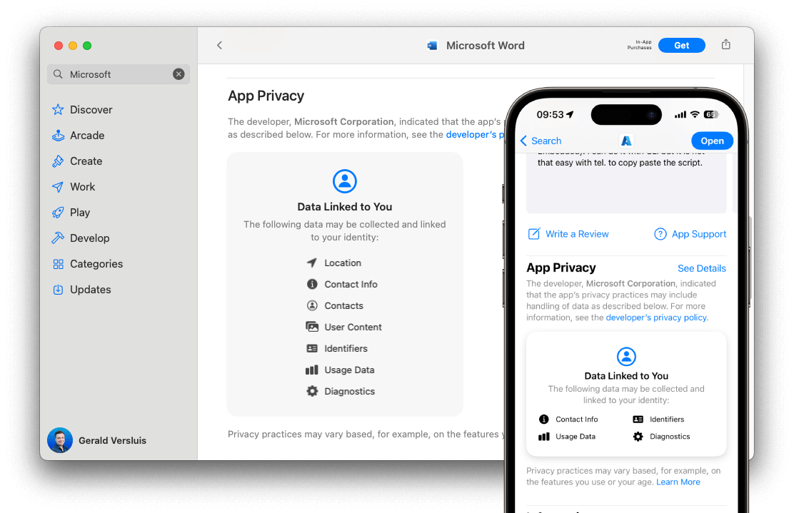

Apple is introducing a privacy policy for including [privacy manifest files](https://developer.apple.com/documentation/bundleresources/privacy_manifest_files) in new and updated applications targeted for iOS, iPadOS, and tvOS platforms on the App Store. Note that macOS apps are excluded at least for the time being.

The privacy manifest file (`PrivacyInfo.xcprivacy`) lists the [types of data](https://developer.apple.com/documentation/bundleresources/privacy_manifest_files/describing_data_use_in_privacy_manifests) your .NET MAUI applications, or any third-party SDKs and packages collect, and the reasons for using certain [Required Reason APIs](https://developer.apple.com/documentation/bundleresources/privacy_manifest_files/describing_use_of_required_reason_api) categories.

At the time of writing Apple is already sending out notices about including this policy in your apps. As of May 1, 2024, this will be mandatory in order to pass the App Store review.
In this post we will see what is needed for your .NET MAUI, .NET for iOS and Xamarin apps in order to stay compliant and be able to continue releasing updates for your apps.

## What is the Apple Privacy Manifest?

A couple of years ago Apple started [gathering information](https://developer.apple.com/app-store/app-privacy-details/) from you about the data you collect in your iOS apps and how you use that data. This information is then shown to the end-user in the App Store listing of your app. An example of this can be seen below.



While this is a great step in the direction of transparency to your user and protecting their privacy, it might not always be clear to you, the app developer, what data you are actually collecting. You know what the data is that you are gathering in your app and how you process it, but it is likely that you are using third-party libraries and those might do their own processing. For instance, by building your app with .NET MAUI, you're already using a framework that might use certain APIs which require an entry in the privacy report.

To enrich the privacy report data even more, Apple is taking this a step further with the introduction of the Apple privacy manifest. This manifest, which is another XML-based metadata file, should be included in your app, but also library developers should now include one in their library where needed.

This way, Apple can cascade all the different `PrivacyInfo.xcprivacy` files from frameworks, libraries and your app into one, very complete privacy report that is then shown on the App Store listing for your app.

## Privacy manifest and .NET

What does that mean for your .NET based iOS apps? A privacy manifest needs to be included in your .NET MAUI and .NET for iOS app as well. Luckily, there is no need for extra support here, just like with the .NET for iOS and .NET MAUI apps. You can do everything that is required with the tools and SDKs that you have today.

The `PrivacyInfo.xcprivacy` file is a metadata file in XML format, much like the `Info.plist` that you probably already know. This file should be filled with the privacy entries that are applicable to your application. A list of the APIs that currently need an entry in the privacy manifest can be found on the [.NET for iOS repository](https://github.com/xamarin/xamarin-macios/blob/main/docs/apple-privacy-manifest.md) along with detailed instructions on when to add which entry in the manifest and how.

### Minimum privacy manifest for .NET applications

Depending on what SDKs you use, there are three layers that could potentially use any of the [Required Reasons APIs](https://developer.apple.com/documentation/bundleresources/privacy_manifest_files/describing_use_of_required_reason_api):

* .NET runtime and Base Class libraries (BCL)
* .NET for iOS SDK
* .NET MAUI SDK

As part of the SDKs mentioned above, we have identified three categories used in these SDKs that require an entry in the privacy manifest:

* [File timestamp APIs](https://developer.apple.com/documentation/bundleresources/privacy_manifest_files/describing_use_of_required_reason_api#4278393)
* [System boot time APIs](https://developer.apple.com/documentation/bundleresources/privacy_manifest_files/describing_use_of_required_reason_api#4278394)
* [Disk space APIs](https://developer.apple.com/documentation/bundleresources/privacy_manifest_files/describing_use_of_required_reason_api#4278397)

Therefore, all .NET applications must include the above categories in the privacy manifest file. Below are the contents of the `PrivacyInfo.xcprivacy` file when you are building an iOS app based on .NET.

To clarify, all applications built with .NET that run on iOS, will need the below manifest at the very minimum. On top of that you should identify APIs that you are using in your own code as well as entries coming from third-party libraries and frameworks.

**Note:** The following contents are verified only for .NET MAUI versions 8.0.0 and later.

```xml
<?xml version="1.0" encoding="UTF-8"?>
<!DOCTYPE plist PUBLIC "-//Apple//DTD PLIST 1.0//EN" "http://www.apple.com/DTDs/PropertyList-1.0.dtd">
<plist version="1.0">
<dict>
    <key>NSPrivacyAccessedAPIType</key>
    <string>NSPrivacyAccessedAPICategoryFileTimestamp</string>
    <key>NSPrivacyAccessedAPITypeReasons</key>
    <array>
        <string>C617.1</string>
    </array>
</dict>
<dict>
    <key>NSPrivacyAccessedAPIType</key>
    <string>NSPrivacyAccessedAPICategorySystemBootTime</string>
    <key>NSPrivacyAccessedAPITypeReasons</key>
    <array>
        <string>35F9.1</string>
    </array>
</dict>
<dict>
    <key>NSPrivacyAccessedAPIType</key>
    <string>NSPrivacyAccessedAPICategoryDiskSpace</string>
    <key>NSPrivacyAccessedAPITypeReasons</key>
    <array>
        <string>E174.1</string>
    </array>
</dict>
</plist>
```

To add this file to your .NET for iOS project, copy the above contents and paste them in a file named `PrivacyInfo.xcprivacy` and place that under the `Resources` folder. This is all that is needed to package the file into the iOS app at the root of the bundle.

For .NET MAUI apps, copy the above contents and paste them in a file named `PrivacyInfo.xcprivacy` and place that under the `Platforms/iOS` folder. Then edit your .NET MAUI project csproj file with your favorite text editor and add the below section somewhere under the `<Project>` node.

```xml
<ItemGroup Condition="$([MSBuild]::GetTargetPlatformIdentifier('$(TargetFramework)')) == 'ios'">
    <BundleResource Include="Platforms\iOS\PrivacyInfo.xcprivacy" LogicalName="PrivacyInfo.xcprivacy" />
</ItemGroup>
```

This will make sure that the manifest file is in the root of your bundle.

More information about the privacy manifest and which entries might be needed for your app can be found on the [Microsoft Learn documentation](https://learn.microsoft.com/dotnet/maui/ios/privacy-manifest).

## Privacy manifest for Xamarin.iOS and Xamarin.Forms

All of the above also applies to Xamarin.iOS and Xamarin.Forms apps. Just like the .NET for iOS and .NET MAUI apps, luckily no additional support is needed here, everything that is needed can be done with the tooling and SDKs available to you today.

You can create a `PrivacyInfo.xcprivacy` file and include that in your project which should satisfy the App Store requirements. Make sure to create a complete privacy manifest file that has all the entries needed to describe your app and add that to your project.

Make sure that for both the Xamarin.iOS project and the Xamarin.Forms project the file is marked as bundle resource (set the Build Action to BundleResource), which should add it correctly to the resulting binary. For Xamarin.Forms, adding the manifest file is only needed in your iOS project.

More instructions on which entries might be needed for your app and how to add the `PrivacyInfo.xcprivacy` file to your Xamarin projects, can be found on the [.NET for iOS repository](https://github.com/xamarin/xamarin-macios/blob/main/docs/apple-privacy-manifest.md). There is also [Microsoft Learn documentation](https://learn.microsoft.com/dotnet/maui/ios/privacy-manifest) available for .NET MAUI, which still applies also to Xamarin in terms of what the privacy manifest should look like.

## Mac Catalyst and macOS apps

At this time it seems that macOS apps, including Mac Catalyst do not seem to need privacy manifest entries for the required reasons APIs. However, a manifest file and relevant entries are still needed if your app, or any SDK you are using inside of your app, is collecting personal data. Please refer to the [Apple documentation](https://developer.apple.com/documentation/bundleresources/privacy_manifest_files/describing_data_use_in_privacy_manifests) for more information about the required entries.

Adding the `PrivacyInfo.xcprivacy` file to your project follows the same procedure as described above, however you should place the file under the `Contents/Resources/` subfolder in your macOS app bundle instead of in the root as for iOS.

## Third-party libraries

Please note that ultimately, it is your responsibility as the app developer that you provide the correct privacy manifest for your apps, regardless of any libraries or frameworks you are using. If you keep getting warnings from the App Store review system, ensure that you have added all necessary entries that cover your app code.

When you are certain that the warning is not triggered by code in your app, make sure to check with third-party libraries and frameworks that you might be using that they included a manifest file as well where needed.

For open-source projects, you can easily inspect the code to see if any APIs are used that require an entry in the manifest. Please refer to [Microsoft Learn](https://learn.microsoft.com/dotnet/maui/ios/privacy-manifest#required-reasons-api-use-in-net-maui) for a list of the APIs that require an entry in the privacy manifest. 

If the project author is not able to provide a manifest file for their product, you can solve this by adding the identified required entries in your own `PrivacyInfo.xcprivacy` file. Make sure that you understand what the APIs are used for and what they do so you can confidentily convey this information to your users when needed.

### Are you a library author?

Maybe you are a library maintainer yourself, in that case everything described in this blog post and the linked documentation is also applicable to your project. Please make sure that you include a privacy manifest for your product.

If you are unable to do so, at the very least provide your users with the entries that are needed for your library so that app developers can easily add them to their `PrivacyInfo.xcprivacy` file.

However, we would strongly recommend including the manifest in your project to make the lives of your users easier.

## Verify adding the manifest

In order to verify if the privacy manifest has been added correctly, submit your app including the manifest to the App Store for review. The Apple systems will do a number of automated checks on the provided binary. When something is not correct, they will send you an email at the email address that is registered for your Apple Developer account.

If you do not receive any emails, or the email does not say anything specifically about the privacy manifest, you can safely assume it was added correctly.

## Summary

Please refer to our [extensive description](https://learn.microsoft.com/dotnet/maui/ios/privacy-manifest) of the Apple privacy manifest and make sure that you understand what is needed for your app. Ultimately, it is your responsibility to inform your users about how you process their data and provide that information the correct way to Apple.

To ensure that your app releases are not disrupted, start adding this to your apps today. By doing so well before the May 1, 2024 deadline you will make sure that you can continue to release your apps after that.

Remember that you as the developer are always responsible for making sure the privacy manifest is correct, up-to-date and included in your apps. At the time of writing (March 2024) we have identified all the APIs that require an entry in the manifest, but over time these may change. Always be sure to check the Apple documentation for the latest requirements.

If you have any questions, please refer to this [issue](https://github.com/xamarin/xamarin-macios/issues/20059) on the .NET for iOS repository to find experiences from other developers and answers to questions from our engineering team.
