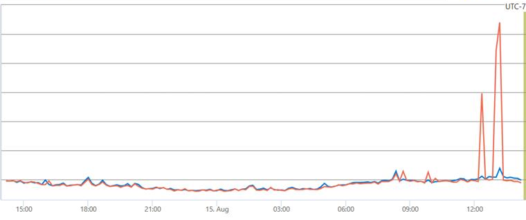
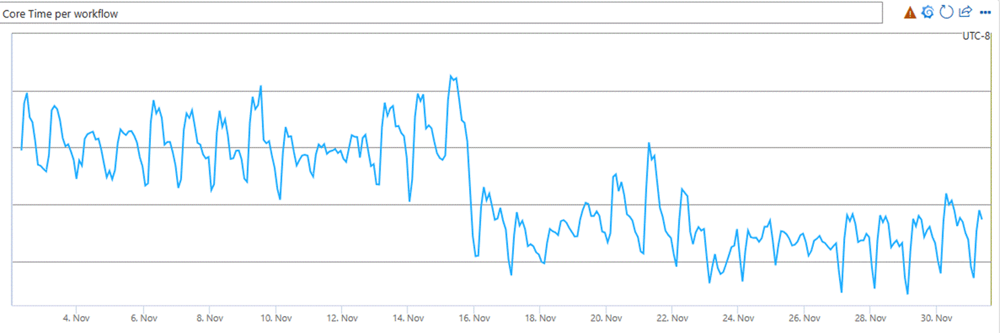
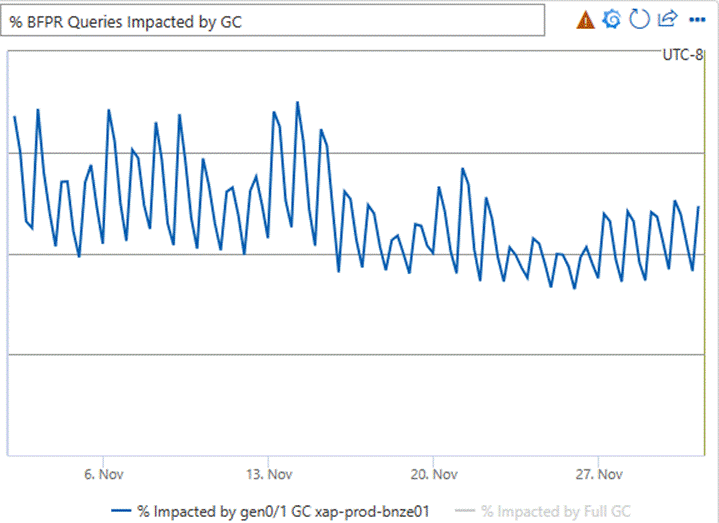

It has been over a year since I last updated everyone on the status of .NET in the Bing stack, specifically the high-performance workflow execution engine sitting right in the middle of everything. In that time, the scope of this engine has only increased, especially with the release of Microsoft Copilot. While our workflow engine originated under Bing, it's fair to say that it now undergirds a significant portion of the search and data stack in many Microsoft applications.

We started testing .NET 8 from its early preview releases. While there were clear incremental benefits in performance across the core .NET libraries in .NET 8, the greatest factor in our upgrade was the substantial improvement made to Dynamic PGO. This feature had been in preview form since .NET 6 and [in .NET 8, the improvements were significant enough](https://devblogs.microsoft.com/dotnet/performance-improvements-in-net-8/#tiering-and-dynamic-pgo) that it was turned on by default.

> **Previous Posts**
>
> * [Migration of Bing's Workflow Engine to .NET 5](https://devblogs.microsoft.com/dotnet/migration-of-bings-workflow-engine-to-net-5/)
> * [.NET Performance Delivers Again for Bing, From .NET 5 to .NET 7](https://devblogs.microsoft.com/dotnet/dotnet-performance-delivers-again-for-bing-from-dotnet-5-to-dotnet-7/)

## Dynamic PGO

Given our scale, there are sometimes features that work well out-of-the-box for nearly all applications, but we approach them with extra consideration.

On process startup, this server loads thousands of partner assemblies containing the plugins that comprise the workflows we execute. This is about 2 GB of code, much of which needs to be jitted. When the first user query hits the machine, it needs to be able to serve the answer in a few hundred milliseconds, without hitting pauses due to jitting.

It's natural to wonder whether technologies such as NGEN and Ready2Run would help with this. Attempts to pre-compile the code have been tried to various levels of success. Ultimately, the best balance of performance and startup minimization was achieved by just letting the JIT do its thing, combined with pre-jitting a list of methods detected during previous runs as particularly critical. We do this on startup, in parallel with other data loading. We also pump a few test queries through the system before accepting real user traffic.

Dynamic PGO improves the quality of runtime code by re-jitting certain code as-needed. This could theoretically help our latencies, but we need to test it thoroughly to see what the impact on startup and the first user queries is. You can [read elsewhere about how Dynamic PGO works](https://devblogs.microsoft.com/dotnet/performance-improvements-in-net-8/#tiering-and-dynamic-pgo), but briefly: 

Dynamic PGO instruments newly jitted code with some lightweight instructions to record performance characteristics and build a queue of re-jitting candidates. Possible optimizations include:

* Inlining
* Method de-virtualization
* Loop optimizations
* Tail-recursion removal
* Code layout in memory to optimize processor caches
* ...and many more

In testing, we saw two major results:

1. A significant improvement in steady-state performance.
1. Our largest workloads had a small spike in latency with the first user queries, indicating that either some methods were not jitted at all, or that the impact of the profiling was too large. This added up to exceed the highest latency limits. This was not an issue for our smaller workloads.

The following latency graph shows a large spike in latency as compared to baseline:



(Note that the graphs in this document have been scrubbed of the specific internal metrics, but the change in shape should give you an idea of the relative changes.)

After some deep investigation and assistance from the .NET team, we discovered that the re-jit queue was growing to over 300,000 methods before we even hit the first user query! Like I said, we have a lot of code. Ultimately, we typically end up with over two *million* methods by the time the process has been up for a few hours.

In response, we implemented a few small changes:

1. Additional warmup queries to give more methods a chance to jit and re-jit.
2. A small pause time before we accept user traffic to allow the queue to drain (we configured it statically at first, but there is an [event](https://learn.microsoft.com/dotnet/fundamentals/diagnostics/runtime-tiered-compilation-events#tieredcompilationbackgroundjitstop-event) you can watch to get info on the JIT queue size).
3. Some custom JIT settings, particular to our over-sized scenario:

```bash
REM Enable 64 bit counters to reduce false sharing somewhat
set DOTNET_JitCollect64BitCounts=1

REM Remove delay in kicking off tiered compilations
REM (goal is to spend less time overall executing instrumented methods)
set DOTNET_TC_CallCountingDelayMs=0
```

With those changes, the latency spike went away, and we could now reap the steady-state performance improvements.

## Performance Improvements

The improvement we saw in a number of performance characteristics is perhaps the most significant we've seen since the initial migration from .NET Framework to .NET 5.

The number of CPU cycles we spent executing a query dropped by 13%. In other words, we became 13% more efficient, or put yet another way: that is 13% fewer machines we need to buy to keep up with the ever-increasing demand. The following graph shows this drop in the total CPU time spent executing a workflow.



The percentage of queries impacted by a gen0 or gen1 garbage collection dropped by 20% (we almost never have a query impacted by gen2 GCs because A. our memory management strategy avoids this, and B. we take additional steps to make sure the machine isn't serving users if a gen2 GC is imminent--which is extremely rare).

This graph shows the relative difference in impact of GC on queries:



Many other metrics show that various query execution stages have improvements of the same general flavor as the above graphs. Some internal latencies dropped by over 25%. A large portion of query serving is waiting for other backends, so overall query serving time improves a little less dramatically, about 8%--still quite significant! 

## Summary

All things considered, this was a solid and relatively easy .NET release for us. We achieved both an improvement in latency, and a great improvement in efficiency that will save millions of dollars in the years to come. Dynamic PGO, while needing some finessing with our large code base and tight latency requirements, was a huge win in terms of runtime performance.

And now I need to go get us set up for .NET 9... I hope to report on that in another year!
