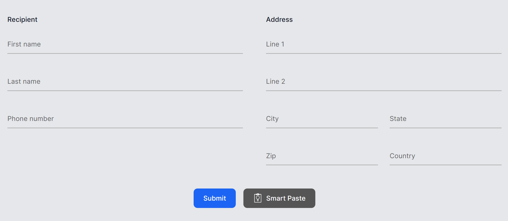
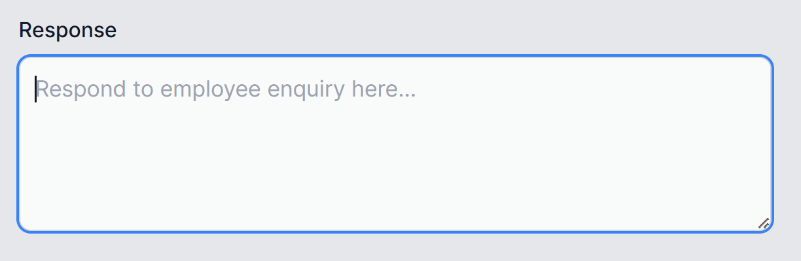
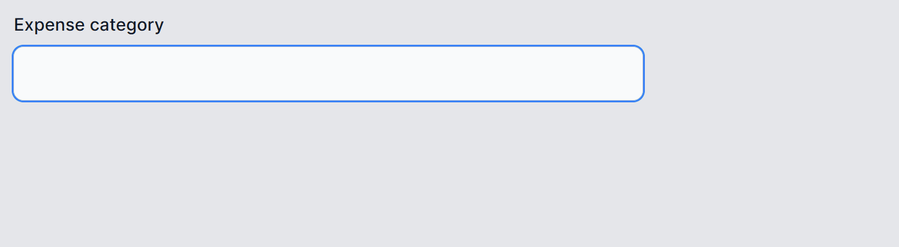

New advances in AI promise to revolutionize how we interact with and use software. But adding AI features into existing software can be challenging. That's why we built the new .NET Smart Components, a set of genuinely useful AI-powered UI components that you can quickly and easily add to .NET apps. You don't have to spend weeks of dev time redesigning your UX or researching machine learning and prompt engineering. .NET Smart Components are prebuilt end-to-end AI features that you can drop into your existing app UIs to make your users more productive.

The .NET Smart Components are an **experiment** and are initially available for Blazor, MVC, and Razor Pages with .NET 6 and later. We expect to provide components for other .NET UI frameworks as well, like .NET MAUI, WPF, and Windows Forms, but first we're interested in your feedback on how useful these components are and what additional capabilities you'd like to see added.

Watch Steve Sanderson demonstrate what the .NET Smart Components can do:

<iframe width="800" height="450" src="https://www.youtube.com/embed/ZWH4yJGJaeg?si=fTQiNMMLZrX0Xt4P" title="YouTube video player" frameborder="0" allow="accelerometer; autoplay; clipboard-write; encrypted-media; gyroscope; picture-in-picture; web-share" allowfullscreen></iframe>

## What's included

The .NET Smart Components currently include the following smart features:

### Smart Paste

Smart Paste fills out forms automatically using data from the user's clipboard with the click of a button. You can use this with any existing form in your web app. This helps users add data from external sources without re-typing.



Learn more: [Smart Paste docs](https://github.com/dotnet-smartcomponents/smartcomponents/blob/main/docs/smart-paste.md)

### Smart TextArea

An intelligent upgrade to the traditional textarea. You can configure how it should autocomplete whole sentences using your own preferred tone, policies, URLs, and so on. This helps users type faster and not have to remember URLs etc.



Learn more: [Smart TextArea docs](https://github.com/dotnet-smartcomponents/smartcomponents/blob/main/docs/smart-textarea.md)

### Smart ComboBox

Upgrades the traditional combobox by making suggestions based on semantic matching. This helps users find what they're looking for.



Learn more: [Smart ComboBox docs](https://github.com/dotnet-smartcomponents/smartcomponents/blob/main/docs/smart-combobox.md)

## Running the samples

You can try out the .NET Smart Components with Blazor or MVC/RazorPages using the [.NET Smart Components sample apps](https://aka.ms/smartcomponents) on GitHub.

To get started with the .NET Smart Components sample apps:

1. Download and install the [.NET SDK](https://dotnet.microsoft.com/download) if you don't already have it installed.

1. Clone or download the .NET Smart Components sample repo from GitHub: https://aka.ms/smartcomponents.

1. Deploy an [Azure OpenAI backend](https://learn.microsoft.com/azure/ai-services/openai/how-to/create-resource) if you don't already have one, and then edit the `RepoSharedConfig.json` file at the root of the solution to add your API key, deployment name, and endpoint URL.

    *RepoSharedConfig.json*
    
    ```json
    "SmartComponents": {
      "ApiKey": "<API key>",
      "DeploymentName": "<deployment name>",
      "Endpoint": "https://YOUR_ACCOUNT.openai.azure.com/"
    }
    ```

1. Run either *ExampleBlazorApp* or *ExampleMvcRazorPagesApp* to see the .NET Smart Components in action.

## Add to an existing app

Once you're ready, you can add .NET Smart Components to your existing Blazor, MVC, or Razor Pages apps by following these guides:

- [Get started with .NET Smart Components and Blazor](https://github.com/dotnet-smartcomponents/smartcomponents/blob/main/docs/getting-started-blazor.md)
- [Get started with .NET Smart Components and MVC or Razor Pages](https://github.com/dotnet-smartcomponents/smartcomponents/blob/main/docs/getting-started-mvc-razor-pages.md)

## Feedback and support

The .NET Smart Components are currently experimental and not officially supported. We want to hear from you whether these components are useful and how we can improve them to best meet your app development needs. To share your thoughts and feedback with us, please [post an issue](https://github.com/dotnet-smartcomponents/smartcomponents/issues) on GitHub.

Thank you for trying out the .NET Smart Components!
