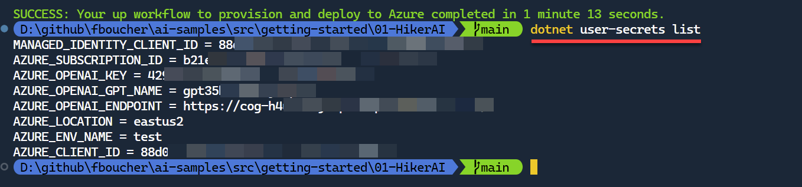

Often sample projects starts with a few "magic strings", those variables contains URLs and key information related to a deployment or external resources that we will have to change to use the sample. As an example in .NET it could look like this: 

```csharp
string openAIEndpoint = "https://";
string openAIDeploymentName = "my-ai-model";
string openAiKey = "123456abcd789EFGH";
// ...
```

This post shows how you to automatically generate .NET secrets from the Azure deployment and how your .NET app can read them. Users who would like to try your sample won't have to edit anything anymore! They will only have to deploy using `azd up`, and then `dotnet run` to execute the app. Sound interesting? Here are to implement it. 

> The code for the entire project can be found on GitHub, in the [fboucher/hikerai](https://github.com/FBoucher/hikerai).


## The Preparation

Bicep is a language for creating infrastructure definitions for Azure resources that you want to deploy. Since these resources will have information like endpoints or model names, we want a way to export those, and in Bicep we use the `output` syntax:

```bash 
// some bicep deployment...

output AZURE_OPENAI_ENDPOINT string = ai.outputs.AZURE_OPENAI_ENDPOINT
output AZURE_OPENAI_GPT_NAME string = ai.outputs.AZURE_OPENAI_GPT_NAME
output AZURE_OPENAI_KEY string = ai.outputs.AZURE_OPENAI_KEY
```

With the Azure Developer CLI (azd) the command `azd env get-values` returns all those values in list of key-paired values. A PowerShell or Bash script could read those and create new .NET secrets using the command `dotnet user-secrets set`. Here the script `postprovision.ps1`.

```powershell
function Set-DotnetUserSecrets {
    param ($path, $lines)
    Push-Location
    cd $path
    dotnet user-secrets init
    dotnet user-secrets clear
    foreach ($line in $lines) {
        $name, $value = $line -split '='
        $value = $value -replace '"', ''
        $name = $name -replace '__', ':'
        if ($value -ne '') {
            dotnet user-secrets set $name $value | Out-Null
        }
    }
    Pop-Location
}

$lines = (azd env get-values) -split "`n"
Set-DotnetUserSecrets -path "." -lines $lines
```

This script start by creating a function `Set-DotnetUserSecrets` that takes two parameters. The first parameter `$path` will be used so the script can change directory to that location. This is essential to make sure the secrets are created where needed. The second parameter `$lines` contains all the substring where key-paired values are saved (ex: VARIABLE_NAME="variable_value"). The script loops through all lines to isolate the names and the values and create a secret for each of them `dotnet user-secrets set $name $value`.

On the two last lines, the script retrieves the environment variable generated by the outputs using `azd env get-values` and split the result in substring. It will finally call the function `Set-DotnetUserSecrets` declared previously passing the the path and lines. A `postprovision.sh` version of the script is also available in the repository.

To execute the script after the deployment we need to add a post provision hook into the `azure.yaml` file. The `azure.yaml` is the schema that defines and describes the apps and types of Azure resources that are included in a project. Here how it looks.

```yaml
hooks:
  postprovision:
    windows:
      shell: pwsh
      run: ./infra/post-script/postprovision.ps1
      interactive: true
      continueOnError: true
```

## The deployment

Execute your deployment using Azure CLI Developer CLI command `azd up`. You can use the code of HikerAI available at [fboucher/hikerai](https://github.com/FBoucher/hikerai). Once you clone or download the repository, make sure you are at the root directory, to deploy the solution.

To test that the secrets have been created used the command `dotnet user-secrets list`.



## Use the Secrets

Using the NuGet package `Microsoft.Extensions.Configuration`, the application will be able to read the user secrets. You can now replace those magic strings.

```csharp
// == Retrieve the local secrets saved during the Azure deployment ==========
using Microsoft.Extensions.Configuration;

var config = new ConfigurationBuilder().AddUserSecrets<Program>().Build();
string openAIEndpoint = config["AZURE_OPENAI_ENDPOINT"];
string openAIDeploymentName = config["AZURE_OPENAI_GPT_NAME"];
string openAiKey = config["AZURE_OPENAI_KEY"];
```

## Video
<iframe width="800" height="450" src="https://www.youtube.com/embed/NpE7edalTlQ?si=f6GmyhteooCAKVhz" title="Generate Local .NET Secrets from Azure Deployments" frameborder="0" allow="accelerometer; autoplay; clipboard-write; encrypted-media; gyroscope; picture-in-picture; web-share" allowfullscreen></iframe>


## Summary

This post shared a few tips to replace "magic strings" by user secrets that can be automatically generates from the Azure deployment outputs. Try it in your solution or with our sample available ay [fboucher/hikerai](https://github.com/FBoucher/hikerai) in the HikerAI folder.


### References

- All code from sample HikerAI [fboucher/hikerai](https://github.com/FBoucher/hikerai)
- [Azure Developer CLI](https://learn.microsoft.com/azure/developer/azure-developer-cli/overview)
- [App secrets in development](https://learn.microsoft.com/aspnet/core/security/app-secrets?view=aspnetcore-8.0&tabs=windows#secret-manager)
