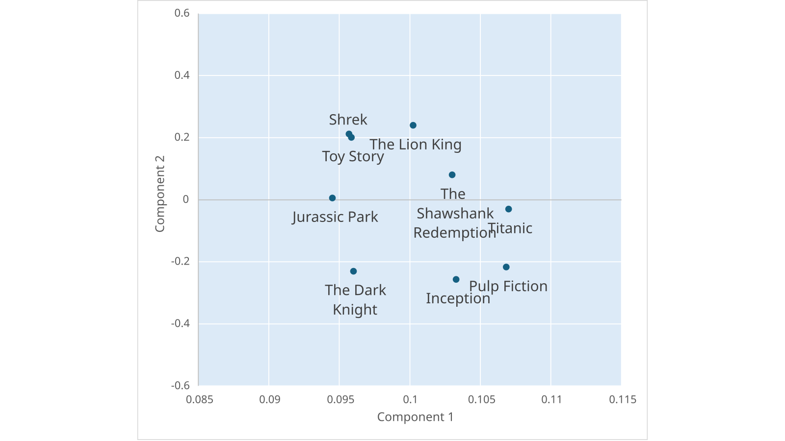

Vector databases have become an important component of Generative AI workloads powering scenarios like search and Retrieval Augmented Generation (RAG).

The .NET team has worked closely with Milvus to enable .NET developers to use vector databases in their applications.

In this post, we’ll show how you can quickly get started using the Milvus .NET SDK currently in preview.

## What is Milvus?

Milvus is a vector database that can store, index, and manage embedding vectors generated  by deep neural networks and other machine learning models. 

For more details, see the [Milvus website](https://milvus.io/).

## What are embedding vectors?

Embedding vectors are numerical representations of data such as text, images, and audio.  These numerical representations can be thought of as a collection of floating point values. 

In this example, you’re looking at a visualization of movies based on their embedding  vector representations.



These vectors are created by machine learning models such as the [text embedding models from OpenAI](https://learn.microsoft.com/azure/ai-services/openai/concepts/models#embeddings).


Similar movies end up with similar embedding vector representations. For example,  movies like “The Lion King” and “Toy Story” might have similar vectors because they’re  both animated and family-friendly, while “Inception” and “Pulp Fiction” would have  different vectors because they belong to different genres and styles.  

These embedding vectors help computers understand and compare movies, which is useful  for search and recommendation systems.  

For Generative AI applications, being able to provide relevant contextual information to  help Large Language Models (LLMs) like GPT generate relevant responses is important. Embedding vectors can help here.  

For additional learning on embeddings, you can check out the following posts: 

- [OpenAI - Introducing Text and Code Embeddings](https://openai.com/blog/introducing-text-and-code-embeddings)
- [Generate embeddings with Azure OpenAI](https://learn.microsoft.com/azure/ai-services/openai/how-to/embeddings?tabs=csharp)
- [Demistifying Retrieval Augmented Generation](https://devblogs.microsoft.com/dotnet/demystifying-retrieval-augmented-generation-with-dotnet/#mind-the-gap)
- [Transform your business with smart .NET apps powered by Azure and ChatGPT](https://devblogs.microsoft.com/dotnet/transform-business-smart-dotnet-apps-azure-chatgpt/#chat-with-your-data)
- [Efficient Estimation of Word Representations in Vector Space](https://arxiv.org/abs/1301.3781)
- [Improving Word Representations via Global Context and Multiple Word Prototypes](https://www.andrewng.org/publications/improving-word-representations-via-global-context-and-multiple-word-prototypes/)
- [Deep Learning for NLP: Word Embeddings](https://towardsdatascience.com/deep-learning-for-nlp-word-embeddings-4f5c90bcdab5)

## Why Vector DBs?

Similar to how relational databases and document databases are optimized for structured and semi-structured data, vector databases are built to efficiently store, index, and manage represented as embedding vectors. As a result, the indexing algorithms used by vector databases are optimized to efficiently retrieve data that can be used downstream in your applications which may have search and AI components.  

## Get Started with Milvus in .NET

The code samples in this blog post are for illustration purposes. See the getting started sample for a more detailed sample.

### Deploy Milvus to Azure

The easiest way for you to get started is by deploying an instance of the Milvus database to  Azure.  

Milvus is available through the [Zilliz Cloud for Azure](https://zilliz.com/blog/zilliz-cloud-now-available-on-microsoft-azure), the managed version of Milvus.  

It’s also available as an [Azure Container Apps Add-On](https://learn.microsoft.com/azure/container-apps/services). In future blog posts, we’ll explore how to get started with these add-ons. Stay tuned!  

### Connect to the database

Assuming you have an instance of Milvus deployed:

1. Create a C# console application or Polyglot Notebook.
2. Install the Milvus.Client NuGet package.
3. Use the Milvus SDK to create a client and connect to your database. Make sure to replace “localhost” with your Milvus service host. 

    ```csharp
    var milvusClient = new MilvusClient("localhost", username: "username", password: "password"); 
    ```

### Create a collection

Data is organized in collections. Let’s assume we’re creating a collection to store movie  data.  

Start by defining your schema. The schema will contain three fields:  

- *movie_id*: The unique identifier for a movie 
- *movie_name*: The title of the movie 
- *movie_description*: Embedding vectors for the movie description.

```csharp
var schema = new CollectionSchema 
{ 
    Fields = 
    { 
        FieldSchema.Create<long>("movie_id", isPrimaryKey: true),  
        FieldSchema.CreateVarchar("movie_name", maxLength: 200), 
        FieldSchema.CreateFloatVector("movie_description", dimension: 2)  
    } 
};
```

Then, create your collection. 

```csharp
var collection = await milvusClient.CreateCollectionAsync(collectionName: "movies",schema: schema, shardsNum: 2);
```

### Add data to your collection

Once your collection is created, add data to it.  

In this case, here’s the data we’re using. In this sample, the embedding vectors for the  movie description have been precomputed for convenience. In a more real scenario though,  you’d use an embedding model to generate them. In the table I’ve also included the text  description only for demonstration purposes. However, the text description won’t be  stored in the collection, only the embedding vectors.  

| movie_id | movie_name | movie_description (embedding) | movie_description (text)
| --- | --- | --- | --- |
| 1 | The Lion King | [0.10022575, -0.23998135] | The Lion King is a classic Disney animated film that tells the story of a young lion named Simba who embarks on a journey to reclaim his throne as the king of the Pride Lands after the tragic death of his father. |
| 2 | Inception | [0.10327095, 0.2563685] | Inception is a mind-bending science fiction film directed by Christopher Nolan. It follows the story of Dom Cobb, a skilled thief who specializes in entering people's dreams to steal their secrets. However, he is offered a final job that involves planting an idea into someone's mind.|
| 3 | Toy Story | [0.095857024, -0.201278] | Toy Story is a groundbreaking animated film from Pixar. It follows the secret lives of toys when their owner, Andy, is not around. Woody and Buzz Lightyear are the main characters in this heartwarming tale.|
| 4 | Pulp Fiction | [0.106827796, 0.21676421] | Pulp Fiction is a crime film directed by Quentin Tarantino. It weaves together interconnected stories of mobsters, hitmen, and other colorful characters in a non-linear narrative filled with dark humor and violence. |
| 5 | Shrek | [0.09568083, -0.21177962] | Shrek is an animated comedy film that follows the adventures of Shrek, an ogre who embarks on a quest to rescue Princess Fiona from a dragon-guarded tower in order to get his swamp back. |

```csharp
var movieIds = new [] { 1L, 2L, 3L, 4L, 5L }; 
var movieNames = new [] { "The Lion King", "Inception", "Toy Story", "Pulp  Fiction", "Shrek" }; 
var movieDescriptions = new ReadOnlyMemory<float>[] { 
    new [] { 0.10022575f, 0.23998135f }, 
    new [] { 0.10327095f, -0.2563685f }, 
    new [] { 0.095857024f, 0.201278f }, 
    new [] { 0.106827796f, -0.21676421f }, 
    new [] { 0.09568083f, 0.21177962f } 
}; 

await collection.InsertAsync(new FieldData[] 
{ 
 FieldData.Create("movie_id", movieIds), 
 FieldData.Create("movie_name", movieNames), 
 FieldData.CreateFloatVector("movie_description", movieDescriptions) 
});  
```

### Search for movies

Let’s say that we want to find movies that match a search query, “A movie that’s fun for the  whole family”. 

| Query | Embedding |
| --- | --- |
| A movie that’s fun for the whole family | [0.12217915, -0.034832448] |

Start by creating an index of your movie collection. In this case, the name of the index is `movie_idx` and the field that is indexed is the `movie_description` containing the embedding vectors of the movie descriptions. The rest are configurations the index uses to organize information and conduct searches. For more details, see the [Milvus vector index](https://milvus.io/docs/v2.2.x/index.md) and [similarity metric](https://milvus.io/docs/v2.2.x/metric.md) documentation.  

```csharp
await collection.CreateIndexAsync( 
 fieldName: "movie_description", 
 indexType: IndexType.Flat, 
 metricType: SimilarityMetricType.L2, 
 indexName: "movie_idx");
```

Once your index is created, load your collection.  

```csharp
await collection.LoadAsync(); 
await collection.WaitForCollectionLoadAsync(); 
```

Define parameters for your search. In this case, you want the result of your query to display  the name of the movies most relevant to your query, so you set the `movie_name` as the `OutputFields`.  

```csharp
var parameters = new SearchParameters 
{ 
    OutputFields = { "movie_name" },
    ConsistencyLevel = ConsistencyLevel.Strong, 
    ExtraParameters = { ["nprobe"] = "1024" } 
};
```

Then, conduct the search. Note that for `vectors`, I'm passing in the embedding vector representation of my search query. Similar to the movie descriptions, they've been conveniently precomputed.  

```csharp
var results = await collection.SearchAsync(
    vectorFieldName: "movie_description",
    vectors: new ReadOnlyMemory<float>[] { new[] {0.12217915f, -0.034832448f } },
    SimilarityMetricType.L2,
    limit: 3,
    parameters);
```

The result is the following:

```text
[ Toy Story, Shrek, The Lion King ]
```

## Using Semantic Kernel

If you’re using Milvus with Semantic Kernel, you can use the [Milvus connector](https://www.nuget.org/packages/Microsoft.SemanticKernel.Connectors.Milvus).

## Acknowledgements

Thanks to the Milvus organization and open-source community as well as the .NET Data  Access, Azure App Services, and Semantic Kernel teams for collaborating on this effort.

## Next steps

Try out the [samples](https://github.com/Azure-Samples/openai/tree/main/Basic_Samples#datastores) and get started today! 