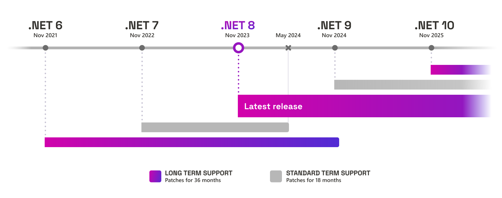

.NET 7 will reach [end of support on May 14, 2024](https://github.com/dotnet/core/blob/main/release-notes/7.0/README.md). After that, Microsoft will no longer provide servicing updates, including security fixes or technical support, for .NET 7. You'll need to update to [.NET 8](https://devblogs.microsoft.com/dotnet/announcing-dotnet-8/) before this date into stay supported.

## Support Policy 

.NET 7 is an [STS release](https://dotnet.microsoft.com/platform/support/policy/dotnet-core#release-types), supported for 18 months, ending on May 14, 2024.

May 14th is a patch Tuesday release day. .NET 7 may be updated one last time, on that day, if there is a known critical issue.

You can expect the following after .NET 7 reaches end of support:

- Applications that use this version **will** continue to run.
- No new security updates will be issued for .NET 7.
- Applications that use .NET 7 may be insecure. 
- Computers with .NET 7 installed may be insecure. 
- You may not be able to access technical support for .NET 7 applications.

## Using .NET 7 apps

If you're using a .NET 7 app, we recommend reaching out to the software developer or vendor who produced it to ask if an updated version that uses .NET 8 is available.

## Upgrading to .NET 8

You can upgrade your app to .NET 8 by changing the value of the `TargetFramework` property in your project file to `net8.0`. You will also need to update your development and hosting environments. This process is covered in more detail in [Upgrade to a new .NET version](https://learn.microsoft.com/dotnet/core/install/upgrade).

**Other Useful links for upgrading to .NET 8**

* [.NET 8 Breaking Changes](https://docs.microsoft.com/dotnet/core/compatibility/8.0).
* [Migrate from ASP.NET Core in .NET 7 to .NET 8](https://learn.microsoft.com/aspnet/core/migration/70-80?view=aspnetcore-8.0&tabs=visual-studio)
* Use the [.NET upgrade assistant](https://learn.microsoft.com/dotnet/core/porting/upgrade-assistant-overview) to update
* [Upgrading .NET MAUI from .NET 7 to .NET 8](https://github.com/dotnet/maui/wiki/Upgrading-.NET-MAUI-from-.NET-7-to-.NET-8)

## Visual Studio Compatibility

Starting with the June 2024 servicing update for Visual Studio 2022 17.6 and Visual Studio 2022 17.4, the .NET 7 component in Visual Studio will be changed to out of support and optional. Existing installations won’t be affected.

You must use the .NET 8 SDK to build .NET 6 or .NET 8 apps to stay supported.

You can use the "remove out of support components" option to remove .NET 7 from existing Visual Studio installations.

## Useful Links
* [.NET downloads](https://dotnet.microsoft.com/download/dotnet)
* [.NET Compatibility](https://docs.microsoft.com/dotnet/core/compatibility/)
* [.NET Deployment](https://docs.microsoft.com/dotnet/core/deploying/)
* [.NET Support Policy](https://dotnet.microsoft.com/platform/support/policy/dotnet-core)

## Closing

.NET 7 will be reaching end of support on May 14, 2024.  After that date, no additional updates or technical support will be offered. We strongly recommend you migrate your applications to .NET 8 today.
