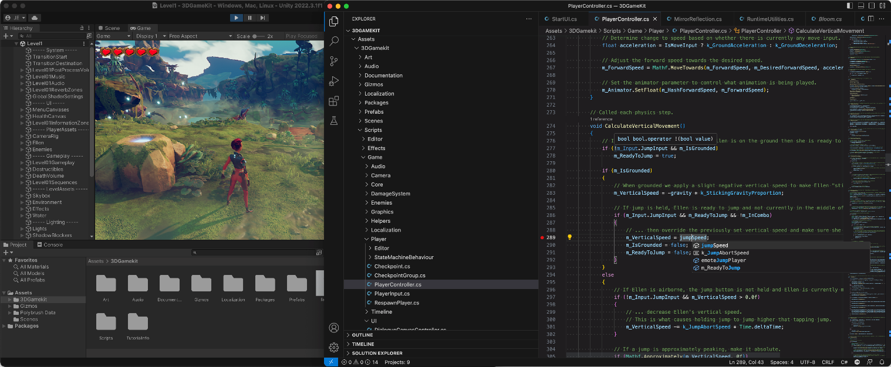
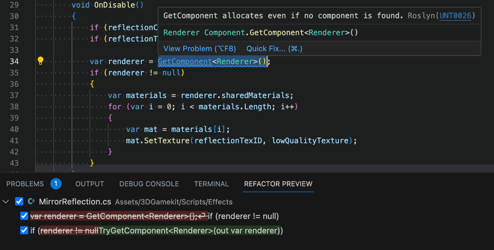
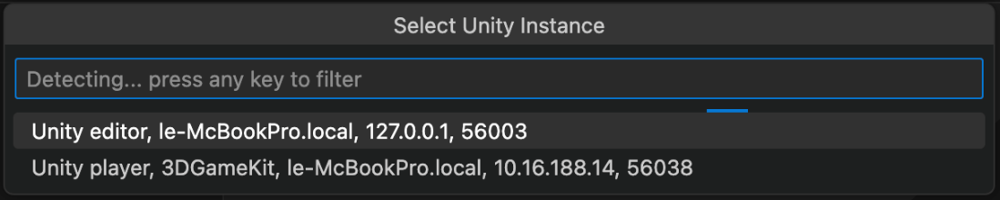
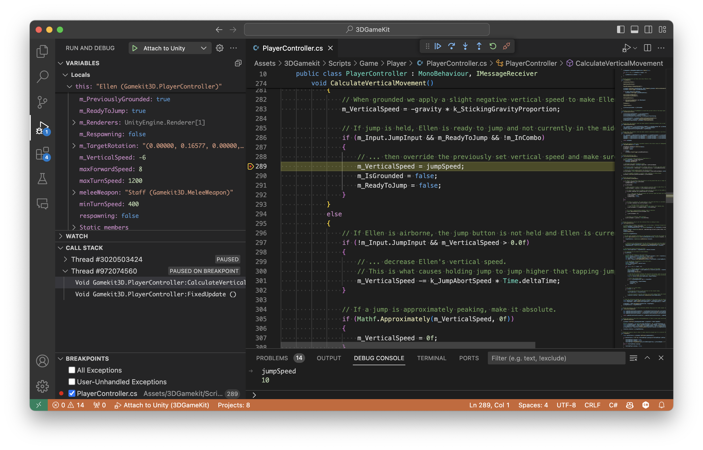

Today, we are thrilled to announce the general availability of the [Unity extension for Visual Studio](https://aka.ms/vscode-unity). This extension, built upon the [C# Dev Kit](https://marketplace.visualstudio.com/items?itemName=ms-dotnettools.csdevkit) and [C#](https://marketplace.visualstudio.com/items?itemName=ms-dotnettools.csharp) extensions, gives you a comprehensive toolkit for your [Unity](https://www.unity.com) development in Visual Studio Code across Windows, macOS, and Linux.

We shipped the [first preview](https://devblogs.microsoft.com/visualstudio/announcing-the-unity-extension-for-visual-studio-code/) of the Unity extension for Visual Studio Code last year and have been working since on improving the experience thanks to your feedback!

## What is the Unity extension?

### Code Editing powered by Roslyn

C# editing is backed by the C# extension, giving you powerful IntelliSense code-completion. Along with the IntelliCode for C# Dev Kit extension, you get AI-assisted features such as whole-line completions and starred suggestions as you type.

The extension also includes the [Unity Roslyn Analyzers project](https://github.com/microsoft/microsoft.unity.analyzers), giving you suggestions and code fixes tailored to Unity. 

### Debug Unity and your Unity games

The extension makes it easy to debug your Unity games, either running in the Unity Editor or standalone, while running on all the platforms that Unity support. Just press F5 to attach the debugger to your game running in the Unity Editor or use the new “Attach Unity Debugger” command to see a list of Unity Editors and Unity Players that you can debug.

After that, just put a breakpoint in your code and run your game in Unity!

## How to get started?

Head over to the [Unity extension page](https://aka.ms/vscode-unity) for a complete README on how to get started, depending on the version of Unity you are using.

## What is next?

Today’s official launch is only the start as we will continue to listen to your feedback and work toward improved performance, reliability, and adding features to support your Unity development in VS Code. 

Please share your feedback by reporting new issues via VS Code or searching the existing enhancement and issues and give your ‘thumbs up’ or additional context to [the issue](https://github.com/microsoft/vscode-dotnettools/issues) to help us prioritize. 

[cta-button align='center' text='Install Unity extension for Visual Studio Code' url='https://aka.ms/vscode-unity'  color='#5c33b8']
