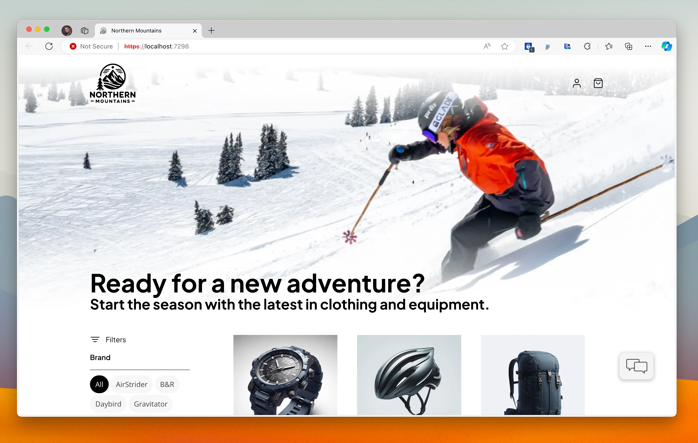
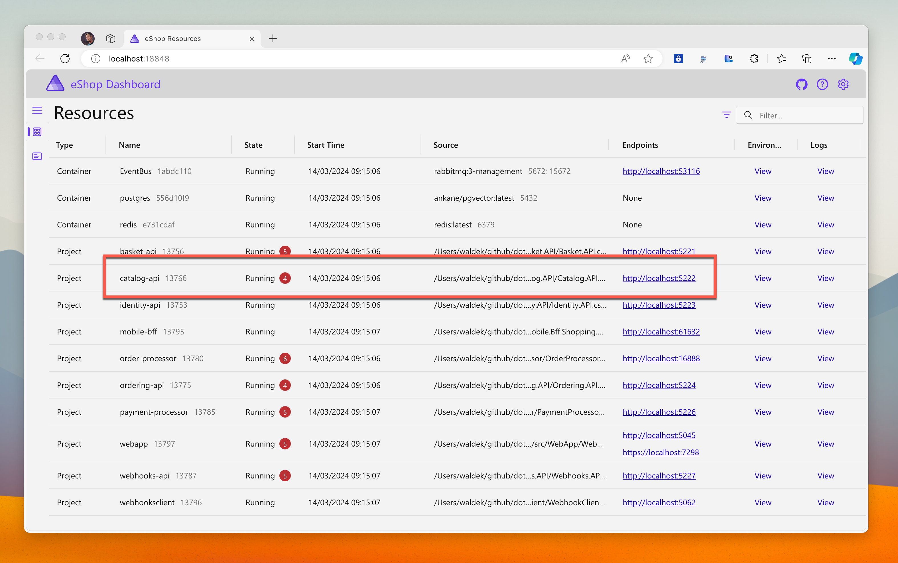
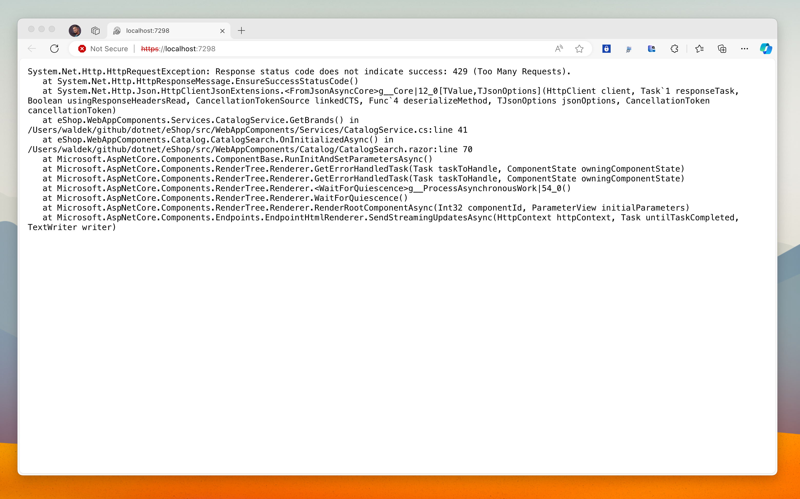
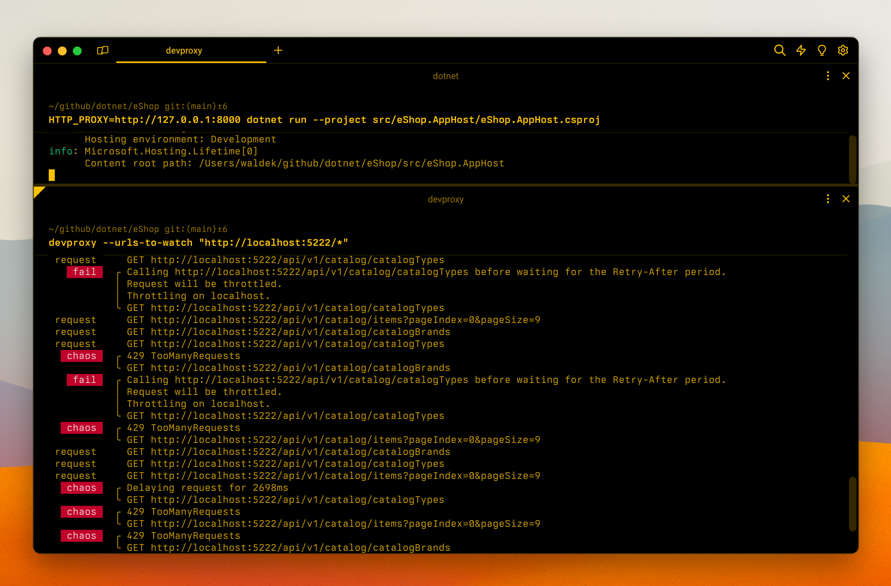
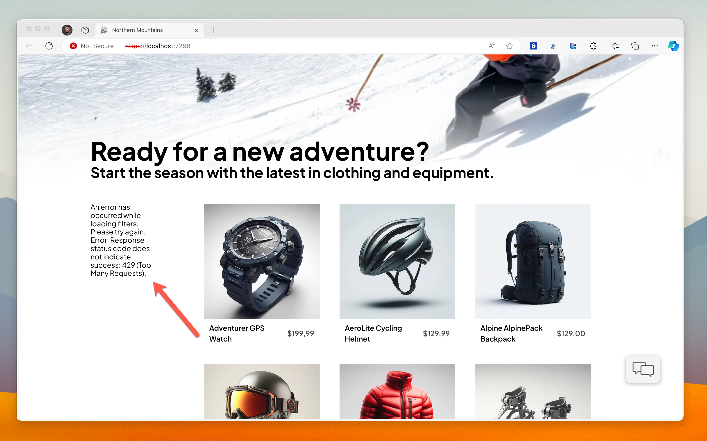

When building apps that connect to APIs, we typically focus on getting the app to work. But what happens when the API is slow, returns errors, or becomes unavailable? The last thing you want is an angry customer calling you when your app breaks. But it's hard to simulate how your app will handle these scenarios when you don't control the APIs you integrate with. Unless you use Dev Proxy.

## The hard thing about connecting to APIs

These days, it's hard to imagine an app that's not connected to an API. We use APIs for everything: from getting data to performing actions. But there's more to using an API than just making a request and getting a response. It's only a matter of time when an API you use won't work as expected. And if you haven't considered it, you'll get yourself in trouble. Let me show you how.


_You shipped a new web app and it's working great. But is it really though?_

Say, you're building an app that connects to an API to get products. You also integrate with an external service to get additional product information. In development, you use a dev version of both APIs, which are used only by you and a few other devs on your team. Your app is fast and reliable. It just works. But then, you deploy your app to production. It's an instant success. In fact, your app is so successful, that the external service you integrate with, can't handle the load anymore and starts returning errors. Your app breaks. Customers leave displeased and go to a competitor. Could you have predicted this? Could you have built your app differently to handle this scenario?

Simulating API errors and behaviors such as rate limiting or throttling isn't impossible, but it's hard. Typically, you don't control the APIs you integrate with, so to simulate their different behaviors, you end up writing complex mocks - a bunch of code that you won't be shipping. It's inefficient, to say the least, but it's the only way, isn't it? Not quite.

## Simulate API behaviors with Dev Proxy

What if I told you, that there's a way for you to **test how your app handles any behavior, of any API that you connect to, without you having to change a line of code in your app**?

Dev Proxy is an API simulator that allows you to simulate different API behaviors, without changing a line of your app's code. That's right. Using Dev Proxy, you can **simulate errors, delays, rate limiting, and more**. All while your app is thinking that it's connected to a real API! Dev Proxy allows you to ensure that your app won't fail miserably when the API it connects to breaks. No more calls from angry customers or account managers standing at your desk demanding you drop everything to put out the fire.

### How does Dev Proxy work?

Dev Proxy is a web proxy that you run locally on your dev machine. Before you start it, you configure it to monitor requests to specific URLs. Then, you define how it should handle these requests: should it return a predefined response, throw an error, delay the response or simulate rate limiting, or other behaviors? When you start Dev Proxy, it registers itself as your system proxy and intercepts all requests that match the URLs you configured. It then applies the behaviors you defined. Your app doesn't know that it's not talking to a real API. It just gets responses as if it was. This makes it for a great way to test how your app handles different API behaviors. Let's see how you can use Dev Proxy to simulate API behaviors in a sample .NET Aspire app.

## Sample case: Improve a .NET Aspire app with Dev Proxy

Consider this sample e-commerce app that's built with .NET Aspire. It consists of several services, including an API for the product catalog. It implements the default resilience patterns. Let's use Dev Proxy to simulate different API behaviors to test the default app's configuration, and improve the app's resilience.

Let's begin by starting the app to find out the URL of the product catalog API. We'll configure Dev Proxy to intercept requests to this URL and simulate different behaviors. The product catalog API is available at `http://localhost:5222`.



### Simulate API throttling

Let's start Dev Proxy and configure it to intercept all requests to this URL:

```sh
devproxy --urls-to-watch "http://localhost:5222/*"
```

In this example, we'll use the default Dev Proxy configuration which simulates several common API errors, as well as latency and throttling. You can control Dev Proxy settings through its configuration file and the collection of plugins that it includes.

Now, let's restart the .NET Aspire app, configuring it to use Dev Proxy as the system proxy. It'll route all requests to the product catalog API through Dev Proxy, which will simulate different behaviors.

```sh
HTTP_PROXY=http://127.0.0.1:8000 dotnet run --project src/eShop.AppHost/eShop.AppHost.csproj
```

Let's start by navigating to the product catalog. Error!



Back in the terminal, we can see that Dev Proxy simulated a 429 Too Many Requests error instructing the client to back off for 5 seconds. While the app has resilience features built-in, it issues several requests in parallel, which makes it seem like it doesn't respect backing off and causes Dev Proxy to fail the requests. After a few failed attempts to call the API, the app gives up and shows the raw stack trace in the browser.



How can we improve the app's resilience to handle this scenario? For one, we should consider catching the API exception and displaying it in a user-friendly way. It'll help us handle not only throttling but also other API errors. We should also consider handling throttling differently, to ensure the app properly backs off and gives the API time to recover.



This is just one scenario that you can simulate with Dev Proxy. You can also simulate other API behaviors, such as latency, rate limiting, and more. This allows you to test how your app handles different API behaviors, without you having to change a line of your app's code. Using Dev Proxy is a great way to test that your resilience code works as intended when you need it the most.

## Summary

When you connect to APIs in your app, you need to think beyond just getting the app to work. It's only a matter of time when the APIs you use will fail. And when they do, you want to ensure that your app can handle it properly, and won't lose your customers' data. Dev Proxy allows you to easily simulate different API behaviors, without you having to change a line of your app's code. With Dev Proxy you'll deploy your app to production with confidence, and won't have to worry about angry customers calling you when your app breaks.

[Try Dev Proxy on your app](https://learn.microsoft.com/microsoft-cloud/dev/dev-proxy/tutorials/simulate-errors-for-your-own-app?tabs=dotnet) and see for yourself how you can improve it.

You can see it in action on a recent episode of On .NET where we walk through getting started with Dev Proxy and all of eShop:

<iframe width="800" height="450" src="https://www.youtube.com/embed/bQDdH-xyqHo?si=xKE4Vxgkrc58rTcD" title="YouTube video player" frameborder="0" allow="accelerometer; autoplay; clipboard-write; encrypted-media; gyroscope; picture-in-picture; web-share" allowfullscreen></iframe>
