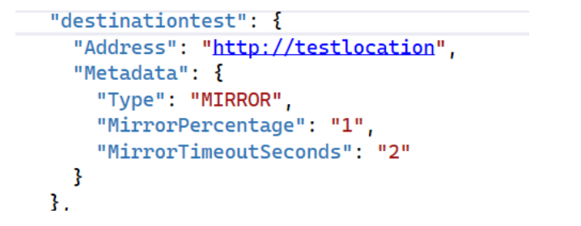
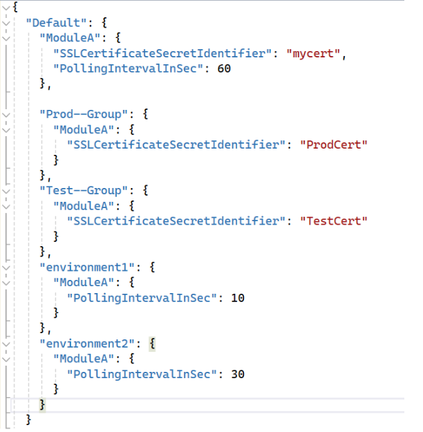

The Microsoft AI team builds comprehensive content, services, platforms, and technology for consumers to get the information they want on any device, anywhere, and for enterprises to improve their customer and employee experiences. Our team powers several experiences such as Bing, CoPilot, Advertising, Maps and Edge, surfacing through entry points like the Edge New Tab Page, Windows 10 and 11, which have over 1 billion monthly active users. We realized the need for a high-performance and reliable gateway to be the front-end and ingress layer for Microsoft AI. This would enable multiple teams to leverage the common capabilities we developed to help run the business and focus on customer experience & features. In this blog post, we will cover the journey to building our gateway, codenamed CETO, with the help of [YARP](https://github.com/microsoft/reverse-proxy) on [.NET8](https://dotnet.microsoft.com/download/dotnet/8.0).


## Reverse Proxy

Before we could start coding CETO, we had to decide on a reverse proxy. Should we use an external one or try to make our own? Would these external ones cover all our use cases? We also had to consider the high cost and continual upkeep for customizing those proxies. We had requirements such as supporting HTTP/2, HTTP/3, streaming protocols like WebSocket, simple extensibility, and more. As we started to look around at what other internal teams at Microsoft were doing, we came across the YARP project. YARP stands for: "Yet Another Reverse Proxy". The project uses ASP.NET and .NET (.NET 6 and newer) to offer a flexible solution that can be modified via .NET code. How convenient is that? It turned out to be just what we needed.

Bing runs one of the world’s largest, highly performant, and reliable .NET applications. We have relied on a close working relationship with the .NET team and have been early adopters of each of .NET release. By trying out and upgrading to each new version, we can give useful feedback to the .NET team. This helps our platform and external customers who will upgrade their services to use these new versions. We include YARP in that feedback cycle.

## Create a new service on modern .NET
Since CETO was a new service, we had the opportunity at the time to use the most recent version of .NET. Today it is built on top of .NET 8, Kestrel + YARP 2.1, running on both Linux and Windows containers across multiple infrastructure platforms and thousands of servers. The ability to run cross-platform increases the portability and compatibility of our modules, as well as the flexibility and efficiency to deploy anywhere. Performance is fast and every single millisecond at this layer counts. CPU% is low, providing reduced operating costs.

CETO provides convergence by unifying our business logic across our platform and then it hands off the request to YARP to do the heavy lifting of routing to appropriate upstream services.  We wanted our routes and mapping to be very customizable because we handle a lot of different teams with diverse traffic patterns which affects other key features.

## Flexibility is essential
We have many choices and control over how we use both .NET and YARP, as they are very adaptable and versatile.  .NET offers a variety of APIs for different needs such as configuration, dependency injection, logging, testing, and debugging. By using .NET, our developers who work on CETO can write flexible, easy-to-maintain code that seamlessly connects with the rest of our service.

Here are a few ways we adapted to meet our requirements:

We want to manage our internal teams’ routes and destinations for customers’ traffic from one central location. With YARP we can choose to load configurations from an external place by providing a couple of classes implementing [IProxyConfigProvider](https://microsoft.github.io/reverse-proxy/api/Yarp.ReverseProxy.Configuration.IProxyConfigProvider.html) and [IProxyConfig](https://microsoft.github.io/reverse-proxy/api/Yarp.ReverseProxy.Configuration.IProxyConfig.html). Teams can create any number of simple or complex routes and deploy them separately from other teams. Changes are reloaded in the background and then we swap the proxy config state with a new snapshot, signaling the old one is outdated.  

The full YARP proxy is used so we have the benefits of routing and load balancing. We wanted to provide an option to forward to another location when receiving back certain http status codes from a service. Teams can set this configuration within the IReadOnlyDictionary<string, string> Metadata section of the YARP route config. We inspect the response before it is returned to the client, grab the metadata from the matched route, and then use the [direct IHttpForwarder](https://microsoft.github.io/reverse-proxy/articles/direct-forwarding.html) to forward the request to another location. By using the IHttpForwarder, we still get error handling, streaming protocols, and http client customization for these requests.

YARP has several default load balancing policies that suit most scenarios. We did not need to modify the choice of a destination for these policies, but rather intervene during that choice and do something else. Creating a new policy from the [ILoadBalancingPolicy](https://microsoft.github.io/reverse-proxy/articles/load-balancing.html#extensibility) and leveraging the use of the IReadOnlyDictionary<string, string> Metadata in the destination properties, we can categorize a specific destination for another purpose.



In this case we wanted to mirror a certain % of requests to a different destination. Traffic mirroring or traffic shadowing is used to replay production traffic to a test environment, with no impact on the end user’s experience. The request is cloned and sent off to a queue for processing, while we continue the normal selection logic to pick an available destination (not of type mirror) for the request.  

[.NET Rate Limiting](https://learn.microsoft.com/aspnet/core/performance/rate-limit) is another feature that is easy to leverage. It has an option to use a [PartitionedRateLimiter](https://learn.microsoft.com/dotnet/api/system.threading.ratelimiting.partitionedratelimiter) which lets you set up a rate limit policy based on a key that can be any unique UserId or some other identifier. We implemented rate limiting per route by using the YARP routeId as part of our key. Owners of these routes can specify their permit values directly in the YARP route config (metadata section) and we pass it to a rate limiter extension. The key is created as routeId + unique identifier so that when teams make updates to their permit limits, we generate a new key. This can automatically be picked up by the Rate Limiting libraries without restarting the service. Rate Limiting will not update permit limits if the policy already exists, hence why we create a new key. The library removes outdated policies after about 30 seconds. This enables us to protect our services for each route and manage the capacity of our teams in a single location.

Most CETO configurations use the Configure and [IOptionsMonitor](https://learn.microsoft.com/dotnet/core/extensions/options) interfaces from .NET with the Json configuration provider. IOptionsMonitor interface is used to retrieve options and manage options notifications for IOptions instances.

Configuration is added with our custom services extension AddSingletonServiceConfig<T> that uses the ConfigurationBuilder to load in order (last key loaded wins):

* Default values
  services.Configure<T>(serviceConfig.GetSection("Default"));

* Environment group values  
  services.Configure<T>(serviceConfig.GetSection(environmentAlias));

* Per environment values
  services.Configure<T>(serviceConfig.GetSection(environmentName));

and then adds the config to a singleton IConfigurationReader<T> that takes in the IOptionsMonitor<T>.

Simple Example:



When a service is started on environment2 which is part of the production group it would result in a configuration such as:

```c#
"ModuleA": {
  "SSLCertificateSecretIdentifier": "ProdCert",
  "PollingIntervalInSec": 30
},
```

When module owners want to add a new configuration, they will make their new schema model as a C# class, add a Json config file, and change CETO to call our service extension.  Their classes now receive the config for the specific running environment with dependency injection.  As we use the [IOptionsMonitor](https://learn.microsoft.com/dotnet/core/extensions/options) it also supports change notifications.

## Performance is important and .NET 8 is even faster

We are always accountable for the performance of our services. As service owners continue to increase the number of features, latency can gradually increase. Each release of .NET has delivered performance gains. We appreciate it when we can upgrade and receive these performance improvements at no cost. However, we still need to profile our services regularly to ensure that we are using our resources wisely. It is useful for our developers to read the [dev blog posts](https://devblogs.microsoft.com/dotnet/performance-improvements-in-net-8/) for helpful tips.

## Looking ahead

By using modern .NET and its features, we were able to create a gateway for our organization that is effective and high quality with no major difficulties. We showed just a few examples of how easy it is to extend the .NET libraries to fit our organizational needs. We are excited for future .NET releases and our continued partnership with the .NET team.