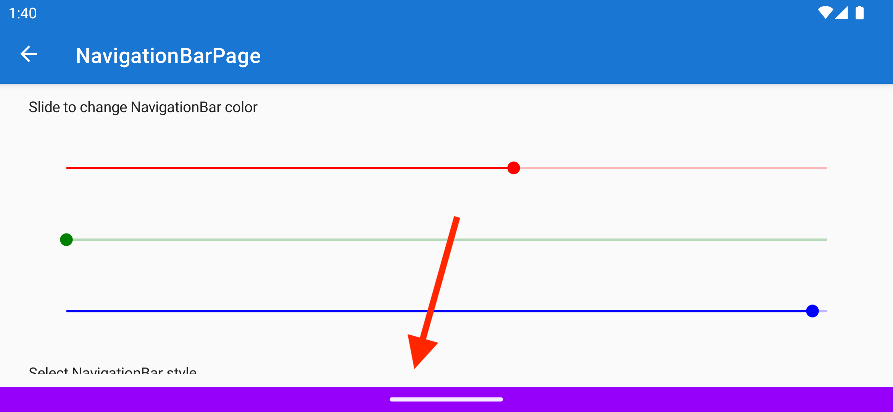

The .NET MAUI Community Toolkit team is proud to introduce to you version 8 of the .NET MAUI Community Toolkit!

In this latest major release, we're bringing you the much anticipated TouchBehavior (previously known as the TouchEffect). But also, beware of breaking changes for the Snackbar on Windows and did you know that you could color the Android navigation bar?

## TouchBehavior

If you have been using the Xamarin Community Toolkit in your Xamarin.Forms app, you probably know about the TouchEffect. Since .NET MAUI, Effects have been deprecated and those should be migrated to [(Platform)Behaviors](https://learn.microsoft.com/dotnet/maui/fundamentals/behaviors#platform-behaviors). And so that is exactly what we did for this functionality as part of implementing it for .NET MAUI.

TouchBehavior provides the ability to interact with any visual element in your app based on touch, mouse clicks and hover events. The TouchBehavior implementation makes it possible to customize many different visual properties of the VisualElement that it is attached to such as the background color, opacity, rotation and scale, as well as many other properties. Additionally, TouchBehavior makes it possible to implement long press touch gestures and enables you to invoke code whenever your user long presses any visual element in your app.

    <video width="294" height="639" controls>
    <source src="ios-touchbehavior-animated.mp4" type="video/mp4">
    </video>

Huge shout out to Alexander, also known as [Axemasta](https://github.com/CommunityToolkit/Maui/pull/1673), who is a community member that has been working closely together with us on this. He did amazing work to implement this huge feature that a lot of people have been waiting for. Thank you so much!

A feature is not complete without documentation, so we have that [ready for you as well](https://learn.microsoft.com/dotnet/communitytoolkit/maui/behaviors/touch-behavior?tabs=toucheffect-xaml%2Ctouchbehavior-xaml). Note that there are some changes in comparison to TouchEffect for Xamarin, so we included a section to help you with the migration.

### (Breaking) changes in Behaviors

As part of our work on TouchBehavior we discovered that the binding context wasn't applied correctly. The good news is that we found the cause of that, the bad news is that it not only applied to TouchBehavior but also all other behaviors in the Toolkit.

Luckily Brandon was quick to find the root cause and [provide a fix for it](https://github.com/CommunityToolkit/Maui/pull/1791) which we released soon after.

Technically this is a breaking change and we're breaking the semantic versioning scheme here, but we figured this would not impact a lot of people. If we were mistaken there, our apologies and please reach out to us so we can help get you sorted. Please do so by opening an issue on the [repository](https://github.com/CommunityToolkit/Maui) with all the necessary details.

## Breaking changes for Snackbar on Windows

A new major version typically means exciting new features, but also breaking changes. In this case there are some breaking changes for the use of Snackbar on Windows.

Actually, Vladislav has done a complete rewrite of the Snackbar implementation on Windows. With this change we replace what is being used under the hood for implementing Snackbar and Toast on Windows. As a result, we fixed some crashes, but more importantly your Windows app is not launching another instance when you interact with a Toast or Snackbar anymore.

Be sure to check out the [documentation](https://learn.microsoft.com/dotnet/communitytoolkit/maui/alerts/snackbar?tabs=windows%2Candroid) for the Snackbar on how this might impact your project. Or, if you really want to get into the details, have a look at the [pull request](https://github.com/CommunityToolkit/Maui/pull/1658) for this change.

## Android navigation bar color

Before we go into this new feature, let's clear up what we're talking about here exactly first. The term navigation bar seems to cause some confusion. Typically, when people think about a navigation bar, they will think about the bar at the top of a page with the title and maybe some toolbar items. However, in the Android context there is also the _system_ navigation bar. And that is the one with the 3 buttons for going back a page, opening the multi-tasking view and going to the home screen on your device. That is the navigation bar we're talking about here!

With that in mind, let's talk about the actual feature. You can now color this bar on Android so that your app will feel even more immersive, and your theme is completely integrated with everything you see on screen.

You can also control whether the navigation bar shows its light content or dark content, which means whether the icons are in a light or dark color. This lets you ensure that the navigation bar always matches your app's style.

How to get started and all you need to know about this feature can be found in the [documentation](https://learn.microsoft.com/dotnet/communitytoolkit/maui/platform-specific/navigation-bar).

## Many bugfixes and optimalizations

Of course a lot of other work has gone into this release, be sure to check out the full list on the [release notes](https://github.com/CommunityToolkit/Maui/releases/tag/8.0.0) with all the bugfixes and other optimalizations that have gone into this release.

A big thank you to everyone that has made this release possible, especially all the community members that have been so kind to spend their precious time on our project and contributing to the .NET MAUI ecosystem.

## What's next?

We're thrilled to bring you this latest major version of the .NET MAUI Community Toolkit, but of course we're not stopping here. The next major feature is already being worked on which is the [CameraView](https://github.com/CommunityToolkit/Maui/pull/1758) that is now being ported from Xamarin over to .NET MAUI. While this is part of the Toolkit family it will be released as a separate package so be on the lookout for that one. Furthermore we're working on improvements for [MediaElement](https://learn.microsoft.com/dotnet/communitytoolkit/maui/views/mediaelement) to bring deeper integration with the operating system like playing media from the lock screen and showing relevant metadata, and of course much more beyond that.

Let us know what you think about this latest release, get in touch on the [GitHub repository](https://github.com/CommunityToolkit/Maui), join our [Discord server](https://discord.gg/vV8jvWSZmk) and come hang out on our live streams which happen every first Thursday of the month on the [.NET Foundation YouTube channel](https://www.youtube.com/@NETFoundation) at 12:00 Pacific Time.

You can get all of this goodness today! So, make sure to update your .NET MAUI Community Toolkit package to version 8 today and start coding!
