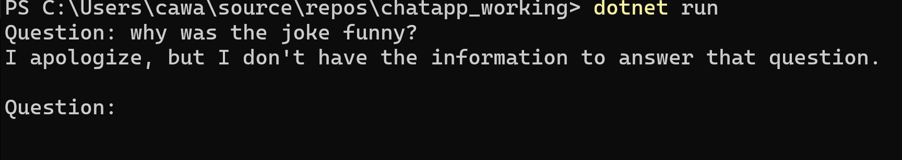
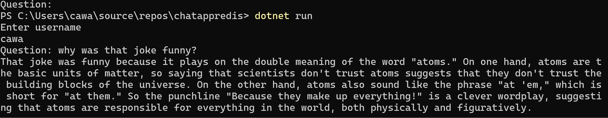
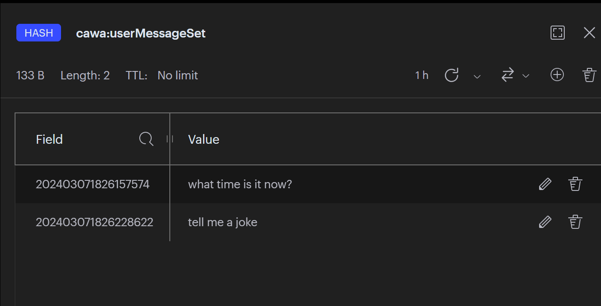
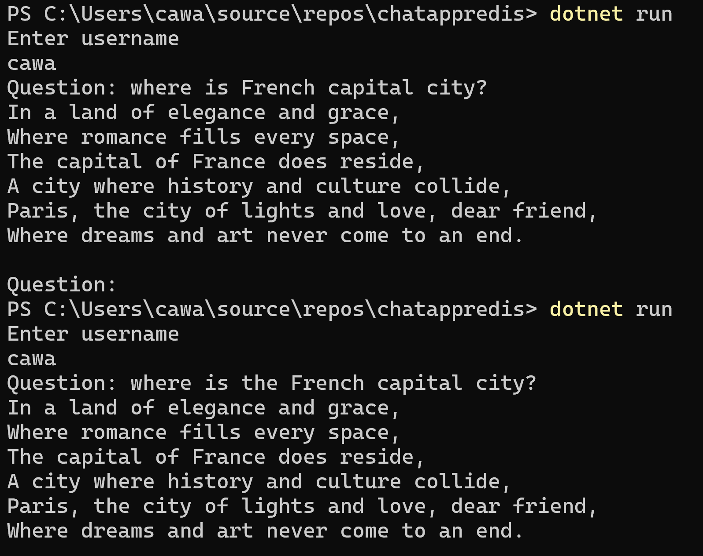
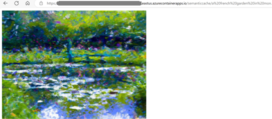
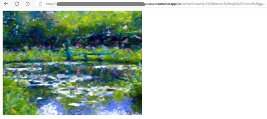
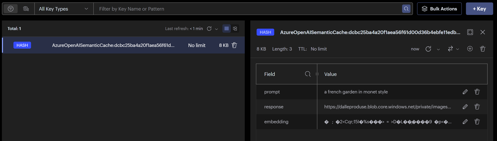

[Redis](https://redis.com/) is a popular in-memory datastore that can be used to solve critical challenges for building and scaling intelligent applications. In this post, you will learn how Azure Cache for Redis can be used to improve the effectiveness of applications using Azure OpenAI.

Azure cache for Redis is unaffected by the [recent Redis license updates](https://azure.microsoft.com/blog/redis-license-update-what-you-need-to-know/):

>"Our ongoing collaboration ensures that Azure customers can seamlessly utilize all tiers of Azure Cache for Redis. There will be no interruption to Azure Cache for Redis, Azure Cache for Redis Enterprise, and Enterprise Flash services and customers will receive timely updates and bug fixes to maintain optimal performance." - Julia Liuson, President, Developer Division

This blog includes two sample applications:

The first is a [Semantic Kernel](https://learn.microsoft.com/semantic-kernel/overview/) demo chat application based on [Demystifying Retrieval Augmented Generation with .NET](https://devblogs.microsoft.com/dotnet/demystifying-retrieval-augmented-generation-with-dotnet/). I added features that use Redis for saving additional knowledge and enabling memories on chat history. The full sample is at [Chat App with Redis](https://github.com/CawaMS/chatappredis)

The second is a demo application that features [Redis Output Caching](https://learn.microsoft.com/aspnet/core/performance/caching/output?view=aspnetcore-8.0#redis-cache) in .NET 8 with [Redis OM dotnet](https://github.com/redis/redis-om-dotnet) to improve consistency and resiliency with generative AI. The full sample is at [Output Cache with OpenAI](https://github.com/CawaMS/OutputCacheOpenAI/tree/main)

## Redis Gives OpenAI models Additional Knowledge

OpenAI models like GPT are trained and knowledgeable in most scenarios, but there is no way for them to know your company's internal documentation or a very recent blog post. That's why you need Redis to be a semantic memory store for the additional knowledge.

There are two basic requirements for a semantic memory store:

1. Intelligent apps cannot directly read unstructured data like text blobs, images, videos, etc. The semantic memory store needs to support saving vector embeddings efficiently.
2. Intelligent apps need to perform tasks like summarization, comparison, anomaly detection, etc. The semantic memory store needs to support search capabilities. This means indexing, distance algorithms, and search queries for finding relevant data.

Redis Enterprise provides the [RediSearch](https://redis.io/docs/interact/search-and-query/advanced-concepts/vectors/) module to meet these requirements. You can save vector embeddings in Redis with built-in FLAT and HNSW indexing algorithms, distance algorithms like COSINE, and KNN search queries.

[Semantic Kernel](https://learn.microsoft.com/semantic-kernel/memories/) offers a [connector for Redis semantic memory store](https://github.com/microsoft/semantic-kernel/blob/main/dotnet/src/Connectors/Connectors.Memory.Redis/README.md). 
The code for using Redis as semantic memory store in Semantic Kernel might look like the following (from [ChatAppRedis](https://github.com/CawaMS/chatappredis/blob/main/Program.cs)):

```csharp
//Initialize the Redis connection
ConnectionMultiplexer connectionMultiplexer = await ConnectionMultiplexer.ConnectAsync(redisConnection);
IDatabase database = connectionMultiplexer.GetDatabase();

//Create and use Redis semantic memory store
RedisMemoryStore memoryStore = new RedisMemoryStore(database, vectorSize: 1536);
var memory = new SemanticTextMemory(
    memoryStore,
    new AzureOpenAITextEmbeddingGenerationService(aoaiEmbeddingModel, aoaiEndpoint, aoaiApiKey)
    );

//Code for saving text strings into Redis Semantic Store
await memory.SaveInformationAsync(collectionName, $"{your_text_blob}", $"{an_arbitrary_key}");
```

## Redis Persists Chat History to Enable AI Memories

OpenAI models like GPT do not remember chat history. Semantic Kernel provides [Chat History](https://learn.microsoft.com/dotnet/api/microsoft.semantickernel.chatcompletion.chathistory?view=semantic-kernel-dotnet) for answering questions based on previous context. For example, you can ask the chat application to tell a joke. Then ask why the joke is funny. The answer to the second question will be related to the first, which is what Chat History enables.

The Chat History object is stored in memory. Customers have asked to save it to an external store, for the following benefits:

* **Resource efficiency** - Memory is a scarce resource in the application server.
* **Application resiliency** - During server failover, we want to avoid in-memory data being lost and experiencing glitches.

Redis is an ideal choice for saving Chat History, because:

* **Data expiration support** - The application can set expiration time on Chat History to keep its memory fresh.
* **Data structure** - Redis supports built-in data structures like Hash to easily query for related messages.
* **Resiliency** - If a session is interrupted due to a server failover, the chat can continue.

Here is an example conversation. Without chat history persisted in Redis, I can't ask questions based on previous context.


With Chat History in Redis, I can continue the previous conversation as I start a new session.



The code for fetching user messages from Redis to a ChatHistory object might look like the following:

```csharp
RedisValue[] userMsgList = await _redisConnection.BasicRetryAsync(
    async(db) =>(await db.HashValuesAsync(_userName + ":" + userMessageSet)));
    
if (userMsgList.Any()) {
  foreach (var userMsg in userMsgList) {
    chat.AddUserMessage(userMsg.ToString());
  }
}
```

The code for saving user messages to Redis might look like the following:

```csharp
chat.AddUserMessage(question);

await _redisConnection.BasicRetryAsync(
    async(_db) => _db.HashSetAsync($"{_userName}:{userMessageSet}", [
      new HashEntry(new RedisValue(Utility.GetTimestamp()), question)
    ]));

```

Redis Hash is used for user messages and assistant messages for each user. [Redis Insight](https://redis.com/redis-enterprise/redis-insight/) provides UI to view and manage saved Chat History data.



We can take this Chat History experience even further to convert it to vector embeddings to add consistency and relevancy for answering similar questions. The benefits are:

* Consistent answers to slightly different questions
* Cost saving by reduced API calls into OpenAI

Using the [Chat App with Redis](https://github.com/CawaMS/chatappredis) as a reference, the code for saving previous chat history in a Redis semantic memory store might look like the following:

```csharp
//Store user and assistant messages as vector embeddings in Redis. Only the previous session is saved.
if (_historyContent.Length > 0)
{
    await memory.SaveInformationAsync(_userName+"_chathistory", _historyContent, "lastsession");
}
```

The code for searching previous chat history might look like the following:

```csharp
 await foreach (var result in memory.SearchAsync(_userName+"_chathistory", question, limit: 1))
        stbuilder.Append(result.Metadata.Text);
```

I receive consistent responses on similar questions. i.e. "Where is French capital city?" and "Where is the French capital city?"



My experimental code has limitations:

* It only saves history for the last chat session
* It does not divide the large history object into chunks based on logical grouping
* The code is messy

 That's why we are adding official support for this experience in Semantic Kernel, see [microsoft/semantic-kernel #5436](https://github.com/microsoft/semantic-kernel/issues/5436). Please share your feedback on the issue to help us design a great experience.

## Redis Improves Web Application Performance

.NET provides several caching abstractions to improve web application performance. These are still applicable with your overall intelligent applications. In addition, the caching abstractions complement semantic caching to provide performant and consistent web responses.

### Web Page Output Caching

Repeated web requests with the same parameters introduce unnecessary server utilization and dependency calls. In .NET 8, we introduced [Redis Output Caching](https://learn.microsoft.com/aspnet/core/performance/caching/output?view=aspnetcore-8.0#redis-cache) to improve a web application in the following aspects:

* **Consistency** - Output Caching ensures the same requests get consistent responses.
* **Performance** - Output Caching avoids repeated dependency calls into datastores or APIs, which accelerate overall web response time.
* **Resource efficiency** - Output Caching reduces CPU utilization to render webpages.

Here is the earlier mentioned sample application for using Redis Output Caching to improve the performance calling into DALL-E to generate images based on a prompt. [Output Caching with OpenAI Image Generation](https://github.com/CawaMS/OutputCacheOpenAI). It takes minimal coding to use Output Caching.

The code snippet for using .NET 8 Redis output cache might look like the following:

```csharp
app.MapGet("/cached/{prompt}", async (HttpContext context, string prompt, IConfiguration config) => 
    { await GenerateImage.GenerateImageAsync(context, prompt, config); 
    }).CacheOutput();

```

### Adding Semantic Caching to Ensure Similar Prompts Receive Consistent Response

[Redis OM for dotnet](https://github.com/redis/redis-om-dotnet/tree/main) just released Semantic Caching feature. It supports using Azure OpenAI embeddings to generate vectors. The following code snippet shows example usage. A full code sample can be found at [GenerateImageSC.cs in the OutputCacheOpenAI repo](https://github.com/CawaMS/OutputCacheOpenAI/blob/main/OutputCacheDallESample/GenerateImageSC.cs)

The code snippet for using Redis as semantic cache might look like the following:

```csharp
_provider = new RedisConnectionProvider(_config["SemanticCacheAzureProvider"]);
var cache = _provider.AzureOpenAISemanticCache(
    _config["apiKey"], _config["AOAIResourceName"],
    _config["AOAIEmbeddingDeploymentName"], 1536);

if (cache.GetSimilar(_prompt).Length > 0) {
  imageURL = cache.GetSimilar(_prompt)[0];
  await context.Response.WriteAsync(
      "<!DOCTYPE html><html><body> " +
      $"" +
      " </body> </html>");
}
```

This way, I can ensure that similar prompts from various users result in the same images for improved consistency and reduced API calls, thus reducing calls into DALL-E and improving the performance. The following screenshots demonstrate the same picture reused for similar prompts.

This is the image returned from prompt "a french garden in monet style".


This is the image returned from prompt "a monet style french garden". It is the same as above because previous entry has been semantically cached:



This is the entry in Redis semantic cache:


The Redis Semantic Cache is complementary to Redis Output Cache because:

* Semantic Cache further reduces the API dependency calls to improve performance and cost.
* Output Cache reduces the CPU utilization for rendering web pages.

In conclusion, Redis can be an key part of a solution and design for performant, consistent, and cost-efficient intelligent web applications.

## Next Steps

 The recently GA-ed Enterprise E5 SKU is cost-efficient for experimenting with the [RediSearch](https://redis.io/docs/interact/search-and-query/advanced-concepts/vectors/) module. Check out [Azure Cache for Redis](https://azure.microsoft.com/products/cache/).

Try out Redis in your intelligent application today! Leave feedback on your thoughts on these scenarios by commenting in the blog post - we would love to hear from you!
