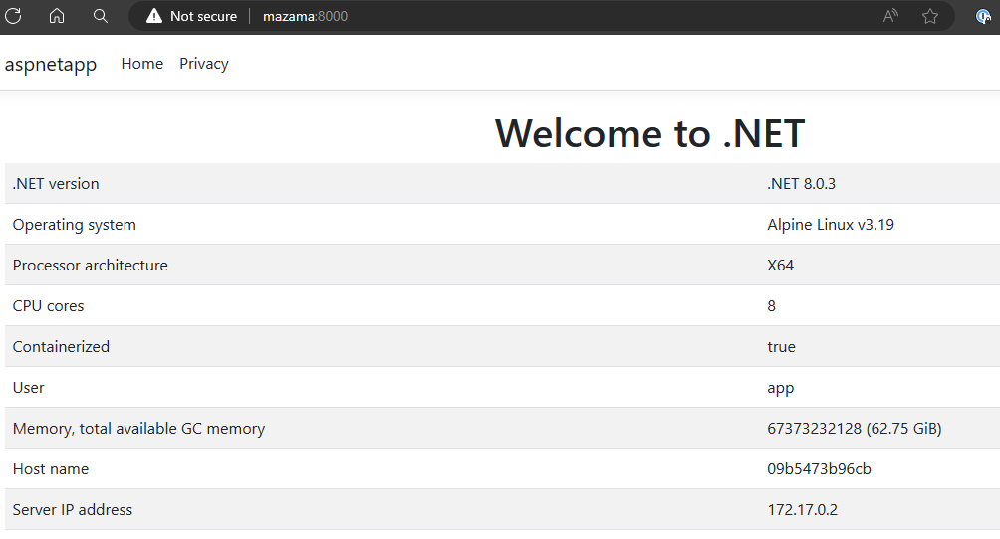

.NET 8 is a big step forward for building and using containers, with improvements for performance, security, and usability. We've been working over several releases to make .NET one of the simplest and most secure container platforms, as a default experience. Those efforts have all come together in an integrated way with .NET 8. We've delivered on the most common requests: [non-root images](https://devblogs.microsoft.com/dotnet/securing-containers-with-rootless/), [smaller image size](https://devblogs.microsoft.com/dotnet/announcing-dotnet-chiseled-containers/), and [built-in image publishing](https://learn.microsoft.com/dotnet/core/docker/publish-as-container). We've also delivered some critical features that are required for advanced workflows.

We've pivoted to [`dotnet publish`](https://devblogs.microsoft.com/dotnet/announcing-builtin-container-support-for-the-dotnet-sdk/) as our recommended approach to container publishing. It makes it really easy to produce images. That's all driven by [MSBuild](https://github.com/dotnet/msbuild/) (which powers `dotnet publish`). It can infer intent and make decisions on your behalf, for example, on the best base image to use. As we add and expand features, like [Native AOT](https://learn.microsoft.com/dotnet/core/deploying/native-aot/), we teach `dotnet publish` the best default container publishing choices for that scenario. That makes container publishing a straightforward extension of your development process.

Dockerfiles remain very popular and we continue to provide [extensive samples](https://github.com/dotnet/dotnet-docker/blob/main/samples/README.md) for them, including how to [enable new scenarios like non-root](https://github.com/dotnet/dotnet-docker/blob/e5e8164460037e77902cd269c788eccbdeea5edd/samples/dotnetapp/Dockerfile#L20). In fact, we often reach for Dockerfiles when we're prototyping ideas or reproducing a customer issue.

We recently worked with the team at Docker to improve [the `docker` CLI .NET developer experience](https://docs.docker.com/language/dotnet/containerize/). It is now possible to run `docker init` in a .NET project directory to generate a working Dockerfile. Those Dockerfiles use some [very useful caching features](https://docs.docker.com/build/guide/mounts/#add-a-cache-mount) that we're starting to adopt in our samples.

We recommending taking a look at the [.NET 8 Container Workshop](https://github.com/richlander/container-workshop) that we shared in our [.NET Conf 2023 container talk](https://www.youtube.com/watch?v=scIAwLrruMY) as a great way to learn all the new .NET 8 capabilities.

In this post, you will learn how to:

- Publish a container image using dotnet publish
- Produce an image for a specific distro with the SDK
- Build a globalization-friendly chiseled image
- Inspect a container image to understand what is included in the chiseled image
- Understand important differences between SDK published container images and Dockerfile based images

The post will demonstrate some quick demos (with useful syntax that you can re-use). We'll go into more detail in follow-up posts. If you are less into commandline experience, you'll find that [Visual Studio Code works much the same way](https://devblogs.microsoft.com/dotnet/debugging-dotnet-containers-with-visual-studio-code-docker-tools/).

## Publish a "Hello world" container image

Let's start with the most basic experience with the console app template.

```bash
$ dotnet new console -o myapp
$ cd myapp
$ dotnet publish -t:PublishContainer -p:EnableSdkContainerSupport=true
  Building image 'myapp' with tags 'latest' on top of base image 'mcr.microsoft.com/dotnet/runtime:8.0'.
  Pushed image 'myapp:latest' to local registry via 'docker'.
$ docker run --rm myapp
Hello, World!
```

The `PublishContainer` task produces a container image that it pushes to the local Docker daemon. It knows that a `runtime` base image should be used for console apps and that an `8.0` tag should be used for a .NET 8 app. The resulting image can be run with `docker run`, which requires [Docker Desktop](https://www.docker.com/products/docker-desktop/) (or equivalent) to be installed.

The `EnableSdkContainerSupport` property is required for publishing console projects as container images. It is not set by default for console apps (or any other app that uses the `Microsoft.NET.Sdk` SDK), while ASP.NET Core apps have it set (implicitly). This property can be included in a project file, which is recommended, or set via the CLI (as demonstrated above).

## Inspecting the image

It's often easier to understand what is going on with a better demo.

The following is a two line `Program.cs`, which will print runtime information.

```csharp
using System.Runtime.InteropServices;
Console.WriteLine($"Hello {Environment.UserName}, using {RuntimeInformation.OSDescription} on {RuntimeInformation.OSArchitecture}");
```

The project file has been updated to include the `EnableSdkContainerSupport` property so it doesn't need to be provided with the `dotnet publish` command.

```xml
<Project Sdk="Microsoft.NET.Sdk">

  <PropertyGroup>
    <OutputType>Exe</OutputType>
    <TargetFramework>net8.0</TargetFramework>
    <RootNamespace>hello_dotnet</RootNamespace>
    <ImplicitUsings>enable</ImplicitUsings>
    <Nullable>enable</Nullable>
    <!-- This property is needed for `Microsoft.NET.Sdk` projects-->
    <EnableSdkContainerSupport>true</EnableSdkContainerSupport>
  </PropertyGroup>

</Project>
```

Let's rebuild and re-run the container image again.

```bash
$ dotnet publish -t:PublishContainer
  Building image 'myapp' with tags 'latest' on top of base image 'mcr.microsoft.com/dotnet/runtime:8.0'.
  Pushed image 'myapp:latest' to local registry via 'docker'.
$ docker run --rm myapp
Hello app, using Debian GNU/Linux 12 (bookworm) on X64
```

.NET images use Debian by default, which is apparent from the output. We can also see that `app` is the user running the process. We'll discuss the `app` user in much more depth in a following post.

```bash
$ docker run --rm --entrypoint bash myapp -c "cat /etc/os-release | head -n 1"
PRETTY_NAME="Debian GNU/Linux 12 (bookworm)"
```

The image is indeed Debian, as demonstrated by the `os-release` file in the image. In fact, the `RuntimeInformation` API gets the data from this same file, which is why the strings match.

## Producing an image for a specific distro

It is possible to build an image for a specific distro with the SDK. We'll start with publishing the [aspnetapp](https://github.com/dotnet/dotnet-docker/tree/main/samples/aspnetapp/aspnetapp) for Alpine.

```bash
$ dotnet publish --os linux-musl -t:PublishContainer
  Building image 'aspnetapp' with tags 'latest' on top of base image 'mcr.microsoft.com/dotnet/aspnet:8.0-alpine'.
  Pushed image 'aspnetapp:latest' to local registry via 'docker'.
$ docker run --rm -it -p 8000:8080 aspnetapp
info: Microsoft.Hosting.Lifetime[14]
      Now listening on: http://[::]:8080
info: Microsoft.Hosting.Lifetime[0]
      Application started. Press Ctrl+C to shut down.  
```

The SDK knows when a build targets `linux-musl` that an Alpine image should be used. This feature is new with .NET SDK 8.0.200. Previously, `ContainerFamily=alpine` had to be used to get the same result.

The following image shows the web app in the browser.



`ContainerFamily=jammy` is needed to produce Ubuntu images and `ContainerFamily=jammy-chiseled` is needed to produce Ubuntu Chiseled containers.

```bash
$ dotnet publish -t:PublishContainer -p:ContainerFamily=jammy-chiseled
  aspnetapp -> /home/rich/git/dotnet-docker/samples/aspnetapp/aspnetapp/bin/Release/net8.0/aspnetapp.dll
  aspnetapp -> /home/rich/git/dotnet-docker/samples/aspnetapp/aspnetapp/bin/Release/net8.0/publish/
  Building image 'aspnetapp' with tags 'latest' on top of base image 'mcr.microsoft.com/dotnet/aspnet:8.0-jammy-chiseled'.
  Pushed image 'aspnetapp:latest' to local registry via 'docker'.
```

You can see that an Ubuntu Chiseled image is used. You can also see that [`publish` defaults to `Release` with .NET 8](https://learn.microsoft.com/dotnet/core/whats-new/dotnet-8/sdk#dotnet-publish-and-dotnet-pack-assets).

The Alpine support is arguably simpler. Alpine is the only distro we support for the [`linux-musl` configuration](https://musl.libc.org/), while we produce both Debian and Ubuntu container images for `linux` with Debian being the default (which we do not intend to change).

## World-ready chiseled images

We heard a lot of excitement about chiseled images when we first announced them, however, some users told us that they needed [globalization-friendly chiseled images](https://github.com/dotnet/dotnet-docker/issues/5014). We produced those as [`extra`](https://github.com/dotnet/dotnet-docker/discussions/5092) images that include `icu` and `tzdata` libraries.

Let's take a look at how that works with the [`globalapp` sample](https://github.com/dotnet/dotnet-docker/blob/main/samples/globalapp/README.md), starting with `ContainerFamily=jammy-chiseled`.

```bash
$ dotnet publish -t:PublishContainer -p:EnableSdkContainerSupport=true -p:ContainerFamily=jammy-chiseled
  Building image 'globalapp' with tags 'latest' on top of base image 'mcr.microsoft.com/dotnet/runtime:8.0-jammy-chiseled'.
  Pushed image 'globalapp:latest' to local registry via 'docker'.
$ docker run --rm globalapp
Hello, World!

****Print baseline timezones**
Utc: (UTC) Coordinated Universal Time; 04/01/2024 23:41:20
Local: (UTC) Coordinated Universal Time; 04/01/2024 23:41:20

****Print specific timezone**
Unhandled exception. System.TimeZoneNotFoundException: The time zone ID 'America/Los_Angeles' was not found on the local computer.
 ---> System.IO.DirectoryNotFoundException: Could not find a part of the path '/usr/share/zoneinfo/America/Los_Angeles'.
   at Interop.ThrowExceptionForIoErrno(ErrorInfo errorInfo, String path, Boolean isDirError)
   at Microsoft.Win32.SafeHandles.SafeFileHandle.Open(String path, OpenFlags flags, Int32 mode, Boolean failForSymlink, Boolean& wasSymlink, Func`4 createOpenException)
   at Microsoft.Win32.SafeHandles.SafeFileHandle.Open(String fullPath, FileMode mode, FileAccess access, FileShare share, FileOptions options, Int64 preallocationSize, UnixFileMode openPermissions, Int64& fileLength, UnixFileMode& filePermissions, Boolean failForSymlink, Boolean& wasSymlink, Func`4 createOpenException)
   at System.IO.Strategies.OSFileStreamStrategy..ctor(String path, FileMode mode, FileAccess access, FileShare share, FileOptions options, Int64 preallocationSize, Nullable`1 unixCreateMode)
   at System.TimeZoneInfo.ReadAllBytesFromSeekableNonZeroSizeFile(String path, Int32 maxFileSize)
   at System.TimeZoneInfo.TryGetTimeZoneFromLocalMachineCore(String id, TimeZoneInfo& value, Exception& e)
   --- End of inner exception stack trace ---
   at System.TimeZoneInfo.FindSystemTimeZoneById(String id)
   at Program.<Main>$(String[] args) in /home/rich/git/dotnet-docker/samples/globalapp/Program.cs:line 24
```

That's surely not good! This app doesn't work correctly without `tzdata` and that's exactly what the error is telling us. That's also the problem that motivated the feature requests we received that led to the `extra` images. Note that the exception is due to `tzdata`, but we'd see an ICU related exception as well if the program had gotten farther.

Let's try again with the `extra` image. I'll also pass in a specific timezone this time using the `TZ` environment variable.

```bash
$ dotnet publish -t:PublishContainer -p:EnableSdkContainerSupport=true -p:ContainerFamily=jammy-chiseled-extra
  Building image 'globalapp' with tags 'latest' on top of base image 'mcr.microsoft.com/dotnet/runtime:8.0-jammy-chiseled-extra'.
  Pushed image 'globalapp:latest' to local registry via 'docker'.
$ docker run --rm -e TZ="Pacific/Auckland" globalapp
Hello, World!

****Print baseline timezones**
Utc: (UTC) Coordinated Universal Time; 04/02/2024 00:48:41
Local: (UTC+12:00) New Zealand Time; 04/02/2024 13:48:41

****Print specific timezone**
Home timezone: America/Los_Angeles
DateTime at home: 04/01/2024 16:44:02

****Culture-specific dates**
Current: 04/01/2024
English (United States) -- en-US:
4/1/2024 11:44:02 PM
4/1/2024
11:44 PM
English (Canada) -- en-CA:
2024-04-01 11:44:02 p.m.
2024-04-01
11:44 p.m.
French (Canada) -- fr-CA:
2024-04-01 23 h 44 min 02 s
2024-04-01
23 h 44
Croatian (Croatia) -- hr-HR:
01. 04. 2024. 23:44:02
01. 04. 2024.
23:44
jp (Japan) -- jp-JP:
4/1/2024 23:44:02
4/1/2024
23:44
Korean (South Korea) -- ko-KR:
2024. 4. 1. 오후 11:44:02
2024. 4. 1.
오후 11:44
Portuguese (Brazil) -- pt-BR:
01/04/2024 23:44:02
01/04/2024
23:44
Chinese (China) -- zh-CN:
2024/4/1 23:44:02
2024/4/1
23:44

****Culture-specific currency:**
Current: ¤1,337.00
en-US: $1,337.00
en-CA: $1,337.00
fr-CA: 1 337,00 $
hr-HR: 1.337,00 kn
jp-JP: ¥ 1337
ko-KR: ₩1,337
pt-BR: R$ 1.337,00
zh-CN: ¥1,337.00

****Japanese calendar**
08/18/2019
01/08/18
平成元年8月18日
平成元年8月18日

****String comparison**
Comparison results: `0` mean equal, `-1` is less than and `1` is greater
Test: compare i to (Turkish) İ; first test should be equal and second not
0
-1
Test: compare Å Å; should be equal
0
```

That's a lot better. Let's do a size comparison to get the point across.

```bash
$ dotnet publish -t:PublishContainer -p:EnableSdkContainerSupport=true
  Building image 'globalapp' with tags 'latest' on top of base image 'mcr.microsoft.com/dotnet/runtime:8.0'.
  Pushed image 'globalapp:latest' to local registry via 'docker'.
$ dotnet publish -t:PublishContainer -p:EnableSdkContainerSupport=true -p:ContainerFamily=jammy-chiseled-extra -p:ContainerRepository=globalapp-jammy-chiseled-extra
  Building image 'globalapp-jammy-chiseled-extra' with tags 'latest' on top of base image 'mcr.microsoft.com/dotnet/runtime:8.0-jammy-chiseled-extra'.
  Pushed image 'globalapp-jammy-chiseled-extra:latest' to local registry via 'docker'.
$ docker images globalapp
REPOSITORY   TAG       IMAGE ID       CREATED          SIZE
globalapp    latest    91422e1c0b0e   17 seconds ago   193MB
$ docker images globalapp-jammy-chiseled-extra
REPOSITORY                       TAG       IMAGE ID       CREATED          SIZE
globalapp-jammy-chiseled-extra   latest    da9621e19cad   59 seconds ago   123MB
```

These commands build the sample for the default Debian image then for the Ubuntu Chiseled `extra` image. The difference is 70MB (uncompressed). That's a pretty nice win. You could similarly use Alpine with the [following pattern](https://github.com/dotnet/dotnet-docker/blob/main/samples/dotnetapp/Dockerfile.alpine-icu).

## Frequently asked questions

> How does this all work?

The mechanism that `PublishContainer` uses is more straightforward than one might guess. Container images are compressed files, composed of [layers of compressed files](https://github.com/richlander/container-registry-api). The `PublishContainer` MSBuild Target builds the app, compresses it in the correct format (with metadata), downloads a base image (also a compressed file) from a registry, and then packages the layers together in (again) the correct compressed format. Much of this is accomplished with the (relatively new) [`TarFile` class](https://learn.microsoft.com/dotnet/api/system.formats.tar). In fact, all of this container functionality was implemented only after `TarFile` was added.

> "What about up to date checks?"

Many users build images with `docker build --pull`. That's a good idea to ensure that a new application image uses a fresh base image (for example with CVE fixes). `dotnet publish -t:PublishContainer` does the same thing by default. The image manifest for the specified tag (like `mcr.microsoft.com/dotnet/aspnet:8.0`) is always pulled. If the associated digest doesn't exist in the local cache, then the image is pulled.

`dotnet publish` uses its own cache for images. If you build an application image, it will pull a base image to build on top of. This base image will not affect the images that are maintained by Docker Desktop, for example. The `dotnet publish` cache is maintained in temporary storage, at the location specified by `System.IO.Path.GetTempPath()` on a given machine.

> "Where's the Dockerfile?"

We sometimes get asked if users can see the `Dockerfile` we are using or if it can be modified. There is no `Dockerfile` that is used in this scenario. `docker build` and a `Dockerfile` assumes a Linux operating system, in particular to execute `RUN` commands (like to run `apt`, `curl` or `tar`). We don't have or support anything like that. `PublishContainer` is solely downloading base image layers and then copying one container layer onto another and packaging them up as an [OCI image](https://github.com/opencontainers/image-spec).

> "This is a great 'no Docker' solution!"

That's not the intent and not really reality. The `PublishContainer` support can be thought of as a "no Dockerfile" solution, however [Docker](https://www.docker.com/) is incredibly useful, and you can see that the post relies on it extensively. We also see users using [podman](https://podman.io/). If you are really adventurous, you can use [containerd](https://containerd.io/), directly.

There is one way in which this is correct. `dotnet publish` supports [pushing images to a registry](https://github.com/richlander/container-workshop/blob/main/push-to-registry.md). It supports several. This capability can be very useful for GitHub Actions and similar CI environments. We'll cover that in a later post.

> "How do I install packages with `apt` if there is no `Dockerfile`?"

You don't, directly. `dotnet publish` can download any base image. You can make your own base image, for example, with additional packages installed, push that to a registry and then [reference that](https://github.com/richlander/container-workshop/blob/main/publish-oci-reference.md). It can be based on one of the Microsoft images or not. `dotnet publish` is happy to download it.

## Summary

Containers have become synonymous with the cloud for many styles of workloads. While we've been saying that for years, it is more true now than ever. Delivering first-class container support has been a focus of the team for several years now, and we remain committed to that.

With .NET 8, we've delivered: [non-root images](https://devblogs.microsoft.com/dotnet/securing-containers-with-rootless/) (for security and usability), [chiseled images](https://devblogs.microsoft.com/dotnet/announcing-dotnet-chiseled-containers/) (for performance and security),  and [container image building with `dotnet publish`](https://learn.microsoft.com/shows/containers-with-dotnet-and-docker-for-beginners/) (for usability).

There is still a lot more to tell with what we delivered in .NET 8, which we'll describe and demonstrate in future posts.
