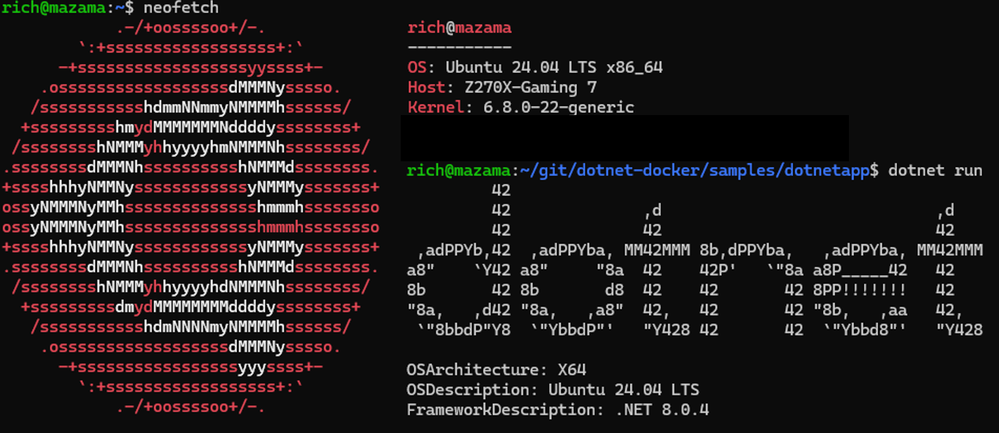

Today is launch day for [Ubuntu 24.04](https://ubuntu.com/blog/canonical-releases-ubuntu-24-04-noble-numbat), [Noble Numbat](https://ubuntu.com/blog/the-coronation-of-a-new-mascot-noble-numbat). Congratulations to our friends at Canonical. I'd say it's an auspicious day, but it is more noble than that! In fact, it is the first time that a .NET release is available from day one in the official Ubuntu feeds. There is no need to wait, you can start using .NET with Ubuntu 24.04 now.

You may remember that [.NET 6 was added to Ubuntu 22.04](https://devblogs.microsoft.com/dotnet/dotnet-6-is-now-in-ubuntu-2204/), a few months after the Ubuntu 22.04 release. We've [learned a lot](https://github.com/dotnet/core/issues/7699) since then and significantly grown the partnership between Canonical and Microsoft. Starting with Ubuntu 24.04, [Ubuntu feeds will be the official source of packages for .NET](https://github.com/dotnet/core/discussions/9258).

.NET installation [docs have been updated](https://learn.microsoft.com/dotnet/core/install/linux-ubuntu-install?tabs=dotnet8&pivots=os-linux-ubuntu-2404) to reflect the latest instructions.

Ubuntu 24.04 container images are already available, for .NET 8+. They include `noble`, `noble-chiseled`, and `noble-chiseled-extra` image flavors.



Ubuntu LTS releases are always quite popular. We're excited that .NET is part of Ubuntu 24.04 and expect a lot of .NET developers will start using these new packages and container images in the coming weeks and months.

Please register for a deep-dive talk on [Ubuntu and .NET at Build 2024](https://build.microsoft.com/sessions/fe58e8ce-6a0d-42d9-911f-9ebfe44d6dad?source=sessions).

## Packages

Installing .NET 8 on Ubuntu 24.04 is straightforward.

```bash
$ sudo apt update && sudo apt install -y dotnet-sdk-8.0
$ dotnet --version
8.0.104
```

Installing .NET 8 is the same as installing any other package available in Ubuntu. There are no extra feeds to configure.

.NET 6 and 7 are available in the [Ubuntu .NET backports package repository](https://learn.microsoft.com/dotnet/core/install/linux-ubuntu#ubuntu-net-backports-package-repository) (also maintained by Canonical).

Here's how to install .NET 6 using the `dotnet/backports` repository.

```bash
$ sudo add-apt-repository ppa:dotnet/backports
$ sudo apt install -y dotnet-sdk-6.0
$ dotnet --version
6.0.129
```

.NET 7 can be installed using the same pattern, although the `dotnet/backports` repository only needs to be registered once.

In all cases, the gestures are simpler than registering the `packages.microsoft.com` feed.

Notes:

- Install the `software-properties-common` package if `add-apt-repository` isn't found.
- The installation may also install `tzdata`, which has an [interactive install](https://askubuntu.com/questions/909277/avoiding-user-interaction-with-tzdata-when-installing-certbot-in-a-docker-contai).

## Containers

The `noble` container experience is much the same as `jammy`. The new images support [non-root](https://devblogs.microsoft.com/dotnet/securing-containers-with-rootless/), [chiseled](https://devblogs.microsoft.com/dotnet/announcing-dotnet-chiseled-containers/), and are [globalization-ready](https://devblogs.microsoft.com/dotnet/streamline-container-build-dotnet-8/#world-ready-chiseled-images).

The upgrade is quite straightforward. I can demonstrate with a [sample Dockerfile](https://github.com/dotnet/dotnet-docker/blob/1637ab7bdfe59611b1e6d4b30d636409a71c408e/samples/aspnetapp/Dockerfile.chiseled) targeting `jammy-chiseled.

```bash
$ grep jammy Dockerfile.chiseled
FROM --platform=$BUILDPLATFORM mcr.microsoft.com/dotnet/sdk:8.0-jammy AS build
FROM mcr.microsoft.com/dotnet/aspnet:8.0-jammy-chiseled
$ sed -i "s/jammy/noble/g" Dockerfile.chiseled
$ grep noble Dockerfile.chiseled
FROM --platform=$BUILDPLATFORM mcr.microsoft.com/dotnet/sdk:8.0-noble AS build
FROM mcr.microsoft.com/dotnet/aspnet:8.0-noble-chiseled
```

The images are currently in [`nightly`](https://mcr.microsoft.com/product/dotnet/nightly/aspnet/tags).

```bash
sed -i "s;/dotnet/;/dotnet/nightly/;g" Dockerfile.chiseled
```

We can now build and run a container.

```bash
$ docker build --pull -t aspnetapp -f Dockerfile.chiseled .
$ docker run --rm -it -p 8000:8080 -m 50mb --cpus .5 aspnetapp
warn: Microsoft.AspNetCore.DataProtection.Repositories.FileSystemXmlRepository[60]
      Storing keys in a directory '/home/app/.aspnet/DataProtection-Keys' that may not be persisted outside of the container. Protected data will be unavailable when container is destroyed. For more information, go to https://aka.ms/aspnet/dataprotectionwarning
warn: Microsoft.AspNetCore.DataProtection.KeyManagement.XmlKeyManager[35]
      No XML encryptor configured. Key {6326de0e-7eab-412d-9d06-eb0d019e5590} may be persisted to storage in unencrypted form.
info: Microsoft.Hosting.Lifetime[14]
      Now listening on: http://[::]:8080
```


That was a quick upgrade.

I did a quick size comparison, before and after. They are about the same.

```bash
$ docker images aspnetapp
REPOSITORY   TAG              IMAGE ID       CREATED          SIZE
aspnetapp    jammy-chiseled   d938d8ee1104   51 seconds ago   118MB
aspnetapp    noble-chiseled   e59689894c68   35 minutes ago   119MB
```

## Security and support

Microsoft and Canonical are collaborating on servicing and support. To that end, Microsoft gives security and functional fixes (via a private channel) to Canonical ahead of Patch Tuesday releases, with time for building and testing. We do the same thing with Red Hat. It's our goal that .NET fixes are available everywhere, simultaneously.

The official source of .NET packages will be via Ubuntu feeds, as already stated. That raises the question of support. You can file issues for .NET on the [dotnet8 launchpad](https://bugs.launchpad.net/ubuntu/+source/dotnet8) or in the appropriate [dotnet repo](https://github.com/dotnet/core/blob/main/Documentation/core-repos.md). If there is any ambiguity on which organization should resolve the issue, we'll handle that through our partnership.

## Closing

We're excited for .NET to be so well integrated in Ubuntu or for the strong support of our friends at Canonical. We'll continue to find and explore new ways to improve the experience of .NET on Ubuntu.
