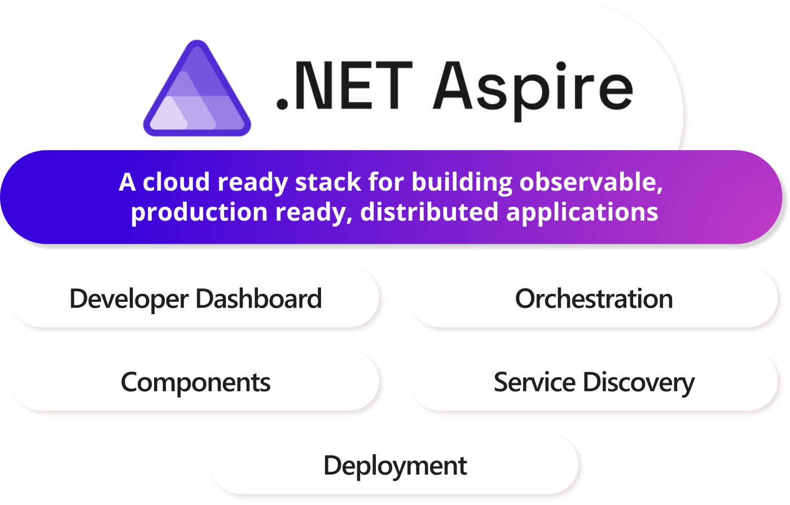
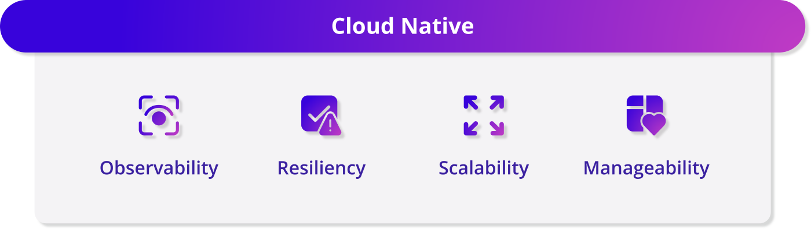
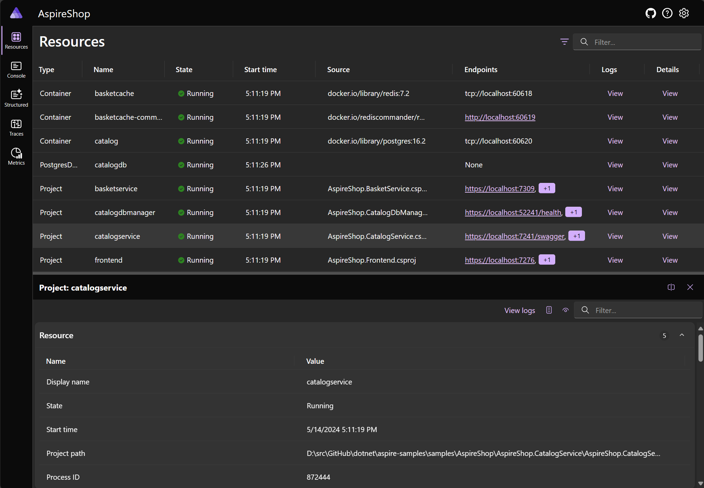
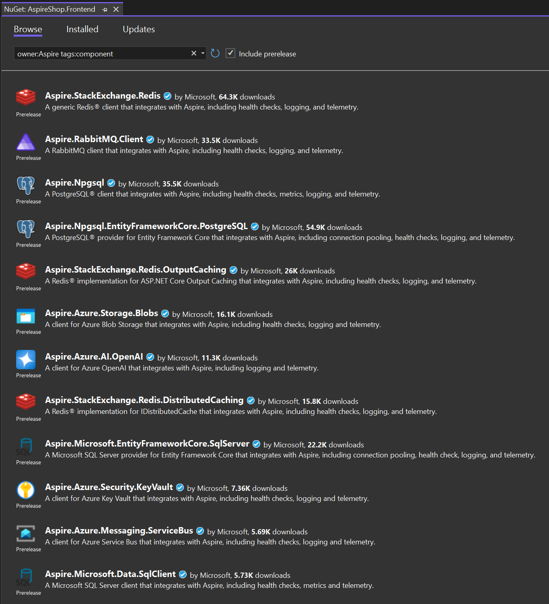

.NET Aspire is a new stack that streamlines development of .NET cloud-native services and is now generally available. You can [get started with .NET Aspire](https://learn.microsoft.com/dotnet/aspire/fundamentals/setup-tooling) today in Visual Studio 2022 17.10, the .NET CLI, or Visual Studio Code. .NET Aspire brings together tools, templates, and NuGet packages that help you build distributed applications in .NET more easily. Whether you're building a new application, adding cloud-native capabilities to an existing one, or are already deploying .NET apps to production in the cloud today, .NET Aspire can help you get there faster.



## How to get .NET Aspire

You can get started quickly with .NET Aspire:

- **.NET CLI**:

    Install the .NET Aspire workload by running `dotnet workload update` followed by `dotnet workload install aspire`. See [the documentation](https://learn.microsoft.com/dotnet/aspire/fundamentals/setup-tooling?tabs=dotnet-cli%2Cwindows#install-net-aspire) for more details.

- **Visual Studio 2022**:

    .NET Aspire is included in the **ASP.NET and web development** workload of Visual Studio 2022 17.10 as a recommended component. If you update from Visual Studio 2022 17.9 to 17.10 and you have the **ASP.NET and web development** workload enabled, you'll have everything you need to get started with .NET Aspire.

- **Visual Studio Code C# Dev Kit**:

    You'll need install the .NET Aspire workload via the .NET CLI via the details above. After that, the Visual Studio Code C# Dev Kit extension includes support for working with .NET Aspire in the latest stable release. Install the [C# Dev Kit extension from the Visual Studio Code marketplace](https://marketplace.visualstudio.com/items?itemName=ms-dotnettools.csdevkit).

## Why .NET Aspire?

It's been an ongoing aspirational goal to make .NET one of the most productive platforms for building cloud-native applications. In pursuit of this goal, we've worked alongside some of the most demanding services at Microsoft, with scaling needs unheard of for most apps, services supporting hundreds of millions of monthly active users. Working with these services to make sure we satisfied their needs ensured we had foundational capabilities that could meet the demands of high scale cloud services.



We invested in important technologies and libraries such as Health Checks, YARP, HTTP client factory, and gRPC. With Native AOT, we’re working towards a sweet spot of performance and size, and SDK Container Builds make it trivial to get any .NET app into a container and ready for the modern cloud.

But what we heard from developers is that we needed to do more. Building apps for the cloud was still too hard. Developers are increasingly pulled away from their business logic and what matters most to deal with the complexity of the cloud.

To help simplify the cloud app development experience, we’re introducing [.NET Aspire](https://dot.net/aspire), a cloud-ready stack for building observable, production ready, distributed applications.

Even if you have just a single ASP.NET Core application that communicates with a database or caching system, Aspire can improve your development experience.

## Orchestrate the local development experience with C# and the .NET Aspire App Host project

Distributed applications typically consist of many application projects, talking to each other and to some combination of hosted services such as databases, storage, caches, and messaging systems. Configuration and lifetime of these projects and services can be challenging to manage within the developer inner-loop and often involves using a different set of tools and languages.

.NET Aspire introduces an [*App Host* project](https://learn.microsoft.com/dotnet/aspire/fundamentals/app-host-overview), enabling you to use C# and familiar looking APIs to describe and configure the various application projects and hosted services that make up a distributed application. Collectively, these projects and services are called *resources* and the code in the App Host forms an *application model* of the distributed application. Launching the App Host project during the developer inner-loop will ensure all resources in the application model are configured and launched according to how they were described. Adding an App Host project is the first step in [adding .NET Aspire to an existing application](https://learn.microsoft.com/dotnet/aspire/get-started/add-aspire-existing-app).

Let's look at a sample *Program.cs* from a .NET Aspire App Host project:

```csharp
var builder = DistributedApplication.CreateBuilder(args);

var dbserver = builder.AddPostgres("dbserver")
                      .WithPgAdmin();

var catalogDb = dbserver.AddDatabase("catalogdb");

var cache = builder.AddRedis("cache")
                   .WithRedisCommander();

var catalogApi = builder.AddProject<Projects.AspireShop_CatalogApi>("catalogapi")
                        .WithReference(catalogDb);

builder.AddProject<Projects.AspireShop_WebFrontend>("webfrontend")
       .WithExternalHttpEndpoints()
       .WithReference(cache)
       .WithReference(catalogApi);

builder.Build().Run();
```

This example file:

- Adds a [PostgreSQL](https://www.postgresql.org/) server resource with a child database resource
- Enables the [pgAdmin](https://www.pgadmin.org/) administrator tool for the PostgreSQL server
- Adds a [Redis](https://redis.io/) server resource
- Enables the [Redis Commander](https://joeferner.github.io/redis-commander/) administrator tool for the Redis server
- Adds two projects to the application model: a web API project and a Blazor web frontend project
- Declares that the API project [references](https://learn.microsoft.com/dotnet/aspire/fundamentals/app-host-overview#reference-resources) the PostgreSQL database resource
- Declares that the web frontend project references the web API project and the Redis cache
- Declares that the web frontend project should be externally accessible (i.e. from the internet)

Launching this App Host project will automatically start containers to host the PostgreSQL and Redis servers, and inject the necessary configuration values into the web API and web frontend applications so that they can communicate, including [connection strings and URLs](https://learn.microsoft.com/dotnet/aspire/fundamentals/app-host-overview#connection-string-and-endpoint-references). If launching in an environment that supports debugging (e.g. Visual Studio), the debugger will be attached to each project that was described in the application model.

The App Host project has two execution modes: **run** and **publish**. Run is used during the developer inner-loop to facilitate the launch experience described above. In publish mode, a [manifest file](https://learn.microsoft.com/dotnet/aspire/deployment/overview#deployment-manifest) is produced, that statically describes the application model and is intended to be used to optionally enhance deployment scenarios with the information from the application model. The App Host project itself is not deployed and does not run outside of dev/test scenarios.

Along with the [base resource types](https://learn.microsoft.com/dotnet/aspire/fundamentals/app-host-overview#built-in-resource-types) of containers, executables, and .NET projects, .NET Aspire ships with hosting extensions for [integrating Node.js based applications including those using common SPA frameworks](https://learn.microsoft.com/dotnet/aspire/get-started/build-aspire-apps-with-nodejs), and many common container and cloud based services [in NuGet packages](https://www.nuget.org/packages?q=owner%3Aaspire+tag%3Ahosting&includeComputedFrameworks=true&prerel=true&sortby=relevance), including Redis, PostgreSQL, MySQL, SQL Server, Oracle, MongoDB, RabbitMQ, NATS, [and more](https://learn.microsoft.com/dotnet/aspire/fundamentals/app-host-overview#apis-for-adding-and-expressing-resources), along with support for cloud services in [Azure](https://www.nuget.org/packages?q=owner%3Aaspire+tag%3Ahosting+azure&includeComputedFrameworks=true&prerel=true&sortby=relevance) and [AWS](https://www.nuget.org/packages?q=owner%3Aaspire+tag%3Ahosting+aws&includeComputedFrameworks=true&prerel=true&sortby=relevance).

Extending .NET Aspire with your own hosting extensions for existing containers can be done easily with C#, like [this example for MailDev in the .NET Aspire extensibility documentation](https://learn.microsoft.com/dotnet/aspire/extensibility/custom-resources?tabs=windows), or [this example for KeyCloak in the eShop App Building workshop](https://github.com/dotnet-presentations/eshop-app-workshop/blob/dbd252194662d46ec8ba0fc03e4dc2d3d7c036a0/src/eShop.AppHost/KeycloakResource.cs).

Once launched, rich details about all the orchestrated resources in the application model are visible on the web-based Aspire Dashboard.



## The Aspire Dashboard: the easiest way to see your application's OpenTelemetry data

.NET Aspire includes a web-based dashboard that displays useful details about your running application during the developer inner-loop, including the resources in the application model and their endpoints, environment variables, and console logs. It also displays [OpenTelemetry](https://opentelemetry.io/) data sent by resources, including the structured logs, distributed traces, and metrics information this data contains. Note that this data is only kept in-memory and is size-limited, as the dashboard is only intended to give a close to real-time view of what's happening right now, and not to replace a fully featured APM system.

OpenTelemetry is an open-source observability ecosystem with [wide support from multiple vendors](https://opentelemetry.io/ecosystem/vendors/). It is a collection of APIs, SDKs, and tools that allow you to instrument, generate, collect, and export telemetry data (metrics, logs, and traces) to help you analyze your software’s performance and behavior. The .NET Aspire Dashboard is one of the easiest ways to observe OpenTelemetry data from any application and even supports [running in a standalone mode](https://learn.microsoft.com/dotnet/aspire/fundamentals/dashboard/overview#standalone-mode) separate from the rest of .NET Aspire.

Additionally, Azure Container Apps can make the Aspire Dashboard available in environments hosting .NET Aspire applications deployed with the Azure Developer CLI. See [their post](https://aka.ms/aca/aspireblog) for more details.

[video width="1224" height="866" mp4="https://devblogs.microsoft.com/dotnet/wp-content/uploads/sites/10/2024/05/aspire-dashboard.mp4" poster="https://devblogs.microsoft.com/dotnet/wp-content/uploads/sites/10/2024/05/aspire-dashboard-video-thumb.png"][/video]

## Make database, messaging, cache, & cloud service connections resilient & observable using .NET Aspire Components

Applications connecting to external services need to be resilient to transient failures in order to be more reliable. In addition, making the application status observable such that it can be monitored for issues and reacted to by infrastructure is critical to building scalable services in the cloud. Often though, adding these capabilities involves manually discovering, installing, and configuring numerous NuGet packages in addition to the package containing the actual client library, along with adding boilerplate code to make these aspects configurable for different environments without needing to change values in the application code.

[.NET Aspire Components](https://learn.microsoft.com/dotnet/aspire/fundamentals/components-overview) are NuGet packages that integrate common client libraries for database, messaging, caching, and cloud services into your applications with critical features for resiliency and observability enabled by default, and wired up to support configuration without code changes. Components pull in the extra dependencies required to configure client libraries with the application's dependency injection and configuration systems, along with registering [health checks](https://learn.microsoft.com/dotnet/aspire/fundamentals/health-checks) and OpenTelemetry providers for capturing [logs, traces, and metrics](https://learn.microsoft.com/dotnet/aspire/fundamentals/telemetry). Where available, they also default-enable the client libraries' resiliency features, like retries.

.NET Aspire is [launching with components](https://learn.microsoft.com/dotnet/aspire/fundamentals/components-overview#available-components) for connecting to many database, messaging, cache, and cloud services using the client libraries you likely already use today:



## Connect to the cloud with .NET Aspire

.NET Aspire makes it easy to provision resources or connect to existing resources running in the cloud during development. This unique ability makes it simple to express in C# which resources you need to be provisioned to support running your application in the development inner-loop and have .NET Aspire coordinate the provisioning of those resources when you launch the App Host project.

See [Local Azure provisioning](https://learn.microsoft.com/dotnet/aspire/deployment/azure/local-provisioning) for more details about using .NET Aspire to coordinate provisioning of Azure resources for local development.

.NET Aspire also enables new capabilities when it comes to deploying your applications to the cloud or your own Kubernetes instance, utilizing the application model details provided by the App Host project. While .NET Aspire **does not require you to change anything about how you currently deploy**, as the individual projects in your .NET Aspire solution are still regular ASP.NET Core and projects, the App Host project facilitates new deployment experiences when using deployment toolchains that have been updated to utilize it.

For example, the [Azure Developer CLI (azd)](https://learn.microsoft.com/azure/developer/azure-developer-cli/) has native support for directly deploying the resources described in a .NET Aspire App Host project to [Azure Container Apps](https://learn.microsoft.com/azure/container-apps/), and Visual Studio includes support for coordinating a publish to Azure using azd directly from Solution Explorer. Consult [the documentation for more details](https://learn.microsoft.com/dotnet/aspire/deployment/overview#deploy-to-azure).

[Deploying to Kubernetes](https://learn.microsoft.com/dotnet/aspire/deployment/overview#deploy-to-kubernetes) can be done using the [community-built tool Aspir8](https://learn.microsoft.com/dotnet/aspire/deployment/overview#the-aspir8-project), which provides a simple command-line based experience for deploying the resources described by a .NET Aspire App Host.

## Learn more

### Documentation & Samples

Be sure to check out the [.NET Aspire documentation home on Microsoft Learn](https://learn.microsoft.com/dotnet/aspire/), including the [Quickstart detailing how to build your first .NET Aspire application](https://learn.microsoft.com/dotnet/aspire/get-started/build-your-first-aspire-app).

For code-based samples, check out the [samples browser for .NET Aspire](https://learn.microsoft.com/samples/browse/?expanded=dotnet&terms=aspire) which details the samples available in the [.NET Aspire samples GitHub repo](https://github.com/dotnet/aspire-samples).

### Sessions at MS Build

For those attending Microsoft Build this year, either physically or virtually, there are [a number of sessions that will help you learn more about .NET Aspire](https://build.microsoft.com/sessions?search=aspire&sortBy=relevance). If you're attending in person, be sure to check out the [hands-on lab](https://build.microsoft.com/sessions/21c8c399-0ec0-427e-a4b0-90b0fcddac84?source=sessions) where you can get first-hand experience with .NET Aspire with in-person support.

### Video shorts

Today, we're launching a series of short videos hosted by members of the .NET Aspire team, introducing key aspects of .NET Aspire, including the App Host project, dashboard, service defaults, service discovery, OpenTelemetry, and more. Check them out at https://aka.ms/aspire/videos.
<iframe width="800" height="450" src="https://www.youtube.com/embed/videoseries?si=_ZWgdpsmTeFlRaFe&amp;list=PLdo4fOcmZ0oUfIayQMrRqaSL55Rkck-GD" title="YouTube video player" frameborder="0" allow="accelerometer; autoplay; clipboard-write; encrypted-media; gyroscope; picture-in-picture; web-share" referrerpolicy="strict-origin-when-cross-origin" allowfullscreen></iframe>

### Learn Path

If you're looking for a guided approach to learning about .NET Aspire, check out the [.NET Aspire Learn Path](https://aka.ms/aspire/learn), with the introductory modules launching today.

## Summary & giving feedback

 We're incredibly grateful for all the great feedback and contributions we've already received from customers using previews of .NET Aspire since we first announced it last November, including [over 100 pull-requests](https://github.com/dotnet/aspire/pulls?q=is%3Apr+label%3Acommunity-contribution+-author%3Aapp%2Fdependabot+is%3Aclosed) from users in the community! We invite you to [share feedback](https://github.com/dotnet/aspire/issues), [have discussions](https://github.com/dotnet/aspire/discussions), and welcome [code contributions](https://github.com/dotnet/aspire/pulls) over on the [.NET Aspire GitHub repo](https://github.com/dotnet/aspire). For those on Discord, there's already an [active community of .NET Aspire users over on the DotNetEvolution Discord server](https://discord.com/channels/732297728826277939/759125320505884752).

We've really enjoyed working on .NET Aspire and look forward to hearing about your experience using it.
