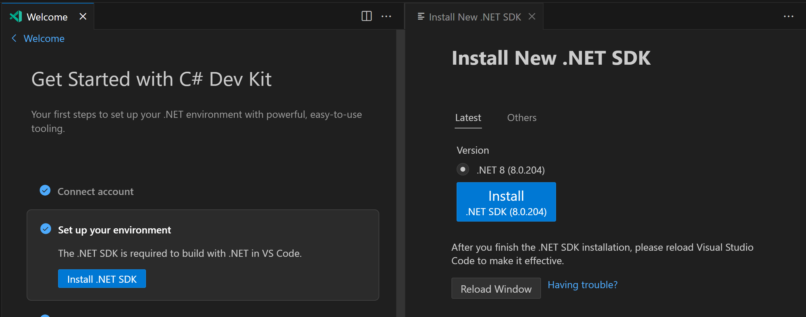

We are excited to announce the May release of C# Dev Kit, the official extension for C# development in Visual Studio Code. This release brings you several new features and improvements that will make your C# coding experience more productive and enjoyable. In this blog post, we will go over some of the highlights of this release and show you how to use them in your projects.

## Add, update, and remove NuGet packages

NuGet is the package manager for .NET that allows you to easily install, update, and remove libraries and frameworks that you need for your applications. With the April release of C# Dev Kit, you can now manage your NuGet packages directly from Visual Studio Code using the new commands in the command palette.
To add a NuGet package to your project, use the command “NuGet: Add NuGet Package”. If you have more than one project in your solution, you will be asked to select which project you want to add the package to. Then you can search for packages by name. Then select the version you want to apply. Once you select a package, C# Dev Kit will add it to your project and update your project file and references.
To update or remove a NuGet package from your project, use the commands “NuGet: Update NuGet Package” and “NuGet: Remove NuGet Package.” These commands will show you a list of the packages that are currently installed in your project and let you choose which ones you want to update or remove. C# Dev Kit will then perform the necessary changes and update your project file and references.
Here is an example of how to use the commands to add, update, and remove NuGet packages in Visual Studio Code:

<video width="520" height="240" controls>
  <source src="NuGetAdd.mp4" type="video/mp4">
</video>

## Run/debug .NET Aspire applications

.NET Aspire is a new initiative that aims to inspire and empower developers to build cloud-native applications with .NET. .NET Aspire provides a set of tools, resources, and guidance to help you learn and apply the best practices of cloud development with .NET.
With the May release of C# Dev Kit, you can now launch all projects in a .NET Aspire from Visual Studio Code. To launch your .NET Aspire application, simply Ctrl-F5 (Run without debugging). This will launch the app host project and all the associated projects in your .NET Aspire application (front-end and APIs). Similarly, you can debug your .NET Aspire application, simply F5 (Start debugging) and all the projects will attach to the debugger, allowing you to have breakpoints set across projects and each one will be hit when appropriate.
Here is an example of how to debug a .NET Aspire application:

<video width="520" height="240" controls>
  <source src="LaunchAspire.mp4" type="video/mp4">
</video>

## See the active document in Solution Explorer

The Solution Explorer is the tool window that shows you the structure and organization of your solution and its projects and files. If you have a large solution with many projects and files, you may sometimes lose track of where the current document is in the Solution Explorer.
With the new command “.NET: Sync with Active Document”, you can quickly navigate to the active document in the Solution Explorer. The active document is the document that is currently open and focused in the editor. To use the command, you can invoke it from the command palette. The command will then expand tree and highlight the active document in the Solution Explorer and scroll to it if necessary.
Also, if you want the active document to always be highlighted in the Solution Explorer, you can enable the setting "dotnet.automaticallySyncWithActiveItem" and when you change your active document, the new document will be highlighted in Solution Explorer.
Here is an example of how to use the command to see the active document in Solution Explorer:

<video width="520" height="240" controls>
  <source src="SyncActiveDocument.mp4" type="video/mp4">
</video>

## Acquiring the SDK within Visual Studio Code

For those just getting started with .NET, we are working to simplify the SDK acquisition experience in C# Dev Kit.

Now, when you go to the C# Dev Kit Walkthrough and click on Install .NET SDK in the "Set up your environment" section, you will get a fully integrated SDK install experience within VS Code.

These are just some of the new features and enhancements in the April release of C# Dev Kit. To learn more about what's new and what's coming next, check out the [iteration plan in our GitHub repo]( https://github.com/microsoft/vscode-dotnettools/issues/1085). We hope you enjoy this release, and we would love to hear your feedback and suggestions. Please Report an issue through VS Code, open an [issue on GitHub]( https://github.com/microsoft/vscode-dotnettools/issues), or leave a comment below. Happy coding!